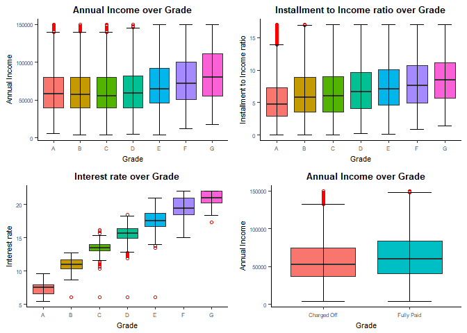
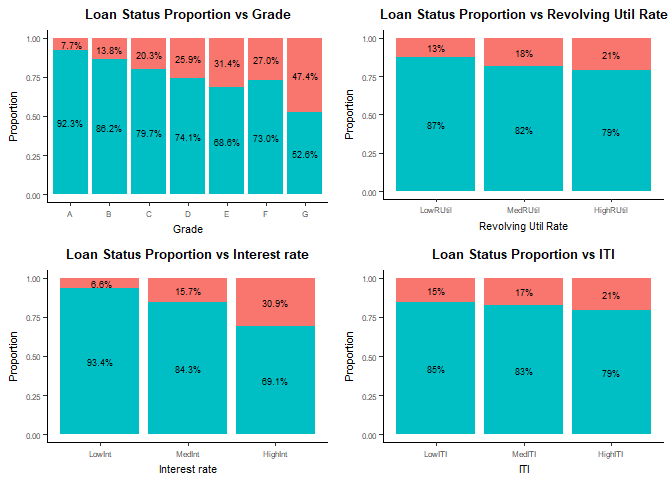
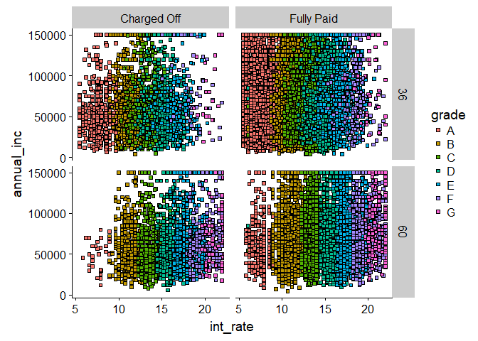

A Case Study on Lending Club Loans
==================================

------------------------------------------------------------------------

**Business Understanding:**

Lending Club (LC) is a peer-to-peer online lending platform connecting borrowers and investors, enabling borrowers to obtain a loan, and investors to purchase notes backed by payments made on loans. More on [Lending Club](https://en.wikipedia.org/wiki/Lending_Club)

**Objective:** To minimise the risk of losing money while lending to customers by identifying risky loan applicants using Exploratory Data Analysis

*Check and Import required libraries*

``` r
libs = c("tidyverse", "lubridate", "formattable","corrplot", "cowplot", 
         "data.table")
install.lib <- libs[!libs %in% installed.packages()]
for (pkg in install.lib) 
  install.packages(pkg, dependencies = T)
loadlib     <- lapply(libs, library, character.only = T) # load them
remove(list = ls())
```

*Import input file*

``` r
loan <- loan_master <- read_csv("loan.csv")
```

    ## Parsed with column specification:
    ## cols(
    ##   .default = col_character(),
    ##   id = col_integer(),
    ##   member_id = col_integer(),
    ##   loan_amnt = col_integer(),
    ##   funded_amnt = col_integer(),
    ##   funded_amnt_inv = col_double(),
    ##   installment = col_double(),
    ##   annual_inc = col_double(),
    ##   dti = col_double(),
    ##   delinq_2yrs = col_integer(),
    ##   inq_last_6mths = col_integer(),
    ##   mths_since_last_delinq = col_integer(),
    ##   mths_since_last_record = col_integer(),
    ##   open_acc = col_integer(),
    ##   pub_rec = col_integer(),
    ##   revol_bal = col_integer(),
    ##   total_acc = col_integer(),
    ##   out_prncp = col_double(),
    ##   out_prncp_inv = col_double(),
    ##   total_pymnt = col_double(),
    ##   total_pymnt_inv = col_double()
    ##   # ... with 13 more columns
    ## )

    ## See spec(...) for full column specifications.

Looking at the data

``` r
dim(loan)                                    
```

    ## [1] 39717   111

``` r
glimpse(loan)
```

    ## Observations: 39,717
    ## Variables: 111
    ## $ id                             <int> 1077501, 1077430, 1077175, 1076...
    ## $ member_id                      <int> 1296599, 1314167, 1313524, 1277...
    ## $ loan_amnt                      <int> 5000, 2500, 2400, 10000, 3000, ...
    ## $ funded_amnt                    <int> 5000, 2500, 2400, 10000, 3000, ...
    ## $ funded_amnt_inv                <dbl> 4975.00, 2500.00, 2400.00, 1000...
    ## $ term                           <chr> "36 months", "60 months", "36 m...
    ## $ int_rate                       <chr> "10.65%", "15.27%", "15.96%", "...
    ## $ installment                    <dbl> 162.87, 59.83, 84.33, 339.31, 6...
    ## $ grade                          <chr> "B", "C", "C", "C", "B", "A", "...
    ## $ sub_grade                      <chr> "B2", "C4", "C5", "C1", "B5", "...
    ## $ emp_title                      <chr> NA, "Ryder", NA, "AIR RESOURCES...
    ## $ emp_length                     <chr> "10+ years", "< 1 year", "10+ y...
    ## $ home_ownership                 <chr> "RENT", "RENT", "RENT", "RENT",...
    ## $ annual_inc                     <dbl> 24000.00, 30000.00, 12252.00, 4...
    ## $ verification_status            <chr> "Verified", "Source Verified", ...
    ## $ issue_d                        <chr> "Dec-11", "Dec-11", "Dec-11", "...
    ## $ loan_status                    <chr> "Fully Paid", "Charged Off", "F...
    ## $ pymnt_plan                     <chr> "n", "n", "n", "n", "n", "n", "...
    ## $ url                            <chr> "https://lendingclub.com/browse...
    ## $ desc                           <chr> "Borrower added on 12/22/11 > I...
    ## $ purpose                        <chr> "credit_card", "car", "small_bu...
    ## $ title                          <chr> "Computer", "bike", "real estat...
    ## $ zip_code                       <chr> "860xx", "309xx", "606xx", "917...
    ## $ addr_state                     <chr> "AZ", "GA", "IL", "CA", "OR", "...
    ## $ dti                            <dbl> 27.65, 1.00, 8.72, 20.00, 17.94...
    ## $ delinq_2yrs                    <int> 0, 0, 0, 0, 0, 0, 0, 0, 0, 0, 0...
    ## $ earliest_cr_line               <chr> "Jan-85", "Apr-99", "Nov-01", "...
    ## $ inq_last_6mths                 <int> 1, 5, 2, 1, 0, 3, 1, 2, 2, 0, 2...
    ## $ mths_since_last_delinq         <int> NA, NA, NA, 35, 38, NA, NA, NA,...
    ## $ mths_since_last_record         <int> NA, NA, NA, NA, NA, NA, NA, NA,...
    ## $ open_acc                       <int> 3, 3, 2, 10, 15, 9, 7, 4, 11, 2...
    ## $ pub_rec                        <int> 0, 0, 0, 0, 0, 0, 0, 0, 0, 0, 0...
    ## $ revol_bal                      <int> 13648, 1687, 2956, 5598, 27783,...
    ## $ revol_util                     <chr> "83.70%", "9.40%", "98.50%", "2...
    ## $ total_acc                      <int> 9, 4, 10, 37, 38, 12, 11, 4, 13...
    ## $ initial_list_status            <chr> "f", "f", "f", "f", "f", "f", "...
    ## $ out_prncp                      <dbl> 0.00, 0.00, 0.00, 0.00, 524.06,...
    ## $ out_prncp_inv                  <dbl> 0.00, 0.00, 0.00, 0.00, 524.06,...
    ## $ total_pymnt                    <dbl> 5863.155, 1008.710, 3005.667, 1...
    ## $ total_pymnt_inv                <dbl> 5833.84, 1008.71, 3005.67, 1223...
    ## $ total_rec_prncp                <dbl> 5000.00, 456.46, 2400.00, 10000...
    ## $ total_rec_int                  <dbl> 863.16, 435.17, 605.67, 2214.92...
    ## $ total_rec_late_fee             <dbl> 0.00, 0.00, 0.00, 16.97, 0.00, ...
    ## $ recoveries                     <dbl> 0.00, 117.08, 0.00, 0.00, 0.00,...
    ## $ collection_recovery_fee        <dbl> 0.0000, 1.1100, 0.0000, 0.0000,...
    ## $ last_pymnt_d                   <chr> "Jan-15", "Apr-13", "Jun-14", "...
    ## $ last_pymnt_amnt                <dbl> 171.62, 119.66, 649.91, 357.48,...
    ## $ next_pymnt_d                   <chr> NA, NA, NA, NA, "Jun-16", NA, N...
    ## $ last_credit_pull_d             <chr> "May-16", "Sep-13", "May-16", "...
    ## $ collections_12_mths_ex_med     <int> 0, 0, 0, 0, 0, 0, 0, 0, 0, 0, 0...
    ## $ mths_since_last_major_derog    <chr> NA, NA, NA, NA, NA, NA, NA, NA,...
    ## $ policy_code                    <int> 1, 1, 1, 1, 1, 1, 1, 1, 1, 1, 1...
    ## $ application_type               <chr> "INDIVIDUAL", "INDIVIDUAL", "IN...
    ## $ annual_inc_joint               <chr> NA, NA, NA, NA, NA, NA, NA, NA,...
    ## $ dti_joint                      <chr> NA, NA, NA, NA, NA, NA, NA, NA,...
    ## $ verification_status_joint      <chr> NA, NA, NA, NA, NA, NA, NA, NA,...
    ## $ acc_now_delinq                 <int> 0, 0, 0, 0, 0, 0, 0, 0, 0, 0, 0...
    ## $ tot_coll_amt                   <chr> NA, NA, NA, NA, NA, NA, NA, NA,...
    ## $ tot_cur_bal                    <chr> NA, NA, NA, NA, NA, NA, NA, NA,...
    ## $ open_acc_6m                    <chr> NA, NA, NA, NA, NA, NA, NA, NA,...
    ## $ open_il_6m                     <chr> NA, NA, NA, NA, NA, NA, NA, NA,...
    ## $ open_il_12m                    <chr> NA, NA, NA, NA, NA, NA, NA, NA,...
    ## $ open_il_24m                    <chr> NA, NA, NA, NA, NA, NA, NA, NA,...
    ## $ mths_since_rcnt_il             <chr> NA, NA, NA, NA, NA, NA, NA, NA,...
    ## $ total_bal_il                   <chr> NA, NA, NA, NA, NA, NA, NA, NA,...
    ## $ il_util                        <chr> NA, NA, NA, NA, NA, NA, NA, NA,...
    ## $ open_rv_12m                    <chr> NA, NA, NA, NA, NA, NA, NA, NA,...
    ## $ open_rv_24m                    <chr> NA, NA, NA, NA, NA, NA, NA, NA,...
    ## $ max_bal_bc                     <chr> NA, NA, NA, NA, NA, NA, NA, NA,...
    ## $ all_util                       <chr> NA, NA, NA, NA, NA, NA, NA, NA,...
    ## $ total_rev_hi_lim               <chr> NA, NA, NA, NA, NA, NA, NA, NA,...
    ## $ inq_fi                         <chr> NA, NA, NA, NA, NA, NA, NA, NA,...
    ## $ total_cu_tl                    <chr> NA, NA, NA, NA, NA, NA, NA, NA,...
    ## $ inq_last_12m                   <chr> NA, NA, NA, NA, NA, NA, NA, NA,...
    ## $ acc_open_past_24mths           <chr> NA, NA, NA, NA, NA, NA, NA, NA,...
    ## $ avg_cur_bal                    <chr> NA, NA, NA, NA, NA, NA, NA, NA,...
    ## $ bc_open_to_buy                 <chr> NA, NA, NA, NA, NA, NA, NA, NA,...
    ## $ bc_util                        <chr> NA, NA, NA, NA, NA, NA, NA, NA,...
    ## $ chargeoff_within_12_mths       <int> 0, 0, 0, 0, 0, 0, 0, 0, 0, 0, 0...
    ## $ delinq_amnt                    <int> 0, 0, 0, 0, 0, 0, 0, 0, 0, 0, 0...
    ## $ mo_sin_old_il_acct             <chr> NA, NA, NA, NA, NA, NA, NA, NA,...
    ## $ mo_sin_old_rev_tl_op           <chr> NA, NA, NA, NA, NA, NA, NA, NA,...
    ## $ mo_sin_rcnt_rev_tl_op          <chr> NA, NA, NA, NA, NA, NA, NA, NA,...
    ## $ mo_sin_rcnt_tl                 <chr> NA, NA, NA, NA, NA, NA, NA, NA,...
    ## $ mort_acc                       <chr> NA, NA, NA, NA, NA, NA, NA, NA,...
    ## $ mths_since_recent_bc           <chr> NA, NA, NA, NA, NA, NA, NA, NA,...
    ## $ mths_since_recent_bc_dlq       <chr> NA, NA, NA, NA, NA, NA, NA, NA,...
    ## $ mths_since_recent_inq          <chr> NA, NA, NA, NA, NA, NA, NA, NA,...
    ## $ mths_since_recent_revol_delinq <chr> NA, NA, NA, NA, NA, NA, NA, NA,...
    ## $ num_accts_ever_120_pd          <chr> NA, NA, NA, NA, NA, NA, NA, NA,...
    ## $ num_actv_bc_tl                 <chr> NA, NA, NA, NA, NA, NA, NA, NA,...
    ## $ num_actv_rev_tl                <chr> NA, NA, NA, NA, NA, NA, NA, NA,...
    ## $ num_bc_sats                    <chr> NA, NA, NA, NA, NA, NA, NA, NA,...
    ## $ num_bc_tl                      <chr> NA, NA, NA, NA, NA, NA, NA, NA,...
    ## $ num_il_tl                      <chr> NA, NA, NA, NA, NA, NA, NA, NA,...
    ## $ num_op_rev_tl                  <chr> NA, NA, NA, NA, NA, NA, NA, NA,...
    ## $ num_rev_accts                  <chr> NA, NA, NA, NA, NA, NA, NA, NA,...
    ## $ num_rev_tl_bal_gt_0            <chr> NA, NA, NA, NA, NA, NA, NA, NA,...
    ## $ num_sats                       <chr> NA, NA, NA, NA, NA, NA, NA, NA,...
    ## $ num_tl_120dpd_2m               <chr> NA, NA, NA, NA, NA, NA, NA, NA,...
    ## $ num_tl_30dpd                   <chr> NA, NA, NA, NA, NA, NA, NA, NA,...
    ## $ num_tl_90g_dpd_24m             <chr> NA, NA, NA, NA, NA, NA, NA, NA,...
    ## $ num_tl_op_past_12m             <chr> NA, NA, NA, NA, NA, NA, NA, NA,...
    ## $ pct_tl_nvr_dlq                 <chr> NA, NA, NA, NA, NA, NA, NA, NA,...
    ## $ percent_bc_gt_75               <chr> NA, NA, NA, NA, NA, NA, NA, NA,...
    ## $ pub_rec_bankruptcies           <int> 0, 0, 0, 0, 0, 0, 0, 0, 0, 0, 0...
    ## $ tax_liens                      <int> 0, 0, 0, 0, 0, 0, 0, 0, 0, 0, 0...
    ## $ tot_hi_cred_lim                <chr> NA, NA, NA, NA, NA, NA, NA, NA,...
    ## $ total_bal_ex_mort              <chr> NA, NA, NA, NA, NA, NA, NA, NA,...
    ## $ total_bc_limit                 <chr> NA, NA, NA, NA, NA, NA, NA, NA,...
    ## $ total_il_high_credit_limit     <chr> NA, NA, NA, NA, NA, NA, NA, NA,...

``` r
summary(loan)
```

    ##        id            member_id         loan_amnt      funded_amnt   
    ##  Min.   :  54734   Min.   :  70699   Min.   :  500   Min.   :  500  
    ##  1st Qu.: 516221   1st Qu.: 666780   1st Qu.: 5500   1st Qu.: 5400  
    ##  Median : 665665   Median : 850812   Median :10000   Median : 9600  
    ##  Mean   : 683132   Mean   : 850464   Mean   :11219   Mean   :10948  
    ##  3rd Qu.: 837755   3rd Qu.:1047339   3rd Qu.:15000   3rd Qu.:15000  
    ##  Max.   :1077501   Max.   :1314167   Max.   :35000   Max.   :35000  
    ##                                                                     
    ##  funded_amnt_inv     term             int_rate          installment     
    ##  Min.   :    0   Length:39717       Length:39717       Min.   :  15.69  
    ##  1st Qu.: 5000   Class :character   Class :character   1st Qu.: 167.02  
    ##  Median : 8975   Mode  :character   Mode  :character   Median : 280.22  
    ##  Mean   :10397                                         Mean   : 324.56  
    ##  3rd Qu.:14400                                         3rd Qu.: 430.78  
    ##  Max.   :35000                                         Max.   :1305.19  
    ##                                                                         
    ##     grade            sub_grade          emp_title        
    ##  Length:39717       Length:39717       Length:39717      
    ##  Class :character   Class :character   Class :character  
    ##  Mode  :character   Mode  :character   Mode  :character  
    ##                                                          
    ##                                                          
    ##                                                          
    ##                                                          
    ##   emp_length        home_ownership       annual_inc     
    ##  Length:39717       Length:39717       Min.   :   4000  
    ##  Class :character   Class :character   1st Qu.:  40404  
    ##  Mode  :character   Mode  :character   Median :  59000  
    ##                                        Mean   :  68969  
    ##                                        3rd Qu.:  82300  
    ##                                        Max.   :6000000  
    ##                                                         
    ##  verification_status   issue_d          loan_status       
    ##  Length:39717        Length:39717       Length:39717      
    ##  Class :character    Class :character   Class :character  
    ##  Mode  :character    Mode  :character   Mode  :character  
    ##                                                           
    ##                                                           
    ##                                                           
    ##                                                           
    ##   pymnt_plan            url                desc          
    ##  Length:39717       Length:39717       Length:39717      
    ##  Class :character   Class :character   Class :character  
    ##  Mode  :character   Mode  :character   Mode  :character  
    ##                                                          
    ##                                                          
    ##                                                          
    ##                                                          
    ##    purpose             title             zip_code        
    ##  Length:39717       Length:39717       Length:39717      
    ##  Class :character   Class :character   Class :character  
    ##  Mode  :character   Mode  :character   Mode  :character  
    ##                                                          
    ##                                                          
    ##                                                          
    ##                                                          
    ##   addr_state             dti         delinq_2yrs      earliest_cr_line  
    ##  Length:39717       Min.   : 0.00   Min.   : 0.0000   Length:39717      
    ##  Class :character   1st Qu.: 8.17   1st Qu.: 0.0000   Class :character  
    ##  Mode  :character   Median :13.40   Median : 0.0000   Mode  :character  
    ##                     Mean   :13.32   Mean   : 0.1465                     
    ##                     3rd Qu.:18.60   3rd Qu.: 0.0000                     
    ##                     Max.   :29.99   Max.   :11.0000                     
    ##                                                                         
    ##  inq_last_6mths   mths_since_last_delinq mths_since_last_record
    ##  Min.   :0.0000   Min.   :  0.0          Min.   :  0.0         
    ##  1st Qu.:0.0000   1st Qu.: 18.0          1st Qu.: 22.0         
    ##  Median :1.0000   Median : 34.0          Median : 90.0         
    ##  Mean   :0.8692   Mean   : 35.9          Mean   : 69.7         
    ##  3rd Qu.:1.0000   3rd Qu.: 52.0          3rd Qu.:104.0         
    ##  Max.   :8.0000   Max.   :120.0          Max.   :129.0         
    ##                   NA's   :25682          NA's   :36931         
    ##     open_acc         pub_rec          revol_bal       revol_util       
    ##  Min.   : 2.000   Min.   :0.00000   Min.   :     0   Length:39717      
    ##  1st Qu.: 6.000   1st Qu.:0.00000   1st Qu.:  3703   Class :character  
    ##  Median : 9.000   Median :0.00000   Median :  8850   Mode  :character  
    ##  Mean   : 9.294   Mean   :0.05507   Mean   : 13383                     
    ##  3rd Qu.:12.000   3rd Qu.:0.00000   3rd Qu.: 17058                     
    ##  Max.   :44.000   Max.   :4.00000   Max.   :149588                     
    ##                                                                        
    ##    total_acc     initial_list_status   out_prncp       out_prncp_inv    
    ##  Min.   : 2.00   Length:39717        Min.   :   0.00   Min.   :   0.00  
    ##  1st Qu.:13.00   Class :character    1st Qu.:   0.00   1st Qu.:   0.00  
    ##  Median :20.00   Mode  :character    Median :   0.00   Median :   0.00  
    ##  Mean   :22.09                       Mean   :  51.23   Mean   :  50.99  
    ##  3rd Qu.:29.00                       3rd Qu.:   0.00   3rd Qu.:   0.00  
    ##  Max.   :90.00                       Max.   :6311.47   Max.   :6307.37  
    ##                                                                         
    ##   total_pymnt    total_pymnt_inv total_rec_prncp total_rec_int    
    ##  Min.   :    0   Min.   :    0   Min.   :    0   Min.   :    0.0  
    ##  1st Qu.: 5577   1st Qu.: 5112   1st Qu.: 4600   1st Qu.:  662.2  
    ##  Median : 9900   Median : 9287   Median : 8000   Median : 1348.9  
    ##  Mean   :12154   Mean   :11567   Mean   : 9793   Mean   : 2263.7  
    ##  3rd Qu.:16534   3rd Qu.:15799   3rd Qu.:13653   3rd Qu.: 2833.4  
    ##  Max.   :58564   Max.   :58564   Max.   :35000   Max.   :23563.7  
    ##                                                                   
    ##  total_rec_late_fee   recoveries       collection_recovery_fee
    ##  Min.   :  0.000    Min.   :    0.00   Min.   :   0.00        
    ##  1st Qu.:  0.000    1st Qu.:    0.00   1st Qu.:   0.00        
    ##  Median :  0.000    Median :    0.00   Median :   0.00        
    ##  Mean   :  1.363    Mean   :   95.22   Mean   :  12.41        
    ##  3rd Qu.:  0.000    3rd Qu.:    0.00   3rd Qu.:   0.00        
    ##  Max.   :180.200    Max.   :29623.35   Max.   :7002.19        
    ##                                                               
    ##  last_pymnt_d       last_pymnt_amnt   next_pymnt_d      
    ##  Length:39717       Min.   :    0.0   Length:39717      
    ##  Class :character   1st Qu.:  218.7   Class :character  
    ##  Mode  :character   Median :  546.1   Mode  :character  
    ##                     Mean   : 2678.8                     
    ##                     3rd Qu.: 3293.2                     
    ##                     Max.   :36115.2                     
    ##                                                         
    ##  last_credit_pull_d collections_12_mths_ex_med mths_since_last_major_derog
    ##  Length:39717       Min.   :0                  Length:39717               
    ##  Class :character   1st Qu.:0                  Class :character           
    ##  Mode  :character   Median :0                  Mode  :character           
    ##                     Mean   :0                                             
    ##                     3rd Qu.:0                                             
    ##                     Max.   :0                                             
    ##                     NA's   :56                                            
    ##   policy_code application_type   annual_inc_joint    dti_joint        
    ##  Min.   :1    Length:39717       Length:39717       Length:39717      
    ##  1st Qu.:1    Class :character   Class :character   Class :character  
    ##  Median :1    Mode  :character   Mode  :character   Mode  :character  
    ##  Mean   :1                                                            
    ##  3rd Qu.:1                                                            
    ##  Max.   :1                                                            
    ##                                                                       
    ##  verification_status_joint acc_now_delinq tot_coll_amt      
    ##  Length:39717              Min.   :0      Length:39717      
    ##  Class :character          1st Qu.:0      Class :character  
    ##  Mode  :character          Median :0      Mode  :character  
    ##                            Mean   :0                        
    ##                            3rd Qu.:0                        
    ##                            Max.   :0                        
    ##                                                             
    ##  tot_cur_bal        open_acc_6m         open_il_6m       
    ##  Length:39717       Length:39717       Length:39717      
    ##  Class :character   Class :character   Class :character  
    ##  Mode  :character   Mode  :character   Mode  :character  
    ##                                                          
    ##                                                          
    ##                                                          
    ##                                                          
    ##  open_il_12m        open_il_24m        mths_since_rcnt_il
    ##  Length:39717       Length:39717       Length:39717      
    ##  Class :character   Class :character   Class :character  
    ##  Mode  :character   Mode  :character   Mode  :character  
    ##                                                          
    ##                                                          
    ##                                                          
    ##                                                          
    ##  total_bal_il         il_util          open_rv_12m       
    ##  Length:39717       Length:39717       Length:39717      
    ##  Class :character   Class :character   Class :character  
    ##  Mode  :character   Mode  :character   Mode  :character  
    ##                                                          
    ##                                                          
    ##                                                          
    ##                                                          
    ##  open_rv_24m         max_bal_bc          all_util        
    ##  Length:39717       Length:39717       Length:39717      
    ##  Class :character   Class :character   Class :character  
    ##  Mode  :character   Mode  :character   Mode  :character  
    ##                                                          
    ##                                                          
    ##                                                          
    ##                                                          
    ##  total_rev_hi_lim      inq_fi          total_cu_tl       
    ##  Length:39717       Length:39717       Length:39717      
    ##  Class :character   Class :character   Class :character  
    ##  Mode  :character   Mode  :character   Mode  :character  
    ##                                                          
    ##                                                          
    ##                                                          
    ##                                                          
    ##  inq_last_12m       acc_open_past_24mths avg_cur_bal       
    ##  Length:39717       Length:39717         Length:39717      
    ##  Class :character   Class :character     Class :character  
    ##  Mode  :character   Mode  :character     Mode  :character  
    ##                                                            
    ##                                                            
    ##                                                            
    ##                                                            
    ##  bc_open_to_buy       bc_util          chargeoff_within_12_mths
    ##  Length:39717       Length:39717       Min.   :0               
    ##  Class :character   Class :character   1st Qu.:0               
    ##  Mode  :character   Mode  :character   Median :0               
    ##                                        Mean   :0               
    ##                                        3rd Qu.:0               
    ##                                        Max.   :0               
    ##                                        NA's   :56              
    ##   delinq_amnt mo_sin_old_il_acct mo_sin_old_rev_tl_op
    ##  Min.   :0    Length:39717       Length:39717        
    ##  1st Qu.:0    Class :character   Class :character    
    ##  Median :0    Mode  :character   Mode  :character    
    ##  Mean   :0                                           
    ##  3rd Qu.:0                                           
    ##  Max.   :0                                           
    ##                                                      
    ##  mo_sin_rcnt_rev_tl_op mo_sin_rcnt_tl       mort_acc        
    ##  Length:39717          Length:39717       Length:39717      
    ##  Class :character      Class :character   Class :character  
    ##  Mode  :character      Mode  :character   Mode  :character  
    ##                                                             
    ##                                                             
    ##                                                             
    ##                                                             
    ##  mths_since_recent_bc mths_since_recent_bc_dlq mths_since_recent_inq
    ##  Length:39717         Length:39717             Length:39717         
    ##  Class :character     Class :character         Class :character     
    ##  Mode  :character     Mode  :character         Mode  :character     
    ##                                                                     
    ##                                                                     
    ##                                                                     
    ##                                                                     
    ##  mths_since_recent_revol_delinq num_accts_ever_120_pd num_actv_bc_tl    
    ##  Length:39717                   Length:39717          Length:39717      
    ##  Class :character               Class :character      Class :character  
    ##  Mode  :character               Mode  :character      Mode  :character  
    ##                                                                         
    ##                                                                         
    ##                                                                         
    ##                                                                         
    ##  num_actv_rev_tl    num_bc_sats         num_bc_tl        
    ##  Length:39717       Length:39717       Length:39717      
    ##  Class :character   Class :character   Class :character  
    ##  Mode  :character   Mode  :character   Mode  :character  
    ##                                                          
    ##                                                          
    ##                                                          
    ##                                                          
    ##   num_il_tl         num_op_rev_tl      num_rev_accts     
    ##  Length:39717       Length:39717       Length:39717      
    ##  Class :character   Class :character   Class :character  
    ##  Mode  :character   Mode  :character   Mode  :character  
    ##                                                          
    ##                                                          
    ##                                                          
    ##                                                          
    ##  num_rev_tl_bal_gt_0   num_sats         num_tl_120dpd_2m  
    ##  Length:39717        Length:39717       Length:39717      
    ##  Class :character    Class :character   Class :character  
    ##  Mode  :character    Mode  :character   Mode  :character  
    ##                                                           
    ##                                                           
    ##                                                           
    ##                                                           
    ##  num_tl_30dpd       num_tl_90g_dpd_24m num_tl_op_past_12m
    ##  Length:39717       Length:39717       Length:39717      
    ##  Class :character   Class :character   Class :character  
    ##  Mode  :character   Mode  :character   Mode  :character  
    ##                                                          
    ##                                                          
    ##                                                          
    ##                                                          
    ##  pct_tl_nvr_dlq     percent_bc_gt_75   pub_rec_bankruptcies   tax_liens 
    ##  Length:39717       Length:39717       Min.   :0.0000       Min.   :0   
    ##  Class :character   Class :character   1st Qu.:0.0000       1st Qu.:0   
    ##  Mode  :character   Mode  :character   Median :0.0000       Median :0   
    ##                                        Mean   :0.0433       Mean   :0   
    ##                                        3rd Qu.:0.0000       3rd Qu.:0   
    ##                                        Max.   :2.0000       Max.   :0   
    ##                                        NA's   :697          NA's   :39  
    ##  tot_hi_cred_lim    total_bal_ex_mort  total_bc_limit    
    ##  Length:39717       Length:39717       Length:39717      
    ##  Class :character   Class :character   Class :character  
    ##  Mode  :character   Mode  :character   Mode  :character  
    ##                                                          
    ##                                                          
    ##                                                          
    ##                                                          
    ##  total_il_high_credit_limit
    ##  Length:39717              
    ##  Class :character          
    ##  Mode  :character          
    ##                            
    ##                            
    ##                            
    ## 

Checking for duplicates

``` r
length(unique(loan$id)) != dim(loan)[1]
```

    ## [1] FALSE

*39717 IDs matches with 39717 total observations. So no duplicates*

``` r
length(unique(loan$member_id)) != dim(loan)[1]
```

    ## [1] FALSE

*39717 matches. No duplicates. No borrower got 2 different loans.*

*Note : We are interested in variables collected during the loan application process. All the other variables that are collected after the loan issued, is not of much interest since our focus is to identify the risky loan applicants during the application process based on the information they provide as well as on the variables we derive from them.*

Data Cleaning
-------------

**Issues identified**

-   NA values
-   Unnecessary columns (Columns that are of not much use for Analysis)
-   Dates as strings
-   Loan term as string
-   Percentages as strings

**Issue 1: NA values**

``` r
colSums(is.na(loan))
```

    ##                             id                      member_id 
    ##                              0                              0 
    ##                      loan_amnt                    funded_amnt 
    ##                              0                              0 
    ##                funded_amnt_inv                           term 
    ##                              0                              0 
    ##                       int_rate                    installment 
    ##                              0                              0 
    ##                          grade                      sub_grade 
    ##                              0                              0 
    ##                      emp_title                     emp_length 
    ##                           2453                              0 
    ##                 home_ownership                     annual_inc 
    ##                              0                              0 
    ##            verification_status                        issue_d 
    ##                              0                              0 
    ##                    loan_status                     pymnt_plan 
    ##                              0                              0 
    ##                            url                           desc 
    ##                              0                          13149 
    ##                        purpose                          title 
    ##                              0                             10 
    ##                       zip_code                     addr_state 
    ##                              0                              0 
    ##                            dti                    delinq_2yrs 
    ##                              0                              0 
    ##               earliest_cr_line                 inq_last_6mths 
    ##                              0                              0 
    ##         mths_since_last_delinq         mths_since_last_record 
    ##                          25682                          36931 
    ##                       open_acc                        pub_rec 
    ##                              0                              0 
    ##                      revol_bal                     revol_util 
    ##                              0                             50 
    ##                      total_acc            initial_list_status 
    ##                              0                              0 
    ##                      out_prncp                  out_prncp_inv 
    ##                              0                              0 
    ##                    total_pymnt                total_pymnt_inv 
    ##                              0                              0 
    ##                total_rec_prncp                  total_rec_int 
    ##                              0                              0 
    ##             total_rec_late_fee                     recoveries 
    ##                              0                              0 
    ##        collection_recovery_fee                   last_pymnt_d 
    ##                              0                             71 
    ##                last_pymnt_amnt                   next_pymnt_d 
    ##                              0                          38577 
    ##             last_credit_pull_d     collections_12_mths_ex_med 
    ##                              2                             56 
    ##    mths_since_last_major_derog                    policy_code 
    ##                          39717                              0 
    ##               application_type               annual_inc_joint 
    ##                              0                          39717 
    ##                      dti_joint      verification_status_joint 
    ##                          39717                          39717 
    ##                 acc_now_delinq                   tot_coll_amt 
    ##                              0                          39717 
    ##                    tot_cur_bal                    open_acc_6m 
    ##                          39717                          39717 
    ##                     open_il_6m                    open_il_12m 
    ##                          39717                          39717 
    ##                    open_il_24m             mths_since_rcnt_il 
    ##                          39717                          39717 
    ##                   total_bal_il                        il_util 
    ##                          39717                          39717 
    ##                    open_rv_12m                    open_rv_24m 
    ##                          39717                          39717 
    ##                     max_bal_bc                       all_util 
    ##                          39717                          39717 
    ##               total_rev_hi_lim                         inq_fi 
    ##                          39717                          39717 
    ##                    total_cu_tl                   inq_last_12m 
    ##                          39717                          39717 
    ##           acc_open_past_24mths                    avg_cur_bal 
    ##                          39717                          39717 
    ##                 bc_open_to_buy                        bc_util 
    ##                          39717                          39717 
    ##       chargeoff_within_12_mths                    delinq_amnt 
    ##                             56                              0 
    ##             mo_sin_old_il_acct           mo_sin_old_rev_tl_op 
    ##                          39717                          39717 
    ##          mo_sin_rcnt_rev_tl_op                 mo_sin_rcnt_tl 
    ##                          39717                          39717 
    ##                       mort_acc           mths_since_recent_bc 
    ##                          39717                          39717 
    ##       mths_since_recent_bc_dlq          mths_since_recent_inq 
    ##                          39717                          39717 
    ## mths_since_recent_revol_delinq          num_accts_ever_120_pd 
    ##                          39717                          39717 
    ##                 num_actv_bc_tl                num_actv_rev_tl 
    ##                          39717                          39717 
    ##                    num_bc_sats                      num_bc_tl 
    ##                          39717                          39717 
    ##                      num_il_tl                  num_op_rev_tl 
    ##                          39717                          39717 
    ##                  num_rev_accts            num_rev_tl_bal_gt_0 
    ##                          39717                          39717 
    ##                       num_sats               num_tl_120dpd_2m 
    ##                          39717                          39717 
    ##                   num_tl_30dpd             num_tl_90g_dpd_24m 
    ##                          39717                          39717 
    ##             num_tl_op_past_12m                 pct_tl_nvr_dlq 
    ##                          39717                          39717 
    ##               percent_bc_gt_75           pub_rec_bankruptcies 
    ##                          39717                            697 
    ##                      tax_liens                tot_hi_cred_lim 
    ##                             39                          39717 
    ##              total_bal_ex_mort                 total_bc_limit 
    ##                          39717                          39717 
    ##     total_il_high_credit_limit 
    ##                          39717

*There are quite a large number of NAs in columns. Identify and remove columns where the entire values are NA (i.e 39717 NAs).*

``` r
table(colSums(is.na(loan))) 
```

    ## 
    ##     0     2    10    39    50    56    71   697  2453 13149 25682 36931 
    ##    44     1     1     1     1     2     1     1     1     1     1     1 
    ## 38577 39717 
    ##     1    54

*54 columns - All NAs, 1 column - 38577 NA, 1 column - 36931 NAs, 1 column - 25682 NA*

Ignore columns where there is more than 50% NAs

``` r
loan <- loan %>% select(-which(colMeans(is.na(loan)) > 0.5))
```

**Issue 2: Unnecessary columns with not much weightage for analysis** \* id - Loan Id :not required for analysis \* member id - Member Id : not required for analysis \* emp\_title - Can be used for text analysis to identify & not required for analysis \* desc - Can be used for text analysis to identify & patterns. But for now we will ignore. \* pymnt\_plan - only 1 constant 'n' value \* url - Not required \* zip\_code - Masked ZIP code. Not required. \* Initial\_list\_status - only 1 constant 'f' value \* out\_prncp,out\_prncp\_inv - Not required \* cols 47 thru 52 and 54 - Either single constant value or Huge NA values

-   check using table command

``` r
sapply(loan[, c(47:52, 54)], table)
```

    ## collections_12_mths_ex_med.0                policy_code.1 
    ##                        39661                        39717 
    ##  application_type.INDIVIDUAL             acc_now_delinq.0 
    ##                        39717                        39717 
    ##   chargeoff_within_12_mths.0                delinq_amnt.0 
    ##                        39661                        39717 
    ##                  tax_liens.0 
    ##                        39678

Remove all the above identified columns

``` r
loan <- loan %>%
  select(-c(id, member_id, funded_amnt, funded_amnt_inv, emp_title, pymnt_plan,
            url, desc, title, zip_code, initial_list_status, out_prncp_inv,
            total_rec_int, total_rec_late_fee, collection_recovery_fee,
            out_prncp, total_pymnt, total_pymnt_inv, total_rec_prncp,
            recoveries, last_pymnt_d, last_pymnt_amnt, policy_code,            
            last_credit_pull_d, collections_12_mths_ex_med, 
            application_type, acc_now_delinq, tax_liens, 
            chargeoff_within_12_mths, delinq_amnt,
            pub_rec_bankruptcies))
```

Again check for NA values

``` r
colSums(is.na(loan))
```

    ##           loan_amnt                term            int_rate 
    ##                   0                   0                   0 
    ##         installment               grade           sub_grade 
    ##                   0                   0                   0 
    ##          emp_length      home_ownership          annual_inc 
    ##                   0                   0                   0 
    ## verification_status             issue_d         loan_status 
    ##                   0                   0                   0 
    ##             purpose          addr_state                 dti 
    ##                   0                   0                   0 
    ##         delinq_2yrs    earliest_cr_line      inq_last_6mths 
    ##                   0                   0                   0 
    ##            open_acc             pub_rec           revol_bal 
    ##                   0                   0                   0 
    ##          revol_util           total_acc 
    ##                  50                   0

revol\_util column has 50 NAs (&lt;0.1 %). Replace them with 0s.

``` r
loan$revol_util[is.na(loan$revol_util)] <- 0
```

Check for complete records

``` r
sum(complete.cases(loan))               
```

    ## [1] 39717

*39717 matches with 39717 observations. All NAs have been taken care.*

**Issue 3: Dates as strings** Coerce date time character columns into standard Date time objects Date columns:- issue\_d, earliest\_cr\_line

``` r
loan$issue_d          <-
  parse_date_time(loan$issue_d, orders = c("my", "ym"))
```

Use parse\_date\_time2 with cutoff\_2000 parameter to handle dates with year less than 1968. Cutoff set to 45 - Years less than 45 will be prefixed with century 20 and greater than 45 with century 19.

``` r
loan$earliest_cr_line <-
  parse_date_time2(loan$earliest_cr_line, orders = c("my"), cutoff_2000 = 45L)
```

**Issue 4: Loan term as string - Extract numbers from the term column **

Convert to character since this would be traeted as a factor

``` r
loan$term       <-  as.character(str_extract(loan$term, "[[:digit:]]+"))
```

**Issue 5: Percentages as strings - Convert % columns to numeric**

``` r
loan$int_rate   <-  as.numeric(str_extract(loan$int_rate, "\\d+\\.*\\d*"))
loan$revol_util <-  as.numeric(str_extract(loan$revol_util, "\\d+\\.*\\d*"))
```

**Issue 6: Loan term as strings - emp\_length 10+ years = 10 , &lt;1 year = 0 **

``` r
summary(factor(loan$emp_length))
```

    ##  < 1 year    1 year 10+ years   2 years   3 years   4 years   5 years 
    ##      4583      3240      8879      4388      4095      3436      3282 
    ##   6 years   7 years   8 years   9 years       n/a 
    ##      2229      1773      1479      1258      1075

*Looking at the trend, proportion of loans decrease as the employment length decreases. Going by the trend, the n/a values (2%) seems to be fitting into the employment length of 1 years bucket.*

``` r
loan$emp_length <- str_replace_all(loan$emp_length, "n/a", "1")
loan$emp_length <- str_replace_all(loan$emp_length, "\\< 1", "0")
loan$emp_length <- as.numeric(str_extract(loan$emp_length,  "[[:digit:]]+"))
summary(factor(loan$emp_length))
```

    ##    0    1    2    3    4    5    6    7    8    9   10 
    ## 4583 4315 4388 4095 3436 3282 2229 1773 1479 1258 8879

**Issue 7: Outliers** Outliers in continuos varibales will be handled during Univariate analysis of each variable

We will remove all the current ongoing records as we are interested in only fully paid and charged off records to identify pattern in risky applicants.

``` r
loan <-  loan[loan$loan_status != "Current",]
```

Converting to factors: grade, sub\_grade, home\_ownership, verification\_status, loan\_status, addr\_state, purpose

``` r
loan <- loan %>% mutate_if(is.character,as.factor)
```

Assign Levels to factors

``` r
setattr(loan$grade,"levels",c(LETTERS[1:7]))
setattr(loan$loan_status,"levels", c("Charged Off" ,"Fully Paid"))
glimpse(loan)
```

    ## Observations: 38,577
    ## Variables: 23
    ## $ loan_amnt           <int> 5000, 2500, 2400, 10000, 5000, 7000, 3000,...
    ## $ term                <fct> 36, 60, 36, 36, 36, 60, 36, 60, 60, 60, 36...
    ## $ int_rate            <dbl> 10.65, 15.27, 15.96, 13.49, 7.90, 15.96, 1...
    ## $ installment         <dbl> 162.87, 59.83, 84.33, 339.31, 156.46, 170....
    ## $ grade               <fct> B, C, C, C, A, C, E, F, B, C, B, C, B, B, ...
    ## $ sub_grade           <fct> B2, C4, C5, C1, A4, C5, E1, F2, B5, C3, B5...
    ## $ emp_length          <dbl> 10, 0, 10, 10, 3, 8, 9, 4, 0, 5, 10, 0, 3,...
    ## $ home_ownership      <fct> RENT, RENT, RENT, RENT, RENT, RENT, RENT, ...
    ## $ annual_inc          <dbl> 24000.00, 30000.00, 12252.00, 49200.00, 36...
    ## $ verification_status <fct> Verified, Source Verified, Not Verified, S...
    ## $ issue_d             <dttm> 2011-12-01, 2011-12-01, 2011-12-01, 2011-...
    ## $ loan_status         <fct> Fully Paid, Charged Off, Fully Paid, Fully...
    ## $ purpose             <fct> credit_card, car, small_business, other, w...
    ## $ addr_state          <fct> AZ, GA, IL, CA, AZ, NC, CA, CA, TX, AZ, CA...
    ## $ dti                 <dbl> 27.65, 1.00, 8.72, 20.00, 11.20, 23.51, 5....
    ## $ delinq_2yrs         <int> 0, 0, 0, 0, 0, 0, 0, 0, 0, 0, 0, 0, 0, 0, ...
    ## $ earliest_cr_line    <dttm> 1985-01-01, 1999-04-01, 2001-11-01, 1996-...
    ## $ inq_last_6mths      <int> 1, 5, 2, 1, 3, 1, 2, 2, 0, 2, 0, 1, 2, 2, ...
    ## $ open_acc            <int> 3, 3, 2, 10, 9, 7, 4, 11, 2, 14, 12, 4, 11...
    ## $ pub_rec             <int> 0, 0, 0, 0, 0, 0, 0, 0, 0, 0, 0, 0, 0, 0, ...
    ## $ revol_bal           <int> 13648, 1687, 2956, 5598, 7963, 17726, 8221...
    ## $ revol_util          <dbl> 83.70, 9.40, 98.50, 21.00, 28.30, 85.60, 8...
    ## $ total_acc           <int> 9, 4, 10, 37, 12, 11, 4, 13, 3, 23, 34, 9,...

Derive New variables
--------------------

**Business Driven metric** Age of credit line as of loan issue date

``` r
loan$credit_line_age <- year(loan$issue_d) - year(loan$earliest_cr_line)
```

Monthly installment to Monthly Income ratio

``` r
loan$iti <-  round((loan$installment / (loan$annual_inc / 12)) * 100, 2)
```

**Data Driven metric**

``` r
loan$issue_year <-  year(loan$issue_d)
str(loan)
```

    ## Classes 'tbl_df', 'tbl' and 'data.frame':    38577 obs. of  26 variables:
    ##  $ loan_amnt          : int  5000 2500 2400 10000 5000 7000 3000 5600 5375 6500 ...
    ##  $ term               : Factor w/ 2 levels "36","60": 1 2 1 1 1 2 1 2 2 2 ...
    ##  $ int_rate           : num  10.6 15.3 16 13.5 7.9 ...
    ##  $ installment        : num  162.9 59.8 84.3 339.3 156.5 ...
    ##  $ grade              : Factor w/ 7 levels "A","B","C","D",..: 2 3 3 3 1 3 5 6 2 3 ...
    ##  $ sub_grade          : Factor w/ 35 levels "A1","A2","A3",..: 7 14 15 11 4 15 21 27 10 13 ...
    ##  $ emp_length         : num  10 0 10 10 3 8 9 4 0 5 ...
    ##  $ home_ownership     : Factor w/ 5 levels "MORTGAGE","NONE",..: 5 5 5 5 5 5 5 4 5 4 ...
    ##  $ annual_inc         : num  24000 30000 12252 49200 36000 ...
    ##  $ verification_status: Factor w/ 3 levels "Not Verified",..: 3 2 1 2 2 1 2 2 3 1 ...
    ##  $ issue_d            : POSIXct, format: "2011-12-01" "2011-12-01" ...
    ##  $ loan_status        : Factor w/ 2 levels "Charged Off",..: 2 1 2 2 2 2 2 1 1 2 ...
    ##  $ purpose            : Factor w/ 14 levels "car","credit_card",..: 2 1 12 10 14 3 1 12 10 3 ...
    ##  $ addr_state         : Factor w/ 50 levels "AK","AL","AR",..: 4 11 15 5 4 28 5 5 43 4 ...
    ##  $ dti                : num  27.65 1 8.72 20 11.2 ...
    ##  $ delinq_2yrs        : int  0 0 0 0 0 0 0 0 0 0 ...
    ##  $ earliest_cr_line   : POSIXct, format: "1985-01-01" "1999-04-01" ...
    ##  $ inq_last_6mths     : int  1 5 2 1 3 1 2 2 0 2 ...
    ##  $ open_acc           : int  3 3 2 10 9 7 4 11 2 14 ...
    ##  $ pub_rec            : int  0 0 0 0 0 0 0 0 0 0 ...
    ##  $ revol_bal          : int  13648 1687 2956 5598 7963 17726 8221 5210 9279 4032 ...
    ##  $ revol_util         : num  83.7 9.4 98.5 21 28.3 85.6 87.5 32.6 36.5 20.6 ...
    ##  $ total_acc          : int  9 4 10 37 12 11 4 13 3 23 ...
    ##  $ credit_line_age    : int  26 12 10 15 7 6 4 7 7 13 ...
    ##  $ iti                : num  8.14 2.39 8.26 8.28 5.22 4.34 2.74 4.57 9.72 2.56 ...
    ##  $ issue_year         : int  2011 2011 2011 2011 2011 2011 2011 2011 2011 2011 ...

*38577 obs. of 26 variables*

Metadata
--------

Customer Demographic Variables:

-   home\_ownership
-   annual\_inc
-   verification\_status
-   addr\_state

Loan variables:

-   loan amount
-   interest rate
-   loan status
-   loan grade
-   loan sub-grade,
-   issue date
-   term
-   installment
-   purpose

Customer's other financial variables:

-   dti
-   iti
-   credit\_line\_age
-   total\_acc
-   revol\_util
-   revol\_bal
-   pub\_rec
-   inq\_last\_6mths
-   earliest\_cr\_line
-   delinq\_2yrs

**Common Functions**

*Setting the theme of plots*

``` r
plot_theme <- theme_classic() + 
  theme(plot.title = element_text(hjust = 0.5, size = 10,face = 'bold'),
        axis.title.x = element_text(size = 8),
        axis.title.y = element_text(size = 8),
        axis.text.x  = element_text(size = 6),
        axis.text.y  = element_text(size = 6))
```

*Univariate plots Categorical*

``` r
CatUnivar <- function(feature, xlabel, ylabel = "Proportion") {
  print(percent(prop.table(table(feature))))
  loan %>% count(var = feature) %>% 
    ungroup() %>%
    mutate(pct = percent(prop.table(n), 2)) %>%
    ggplot(aes(x = var, y = pct)) +
    geom_bar(stat = 'identity', fill = "#F8766D") + 
    geom_text(aes(y = pct,  
                  label = pct),    
              vjust = -0.5, 
              size = 3) +
    labs(x = xlabel, y = ylabel, title = paste(ylabel, "by", xlabel)) +
    plot_theme
}
```

*Bivariate plots*

``` r
CatBivar <-  function(yvar, xvar, xlabel, ylabel) {
  as.data.frame(percent(prop.table(table(yvar, xvar), 2))) %>%
    ggplot(aes(x = xvar, y = Freq,  fill = yvar)) +
    geom_col( position = "fill" ) +
    geom_text(aes(label = Freq),
              position = position_fill(vjust = .5),  
              size = 2.5) +
    labs(x = xlabel, y = "Proportion", 
         title = paste(ylabel,"Proportion vs", xlabel)) +
    plot_theme
}
```

*Continuous Univariate plots*

``` r
ContUnivar <- function(yfeature, ylabel) {
    ggplot(loan, aes(x = "", y = yfeature)) +
    geom_boxplot(fill = "#F8766D", outlier.colour = "red", outlier.shape = 1) +
    stat_boxplot(geom = "errorbar", width = 0.5) +
    labs( y = ylabel, title = paste(ylabel, "Distribution")) +
    plot_theme
}

ContCatBivar <- function(xfeature, yfeature, xlabel, ylabel) {
  ggplot(loan, aes(x = xfeature, y = yfeature, fill = xfeature)) +
    geom_boxplot(outlier.colour = "red", outlier.shape = 1, show.legend = F) + 
    stat_boxplot(geom = "errorbar", width = 0.5) +
    labs(x = xlabel, y = ylabel, title = paste(ylabel, "over", xlabel)) +
    plot_theme
}

HistPlot <- function(feature, xlabel, bwidth){
  ggplot(loan, aes(x = feature, fill = loan_status)) +
    geom_histogram(binwidth = bwidth, position = "fill") + 
    labs(x = xlabel)
}
```

Univariate Analysis(Categorical Variables)
------------------------------------------

``` r
p1 <- CatUnivar(loan$term, "Term") 
```

    ## feature
    ##  36  60 
    ## 75% 25%

``` r
p2 <- CatUnivar(loan$grade, "Grade")
```

    ## feature
    ##      A      B      C      D      E      F      G 
    ## 26.04% 30.26% 20.31% 13.18%  6.90%  2.53%  0.78%

``` r
p3 <- CatUnivar(loan$home_ownership, "Home Ownership")
```

    ## feature
    ## MORTGAGE     NONE    OTHER      OWN     RENT 
    ## 44.1221%  0.0078%  0.2540%  7.7118% 47.9042%

``` r
p4 <- CatUnivar(loan$verification_status, "Verification Status") 
```

    ## feature
    ##    Not Verified Source Verified        Verified 
    ##             43%             25%             32%

``` r
p5 <- CatUnivar(loan$loan_status, "Loan Status")
```

    ## feature
    ## Charged Off  Fully Paid 
    ##         15%         85%

``` r
p6 <- CatUnivar(loan$issue_year, "Issue year") 
```

    ## feature
    ##   2007   2008   2009   2010   2011 
    ##  0.65%  4.05% 12.22% 29.89% 53.18%

``` r
plot_grid(p1, p2, p3, p4)
```


``` r
plot_grid(p5, p6)
```


-   More loans in the 30 months Loan term category
-   Grade B seems to have highest loans followed by A the number decrease with Grade G having least loans.
-   Majority (~92%) of the borrowers are either in Mortgaged or Rented houses
-   There is a considerable raise in the number of loans from 2007 through 2011

``` r
p1 <- CatUnivar(loan$sub_grade, "Sub Grade")
```

    ## feature
    ##     A1     A2     A3     A4     A5     B1     B2     B3     B4     B5 
    ## 2.953% 3.909% 4.692% 7.447% 7.038% 4.658% 5.187% 7.323% 6.317% 6.779% 
    ##     C1     C2     C3     C4     C5     D1     D2     D3     D4     D5 
    ## 5.327% 5.006% 3.857% 3.126% 2.991% 2.413% 3.334% 2.893% 2.380% 2.162% 
    ##     E1     E2     E3     E4     E5     F1     F2     F3     F4     F5 
    ## 1.872% 1.592% 1.338% 1.099% 1.003% 0.791% 0.604% 0.451% 0.391% 0.293% 
    ##     G1     G2     G3     G4     G5 
    ## 0.244% 0.200% 0.117% 0.140% 0.075%

``` r
p2 <- CatUnivar(factor(loan$emp_length), "Employment Experience")
```

    ## feature
    ##     0     1     2     3     4     5     6     7     8     9    10 
    ## 11.7% 10.9% 11.1% 10.4%  8.7%  8.3%  5.6%  4.4%  3.7%  3.2% 22.0%

``` r
plot_grid(p1,p2, align = 'v', ncol = 1)
```


Sub grade: *Gives a similar picture like the grade but at a granular level. Looking at a more granular level, within grades the proportion varies by levels. In A & B grade the proportion increases (from 1 to 5) as the level increases whereas in most of the other grades the proportion decreases as the level increases*

Employment Experience *People with less years of employment experience are the ones who have requested for more loans * *Note : The value is more in 10 years since the experience spread is more as it includes all 10+ years records.*

``` r
p1 <- CatUnivar(loan$purpose, "Loan Purpose") +  coord_flip()
```

    ## feature
    ##                car        credit_card debt_consolidation 
    ##              3.89%             13.03%             46.80% 
    ##        educational   home_improvement              house 
    ##              0.84%              7.45%              0.95% 
    ##     major_purchase            medical             moving 
    ##              5.57%              1.77%              1.49% 
    ##              other   renewable_energy     small_business 
    ##             10.02%              0.26%              4.55% 
    ##           vacation            wedding 
    ##              0.97%              2.40%

``` r
p2 <- CatUnivar(loan$addr_state, "State")
```

    ## feature
    ##       AK       AL       AR       AZ       CA       CO       CT       DC 
    ##  0.2022%  1.1276%  0.6092%  2.2008% 18.0133%  1.9856%  1.8820%  0.5470% 
    ##       DE       FL       GA       HI       IA       ID       IL       IN 
    ##  0.2929%  7.2090%  3.5228%  0.4303%  0.0130%  0.0156%  3.8313%  0.0233% 
    ##       KS       KY       LA       MA       MD       ME       MI       MN 
    ##  0.6610%  0.8062%  1.1069%  3.3621%  2.6518%  0.0078%  1.8249%  1.5683% 
    ##       MO       MS       MT       NC       NE       NH       NJ       NM 
    ##  1.7368%  0.0493%  0.2152%  1.9442%  0.0130%  0.4303%  4.6401%  0.4744% 
    ##       NV       NY       OH       OK       OR       PA       RI       SC 
    ##  1.2417%  9.5860%  3.0536%  0.7440%  1.1276%  3.8054%  0.5029%  1.1898% 
    ##       SD       TN       TX       UT       VA       VT       WA       WI 
    ##  0.1607%  0.0441%  6.8927%  0.6532%  3.5487%  0.1374%  2.1204%  1.1406% 
    ##       WV       WY 
    ##  0.4459%  0.2074%

``` r
p1
```


``` r
p2
```


*Most borrowers are from state of California (18%) followed by Newyork (10%) followed by Florida(7%). Together they constitue 35% of the loans.*

Univariate Analysis (Continuos Variables)
-----------------------------------------

``` r
summary(loan)
```

    ##    loan_amnt     term          int_rate      installment      grade    
    ##  Min.   :  500   36:29096   Min.   : 5.42   Min.   :  15.69   A:10045  
    ##  1st Qu.: 5300   60: 9481   1st Qu.: 8.94   1st Qu.: 165.74   B:11675  
    ##  Median : 9600              Median :11.71   Median : 277.86   C: 7834  
    ##  Mean   :11047              Mean   :11.93   Mean   : 322.47   D: 5085  
    ##  3rd Qu.:15000              3rd Qu.:14.38   3rd Qu.: 425.55   E: 2663  
    ##  Max.   :35000              Max.   :24.40   Max.   :1305.19   F:  976  
    ##                                                               G:  299  
    ##    sub_grade       emp_length      home_ownership    annual_inc     
    ##  A4     : 2873   Min.   : 0.000   MORTGAGE:17021   Min.   :   4000  
    ##  B3     : 2825   1st Qu.: 2.000   NONE    :    3   1st Qu.:  40000  
    ##  A5     : 2715   Median : 4.000   OTHER   :   98   Median :  58868  
    ##  B5     : 2615   Mean   : 4.835   OWN     : 2975   Mean   :  68778  
    ##  B4     : 2437   3rd Qu.: 9.000   RENT    :18480   3rd Qu.:  82000  
    ##  C1     : 2055   Max.   :10.000                    Max.   :6000000  
    ##  (Other):23057                                                      
    ##       verification_status    issue_d                   
    ##  Not Verified   :16694    Min.   :2007-06-01 00:00:00  
    ##  Source Verified: 9677    1st Qu.:2010-05-01 00:00:00  
    ##  Verified       :12206    Median :2011-01-01 00:00:00  
    ##                           Mean   :2010-10-25 23:47:14  
    ##                           3rd Qu.:2011-08-01 00:00:00  
    ##                           Max.   :2011-12-01 00:00:00  
    ##                                                        
    ##       loan_status                  purpose        addr_state   
    ##  Charged Off: 5627   debt_consolidation:18055   CA     : 6949  
    ##  Fully Paid :32950   credit_card       : 5027   NY     : 3698  
    ##                      other             : 3865   FL     : 2781  
    ##                      home_improvement  : 2875   TX     : 2659  
    ##                      major_purchase    : 2150   NJ     : 1790  
    ##                      small_business    : 1754   IL     : 1478  
    ##                      (Other)           : 4851   (Other):19222  
    ##       dti         delinq_2yrs      earliest_cr_line             
    ##  Min.   : 0.00   Min.   : 0.0000   Min.   :1946-01-01 00:00:00  
    ##  1st Qu.: 8.13   1st Qu.: 0.0000   1st Qu.:1993-12-01 00:00:00  
    ##  Median :13.37   Median : 0.0000   Median :1998-05-01 00:00:00  
    ##  Mean   :13.27   Mean   : 0.1467   Mean   :1997-02-04 00:26:25  
    ##  3rd Qu.:18.56   3rd Qu.: 0.0000   3rd Qu.:2001-09-01 00:00:00  
    ##  Max.   :29.99   Max.   :11.0000   Max.   :2008-11-01 00:00:00  
    ##                                                                 
    ##  inq_last_6mths      open_acc         pub_rec          revol_bal     
    ##  Min.   :0.0000   Min.   : 2.000   Min.   :0.00000   Min.   :     0  
    ##  1st Qu.:0.0000   1st Qu.: 6.000   1st Qu.:0.00000   1st Qu.:  3650  
    ##  Median :1.0000   Median : 9.000   Median :0.00000   Median :  8762  
    ##  Mean   :0.8717   Mean   : 9.275   Mean   :0.05542   Mean   : 13289  
    ##  3rd Qu.:1.0000   3rd Qu.:12.000   3rd Qu.:0.00000   3rd Qu.: 16912  
    ##  Max.   :8.0000   Max.   :44.000   Max.   :4.00000   Max.   :149588  
    ##                                                                      
    ##    revol_util      total_acc     credit_line_age      iti        
    ##  Min.   : 0.00   Min.   : 2.00   Min.   : 3.0    Min.   : 0.030  
    ##  1st Qu.:25.10   1st Qu.:13.00   1st Qu.: 9.0    1st Qu.: 3.500  
    ##  Median :49.00   Median :20.00   Median :13.0    Median : 5.770  
    ##  Mean   :48.64   Mean   :22.05   Mean   :13.7    Mean   : 6.562  
    ##  3rd Qu.:72.20   3rd Qu.:29.00   3rd Qu.:17.0    3rd Qu.: 8.810  
    ##  Max.   :99.90   Max.   :90.00   Max.   :65.0    Max.   :32.030  
    ##                                                                  
    ##    issue_year  
    ##  Min.   :2007  
    ##  1st Qu.:2010  
    ##  Median :2011  
    ##  Mean   :2010  
    ##  3rd Qu.:2011  
    ##  Max.   :2011  
    ## 

``` r
p1 <- ContUnivar(loan$loan_amnt, "Loan Amount" )
p2 <- ContUnivar(loan$int_rate, "Interest Rate") 
p3 <- ContUnivar(loan$dti, "Debt to income ratio")  
p4 <- ContUnivar(loan$credit_line_age, "Credit Line Age") 
p5 <- ContUnivar(loan$annual_inc, "Anuual income") 
p6 <- ContUnivar(loan$iti, "Installment to income ratio") 
p7 <- ContUnivar(loan$revol_bal, "Revolving balance")
p8 <- ContUnivar(loan$revol_util, "Revolving utilization rate")

plot_grid(p1, p2, p3, p4) 
```


``` r
plot_grid(p5, p6, p7 ,p8)
```


*Loan amounts range from $500 to $35000 with an average of $9600* *Outliers greater than $30000 (only 1% records) are capped to $30000*

*Interest rates range from 5% to 24% with and average of 11%* *Outliers greater than 23 (0.5% records) are capped to 23*

*Lending Club borrowers has dti ranging from 0 to 30 with an average of 13.*

*Lending Club borrowers has credit history ranging from 3 to 51 years with an average of 13 years* *Outliers greater than 29 (only 2% records) are capped at 29*

*Average of $58k of annual personal income* *Outliers greater than 150K (only 8% records) are capped at 150k. Should not be impacting the analysis on the target variable since we are just capping*

*Lending Club borrowers has iti ranging from 0 to 32 with an average of 6.* *Outliers in iti &gt; 17 capped to 17%.*

*Outliers in revol\_bal &gt; 40000 capped to 40000.*

``` r
loan[which(loan$loan_amnt > 30000),]$loan_amnt <-  30000
loan[which(loan$int_rate > 22),]$int_rate <-  22
loan[which(loan$credit_line_age > 29),]$credit_line_age <-  29
loan[which(loan$annual_inc > 150000),]$annual_inc <-  150000
loan[which(loan$iti > 17),]$iti <-  17
loan[which(loan$revol_bal > 40000),]$revol_bal <-  40000
```

Lets check the variables by plotting them again

``` r
p1 <- ContUnivar(loan$loan_amnt, "Loan Amount" )
p2 <- ContUnivar(loan$int_rate, "Interest Rate") 
p3 <- ContUnivar(loan$dti, "Debt to income ratio")  
p4 <- ContUnivar(loan$credit_line_age, "Credit Line Age") 
p5 <- ContUnivar(loan$annual_inc, "Annual income") 
p6 <- ContUnivar(loan$iti, "Installment to income ratio")
p7 <- ContUnivar(loan$revol_bal, "Revolving balance")
p8 <- ContUnivar(loan$revol_util, "Revolving utilization rate")

plot_grid(p1, p2, p3, p4)
```


``` r
plot_grid(p5, p6, p7 ,p8) 
```


Multivariate Analysis (Categorical Variables)
---------------------------------------------

``` r
p1 <- CatBivar(loan$loan_status, loan$grade, "Grade","Loan Status") + 
      theme(legend.position = 'none')
p2 <- CatBivar(loan$loan_status, loan$purpose, "Purpose", "Loan Status") + 
      theme(legend.position = 'none') + coord_flip()
p3 <- CatBivar(loan$loan_status, loan$credit_line_age,
               "Credit line age", "Loan Status") + 
      theme(legend.position = 'none')
p4 <- CatBivar(loan$loan_status, loan$term, "Term", "Loan Status") 

plot_grid(plot_grid(p1, p2, rel_widths = c(1, 2)), 
          plot_grid(p3,p4, rel_widths = c(3, 1)), ncol = 1)
```


``` r
CatBivar(loan$loan_status, loan$sub_grade, "Sub grade", "Loan Status") +
  coord_flip()
```


Term *More Charge off in 60 month tenures than 36 months tenure.*

Grade & Sub grade *There is a clear relationship between the grade assigned by Lending Club and the loan status as follows. 94 % of A-grade loans are fully paid.This percentage gradually lowers down to 66% for G-grade loans.*

Credit line age *More risk of defaulting with borrowers of Credit line age &lt;=5*

Loan purpose *The less risky loan purpose are wedding loans/major purpose loans with a 90% repayment rate.And the most risky is small businesses funding, with a 73% repayment rate*

``` r
p1 <- CatBivar(loan$loan_status, loan$home_ownership,
               "Home Ownership", "Loan Status") +
      theme(legend.position = 'none')
p2 <- CatBivar(loan$loan_status, loan$issue_year, 
               "Issue year", "Loan Status") +
      theme(legend.position = 'none')
p3 <- CatBivar(loan$loan_status, loan$verification_status, 
      "Verification Status", "Loan Status") + theme(legend.position = 'none')
p4 <- CatBivar(loan$loan_status, loan$emp_length, 
               "Employment Length", "Loan Status")
      
plot_grid(plot_grid(p1, p2, rel_widths = c(1.5, 2)), 
          plot_grid(p3,p4, rel_widths = c(1.5, 2)), ncol = 1)
```


*Home Ownership - Other category 18% followed by Rent 15%. Least is Mortgage 14%* *No major impact of Default rate based on Verification Status or issue year*

Employment Length *No major variations here. The value is more in 10 years since the experience spread is more as it includes all 10+ years records*

``` r
CatBivar(loan$loan_status, loan$addr_state, "State", "Loan Status")
```


*State doesn't show much insights except Nebraska state where 60% of loans are carged off followed by Nevada state with 23 % of loans charged off.*

``` r
nrow(filter(loan, addr_state == "NE" | addr_state == "NV"))/dim(loan)[1]
```

    ## [1] 0.01254634

*But since they constitute 1% of loans, we will ignore the State variable*

``` r
ggplot(loan, aes(x = issue_year,  col = purpose)) +
  geom_line(stat = "count", aes(linetype = purpose), size = 1.2) + 
  scale_y_log10()  +
  labs(x = "Issue year" , y = "# of loans(log10)", 
       title = " Year on Year Loan Frequeny by Purpose") +
  plot_theme
```


### Insights Summary

Defaulting rate depends on the following variables

1.  Grade
2.  Purpose
3.  Term

Some Correlation on Defaulting rate with Credit line age

No Major insights from : 1. State 2. Home Ownership 3. Verification Status 4. Employment Length

Multivariate Analysis (Continuous & Categorical Variables)
----------------------------------------------------------

Convert grades to numbers inorder to use in correlation plot, since these are ordered categorical variables

``` r
loan$grade_level <- as.numeric(loan$grade)
```

Convert target variable Status to numeric

``` r
loan$status_level <-  as.numeric(ifelse(loan$loan_status == "Charged Off", "1", "0"))
```

``` r
corrplot(cor(na.omit(loan[, c(1,3,4, 9,15,16,18:27)])), method = "circle")
```


*"pub\_rec" shows no major correlation* Correlation of Categorical variables - Grades & Status on the below: 1. Revolving utilization rate 2. Loan Amount 3. Credit Line age 4. Annual income 5. Interest rate 6. Installment to income ratio 7. Inquiries since last 6 months 8. dti

Lets check the correlation of each:

``` r
p1 <- ContCatBivar(loan$grade, loan$revol_util, 
                   "Grade", "Revolving util rate")
p2 <- ContCatBivar(loan$grade, loan$loan_amnt, 
                   "Grade", "Loan Amount")
p3 <- ContCatBivar(loan$grade, loan$credit_line_age, 
                   "Grade", "Credit Line Age")
p4 <- ContCatBivar(loan$loan_status, loan$revol_util, 
                   "Status", "Revolving util rate")
p5 <- ContCatBivar(loan$loan_status, loan$loan_amnt, 
                   "Status", "Loan Amount")
p6 <- ContCatBivar(loan$loan_status, loan$credit_line_age, 
                   "Status", "Credit Line Age")

plot_grid(p1, p2, p3, p4)
```


``` r
plot_grid(p5, p6)
```


*Grades are dependant on revolving utilization rate. Also higher the revolving utilization rate higher is the probabilty of default*

*Grade A seems to be assigned for lesser loan amount(Though there are few outliers) and Grade G seems to be assigned for higher loan amounts One of the derived metric is the credit line age. This also seems to be another driving factor for assigning Grades. Higher Grades (grade A) are assigned for applicants with higher credit\_line\_age and all the way upto G grade is assigned as the credit\_line\_age decreases.But Loan amount and Credit line age some slight correlation on the status.*

``` r
p1 <- ContCatBivar(loan$grade, loan$annual_inc, 
                   "Grade", "Annual Income")
p2 <- ContCatBivar(loan$grade, loan$iti, 
                   "Grade", "Installment to Income ratio")
p3 <- ContCatBivar(loan$grade, loan$int_rate, 
                   "Grade", "Interest rate")
p4 <- ContCatBivar(loan$loan_status, loan$annual_inc, 
                   "Grade", "Annual Income")
p5 <- ContCatBivar(loan$loan_status, loan$iti, 
                   "Status", "Installment to Income ratio")
p6 <- ContCatBivar(loan$loan_status, loan$int_rate, 
                   "Status", "Interest rate")

plot_grid(p1, p2, p3, p4) 
```



``` r
plot_grid(p5, p6) 
```


*iti & interest rates increases are least for Grades A and highest for grade E* *Defaulting rate is more when the annual income is low, Installment to income ratio is high and interest rate is high*

``` r
p1 <- ContCatBivar(loan$grade, loan$inq_last_6mths, 
                   "Grade", "Inquiries since last 6 month")
p2 <- ContCatBivar(loan$grade, loan$dti, 
                   "Grade", "dti")
p3 <- ContCatBivar(loan$grade, loan$revol_bal, 
                   "Status", "Revolving balance")
p4 <- ContCatBivar(loan$loan_status, loan$inq_last_6mths, 
                   "Status", "Inquiries since last 6 month")
p5 <- ContCatBivar(loan$loan_status, loan$dti, 
                   "Status", "dti")
p6 <- ContCatBivar(loan$loan_status, loan$revol_bal, 
                   "Status", "Revolving balance")

plot_grid(p1, p2, p3, p4)
```


``` r
plot_grid(p5, p6)
```


*Inquiries since last 6 months, dti & revolving balance shows some slight dependancy on the status and grade.*

``` r
p1 <- ContCatBivar(loan$grade, loan$delinq_2yrs, 
                   "Grade", "delinq_2yrs")
p2 <- ContCatBivar(loan$grade, loan$open_acc, 
                   "Grade", "open_acc")
p3 <- ContCatBivar(loan$grade, loan$total_acc, 
                   "Grade", "total_acc")
p4 <- ContCatBivar(loan$loan_status, loan$delinq_2yrs, 
                   "Status", "delinq_2yrs")
p5 <- ContCatBivar(loan$loan_status, loan$open_acc, 
                   "Status", "open_acc")
p6 <- ContCatBivar(loan$loan_status, loan$total_acc, 
                   "Status", "total_acc")

plot_grid(p1, p2, p3, p4)
```


``` r
plot_grid(p5, p6)
```


*Some dependancy of status with delinq\_2yrs* *No major insights from : * \* *open\_acc* \* *total\_acc*

``` r
p1 <- HistPlot(loan$revol_util,"Revolving Utilization rate", 10) + 
  theme(legend.position = 'none')
p2 <- HistPlot(loan$int_rate,"Interest Rate", 5)  + 
  theme(legend.position = 'none')
p3 <- HistPlot(loan$iti, "Installment to Income ratio", 5)  + 
  theme(legend.position = 'none')
p4 <- HistPlot(loan$annual_inc,"Annual income", 10000)

plot_grid(p1,p2,p3,p4)
```


``` r
p1 <- HistPlot(loan$loan_amnt,"Loan Amount", 5000) + 
  theme(legend.position = 'none')
p2 <- HistPlot(loan$credit_line_age,"Credit Line Age", 10)  + 
  theme(legend.position = 'none')
p3 <- HistPlot(loan$inq_last_6mths, "Inq. Since last 6 months", 1)  + 
  theme(legend.position = 'none')
p4 <- HistPlot(loan$delinq_2yrs,"Delinq_2 years", 2)

plot_grid(p1,p2,p3,p4)
```


**Insights Summary**

Defaulting rate depends on the following variables:

Strong correlation in the below order :

1.  Interest rate
2.  Installment to income ratio
3.  Revolving utilization rate
4.  Annual income

Some correlation on the variables below :

-   Credit line Age
-   Loan Amount
-   inq\_last\_6mths
-   delinq\_2yrs
-   dti
-   Revolving balance

No major insights from : \* open\_acc \* total\_acc

Segmented Analysis
------------------

Lets drill down our analyis on the below variables: 1. Grade 2. Purpose 3. Term 4. Interest rate 5. Installment to income ratio 6. Revolving utilization rate 7. Annual income

``` r
loan$int_rate_seg <- ifelse(loan$int_rate <= 8,"LowInt",
                            ifelse(loan$int_rate > 8 & loan$int_rate <= 15,
                                 "MedInt","HighInt"))
loan$int_rate_seg <- factor(loan$int_rate_seg , levels = c("LowInt", "MedInt", "HighInt"))

loan$iti_ratio_seg <- ifelse(loan$iti <= 5,"LowITI",
                            ifelse(loan$iti > 5 & loan$iti <= 15,
                                   "MedITI","HighITI"))
loan$iti_ratio_seg <- factor(loan$iti_ratio_seg , levels = c("LowITI", "MedITI", "HighITI"))

loan$ann_inc_seg <- ifelse(loan$annual_inc <= 50000,"LowInc",
                             ifelse(loan$annual_inc > 50000 & loan$annual_inc <= 100000,
                                    "MedInc","HighInc"))
loan$ann_inc_seg <- factor(loan$ann_inc_seg , levels = c("LowInc", "MedInc", "HighInc"))


loan$revol_util_seg <- ifelse(loan$revol_util <= 40,"LowRUtil",
                           ifelse(loan$revol_util > 40 & loan$revol_util <= 70,
                                  "MedRUtil","HighRUtil"))
loan$revol_util_seg <- factor(loan$revol_util_seg , levels = c("LowRUtil", "MedRUtil", "HighRUtil"))
```

Focusing on segments where maximum loans were issued.

Top 3 Loan Purposes by proportion

-   debt\_consolidation
-   credit\_card
-   other

``` r
loan_debt <-  loan %>% 
  filter(purpose == "debt_consolidation")

p1 <- CatBivar(loan_debt$loan_status, loan_debt$grade, "Grade", "Loan Status") +
      theme(legend.position = 'none')
p2 <- CatBivar(loan_debt$loan_status, loan_debt$revol_util_seg, "Revolving Util Rate", "Loan Status") + 
      theme(legend.position = 'none')
p3 <- CatBivar(loan_debt$loan_status, loan_debt$int_rate_seg, "Interest rate", "Loan Status") +
      theme(legend.position = 'none')
p4 <- CatBivar(loan_debt$loan_status, loan_debt$iti_ratio_seg, "ITI", "Loan Status") + 
      theme(legend.position = 'none')
p5 <- CatBivar(loan_debt$loan_status, loan_debt$ann_inc_seg, "Annual Income", "Loan Status") + 
      theme(legend.position = 'none')
p6 <- CatBivar(loan_debt$loan_status, loan_debt$term, "Term", "Loan Status")

plot_grid(p1, p2, p3, p4)
```


``` r
plot_grid(p5, p6)
```


``` r
loan_credit <-  loan %>% 
  filter(purpose == "credit_card")

p1 <- CatBivar(loan_credit$loan_status, loan_credit$grade, "Grade", "Loan Status") +
  theme(legend.position = 'none')

p2 <- CatBivar(loan_credit$loan_status, loan_credit$revol_util_seg, "Revolving Util Rate", "Loan Status") +
  theme(legend.position = 'none')
p3 <- CatBivar(loan_credit$loan_status, loan_credit$int_rate_seg, "Interest rate", "Loan Status") +
  theme(legend.position = 'none')
p4 <- CatBivar(loan_credit$loan_status, loan_credit$iti_ratio_seg, "ITI", "Loan Status") +
  theme(legend.position = 'none')
p5 <- CatBivar(loan_credit$loan_status, loan_credit$ann_inc_seg, "Annual Income", "Loan Status") +
  theme(legend.position = 'none')
p6 <- CatBivar(loan_credit$loan_status, loan_credit$term, "Term", "Loan Status")

plot_grid(p1, p2, p3, p4)
```


``` r
plot_grid(p5, p6)
```


``` r
loan_other <-  loan %>% 
  filter(purpose == "other")

p1 <- CatBivar(loan_other$loan_status, loan_other$grade, "Grade", "Loan Status") +
  theme(legend.position = 'none')
p2 <- CatBivar(loan_other$loan_status, loan_other$revol_util_seg, "Revolving Util Rate", "Loan Status") +
  theme(legend.position = 'none')
p3 <- CatBivar(loan_other$loan_status, loan_other$int_rate_seg, "Interest rate", "Loan Status") +
  theme(legend.position = 'none')
p4 <- CatBivar(loan_other$loan_status, loan_other$iti_ratio_seg, "ITI", "Loan Status") +
  theme(legend.position = 'none')
p5 <- CatBivar(loan_other$loan_status, loan_other$ann_inc_seg, "Annual Income", "Loan Status") +
  theme(legend.position = 'none')
p6 <- CatBivar(loan_other$loan_status, loan_other$term, "Term", "Loan Status")

plot_grid(p1, p2, p3, p4)
```



``` r
plot_grid(p5, p6)
```


``` r
loan_segment1 <-  loan %>% 
  filter(purpose %in% c("debt_consolidation","credit_card", "other") &
           (grade %in% c("E", "F", "G") |  int_rate_seg == "HighInt") &
           revol_util_seg == "HighRUtil" & 
           term == 60 & 
           iti_ratio_seg == "HighITI" &
           annual_inc < 40000)
percent(prop.table(table(loan_segment1$loan_status)))
```

    ## 
    ## Charged Off  Fully Paid 
    ##         43%         57%

Top 3 Loan Purposes by Defaulting rate Lets focus on other segments where there are maximum charge offs Small business, renewable energy and educational

``` r
loan_default <-  loan %>% 
  filter(purpose %in% c("small_business", "renewable_energy", "Educational"))

p1 <- CatBivar(loan_default$loan_status, loan_default$grade, "Grade", "Loan Status")
p2 <- CatBivar(loan_default$loan_status, loan_default$term, "Term", "Loan Status")
p3 <- CatBivar(loan_default$loan_status, loan_default$int_rate_seg, "Interest rate", "Loan Status")
p4 <- CatBivar(loan_default$loan_status, loan_default$iti_ratio_seg, "ITI", "Loan Status")
p5 <- CatBivar(loan_default$loan_status, loan_default$ann_inc_seg, "Annual Income", "Loan Status")
p6 <- CatBivar(loan_default$loan_status, loan_default$revol_util_seg, "Revolving Util Rate", "Loan Status")

plot_grid(p1, p2)
```


``` r
plot_grid(p3, p4)
```


``` r
plot_grid(p5, p6)
```


``` r
loan_segment2 <-  loan %>% 
  filter(purpose %in% c("small_business", "renewable_energy", "Educational") & 
         (grade %in% c("E", "F", "G") | int_rate_seg == "HighInt") &
         revol_util_seg == "HighRUtil" & 
         term == 60 & 
         iti_ratio_seg == "HighITI" &
         ann_inc_seg == "LowInc")
percent(prop.table(table(loan_segment2$loan_status)))
```

    ## 
    ## Charged Off  Fully Paid 
    ##         80%         20%

Insights Summary
----------------

Factors:

-   grades E, F, G
-   higher interest rates ( &gt;15 %)
-   higher loan tenure(60 months)
-   higher installment to income ratio (&gt;15%)
-   Lower Income (&lt; 50 K)
-   Defaulting rate is 80% for "small\_business", "renewable\_energy", "Educational" loans:
-   Defaulting rate increases to 43%. ~1 out of 2 borrowers For "debt\_consolidation", "credit\_card", "other" loans

Though the impact of the above identified features on the defaulting rate may vary based on loan purposes, those are the common most strongly influencing variables

Lets quantify using numbers on the continuous variables

``` r
Charged_Off_loans <-  loan %>% 
  filter(loan_status == "Charged Off") 

Fully_Paid_loans <-  loan %>% 
  filter(loan_status == "Fully Paid")
```

For the above datasets:

*How does interest rate look like?*

``` r
median(Charged_Off_loans$int_rate)
```

    ## [1] 13.61

``` r
median(Fully_Paid_loans$int_rate)
```

    ## [1] 11.49

*Charged off loans paid (13%), on average a higher interest rate than fully paid loans(11%)*

*How does the annual income look like?*

``` r
median(Charged_Off_loans$annual_inc)
```

    ## [1] 53000

``` r
median(Fully_Paid_loans$annual_inc)
```

    ## [1] 60000

*Fully paid loans - Average of $60K annual income against Charged off loans at $53K annual income*

*How does the installment to income ratio look like?*

``` r
median(Charged_Off_loans$iti)
```

    ## [1] 6.63

``` r
median(Fully_Paid_loans$iti)
```

    ## [1] 5.63

*Fully paid loans paid 1% lesser iti ratio on an avearge*

*How does the revolving utilization rate look like?*

``` r
median(Charged_Off_loans$revol_util)
```

    ## [1] 58.2

``` r
median(Fully_Paid_loans$revol_util)
```

    ## [1] 47.5

*Revolving utilization rate is more (average 58.20%) for charged off loans than that of fully paid loans (average 47.50%)*

Putting it all together
-----------------------

``` r
ggplot(loan, aes(x = issue_d, y = int_rate, col = grade)) +
  geom_smooth(aes(col = grade)) + 
  labs(x = "Issue year" , y = "Interest rate", 
       title = " Year on Year Interest rate by grade") +
  plot_theme
```

    ## `geom_smooth()` using method = 'gam'


*Over years interest rates for Grade D through E has been seen increasing especially post 2011 there is a steep rise.*

``` r
ggplot(loan, aes(x = int_rate, y = annual_inc)) + 
  geom_point(aes(fill = grade), shape = 22) + 
  facet_grid(term~loan_status)
```



*Charge off more for 60 month tenure, lesser annual income, higher interest rates, lower grades (E,F,G)*

Final Summary
-------------

-   The study results show that below are the strong varaibles impacting defaulting rate

    1.  Grade
    2.  Purpose
    3.  Term
    4.  Interest rate
    5.  Installment to income ratio
    6.  Revolving utilization rate
    7.  Annual income

-   There is a clear relationship between the grade assigned by Lending Club and the probability of default. 94.4% of A-grade loans were reimbursed. This percentage gradually decreases to 61.8% for G-grade loans.

-   Loan purpose is also a factor explaining default: wedding is the less risky loan purpose and small business is the riskiest.

-   Defaulting rate depends on Loan tenure. Higher the loan tenure (60 months) higher is the defaulting rate.

-   On an average Charged off loans paid higher interest rates (13%) than the fully paid loans (11%). i.e higher the interest rate, the higher the default of probability is. Over years interest rates for Grade D through E has been seen increasing especially post 2011 there is a steep rise.

-   Borrower characteristics, such as annual income, installment to income ratio, Revolving utilization rate also relevant variables.

-   Fully paid borrowers have less Installment to income ratio compared to the defaulting ones

-   Fully paid borrowers have an average of $60K annualincome against defaulting borrowers with only an average of $53K annual income

-   Revolving utilization rate is more (average 58.20%) for charged off loans than that of fully paid loans (average 47.50%)
