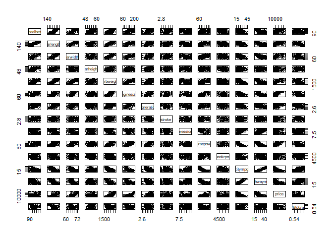

Predicting car prices using Linear Regression
=============================================

------------------------------------------------------------------------

Business Problem Statement
--------------------------

A Chinese automobile company Geely Auto aspires to enter the US market by setting up their manufacturing unit there and producing cars locally to give competition to their US and European counterparts.

They have contracted an automobile consulting company to understand the factors on which the pricing of a car depends. Specifically, they want to understand the factors affecting the pricing of cars in the American marketing, since those may be very different from the Chinese market. Essentially, the company wants to know: \* Which variables are significant in predicting the price of a car \* How well those variables describe the price of a car Based on various market surveys, the consulting firm has gathered a large dataset of different types of cars across the Americal market.

**Objective: ** Understand the factors affecting the pricing of cars in the American market and create a linear regression model that predicts the price of cars with the available independent variables

*Check and Import required libraries*

``` r
libs = c("tidyverse", "caret", "MASS","corrplot", "cowplot", 
         "car")
install.lib <- libs[!libs %in% installed.packages()]
for (pkg in install.lib) 
  install.packages(pkg, dependencies = T)
loadlib     <- lapply(libs, library, character.only = T) # load them
remove(list = ls())
```

*Import input file*

``` r
car_eda <- car_raw <-  read_csv("CarPrice_Assignment.csv")
```

    ## Parsed with column specification:
    ## cols(
    ##   .default = col_character(),
    ##   car_ID = col_integer(),
    ##   symboling = col_integer(),
    ##   wheelbase = col_double(),
    ##   carlength = col_double(),
    ##   carwidth = col_double(),
    ##   carheight = col_double(),
    ##   curbweight = col_integer(),
    ##   enginesize = col_integer(),
    ##   boreratio = col_double(),
    ##   stroke = col_double(),
    ##   compressionratio = col_double(),
    ##   horsepower = col_integer(),
    ##   peakrpm = col_integer(),
    ##   citympg = col_integer(),
    ##   highwaympg = col_integer(),
    ##   price = col_double()
    ## )

    ## See spec(...) for full column specifications.

Looking at the data

``` r
dim(car_raw)                                    
```

    ## [1] 205  26

``` r
# 205 obs. of  26 variables
glimpse(car_raw)
```

    ## Observations: 205
    ## Variables: 26
    ## $ car_ID           <int> 1, 2, 3, 4, 5, 6, 7, 8, 9, 10, 11, 12, 13, 14...
    ## $ symboling        <int> 3, 3, 1, 2, 2, 2, 1, 1, 1, 0, 2, 0, 0, 0, 1, ...
    ## $ CarName          <chr> "alfa-romero giulia", "alfa-romero stelvio", ...
    ## $ fueltype         <chr> "gas", "gas", "gas", "gas", "gas", "gas", "ga...
    ## $ aspiration       <chr> "std", "std", "std", "std", "std", "std", "st...
    ## $ doornumber       <chr> "two", "two", "two", "four", "four", "two", "...
    ## $ carbody          <chr> "convertible", "convertible", "hatchback", "s...
    ## $ drivewheel       <chr> "rwd", "rwd", "rwd", "fwd", "4wd", "fwd", "fw...
    ## $ enginelocation   <chr> "front", "front", "front", "front", "front", ...
    ## $ wheelbase        <dbl> 88.6, 88.6, 94.5, 99.8, 99.4, 99.8, 105.8, 10...
    ## $ carlength        <dbl> 168.8, 168.8, 171.2, 176.6, 176.6, 177.3, 192...
    ## $ carwidth         <dbl> 64.1, 64.1, 65.5, 66.2, 66.4, 66.3, 71.4, 71....
    ## $ carheight        <dbl> 48.8, 48.8, 52.4, 54.3, 54.3, 53.1, 55.7, 55....
    ## $ curbweight       <int> 2548, 2548, 2823, 2337, 2824, 2507, 2844, 295...
    ## $ enginetype       <chr> "dohc", "dohc", "ohcv", "ohc", "ohc", "ohc", ...
    ## $ cylindernumber   <chr> "four", "four", "six", "four", "five", "five"...
    ## $ enginesize       <int> 130, 130, 152, 109, 136, 136, 136, 136, 131, ...
    ## $ fuelsystem       <chr> "mpfi", "mpfi", "mpfi", "mpfi", "mpfi", "mpfi...
    ## $ boreratio        <dbl> 3.47, 3.47, 2.68, 3.19, 3.19, 3.19, 3.19, 3.1...
    ## $ stroke           <dbl> 2.68, 2.68, 3.47, 3.40, 3.40, 3.40, 3.40, 3.4...
    ## $ compressionratio <dbl> 9.00, 9.00, 9.00, 10.00, 8.00, 8.50, 8.50, 8....
    ## $ horsepower       <int> 111, 111, 154, 102, 115, 110, 110, 110, 140, ...
    ## $ peakrpm          <int> 5000, 5000, 5000, 5500, 5500, 5500, 5500, 550...
    ## $ citympg          <int> 21, 21, 19, 24, 18, 19, 19, 19, 17, 16, 23, 2...
    ## $ highwaympg       <int> 27, 27, 26, 30, 22, 25, 25, 25, 20, 22, 29, 2...
    ## $ price            <dbl> 13495.00, 16500.00, 16500.00, 13950.00, 17450...

``` r
summary(car_raw)
```

    ##      car_ID      symboling         CarName            fueltype        
    ##  Min.   :  1   Min.   :-2.0000   Length:205         Length:205        
    ##  1st Qu.: 52   1st Qu.: 0.0000   Class :character   Class :character  
    ##  Median :103   Median : 1.0000   Mode  :character   Mode  :character  
    ##  Mean   :103   Mean   : 0.8341                                        
    ##  3rd Qu.:154   3rd Qu.: 2.0000                                        
    ##  Max.   :205   Max.   : 3.0000                                        
    ##   aspiration         doornumber          carbody         
    ##  Length:205         Length:205         Length:205        
    ##  Class :character   Class :character   Class :character  
    ##  Mode  :character   Mode  :character   Mode  :character  
    ##                                                          
    ##                                                          
    ##                                                          
    ##   drivewheel        enginelocation       wheelbase        carlength    
    ##  Length:205         Length:205         Min.   : 86.60   Min.   :141.1  
    ##  Class :character   Class :character   1st Qu.: 94.50   1st Qu.:166.3  
    ##  Mode  :character   Mode  :character   Median : 97.00   Median :173.2  
    ##                                        Mean   : 98.76   Mean   :174.0  
    ##                                        3rd Qu.:102.40   3rd Qu.:183.1  
    ##                                        Max.   :120.90   Max.   :208.1  
    ##     carwidth       carheight       curbweight    enginetype       
    ##  Min.   :60.30   Min.   :47.80   Min.   :1488   Length:205        
    ##  1st Qu.:64.10   1st Qu.:52.00   1st Qu.:2145   Class :character  
    ##  Median :65.50   Median :54.10   Median :2414   Mode  :character  
    ##  Mean   :65.91   Mean   :53.72   Mean   :2556                     
    ##  3rd Qu.:66.90   3rd Qu.:55.50   3rd Qu.:2935                     
    ##  Max.   :72.30   Max.   :59.80   Max.   :4066                     
    ##  cylindernumber       enginesize     fuelsystem          boreratio   
    ##  Length:205         Min.   : 61.0   Length:205         Min.   :2.54  
    ##  Class :character   1st Qu.: 97.0   Class :character   1st Qu.:3.15  
    ##  Mode  :character   Median :120.0   Mode  :character   Median :3.31  
    ##                     Mean   :126.9                      Mean   :3.33  
    ##                     3rd Qu.:141.0                      3rd Qu.:3.58  
    ##                     Max.   :326.0                      Max.   :3.94  
    ##      stroke      compressionratio   horsepower       peakrpm    
    ##  Min.   :2.070   Min.   : 7.00    Min.   : 48.0   Min.   :4150  
    ##  1st Qu.:3.110   1st Qu.: 8.60    1st Qu.: 70.0   1st Qu.:4800  
    ##  Median :3.290   Median : 9.00    Median : 95.0   Median :5200  
    ##  Mean   :3.255   Mean   :10.14    Mean   :104.1   Mean   :5125  
    ##  3rd Qu.:3.410   3rd Qu.: 9.40    3rd Qu.:116.0   3rd Qu.:5500  
    ##  Max.   :4.170   Max.   :23.00    Max.   :288.0   Max.   :6600  
    ##     citympg        highwaympg        price      
    ##  Min.   :13.00   Min.   :16.00   Min.   : 5118  
    ##  1st Qu.:19.00   1st Qu.:25.00   1st Qu.: 7788  
    ##  Median :24.00   Median :30.00   Median :10295  
    ##  Mean   :25.22   Mean   :30.75   Mean   :13277  
    ##  3rd Qu.:30.00   3rd Qu.:34.00   3rd Qu.:16503  
    ##  Max.   :49.00   Max.   :54.00   Max.   :45400

Checking for duplicates

``` r
length(unique(car_raw$car_ID)) != dim(car_raw)[1]
```

    ## [1] FALSE

*205 IDs matches with 205 total observations. So no duplicates*

Data Understanding
------------------

**Independent/Predictor variables**

-   Symboling - Assigned insurance risk rating. A value of +3 indicates that the auto is risky, \# -3 that it is probably pretty safe.

-   CarCompany - Name of car company Contains company and Car model

-   Fueltype - Car fuel type i.e gas or diesel

-   Aspiration - Aspiration used in a car. Read more [here](http://www.oneshift.com/features/8284/naturally-aspirated-vs-turbocharged-vs-supercharged-vs-twincharged-engines)

-   Doornumber - Number of doors in a car

-   Carbody - Body of car. Read about car body types [here](https://www.cartrade.com/blog/2013/auto-guides/different-car-body-types-494.html)

-   Drivewheel - type of drive wheel. Read more [here](https://en.wikipedia.org/wiki/Automobile_layout)

-   Enginelocation - Location of car engine

-   Wheelbase - Wheelbase of car. Read more [here](https://www.carwow.co.uk/guides/glossary/what-is-a-car-wheelbase-0282)

-   Carlength - Length of car

-   Carwidth - Width of car

-   Carheight - height of car

-   Curbweight - The weight of a car without occupants or baggage

-   Enginetype - Type of engine. Read more [here](https://www.samarins.com/glossary/dohc.html) and [here](https://carbiketech.com/ohc-sohc-dohc/)

-   Cylindernumber - Number of cylinders placed in the car

-   Enginesize - Size of engine

-   Fuelsystem

    -   BBL indicates the amount of holes that air enters the engine. the technical name is BARRELS! When you take off the air filter there will be either 1 hole or 2 holes side by side or 4 holes, 2 in the front and 2 in the rear. Hence the values 1bbl, 2bbl, 4bbl.
    -   idi - Indirect injection. Fuel is not directly injected into the combustion chamber
    -   port injection -&gt; spfi - Sequential Port fuel injection, mpfi - Multipoint/port Fuel Injection

-   Boreratio & Stroke ratio. Read more [here](https://en.wikipedia.org/wiki/Stroke_ratio)

-   Compressionratio - Compression ratio is simply the volume of the cylinder and the volume of the combustion chamber of the cylinder head when the piston is at Bottom Dead Center (BDC) and the volume of the cylinder head combustion chamber when the piston is at Top Dead Center (TDC). Read more [here](http://blog.jpcycles.com/engine-compression-ratios-what-they-are-how-they-work/)

-   Horsepower - 33,000 foot-pounds in one minute. A horse exerting 1 horsepower can raise 330 pounds of coal 100 feet in a minute, or 33 pounds of coal 1,000 feet in one minute, or 1,000 pounds 33 feet in one minute. Read more [here](https://auto.howstuffworks.com/horsepower.htm)

-   Peakrpm - The power band of an internal combustion engine or electric motor is the range of operating speeds under which the engine or motor is able to operate most efficiently. ... Diesel engines in cars and small trucks may develop maximum torque below 2,000 RPM with the power peak below 5,000 RPM. Read more [here](https://en.wikipedia.org/wiki/Power_band)

-   Citympg - Mileage in city

-   Highwaympg - Mileage on highway

**Dependant/Target variable**

-   Price - Price of car

Data Cleaning
-------------

Checking for Null values

``` r
anyNA(car_eda)
```

    ## [1] FALSE

*No NA Values*

Remove Car ID variable

``` r
car_eda <-  car_eda[,-1]
```

Categorical Variables

``` r
(catvarnames <- names(Filter(is.character, car_eda)))
```

    ##  [1] "CarName"        "fueltype"       "aspiration"     "doornumber"    
    ##  [5] "carbody"        "drivewheel"     "enginelocation" "enginetype"    
    ##  [9] "cylindernumber" "fuelsystem"

Lets look at the distribution of the categorical variables

``` r
sapply(car_eda[catvarnames], table)
```

    ## $CarName
    ## 
    ##              alfa-romero giulia        alfa-romero Quadrifoglio 
    ##                               1                               1 
    ##             alfa-romero stelvio                     audi 100 ls 
    ##                               1                               1 
    ##                      audi 100ls                       audi 4000 
    ##                               2                               1 
    ##                       audi 5000             audi 5000s (diesel) 
    ##                               1                               1 
    ##                        audi fox                        bmw 320i 
    ##                               1                               2 
    ##                          bmw x1                          bmw x3 
    ##                               1                               2 
    ##                          bmw x4                          bmw x5 
    ##                               1                               1 
    ##                          bmw z4                   buick century 
    ##                               1                               1 
    ##        buick century luxus (sw)           buick century special 
    ##                               1                               1 
    ##        buick electra 225 custom         buick opel isuzu deluxe 
    ##                               1                               1 
    ## buick regal sport coupe (turbo)                   buick skyhawk 
    ##                               1                               1 
    ##                   buick skylark                chevrolet impala 
    ##                               1                               1 
    ##           chevrolet monte carlo             chevrolet vega 2300 
    ##                               1                               1 
    ##             dodge challenger se                 dodge colt (sw) 
    ##                               1                               1 
    ##              dodge colt hardtop            dodge coronet custom 
    ##                               1                               1 
    ##       dodge coronet custom (sw)                      dodge d200 
    ##                               1                               1 
    ##               dodge dart custom               dodge monaco (sw) 
    ##                               1                               1 
    ##                   dodge rampage                    honda accord 
    ##                               1                               2 
    ##               honda accord cvcc                 honda accord lx 
    ##                               1                               1 
    ##                     honda civic              honda civic (auto) 
    ##                               3                               1 
    ##                honda civic 1300             honda civic 1500 gl 
    ##                               1                               1 
    ##                honda civic cvcc                   honda prelude 
    ##                               2                               1 
    ##                     isuzu D-Max             isuzu D-Max V-Cross 
    ##                               2                               1 
    ##                      isuzu MU-X                       jaguar xf 
    ##                               1                               1 
    ##                       jaguar xj                       jaguar xk 
    ##                               1                               1 
    ##                maxda glc deluxe                       maxda rx3 
    ##                               1                               1 
    ##                       mazda 626                       mazda glc 
    ##                               3                               2 
    ##                     mazda glc 4                mazda glc custom 
    ##                               1                               1 
    ##              mazda glc custom l                mazda glc deluxe 
    ##                               1                               2 
    ##                      mazda rx-4                   mazda rx-7 gs 
    ##                               2                               2 
    ##                 mazda rx2 coupe                  mercury cougar 
    ##                               1                               1 
    ##                   mitsubishi g4               mitsubishi lancer 
    ##                               3                               1 
    ##               mitsubishi mirage            mitsubishi mirage g4 
    ##                               1                               3 
    ##              mitsubishi montero            mitsubishi outlander 
    ##                               1                               3 
    ##               mitsubishi pajero                  nissan clipper 
    ##                               1                               2 
    ##                     nissan dayz                     nissan fuga 
    ##                               1                               1 
    ##                     nissan gt-r                     nissan juke 
    ##                               1                               1 
    ##                    nissan kicks                    nissan latio 
    ##                               1                               2 
    ##                     nissan leaf                     nissan note 
    ##                               1                               1 
    ##                    nissan nv200                     nissan otti 
    ##                               1                               1 
    ##                    nissan rogue                    nissan teana 
    ##                               2                               1 
    ##                    nissan titan                    Nissan versa 
    ##                               1                               1 
    ##                     peugeot 304                     peugeot 504 
    ##                               1                               6 
    ##                peugeot 504 (sw)       peugeot 505s turbo diesel 
    ##                               1                               1 
    ##                   peugeot 604sl                plymouth cricket 
    ##                               2                               1 
    ##                 plymouth duster        plymouth fury gran sedan 
    ##                               1                               1 
    ##               plymouth fury iii  plymouth satellite custom (sw) 
    ##                               2                               1 
    ##                plymouth valiant               porcshce panamera 
    ##                               1                               1 
    ##                  porsche boxter                 porsche cayenne 
    ##                               1                               2 
    ##                   porsche macan                    renault 12tl 
    ##                               1                               1 
    ##                   renault 5 gtl                        saab 99e 
    ##                               1                               2 
    ##                      saab 99gle                       saab 99le 
    ##                               2                               2 
    ##                          subaru                     subaru baja 
    ##                               2                               1 
    ##                      subaru brz                       subaru dl 
    ##                               1                               4 
    ##                       subaru r1                       subaru r2 
    ##                               1                               1 
    ##                   subaru trezia                  subaru tribeca 
    ##                               1                               1 
    ##                   toyota carina                toyota celica gt 
    ##                               1                               1 
    ##       toyota celica gt liftback                  toyota corolla 
    ##                               1                               6 
    ##             toyota corolla 1200        toyota corolla 1600 (sw) 
    ##                               2                               1 
    ##         toyota corolla liftback           toyota corolla tercel 
    ##                               2                               1 
    ##                   toyota corona           toyota corona hardtop 
    ##                               6                               1 
    ##          toyota corona liftback           toyota corona mark ii 
    ##                               1                               1 
    ##                 toyota cressida                  toyota mark ii 
    ##                               1                               3 
    ##                  toyota starlet                   toyota tercel 
    ##                               2                               1 
    ##                  toyouta tercel                vokswagen rabbit 
    ##                               1                               1 
    ##    volkswagen 1131 deluxe sedan             volkswagen 411 (sw) 
    ##                               1                               1 
    ##               volkswagen dasher            volkswagen model 111 
    ##                               2                               1 
    ##               volkswagen rabbit        volkswagen rabbit custom 
    ##                               1                               1 
    ##         volkswagen super beetle               volkswagen type 3 
    ##                               1                               1 
    ##                     volvo 144ea                 volvo 145e (sw) 
    ##                               2                               2 
    ##                     volvo 244dl                       volvo 245 
    ##                               2                               1 
    ##                       volvo 246                     volvo 264gl 
    ##                               1                               2 
    ##                    volvo diesel                       vw dasher 
    ##                               1                               1 
    ##                       vw rabbit 
    ##                               1 
    ## 
    ## $fueltype
    ## 
    ## diesel    gas 
    ##     20    185 
    ## 
    ## $aspiration
    ## 
    ##   std turbo 
    ##   168    37 
    ## 
    ## $doornumber
    ## 
    ## four  two 
    ##  115   90 
    ## 
    ## $carbody
    ## 
    ## convertible     hardtop   hatchback       sedan       wagon 
    ##           6           8          70          96          25 
    ## 
    ## $drivewheel
    ## 
    ## 4wd fwd rwd 
    ##   9 120  76 
    ## 
    ## $enginelocation
    ## 
    ## front  rear 
    ##   202     3 
    ## 
    ## $enginetype
    ## 
    ##  dohc dohcv     l   ohc  ohcf  ohcv rotor 
    ##    12     1    12   148    15    13     4 
    ## 
    ## $cylindernumber
    ## 
    ##  eight   five   four    six  three twelve    two 
    ##      5     11    159     24      1      1      4 
    ## 
    ## $fuelsystem
    ## 
    ## 1bbl 2bbl 4bbl  idi  mfi mpfi spdi spfi 
    ##   11   66    3   20    1   94    9    1

Issues identified:

    1. Separate out company from the CarName as per the business need
    2. Typo in enginetype, fuelsystem and Car name. 

*Separate CarName into company and model*

Keep only the Car Company column and drop the model

``` r
car_eda %>% separate(CarName, into = c("company"), 
                     sep = " ", extra = "drop" ) -> car_eda
```

Check the data

``` r
table(car_eda$company)
```

    ## 
    ## alfa-romero        audi         bmw       buick   chevrolet       dodge 
    ##           3           7           8           8           3           9 
    ##       honda       isuzu      jaguar       maxda       mazda     mercury 
    ##          13           4           3           2          15           1 
    ##  mitsubishi      nissan      Nissan     peugeot    plymouth    porcshce 
    ##          13          17           1          11           7           1 
    ##     porsche     renault        saab      subaru      toyota     toyouta 
    ##           4           2           6          12          31           1 
    ##   vokswagen  volkswagen       volvo          vw 
    ##           1           9          11           2

*Correct the typos in the company names*

``` r
car_eda$company <-  gsub("maxda", "mazda", car_eda$company)
car_eda$company <-  gsub("porcshce", "porsche", car_eda$company)
car_eda$company <-  gsub("toyouta", "toyota", car_eda$company)
car_eda$company <-  gsub("vw|vokswagen", "volkswagen", car_eda$company)
```

Check the data again

``` r
table(car_eda$company)
```

    ## 
    ## alfa-romero        audi         bmw       buick   chevrolet       dodge 
    ##           3           7           8           8           3           9 
    ##       honda       isuzu      jaguar       mazda     mercury  mitsubishi 
    ##          13           4           3          17           1          13 
    ##      nissan      Nissan     peugeot    plymouth     porsche     renault 
    ##          17           1          11           7           5           2 
    ##        saab      subaru      toyota  volkswagen       volvo 
    ##           6          12          32          12          11

Following columns to be corrected for typos \* enginetype - We dont have dohcv type engine. Looks like a typo \* fuelsystem - both mfi & mpfi are one and the same.

``` r
car_eda$enginetype[which(car_eda$enginetype == "dohcv")] <- "dohc"
car_eda$fuelsystem[which(car_eda$fuelsystem == "mfi")] <- "mpfi"
```

Variables doornumber, cylindernumber are in words. This shouldn't be an issue since we can treat them as categorical and use them in model by converting them to dummy variables

Convert Symboling to Character variable

``` r
car_eda$symboling <-  as.character(car_eda$symboling)
```

Update Catgeorical variables vector

``` r
catvarnames <- names(Filter(is.character, car_eda))
```

Let's check the data again

``` r
sapply(car_eda[catvarnames], table)
```

    ## $symboling
    ## 
    ## -1 -2  0  1  2  3 
    ## 22  3 67 54 32 27 
    ## 
    ## $company
    ## 
    ## alfa-romero        audi         bmw       buick   chevrolet       dodge 
    ##           3           7           8           8           3           9 
    ##       honda       isuzu      jaguar       mazda     mercury  mitsubishi 
    ##          13           4           3          17           1          13 
    ##      nissan      Nissan     peugeot    plymouth     porsche     renault 
    ##          17           1          11           7           5           2 
    ##        saab      subaru      toyota  volkswagen       volvo 
    ##           6          12          32          12          11 
    ## 
    ## $fueltype
    ## 
    ## diesel    gas 
    ##     20    185 
    ## 
    ## $aspiration
    ## 
    ##   std turbo 
    ##   168    37 
    ## 
    ## $doornumber
    ## 
    ## four  two 
    ##  115   90 
    ## 
    ## $carbody
    ## 
    ## convertible     hardtop   hatchback       sedan       wagon 
    ##           6           8          70          96          25 
    ## 
    ## $drivewheel
    ## 
    ## 4wd fwd rwd 
    ##   9 120  76 
    ## 
    ## $enginelocation
    ## 
    ## front  rear 
    ##   202     3 
    ## 
    ## $enginetype
    ## 
    ##  dohc     l   ohc  ohcf  ohcv rotor 
    ##    13    12   148    15    13     4 
    ## 
    ## $cylindernumber
    ## 
    ##  eight   five   four    six  three twelve    two 
    ##      5     11    159     24      1      1      4 
    ## 
    ## $fuelsystem
    ## 
    ## 1bbl 2bbl 4bbl  idi mpfi spdi spfi 
    ##   11   66    3   20   95    9    1

*Looks good now*

Converting to Factors

``` r
car_eda <- car_eda %>% mutate_if(is.character,as.factor)
str(car_eda)
```

    ## Classes 'tbl_df', 'tbl' and 'data.frame':    205 obs. of  25 variables:
    ##  $ symboling       : Factor w/ 6 levels "-1","-2","0",..: 6 6 4 5 5 5 4 4 4 3 ...
    ##  $ company         : Factor w/ 23 levels "alfa-romero",..: 1 1 1 2 2 2 2 2 2 2 ...
    ##  $ fueltype        : Factor w/ 2 levels "diesel","gas": 2 2 2 2 2 2 2 2 2 2 ...
    ##  $ aspiration      : Factor w/ 2 levels "std","turbo": 1 1 1 1 1 1 1 1 2 2 ...
    ##  $ doornumber      : Factor w/ 2 levels "four","two": 2 2 2 1 1 2 1 1 1 2 ...
    ##  $ carbody         : Factor w/ 5 levels "convertible",..: 1 1 3 4 4 4 4 5 4 3 ...
    ##  $ drivewheel      : Factor w/ 3 levels "4wd","fwd","rwd": 3 3 3 2 1 2 2 2 2 1 ...
    ##  $ enginelocation  : Factor w/ 2 levels "front","rear": 1 1 1 1 1 1 1 1 1 1 ...
    ##  $ wheelbase       : num  88.6 88.6 94.5 99.8 99.4 ...
    ##  $ carlength       : num  169 169 171 177 177 ...
    ##  $ carwidth        : num  64.1 64.1 65.5 66.2 66.4 66.3 71.4 71.4 71.4 67.9 ...
    ##  $ carheight       : num  48.8 48.8 52.4 54.3 54.3 53.1 55.7 55.7 55.9 52 ...
    ##  $ curbweight      : int  2548 2548 2823 2337 2824 2507 2844 2954 3086 3053 ...
    ##  $ enginetype      : Factor w/ 6 levels "dohc","l","ohc",..: 1 1 5 3 3 3 3 3 3 3 ...
    ##  $ cylindernumber  : Factor w/ 7 levels "eight","five",..: 3 3 4 3 2 2 2 2 2 2 ...
    ##  $ enginesize      : int  130 130 152 109 136 136 136 136 131 131 ...
    ##  $ fuelsystem      : Factor w/ 7 levels "1bbl","2bbl",..: 5 5 5 5 5 5 5 5 5 5 ...
    ##  $ boreratio       : num  3.47 3.47 2.68 3.19 3.19 3.19 3.19 3.19 3.13 3.13 ...
    ##  $ stroke          : num  2.68 2.68 3.47 3.4 3.4 3.4 3.4 3.4 3.4 3.4 ...
    ##  $ compressionratio: num  9 9 9 10 8 8.5 8.5 8.5 8.3 7 ...
    ##  $ horsepower      : int  111 111 154 102 115 110 110 110 140 160 ...
    ##  $ peakrpm         : int  5000 5000 5000 5500 5500 5500 5500 5500 5500 5500 ...
    ##  $ citympg         : int  21 21 19 24 18 19 19 19 17 16 ...
    ##  $ highwaympg      : int  27 27 26 30 22 25 25 25 20 22 ...
    ##  $ price           : num  13495 16500 16500 13950 17450 ...

*Looks good*

Derive New variables
--------------------

Wheelbase to length ratio - tells us what proportion of the car's length falls between the front and back wheels. In general, a car with a longer wheelbase compared to its overall length will make better use of the cabin space and feel more stable on the road.

``` r
car_eda$WBtoLratio  <-  car_eda$wheelbase/car_eda$carlength
```

*The car\_eda data is now ready for exploratory data analysis*

EDA
---

**Common Functions**

Setting the theme of plots

``` r
plot_theme <- theme_classic() + 
  theme(plot.title = element_text(hjust = 0.5, size = 10,face = 'bold'),
        axis.title.x = element_text(size = 8),
        axis.title.y = element_text(size = 8),
        axis.text.x  = element_text(size = 6),
        axis.text.y  = element_text(size = 6))
```

Continuous Univariate plots

``` r
ContUnivar <- function(yfeature, ylabel) {
  ggplot(car_eda, aes(x = "", y = yfeature)) +
    geom_boxplot(fill = "#F8766D", outlier.colour = "red", outlier.shape = 1) +
    stat_boxplot(geom = "errorbar", width = 0.5) +
    labs( y = ylabel, title = paste(ylabel, "Distribution")) +
    plot_theme
}
```

Bivariate plots

``` r
ContCatBivar <- function(xfeature, yfeature, xlabel, ylabel) {
  ggplot(car_eda, aes(x = xfeature, y = yfeature, fill = xfeature)) +
    geom_boxplot(outlier.colour = "red", outlier.shape = 1, show.legend = F) + 
    stat_boxplot(geom = "errorbar", width = 0.5) +
    labs(x = xlabel, y = ylabel, title = paste(ylabel, "vs", xlabel)) +
    plot_theme
}

ContContBivar <- function(xfeature, yfeature, xlabel, ylabel) {
  ggplot(car_eda, aes(x = xfeature, y = yfeature)) +
    geom_point() +
    geom_smooth() +
    labs(x = xlabel, y = ylabel, title = paste(ylabel, "vs", xlabel)) +
    plot_theme
}
```

Univariate Analysis (Continuos Variables)
-----------------------------------------

``` r
summary(car_eda$price)
```

    ##    Min. 1st Qu.  Median    Mean 3rd Qu.    Max. 
    ##    5118    7788   10295   13277   16503   45400

``` r
p1 <- ContUnivar(car_eda$price, "Car Price" )
p2 <- ContUnivar(car_eda$wheelbase, "Wheel Base" )
p3 <- ContUnivar(car_eda$carlength, "Car Length" )
p4 <- ContUnivar(car_eda$carheight, "Car height" )
p5 <- ContUnivar(car_eda$curbweight, "Curb Weight")
p6 <- ContUnivar(car_eda$enginesize, "Engine Size")
p7 <- ContUnivar(car_eda$boreratio, "Bore Ratio")
p8 <- ContUnivar(car_eda$stroke, "Stroke")
p9 <- ContUnivar(car_eda$compressionratio, "Compression Ratio")
p10 <- ContUnivar(car_eda$horsepower, "Horse Power")
p11 <- ContUnivar(car_eda$peakrpm, "Peak RPM")
p12 <- ContUnivar(car_eda$citympg, "city mpg")
p13 <- ContUnivar(car_eda$highwaympg, "Highway mpg")
p14 <- ContUnivar(car_eda$WBtoLratio, "WB To L ratio")

plot_grid(p1, p2, p3, p4, p5, p6, p7)
```


``` r
plot_grid(p8, p9 ,p10, p11, p12, p13, p14)
```


*Handling outliers since it might impact the model as metrics such as R squared depend on the mean*

``` r
car_eda[which(car_eda$wheelbase > 114),]$wheelbase <-  114
car_eda[which(car_eda$enginesize > 200),]$enginesize <-  200
car_eda[which(car_eda$stroke > 3.8),]$stroke <-  3.8
car_eda[which(car_eda$stroke < 2.7),]$stroke <-  2.7
car_eda[which(car_eda$compressionratio > 10),]$compressionratio <-  10
car_eda[which(car_eda$compressionratio < 7.5),]$compressionratio <-  7.5
car_eda[which(car_eda$horsepower > 180),]$horsepower <-  180
car_eda[which(car_eda$peakrpm > 6000),]$peakrpm <-  6000
car_eda[which(car_eda$citympg > 45),]$citympg <-  45
car_eda[which(car_eda$highwaympg > 45),]$highwaympg <-  45
car_eda[which(car_eda$WBtoLratio > 0.610),]$WBtoLratio <-  0.610
```

Plot again

``` r
p1  <- ContUnivar(car_eda$price, "Car Price" )
p2  <- ContUnivar(car_eda$wheelbase, "Wheel Base" )
p3  <- ContUnivar(car_eda$carlength, "Car Length" )
p4  <- ContUnivar(car_eda$carheight, "Car height" )
p5  <- ContUnivar(car_eda$curbweight, "Curb Weight")
p6  <- ContUnivar(car_eda$enginesize, "Engine Size")
p7  <- ContUnivar(car_eda$boreratio, "Bore Ratio")
p8  <- ContUnivar(car_eda$stroke, "Stroke")
p9  <- ContUnivar(car_eda$compressionratio, "Compression Ratio")
p10 <- ContUnivar(car_eda$horsepower, "Horse Power")
p11 <- ContUnivar(car_eda$peakrpm, "Peak RPM")
p12 <- ContUnivar(car_eda$citympg, "city mpg")
p13 <- ContUnivar(car_eda$highwaympg, "Highway mpg")
p14 <- ContUnivar(car_eda$WBtoLratio, "WB To L ratio")

plot_grid(p1, p2, p3, p4, p5, p6, p7)
```


``` r
plot_grid(p8, p9 ,p10, p11, p12, p13, p14)
```


Multivariate Analysis (Categorical Variables)
---------------------------------------------

How does the categorical variables impact price?

**Annova test**

``` r
car_aov <-  aov(car_eda$price ~ car_eda$symboling + car_eda$company + 
                  car_eda$fueltype + car_eda$aspiration + car_eda$doornumber + 
                  car_eda$carbody + car_eda$drivewheel +car_eda$enginelocation +  
                  car_eda$enginetype + car_eda$cylindernumber + 
                  car_eda$fuelsystem)

summary(car_aov)
```

    ##                         Df    Sum Sq   Mean Sq F value   Pr(>F)    
    ## car_eda$symboling        5 1.768e+09 353527182  58.262  < 2e-16 ***
    ## car_eda$company         22 9.045e+09 411123647  67.754  < 2e-16 ***
    ## car_eda$fueltype         1 1.408e+07  14080668   2.321 0.129728    
    ## car_eda$aspiration       1 9.360e+07  93602388  15.426 0.000129 ***
    ## car_eda$doornumber       1 3.675e+05    367541   0.061 0.805923    
    ## car_eda$carbody          4 6.645e+07  16613626   2.738 0.030818 *  
    ## car_eda$drivewheel       2 3.465e+08 173256084  28.553 2.84e-11 ***
    ## car_eda$enginelocation   1 3.493e+07  34925245   5.756 0.017630 *  
    ## car_eda$enginetype       4 3.448e+08  86197804  14.206 6.84e-10 ***
    ## car_eda$cylindernumber   4 2.989e+08  74727905  12.315 1.03e-08 ***
    ## car_eda$fuelsystem       5 7.318e+07  14636409   2.412 0.038779 *  
    ## Residuals              154 9.345e+08   6067895                     
    ## ---
    ## Signif. codes:  0 '***' 0.001 '**' 0.01 '*' 0.05 '.' 0.1 ' ' 1

The following variables have higher significance i.e P value &lt; 0.05

-   car\_eda$symboling
-   car\_eda$company
-   car\_eda$aspiration
-   car\_eda$carbody
-   car\_eda$drivewheel
-   car\_eda$enginelocation
-   car\_eda$enginetype
-   car\_eda$cylindernumber
-   car\_eda$fuelsystem

Lets looks at these using plots

``` r
p1 <- ContCatBivar(car_eda$carbody, car_eda$price, 
                   "Carbody", "Price")
p2 <- ContCatBivar(car_eda$fueltype, car_eda$price,
                   "fueltype",  "Price")
p3 <- ContCatBivar(car_eda$doornumber, car_eda$price,
                   "Doors", "Price")
p4 <- ContCatBivar(car_eda$drivewheel, car_eda$price, 
                   "Drivewheel", "Price")
p5 <- ContCatBivar(car_eda$symboling, car_eda$price,
                   "Symboling", "Price")
p6 <- ContCatBivar(car_eda$enginetype, car_eda$price,
                   "enginetype", "Price")

plot_grid(p1, p2, p3, p4, p5, p6, ncol = 2)
```


``` r
p1 <- ContCatBivar(car_eda$cylindernumber, car_eda$price,
                   "Cylinders", "Price")
p2 <- ContCatBivar(car_eda$fuelsystem, car_eda$price,
                   "Fuel system", "Price")
p3 <- ContCatBivar(car_eda$aspiration, car_eda$price,
                   "Aspiration", "Price")
p4 <- ContCatBivar(car_eda$enginelocation, car_eda$price,
                   "Engine Location",  "Price")

plot_grid(p1, p2, p3, p4, ncol = 2)
```


*High prices for : Rear engineloaction *

``` r
ContCatBivar(car_eda$company, car_eda$price, 
             "company", "Price")
```


*High prices for companies: BMW, Buick, Jaguar, Porshce*

Multivariate Analysis(Continuous Variables)
-------------------------------------------

**Price vs <rest of continuous variables>**

``` r
p1 <- ContContBivar(car_eda$enginesize, car_eda$price, 
                    "Engine Size", "Price")
p2 <- ContContBivar(car_eda$horsepower, car_eda$price, 
                    "Horse Power", "Price")
p3 <- ContContBivar(car_eda$carwidth, car_eda$price, 
                    "Car Width", "Price")
p4 <- ContContBivar(car_eda$carlength, car_eda$price, 
                    "Car Length", "Price")
p5 <- ContContBivar(car_eda$carheight, car_eda$price, 
                    "Car Height", "Price")
p6 <- ContContBivar(car_eda$curbweight, car_eda$price, 
                    "CurbWeight", "Price")
p7 <- ContContBivar(car_eda$wheelbase, car_eda$price, 
                    "Wheelbase", "Price")
p8 <- ContContBivar(car_eda$boreratio, car_eda$price, 
                    "Bore ratio", "Price")
p9 <- ContContBivar(car_eda$citympg, car_eda$price, 
                    "City-mpg", "Price")
p10 <- ContContBivar(car_eda$highwaympg, car_eda$price, 
                     "Highway-mpg", "Price")
p11 <- ContContBivar(car_eda$WBtoLratio, car_eda$price, 
                     "WBtoLRatio", "Price")
p12 <- ContContBivar(car_eda$peakrpm, car_eda$price, 
                     "peakrpm", "Price")
p13 <- ContContBivar(car_eda$compressionratio, car_eda$price, 
                     "compressionratio", "Price")
p14 <- ContContBivar(car_eda$stroke, car_eda$price, 
                     "stroke", "Price")

plot_grid(p1, p2, p3, p4, p5, p6, p7, p8)
```

    ## `geom_smooth()` using method = 'loess'
    ## `geom_smooth()` using method = 'loess'
    ## `geom_smooth()` using method = 'loess'
    ## `geom_smooth()` using method = 'loess'
    ## `geom_smooth()` using method = 'loess'
    ## `geom_smooth()` using method = 'loess'
    ## `geom_smooth()` using method = 'loess'
    ## `geom_smooth()` using method = 'loess'


``` r
plot_grid(p9, p10, p11, p12, p13)
```

    ## `geom_smooth()` using method = 'loess'
    ## `geom_smooth()` using method = 'loess'
    ## `geom_smooth()` using method = 'loess'
    ## `geom_smooth()` using method = 'loess'
    ## `geom_smooth()` using method = 'loess'


**Correlation plot**

``` r
contvarnames <- names(Filter(is.numeric, car_eda))
corrplot.mixed(cor(car_eda[contvarnames]), upper = "ellipse", 
               tl.cex = 0.55, tl.pos = 'd')
```


**Covariance of variables**

``` r
cov(car_eda[contvarnames])
```

    ##                      wheelbase     carlength      carwidth     carheight
    ## wheelbase         3.437072e+01    63.2781643  9.975071e+00  8.513003e+00
    ## carlength         6.327816e+01   152.2086882  2.226104e+01  1.480279e+01
    ## carwidth          9.975071e+00    22.2610352  4.601900e+00  1.463579e+00
    ## carheight         8.513003e+00    14.8027879  1.463579e+00  5.970800e+00
    ## curbweight        2.366864e+03  5638.3362004  9.684451e+02  3.760540e+02
    ## enginesize        1.071674e+02   286.4339813  5.235126e+01  8.461791e+00
    ## boreratio         7.772606e-01     2.0264533  3.248745e-01  1.132169e-01
    ## stroke            2.996000e-01     0.4945090  1.155065e-01 -1.099359e-02
    ## compressionratio -2.870216e-01    -1.1255143 -1.685487e-01  1.267354e-01
    ## horsepower        8.336353e+01   262.2850215  4.893722e+01 -5.321614e+00
    ## peakrpm          -9.783259e+02 -1658.8706361 -2.139011e+02 -3.668297e+02
    ## citympg          -1.770408e+01   -53.2501052 -8.925512e+00 -7.150502e-01
    ## highwaympg       -2.078005e+01   -56.8872932 -9.610703e+00 -1.679091e+00
    ## price             2.654616e+04 67309.1268364  1.301310e+04  2.329555e+03
    ## WBtoLratio       -5.699189e-03    -0.1255276 -1.392009e-02  1.146949e-03
    ##                     curbweight    enginesize     boreratio        stroke
    ## wheelbase         2.366864e+03  1.071674e+02  7.772606e-01  2.996000e-01
    ## carlength         5.638336e+03  2.864340e+02  2.026453e+00  4.945090e-01
    ## carwidth          9.684451e+02  5.235126e+01  3.248745e-01  1.155065e-01
    ## carheight         3.760540e+02  8.461791e+00  1.132169e-01 -1.099359e-02
    ## curbweight        2.711079e+05  1.491447e+04  9.145053e+01  2.366637e+01
    ## enginesize        1.491447e+04  1.097699e+03  5.704121e+00  1.913231e+00
    ## boreratio         9.145053e+01  5.704121e+00  7.335631e-02 -6.738654e-03
    ## stroke            2.366637e+01  1.913231e+00 -6.738654e-03  6.999374e-02
    ## compressionratio -6.255396e+01 -3.584881e+00 -2.557093e-02 -1.825037e-02
    ## horsepower        1.425235e+04  9.730260e+02  5.536968e+00  9.697757e-01
    ## peakrpm          -6.451708e+04 -3.685774e+03 -3.241194e+01 -9.309099e+00
    ## citympg          -2.553040e+03 -1.473499e+02 -1.023385e+00 -7.056086e-02
    ## highwaympg       -2.757031e+03 -1.531522e+02 -1.046467e+00 -7.945528e-02
    ## price             3.474565e+06  2.235832e+05  1.196918e+03  1.196716e+02
    ## WBtoLratio       -4.516863e+00 -3.026867e-01 -2.100733e-03  1.018333e-04
    ##                  compressionratio    horsepower       peakrpm
    ## wheelbase           -2.870216e-01  8.336353e+01 -9.783259e+02
    ## carlength           -1.125514e+00  2.622850e+02 -1.658871e+03
    ## carwidth            -1.685487e-01  4.893722e+01 -2.139011e+02
    ## carheight            1.267354e-01 -5.321614e+00 -3.668297e+02
    ## curbweight          -6.255396e+01  1.425235e+04 -6.451708e+04
    ## enginesize          -3.584881e+00  9.730260e+02 -3.685774e+03
    ## boreratio           -2.557093e-02  5.536968e+00 -3.241194e+01
    ## stroke              -1.825037e-02  9.697757e-01 -9.309099e+00
    ## compressionratio     4.583183e-01 -9.093900e+00 -2.935202e+01
    ## horsepower          -9.093900e+00  1.231578e+03  1.838061e+03
    ## peakrpm             -2.935202e+01  1.838061e+03  2.136588e+05
    ## citympg              2.110476e+00 -1.918752e+02 -3.524582e+02
    ## highwaympg           2.042825e+00 -1.923985e+02 -1.329794e+02
    ## price               -7.210138e+02  2.256543e+05 -3.022180e+05
    ## WBtoLratio           1.802886e-03 -3.611685e-01 -3.343013e-01
    ##                        citympg    highwaympg         price    WBtoLratio
    ## wheelbase        -1.770408e+01 -2.078005e+01  2.654616e+04 -5.699189e-03
    ## carlength        -5.325011e+01 -5.688729e+01  6.730913e+04 -1.255276e-01
    ## carwidth         -8.925512e+00 -9.610703e+00  1.301310e+04 -1.392009e-02
    ## carheight        -7.150502e-01 -1.679091e+00  2.329555e+03  1.146949e-03
    ## curbweight       -2.553040e+03 -2.757031e+03  3.474565e+06 -4.516863e+00
    ## enginesize       -1.473499e+02 -1.531522e+02  2.235832e+05 -3.026867e-01
    ## boreratio        -1.023385e+00 -1.046467e+00  1.196918e+03 -2.100733e-03
    ## stroke           -7.056086e-02 -7.945528e-02  1.196716e+02  1.018333e-04
    ## compressionratio  2.110476e+00  2.042825e+00 -7.210138e+02  1.802886e-03
    ## horsepower       -1.918752e+02 -1.923985e+02  2.256543e+05 -3.611685e-01
    ## peakrpm          -3.524582e+02 -1.329794e+02 -3.022180e+05 -3.343013e-01
    ## citympg           4.153716e+01  4.058348e+01 -3.562730e+04  7.013415e-02
    ## highwaympg        4.058348e+01  4.261057e+01 -3.744732e+04  6.373738e-02
    ## price            -3.562730e+04 -3.744732e+04  6.382176e+07 -6.088712e+01
    ## WBtoLratio        7.013415e-02  6.373738e-02 -6.088712e+01  3.808602e-04

**Correlation with Price**

*Positive correlation*

-   horsepower
-   enginesize
-   CurbWeight
-   CarWidth
-   Carlength
-   Wheelbase
-   boreratio

*Negative correlation*

-   citympg
-   highwaympg
-   WBtoLRatio

Lets looks at the Multicollinearity between variables

``` r
pairs(car_eda[contvarnames])
```



We can use either pairs plot or correlation plot to conclude on multicollineraity

**Multicollinearity between variables **

<table style="width:93%;">
<colgroup>
<col width="16%" />
<col width="41%" />
<col width="34%" />
</colgroup>
<thead>
<tr class="header">
<th>Variable</th>
<th>+ve collineraity</th>
<th>-ve collinearity</th>
</tr>
</thead>
<tbody>
<tr class="odd">
<td>Carlength</td>
<td>Wheelbase, Carwidth, Curbweight, Enginesize, horsepower</td>
<td>Citympg, Highwaympg</td>
</tr>
<tr class="even">
<td>Carwidth</td>
<td>Carlength, Curbweight, Enginesize, horsepower</td>
<td>Citympg, Highwaympg</td>
</tr>
<tr class="odd">
<td>Curbweight</td>
<td>Carlength, Carwidth, Wheelbase , enginesize, horsepower</td>
<td>Citympg, Highwaympg</td>
</tr>
<tr class="even">
<td>Enginesize</td>
<td>Curbweight, Carlength, Carwidth</td>
<td>Citympg, Highwaympg</td>
</tr>
<tr class="odd">
<td>Horsepower</td>
<td>Curbweight, Carlength,Carwidth</td>
<td>Citympg, Highwaympg</td>
</tr>
<tr class="even">
<td>Citympg</td>
<td>Highwaympg</td>
<td>All the above five variables</td>
</tr>
<tr class="odd">
<td>Highwaympg</td>
<td>Citympg</td>
<td>All the above five variables</td>
</tr>
<tr class="even">
<td>Wheel base</td>
<td>Carlength , Curbweight</td>
<td></td>
</tr>
</tbody>
</table>

Model Building
--------------

**Dummy Variables**

``` r
car_dummy <- dummyVars(" ~ .", data = car_eda, fullRank = T)
car_model <- data.frame(predict(car_dummy, newdata = car_eda))
```

*The data is now ready for Model building*

Setting seed so that we could reproduce same results when run mutiple times

``` r
set.seed(2000) 
```

Split training and test datasets

``` r
train_ind = sample(1:nrow(car_model), 0.7*nrow(car_model))
car_train = car_model[train_ind,]
car_test = car_model[-train_ind,]
```

For quicker variable reduction lets use step AIC which reduces variables based on Akaike information criterion Read more on AIC [here](http://www.statisticshowto.com/akaikes-information-criterion/)

``` r
m1 = lm(price~., data = car_train)
summary(m1)
```

    ## 
    ## Call:
    ## lm(formula = price ~ ., data = car_train)
    ## 
    ## Residuals:
    ##     Min      1Q  Median      3Q     Max 
    ## -3320.2  -755.8     0.0   659.6  4498.1 
    ## 
    ## Coefficients: (5 not defined because of singularities)
    ##                         Estimate Std. Error t value Pr(>|t|)    
    ## (Intercept)           -2.553e+04  3.759e+04  -0.679 0.499093    
    ## symboling..2          -3.467e+03  2.230e+03  -1.554 0.124067    
    ## symboling.0            5.360e+02  1.006e+03   0.533 0.595642    
    ## symboling.1            1.371e+03  1.044e+03   1.314 0.192602    
    ## symboling.2            1.283e+03  1.267e+03   1.012 0.314418    
    ## symboling.3            1.383e+03  1.367e+03   1.012 0.314603    
    ## company.audi           1.286e+03  2.562e+03   0.502 0.617185    
    ## company.bmw            9.990e+03  2.968e+03   3.366 0.001181 ** 
    ## company.buick          1.174e+04  3.118e+03   3.765 0.000319 ***
    ## company.chevrolet     -2.314e+03  2.491e+03  -0.929 0.355846    
    ## company.dodge         -3.987e+03  2.113e+03  -1.887 0.062894 .  
    ## company.honda         -4.862e+03  2.747e+03  -1.770 0.080607 .  
    ## company.isuzu         -2.796e+02  2.372e+03  -0.118 0.906476    
    ## company.jaguar         6.839e+03  3.889e+03   1.758 0.082548 .  
    ## company.mazda         -3.090e+03  2.080e+03  -1.486 0.141323    
    ## company.mercury       -3.730e+02  3.397e+03  -0.110 0.912862    
    ## company.mitsubishi    -4.816e+03  2.191e+03  -2.198 0.030877 *  
    ## company.nissan        -2.132e+03  1.896e+03  -1.124 0.264269    
    ## company.Nissan        -3.057e+03  2.566e+03  -1.192 0.237009    
    ## company.peugeot        1.860e+03  3.213e+03   0.579 0.564245    
    ## company.plymouth      -3.737e+03  2.257e+03  -1.656 0.101664    
    ## company.porsche        7.635e+03  3.176e+03   2.404 0.018562 *  
    ## company.renault       -1.778e+03  2.818e+03  -0.631 0.529964    
    ## company.saab           3.941e+02  2.441e+03   0.161 0.872153    
    ## company.subaru        -2.430e+02  2.285e+03  -0.106 0.915560    
    ## company.toyota        -8.181e+02  1.907e+03  -0.429 0.669109    
    ## company.volkswagen    -9.586e+02  2.200e+03  -0.436 0.664241    
    ## company.volvo          5.355e+03  3.077e+03   1.740 0.085740 .  
    ## fueltype.gas           2.584e+03  2.640e+03   0.979 0.330755    
    ## aspiration.turbo       8.128e+01  9.019e+02   0.090 0.928422    
    ## doornumber.two        -1.910e+02  6.235e+02  -0.306 0.760139    
    ## carbody.hardtop       -4.530e+03  1.514e+03  -2.992 0.003699 ** 
    ## carbody.hatchback     -6.528e+03  1.511e+03  -4.320 4.50e-05 ***
    ## carbody.sedan         -6.085e+03  1.620e+03  -3.757 0.000328 ***
    ## carbody.wagon         -7.111e+03  1.708e+03  -4.163 7.96e-05 ***
    ## drivewheel.fwd         5.228e+02  9.128e+02   0.573 0.568444    
    ## drivewheel.rwd        -1.852e+03  1.487e+03  -1.246 0.216613    
    ## enginelocation.rear    9.052e+03  3.033e+03   2.984 0.003781 ** 
    ## wheelbase             -8.016e+01  3.666e+02  -0.219 0.827481    
    ## carlength              3.641e+01  1.973e+02   0.184 0.854098    
    ## carwidth               7.543e+02  2.688e+02   2.807 0.006303 ** 
    ## carheight             -2.014e+02  2.063e+02  -0.976 0.331879    
    ## curbweight             5.470e+00  2.668e+00   2.050 0.043701 *  
    ## enginetype.l                  NA         NA      NA       NA    
    ## enginetype.ohc         7.097e+02  1.548e+03   0.458 0.647960    
    ## enginetype.ohcf               NA         NA      NA       NA    
    ## enginetype.ohcv       -4.167e+02  1.356e+03  -0.307 0.759380    
    ## enginetype.rotor      -1.038e+03  4.442e+03  -0.234 0.815902    
    ## cylindernumber.five   -8.144e+03  2.271e+03  -3.586 0.000580 ***
    ## cylindernumber.four   -6.444e+03  2.854e+03  -2.258 0.026738 *  
    ## cylindernumber.six    -3.719e+03  2.218e+03  -1.676 0.097604 .  
    ## cylindernumber.three          NA         NA      NA       NA    
    ## cylindernumber.twelve  1.441e+03  4.485e+03   0.321 0.748890    
    ## cylindernumber.two            NA         NA      NA       NA    
    ## enginesize            -3.603e+01  3.441e+01  -1.047 0.298225    
    ## fuelsystem.2bbl       -1.390e+03  2.095e+03  -0.664 0.508735    
    ## fuelsystem.4bbl       -5.448e+03  3.034e+03  -1.795 0.076406 .  
    ## fuelsystem.idi                NA         NA      NA       NA    
    ## fuelsystem.mpfi       -3.199e+03  2.358e+03  -1.357 0.178803    
    ## fuelsystem.spdi       -3.407e+03  2.485e+03  -1.371 0.174176    
    ## fuelsystem.spfi       -2.129e+03  3.265e+03  -0.652 0.516161    
    ## boreratio             -1.729e+03  1.917e+03  -0.902 0.369794    
    ## stroke                 1.289e+03  1.755e+03   0.734 0.464983    
    ## compressionratio      -8.192e+02  5.698e+02  -1.438 0.154457    
    ## horsepower             5.666e+01  3.056e+01   1.854 0.067502 .  
    ## peakrpm                7.191e-01  8.869e-01   0.811 0.419956    
    ## citympg                2.216e+02  1.600e+02   1.385 0.169828    
    ## highwaympg            -2.185e+02  1.570e+02  -1.392 0.167947    
    ## WBtoLratio             5.340e+03  5.902e+04   0.090 0.928124    
    ## ---
    ## Signif. codes:  0 '***' 0.001 '**' 0.01 '*' 0.05 '.' 0.1 ' ' 1
    ## 
    ## Residual standard error: 1627 on 79 degrees of freedom
    ## Multiple R-squared:  0.9768, Adjusted R-squared:  0.9583 
    ## F-statistic: 52.84 on 63 and 79 DF,  p-value: < 2.2e-16

``` r
(stepAIC(m1, direction = "both"))
```

    ## Start:  AIC=2157.94
    ## price ~ symboling..2 + symboling.0 + symboling.1 + symboling.2 + 
    ##     symboling.3 + company.audi + company.bmw + company.buick + 
    ##     company.chevrolet + company.dodge + company.honda + company.isuzu + 
    ##     company.jaguar + company.mazda + company.mercury + company.mitsubishi + 
    ##     company.nissan + company.Nissan + company.peugeot + company.plymouth + 
    ##     company.porsche + company.renault + company.saab + company.subaru + 
    ##     company.toyota + company.volkswagen + company.volvo + fueltype.gas + 
    ##     aspiration.turbo + doornumber.two + carbody.hardtop + carbody.hatchback + 
    ##     carbody.sedan + carbody.wagon + drivewheel.fwd + drivewheel.rwd + 
    ##     enginelocation.rear + wheelbase + carlength + carwidth + 
    ##     carheight + curbweight + enginetype.l + enginetype.ohc + 
    ##     enginetype.ohcf + enginetype.ohcv + enginetype.rotor + cylindernumber.five + 
    ##     cylindernumber.four + cylindernumber.six + cylindernumber.three + 
    ##     cylindernumber.twelve + cylindernumber.two + enginesize + 
    ##     fuelsystem.2bbl + fuelsystem.4bbl + fuelsystem.idi + fuelsystem.mpfi + 
    ##     fuelsystem.spdi + fuelsystem.spfi + boreratio + stroke + 
    ##     compressionratio + horsepower + peakrpm + citympg + highwaympg + 
    ##     WBtoLratio
    ## 
    ## 
    ## Step:  AIC=2157.94
    ## price ~ symboling..2 + symboling.0 + symboling.1 + symboling.2 + 
    ##     symboling.3 + company.audi + company.bmw + company.buick + 
    ##     company.chevrolet + company.dodge + company.honda + company.isuzu + 
    ##     company.jaguar + company.mazda + company.mercury + company.mitsubishi + 
    ##     company.nissan + company.Nissan + company.peugeot + company.plymouth + 
    ##     company.porsche + company.renault + company.saab + company.subaru + 
    ##     company.toyota + company.volkswagen + company.volvo + fueltype.gas + 
    ##     aspiration.turbo + doornumber.two + carbody.hardtop + carbody.hatchback + 
    ##     carbody.sedan + carbody.wagon + drivewheel.fwd + drivewheel.rwd + 
    ##     enginelocation.rear + wheelbase + carlength + carwidth + 
    ##     carheight + curbweight + enginetype.l + enginetype.ohc + 
    ##     enginetype.ohcf + enginetype.ohcv + enginetype.rotor + cylindernumber.five + 
    ##     cylindernumber.four + cylindernumber.six + cylindernumber.three + 
    ##     cylindernumber.twelve + cylindernumber.two + enginesize + 
    ##     fuelsystem.2bbl + fuelsystem.4bbl + fuelsystem.mpfi + fuelsystem.spdi + 
    ##     fuelsystem.spfi + boreratio + stroke + compressionratio + 
    ##     horsepower + peakrpm + citympg + highwaympg + WBtoLratio
    ## 
    ## 
    ## Step:  AIC=2157.94
    ## price ~ symboling..2 + symboling.0 + symboling.1 + symboling.2 + 
    ##     symboling.3 + company.audi + company.bmw + company.buick + 
    ##     company.chevrolet + company.dodge + company.honda + company.isuzu + 
    ##     company.jaguar + company.mazda + company.mercury + company.mitsubishi + 
    ##     company.nissan + company.Nissan + company.peugeot + company.plymouth + 
    ##     company.porsche + company.renault + company.saab + company.subaru + 
    ##     company.toyota + company.volkswagen + company.volvo + fueltype.gas + 
    ##     aspiration.turbo + doornumber.two + carbody.hardtop + carbody.hatchback + 
    ##     carbody.sedan + carbody.wagon + drivewheel.fwd + drivewheel.rwd + 
    ##     enginelocation.rear + wheelbase + carlength + carwidth + 
    ##     carheight + curbweight + enginetype.l + enginetype.ohc + 
    ##     enginetype.ohcf + enginetype.ohcv + enginetype.rotor + cylindernumber.five + 
    ##     cylindernumber.four + cylindernumber.six + cylindernumber.three + 
    ##     cylindernumber.twelve + enginesize + fuelsystem.2bbl + fuelsystem.4bbl + 
    ##     fuelsystem.mpfi + fuelsystem.spdi + fuelsystem.spfi + boreratio + 
    ##     stroke + compressionratio + horsepower + peakrpm + citympg + 
    ##     highwaympg + WBtoLratio
    ## 
    ## 
    ## Step:  AIC=2157.94
    ## price ~ symboling..2 + symboling.0 + symboling.1 + symboling.2 + 
    ##     symboling.3 + company.audi + company.bmw + company.buick + 
    ##     company.chevrolet + company.dodge + company.honda + company.isuzu + 
    ##     company.jaguar + company.mazda + company.mercury + company.mitsubishi + 
    ##     company.nissan + company.Nissan + company.peugeot + company.plymouth + 
    ##     company.porsche + company.renault + company.saab + company.subaru + 
    ##     company.toyota + company.volkswagen + company.volvo + fueltype.gas + 
    ##     aspiration.turbo + doornumber.two + carbody.hardtop + carbody.hatchback + 
    ##     carbody.sedan + carbody.wagon + drivewheel.fwd + drivewheel.rwd + 
    ##     enginelocation.rear + wheelbase + carlength + carwidth + 
    ##     carheight + curbweight + enginetype.l + enginetype.ohc + 
    ##     enginetype.ohcf + enginetype.ohcv + enginetype.rotor + cylindernumber.five + 
    ##     cylindernumber.four + cylindernumber.six + cylindernumber.twelve + 
    ##     enginesize + fuelsystem.2bbl + fuelsystem.4bbl + fuelsystem.mpfi + 
    ##     fuelsystem.spdi + fuelsystem.spfi + boreratio + stroke + 
    ##     compressionratio + horsepower + peakrpm + citympg + highwaympg + 
    ##     WBtoLratio
    ## 
    ## 
    ## Step:  AIC=2157.94
    ## price ~ symboling..2 + symboling.0 + symboling.1 + symboling.2 + 
    ##     symboling.3 + company.audi + company.bmw + company.buick + 
    ##     company.chevrolet + company.dodge + company.honda + company.isuzu + 
    ##     company.jaguar + company.mazda + company.mercury + company.mitsubishi + 
    ##     company.nissan + company.Nissan + company.peugeot + company.plymouth + 
    ##     company.porsche + company.renault + company.saab + company.subaru + 
    ##     company.toyota + company.volkswagen + company.volvo + fueltype.gas + 
    ##     aspiration.turbo + doornumber.two + carbody.hardtop + carbody.hatchback + 
    ##     carbody.sedan + carbody.wagon + drivewheel.fwd + drivewheel.rwd + 
    ##     enginelocation.rear + wheelbase + carlength + carwidth + 
    ##     carheight + curbweight + enginetype.l + enginetype.ohc + 
    ##     enginetype.ohcv + enginetype.rotor + cylindernumber.five + 
    ##     cylindernumber.four + cylindernumber.six + cylindernumber.twelve + 
    ##     enginesize + fuelsystem.2bbl + fuelsystem.4bbl + fuelsystem.mpfi + 
    ##     fuelsystem.spdi + fuelsystem.spfi + boreratio + stroke + 
    ##     compressionratio + horsepower + peakrpm + citympg + highwaympg + 
    ##     WBtoLratio
    ## 
    ## 
    ## Step:  AIC=2157.94
    ## price ~ symboling..2 + symboling.0 + symboling.1 + symboling.2 + 
    ##     symboling.3 + company.audi + company.bmw + company.buick + 
    ##     company.chevrolet + company.dodge + company.honda + company.isuzu + 
    ##     company.jaguar + company.mazda + company.mercury + company.mitsubishi + 
    ##     company.nissan + company.Nissan + company.peugeot + company.plymouth + 
    ##     company.porsche + company.renault + company.saab + company.subaru + 
    ##     company.toyota + company.volkswagen + company.volvo + fueltype.gas + 
    ##     aspiration.turbo + doornumber.two + carbody.hardtop + carbody.hatchback + 
    ##     carbody.sedan + carbody.wagon + drivewheel.fwd + drivewheel.rwd + 
    ##     enginelocation.rear + wheelbase + carlength + carwidth + 
    ##     carheight + curbweight + enginetype.ohc + enginetype.ohcv + 
    ##     enginetype.rotor + cylindernumber.five + cylindernumber.four + 
    ##     cylindernumber.six + cylindernumber.twelve + enginesize + 
    ##     fuelsystem.2bbl + fuelsystem.4bbl + fuelsystem.mpfi + fuelsystem.spdi + 
    ##     fuelsystem.spfi + boreratio + stroke + compressionratio + 
    ##     horsepower + peakrpm + citympg + highwaympg + WBtoLratio
    ## 
    ##                         Df Sum of Sq       RSS    AIC
    ## - aspiration.turbo       1     21494 209106671 2156.0
    ## - WBtoLratio             1     21673 209106850 2156.0
    ## - company.subaru         1     29945 209115121 2156.0
    ## - company.mercury        1     31896 209117073 2156.0
    ## - company.isuzu          1     36766 209121942 2156.0
    ## - company.saab           1     68986 209154162 2156.0
    ## - carlength              1     90088 209175264 2156.0
    ## - wheelbase              1    126539 209211716 2156.0
    ## - enginetype.rotor       1    144421 209229597 2156.0
    ## - doornumber.two         1    248399 209333575 2156.1
    ## - enginetype.ohcv        1    250026 209335202 2156.1
    ## - cylindernumber.twelve  1    273092 209358269 2156.1
    ## - company.toyota         1    487036 209572212 2156.3
    ## - company.volkswagen     1    502431 209587607 2156.3
    ## - enginetype.ohc         1    556019 209641196 2156.3
    ## - company.audi           1    666507 209751683 2156.4
    ## - symboling.0            1    751423 209836600 2156.5
    ## - drivewheel.fwd         1    868198 209953375 2156.5
    ## - company.peugeot        1    887227 209972403 2156.6
    ## - company.renault        1   1053268 210138444 2156.7
    ## - fuelsystem.spfi        1   1125815 210210992 2156.7
    ## - fuelsystem.2bbl        1   1166282 210251458 2156.7
    ## - stroke                 1   1426788 210511964 2156.9
    ## - peakrpm                1   1739602 210824779 2157.1
    ## - boreratio              1   2153369 211238545 2157.4
    ## - company.chevrolet      1   2282954 211368130 2157.5
    ## - carheight              1   2522865 211608041 2157.7
    ## - fueltype.gas           1   2534692 211619868 2157.7
    ## - symboling.3            1   2710827 211796003 2157.8
    ## - symboling.2            1   2712912 211798088 2157.8
    ## - enginesize             1   2902094 211987271 2157.9
    ## <none>                               209085176 2157.9
    ## - company.nissan         1   3345797 212430974 2158.2
    ## - company.Nissan         1   3757625 212842801 2158.5
    ## - drivewheel.rwd         1   4105964 213191140 2158.7
    ## - symboling.1            1   4570676 213655853 2159.0
    ## - fuelsystem.mpfi        1   4870110 213955286 2159.2
    ## - fuelsystem.spdi        1   4976640 214061816 2159.3
    ## - citympg                1   5079829 214165006 2159.4
    ## - highwaympg             1   5125427 214210603 2159.4
    ## - compressionratio       1   5470876 214556053 2159.6
    ## - company.mazda          1   5842423 214927599 2159.9
    ## - symboling..2           1   6395399 215480576 2160.2
    ## - company.plymouth       1   7259055 216344231 2160.8
    ## - cylindernumber.six     1   7438352 216523529 2160.9
    ## - company.volvo          1   8013683 217098860 2161.3
    ## - company.jaguar         1   8183603 217268780 2161.4
    ## - company.honda          1   8290479 217375655 2161.5
    ## - fuelsystem.4bbl        1   8531871 217617047 2161.7
    ## - horsepower             1   9095271 218180447 2162.0
    ## - company.dodge          1   9419666 218504842 2162.2
    ## - curbweight             1  11120476 220205653 2163.3
    ## - company.mitsubishi     1  12786493 221871670 2164.4
    ## - cylindernumber.four    1  13488140 222573317 2164.9
    ## - company.porsche        1  15294740 224379917 2166.0
    ## - carwidth               1  20847718 229932894 2169.5
    ## - enginelocation.rear    1  23571076 232656253 2171.2
    ## - carbody.hardtop        1  23689079 232774255 2171.3
    ## - company.bmw            1  29982817 239067993 2175.1
    ## - cylindernumber.five    1  34028842 243114018 2177.5
    ## - carbody.sedan          1  37351372 246436548 2179.4
    ## - company.buick          1  37521208 246606385 2179.6
    ## - carbody.wagon          1  45858029 254943205 2184.3
    ## - carbody.hatchback      1  49387721 258472897 2186.3
    ## 
    ## Step:  AIC=2155.96
    ## price ~ symboling..2 + symboling.0 + symboling.1 + symboling.2 + 
    ##     symboling.3 + company.audi + company.bmw + company.buick + 
    ##     company.chevrolet + company.dodge + company.honda + company.isuzu + 
    ##     company.jaguar + company.mazda + company.mercury + company.mitsubishi + 
    ##     company.nissan + company.Nissan + company.peugeot + company.plymouth + 
    ##     company.porsche + company.renault + company.saab + company.subaru + 
    ##     company.toyota + company.volkswagen + company.volvo + fueltype.gas + 
    ##     doornumber.two + carbody.hardtop + carbody.hatchback + carbody.sedan + 
    ##     carbody.wagon + drivewheel.fwd + drivewheel.rwd + enginelocation.rear + 
    ##     wheelbase + carlength + carwidth + carheight + curbweight + 
    ##     enginetype.ohc + enginetype.ohcv + enginetype.rotor + cylindernumber.five + 
    ##     cylindernumber.four + cylindernumber.six + cylindernumber.twelve + 
    ##     enginesize + fuelsystem.2bbl + fuelsystem.4bbl + fuelsystem.mpfi + 
    ##     fuelsystem.spdi + fuelsystem.spfi + boreratio + stroke + 
    ##     compressionratio + horsepower + peakrpm + citympg + highwaympg + 
    ##     WBtoLratio
    ## 
    ##                         Df Sum of Sq       RSS    AIC
    ## - WBtoLratio             1     17420 209124090 2154.0
    ## - company.subaru         1     28106 209134776 2154.0
    ## - company.isuzu          1     29289 209135959 2154.0
    ## - company.mercury        1     33702 209140373 2154.0
    ## - company.saab           1     67585 209174255 2154.0
    ## - carlength              1     78040 209184710 2154.0
    ## - wheelbase              1    115771 209222442 2154.0
    ## - enginetype.rotor       1    179994 209286665 2154.1
    ## - doornumber.two         1    254571 209361241 2154.1
    ## - enginetype.ohcv        1    274323 209380993 2154.2
    ## - cylindernumber.twelve  1    274546 209381217 2154.2
    ## - company.toyota         1    468866 209575537 2154.3
    ## - company.volkswagen     1    499434 209606105 2154.3
    ## - enginetype.ohc         1    552535 209659206 2154.3
    ## - company.audi           1    660169 209766839 2154.4
    ## - symboling.0            1    857701 209964372 2154.5
    ## - drivewheel.fwd         1    881805 209988476 2154.6
    ## - company.peugeot        1    900502 210007172 2154.6
    ## - company.renault        1   1032703 210139373 2154.7
    ## - fuelsystem.spfi        1   1213872 210320542 2154.8
    ## - fuelsystem.2bbl        1   1278915 210385585 2154.8
    ## - stroke                 1   1414199 210520870 2154.9
    ## - peakrpm                1   1875222 210981893 2155.2
    ## - boreratio              1   2169299 211275969 2155.4
    ## - company.chevrolet      1   2281370 211388040 2155.5
    ## - carheight              1   2533871 211640541 2155.7
    ## - fueltype.gas           1   2552496 211659166 2155.7
    ## - symboling.3            1   2937437 212044107 2155.9
    ## <none>                               209106671 2156.0
    ## - symboling.2            1   3002666 212109337 2156.0
    ## - company.nissan         1   3354417 212461087 2156.2
    ## - enginesize             1   3756415 212863086 2156.5
    ## - company.Nissan         1   3762071 212868742 2156.5
    ## - drivewheel.rwd         1   4194968 213301638 2156.8
    ## - citympg                1   5088903 214195573 2157.4
    ## - fuelsystem.spdi        1   5134463 214241133 2157.4
    ## - highwaympg             1   5142253 214248924 2157.4
    ## - fuelsystem.mpfi        1   5148397 214255067 2157.4
    ## - symboling.1            1   5159755 214266426 2157.4
    ## - compressionratio       1   5526553 214633223 2157.7
    ## - company.mazda          1   5852858 214959529 2157.9
    ## + aspiration.turbo       1     21494 209085176 2157.9
    ## - symboling..2           1   6995819 216102489 2158.7
    ## - company.plymouth       1   7338445 216445115 2158.9
    ## - cylindernumber.six     1   7497597 216604268 2159.0
    ## - company.jaguar         1   8167157 217273827 2159.4
    ## - company.honda          1   8300645 217407315 2159.5
    ## - fuelsystem.4bbl        1   8522723 217629394 2159.7
    ## - company.volvo          1   8831149 217937820 2159.9
    ## - company.dodge          1   9631079 218737750 2160.4
    ## - curbweight             1  11246415 220353085 2161.4
    ## - company.mitsubishi     1  12881759 221988430 2162.5
    ## - horsepower             1  13354441 222461111 2162.8
    ## - cylindernumber.four    1  13477000 222583670 2162.9
    ## - company.porsche        1  15288342 224395012 2164.1
    ## - carwidth               1  20888031 229994702 2167.6
    ## - carbody.hardtop        1  23733467 232840138 2169.3
    ## - enginelocation.rear    1  24112652 233219322 2169.6
    ## - company.bmw            1  30362008 239468679 2173.3
    ## - cylindernumber.five    1  34491964 243598635 2175.8
    ## - carbody.sedan          1  37390110 246496781 2177.5
    ## - company.buick          1  37962105 247068775 2177.8
    ## - carbody.wagon          1  45861003 254967673 2182.3
    ## - carbody.hatchback      1  49391033 258497704 2184.3
    ## 
    ## Step:  AIC=2153.97
    ## price ~ symboling..2 + symboling.0 + symboling.1 + symboling.2 + 
    ##     symboling.3 + company.audi + company.bmw + company.buick + 
    ##     company.chevrolet + company.dodge + company.honda + company.isuzu + 
    ##     company.jaguar + company.mazda + company.mercury + company.mitsubishi + 
    ##     company.nissan + company.Nissan + company.peugeot + company.plymouth + 
    ##     company.porsche + company.renault + company.saab + company.subaru + 
    ##     company.toyota + company.volkswagen + company.volvo + fueltype.gas + 
    ##     doornumber.two + carbody.hardtop + carbody.hatchback + carbody.sedan + 
    ##     carbody.wagon + drivewheel.fwd + drivewheel.rwd + enginelocation.rear + 
    ##     wheelbase + carlength + carwidth + carheight + curbweight + 
    ##     enginetype.ohc + enginetype.ohcv + enginetype.rotor + cylindernumber.five + 
    ##     cylindernumber.four + cylindernumber.six + cylindernumber.twelve + 
    ##     enginesize + fuelsystem.2bbl + fuelsystem.4bbl + fuelsystem.mpfi + 
    ##     fuelsystem.spdi + fuelsystem.spfi + boreratio + stroke + 
    ##     compressionratio + horsepower + peakrpm + citympg + highwaympg
    ## 
    ##                         Df Sum of Sq       RSS    AIC
    ## - company.isuzu          1     29873 209153964 2152.0
    ## - company.subaru         1     30763 209154853 2152.0
    ## - company.mercury        1     34957 209159047 2152.0
    ## - company.saab           1     61607 209185697 2152.0
    ## - carlength              1    156941 209281032 2152.1
    ## - enginetype.rotor       1    201159 209325249 2152.1
    ## - wheelbase              1    242611 209366701 2152.1
    ## - doornumber.two         1    251794 209375885 2152.1
    ## - enginetype.ohcv        1    270499 209394589 2152.2
    ## - cylindernumber.twelve  1    270690 209394780 2152.2
    ## - company.toyota         1    479863 209603953 2152.3
    ## - company.volkswagen     1    542686 209666776 2152.3
    ## - enginetype.ohc         1    559380 209683470 2152.3
    ## - company.audi           1    644068 209768158 2152.4
    ## - company.peugeot        1    891260 210015350 2152.6
    ## - drivewheel.fwd         1    909194 210033284 2152.6
    ## - symboling.0            1    957511 210081602 2152.6
    ## - company.renault        1   1057535 210181625 2152.7
    ## - fuelsystem.spfi        1   1225677 210349767 2152.8
    ## - fuelsystem.2bbl        1   1262749 210386840 2152.8
    ## - stroke                 1   1438634 210562725 2152.9
    ## - peakrpm                1   1865905 210989995 2153.2
    ## - boreratio              1   2155583 211279674 2153.4
    ## - company.chevrolet      1   2281956 211406047 2153.5
    ## - carheight              1   2524379 211648470 2153.7
    ## - fueltype.gas           1   2548106 211672196 2153.7
    ## <none>                               209124090 2154.0
    ## - symboling.3            1   3056403 212180493 2154.0
    ## - symboling.2            1   3398065 212522155 2154.3
    ## - company.nissan         1   3417757 212541847 2154.3
    ## - company.Nissan         1   3806567 212930657 2154.6
    ## - enginesize             1   3942241 213066332 2154.6
    ## - drivewheel.rwd         1   4199376 213323466 2154.8
    ## - fuelsystem.spdi        1   5120607 214244697 2155.4
    ## - fuelsystem.mpfi        1   5135674 214259764 2155.4
    ## - highwaympg             1   5168873 214292963 2155.5
    ## - citympg                1   5205681 214329771 2155.5
    ## - symboling.1            1   5274861 214398952 2155.5
    ## - compressionratio       1   5556594 214680684 2155.7
    ## + WBtoLratio             1     17420 209106671 2156.0
    ## + aspiration.turbo       1     17241 209106850 2156.0
    ## - company.mazda          1   6001239 215125329 2156.0
    ## - symboling..2           1   7012486 216136577 2156.7
    ## - company.plymouth       1   7376379 216500469 2156.9
    ## - cylindernumber.six     1   7999966 217124056 2157.3
    ## - company.jaguar         1   8150187 217274278 2157.4
    ## - company.honda          1   8341275 217465366 2157.6
    ## - fuelsystem.4bbl        1   8506610 217630700 2157.7
    ## - company.volvo          1   8846217 217970307 2157.9
    ## - company.dodge          1   9620423 218744513 2158.4
    ## - curbweight             1  11265961 220390051 2159.5
    ## - company.mitsubishi     1  13031265 222155356 2160.6
    ## - horsepower             1  13405172 222529262 2160.8
    ## - cylindernumber.four    1  14556796 223680886 2161.6
    ## - company.porsche        1  15273373 224397463 2162.1
    ## - carwidth               1  20877683 230001773 2165.6
    ## - carbody.hardtop        1  24209870 233333961 2167.6
    ## - enginelocation.rear    1  24650537 233774628 2167.9
    ## - company.bmw            1  30371093 239495183 2171.4
    ## - cylindernumber.five    1  37244196 246368286 2175.4
    ## - carbody.sedan          1  37516046 246640137 2175.6
    ## - company.buick          1  38598994 247723084 2176.2
    ## - carbody.wagon          1  45869301 254993392 2180.3
    ## - carbody.hatchback      1  49803509 258927599 2182.5
    ## 
    ## Step:  AIC=2151.99
    ## price ~ symboling..2 + symboling.0 + symboling.1 + symboling.2 + 
    ##     symboling.3 + company.audi + company.bmw + company.buick + 
    ##     company.chevrolet + company.dodge + company.honda + company.jaguar + 
    ##     company.mazda + company.mercury + company.mitsubishi + company.nissan + 
    ##     company.Nissan + company.peugeot + company.plymouth + company.porsche + 
    ##     company.renault + company.saab + company.subaru + company.toyota + 
    ##     company.volkswagen + company.volvo + fueltype.gas + doornumber.two + 
    ##     carbody.hardtop + carbody.hatchback + carbody.sedan + carbody.wagon + 
    ##     drivewheel.fwd + drivewheel.rwd + enginelocation.rear + wheelbase + 
    ##     carlength + carwidth + carheight + curbweight + enginetype.ohc + 
    ##     enginetype.ohcv + enginetype.rotor + cylindernumber.five + 
    ##     cylindernumber.four + cylindernumber.six + cylindernumber.twelve + 
    ##     enginesize + fuelsystem.2bbl + fuelsystem.4bbl + fuelsystem.mpfi + 
    ##     fuelsystem.spdi + fuelsystem.spfi + boreratio + stroke + 
    ##     compressionratio + horsepower + peakrpm + citympg + highwaympg
    ## 
    ##                         Df Sum of Sq       RSS    AIC
    ## - company.subaru         1      8976 209162940 2150.0
    ## - company.mercury        1     13303 209167267 2150.0
    ## - company.saab           1    112967 209266931 2150.1
    ## - enginetype.rotor       1    197126 209351090 2150.1
    ## - carlength              1    232889 209386853 2150.2
    ## - cylindernumber.twelve  1    249996 209403960 2150.2
    ## - doornumber.two         1    257381 209411345 2150.2
    ## - enginetype.ohcv        1    263915 209417878 2150.2
    ## - wheelbase              1    369249 209523213 2150.2
    ## - enginetype.ohc         1    531614 209685578 2150.3
    ## - company.volkswagen     1    640317 209794281 2150.4
    ## - company.toyota         1    802268 209956231 2150.5
    ## - drivewheel.fwd         1    907768 210061732 2150.6
    ## - symboling.0            1    936354 210090318 2150.6
    ## - company.audi           1   1065017 210218981 2150.7
    ## - company.renault        1   1128598 210282562 2150.8
    ## - fuelsystem.2bbl        1   1292329 210446292 2150.9
    ## - fuelsystem.spfi        1   1384511 210538475 2150.9
    ## - stroke                 1   1441441 210595405 2151.0
    ## - company.peugeot        1   1505792 210659755 2151.0
    ## - peakrpm                1   1842149 210996112 2151.2
    ## - carheight              1   2496451 211650414 2151.7
    ## - fueltype.gas           1   2529362 211683326 2151.7
    ## - boreratio              1   2629157 211783121 2151.8
    ## <none>                               209153964 2152.0
    ## - symboling.3            1   3026658 212180622 2152.0
    ## - symboling.2            1   3383406 212537370 2152.3
    ## - enginesize             1   3915107 213069071 2152.6
    ## - company.chevrolet      1   4027411 213181375 2152.7
    ## - drivewheel.rwd         1   4323768 213477731 2152.9
    ## - company.Nissan         1   5009907 214163871 2153.4
    ## - fuelsystem.mpfi        1   5144710 214298674 2153.5
    ## - highwaympg             1   5172053 214326017 2153.5
    ## - fuelsystem.spdi        1   5196402 214350366 2153.5
    ## - citympg                1   5214938 214368902 2153.5
    ## - symboling.1            1   5275372 214429336 2153.6
    ## - compressionratio       1   5540007 214693970 2153.7
    ## + company.isuzu          1     29873 209124090 2154.0
    ## + WBtoLratio             1     18005 209135959 2154.0
    ## + aspiration.turbo       1     10593 209143371 2154.0
    ## - company.nissan         1   6668178 215822141 2154.5
    ## - symboling..2           1   7306133 216460097 2154.9
    ## - cylindernumber.six     1   7973190 217127154 2155.3
    ## - fuelsystem.4bbl        1   8494689 217648652 2155.7
    ## - company.mazda          1  10233632 219387596 2156.8
    ## - company.honda          1  10816285 219970248 2157.2
    ## - curbweight             1  11588230 220742194 2157.7
    ## - company.plymouth       1  11622937 220776901 2157.7
    ## - company.jaguar         1  13250369 222404332 2158.8
    ## - horsepower             1  13690387 222844351 2159.1
    ## - cylindernumber.four    1  14806756 223960719 2159.8
    ## - company.volvo          1  17906547 227060511 2161.7
    ## - company.dodge          1  18504339 227658302 2162.1
    ## - carwidth               1  21731298 230885261 2164.1
    ## - company.porsche        1  21997514 231151478 2164.3
    ## - company.mitsubishi     1  23982613 233136576 2165.5
    ## - enginelocation.rear    1  26057286 235211249 2166.8
    ## - carbody.hardtop        1  27547974 236701938 2167.7
    ## - cylindernumber.five    1  38485110 247639073 2174.1
    ## - carbody.sedan          1  46728663 255882627 2178.8
    ## - carbody.wagon          1  55767009 264920973 2183.8
    ## - carbody.hatchback      1  58234070 267388034 2185.1
    ## - company.bmw            1  58500548 267654512 2185.3
    ## - company.buick          1  60422758 269576722 2186.3
    ## 
    ## Step:  AIC=2150
    ## price ~ symboling..2 + symboling.0 + symboling.1 + symboling.2 + 
    ##     symboling.3 + company.audi + company.bmw + company.buick + 
    ##     company.chevrolet + company.dodge + company.honda + company.jaguar + 
    ##     company.mazda + company.mercury + company.mitsubishi + company.nissan + 
    ##     company.Nissan + company.peugeot + company.plymouth + company.porsche + 
    ##     company.renault + company.saab + company.toyota + company.volkswagen + 
    ##     company.volvo + fueltype.gas + doornumber.two + carbody.hardtop + 
    ##     carbody.hatchback + carbody.sedan + carbody.wagon + drivewheel.fwd + 
    ##     drivewheel.rwd + enginelocation.rear + wheelbase + carlength + 
    ##     carwidth + carheight + curbweight + enginetype.ohc + enginetype.ohcv + 
    ##     enginetype.rotor + cylindernumber.five + cylindernumber.four + 
    ##     cylindernumber.six + cylindernumber.twelve + enginesize + 
    ##     fuelsystem.2bbl + fuelsystem.4bbl + fuelsystem.mpfi + fuelsystem.spdi + 
    ##     fuelsystem.spfi + boreratio + stroke + compressionratio + 
    ##     horsepower + peakrpm + citympg + highwaympg
    ## 
    ##                         Df Sum of Sq       RSS    AIC
    ## - company.mercury        1      8556 209171495 2148.0
    ## - company.saab           1    159957 209322897 2148.1
    ## - enginetype.rotor       1    218185 209381125 2148.2
    ## - carlength              1    232612 209395551 2148.2
    ## - cylindernumber.twelve  1    241060 209403999 2148.2
    ## - doornumber.two         1    266692 209429631 2148.2
    ## - enginetype.ohcv        1    273726 209436666 2148.2
    ## - wheelbase              1    372966 209535906 2148.2
    ## - enginetype.ohc         1    616551 209779490 2148.4
    ## - company.volkswagen     1    670802 209833742 2148.4
    ## - symboling.0            1    940528 210103467 2148.6
    ## - drivewheel.fwd         1    970711 210133651 2148.7
    ## - company.toyota         1   1048777 210211716 2148.7
    ## - company.renault        1   1171509 210334449 2148.8
    ## - company.audi           1   1230576 210393515 2148.8
    ## - fuelsystem.2bbl        1   1288319 210451259 2148.9
    ## - fuelsystem.spfi        1   1411540 210574480 2149.0
    ## - stroke                 1   1617510 210780449 2149.1
    ## - peakrpm                1   1941808 211104748 2149.3
    ## - company.peugeot        1   2216631 211379570 2149.5
    ## - carheight              1   2491697 211654637 2149.7
    ## - fueltype.gas           1   2537920 211700860 2149.7
    ## <none>                               209162940 2150.0
    ## - boreratio              1   2959429 212122369 2150.0
    ## - symboling.3            1   3050296 212213236 2150.1
    ## - symboling.2            1   3514856 212677796 2150.4
    ## - enginesize             1   3932432 213095372 2150.7
    ## - company.chevrolet      1   4225377 213388317 2150.9
    ## - drivewheel.rwd         1   4507542 213670482 2151.1
    ## - fuelsystem.mpfi        1   5165653 214328592 2151.5
    ## - company.Nissan         1   5178269 214341208 2151.5
    ## - highwaympg             1   5180828 214343768 2151.5
    ## - citympg                1   5208653 214371592 2151.5
    ## - fuelsystem.spdi        1   5277823 214440763 2151.6
    ## - symboling.1            1   5313984 214476923 2151.6
    ## - compressionratio       1   5578687 214741626 2151.8
    ## + WBtoLratio             1     19487 209143453 2152.0
    ## + aspiration.turbo       1     11618 209151322 2152.0
    ## + enginetype.ohcf        1      8976 209153964 2152.0
    ## + company.subaru         1      8976 209153964 2152.0
    ## + company.isuzu          1      8086 209154853 2152.0
    ## - symboling..2           1   7389310 216552250 2153.0
    ## - company.nissan         1   7657355 216820294 2153.1
    ## - fuelsystem.4bbl        1   8485713 217648653 2153.7
    ## - cylindernumber.six     1   8720830 217883769 2153.8
    ## - company.honda          1  10970538 220133478 2155.3
    ## - curbweight             1  11638828 220801768 2155.7
    ## - company.plymouth       1  11913387 221076327 2155.9
    ## - company.mazda          1  13589045 222751984 2157.0
    ## - horsepower             1  14335271 223498210 2157.5
    ## - cylindernumber.four    1  15311308 224474247 2158.1
    ## - company.jaguar         1  15340196 224503136 2158.1
    ## - company.dodge          1  19985356 229148295 2161.1
    ## - company.volvo          1  20029531 229192471 2161.1
    ## - carwidth               1  23179316 232342256 2163.0
    ## - company.porsche        1  24100247 233263186 2163.6
    ## - enginelocation.rear    1  26418469 235581408 2165.0
    ## - company.mitsubishi     1  27570034 236732974 2165.7
    ## - carbody.hardtop        1  30131950 239294889 2167.2
    ## - cylindernumber.five    1  39068470 248231410 2172.5
    ## - carbody.sedan          1  54741209 263904149 2181.2
    ## - company.buick          1  62165951 271328890 2185.2
    ## - carbody.wagon          1  65926188 275089127 2187.2
    ## - company.bmw            1  67213418 276376358 2187.8
    ## - carbody.hatchback      1  72155683 281318623 2190.4
    ## 
    ## Step:  AIC=2148
    ## price ~ symboling..2 + symboling.0 + symboling.1 + symboling.2 + 
    ##     symboling.3 + company.audi + company.bmw + company.buick + 
    ##     company.chevrolet + company.dodge + company.honda + company.jaguar + 
    ##     company.mazda + company.mitsubishi + company.nissan + company.Nissan + 
    ##     company.peugeot + company.plymouth + company.porsche + company.renault + 
    ##     company.saab + company.toyota + company.volkswagen + company.volvo + 
    ##     fueltype.gas + doornumber.two + carbody.hardtop + carbody.hatchback + 
    ##     carbody.sedan + carbody.wagon + drivewheel.fwd + drivewheel.rwd + 
    ##     enginelocation.rear + wheelbase + carlength + carwidth + 
    ##     carheight + curbweight + enginetype.ohc + enginetype.ohcv + 
    ##     enginetype.rotor + cylindernumber.five + cylindernumber.four + 
    ##     cylindernumber.six + cylindernumber.twelve + enginesize + 
    ##     fuelsystem.2bbl + fuelsystem.4bbl + fuelsystem.mpfi + fuelsystem.spdi + 
    ##     fuelsystem.spfi + boreratio + stroke + compressionratio + 
    ##     horsepower + peakrpm + citympg + highwaympg
    ## 
    ##                         Df Sum of Sq       RSS    AIC
    ## - enginetype.rotor       1    210048 209381544 2146.2
    ## - company.saab           1    210908 209382404 2146.2
    ## - carlength              1    240426 209411921 2146.2
    ## - cylindernumber.twelve  1    264342 209435837 2146.2
    ## - doornumber.two         1    264535 209436030 2146.2
    ## - enginetype.ohcv        1    281692 209453187 2146.2
    ## - wheelbase              1    403423 209574919 2146.3
    ## - company.volkswagen     1    666593 209838088 2146.5
    ## - enginetype.ohc         1    796469 209967965 2146.6
    ## - symboling.0            1    958365 210129861 2146.7
    ## - drivewheel.fwd         1    962173 210133668 2146.7
    ## - company.renault        1   1191024 210362519 2146.8
    ## - company.toyota         1   1229342 210400838 2146.8
    ## - fuelsystem.2bbl        1   1289658 210461153 2146.9
    ## - company.audi           1   1326819 210498314 2146.9
    ## - fuelsystem.spfi        1   1403296 210574791 2147.0
    ## - peakrpm                1   2057066 211228561 2147.4
    ## - stroke                 1   2165264 211336759 2147.5
    ## - company.peugeot        1   2248421 211419916 2147.5
    ## - fueltype.gas           1   2671848 211843343 2147.8
    ## <none>                               209171495 2148.0
    ## - carheight              1   2961330 212132825 2148.0
    ## - symboling.3            1   3045829 212217324 2148.1
    ## - boreratio              1   3349870 212521365 2148.3
    ## - symboling.2            1   3537168 212708663 2148.4
    ## - enginesize             1   3962381 213133877 2148.7
    ## - company.chevrolet      1   4226289 213397785 2148.9
    ## - drivewheel.rwd         1   4917882 214089377 2149.3
    ## - fuelsystem.mpfi        1   5171957 214343452 2149.5
    ## - company.Nissan         1   5199661 214371157 2149.5
    ## - highwaympg             1   5257439 214428934 2149.6
    ## - fuelsystem.spdi        1   5272568 214444063 2149.6
    ## - symboling.1            1   5324192 214495688 2149.6
    ## - citympg                1   5394880 214566376 2149.6
    ## - compressionratio       1   5695778 214867273 2149.8
    ## + WBtoLratio             1     19620 209151875 2150.0
    ## + aspiration.turbo       1     13849 209157646 2150.0
    ## + company.mercury        1      8556 209162940 2150.0
    ## + company.subaru         1      4229 209167267 2150.0
    ## + enginetype.ohcf        1      4229 209167267 2150.0
    ## + company.isuzu          1      3036 209168459 2150.0
    ## - symboling..2           1   7544740 216716235 2151.1
    ## - company.nissan         1   7752145 216923640 2151.2
    ## - fuelsystem.4bbl        1   8682493 217853989 2151.8
    ## - cylindernumber.six     1   8824796 217996291 2151.9
    ## - company.honda          1  11014380 220185875 2153.3
    ## - company.plymouth       1  12091866 221263361 2154.0
    ## - curbweight             1  12412623 221584118 2154.2
    ## - company.mazda          1  13911697 223083192 2155.2
    ## - company.jaguar         1  15349869 224521364 2156.1
    ## - cylindernumber.four    1  16076378 225247874 2156.6
    ## - horsepower             1  18745103 227916599 2158.3
    ## - company.dodge          1  19977689 229149185 2159.1
    ## - carwidth               1  23171255 232342750 2161.0
    ## - enginelocation.rear    1  26491764 235663259 2163.1
    ## - company.mitsubishi     1  27708269 236879765 2163.8
    ## - company.porsche        1  30160270 239331765 2165.3
    ## - company.volvo          1  30168579 239340075 2165.3
    ## - carbody.hardtop        1  30210667 239382163 2165.3
    ## - cylindernumber.five    1  40878817 250050313 2171.5
    ## - carbody.sedan          1  54863542 264035038 2179.3
    ## - carbody.wagon          1  65944284 275115779 2185.2
    ## - carbody.hatchback      1  72185294 281356790 2188.4
    ## - company.buick          1  75255180 284426676 2189.9
    ## - company.bmw            1 108476087 317647583 2205.8
    ## 
    ## Step:  AIC=2146.15
    ## price ~ symboling..2 + symboling.0 + symboling.1 + symboling.2 + 
    ##     symboling.3 + company.audi + company.bmw + company.buick + 
    ##     company.chevrolet + company.dodge + company.honda + company.jaguar + 
    ##     company.mazda + company.mitsubishi + company.nissan + company.Nissan + 
    ##     company.peugeot + company.plymouth + company.porsche + company.renault + 
    ##     company.saab + company.toyota + company.volkswagen + company.volvo + 
    ##     fueltype.gas + doornumber.two + carbody.hardtop + carbody.hatchback + 
    ##     carbody.sedan + carbody.wagon + drivewheel.fwd + drivewheel.rwd + 
    ##     enginelocation.rear + wheelbase + carlength + carwidth + 
    ##     carheight + curbweight + enginetype.ohc + enginetype.ohcv + 
    ##     cylindernumber.five + cylindernumber.four + cylindernumber.six + 
    ##     cylindernumber.twelve + enginesize + fuelsystem.2bbl + fuelsystem.4bbl + 
    ##     fuelsystem.mpfi + fuelsystem.spdi + fuelsystem.spfi + boreratio + 
    ##     stroke + compressionratio + horsepower + peakrpm + citympg + 
    ##     highwaympg
    ## 
    ##                         Df Sum of Sq       RSS    AIC
    ## - doornumber.two         1    228481 209610025 2144.3
    ## - carlength              1    287366 209668910 2144.3
    ## - enginetype.ohcv        1    297852 209679395 2144.3
    ## - company.saab           1    305324 209686868 2144.3
    ## - wheelbase              1    399975 209781519 2144.4
    ## - cylindernumber.twelve  1    450292 209831836 2144.4
    ## - company.volkswagen     1    510590 209892134 2144.5
    ## - enginetype.ohc         1    655109 210036652 2144.6
    ## - drivewheel.fwd         1    939502 210321046 2144.8
    ## - symboling.0            1    989979 210371523 2144.8
    ## - company.toyota         1   1124861 210506405 2144.9
    ## - company.renault        1   1149011 210530554 2144.9
    ## - fuelsystem.2bbl        1   1352016 210733560 2145.1
    ## - fuelsystem.spfi        1   1392757 210774301 2145.1
    ## - company.audi           1   1811753 211193297 2145.4
    ## - stroke                 1   1996785 211378328 2145.5
    ## - peakrpm                1   2057488 211439032 2145.5
    ## - company.peugeot        1   2203019 211584563 2145.6
    ## - symboling.3            1   2837651 212219195 2146.1
    ## <none>                               209381544 2146.2
    ## - fueltype.gas           1   3002528 212384071 2146.2
    ## - carheight              1   3146875 212528419 2146.3
    ## - symboling.2            1   3534220 212915764 2146.5
    ## - company.chevrolet      1   4213233 213594777 2147.0
    ## - enginesize             1   4566313 213947856 2147.2
    ## - boreratio              1   4765066 214146610 2147.4
    ## - drivewheel.rwd         1   5054885 214436428 2147.6
    ## - company.Nissan         1   5134433 214515976 2147.6
    ## - highwaympg             1   5365029 214746572 2147.8
    ## - fuelsystem.spdi        1   5417002 214798546 2147.8
    ## - fuelsystem.mpfi        1   5506964 214888508 2147.9
    ## - symboling.1            1   5548441 214929985 2147.9
    ## + enginetype.rotor       1    210048 209171495 2148.0
    ## + cylindernumber.two     1    210048 209171495 2148.0
    ## + WBtoLratio             1     44696 209336848 2148.1
    ## + aspiration.turbo       1     44610 209336934 2148.1
    ## + company.subaru         1     25268 209356276 2148.1
    ## + enginetype.ohcf        1     25268 209356276 2148.1
    ## + company.isuzu          1       652 209380892 2148.2
    ## + company.mercury        1       419 209381125 2148.2
    ## - citympg                1   6046469 215428013 2148.2
    ## - compressionratio       1   7158501 216540044 2148.9
    ## - symboling..2           1   7543214 216924758 2149.2
    ## - company.nissan         1   7632810 217014354 2149.3
    ## - fuelsystem.4bbl        1  10348722 219730266 2151.0
    ## - company.honda          1  11019868 220401411 2151.5
    ## - cylindernumber.six     1  11276393 220657936 2151.7
    ## - company.plymouth       1  12027190 221408734 2152.1
    ## - curbweight             1  12267388 221648931 2152.3
    ## - company.jaguar         1  15152923 224534467 2154.1
    ## - company.mazda          1  15437444 224818988 2154.3
    ## - horsepower             1  18538939 227920482 2156.3
    ## - company.dodge          1  19816932 229198476 2157.1
    ## - carwidth               1  23658967 233040510 2159.4
    ## - enginelocation.rear    1  26730833 236112377 2161.3
    ## - company.mitsubishi     1  27768154 237149698 2161.9
    ## - cylindernumber.four    1  30542324 239923867 2163.6
    ## - carbody.hardtop        1  30599263 239980806 2163.7
    ## - company.volvo          1  31799808 241181352 2164.4
    ## - company.porsche        1  38013941 247395485 2168.0
    ## - cylindernumber.five    1  53804184 263185728 2176.8
    ## - carbody.sedan          1  55351594 264733137 2177.7
    ## - carbody.wagon          1  66384218 275765762 2183.5
    ## - carbody.hatchback      1  72904402 282285946 2186.9
    ## - company.buick          1  86249831 295631374 2193.5
    ## - company.bmw            1 111220713 320602257 2205.1
    ## 
    ## Step:  AIC=2144.3
    ## price ~ symboling..2 + symboling.0 + symboling.1 + symboling.2 + 
    ##     symboling.3 + company.audi + company.bmw + company.buick + 
    ##     company.chevrolet + company.dodge + company.honda + company.jaguar + 
    ##     company.mazda + company.mitsubishi + company.nissan + company.Nissan + 
    ##     company.peugeot + company.plymouth + company.porsche + company.renault + 
    ##     company.saab + company.toyota + company.volkswagen + company.volvo + 
    ##     fueltype.gas + carbody.hardtop + carbody.hatchback + carbody.sedan + 
    ##     carbody.wagon + drivewheel.fwd + drivewheel.rwd + enginelocation.rear + 
    ##     wheelbase + carlength + carwidth + carheight + curbweight + 
    ##     enginetype.ohc + enginetype.ohcv + cylindernumber.five + 
    ##     cylindernumber.four + cylindernumber.six + cylindernumber.twelve + 
    ##     enginesize + fuelsystem.2bbl + fuelsystem.4bbl + fuelsystem.mpfi + 
    ##     fuelsystem.spdi + fuelsystem.spfi + boreratio + stroke + 
    ##     compressionratio + horsepower + peakrpm + citympg + highwaympg
    ## 
    ##                         Df Sum of Sq       RSS    AIC
    ## - company.saab           1    260430 209870454 2142.5
    ## - enginetype.ohcv        1    313930 209923955 2142.5
    ## - cylindernumber.twelve  1    340718 209950743 2142.5
    ## - carlength              1    407115 210017140 2142.6
    ## - company.volkswagen     1    451587 210061611 2142.6
    ## - wheelbase              1    568467 210178491 2142.7
    ## - enginetype.ohc         1    696030 210306054 2142.8
    ## - symboling.0            1    865014 210475039 2142.9
    ## - drivewheel.fwd         1    981674 210591699 2143.0
    ## - company.toyota         1   1052643 210662668 2143.0
    ## - company.renault        1   1175799 210785824 2143.1
    ## - fuelsystem.spfi        1   1680458 211290482 2143.4
    ## - fuelsystem.2bbl        1   1726979 211337004 2143.5
    ## - company.audi           1   1851852 211461877 2143.6
    ## - peakrpm                1   1990603 211600628 2143.7
    ## - stroke                 1   1990633 211600657 2143.7
    ## - company.peugeot        1   2411046 212021071 2143.9
    ## - symboling.3            1   2663803 212273828 2144.1
    ## <none>                               209610025 2144.3
    ## - carheight              1   3113469 212723493 2144.4
    ## - symboling.2            1   3324701 212934726 2144.6
    ## - fueltype.gas           1   3837745 213447769 2144.9
    ## - company.chevrolet      1   4083370 213693394 2145.1
    ## - boreratio              1   4627564 214237589 2145.4
    ## - enginesize             1   5154166 214764191 2145.8
    ## - drivewheel.rwd         1   5432611 215042636 2146.0
    ## - symboling.1            1   5451954 215061979 2146.0
    ## - highwaympg             1   5592048 215202072 2146.1
    ## + doornumber.two         1    228481 209381544 2146.2
    ## + enginetype.rotor       1    173994 209436030 2146.2
    ## + cylindernumber.two     1    173994 209436030 2146.2
    ## - company.Nissan         1   5801696 215411721 2146.2
    ## + aspiration.turbo       1     48579 209561445 2146.3
    ## + WBtoLratio             1     38809 209571216 2146.3
    ## + company.subaru         1     35788 209574236 2146.3
    ## + enginetype.ohcf        1     35788 209574236 2146.3
    ## + company.isuzu          1       541 209609484 2146.3
    ## + company.mercury        1       229 209609796 2146.3
    ## - citympg                1   6013135 215623159 2146.3
    ## - fuelsystem.spdi        1   6154522 215764546 2146.4
    ## - fuelsystem.mpfi        1   6438701 216048726 2146.6
    ## - compressionratio       1   6956129 216566154 2147.0
    ## - symboling..2           1   7588900 217198925 2147.4
    ## - company.nissan         1   7752562 217362587 2147.5
    ## - cylindernumber.six     1  11048572 220658596 2149.7
    ## - fuelsystem.4bbl        1  11241884 220851909 2149.8
    ## - company.plymouth       1  11843640 221453664 2150.2
    ## - company.honda          1  12263097 221873122 2150.4
    ## - curbweight             1  12403144 222013169 2150.5
    ## - company.jaguar         1  15383930 224993955 2152.4
    ## - company.mazda          1  15688977 225299002 2152.6
    ## - horsepower             1  18741930 228351955 2154.6
    ## - company.dodge          1  19588523 229198548 2155.1
    ## - carwidth               1  24683422 234293447 2158.2
    ## - enginelocation.rear    1  26818381 236428406 2159.5
    ## - company.mitsubishi     1  27576080 237186105 2160.0
    ## - cylindernumber.four    1  30405709 240015733 2161.7
    ## - carbody.hardtop        1  30892785 240502810 2162.0
    ## - company.volvo          1  31759509 241369533 2162.5
    ## - company.porsche        1  37953990 247564015 2166.1
    ## - cylindernumber.five    1  54407866 264017890 2175.3
    ## - carbody.sedan          1  55905828 265515853 2176.1
    ## - carbody.wagon          1  66397252 276007277 2181.7
    ## - carbody.hatchback      1  73126181 282736206 2185.1
    ## - company.buick          1  87609903 297219928 2192.2
    ## - company.bmw            1 111568118 321178143 2203.3
    ## 
    ## Step:  AIC=2142.48
    ## price ~ symboling..2 + symboling.0 + symboling.1 + symboling.2 + 
    ##     symboling.3 + company.audi + company.bmw + company.buick + 
    ##     company.chevrolet + company.dodge + company.honda + company.jaguar + 
    ##     company.mazda + company.mitsubishi + company.nissan + company.Nissan + 
    ##     company.peugeot + company.plymouth + company.porsche + company.renault + 
    ##     company.toyota + company.volkswagen + company.volvo + fueltype.gas + 
    ##     carbody.hardtop + carbody.hatchback + carbody.sedan + carbody.wagon + 
    ##     drivewheel.fwd + drivewheel.rwd + enginelocation.rear + wheelbase + 
    ##     carlength + carwidth + carheight + curbweight + enginetype.ohc + 
    ##     enginetype.ohcv + cylindernumber.five + cylindernumber.four + 
    ##     cylindernumber.six + cylindernumber.twelve + enginesize + 
    ##     fuelsystem.2bbl + fuelsystem.4bbl + fuelsystem.mpfi + fuelsystem.spdi + 
    ##     fuelsystem.spfi + boreratio + stroke + compressionratio + 
    ##     horsepower + peakrpm + citympg + highwaympg
    ## 
    ##                         Df Sum of Sq       RSS    AIC
    ## - cylindernumber.twelve  1    239487 210109941 2140.6
    ## - enginetype.ohcv        1    325015 210195469 2140.7
    ## - symboling.0            1    752644 210623099 2141.0
    ## - drivewheel.fwd         1   1026349 210896803 2141.2
    ## - wheelbase              1   1050375 210920829 2141.2
    ## - enginetype.ohc         1   1123655 210994109 2141.2
    ## - carlength              1   1178765 211049219 2141.3
    ## - company.renault        1   1440223 211310678 2141.5
    ## - company.volkswagen     1   1463477 211333931 2141.5
    ## - company.toyota         1   1503159 211373613 2141.5
    ## - company.audi           1   1673874 211544329 2141.6
    ## - stroke                 1   1774309 211644763 2141.7
    ## - fuelsystem.2bbl        1   1777126 211647581 2141.7
    ## - fuelsystem.spfi        1   1814514 211684968 2141.7
    ## - peakrpm                1   2242032 212112487 2142.0
    ## - carheight              1   2854735 212725190 2142.4
    ## - company.peugeot        1   2912004 212782459 2142.4
    ## <none>                               209870454 2142.5
    ## - symboling.3            1   2967445 212837900 2142.5
    ## - fueltype.gas           1   3783524 213653978 2143.0
    ## - symboling.2            1   3810368 213680823 2143.1
    ## - company.chevrolet      1   4366285 214236739 2143.4
    ## - boreratio              1   4843674 214714128 2143.7
    ## - highwaympg             1   5400908 215271362 2144.1
    ## - symboling.1            1   5598166 215468620 2144.2
    ## - enginesize             1   5642052 215512506 2144.3
    ## + company.saab           1    260430 209610025 2144.3
    ## + enginetype.rotor       1    256834 209613621 2144.3
    ## + cylindernumber.two     1    256834 209613621 2144.3
    ## + doornumber.two         1    183587 209686868 2144.3
    ## - citympg                1   5770223 215640678 2144.4
    ## + company.subaru         1    117639 209752816 2144.4
    ## + enginetype.ohcf        1    117639 209752816 2144.4
    ## + aspiration.turbo       1     53601 209816854 2144.4
    ## + company.mercury        1     31786 209838668 2144.5
    ## + WBtoLratio             1     28192 209842263 2144.5
    ## + company.isuzu          1       604 209869850 2144.5
    ## - fuelsystem.spdi        1   6246035 216116489 2144.7
    ## - fuelsystem.mpfi        1   6382741 216253195 2144.8
    ## - compressionratio       1   6878530 216748984 2145.1
    ## - company.Nissan         1   7021291 216891745 2145.2
    ## - drivewheel.rwd         1   7617094 217487549 2145.6
    ## - symboling..2           1   8149474 218019929 2145.9
    ## - fuelsystem.4bbl        1  11125887 220996342 2147.9
    ## - company.nissan         1  11260915 221131370 2147.9
    ## - cylindernumber.six     1  11264234 221134688 2148.0
    ## - curbweight             1  12368502 222238957 2148.7
    ## - company.honda          1  13234473 223104928 2149.2
    ## - company.plymouth       1  14107609 223978063 2149.8
    ## - company.jaguar         1  16550580 226421034 2151.3
    ## - company.mazda          1  20867619 230738073 2154.0
    ## - company.dodge          1  21350273 231220728 2154.3
    ## - horsepower             1  21541201 231411656 2154.4
    ## - carwidth               1  24459193 234329647 2156.2
    ## - enginelocation.rear    1  26605301 236475755 2157.6
    ## - carbody.hardtop        1  30653726 240524180 2160.0
    ## - company.mitsubishi     1  31274334 241144788 2160.3
    ## - company.volvo          1  31513754 241384208 2160.5
    ## - cylindernumber.four    1  32111555 241982009 2160.8
    ## - company.porsche        1  37979007 247849462 2164.3
    ## - cylindernumber.five    1  54560111 264430566 2173.5
    ## - carbody.sedan          1  55671454 265541908 2174.1
    ## - carbody.wagon          1  67792416 277662870 2180.5
    ## - carbody.hatchback      1  73948941 283819396 2183.6
    ## - company.buick          1  87513758 297384213 2190.3
    ## - company.bmw            1 114051969 323922424 2202.5
    ## 
    ## Step:  AIC=2140.64
    ## price ~ symboling..2 + symboling.0 + symboling.1 + symboling.2 + 
    ##     symboling.3 + company.audi + company.bmw + company.buick + 
    ##     company.chevrolet + company.dodge + company.honda + company.jaguar + 
    ##     company.mazda + company.mitsubishi + company.nissan + company.Nissan + 
    ##     company.peugeot + company.plymouth + company.porsche + company.renault + 
    ##     company.toyota + company.volkswagen + company.volvo + fueltype.gas + 
    ##     carbody.hardtop + carbody.hatchback + carbody.sedan + carbody.wagon + 
    ##     drivewheel.fwd + drivewheel.rwd + enginelocation.rear + wheelbase + 
    ##     carlength + carwidth + carheight + curbweight + enginetype.ohc + 
    ##     enginetype.ohcv + cylindernumber.five + cylindernumber.four + 
    ##     cylindernumber.six + enginesize + fuelsystem.2bbl + fuelsystem.4bbl + 
    ##     fuelsystem.mpfi + fuelsystem.spdi + fuelsystem.spfi + boreratio + 
    ##     stroke + compressionratio + horsepower + peakrpm + citympg + 
    ##     highwaympg
    ## 
    ##                         Df Sum of Sq       RSS    AIC
    ## - enginetype.ohcv        1    202748 210312689 2138.8
    ## - symboling.0            1    666700 210776642 2139.1
    ## - drivewheel.fwd         1    982166 211092107 2139.3
    ## - company.renault        1   1309832 211419773 2139.5
    ## - wheelbase              1   1312834 211422775 2139.5
    ## - carlength              1   1326063 211436004 2139.5
    ## - company.toyota         1   1357047 211466988 2139.6
    ## - company.volkswagen     1   1368907 211478849 2139.6
    ## - stroke                 1   1535109 211645050 2139.7
    ## - company.audi           1   1581021 211690962 2139.7
    ## - enginetype.ohc         1   1615988 211725929 2139.7
    ## - fuelsystem.spfi        1   1883189 211993131 2139.9
    ## - fuelsystem.2bbl        1   1946500 212056441 2140.0
    ## - peakrpm                1   2059369 212169311 2140.0
    ## - symboling.3            1   2778291 212888233 2140.5
    ## <none>                               210109941 2140.6
    ## - carheight              1   3258131 213368073 2140.8
    ## - symboling.2            1   3685364 213795306 2141.1
    ## - fueltype.gas           1   3871512 213981453 2141.2
    ## - company.peugeot        1   4283697 214393639 2141.5
    ## - company.chevrolet      1   4342550 214452491 2141.6
    ## - boreratio              1   5058254 215168195 2142.0
    ## - enginesize             1   5404067 215514008 2142.3
    ## - symboling.1            1   5410181 215520123 2142.3
    ## + enginetype.rotor       1    384006 209725936 2142.4
    ## + cylindernumber.two     1    384006 209725936 2142.4
    ## + cylindernumber.twelve  1    239487 209870454 2142.5
    ## + company.saab           1    159199 209950743 2142.5
    ## + doornumber.two         1    105477 210004464 2142.6
    ## + aspiration.turbo       1     79376 210030565 2142.6
    ## + company.subaru         1     46904 210063037 2142.6
    ## + enginetype.ohcf        1     46904 210063037 2142.6
    ## + company.mercury        1     44031 210065911 2142.6
    ## + WBtoLratio             1     31792 210078150 2142.6
    ## + company.isuzu          1       788 210109153 2142.6
    ## - citympg                1   6063731 216173672 2142.7
    ## - highwaympg             1   6212303 216322244 2142.8
    ## - fuelsystem.spdi        1   6461716 216571657 2143.0
    ## - fuelsystem.mpfi        1   6893058 217002999 2143.3
    ## - company.Nissan         1   7002719 217112660 2143.3
    ## - compressionratio       1   7030441 217140382 2143.3
    ## - symboling..2           1   8211231 218321172 2144.1
    ## - drivewheel.rwd         1   8264281 218374222 2144.2
    ## - company.nissan         1  11235873 221345815 2146.1
    ## - fuelsystem.4bbl        1  11599483 221709424 2146.3
    ## - curbweight             1  12175039 222284980 2146.7
    ## - company.honda          1  13301732 223411673 2147.4
    ## - company.plymouth       1  14061825 224171766 2147.9
    ## - cylindernumber.six     1  16975866 227085808 2149.8
    ## - company.mazda          1  20654647 230764588 2152.1
    ## - company.dodge          1  21122648 231232589 2152.3
    ## - carwidth               1  24824241 234934183 2154.6
    ## - horsepower             1  25744433 235854374 2155.2
    ## - enginelocation.rear    1  27529568 237639509 2156.2
    ## - company.jaguar         1  29821845 239931786 2157.6
    ## - carbody.hardtop        1  30516249 240626190 2158.0
    ## - company.mitsubishi     1  31111957 241221899 2158.4
    ## - company.volvo          1  32169986 242279928 2159.0
    ## - cylindernumber.four    1  35966235 246076176 2161.2
    ## - company.porsche        1  38800873 248910815 2162.9
    ## - carbody.sedan          1  55491631 265601572 2172.2
    ## - cylindernumber.five    1  56662506 266772447 2172.8
    ## - carbody.wagon          1  68234568 278344509 2178.9
    ## - carbody.hatchback      1  73722556 283832497 2181.7
    ## - company.buick          1  89084535 299194476 2189.2
    ## - company.bmw            1 117838877 327948818 2202.3
    ## 
    ## Step:  AIC=2138.78
    ## price ~ symboling..2 + symboling.0 + symboling.1 + symboling.2 + 
    ##     symboling.3 + company.audi + company.bmw + company.buick + 
    ##     company.chevrolet + company.dodge + company.honda + company.jaguar + 
    ##     company.mazda + company.mitsubishi + company.nissan + company.Nissan + 
    ##     company.peugeot + company.plymouth + company.porsche + company.renault + 
    ##     company.toyota + company.volkswagen + company.volvo + fueltype.gas + 
    ##     carbody.hardtop + carbody.hatchback + carbody.sedan + carbody.wagon + 
    ##     drivewheel.fwd + drivewheel.rwd + enginelocation.rear + wheelbase + 
    ##     carlength + carwidth + carheight + curbweight + enginetype.ohc + 
    ##     cylindernumber.five + cylindernumber.four + cylindernumber.six + 
    ##     enginesize + fuelsystem.2bbl + fuelsystem.4bbl + fuelsystem.mpfi + 
    ##     fuelsystem.spdi + fuelsystem.spfi + boreratio + stroke + 
    ##     compressionratio + horsepower + peakrpm + citympg + highwaympg
    ## 
    ##                         Df Sum of Sq       RSS    AIC
    ## - symboling.0            1    655829 210968518 2137.2
    ## - drivewheel.fwd         1    878944 211191633 2137.4
    ## - wheelbase              1   1143723 211456412 2137.6
    ## - carlength              1   1299853 211612542 2137.7
    ## - company.renault        1   1345137 211657826 2137.7
    ## - company.audi           1   1410110 211722799 2137.7
    ## - company.toyota         1   1506940 211819629 2137.8
    ## - company.volkswagen     1   1615892 211928581 2137.9
    ## - enginetype.ohc         1   1747130 212059819 2138.0
    ## - fuelsystem.spfi        1   1979061 212291750 2138.1
    ## - stroke                 1   1984913 212297602 2138.1
    ## - fuelsystem.2bbl        1   2017623 212330312 2138.2
    ## - peakrpm                1   2042126 212354815 2138.2
    ## <none>                               210312689 2138.8
    ## - symboling.3            1   3245037 213557726 2139.0
    ## - carheight              1   3361099 213673788 2139.1
    ## - symboling.2            1   3786752 214099441 2139.3
    ## - fueltype.gas           1   3998188 214310877 2139.5
    ## - company.peugeot        1   4221690 214534378 2139.6
    ## - company.chevrolet      1   4724427 215037116 2140.0
    ## - boreratio              1   4858455 215171144 2140.1
    ## - symboling.1            1   5483821 215796510 2140.5
    ## + enginetype.rotor       1    357840 209954849 2140.5
    ## + cylindernumber.two     1    357840 209954849 2140.5
    ## + enginetype.ohcv        1    202748 210109941 2140.6
    ## + company.saab           1    187967 210124722 2140.7
    ## + doornumber.two         1    131170 210181519 2140.7
    ## + cylindernumber.twelve  1    117220 210195469 2140.7
    ## + aspiration.turbo       1    109807 210202882 2140.7
    ## + company.mercury        1     53572 210259117 2140.7
    ## + WBtoLratio             1     22028 210290661 2140.8
    ## + company.isuzu          1      5440 210307249 2140.8
    ## + company.subaru         1      2728 210309961 2140.8
    ## + enginetype.ohcf        1      2728 210309961 2140.8
    ## - citympg                1   6061323 216374012 2140.8
    ## - highwaympg             1   6090731 216403420 2140.9
    ## - fuelsystem.spdi        1   6588016 216900705 2141.2
    ## - enginesize             1   6656735 216969424 2141.2
    ## - compressionratio       1   6917738 217230427 2141.4
    ## - fuelsystem.mpfi        1   7231335 217544024 2141.6
    ## - company.Nissan         1   7391337 217704026 2141.7
    ## - symboling..2           1   8061526 218374215 2142.2
    ## - drivewheel.rwd         1   8535451 218848140 2142.5
    ## - fuelsystem.4bbl        1  11911514 222224203 2144.7
    ## - curbweight             1  12137098 222449787 2144.8
    ## - company.nissan         1  13598829 223911518 2145.7
    ## - company.honda          1  13936990 224249679 2146.0
    ## - company.plymouth       1  14678992 224991681 2146.4
    ## - cylindernumber.six     1  16786316 227099005 2147.8
    ## - company.mazda          1  21439987 231752676 2150.7
    ## - company.dodge          1  21807458 232120147 2150.9
    ## - carwidth               1  24678304 234990993 2152.7
    ## - horsepower             1  26351739 236664428 2153.7
    ## - enginelocation.rear    1  28019244 238331933 2154.7
    ## - company.jaguar         1  29742010 240054698 2155.7
    ## - carbody.hardtop        1  31578852 241891541 2156.8
    ## - company.volvo          1  32096006 242408695 2157.1
    ## - company.mitsubishi     1  32711264 243023953 2157.4
    ## - cylindernumber.four    1  35903406 246216095 2159.3
    ## - company.porsche        1  40840180 251152869 2162.2
    ## - carbody.sedan          1  57713048 268025737 2171.5
    ## - cylindernumber.five    1  63081093 273393782 2174.3
    ## - carbody.wagon          1  69299834 279612523 2177.5
    ## - carbody.hatchback      1  78288947 288601636 2182.0
    ## - company.buick          1  94393863 304706552 2189.8
    ## - company.bmw            1 121963481 332276170 2202.2
    ## 
    ## Step:  AIC=2137.23
    ## price ~ symboling..2 + symboling.1 + symboling.2 + symboling.3 + 
    ##     company.audi + company.bmw + company.buick + company.chevrolet + 
    ##     company.dodge + company.honda + company.jaguar + company.mazda + 
    ##     company.mitsubishi + company.nissan + company.Nissan + company.peugeot + 
    ##     company.plymouth + company.porsche + company.renault + company.toyota + 
    ##     company.volkswagen + company.volvo + fueltype.gas + carbody.hardtop + 
    ##     carbody.hatchback + carbody.sedan + carbody.wagon + drivewheel.fwd + 
    ##     drivewheel.rwd + enginelocation.rear + wheelbase + carlength + 
    ##     carwidth + carheight + curbweight + enginetype.ohc + cylindernumber.five + 
    ##     cylindernumber.four + cylindernumber.six + enginesize + fuelsystem.2bbl + 
    ##     fuelsystem.4bbl + fuelsystem.mpfi + fuelsystem.spdi + fuelsystem.spfi + 
    ##     boreratio + stroke + compressionratio + horsepower + peakrpm + 
    ##     citympg + highwaympg
    ## 
    ##                         Df Sum of Sq       RSS    AIC
    ## - drivewheel.fwd         1    828634 211797152 2135.8
    ## - company.renault        1   1130886 212099404 2136.0
    ## - company.volkswagen     1   1272030 212240548 2136.1
    ## - stroke                 1   1647892 212616410 2136.3
    ## - carlength              1   1665476 212633994 2136.3
    ## - company.toyota         1   1749674 212718192 2136.4
    ## - wheelbase              1   1800495 212769014 2136.4
    ## - company.audi           1   1804334 212772852 2136.4
    ## - fuelsystem.2bbl        1   1963884 212932403 2136.6
    ## - fuelsystem.spfi        1   2050926 213019445 2136.6
    ## - enginetype.ohc         1   2138394 213106913 2136.7
    ## - peakrpm                1   2609565 213578083 2137.0
    ## - symboling.3            1   2915629 213884147 2137.2
    ## <none>                               210968518 2137.2
    ## - carheight              1   3136501 214105019 2137.3
    ## - fueltype.gas           1   4137394 215105912 2138.0
    ## - symboling.2            1   4186540 215155058 2138.0
    ## - boreratio              1   4279007 215247525 2138.1
    ## - company.chevrolet      1   4691851 215660369 2138.4
    ## + symboling.0            1    655829 210312689 2138.8
    ## - company.peugeot        1   5618826 216587344 2139.0
    ## + enginetype.rotor       1    347478 210621040 2139.0
    ## + cylindernumber.two     1    347478 210621040 2139.0
    ## + aspiration.turbo       1    244986 210723532 2139.1
    ## + enginetype.ohcv        1    191877 210776642 2139.1
    ## + company.saab           1    114213 210854306 2139.2
    ## + WBtoLratio             1    109144 210859374 2139.2
    ## + doornumber.two         1     65961 210902557 2139.2
    ## + cylindernumber.twelve  1     64546 210903972 2139.2
    ## + company.mercury        1     58243 210910275 2139.2
    ## + company.subaru         1     14071 210954448 2139.2
    ## + enginetype.ohcf        1     14071 210954448 2139.2
    ## + company.isuzu          1     10292 210958226 2139.2
    ## - highwaympg             1   6135503 217104021 2139.3
    ## - citympg                1   6403930 217372448 2139.5
    ## - enginesize             1   6988085 217956604 2139.9
    ## - fuelsystem.spdi        1   7018553 217987072 2139.9
    ## - compressionratio       1   7444344 218412862 2140.2
    ## - company.Nissan         1   7509879 218478398 2140.2
    ## - fuelsystem.mpfi        1   7613309 218581828 2140.3
    ## - symboling.1            1   8132453 219100972 2140.6
    ## - symboling..2           1   8423934 219392452 2140.8
    ## - drivewheel.rwd         1   8853372 219821891 2141.1
    ## - fuelsystem.4bbl        1  12199943 223168462 2143.3
    ## - curbweight             1  12808231 223776749 2143.7
    ## - company.honda          1  13750701 224719220 2144.3
    ## - company.nissan         1  13995016 224963534 2144.4
    ## - company.plymouth       1  14941713 225910232 2145.0
    ## - cylindernumber.six     1  16242422 227210940 2145.8
    ## - company.mazda          1  21428200 232396718 2149.1
    ## - company.dodge          1  21540686 232509204 2149.1
    ## - carwidth               1  24054723 235023241 2150.7
    ## - horsepower             1  26744187 237712705 2152.3
    ## - enginelocation.rear    1  27587790 238556309 2152.8
    ## - carbody.hardtop        1  30953811 241922330 2154.8
    ## - company.jaguar         1  31317291 242285809 2155.0
    ## - company.mitsubishi     1  32660586 243629104 2155.8
    ## - company.volvo          1  33606557 244575075 2156.4
    ## - cylindernumber.four    1  37420837 248389355 2158.6
    ## - company.porsche        1  40576748 251545266 2160.4
    ## - carbody.sedan          1  58879783 269848302 2170.4
    ## - cylindernumber.five    1  65120878 276089396 2173.7
    ## - carbody.wagon          1  71532218 282500736 2177.0
    ## - carbody.hatchback      1  78773264 289741782 2180.6
    ## - company.buick          1  94344336 305312854 2188.1
    ## - company.bmw            1 122693088 333661606 2200.8
    ## 
    ## Step:  AIC=2135.79
    ## price ~ symboling..2 + symboling.1 + symboling.2 + symboling.3 + 
    ##     company.audi + company.bmw + company.buick + company.chevrolet + 
    ##     company.dodge + company.honda + company.jaguar + company.mazda + 
    ##     company.mitsubishi + company.nissan + company.Nissan + company.peugeot + 
    ##     company.plymouth + company.porsche + company.renault + company.toyota + 
    ##     company.volkswagen + company.volvo + fueltype.gas + carbody.hardtop + 
    ##     carbody.hatchback + carbody.sedan + carbody.wagon + drivewheel.rwd + 
    ##     enginelocation.rear + wheelbase + carlength + carwidth + 
    ##     carheight + curbweight + enginetype.ohc + cylindernumber.five + 
    ##     cylindernumber.four + cylindernumber.six + enginesize + fuelsystem.2bbl + 
    ##     fuelsystem.4bbl + fuelsystem.mpfi + fuelsystem.spdi + fuelsystem.spfi + 
    ##     boreratio + stroke + compressionratio + horsepower + peakrpm + 
    ##     citympg + highwaympg
    ## 
    ##                         Df Sum of Sq       RSS    AIC
    ## - company.renault        1   1197924 212995076 2134.6
    ## - company.volkswagen     1   1375530 213172682 2134.7
    ## - company.audi           1   1435551 213232703 2134.8
    ## - wheelbase              1   1603794 213400946 2134.9
    ## - stroke                 1   1751418 213548570 2135.0
    ## - company.toyota         1   1785349 213582501 2135.0
    ## - fuelsystem.spfi        1   2004127 213801279 2135.1
    ## - fuelsystem.2bbl        1   2150444 213947596 2135.2
    ## - carlength              1   2161101 213958253 2135.2
    ## - enginetype.ohc         1   2628319 214425471 2135.6
    ## <none>                               211797152 2135.8
    ## - peakrpm                1   3058580 214855732 2135.8
    ## - symboling.3            1   3154890 214952042 2135.9
    ## - carheight              1   3762783 215559935 2136.3
    ## - boreratio              1   4201545 215998697 2136.6
    ## - fueltype.gas           1   4267513 216064665 2136.6
    ## - symboling.2            1   4399296 216196448 2136.7
    ## - company.chevrolet      1   4929348 216726500 2137.1
    ## + drivewheel.fwd         1    828634 210968518 2137.2
    ## + symboling.0            1    605519 211191633 2137.4
    ## - highwaympg             1   5422637 217219789 2137.4
    ## + enginetype.rotor       1    319398 211477754 2137.6
    ## + cylindernumber.two     1    319398 211477754 2137.6
    ## + aspiration.turbo       1    245210 211551942 2137.6
    ## - citympg                1   5802238 217599390 2137.7
    ## + WBtoLratio             1    165585 211631568 2137.7
    ## + company.saab           1    142412 211654740 2137.7
    ## + enginetype.ohcv        1     94599 211702553 2137.7
    ## + doornumber.two         1     85815 211711337 2137.7
    ## + cylindernumber.twelve  1     63373 211733779 2137.7
    ## + company.mercury        1     26226 211770926 2137.8
    ## + company.subaru         1      9914 211787238 2137.8
    ## + enginetype.ohcf        1      9914 211787238 2137.8
    ## + company.isuzu          1       293 211796859 2137.8
    ## - enginesize             1   6444885 218242037 2138.1
    ## - company.peugeot        1   6598451 218395603 2138.2
    ## - compressionratio       1   6875785 218672937 2138.3
    ## - fuelsystem.spdi        1   6940264 218737416 2138.4
    ## - fuelsystem.mpfi        1   7677286 219474438 2138.9
    ## - company.Nissan         1   7841004 219638156 2139.0
    ## - symboling..2           1   7890603 219687755 2139.0
    ## - symboling.1            1   9247300 221044452 2139.9
    ## - curbweight             1  12042516 223839668 2141.7
    ## - fuelsystem.4bbl        1  12190768 223987920 2141.8
    ## - company.nissan         1  14163998 225961150 2143.0
    ## - company.honda          1  14169907 225967059 2143.1
    ## - company.plymouth       1  15918554 227715706 2144.2
    ## - cylindernumber.six     1  15926370 227723522 2144.2
    ## - company.mazda          1  21403473 233200625 2147.6
    ## - company.dodge          1  22052950 233850102 2147.9
    ## - carwidth               1  24250558 236047710 2149.3
    ## - horsepower             1  26898818 238695970 2150.9
    ## - drivewheel.rwd         1  27118278 238915430 2151.0
    ## - enginelocation.rear    1  27640050 239437202 2151.3
    ## - company.jaguar         1  32331477 244128629 2154.1
    ## - carbody.hardtop        1  33015738 244812890 2154.5
    ## - company.volvo          1  33474980 245272132 2154.8
    ## - company.mitsubishi     1  33478981 245276133 2154.8
    ## - cylindernumber.four    1  38099553 249896705 2157.4
    ## - company.porsche        1  39780890 251578042 2158.4
    ## - carbody.sedan          1  60472591 272269743 2169.7
    ## - cylindernumber.five    1  66457550 278254703 2172.8
    ## - carbody.wagon          1  73415250 285212402 2176.3
    ## - carbody.hatchback      1  80732098 292529250 2180.0
    ## - company.buick          1  98424367 310221519 2188.4
    ## - company.bmw            1 121864761 333661913 2198.8
    ## 
    ## Step:  AIC=2134.59
    ## price ~ symboling..2 + symboling.1 + symboling.2 + symboling.3 + 
    ##     company.audi + company.bmw + company.buick + company.chevrolet + 
    ##     company.dodge + company.honda + company.jaguar + company.mazda + 
    ##     company.mitsubishi + company.nissan + company.Nissan + company.peugeot + 
    ##     company.plymouth + company.porsche + company.toyota + company.volkswagen + 
    ##     company.volvo + fueltype.gas + carbody.hardtop + carbody.hatchback + 
    ##     carbody.sedan + carbody.wagon + drivewheel.rwd + enginelocation.rear + 
    ##     wheelbase + carlength + carwidth + carheight + curbweight + 
    ##     enginetype.ohc + cylindernumber.five + cylindernumber.four + 
    ##     cylindernumber.six + enginesize + fuelsystem.2bbl + fuelsystem.4bbl + 
    ##     fuelsystem.mpfi + fuelsystem.spdi + fuelsystem.spfi + boreratio + 
    ##     stroke + compressionratio + horsepower + peakrpm + citympg + 
    ##     highwaympg
    ## 
    ##                         Df Sum of Sq       RSS    AIC
    ## - company.volkswagen     1    647552 213642627 2133.0
    ## - stroke                 1    880646 213875721 2133.2
    ## - wheelbase              1   1052445 214047521 2133.3
    ## - company.toyota         1   1094577 214089653 2133.3
    ## - fuelsystem.spfi        1   1816632 214811708 2133.8
    ## - carlength              1   2020417 215015493 2133.9
    ## - fuelsystem.2bbl        1   2196995 215192071 2134.1
    ## - company.audi           1   2281480 215276556 2134.1
    ## - peakrpm                1   2293684 215288759 2134.1
    ## - enginetype.ohc         1   2412827 215407903 2134.2
    ## <none>                               212995076 2134.6
    ## - symboling.3            1   3560640 216555716 2135.0
    ## - carheight              1   3717061 216712137 2135.1
    ## - company.chevrolet      1   4283880 217278956 2135.4
    ## - boreratio              1   4484120 217479196 2135.6
    ## - fueltype.gas           1   4484580 217479655 2135.6
    ## - symboling.2            1   4737793 217732869 2135.7
    ## + company.renault        1   1197924 211797152 2135.8
    ## + drivewheel.fwd         1    895671 212099404 2136.0
    ## + symboling.0            1    394037 212601039 2136.3
    ## + company.saab           1    380099 212614977 2136.3
    ## + enginetype.rotor       1    261786 212733290 2136.4
    ## + cylindernumber.two     1    261786 212733290 2136.4
    ## + WBtoLratio             1    173112 212821964 2136.5
    ## - highwaympg             1   5907612 218902687 2136.5
    ## + doornumber.two         1    124464 212870612 2136.5
    ## + enginetype.ohcv        1    115744 212879332 2136.5
    ## + aspiration.turbo       1     87944 212907132 2136.5
    ## + company.mercury        1     86533 212908543 2136.5
    ## + company.isuzu          1     61411 212933664 2136.6
    ## + cylindernumber.twelve  1     12600 212982476 2136.6
    ## + company.subaru         1      5976 212989100 2136.6
    ## + enginetype.ohcf        1      5976 212989100 2136.6
    ## - compressionratio       1   6285952 219281028 2136.8
    ## - citympg                1   6493764 219488840 2136.9
    ## - company.peugeot        1   6696005 219691081 2137.0
    ## - enginesize             1   6824234 219819310 2137.1
    ## - company.Nissan         1   6911463 219906539 2137.2
    ## - fuelsystem.spdi        1   7074628 220069704 2137.3
    ## - fuelsystem.mpfi        1   8121718 221116794 2137.9
    ## - symboling..2           1   8797745 221792821 2138.4
    ## - symboling.1            1   9630681 222625756 2138.9
    ## - fuelsystem.4bbl        1  11973130 224968206 2140.4
    ## - curbweight             1  12440018 225435094 2140.7
    ## - company.honda          1  13003621 225998697 2141.1
    ## - company.nissan         1  13251031 226246107 2141.2
    ## - company.plymouth       1  14723142 227718218 2142.2
    ## - cylindernumber.six     1  15535845 228530920 2142.7
    ## - company.mazda          1  20898714 233893789 2146.0
    ## - company.dodge          1  21281964 234277040 2146.2
    ## - carwidth               1  23126350 236121426 2147.3
    ## - enginelocation.rear    1  26607559 239602635 2149.4
    ## - drivewheel.rwd         1  26622747 239617823 2149.4
    ## - company.jaguar         1  32380825 245375901 2152.8
    ## - carbody.hardtop        1  32808175 245803251 2153.1
    ## - company.mitsubishi     1  33245501 246240576 2153.3
    ## - horsepower             1  34111609 247106685 2153.8
    ## - company.volvo          1  35162467 248157543 2154.4
    ## - cylindernumber.four    1  36924939 249920015 2155.4
    ## - company.porsche        1  45988438 258983514 2160.6
    ## - carbody.sedan          1  60577814 273572890 2168.4
    ## - cylindernumber.five    1  65778951 278774027 2171.1
    ## - carbody.wagon          1  77255006 290250081 2176.8
    ## - carbody.hatchback      1  81413167 294408243 2178.9
    ## - company.buick          1  98689905 311684981 2187.0
    ## - company.bmw            1 124854206 337849282 2198.6
    ## 
    ## Step:  AIC=2133.03
    ## price ~ symboling..2 + symboling.1 + symboling.2 + symboling.3 + 
    ##     company.audi + company.bmw + company.buick + company.chevrolet + 
    ##     company.dodge + company.honda + company.jaguar + company.mazda + 
    ##     company.mitsubishi + company.nissan + company.Nissan + company.peugeot + 
    ##     company.plymouth + company.porsche + company.toyota + company.volvo + 
    ##     fueltype.gas + carbody.hardtop + carbody.hatchback + carbody.sedan + 
    ##     carbody.wagon + drivewheel.rwd + enginelocation.rear + wheelbase + 
    ##     carlength + carwidth + carheight + curbweight + enginetype.ohc + 
    ##     cylindernumber.five + cylindernumber.four + cylindernumber.six + 
    ##     enginesize + fuelsystem.2bbl + fuelsystem.4bbl + fuelsystem.mpfi + 
    ##     fuelsystem.spdi + fuelsystem.spfi + boreratio + stroke + 
    ##     compressionratio + horsepower + peakrpm + citympg + highwaympg
    ## 
    ##                         Df Sum of Sq       RSS    AIC
    ## - stroke                 1    633176 214275804 2131.4
    ## - company.toyota         1    647884 214290511 2131.5
    ## - wheelbase              1   1187591 214830218 2131.8
    ## - fuelsystem.spfi        1   1676499 215319127 2132.1
    ## - peakrpm                1   1910736 215553363 2132.3
    ## - enginetype.ohc         1   2071268 215713895 2132.4
    ## - carlength              1   2248670 215891297 2132.5
    ## - fuelsystem.2bbl        1   2254655 215897283 2132.5
    ## <none>                               213642627 2133.0
    ## - symboling.3            1   3119349 216761976 2133.1
    ## - carheight              1   3667865 217310493 2133.5
    ## - company.chevrolet      1   3737190 217379817 2133.5
    ## - symboling.2            1   4151305 217793932 2133.8
    ## - boreratio              1   4307253 217949881 2133.9
    ## - fueltype.gas           1   4779380 218422008 2134.2
    ## - company.audi           1   4780059 218422687 2134.2
    ## + company.saab           1    954379 212688249 2134.4
    ## + drivewheel.fwd         1    952807 212689820 2134.4
    ## + company.volkswagen     1    647552 212995076 2134.6
    ## + company.renault        1    469946 213172682 2134.7
    ## + company.isuzu          1    267775 213374852 2134.8
    ## + WBtoLratio             1    234453 213408174 2134.9
    ## + symboling.0            1    230926 213411702 2134.9
    ## + enginetype.ohcv        1    230664 213411963 2134.9
    ## - compressionratio       1   5876800 219519427 2134.9
    ## + aspiration.turbo       1    102817 213539811 2135.0
    ## + enginetype.rotor       1     88949 213553678 2135.0
    ## + cylindernumber.two     1     88949 213553678 2135.0
    ## + company.mercury        1     88506 213554122 2135.0
    ## + doornumber.two         1     48535 213594092 2135.0
    ## - highwaympg             1   6017808 219660435 2135.0
    ## + company.subaru         1     32375 213610253 2135.0
    ## + enginetype.ohcf        1     32375 213610253 2135.0
    ## + cylindernumber.twelve  1      2590 213640037 2135.0
    ## - company.Nissan         1   6328526 219971154 2135.2
    ## - citympg                1   6514248 220156875 2135.3
    ## - company.peugeot        1   6936422 220579050 2135.6
    ## - enginesize             1   7160334 220802962 2135.7
    ## - fuelsystem.spdi        1   7320520 220963147 2135.8
    ## - fuelsystem.mpfi        1   8460075 222102702 2136.6
    ## - symboling..2           1   9291658 222934286 2137.1
    ## - symboling.1            1   9438783 223081411 2137.2
    ## - fuelsystem.4bbl        1  11745194 225387821 2138.7
    ## - company.honda          1  12358665 226001292 2139.1
    ## - curbweight             1  12474992 226117619 2139.1
    ## - company.nissan         1  13259316 226901944 2139.6
    ## - company.plymouth       1  14161903 227804531 2140.2
    ## - cylindernumber.six     1  14912193 228554821 2140.7
    ## - company.mazda          1  20912021 234554649 2144.4
    ## - company.dodge          1  21621594 235264221 2144.8
    ## - carwidth               1  22754960 236397587 2145.5
    ## - drivewheel.rwd         1  26049021 239691649 2147.5
    ## - enginelocation.rear    1  26152916 239795543 2147.5
    ## - carbody.hardtop        1  32499735 246142363 2151.3
    ## - company.jaguar         1  33497074 247139701 2151.8
    ## - company.mitsubishi     1  34967112 248609739 2152.7
    ## - cylindernumber.four    1  36916569 250559196 2153.8
    ## - horsepower             1  36982821 250625449 2153.9
    ## - company.volvo          1  37939521 251582148 2154.4
    ## - company.porsche        1  48764438 262407065 2160.4
    ## - carbody.sedan          1  61331537 274974164 2167.1
    ## - cylindernumber.five    1  65132931 278775558 2169.1
    ## - carbody.wagon          1  78087085 291729712 2175.6
    ## - carbody.hatchback      1  81192397 294835025 2177.1
    ## - company.buick          1 105974074 319616701 2188.6
    ## - company.bmw            1 135848871 349491499 2201.4
    ## 
    ## Step:  AIC=2131.45
    ## price ~ symboling..2 + symboling.1 + symboling.2 + symboling.3 + 
    ##     company.audi + company.bmw + company.buick + company.chevrolet + 
    ##     company.dodge + company.honda + company.jaguar + company.mazda + 
    ##     company.mitsubishi + company.nissan + company.Nissan + company.peugeot + 
    ##     company.plymouth + company.porsche + company.toyota + company.volvo + 
    ##     fueltype.gas + carbody.hardtop + carbody.hatchback + carbody.sedan + 
    ##     carbody.wagon + drivewheel.rwd + enginelocation.rear + wheelbase + 
    ##     carlength + carwidth + carheight + curbweight + enginetype.ohc + 
    ##     cylindernumber.five + cylindernumber.four + cylindernumber.six + 
    ##     enginesize + fuelsystem.2bbl + fuelsystem.4bbl + fuelsystem.mpfi + 
    ##     fuelsystem.spdi + fuelsystem.spfi + boreratio + compressionratio + 
    ##     horsepower + peakrpm + citympg + highwaympg
    ## 
    ##                         Df Sum of Sq       RSS    AIC
    ## - company.toyota         1    612281 214888085 2129.9
    ## - wheelbase              1    963625 215239428 2130.1
    ## - fuelsystem.spfi        1   1462557 215738360 2130.4
    ## - peakrpm                1   1813047 216088850 2130.7
    ## - fuelsystem.2bbl        1   2127928 216403732 2130.9
    ## - carlength              1   2270712 216546516 2131.0
    ## <none>                               214275804 2131.4
    ## - symboling.3            1   3265852 217541655 2131.6
    ## - carheight              1   3477120 217752923 2131.8
    ## - company.chevrolet      1   3605648 217881452 2131.8
    ## - boreratio              1   3813402 218089206 2132.0
    ## - fueltype.gas           1   4230718 218506522 2132.2
    ## - symboling.2            1   4284798 218560601 2132.3
    ## + drivewheel.fwd         1    989568 213286235 2132.8
    ## - company.audi           1   5195719 219471522 2132.9
    ## - enginetype.ohc         1   5269144 219544948 2132.9
    ## + stroke                 1    633176 213642627 2133.0
    ## - highwaympg             1   5492540 219768344 2133.1
    ## + company.saab           1    486523 213789281 2133.1
    ## + enginetype.ohcv        1    438060 213837743 2133.2
    ## + company.volkswagen     1    400082 213875721 2133.2
    ## + company.mercury        1    378539 213897264 2133.2
    ## + company.isuzu          1    337188 213938616 2133.2
    ## + WBtoLratio             1    235830 214039974 2133.3
    ## + symboling.0            1    154910 214120894 2133.3
    ## + company.renault        1    129883 214145920 2133.4
    ## + doornumber.two         1    124014 214151790 2133.4
    ## + aspiration.turbo       1     97557 214178247 2133.4
    ## + cylindernumber.twelve  1     79122 214196682 2133.4
    ## - company.Nissan         1   5997968 220273771 2133.4
    ## + enginetype.rotor       1       973 214274831 2133.4
    ## + cylindernumber.two     1       973 214274831 2133.4
    ## + company.subaru         1       215 214275589 2133.4
    ## + enginetype.ohcf        1       215 214275589 2133.4
    ## - citympg                1   6079982 220355785 2133.4
    ## - enginesize             1   6568540 220844343 2133.8
    ## - compressionratio       1   6638601 220914404 2133.8
    ## - fuelsystem.spdi        1   6969162 221244966 2134.0
    ## - company.peugeot        1   7616847 221892651 2134.4
    ## - fuelsystem.mpfi        1   8031774 222307577 2134.7
    ## - symboling..2           1   9268664 223544467 2135.5
    ## - symboling.1            1   9349946 223625750 2135.6
    ## - fuelsystem.4bbl        1  11115638 225391442 2136.7
    ## - company.honda          1  11784386 226060189 2137.1
    ## - curbweight             1  11894648 226170452 2137.2
    ## - company.nissan         1  12639484 226915288 2137.7
    ## - company.plymouth       1  13528728 227804532 2138.2
    ## - cylindernumber.six     1  14500893 228776697 2138.8
    ## - company.mazda          1  20381433 234657236 2142.4
    ## - company.dodge          1  21110024 235385828 2142.9
    ## - carwidth               1  22238533 236514336 2143.6
    ## - enginelocation.rear    1  25523276 239799079 2145.5
    ## - drivewheel.rwd         1  25710190 239985994 2145.7
    ## - carbody.hardtop        1  32500044 246775848 2149.6
    ## - company.jaguar         1  34394014 248669817 2150.7
    ## - company.mitsubishi     1  34815540 249091344 2151.0
    ## - company.volvo          1  38073209 252349013 2152.8
    ## - horsepower             1  39161426 253437229 2153.4
    ## - cylindernumber.four    1  40458092 254733895 2154.2
    ## - company.porsche        1  48201065 262476869 2158.5
    ## - carbody.sedan          1  61417090 275692893 2165.5
    ## - cylindernumber.five    1  68226381 282502184 2169.0
    ## - carbody.wagon          1  77809144 292084948 2173.8
    ## - carbody.hatchback      1  81496627 295772431 2175.5
    ## - company.buick          1 105648269 319924072 2186.8
    ## - company.bmw            1 170010752 384286555 2213.0
    ## 
    ## Step:  AIC=2129.86
    ## price ~ symboling..2 + symboling.1 + symboling.2 + symboling.3 + 
    ##     company.audi + company.bmw + company.buick + company.chevrolet + 
    ##     company.dodge + company.honda + company.jaguar + company.mazda + 
    ##     company.mitsubishi + company.nissan + company.Nissan + company.peugeot + 
    ##     company.plymouth + company.porsche + company.volvo + fueltype.gas + 
    ##     carbody.hardtop + carbody.hatchback + carbody.sedan + carbody.wagon + 
    ##     drivewheel.rwd + enginelocation.rear + wheelbase + carlength + 
    ##     carwidth + carheight + curbweight + enginetype.ohc + cylindernumber.five + 
    ##     cylindernumber.four + cylindernumber.six + enginesize + fuelsystem.2bbl + 
    ##     fuelsystem.4bbl + fuelsystem.mpfi + fuelsystem.spdi + fuelsystem.spfi + 
    ##     boreratio + compressionratio + horsepower + peakrpm + citympg + 
    ##     highwaympg
    ## 
    ##                         Df Sum of Sq       RSS    AIC
    ## - fuelsystem.spfi        1   1254063 216142147 2128.7
    ## - wheelbase              1   1700486 216588570 2129.0
    ## - fuelsystem.2bbl        1   2259536 217147620 2129.3
    ## - peakrpm                1   2272891 217160976 2129.4
    ## - carlength              1   2699755 217587840 2129.6
    ## <none>                               214888085 2129.9
    ## - company.chevrolet      1   3056167 217944251 2129.9
    ## - carheight              1   3454172 218342257 2130.1
    ## - symboling.3            1   3607031 218495116 2130.2
    ## - boreratio              1   3756267 218644352 2130.3
    ## - fueltype.gas           1   4071540 218959624 2130.5
    ## - enginetype.ohc         1   4664539 219552623 2130.9
    ## + drivewheel.fwd         1    972186 213915898 2131.2
    ## - symboling.2            1   5262633 220150718 2131.3
    ## + company.isuzu          1    779302 214108783 2131.3
    ## + company.toyota         1    612281 214275804 2131.4
    ## + stroke                 1    597573 214290511 2131.5
    ## - company.audi           1   5501892 220389977 2131.5
    ## - highwaympg             1   5528617 220416702 2131.5
    ## + company.saab           1    480099 214407985 2131.5
    ## + enginetype.ohcv        1    477949 214410135 2131.5
    ## - company.Nissan         1   5605089 220493174 2131.5
    ## + symboling.0            1    316691 214571394 2131.7
    ## + WBtoLratio             1    230799 214657286 2131.7
    ## - citympg                1   5930744 220818829 2131.8
    ## + cylindernumber.twelve  1    138531 214749554 2131.8
    ## + company.subaru         1    105353 214782732 2131.8
    ## + enginetype.ohcf        1    105353 214782732 2131.8
    ## + doornumber.two         1     96674 214791411 2131.8
    ## + company.volkswagen     1     94660 214793425 2131.8
    ## + company.renault        1     59220 214828865 2131.8
    ## + aspiration.turbo       1     55807 214832277 2131.8
    ## + company.mercury        1     49055 214839029 2131.8
    ## + enginetype.rotor       1      1120 214886964 2131.9
    ## + cylindernumber.two     1      1120 214886964 2131.9
    ## - enginesize             1   6720686 221608771 2132.3
    ## - compressionratio       1   7019905 221907989 2132.4
    ## - fuelsystem.spdi        1   7386084 222274169 2132.7
    ## - fuelsystem.mpfi        1   8155503 223043587 2133.2
    ## - company.peugeot        1   9583501 224471585 2134.1
    ## - symboling..2           1   9805773 224693857 2134.2
    ## - fuelsystem.4bbl        1  11231731 226119815 2135.1
    ## - symboling.1            1  11371934 226260018 2135.2
    ## - company.honda          1  11411854 226299938 2135.3
    ## - curbweight             1  11994372 226882457 2135.6
    ## - company.nissan         1  12126128 227014213 2135.7
    ## - company.plymouth       1  12982213 227870298 2136.2
    ## - cylindernumber.six     1  14064519 228952604 2136.9
    ## - company.mazda          1  20371909 235259994 2140.8
    ## - company.dodge          1  20511504 235399589 2140.9
    ## - carwidth               1  22454607 237342692 2142.1
    ## - enginelocation.rear    1  24995906 239883991 2143.6
    ## - drivewheel.rwd         1  31120999 246009083 2147.2
    ## - carbody.hardtop        1  32570626 247458711 2148.0
    ## - company.mitsubishi     1  34533570 249421655 2149.2
    ## - horsepower             1  39127691 254015776 2151.8
    ## - company.jaguar         1  39634032 254522117 2152.1
    ## - cylindernumber.four    1  39918391 254806475 2152.2
    ## - company.porsche        1  52313209 267201294 2159.0
    ## - company.volvo          1  58002494 272890579 2162.0
    ## - carbody.sedan          1  60806121 275694206 2163.5
    ## - cylindernumber.five    1  68403235 283291320 2167.4
    ## - carbody.wagon          1  77298223 292186307 2171.8
    ## - carbody.hatchback      1  80958977 295847062 2173.6
    ## - company.buick          1 133513813 348401897 2197.0
    ## - company.bmw            1 257460143 472348227 2240.5
    ## 
    ## Step:  AIC=2128.69
    ## price ~ symboling..2 + symboling.1 + symboling.2 + symboling.3 + 
    ##     company.audi + company.bmw + company.buick + company.chevrolet + 
    ##     company.dodge + company.honda + company.jaguar + company.mazda + 
    ##     company.mitsubishi + company.nissan + company.Nissan + company.peugeot + 
    ##     company.plymouth + company.porsche + company.volvo + fueltype.gas + 
    ##     carbody.hardtop + carbody.hatchback + carbody.sedan + carbody.wagon + 
    ##     drivewheel.rwd + enginelocation.rear + wheelbase + carlength + 
    ##     carwidth + carheight + curbweight + enginetype.ohc + cylindernumber.five + 
    ##     cylindernumber.four + cylindernumber.six + enginesize + fuelsystem.2bbl + 
    ##     fuelsystem.4bbl + fuelsystem.mpfi + fuelsystem.spdi + boreratio + 
    ##     compressionratio + horsepower + peakrpm + citympg + highwaympg
    ## 
    ##                         Df Sum of Sq       RSS    AIC
    ## - fuelsystem.2bbl        1   1009851 217151998 2127.4
    ## - wheelbase              1   1819543 217961690 2127.9
    ## - carheight              1   2369953 218512101 2128.2
    ## - peakrpm                1   2570435 218712582 2128.4
    ## - carlength              1   2724061 218866209 2128.5
    ## - fueltype.gas           1   2956980 219099128 2128.6
    ## <none>                               216142147 2128.7
    ## - company.chevrolet      1   3046119 219188266 2128.7
    ## - boreratio              1   3492602 219634749 2129.0
    ## - symboling.3            1   3519772 219661920 2129.0
    ## - symboling.2            1   4206454 220348602 2129.4
    ## - enginetype.ohc         1   4257903 220400050 2129.5
    ## + fuelsystem.spfi        1   1254063 214888085 2129.9
    ## + drivewheel.fwd         1    917260 215224888 2130.1
    ## - highwaympg             1   5470333 221612481 2130.3
    ## + company.saab           1    548192 215593956 2130.3
    ## + enginetype.ohcv        1    509130 215633017 2130.3
    ## + stroke                 1    407983 215734165 2130.4
    ## + company.toyota         1    403787 215738360 2130.4
    ## + symboling.0            1    359527 215782621 2130.4
    ## - company.Nissan         1   5818906 221961053 2130.5
    ## + doornumber.two         1    240738 215901409 2130.5
    ## + WBtoLratio             1    240339 215901809 2130.5
    ## + company.subaru         1    205382 215936766 2130.6
    ## + enginetype.ohcf        1    205382 215936766 2130.6
    ## - enginesize             1   5932372 222074520 2130.6
    ## + company.isuzu          1    168909 215973239 2130.6
    ## + aspiration.turbo       1    163959 215978189 2130.6
    ## + company.volkswagen     1     96541 216045606 2130.6
    ## + company.renault        1     76838 216065309 2130.6
    ## + cylindernumber.twelve  1     68273 216073875 2130.6
    ## + company.mercury        1     30014 216112133 2130.7
    ## + enginetype.rotor       1      9731 216132417 2130.7
    ## + cylindernumber.two     1      9731 216132417 2130.7
    ## - citympg                1   6133277 222275424 2130.7
    ## - company.audi           1   6563686 222705834 2131.0
    ## - fuelsystem.spdi        1   6641797 222783945 2131.0
    ## - compressionratio       1   7118751 223260898 2131.3
    ## - fuelsystem.mpfi        1   8735409 224877556 2132.4
    ## - symboling..2           1   9680281 225822428 2133.0
    ## - company.peugeot        1  10228021 226370169 2133.3
    ## - symboling.1            1  10347091 226489238 2133.4
    ## - fuelsystem.4bbl        1  10758070 226900218 2133.6
    ## - curbweight             1  10790126 226932274 2133.7
    ## - company.plymouth       1  11868683 228010830 2134.3
    ## - company.honda          1  12312034 228454182 2134.6
    ## - company.nissan         1  12366835 228508982 2134.7
    ## - cylindernumber.six     1  14828006 230970153 2136.2
    ## - company.dodge          1  19388519 235530666 2139.0
    ## - company.mazda          1  19581580 235723727 2139.1
    ## - carwidth               1  22057121 238199268 2140.6
    ## - enginelocation.rear    1  23768720 239910868 2141.6
    ## - drivewheel.rwd         1  30420942 246563090 2145.5
    ## - carbody.hardtop        1  33601876 249744023 2147.3
    ## - company.mitsubishi     1  33614044 249756192 2147.4
    ## - horsepower             1  40354663 256496811 2151.2
    ## - cylindernumber.four    1  42671533 258813680 2152.4
    ## - company.jaguar         1  49087211 265229358 2156.0
    ## - company.porsche        1  53808581 269950728 2158.5
    ## - company.volvo          1  58742803 274884951 2161.1
    ## - carbody.sedan          1  67661078 283803225 2165.6
    ## - cylindernumber.five    1  69992672 286134819 2166.8
    ## - carbody.wagon          1  85201088 301343236 2174.2
    ## - carbody.hatchback      1  86597604 302739751 2174.9
    ## - company.buick          1 135453438 351595585 2196.3
    ## - company.bmw            1 256541009 472683157 2238.6
    ## 
    ## Step:  AIC=2127.36
    ## price ~ symboling..2 + symboling.1 + symboling.2 + symboling.3 + 
    ##     company.audi + company.bmw + company.buick + company.chevrolet + 
    ##     company.dodge + company.honda + company.jaguar + company.mazda + 
    ##     company.mitsubishi + company.nissan + company.Nissan + company.peugeot + 
    ##     company.plymouth + company.porsche + company.volvo + fueltype.gas + 
    ##     carbody.hardtop + carbody.hatchback + carbody.sedan + carbody.wagon + 
    ##     drivewheel.rwd + enginelocation.rear + wheelbase + carlength + 
    ##     carwidth + carheight + curbweight + enginetype.ohc + cylindernumber.five + 
    ##     cylindernumber.four + cylindernumber.six + enginesize + fuelsystem.4bbl + 
    ##     fuelsystem.mpfi + fuelsystem.spdi + boreratio + compressionratio + 
    ##     horsepower + peakrpm + citympg + highwaympg
    ## 
    ##                         Df Sum of Sq       RSS    AIC
    ## - wheelbase              1   1969648 219121646 2126.7
    ## - fueltype.gas           1   2118673 219270671 2126.8
    ## - carheight              1   2270059 219422057 2126.8
    ## - carlength              1   2592002 219744001 2127.1
    ## <none>                               217151998 2127.4
    ## - symboling.3            1   3141907 220293906 2127.4
    ## - company.chevrolet      1   3210668 220362667 2127.5
    ## - peakrpm                1   3421324 220573323 2127.6
    ## - boreratio              1   3428219 220580217 2127.6
    ## - symboling.2            1   4130727 221282725 2128.1
    ## - enginetype.ohc         1   4335417 221487415 2128.2
    ## + drivewheel.fwd         1   1149647 216002351 2128.6
    ## + fuelsystem.2bbl        1   1009851 216142147 2128.7
    ## + company.toyota         1    679393 216472605 2128.9
    ## - company.Nissan         1   5511819 222663818 2128.9
    ## + company.saab           1    587314 216564685 2129.0
    ## + enginetype.ohcv        1    548203 216603796 2129.0
    ## + company.isuzu          1    534976 216617022 2129.0
    ## + stroke                 1    453212 216698786 2129.1
    ## - highwaympg             1   5734202 222886201 2129.1
    ## + doornumber.two         1    366476 216785522 2129.1
    ## + symboling.0            1    299186 216852812 2129.2
    ## + aspiration.turbo       1    294359 216857639 2129.2
    ## + company.subaru         1    153386 216998612 2129.3
    ## + enginetype.ohcf        1    153386 216998612 2129.3
    ## + WBtoLratio             1    126937 217025061 2129.3
    ## + company.volkswagen     1    106167 217045832 2129.3
    ## + company.renault        1     72075 217079924 2129.3
    ## - enginesize             1   6107696 223259694 2129.3
    ## + cylindernumber.twelve  1     49141 217102857 2129.3
    ## + company.mercury        1     27398 217124600 2129.3
    ## + enginetype.rotor       1     20975 217131023 2129.3
    ## + cylindernumber.two     1     20975 217131023 2129.3
    ## + fuelsystem.spfi        1      4378 217147620 2129.3
    ## - company.audi           1   6768023 223920022 2129.8
    ## - citympg                1   6820003 223972002 2129.8
    ## - compressionratio       1   7334423 224486422 2130.1
    ## - fuelsystem.spdi        1   8303834 225455832 2130.7
    ## - symboling..2           1   9339084 226491082 2131.4
    ## - company.peugeot        1   9429782 226581781 2131.4
    ## - symboling.1            1   9565923 226717921 2131.5
    ## - fuelsystem.4bbl        1  10560801 227712799 2132.2
    ## - company.plymouth       1  12003430 229155428 2133.1
    ## - company.nissan         1  12092559 229244557 2133.1
    ## - curbweight             1  13475427 230627425 2134.0
    ## - cylindernumber.six     1  14802980 231954978 2134.8
    ## - company.honda          1  16788939 233940937 2136.0
    ## - company.dodge          1  19307507 236459505 2137.5
    ## - company.mazda          1  19535748 236687746 2137.7
    ## - carwidth               1  21667974 238819972 2139.0
    ## - fuelsystem.mpfi        1  23842322 240994320 2140.2
    ## - enginelocation.rear    1  25277042 242429040 2141.1
    ## - drivewheel.rwd         1  29419796 246571795 2143.5
    ## - carbody.hardtop        1  32843056 249995054 2145.5
    ## - company.mitsubishi     1  34146905 251298904 2146.2
    ## - horsepower             1  39627924 256779922 2149.3
    ## - cylindernumber.four    1  42357088 259509086 2150.8
    ## - company.jaguar         1  48097592 265249590 2154.0
    ## - company.porsche        1  53115786 270267785 2156.7
    ## - company.volvo          1  57935902 275087901 2159.2
    ## - carbody.sedan          1  66704087 283856085 2163.7
    ## - cylindernumber.five    1  70564023 287716021 2165.6
    ## - carbody.wagon          1  84951177 302103175 2172.6
    ## - carbody.hatchback      1  85975579 303127577 2173.1
    ## - company.buick          1 134448296 351600294 2194.3
    ## - company.bmw            1 255596998 472748996 2236.6
    ## 
    ## Step:  AIC=2126.65
    ## price ~ symboling..2 + symboling.1 + symboling.2 + symboling.3 + 
    ##     company.audi + company.bmw + company.buick + company.chevrolet + 
    ##     company.dodge + company.honda + company.jaguar + company.mazda + 
    ##     company.mitsubishi + company.nissan + company.Nissan + company.peugeot + 
    ##     company.plymouth + company.porsche + company.volvo + fueltype.gas + 
    ##     carbody.hardtop + carbody.hatchback + carbody.sedan + carbody.wagon + 
    ##     drivewheel.rwd + enginelocation.rear + carlength + carwidth + 
    ##     carheight + curbweight + enginetype.ohc + cylindernumber.five + 
    ##     cylindernumber.four + cylindernumber.six + enginesize + fuelsystem.4bbl + 
    ##     fuelsystem.mpfi + fuelsystem.spdi + boreratio + compressionratio + 
    ##     horsepower + peakrpm + citympg + highwaympg
    ## 
    ##                         Df Sum of Sq       RSS    AIC
    ## - carlength              1    960270 220081917 2125.3
    ## - fueltype.gas           1   1951995 221073642 2125.9
    ## <none>                               219121646 2126.7
    ## - enginetype.ohc         1   3135486 222257132 2126.7
    ## - carheight              1   3238324 222359970 2126.8
    ## - company.chevrolet      1   3391135 222512782 2126.8
    ## - peakrpm                1   3783589 222905235 2127.1
    ## + wheelbase              1   1969648 217151998 2127.4
    ## - highwaympg             1   4459406 223581053 2127.5
    ## + company.toyota         1   1513150 217608497 2127.7
    ## + WBtoLratio             1   1421121 217700525 2127.7
    ## - symboling.2            1   4805290 223926936 2127.8
    ## - enginesize             1   4815782 223937429 2127.8
    ## + company.saab           1   1346489 217775157 2127.8
    ## + fuelsystem.2bbl        1   1159956 217961690 2127.9
    ## + symboling.0            1   1090024 218031622 2127.9
    ## - company.Nissan         1   5120597 224242243 2127.9
    ## - boreratio              1   5197123 224318769 2128.0
    ## - citympg                1   5216211 224337857 2128.0
    ## + drivewheel.fwd         1    844094 218277552 2128.1
    ## + doornumber.two         1    468672 218652974 2128.3
    ## - symboling.3            1   5751012 224872659 2128.3
    ## + company.isuzu          1    380237 218741409 2128.4
    ## + aspiration.turbo       1    255418 218866228 2128.5
    ## + company.subaru         1    228905 218892741 2128.5
    ## + enginetype.ohcf        1    228905 218892741 2128.5
    ## + stroke                 1    181614 218940033 2128.5
    ## + enginetype.rotor       1    149750 218971896 2128.6
    ## + cylindernumber.two     1    149750 218971896 2128.6
    ## + enginetype.ohcv        1    115777 219005870 2128.6
    ## + company.volkswagen     1     89633 219032013 2128.6
    ## + company.mercury        1     70216 219051430 2128.6
    ## + cylindernumber.twelve  1     38266 219083380 2128.6
    ## + company.renault        1      8059 219113587 2128.6
    ## + fuelsystem.spfi        1      2720 219118926 2128.7
    ## - company.audi           1   6475374 225597020 2128.8
    ## - compressionratio       1   7129819 226251465 2129.2
    ## - company.peugeot        1   7472745 226594392 2129.4
    ## - symboling..2           1   8319128 227440774 2130.0
    ## - fuelsystem.spdi        1   8825647 227947294 2130.3
    ## - company.nissan         1  10805971 229927618 2131.5
    ## - fuelsystem.4bbl        1  11263199 230384845 2131.8
    ## - symboling.1            1  11365626 230487272 2131.9
    ## - company.plymouth       1  12521981 231643627 2132.6
    ## - curbweight             1  15767763 234889409 2134.6
    ## - company.honda          1  17581529 236703175 2135.7
    ## - company.mazda          1  18005366 237127013 2135.9
    ## - cylindernumber.six     1  19336312 238457958 2136.7
    ## - carwidth               1  19764412 238886058 2137.0
    ## - company.dodge          1  21362717 240484363 2137.9
    ## - fuelsystem.mpfi        1  26704744 245826390 2141.1
    ## - drivewheel.rwd         1  29195514 248317160 2142.5
    ## - enginelocation.rear    1  29267428 248389074 2142.6
    ## - carbody.hardtop        1  33395427 252517073 2144.9
    ## - company.mitsubishi     1  35694492 254816138 2146.2
    ## - horsepower             1  38482192 257603838 2147.8
    ## - cylindernumber.four    1  40494519 259616165 2148.9
    ## - company.jaguar         1  46769487 265891134 2152.3
    ## - company.porsche        1  52740741 271862387 2155.5
    ## - company.volvo          1  56938020 276059667 2157.7
    ## - carbody.sedan          1  66303011 285424658 2162.4
    ## - cylindernumber.five    1  68882616 288004262 2163.7
    ## - carbody.wagon          1  83269302 302390949 2170.7
    ## - carbody.hatchback      1  88951564 308073210 2173.4
    ## - company.buick          1 143871487 362993133 2196.8
    ## - company.bmw            1 254738302 473859949 2234.9
    ## 
    ## Step:  AIC=2125.27
    ## price ~ symboling..2 + symboling.1 + symboling.2 + symboling.3 + 
    ##     company.audi + company.bmw + company.buick + company.chevrolet + 
    ##     company.dodge + company.honda + company.jaguar + company.mazda + 
    ##     company.mitsubishi + company.nissan + company.Nissan + company.peugeot + 
    ##     company.plymouth + company.porsche + company.volvo + fueltype.gas + 
    ##     carbody.hardtop + carbody.hatchback + carbody.sedan + carbody.wagon + 
    ##     drivewheel.rwd + enginelocation.rear + carwidth + carheight + 
    ##     curbweight + enginetype.ohc + cylindernumber.five + cylindernumber.four + 
    ##     cylindernumber.six + enginesize + fuelsystem.4bbl + fuelsystem.mpfi + 
    ##     fuelsystem.spdi + boreratio + compressionratio + horsepower + 
    ##     peakrpm + citympg + highwaympg
    ## 
    ##                         Df Sum of Sq       RSS    AIC
    ## - fueltype.gas           1   2291752 222373669 2124.8
    ## - carheight              1   2537096 222619013 2124.9
    ## <none>                               220081917 2125.3
    ## - enginetype.ohc         1   3429549 223511466 2125.5
    ## - company.chevrolet      1   3635872 223717789 2125.6
    ## + WBtoLratio             1   2312240 217769677 2125.8
    ## - highwaympg             1   3955580 224037497 2125.8
    ## + company.saab           1   2029410 218052506 2125.9
    ## - symboling.2            1   4161329 224243246 2125.9
    ## - peakrpm                1   4189622 224271539 2126.0
    ## - citympg                1   4623432 224705349 2126.2
    ## - enginesize             1   4694440 224776357 2126.3
    ## + company.toyota         1   1354257 218727660 2126.4
    ## + drivewheel.fwd         1   1325702 218756215 2126.4
    ## - company.Nissan         1   4999234 225081151 2126.5
    ## + fuelsystem.2bbl        1    974135 219107782 2126.6
    ## + carlength              1    960270 219121646 2126.7
    ## + symboling.0            1    959190 219122727 2126.7
    ## - boreratio              1   5309105 225391022 2126.7
    ## + doornumber.two         1    577819 219504098 2126.9
    ## + wheelbase              1    337916 219744001 2127.1
    ## + stroke                 1    294034 219787883 2127.1
    ## + company.isuzu          1    260635 219821282 2127.1
    ## + enginetype.rotor       1    253252 219828665 2127.1
    ## + cylindernumber.two     1    253252 219828665 2127.1
    ## + enginetype.ohcv        1    234124 219847793 2127.1
    ## + company.mercury        1    159798 219922119 2127.2
    ## + company.volkswagen     1    117906 219964011 2127.2
    ## + company.subaru         1     98253 219983663 2127.2
    ## + enginetype.ohcf        1     98253 219983663 2127.2
    ## + aspiration.turbo       1     82825 219999092 2127.2
    ## + fuelsystem.spfi        1     10041 220071876 2127.3
    ## + cylindernumber.twelve  1      5928 220075989 2127.3
    ## + company.renault        1       948 220080969 2127.3
    ## - company.peugeot        1   6692621 226774538 2127.6
    ## - compressionratio       1   6795026 226876943 2127.6
    ## - symboling.3            1   7083698 227165615 2127.8
    ## - company.audi           1   7296736 227378652 2127.9
    ## - symboling..2           1   7891988 227973905 2128.3
    ## - fuelsystem.spdi        1   9109970 229191887 2129.1
    ## - company.nissan         1  10942603 231024520 2130.2
    ## - symboling.1            1  11123891 231205808 2130.3
    ## - fuelsystem.4bbl        1  11296563 231378480 2130.4
    ## - company.plymouth       1  12396132 232478049 2131.1
    ## - company.mazda          1  17332967 237414884 2134.1
    ## - cylindernumber.six     1  19410321 239492237 2135.4
    ## - company.honda          1  19978235 240060152 2135.7
    ## - company.dodge          1  22914166 242996082 2137.4
    ## - curbweight             1  23200040 243281956 2137.6
    ## - fuelsystem.mpfi        1  26050561 246132478 2139.3
    ## - carwidth               1  26092645 246174562 2139.3
    ## - drivewheel.rwd         1  28375808 248457725 2140.6
    ## - carbody.hardtop        1  32453537 252535454 2142.9
    ## - enginelocation.rear    1  33533379 253615296 2143.6
    ## - company.mitsubishi     1  35397426 255479343 2144.6
    ## - horsepower             1  37540596 257622513 2145.8
    ## - cylindernumber.four    1  39538248 259620165 2146.9
    ## - company.jaguar         1  45835407 265917323 2150.3
    ## - company.volvo          1  56314833 276396750 2155.8
    ## - company.porsche        1  57096367 277178284 2156.3
    ## - carbody.sedan          1  66241161 286323078 2160.9
    ## - cylindernumber.five    1  71000738 291082655 2163.3
    ## - carbody.wagon          1  83081219 303163136 2169.1
    ## - carbody.hatchback      1  88016073 308097990 2171.4
    ## - company.buick          1 142921674 363003591 2194.8
    ## - company.bmw            1 254271852 474353769 2233.1
    ## 
    ## Step:  AIC=2124.75
    ## price ~ symboling..2 + symboling.1 + symboling.2 + symboling.3 + 
    ##     company.audi + company.bmw + company.buick + company.chevrolet + 
    ##     company.dodge + company.honda + company.jaguar + company.mazda + 
    ##     company.mitsubishi + company.nissan + company.Nissan + company.peugeot + 
    ##     company.plymouth + company.porsche + company.volvo + carbody.hardtop + 
    ##     carbody.hatchback + carbody.sedan + carbody.wagon + drivewheel.rwd + 
    ##     enginelocation.rear + carwidth + carheight + curbweight + 
    ##     enginetype.ohc + cylindernumber.five + cylindernumber.four + 
    ##     cylindernumber.six + enginesize + fuelsystem.4bbl + fuelsystem.mpfi + 
    ##     fuelsystem.spdi + boreratio + compressionratio + horsepower + 
    ##     peakrpm + citympg + highwaympg
    ## 
    ##                         Df Sum of Sq       RSS    AIC
    ## - carheight              1   1893453 224267122 2124.0
    ## - company.chevrolet      1   2578930 224952598 2124.4
    ## - citympg                1   2988484 225362153 2124.7
    ## <none>                               222373669 2124.8
    ## - enginesize             1   3486508 225860177 2125.0
    ## - symboling.2            1   3497455 225871124 2125.0
    ## - enginetype.ohc         1   3509882 225883551 2125.0
    ## - highwaympg             1   3604133 225977802 2125.1
    ## + company.saab           1   2577812 219795857 2125.1
    ## + fueltype.gas           1   2291752 220081917 2125.3
    ## + fuelsystem.idi         1   2291752 220081917 2125.3
    ## + WBtoLratio             1   2141487 220232181 2125.4
    ## - boreratio              1   4821125 227194794 2125.8
    ## + drivewheel.fwd         1   1346295 221027374 2125.9
    ## + carlength              1   1300027 221073642 2125.9
    ## - company.Nissan         1   5036681 227410349 2126.0
    ## + symboling.0            1   1102937 221270732 2126.0
    ## + doornumber.two         1    929858 221443810 2126.2
    ## + company.toyota         1    798561 221575107 2126.2
    ## + enginetype.rotor       1    753368 221620301 2126.3
    ## + cylindernumber.two     1    753368 221620301 2126.3
    ## + company.isuzu          1    737986 221635682 2126.3
    ## + company.volkswagen     1    525405 221848264 2126.4
    ## + company.mercury        1    448579 221925090 2126.5
    ## + aspiration.turbo       1    334056 222039613 2126.5
    ## - symboling.3            1   6016620 228390289 2126.6
    ## - peakrpm                1   6060995 228434664 2126.6
    ## + fuelsystem.2bbl        1    230630 222143038 2126.6
    ## + enginetype.ohcv        1    219958 222153711 2126.6
    ## + wheelbase              1    184749 222188919 2126.6
    ## + company.subaru         1     87854 222285814 2126.7
    ## + enginetype.ohcf        1     87854 222285814 2126.7
    ## + company.renault        1     65025 222308643 2126.7
    ## + fuelsystem.spfi        1     36916 222336752 2126.7
    ## + cylindernumber.twelve  1     11353 222362316 2126.8
    ## + stroke                 1       564 222373105 2126.8
    ## - company.peugeot        1   6374420 228748088 2126.8
    ## - symboling..2           1   8167679 230541348 2127.9
    ## - company.audi           1   8828913 231202582 2128.3
    ## - compressionratio       1  10286849 232660517 2129.2
    ## - company.nissan         1  10961557 233335226 2129.6
    ## - fuelsystem.spdi        1  11058518 233432187 2129.7
    ## - company.plymouth       1  11395648 233769317 2129.9
    ## - symboling.1            1  11880864 234254533 2130.2
    ## - fuelsystem.4bbl        1  12126606 234500275 2130.3
    ## - company.mazda          1  18024540 240398209 2133.9
    ## - company.honda          1  20031556 242405225 2135.1
    ## - cylindernumber.six     1  20999661 243373330 2135.7
    ## - curbweight             1  21029821 243403490 2135.7
    ## - company.dodge          1  24056133 246429802 2137.4
    ## - fuelsystem.mpfi        1  24069450 246443119 2137.4
    ## - carwidth               1  26329058 248702727 2138.8
    ## - drivewheel.rwd         1  26896589 249270257 2139.1
    ## - enginelocation.rear    1  32311883 254685551 2142.2
    ## - company.mitsubishi     1  33942572 256316241 2143.1
    ## - carbody.hardtop        1  33969189 256342858 2143.1
    ## - horsepower             1  35969084 258342753 2144.2
    ## - cylindernumber.four    1  41456850 263830519 2147.2
    ## - company.volvo          1  55113755 277487424 2154.4
    ## - company.jaguar         1  55389456 277763124 2154.6
    ## - company.porsche        1  55457536 277831205 2154.6
    ## - carbody.sedan          1  70188056 292561725 2162.0
    ## - carbody.wagon          1  83455833 305829502 2168.3
    ## - cylindernumber.five    1  88678275 311051944 2170.8
    ## - carbody.hatchback      1  88836137 311209806 2170.8
    ## - company.buick          1 142451639 364825307 2193.6
    ## - company.bmw            1 252276577 474650246 2231.2
    ## 
    ## Step:  AIC=2123.97
    ## price ~ symboling..2 + symboling.1 + symboling.2 + symboling.3 + 
    ##     company.audi + company.bmw + company.buick + company.chevrolet + 
    ##     company.dodge + company.honda + company.jaguar + company.mazda + 
    ##     company.mitsubishi + company.nissan + company.Nissan + company.peugeot + 
    ##     company.plymouth + company.porsche + company.volvo + carbody.hardtop + 
    ##     carbody.hatchback + carbody.sedan + carbody.wagon + drivewheel.rwd + 
    ##     enginelocation.rear + carwidth + curbweight + enginetype.ohc + 
    ##     cylindernumber.five + cylindernumber.four + cylindernumber.six + 
    ##     enginesize + fuelsystem.4bbl + fuelsystem.mpfi + fuelsystem.spdi + 
    ##     boreratio + compressionratio + horsepower + peakrpm + citympg + 
    ##     highwaympg
    ## 
    ##                         Df Sum of Sq       RSS    AIC
    ## - company.chevrolet      1   1822171 226089293 2123.1
    ## - enginetype.ohc         1   2755185 227022307 2123.7
    ## - symboling.2            1   2772128 227039250 2123.7
    ## - enginesize             1   2894980 227162102 2123.8
    ## - citympg                1   2967061 227234183 2123.8
    ## <none>                               224267122 2124.0
    ## - highwaympg             1   3593469 227860591 2124.2
    ## + WBtoLratio             1   2255328 222011794 2124.5
    ## - boreratio              1   4317577 228584699 2124.7
    ## + carheight              1   1893453 222373669 2124.8
    ## + fueltype.gas           1   1648109 222619013 2124.9
    ## + fuelsystem.idi         1   1648109 222619013 2124.9
    ## + drivewheel.fwd         1   1613197 222653925 2124.9
    ## + company.isuzu          1   1419271 222847851 2125.1
    ## + company.saab           1   1326403 222940719 2125.1
    ## - company.peugeot        1   5071184 229338306 2125.2
    ## + company.toyota         1   1172262 223094860 2125.2
    ## - company.Nissan         1   5210304 229477426 2125.2
    ## + symboling.0            1   1078343 223188779 2125.3
    ## + enginetype.rotor       1    887075 223380047 2125.4
    ## + cylindernumber.two     1    887075 223380047 2125.4
    ## + company.mercury        1    824778 223442344 2125.4
    ## + wheelbase              1    725649 223541473 2125.5
    ## - peakrpm                1   5737950 230005072 2125.6
    ## + doornumber.two         1    601594 223665527 2125.6
    ## + carlength              1    481348 223785774 2125.7
    ## + company.volkswagen     1    415402 223851720 2125.7
    ## + fuelsystem.spfi        1    310182 223956939 2125.8
    ## + company.subaru         1    300568 223966554 2125.8
    ## + enginetype.ohcf        1    300568 223966554 2125.8
    ## + cylindernumber.twelve  1    185913 224081208 2125.8
    ## + enginetype.ohcv        1    119536 224147585 2125.9
    ## + aspiration.turbo       1    117831 224149291 2125.9
    ## + fuelsystem.2bbl        1    100807 224166314 2125.9
    ## + company.renault        1     19405 224247717 2125.9
    ## + stroke                 1       948 224266173 2126.0
    ## - symboling.3            1   7177101 231444222 2126.5
    ## - symboling..2           1   8110833 232377955 2127.1
    ## - company.plymouth       1   9583703 233850825 2127.9
    ## - compressionratio       1   9925752 234192874 2128.2
    ## - company.nissan         1  10128042 234395164 2128.3
    ## - company.audi           1  10285641 234552763 2128.4
    ## - fuelsystem.spdi        1  10348922 234616044 2128.4
    ## - symboling.1            1  10771453 235038574 2128.7
    ## - fuelsystem.4bbl        1  12362498 236629620 2129.6
    ## - company.mazda          1  17503708 241770830 2132.7
    ## - company.honda          1  18161984 242429106 2133.1
    ## - curbweight             1  19164545 243431667 2133.7
    ## - fuelsystem.mpfi        1  23587458 247854579 2136.3
    ## - cylindernumber.six     1  24464396 248731518 2136.8
    ## - company.dodge          1  24909842 249176963 2137.0
    ## - drivewheel.rwd         1  26819150 251086272 2138.1
    ## - carwidth               1  26887837 251154959 2138.2
    ## - enginelocation.rear    1  30435885 254703006 2140.2
    ## - carbody.hardtop        1  36098866 260365988 2143.3
    ## - horsepower             1  36631042 260898164 2143.6
    ## - company.mitsubishi     1  36650890 260918011 2143.6
    ## - cylindernumber.four    1  46278172 270545294 2148.8
    ## - company.volvo          1  53551266 277818388 2152.6
    ## - company.porsche        1  57308099 281575221 2154.5
    ## - company.jaguar         1  74330085 298597206 2162.9
    ## - carbody.sedan          1  80717355 304984476 2165.9
    ## - cylindernumber.five    1  89409902 313677024 2169.9
    ## - carbody.hatchback      1  96517009 320784130 2173.2
    ## - carbody.wagon          1 100509039 324776161 2174.9
    ## - company.buick          1 144851048 369118170 2193.2
    ## - company.bmw            1 255031871 479298992 2230.6
    ## 
    ## Step:  AIC=2123.12
    ## price ~ symboling..2 + symboling.1 + symboling.2 + symboling.3 + 
    ##     company.audi + company.bmw + company.buick + company.dodge + 
    ##     company.honda + company.jaguar + company.mazda + company.mitsubishi + 
    ##     company.nissan + company.Nissan + company.peugeot + company.plymouth + 
    ##     company.porsche + company.volvo + carbody.hardtop + carbody.hatchback + 
    ##     carbody.sedan + carbody.wagon + drivewheel.rwd + enginelocation.rear + 
    ##     carwidth + curbweight + enginetype.ohc + cylindernumber.five + 
    ##     cylindernumber.four + cylindernumber.six + enginesize + fuelsystem.4bbl + 
    ##     fuelsystem.mpfi + fuelsystem.spdi + boreratio + compressionratio + 
    ##     horsepower + peakrpm + citympg + highwaympg
    ## 
    ##                         Df Sum of Sq       RSS    AIC
    ## - citympg                1   2293567 228382860 2122.6
    ## - enginetype.ohc         1   2296298 228385590 2122.6
    ## <none>                               226089293 2123.1
    ## - enginesize             1   3279158 229368451 2123.2
    ## - highwaympg             1   3625131 229714424 2123.4
    ## + WBtoLratio             1   2603927 223485365 2123.5
    ## - symboling.2            1   3840478 229929771 2123.5
    ## - company.peugeot        1   4209919 230299212 2123.8
    ## - peakrpm                1   4417306 230506599 2123.9
    ## + company.isuzu          1   1883871 224205422 2123.9
    ## - company.Nissan         1   4499767 230589060 2123.9
    ## + company.chevrolet      1   1822171 224267122 2124.0
    ## + drivewheel.fwd         1   1777597 224311696 2124.0
    ## - boreratio              1   4927522 231016815 2124.2
    ## + company.saab           1   1352429 224736864 2124.3
    ## + carheight              1   1136695 224952598 2124.4
    ## + symboling.0            1   1045079 225044214 2124.5
    ## + fueltype.gas           1    982377 225106916 2124.5
    ## + fuelsystem.idi         1    982377 225106916 2124.5
    ## + enginetype.rotor       1    976397 225112896 2124.5
    ## + cylindernumber.two     1    976397 225112896 2124.5
    ## + company.mercury        1    770442 225318850 2124.6
    ## + carlength              1    678304 225410989 2124.7
    ## + wheelbase              1    604221 225485071 2124.7
    ## + doornumber.two         1    539938 225549355 2124.8
    ## + company.toyota         1    509138 225580155 2124.8
    ## + company.subaru         1    271767 225817526 2124.9
    ## + enginetype.ohcf        1    271767 225817526 2124.9
    ## + enginetype.ohcv        1    221395 225867898 2125.0
    ## + fuelsystem.spfi        1    212182 225877111 2125.0
    ## + cylindernumber.twelve  1    173450 225915843 2125.0
    ## + company.volkswagen     1    169822 225919471 2125.0
    ## + aspiration.turbo       1    100855 225988438 2125.1
    ## + company.renault        1     10144 226079149 2125.1
    ## + fuelsystem.2bbl        1      5331 226083962 2125.1
    ## + stroke                 1      1432 226087861 2125.1
    ## - symboling.3            1   7413564 233502857 2125.7
    ## - company.plymouth       1   8233897 234323189 2126.2
    ## - symboling..2           1   8413109 234502402 2126.3
    ## - company.nissan         1   8466304 234555597 2126.4
    ## - compressionratio       1   9824533 235913826 2127.2
    ## - company.audi           1  10017505 236106798 2127.3
    ## - fuelsystem.spdi        1  10264294 236353587 2127.5
    ## - symboling.1            1  11198875 237288168 2128.0
    ## - fuelsystem.4bbl        1  12647812 238737105 2128.9
    ## - company.honda          1  16340128 242429420 2131.1
    ## - company.mazda          1  16512142 242601435 2131.2
    ## - curbweight             1  19603100 245692393 2133.0
    ## - fuelsystem.mpfi        1  23036311 249125604 2135.0
    ## - company.dodge          1  23088177 249177470 2135.0
    ## - cylindernumber.six     1  24352999 250442291 2135.8
    ## - drivewheel.rwd         1  25430688 251519981 2136.4
    ## - carwidth               1  29047659 255136952 2138.4
    ## - enginelocation.rear    1  32955488 259044781 2140.6
    ## - company.mitsubishi     1  34898269 260987561 2141.7
    ## - horsepower             1  35212248 261301541 2141.8
    ## - carbody.hardtop        1  35717739 261807032 2142.1
    ## - cylindernumber.four    1  44834236 270923529 2147.0
    ## - company.volvo          1  54344782 280434075 2151.9
    ## - company.porsche        1  59263830 285353123 2154.4
    ## - company.jaguar         1  73388937 299478229 2161.3
    ## - carbody.sedan          1  79414429 305503721 2164.2
    ## - cylindernumber.five    1  87700515 313789807 2168.0
    ## - carbody.hatchback      1  95252739 321342031 2171.4
    ## - carbody.wagon          1  98910366 324999658 2173.0
    ## - company.buick          1 143161714 369251007 2191.3
    ## - company.bmw            1 260451640 486540933 2230.7
    ## 
    ## Step:  AIC=2122.57
    ## price ~ symboling..2 + symboling.1 + symboling.2 + symboling.3 + 
    ##     company.audi + company.bmw + company.buick + company.dodge + 
    ##     company.honda + company.jaguar + company.mazda + company.mitsubishi + 
    ##     company.nissan + company.Nissan + company.peugeot + company.plymouth + 
    ##     company.porsche + company.volvo + carbody.hardtop + carbody.hatchback + 
    ##     carbody.sedan + carbody.wagon + drivewheel.rwd + enginelocation.rear + 
    ##     carwidth + curbweight + enginetype.ohc + cylindernumber.five + 
    ##     cylindernumber.four + cylindernumber.six + enginesize + fuelsystem.4bbl + 
    ##     fuelsystem.mpfi + fuelsystem.spdi + boreratio + compressionratio + 
    ##     horsepower + peakrpm + highwaympg
    ## 
    ##                         Df Sum of Sq       RSS    AIC
    ## - highwaympg             1   1344036 229726896 2121.4
    ## - enginetype.ohc         1   1932286 230315146 2121.8
    ## <none>                               228382860 2122.6
    ## - peakrpm                1   3531796 231914657 2122.8
    ## - symboling.2            1   3607320 231990180 2122.8
    ## - company.peugeot        1   3758772 232141633 2122.9
    ## - enginesize             1   3822703 232205563 2122.9
    ## + citympg                1   2293567 226089293 2123.1
    ## + company.isuzu          1   2182453 226200407 2123.2
    ## - company.Nissan         1   4642896 233025756 2123.4
    ## - boreratio              1   4885161 233268022 2123.6
    ## + carheight              1   1239170 227143691 2123.8
    ## + enginetype.rotor       1   1180948 227201913 2123.8
    ## + cylindernumber.two     1   1180948 227201913 2123.8
    ## + company.chevrolet      1   1148677 227234183 2123.8
    ## + drivewheel.fwd         1    999390 227383470 2123.9
    ## + symboling.0            1    819020 227563840 2124.1
    ## + WBtoLratio             1    758288 227624572 2124.1
    ## + company.subaru         1    693851 227689009 2124.1
    ## + enginetype.ohcf        1    693851 227689009 2124.1
    ## + company.mercury        1    607804 227775056 2124.2
    ## + company.saab           1    498972 227883888 2124.2
    ## + company.toyota         1    469126 227913735 2124.3
    ## + wheelbase              1    313369 228069491 2124.4
    ## + doornumber.two         1    304617 228078243 2124.4
    ## + enginetype.ohcv        1    296527 228086334 2124.4
    ## + cylindernumber.twelve  1    255813 228127047 2124.4
    ## + fuelsystem.spfi        1    226466 228156394 2124.4
    ## + carlength              1    214818 228168042 2124.4
    ## + fueltype.gas           1    212406 228170454 2124.4
    ## + fuelsystem.idi         1    212406 228170454 2124.4
    ## + fuelsystem.2bbl        1    167609 228215252 2124.5
    ## + company.volkswagen     1    148718 228234142 2124.5
    ## + company.renault        1    134004 228248857 2124.5
    ## + stroke                 1      1737 228381124 2124.6
    ## + aspiration.turbo       1       236 228382624 2124.6
    ## - symboling.3            1   7580224 235963084 2125.2
    ## - company.nissan         1   8039263 236422123 2125.5
    ## - symboling..2           1   8645417 237028278 2125.9
    ## - company.plymouth       1   9409709 237792569 2126.3
    ## - compressionratio       1  10064980 238447840 2126.7
    ## - fuelsystem.spdi        1  10104400 238487260 2126.8
    ## - company.audi           1  10749109 239131970 2127.1
    ## - symboling.1            1  11532079 239914939 2127.6
    ## - fuelsystem.4bbl        1  12974396 241357256 2128.5
    ## - company.honda          1  15072656 243455516 2129.7
    ## - company.mazda          1  19309427 247692287 2132.2
    ## - curbweight             1  19856339 248239199 2132.5
    ## - company.dodge          1  23039189 251422049 2134.3
    ## - cylindernumber.six     1  23502527 251885388 2134.6
    ## - drivewheel.rwd         1  24826474 253209335 2135.3
    ## - fuelsystem.mpfi        1  24880579 253263440 2135.3
    ## - carwidth               1  30477095 258859956 2138.5
    ## - horsepower             1  33966021 262348881 2140.4
    ## - carbody.hardtop        1  35164863 263547723 2141.1
    ## - enginelocation.rear    1  35524086 263906946 2141.2
    ## - company.mitsubishi     1  37120166 265503027 2142.1
    ## - cylindernumber.four    1  44476316 272859177 2146.0
    ## - company.porsche        1  57003772 285386633 2152.4
    ## - company.volvo          1  57118777 285501637 2152.5
    ## - company.jaguar         1  75708663 304091523 2161.5
    ## - carbody.sedan          1  78359656 306742516 2162.8
    ## - cylindernumber.five    1  87286455 315669315 2166.8
    ## - carbody.hatchback      1  94131422 322514282 2169.9
    ## - carbody.wagon          1  97718968 326101828 2171.5
    ## - company.buick          1 154538446 382921307 2194.5
    ## - company.bmw            1 259073788 487456649 2229.0
    ## 
    ## Step:  AIC=2121.41
    ## price ~ symboling..2 + symboling.1 + symboling.2 + symboling.3 + 
    ##     company.audi + company.bmw + company.buick + company.dodge + 
    ##     company.honda + company.jaguar + company.mazda + company.mitsubishi + 
    ##     company.nissan + company.Nissan + company.peugeot + company.plymouth + 
    ##     company.porsche + company.volvo + carbody.hardtop + carbody.hatchback + 
    ##     carbody.sedan + carbody.wagon + drivewheel.rwd + enginelocation.rear + 
    ##     carwidth + curbweight + enginetype.ohc + cylindernumber.five + 
    ##     cylindernumber.four + cylindernumber.six + enginesize + fuelsystem.4bbl + 
    ##     fuelsystem.mpfi + fuelsystem.spdi + boreratio + compressionratio + 
    ##     horsepower + peakrpm
    ## 
    ##                         Df Sum of Sq       RSS    AIC
    ## - enginetype.ohc         1   1392647 231119543 2120.3
    ## - company.peugeot        1   2981492 232708388 2121.2
    ## <none>                               229726896 2121.4
    ## - symboling.2            1   3289204 233016101 2121.4
    ## - peakrpm                1   3894239 233621136 2121.8
    ## - company.Nissan         1   4202363 233929259 2122.0
    ## - boreratio              1   4228905 233955802 2122.0
    ## + company.isuzu          1   2117290 227609606 2122.1
    ## - enginesize             1   4340140 234067037 2122.1
    ## + company.chevrolet      1   1772527 227954369 2122.3
    ## + highwaympg             1   1344036 228382860 2122.6
    ## + enginetype.rotor       1   1202182 228524715 2122.7
    ## + cylindernumber.two     1   1202182 228524715 2122.7
    ## + carheight              1   1104951 228621945 2122.7
    ## + WBtoLratio             1   1000303 228726593 2122.8
    ## + company.subaru         1    926814 228800082 2122.8
    ## + enginetype.ohcf        1    926814 228800082 2122.8
    ## + symboling.0            1    787746 228939150 2122.9
    ## + company.saab           1    708075 229018821 2123.0
    ## + fueltype.gas           1    688583 229038314 2123.0
    ## + fuelsystem.idi         1    688583 229038314 2123.0
    ## + drivewheel.fwd         1    683144 229043753 2123.0
    ## + cylindernumber.twelve  1    674020 229052876 2123.0
    ## + company.mercury        1    584040 229142857 2123.0
    ## + doornumber.two         1    473322 229253574 2123.1
    ## + company.toyota         1    398241 229328655 2123.2
    ## + wheelbase              1    317645 229409252 2123.2
    ## + carlength              1    301931 229424965 2123.2
    ## + fuelsystem.spfi        1    284645 229442252 2123.2
    ## + company.volkswagen     1    245019 229481877 2123.2
    ## + company.renault        1    171378 229555518 2123.3
    ## + enginetype.ohcv        1    163200 229563696 2123.3
    ## + stroke                 1     61281 229665615 2123.4
    ## + aspiration.turbo       1     21634 229705262 2123.4
    ## + citympg                1     12473 229714424 2123.4
    ## + fuelsystem.2bbl        1       681 229726215 2123.4
    ## - company.nissan         1   7713398 237440294 2124.1
    ## - symboling..2           1   8702293 238429189 2124.7
    ## - symboling.3            1   8948638 238675535 2124.9
    ## - company.plymouth       1   9462280 239189176 2125.2
    ## - fuelsystem.spdi        1   9901345 239628242 2125.4
    ## - symboling.1            1  11259609 240986505 2126.2
    ## - company.audi           1  12183618 241910514 2126.8
    ## - fuelsystem.4bbl        1  12256859 241983755 2126.8
    ## - company.honda          1  13846167 243573063 2127.8
    ## - compressionratio       1  17078942 246805838 2129.7
    ## - company.mazda          1  18450428 248177325 2130.4
    ## - company.dodge          1  22649038 252375935 2132.8
    ## - fuelsystem.mpfi        1  23556969 253283866 2133.4
    ## - drivewheel.rwd         1  23611969 253338865 2133.4
    ## - cylindernumber.six     1  24431838 254158734 2133.9
    ## - carwidth               1  29401899 259128796 2136.6
    ## - curbweight             1  30804209 260531106 2137.4
    ## - horsepower             1  33439631 263166528 2138.8
    ## - carbody.hardtop        1  33855862 263582759 2139.1
    ## - company.mitsubishi     1  36484195 266211091 2140.5
    ## - enginelocation.rear    1  37574344 267301240 2141.1
    ## - cylindernumber.four    1  46478624 276205521 2145.8
    ## - company.porsche        1  55680695 285407591 2150.4
    ## - company.volvo          1  56385638 286112534 2150.8
    ## - company.jaguar         1  74365431 304092328 2159.5
    ## - carbody.sedan          1  77019535 306746431 2160.8
    ## - cylindernumber.five    1  86325589 316052485 2165.0
    ## - carbody.hatchback      1  92804642 322531539 2167.9
    ## - carbody.wagon          1  96437375 326164271 2169.5
    ## - company.buick          1 153200172 382927069 2192.5
    ## - company.bmw            1 259226806 488953703 2227.4
    ## 
    ## Step:  AIC=2120.27
    ## price ~ symboling..2 + symboling.1 + symboling.2 + symboling.3 + 
    ##     company.audi + company.bmw + company.buick + company.dodge + 
    ##     company.honda + company.jaguar + company.mazda + company.mitsubishi + 
    ##     company.nissan + company.Nissan + company.peugeot + company.plymouth + 
    ##     company.porsche + company.volvo + carbody.hardtop + carbody.hatchback + 
    ##     carbody.sedan + carbody.wagon + drivewheel.rwd + enginelocation.rear + 
    ##     carwidth + curbweight + cylindernumber.five + cylindernumber.four + 
    ##     cylindernumber.six + enginesize + fuelsystem.4bbl + fuelsystem.mpfi + 
    ##     fuelsystem.spdi + boreratio + compressionratio + horsepower + 
    ##     peakrpm
    ## 
    ##                         Df Sum of Sq       RSS    AIC
    ## - company.peugeot        1   1733665 232853208 2119.3
    ## - symboling.2            1   3083580 234203123 2120.2
    ## - enginesize             1   3178479 234298022 2120.2
    ## <none>                               231119543 2120.3
    ## - peakrpm                1   3594824 234714367 2120.5
    ## - company.Nissan         1   3718949 234838492 2120.6
    ## + company.isuzu          1   2439304 228680239 2120.8
    ## + enginetype.ohc         1   1392647 229726896 2121.4
    ## + company.chevrolet      1   1301897 229817646 2121.5
    ## + drivewheel.fwd         1   1265220 229854323 2121.5
    ## + highwaympg             1    804397 230315146 2121.8
    ## + carheight              1    758423 230361120 2121.8
    ## + symboling.0            1    737390 230382153 2121.8
    ## + fueltype.gas           1    715530 230404013 2121.8
    ## + fuelsystem.idi         1    715530 230404013 2121.8
    ## + doornumber.two         1    648448 230471095 2121.9
    ## + enginetype.ohcv        1    576640 230542903 2121.9
    ## + company.saab           1    576564 230542980 2121.9
    ## + WBtoLratio             1    570605 230548938 2121.9
    ## + carlength              1    470553 230648990 2122.0
    ## + cylindernumber.twelve  1    450115 230669428 2122.0
    ## + enginetype.rotor       1    372786 230746757 2122.0
    ## + cylindernumber.two     1    372786 230746757 2122.0
    ## + fuelsystem.spfi        1    317578 230801965 2122.1
    ## + stroke                 1    313789 230805754 2122.1
    ## + company.mercury        1    225207 230894336 2122.1
    ## + company.volkswagen     1     65508 231054035 2122.2
    ## + company.renault        1     64324 231055219 2122.2
    ## + wheelbase              1     36760 231082783 2122.2
    ## + company.toyota         1     33524 231086019 2122.2
    ## + aspiration.turbo       1     30338 231089205 2122.2
    ## + company.subaru         1     14810 231104733 2122.3
    ## + enginetype.ohcf        1     14810 231104733 2122.3
    ## + citympg                1       988 231118555 2122.3
    ## + fuelsystem.2bbl        1       180 231119363 2122.3
    ## - company.nissan         1   6669556 237789099 2122.3
    ## - symboling.3            1   8277237 239396780 2123.3
    ## - symboling..2           1   8652318 239771861 2123.5
    ## - company.plymouth       1   9031058 240150601 2123.8
    ## - fuelsystem.spdi        1   9436661 240556204 2124.0
    ## - symboling.1            1  11056062 242175605 2124.9
    ## - fuelsystem.4bbl        1  11264891 242384434 2125.1
    ## - boreratio              1  11917564 243037107 2125.5
    ## - company.audi           1  12877834 243997377 2126.0
    ## - company.honda          1  13033111 244152654 2126.1
    ## - compressionratio       1  17055439 248174982 2128.4
    ## - company.mazda          1  17073852 248193395 2128.5
    ## - company.dodge          1  21428634 252548177 2130.9
    ## - drivewheel.rwd         1  22226086 253345629 2131.4
    ## - fuelsystem.mpfi        1  23292159 254411702 2132.0
    ## - cylindernumber.six     1  26447118 257566661 2133.8
    ## - carwidth               1  30295510 261415053 2135.9
    ## - curbweight             1  31925115 263044658 2136.8
    ## - horsepower             1  32127758 263247301 2136.9
    ## - carbody.hardtop        1  32692593 263812136 2137.2
    ## - company.mitsubishi     1  35157599 266277142 2138.5
    ## - enginelocation.rear    1  39798631 270918174 2141.0
    ## - cylindernumber.four    1  54204058 285323601 2148.4
    ## - company.porsche        1  58838290 289957833 2150.7
    ## - company.volvo          1  61871259 292990802 2152.2
    ## - company.jaguar         1  72981595 304101138 2157.5
    ## - carbody.sedan          1  77139270 308258813 2159.5
    ## - carbody.hatchback      1  94162596 325282139 2167.1
    ## - carbody.wagon          1  95541231 326660774 2167.8
    ## - cylindernumber.five    1  97251303 328370846 2168.5
    ## - company.buick          1 153055520 384175063 2190.9
    ## - company.bmw            1 370289229 601408772 2255.0
    ## 
    ## Step:  AIC=2119.34
    ## price ~ symboling..2 + symboling.1 + symboling.2 + symboling.3 + 
    ##     company.audi + company.bmw + company.buick + company.dodge + 
    ##     company.honda + company.jaguar + company.mazda + company.mitsubishi + 
    ##     company.nissan + company.Nissan + company.plymouth + company.porsche + 
    ##     company.volvo + carbody.hardtop + carbody.hatchback + carbody.sedan + 
    ##     carbody.wagon + drivewheel.rwd + enginelocation.rear + carwidth + 
    ##     curbweight + cylindernumber.five + cylindernumber.four + 
    ##     cylindernumber.six + enginesize + fuelsystem.4bbl + fuelsystem.mpfi + 
    ##     fuelsystem.spdi + boreratio + compressionratio + horsepower + 
    ##     peakrpm
    ## 
    ##                         Df Sum of Sq       RSS    AIC
    ## - symboling.2            1   2439332 235292541 2118.8
    ## - company.Nissan         1   3159222 236012430 2119.3
    ## <none>                               232853208 2119.3
    ## - enginesize             1   4646312 237499520 2120.2
    ## + company.peugeot        1   1733665 231119543 2120.3
    ## + enginetype.l           1   1733665 231119543 2120.3
    ## - peakrpm                1   4860259 237713467 2120.3
    ## + company.isuzu          1   1507832 231345376 2120.4
    ## + drivewheel.fwd         1   1493542 231359667 2120.4
    ## + symboling.0            1   1274970 231578238 2120.6
    ## - company.nissan         1   5621935 238475143 2120.8
    ## + company.chevrolet      1    848548 232004661 2120.8
    ## + cylindernumber.twelve  1    719127 232134081 2120.9
    ## + fueltype.gas           1    636319 232216890 2120.9
    ## + fuelsystem.idi         1    636319 232216890 2120.9
    ## + enginetype.ohcv        1    517102 232336106 2121.0
    ## + enginetype.rotor       1    513708 232339501 2121.0
    ## + cylindernumber.two     1    513708 232339501 2121.0
    ## + highwaympg             1    501006 232352202 2121.0
    ## + company.saab           1    485423 232367785 2121.0
    ## + doornumber.two         1    418025 232435183 2121.1
    ## + carheight              1    413810 232439398 2121.1
    ## + company.mercury        1    387399 232465809 2121.1
    ## + company.toyota         1    340746 232512462 2121.1
    ## + stroke                 1    158511 232694698 2121.2
    ## + company.renault        1    146851 232706357 2121.2
    ## + enginetype.ohc         1    144820 232708388 2121.2
    ## + carlength              1    125986 232727222 2121.3
    ## + company.volkswagen     1     76492 232776716 2121.3
    ## + wheelbase              1     30658 232822550 2121.3
    ## + company.subaru         1     25480 232827728 2121.3
    ## + enginetype.ohcf        1     25480 232827728 2121.3
    ## + citympg                1     23218 232829991 2121.3
    ## + fuelsystem.2bbl        1     23097 232830111 2121.3
    ## + fuelsystem.spfi        1      8928 232844280 2121.3
    ## + aspiration.turbo       1       400 232852808 2121.3
    ## + WBtoLratio             1        48 232853160 2121.3
    ## - symboling.3            1   7332811 240186020 2121.8
    ## - symboling..2           1   8032829 240886037 2122.2
    ## - company.plymouth       1   8767844 241621052 2122.6
    ## - fuelsystem.spdi        1   9109660 241962868 2122.8
    ## - symboling.1            1  10202597 243055805 2123.5
    ## - boreratio              1  11519139 244372347 2124.2
    ## - fuelsystem.4bbl        1  12517727 245370935 2124.8
    ## - company.honda          1  12633013 245486221 2124.9
    ## - company.audi           1  12658860 245512068 2124.9
    ## - company.mazda          1  18052455 250905663 2128.0
    ## - compressionratio       1  19073537 251926745 2128.6
    ## - company.dodge          1  20187410 253040618 2129.2
    ## - drivewheel.rwd         1  21463834 254317043 2129.9
    ## - fuelsystem.mpfi        1  22045280 254898489 2130.3
    ## - cylindernumber.six     1  25506133 258359341 2132.2
    ## - carbody.hardtop        1  31098437 263951645 2135.3
    ## - horsepower             1  33133980 265987188 2136.4
    ## - company.mitsubishi     1  34109375 266962584 2136.9
    ## - carwidth               1  35166777 268019985 2137.4
    ## - curbweight             1  51929202 284782410 2146.1
    ## - enginelocation.rear    1  52029666 284882874 2146.2
    ## - cylindernumber.four    1  52520559 285373767 2146.4
    ## - company.porsche        1  57177184 290030392 2148.7
    ## - carbody.sedan          1  75502796 308356004 2157.5
    ## - company.jaguar         1  75723395 308576603 2157.6
    ## - company.volvo          1  76621235 309474443 2158.0
    ## - carbody.hatchback      1  92849424 325702632 2165.3
    ## - carbody.wagon          1  94219834 327073043 2165.9
    ## - cylindernumber.five    1  98653035 331506243 2167.8
    ## - company.buick          1 161213898 394067106 2192.6
    ## - company.bmw            1 385250398 618103607 2256.9
    ## 
    ## Step:  AIC=2118.83
    ## price ~ symboling..2 + symboling.1 + symboling.3 + company.audi + 
    ##     company.bmw + company.buick + company.dodge + company.honda + 
    ##     company.jaguar + company.mazda + company.mitsubishi + company.nissan + 
    ##     company.Nissan + company.plymouth + company.porsche + company.volvo + 
    ##     carbody.hardtop + carbody.hatchback + carbody.sedan + carbody.wagon + 
    ##     drivewheel.rwd + enginelocation.rear + carwidth + curbweight + 
    ##     cylindernumber.five + cylindernumber.four + cylindernumber.six + 
    ##     enginesize + fuelsystem.4bbl + fuelsystem.mpfi + fuelsystem.spdi + 
    ##     boreratio + compressionratio + horsepower + peakrpm
    ## 
    ##                         Df Sum of Sq       RSS    AIC
    ## - company.Nissan         1   3247937 238540478 2118.8
    ## <none>                               235292541 2118.8
    ## + symboling.2            1   2439332 232853208 2119.3
    ## - enginesize             1   4380406 239672947 2119.5
    ## - symboling.3            1   5022194 240314735 2119.8
    ## + company.isuzu          1   1574171 233718370 2119.9
    ## + company.chevrolet      1   1479691 233812849 2119.9
    ## + drivewheel.fwd         1   1398501 233894040 2120.0
    ## + company.peugeot        1   1089418 234203123 2120.2
    ## + enginetype.l           1   1089418 234203123 2120.2
    ## + company.saab           1    925029 234367512 2120.3
    ## + company.toyota         1    750447 234542094 2120.4
    ## + enginetype.rotor       1    655888 234636653 2120.4
    ## + cylindernumber.two     1    655888 234636653 2120.4
    ## + enginetype.ohcv        1    582205 234710335 2120.5
    ## - company.nissan         1   6144891 241437432 2120.5
    ## + cylindernumber.twelve  1    461117 234831423 2120.6
    ## + highwaympg             1    406106 234886435 2120.6
    ## + company.mercury        1    362450 234930090 2120.6
    ## + fueltype.gas           1    343453 234949088 2120.6
    ## + fuelsystem.idi         1    343453 234949088 2120.6
    ## - peakrpm                1   6344309 241636850 2120.6
    ## + stroke                 1    252143 235040397 2120.7
    ## + company.renault        1    196370 235096171 2120.7
    ## + enginetype.ohc         1    191311 235101230 2120.7
    ## + symboling.0            1    161249 235131292 2120.7
    ## + carheight              1    139440 235153101 2120.8
    ## + fuelsystem.spfi        1    138711 235153830 2120.8
    ## + company.volkswagen     1    127513 235165028 2120.8
    ## + carlength              1     40164 235252376 2120.8
    ## + citympg                1     34350 235258191 2120.8
    ## + wheelbase              1     17661 235274880 2120.8
    ## + WBtoLratio             1      9221 235283320 2120.8
    ## + aspiration.turbo       1      6500 235286041 2120.8
    ## + fuelsystem.2bbl        1      3245 235289296 2120.8
    ## + company.subaru         1      1098 235291443 2120.8
    ## + enginetype.ohcf        1      1098 235291443 2120.8
    ## + doornumber.two         1         0 235292540 2120.8
    ## - symboling..2           1   7345035 242637576 2121.2
    ## - symboling.1            1   7837296 243129837 2121.5
    ## - fuelsystem.spdi        1   9273381 244565922 2122.4
    ## - company.plymouth       1   9436363 244728903 2122.4
    ## - boreratio              1  10420063 245712603 2123.0
    ## - fuelsystem.4bbl        1  12291886 247584427 2124.1
    ## - company.honda          1  14993681 250286222 2125.7
    ## - compressionratio       1  16634232 251926772 2126.6
    ## - company.audi           1  17909352 253201892 2127.3
    ## - company.mazda          1  18096948 253389489 2127.4
    ## - fuelsystem.mpfi        1  20343372 255635912 2128.7
    ## - company.dodge          1  20836706 256129246 2129.0
    ## - drivewheel.rwd         1  21972769 257265310 2129.6
    ## - cylindernumber.six     1  25284316 260576857 2131.4
    ## - carbody.hardtop        1  29663113 264955653 2133.8
    ## - company.mitsubishi     1  31785261 267077802 2134.9
    ## - horsepower             1  32806448 268098989 2135.5
    ## - carwidth               1  32995674 268288214 2135.6
    ## - enginelocation.rear    1  50637058 285929599 2144.7
    ## - cylindernumber.four    1  51388425 286680966 2145.1
    ## - curbweight             1  52661005 287953546 2145.7
    ## - company.porsche        1  55455685 290748226 2147.1
    ## - company.jaguar         1  74046206 309338746 2156.0
    ## - company.volvo          1  74414414 309706955 2156.1
    ## - carbody.sedan          1  79525247 314817788 2158.5
    ## - carbody.hatchback      1  93312942 328605482 2164.6
    ## - cylindernumber.five    1 102693681 337986222 2168.6
    ## - carbody.wagon          1 106440545 341733086 2170.2
    ## - company.buick          1 161766623 397059164 2191.7
    ## - company.bmw            1 382891132 618183672 2255.0
    ## 
    ## Step:  AIC=2118.79
    ## price ~ symboling..2 + symboling.1 + symboling.3 + company.audi + 
    ##     company.bmw + company.buick + company.dodge + company.honda + 
    ##     company.jaguar + company.mazda + company.mitsubishi + company.nissan + 
    ##     company.plymouth + company.porsche + company.volvo + carbody.hardtop + 
    ##     carbody.hatchback + carbody.sedan + carbody.wagon + drivewheel.rwd + 
    ##     enginelocation.rear + carwidth + curbweight + cylindernumber.five + 
    ##     cylindernumber.four + cylindernumber.six + enginesize + fuelsystem.4bbl + 
    ##     fuelsystem.mpfi + fuelsystem.spdi + boreratio + compressionratio + 
    ##     horsepower + peakrpm
    ## 
    ##                         Df Sum of Sq       RSS    AIC
    ## <none>                               238540478 2118.8
    ## + company.Nissan         1   3247937 235292541 2118.8
    ## + symboling.2            1   2528048 236012430 2119.3
    ## - symboling.3            1   4399720 242940198 2119.4
    ## - company.nissan         1   4685676 243226154 2119.6
    ## + company.isuzu          1   1991839 236548639 2119.6
    ## - enginesize             1   5227524 243768002 2119.9
    ## + drivewheel.fwd         1   1381606 237158872 2120.0
    ## - peakrpm                1   5443080 243983558 2120.0
    ## + company.saab           1   1071768 237468710 2120.2
    ## + company.chevrolet      1   1007566 237532912 2120.2
    ## + enginetype.rotor       1    944842 237595636 2120.2
    ## + cylindernumber.two     1    944842 237595636 2120.2
    ## + company.peugeot        1    652734 237887744 2120.4
    ## + enginetype.l           1    652734 237887744 2120.4
    ## + enginetype.ohcv        1    608804 237931674 2120.4
    ## + cylindernumber.twelve  1    488298 238052180 2120.5
    ## + company.toyota         1    475832 238064645 2120.5
    ## + company.mercury        1    336228 238204250 2120.6
    ## + fueltype.gas           1    312945 238227532 2120.6
    ## + fuelsystem.idi         1    312945 238227532 2120.6
    ## - symboling.1            1   6460511 245000989 2120.6
    ## + carheight              1    290938 238249540 2120.6
    ## + highwaympg             1    282369 238258109 2120.6
    ## + company.volkswagen     1    278969 238261509 2120.6
    ## + symboling.0            1    157679 238382799 2120.7
    ## + company.renault        1    149980 238390497 2120.7
    ## + enginetype.ohc         1    136428 238404050 2120.7
    ## + fuelsystem.spfi        1    119489 238420989 2120.7
    ## + citympg                1     96410 238444068 2120.7
    ## + stroke                 1     89247 238451231 2120.7
    ## + doornumber.two         1     83615 238456863 2120.7
    ## + wheelbase              1     48932 238491546 2120.8
    ## + company.subaru         1     20249 238520229 2120.8
    ## + enginetype.ohcf        1     20249 238520229 2120.8
    ## + carlength              1     15248 238525230 2120.8
    ## + WBtoLratio             1      8809 238531668 2120.8
    ## + fuelsystem.2bbl        1      1878 238538600 2120.8
    ## + aspiration.turbo       1        57 238540421 2120.8
    ## - symboling..2           1   7602728 246143205 2121.3
    ## - company.plymouth       1   8096933 246637411 2121.6
    ## - fuelsystem.spdi        1   9186379 247726857 2122.2
    ## - boreratio              1  10739867 249280345 2123.1
    ## - fuelsystem.4bbl        1  12524398 251064876 2124.1
    ## - company.honda          1  13227608 251768086 2124.5
    ## - compressionratio       1  16479013 255019491 2126.3
    ## - company.mazda          1  16650935 255191413 2126.4
    ## - company.audi           1  18496721 257037199 2127.5
    ## - company.dodge          1  18889244 257429722 2127.7
    ## - fuelsystem.mpfi        1  19310290 257850768 2127.9
    ## - drivewheel.rwd         1  21489970 260030448 2129.1
    ## - cylindernumber.six     1  25258686 263799164 2131.2
    ## - company.mitsubishi     1  29794013 268334491 2133.6
    ## - carbody.hardtop        1  30001716 268542194 2133.7
    ## - carwidth               1  33065666 271606144 2135.3
    ## - horsepower             1  33175833 271716311 2135.4
    ## - cylindernumber.four    1  51078735 289619213 2144.5
    ## - enginelocation.rear    1  51823446 290363924 2144.9
    ## - curbweight             1  55205856 293746334 2146.6
    ## - company.porsche        1  57383652 295924130 2147.6
    ## - company.jaguar         1  73665998 312206476 2155.3
    ## - company.volvo          1  75525649 314066127 2156.1
    ## - carbody.sedan          1  81202606 319743084 2158.7
    ## - carbody.hatchback      1  93130803 331671281 2163.9
    ## - cylindernumber.five    1 101782326 340322804 2167.6
    ## - carbody.wagon          1 107722604 346263082 2170.1
    ## - company.buick          1 161582463 400122941 2190.8
    ## - company.bmw            1 389814321 628354799 2255.3

    ## 
    ## Call:
    ## lm(formula = price ~ symboling..2 + symboling.1 + symboling.3 + 
    ##     company.audi + company.bmw + company.buick + company.dodge + 
    ##     company.honda + company.jaguar + company.mazda + company.mitsubishi + 
    ##     company.nissan + company.plymouth + company.porsche + company.volvo + 
    ##     carbody.hardtop + carbody.hatchback + carbody.sedan + carbody.wagon + 
    ##     drivewheel.rwd + enginelocation.rear + carwidth + curbweight + 
    ##     cylindernumber.five + cylindernumber.four + cylindernumber.six + 
    ##     enginesize + fuelsystem.4bbl + fuelsystem.mpfi + fuelsystem.spdi + 
    ##     boreratio + compressionratio + horsepower + peakrpm, data = car_train)
    ## 
    ## Coefficients:
    ##         (Intercept)         symboling..2          symboling.1  
    ##          -2.901e+04           -3.328e+03            6.751e+02  
    ##         symboling.3         company.audi          company.bmw  
    ##           7.780e+02            3.051e+03            1.040e+04  
    ##       company.buick        company.dodge        company.honda  
    ##           1.104e+04           -2.154e+03           -1.886e+03  
    ##      company.jaguar        company.mazda   company.mitsubishi  
    ##           8.110e+03           -1.982e+03           -2.747e+03  
    ##      company.nissan     company.plymouth      company.porsche  
    ##          -8.507e+02           -1.935e+03            7.358e+03  
    ##       company.volvo      carbody.hardtop    carbody.hatchback  
    ##           4.486e+03           -3.947e+03           -6.291e+03  
    ##       carbody.sedan        carbody.wagon       drivewheel.rwd  
    ##          -6.027e+03           -7.524e+03           -1.630e+03  
    ## enginelocation.rear             carwidth           curbweight  
    ##           9.181e+03            6.871e+02            6.137e+00  
    ## cylindernumber.five  cylindernumber.four   cylindernumber.six  
    ##          -7.483e+03           -5.088e+03           -3.935e+03  
    ##          enginesize      fuelsystem.4bbl      fuelsystem.mpfi  
    ##          -2.448e+01           -4.040e+03           -1.528e+03  
    ##     fuelsystem.spdi            boreratio     compressionratio  
    ##          -2.069e+03           -2.104e+03           -8.174e+02  
    ##          horsepower              peakrpm  
    ##           5.152e+01            8.366e-01

``` r
m2 <- lm(formula = price ~ symboling..2 + symboling.0 + symboling.1 + 
           symboling.2 + symboling.3 + company.audi + company.bmw + 
           company.buick + company.dodge + company.honda + company.jaguar + 
           company.mazda + company.mitsubishi + company.nissan + 
           company.plymouth + company.porsche + company.volvo + 
           carbody.hardtop + carbody.hatchback + carbody.sedan + 
           carbody.wagon + drivewheel.rwd + enginelocation.rear + 
           carwidth + curbweight + cylindernumber.five + cylindernumber.four + 
           cylindernumber.six + enginesize + fuelsystem.4bbl + 
           fuelsystem.mpfi + fuelsystem.spdi + boreratio + compressionratio + 
           horsepower, data = car_train)

# Let us look at the summary of the model
summary(m2)
```

    ## 
    ## Call:
    ## lm(formula = price ~ symboling..2 + symboling.0 + symboling.1 + 
    ##     symboling.2 + symboling.3 + company.audi + company.bmw + 
    ##     company.buick + company.dodge + company.honda + company.jaguar + 
    ##     company.mazda + company.mitsubishi + company.nissan + company.plymouth + 
    ##     company.porsche + company.volvo + carbody.hardtop + carbody.hatchback + 
    ##     carbody.sedan + carbody.wagon + drivewheel.rwd + enginelocation.rear + 
    ##     carwidth + curbweight + cylindernumber.five + cylindernumber.four + 
    ##     cylindernumber.six + enginesize + fuelsystem.4bbl + fuelsystem.mpfi + 
    ##     fuelsystem.spdi + boreratio + compressionratio + horsepower, 
    ##     data = car_train)
    ## 
    ## Residuals:
    ##     Min      1Q  Median      3Q     Max 
    ## -3424.2  -783.2     0.0   815.4  4243.3 
    ## 
    ## Coefficients:
    ##                       Estimate Std. Error t value Pr(>|t|)    
    ## (Intercept)         -28907.650  10371.811  -2.787 0.006293 ** 
    ## symboling..2         -3874.258   1760.772  -2.200 0.029934 *  
    ## symboling.0            795.216    642.221   1.238 0.218342    
    ## symboling.1           1459.194    655.853   2.225 0.028188 *  
    ## symboling.2           1288.335    709.840   1.815 0.072331 .  
    ## symboling.3           1733.171    756.568   2.291 0.023933 *  
    ## company.audi          2650.859   1108.858   2.391 0.018567 *  
    ## company.bmw          10414.147    791.134  13.164  < 2e-16 ***
    ## company.buick        11199.426   1315.271   8.515 1.14e-13 ***
    ## company.dodge        -1818.139    697.034  -2.608 0.010397 *  
    ## company.honda        -1212.816    633.444  -1.915 0.058209 .  
    ## company.jaguar        8317.655   1406.707   5.913 4.07e-08 ***
    ## company.mazda        -1901.680    719.102  -2.645 0.009411 ** 
    ## company.mitsubishi   -2644.141    738.871  -3.579 0.000521 ***
    ## company.nissan        -593.714    554.334  -1.071 0.286561    
    ## company.plymouth     -1420.265    957.146  -1.484 0.140787    
    ## company.porsche       7808.827   1420.219   5.498 2.63e-07 ***
    ## company.volvo         5588.285    890.314   6.277 7.53e-09 ***
    ## carbody.hardtop      -4293.718   1084.280  -3.960 0.000135 ***
    ## carbody.hatchback    -6233.243    970.049  -6.426 3.73e-09 ***
    ## carbody.sedan        -5809.070    998.661  -5.817 6.31e-08 ***
    ## carbody.wagon        -7063.112   1094.820  -6.451 3.30e-09 ***
    ## drivewheel.rwd       -1463.481    514.221  -2.846 0.005307 ** 
    ## enginelocation.rear   9800.841   1891.727   5.181 1.05e-06 ***
    ## carwidth               782.217    181.442   4.311 3.62e-05 ***
    ## curbweight               5.476      1.237   4.426 2.32e-05 ***
    ## cylindernumber.five  -7145.697   1101.936  -6.485 2.82e-09 ***
    ## cylindernumber.four  -5160.630   1061.035  -4.864 3.98e-06 ***
    ## cylindernumber.six   -4064.440   1158.040  -3.510 0.000658 ***
    ## enginesize             -29.761     15.109  -1.970 0.051462 .  
    ## fuelsystem.4bbl      -3694.911   1717.639  -2.151 0.033714 *  
    ## fuelsystem.mpfi      -1403.278    538.405  -2.606 0.010455 *  
    ## fuelsystem.spdi      -1797.332   1042.164  -1.725 0.087484 .  
    ## boreratio            -2544.616    957.525  -2.657 0.009079 ** 
    ## compressionratio      -858.746    324.345  -2.648 0.009331 ** 
    ## horsepower              60.072     11.704   5.133 1.29e-06 ***
    ## ---
    ## Signif. codes:  0 '***' 0.001 '**' 0.01 '*' 0.05 '.' 0.1 ' ' 1
    ## 
    ## Residual standard error: 1487 on 107 degrees of freedom
    ## Multiple R-squared:  0.9738, Adjusted R-squared:  0.9652 
    ## F-statistic: 113.4 on 35 and 107 DF,  p-value: < 2.2e-16

``` r
## Let us check for multicollinearity 
vif(m2)
```

    ##        symboling..2         symboling.0         symboling.1 
    ##            1.391733            5.530976            5.686672 
    ##         symboling.2         symboling.3        company.audi 
    ##            4.396343            4.451358            3.195105 
    ##         company.bmw       company.buick       company.dodge 
    ##            1.883641            3.773474            1.462198 
    ##       company.honda      company.jaguar       company.mazda 
    ##            1.529766            1.764078            1.765492 
    ##  company.mitsubishi      company.nissan    company.plymouth 
    ##            2.713011            1.527063            1.216374 
    ##     company.porsche       company.volvo     carbody.hardtop 
    ##            3.545253            2.706274            3.055034 
    ##   carbody.hatchback       carbody.sedan       carbody.wagon 
    ##           13.832524           16.098237            6.843283 
    ##      drivewheel.rwd enginelocation.rear            carwidth 
    ##            3.955537            3.190271            9.874338 
    ##          curbweight cylindernumber.five cylindernumber.four 
    ##           24.546247            4.145702           12.918967 
    ##  cylindernumber.six          enginesize     fuelsystem.4bbl 
    ##            9.080879           15.361119            2.630114 
    ##     fuelsystem.mpfi     fuelsystem.spdi           boreratio 
    ##            4.684587            2.822313            4.448907 
    ##    compressionratio          horsepower 
    ##            2.967423           10.696710

Remove variables with high VIF (&gt;2 generally) and which are insignificant (p&gt;0.05), one by one

*Remove symboling.0 - Pvalue : 0.207737 VIF : 5.533866*

``` r
m3 <- lm(formula = price ~ symboling..2 +  symboling.1 + symboling.2 + 
           symboling.3 + company.audi + company.bmw + company.buick + 
           company.dodge + company.honda + company.jaguar + company.mazda +
           company.mitsubishi + company.nissan + company.plymouth + 
           company.porsche + company.volvo + carbody.hardtop + 
           carbody.hatchback + carbody.sedan + carbody.wagon + drivewheel.rwd +
           enginelocation.rear + carwidth + curbweight + cylindernumber.five + 
           cylindernumber.four + cylindernumber.six + enginesize + 
           fuelsystem.4bbl + fuelsystem.mpfi + fuelsystem.spdi + boreratio + 
           compressionratio + horsepower, data = car_train)
summary(m3)
```

    ## 
    ## Call:
    ## lm(formula = price ~ symboling..2 + symboling.1 + symboling.2 + 
    ##     symboling.3 + company.audi + company.bmw + company.buick + 
    ##     company.dodge + company.honda + company.jaguar + company.mazda + 
    ##     company.mitsubishi + company.nissan + company.plymouth + 
    ##     company.porsche + company.volvo + carbody.hardtop + carbody.hatchback + 
    ##     carbody.sedan + carbody.wagon + drivewheel.rwd + enginelocation.rear + 
    ##     carwidth + curbweight + cylindernumber.five + cylindernumber.four + 
    ##     cylindernumber.six + enginesize + fuelsystem.4bbl + fuelsystem.mpfi + 
    ##     fuelsystem.spdi + boreratio + compressionratio + horsepower, 
    ##     data = car_train)
    ## 
    ## Residuals:
    ##    Min     1Q Median     3Q    Max 
    ##  -3748   -784      0    759   4277 
    ## 
    ## Coefficients:
    ##                       Estimate Std. Error t value Pr(>|t|)    
    ## (Intercept)         -26237.371  10170.151  -2.580 0.011228 *  
    ## symboling..2         -4045.305   1759.673  -2.299 0.023435 *  
    ## symboling.1            850.959    435.642   1.953 0.053365 .  
    ## symboling.2            675.353    509.978   1.324 0.188206    
    ## symboling.3           1190.704    618.338   1.926 0.056777 .  
    ## company.audi          2719.915   1110.185   2.450 0.015894 *  
    ## company.bmw          10586.463    780.718  13.560  < 2e-16 ***
    ## company.buick        10859.927   1289.548   8.422 1.74e-13 ***
    ## company.dodge        -1792.201    698.437  -2.566 0.011658 *  
    ## company.honda        -1113.107    629.854  -1.767 0.080012 .  
    ## company.jaguar        8372.215   1409.483   5.940 3.53e-08 ***
    ## company.mazda        -1886.990    720.776  -2.618 0.010114 *  
    ## company.mitsubishi   -2646.847    740.690  -3.573 0.000528 ***
    ## company.nissan        -549.680    554.556  -0.991 0.323800    
    ## company.plymouth     -1412.075    959.483  -1.472 0.144009    
    ## company.porsche       7929.590   1420.360   5.583 1.78e-07 ***
    ## company.volvo         5000.906    755.271   6.621 1.43e-09 ***
    ## carbody.hardtop      -4130.486   1078.890  -3.828 0.000217 ***
    ## carbody.hatchback    -6267.040    972.055  -6.447 3.28e-09 ***
    ## carbody.sedan        -5814.541   1001.113  -5.808 6.45e-08 ***
    ## carbody.wagon        -7041.558   1097.380  -6.417 3.80e-09 ***
    ## drivewheel.rwd       -1479.535    515.325  -2.871 0.004924 ** 
    ## enginelocation.rear   9649.911   1892.450   5.099 1.47e-06 ***
    ## carwidth               748.886    179.876   4.163 6.33e-05 ***
    ## curbweight               5.799      1.212   4.782 5.51e-06 ***
    ## cylindernumber.five  -7195.760   1103.909  -6.518 2.34e-09 ***
    ## cylindernumber.four  -5278.091   1059.392  -4.982 2.40e-06 ***
    ## cylindernumber.six   -4141.624   1159.212  -3.573 0.000529 ***
    ## enginesize             -32.805     14.945  -2.195 0.030302 *  
    ## fuelsystem.4bbl      -4018.659   1701.808  -2.361 0.019998 *  
    ## fuelsystem.mpfi      -1565.298    523.551  -2.990 0.003458 ** 
    ## fuelsystem.spdi      -2089.577   1017.589  -2.053 0.042444 *  
    ## boreratio            -2415.582    954.184  -2.532 0.012795 *  
    ## compressionratio      -921.979    321.089  -2.871 0.004919 ** 
    ## horsepower              60.375     11.730   5.147 1.20e-06 ***
    ## ---
    ## Signif. codes:  0 '***' 0.001 '**' 0.01 '*' 0.05 '.' 0.1 ' ' 1
    ## 
    ## Residual standard error: 1491 on 108 degrees of freedom
    ## Multiple R-squared:  0.9734, Adjusted R-squared:  0.965 
    ## F-statistic: 116.2 on 34 and 108 DF,  p-value: < 2.2e-16

``` r
vif(m3)
```

    ##        symboling..2         symboling.1         symboling.2 
    ##            1.383167            2.496698            2.258059 
    ##         symboling.3        company.audi         company.bmw 
    ##            2.958760            3.187022            1.825357 
    ##       company.buick       company.dodge       company.honda 
    ##            3.609496            1.460877            1.505044 
    ##      company.jaguar       company.mazda  company.mitsubishi 
    ##            1.762347            1.765011            2.712987 
    ##      company.nissan    company.plymouth     company.porsche 
    ##            1.520778            1.216316            3.528534 
    ##       company.volvo     carbody.hardtop   carbody.hatchback 
    ##            1.937990            3.009875           13.821573 
    ##       carbody.sedan       carbody.wagon      drivewheel.rwd 
    ##           16.097922            6.841553            3.953022 
    ## enginelocation.rear            carwidth          curbweight 
    ##            3.177025            9.657005           23.457180 
    ## cylindernumber.five cylindernumber.four  cylindernumber.six 
    ##            4.140121           12.815702            9.054567 
    ##          enginesize     fuelsystem.4bbl     fuelsystem.mpfi 
    ##           14.954504            2.569171            4.407900 
    ##     fuelsystem.spdi           boreratio    compressionratio 
    ##            2.677561            4.396213            2.893862 
    ##          horsepower 
    ##           10.692010

*Remove symboling.2 - Pvalue : 0.186669 VIF : 2.258011*

``` r
m4 <- lm(formula = price ~ symboling..2 +  symboling.1 + symboling.3 + 
           company.audi + company.bmw + company.buick + company.dodge + 
           company.honda + company.jaguar + company.mazda + 
           company.mitsubishi + company.nissan + company.plymouth + 
           company.porsche + company.volvo + carbody.hardtop + 
           carbody.hatchback + carbody.sedan + carbody.wagon + 
           drivewheel.rwd + enginelocation.rear + carwidth + curbweight + 
           cylindernumber.five + cylindernumber.four + cylindernumber.six + 
           enginesize + fuelsystem.4bbl + fuelsystem.mpfi + fuelsystem.spdi + 
           boreratio + compressionratio + horsepower, data = car_train)
summary(m4)
```

    ## 
    ## Call:
    ## lm(formula = price ~ symboling..2 + symboling.1 + symboling.3 + 
    ##     company.audi + company.bmw + company.buick + company.dodge + 
    ##     company.honda + company.jaguar + company.mazda + company.mitsubishi + 
    ##     company.nissan + company.plymouth + company.porsche + company.volvo + 
    ##     carbody.hardtop + carbody.hatchback + carbody.sedan + carbody.wagon + 
    ##     drivewheel.rwd + enginelocation.rear + carwidth + curbweight + 
    ##     cylindernumber.five + cylindernumber.four + cylindernumber.six + 
    ##     enginesize + fuelsystem.4bbl + fuelsystem.mpfi + fuelsystem.spdi + 
    ##     boreratio + compressionratio + horsepower, data = car_train)
    ## 
    ## Residuals:
    ##     Min      1Q  Median      3Q     Max 
    ## -3653.0  -803.5   -20.2   746.2  4180.6 
    ## 
    ## Coefficients:
    ##                       Estimate Std. Error t value Pr(>|t|)    
    ## (Intercept)         -25380.729  10184.588  -2.492 0.014205 *  
    ## symboling..2         -3933.940   1763.729  -2.230 0.027765 *  
    ## symboling.1            602.857    394.657   1.528 0.129521    
    ## symboling.3            822.514    554.211   1.484 0.140664    
    ## company.audi          3179.468   1058.195   3.005 0.003300 ** 
    ## company.bmw          10541.736    782.679  13.469  < 2e-16 ***
    ## company.buick        10854.425   1293.992   8.388 1.95e-13 ***
    ## company.dodge        -1775.903    700.739  -2.534 0.012687 *  
    ## company.honda        -1179.891    629.999  -1.873 0.063769 .  
    ## company.jaguar        8245.469   1411.083   5.843 5.39e-08 ***
    ## company.mazda        -1872.280    723.178  -2.589 0.010940 *  
    ## company.mitsubishi   -2377.868    714.755  -3.327 0.001198 ** 
    ## company.nissan        -554.546    556.458  -0.997 0.321183    
    ## company.plymouth     -1422.076    962.765  -1.477 0.142539    
    ## company.porsche       7819.379   1422.814   5.496 2.58e-07 ***
    ## company.volvo         4810.003    743.944   6.466 2.93e-09 ***
    ## carbody.hardtop      -3995.311   1077.757  -3.707 0.000331 ***
    ## carbody.hatchback    -6284.603    975.319  -6.444 3.26e-09 ***
    ## carbody.sedan        -5949.363    999.360  -5.953 3.26e-08 ***
    ## carbody.wagon        -7337.967   1078.019  -6.807 5.65e-10 ***
    ## drivewheel.rwd       -1479.727    517.103  -2.862 0.005055 ** 
    ## enginelocation.rear   9514.104   1896.192   5.017 2.05e-06 ***
    ## carwidth               710.503    178.138   3.988 0.000121 ***
    ## curbweight               5.799      1.217   4.767 5.83e-06 ***
    ## cylindernumber.five  -7311.401   1104.248  -6.621 1.39e-09 ***
    ## cylindernumber.four  -5216.401   1062.020  -4.912 3.19e-06 ***
    ## cylindernumber.six   -4151.781   1163.187  -3.569 0.000534 ***
    ## enginesize             -33.281     14.992  -2.220 0.028496 *  
    ## fuelsystem.4bbl      -3960.904   1707.121  -2.320 0.022191 *  
    ## fuelsystem.mpfi      -1448.557    517.857  -2.797 0.006095 ** 
    ## fuelsystem.spdi      -2119.449   1020.850  -2.076 0.040231 *  
    ## boreratio            -2291.006    952.813  -2.404 0.017882 *  
    ## compressionratio      -764.747    299.361  -2.555 0.012011 *  
    ## horsepower              61.538     11.738   5.243 7.82e-07 ***
    ## ---
    ## Signif. codes:  0 '***' 0.001 '**' 0.01 '*' 0.05 '.' 0.1 ' ' 1
    ## 
    ## Residual standard error: 1496 on 109 degrees of freedom
    ## Multiple R-squared:  0.973,  Adjusted R-squared:  0.9648 
    ## F-statistic: 118.8 on 33 and 109 DF,  p-value: < 2.2e-16

``` r
vif(m4)
```

    ##        symboling..2         symboling.1         symboling.3 
    ##            1.380008            2.034945            2.360564 
    ##        company.audi         company.bmw       company.buick 
    ##            2.875631            1.821940            3.609459 
    ##       company.dodge       company.honda      company.jaguar 
    ##            1.460424            1.495396            1.754221 
    ##       company.mazda  company.mitsubishi      company.nissan 
    ##            1.764592            2.508976            1.520711 
    ##    company.plymouth     company.porsche       company.volvo 
    ##            1.216241            3.516420            1.867389 
    ##     carbody.hardtop   carbody.hatchback       carbody.sedan 
    ##            2.982933           13.819000           15.931441 
    ##       carbody.wagon      drivewheel.rwd enginelocation.rear 
    ##            6.556933            3.953022            3.167696 
    ##            carwidth          curbweight cylindernumber.five 
    ##            9.406269           23.457176            4.114214 
    ## cylindernumber.four  cylindernumber.six          enginesize 
    ##           12.790923            9.054171           14.945837 
    ##     fuelsystem.4bbl     fuelsystem.mpfi     fuelsystem.spdi 
    ##            2.567484            4.282930            2.676245 
    ##           boreratio    compressionratio          horsepower 
    ##            4.353484            2.498180           10.632079

*Remove symboling.3 - Pvalue : 123582 VIF : 2.375856*

``` r
m5 <- lm(formula = price ~ symboling..2 +  symboling.1 + company.audi + 
           company.bmw + company.buick + company.dodge + company.honda + 
           company.jaguar + company.mazda + company.mitsubishi + 
           company.nissan + company.plymouth + company.porsche + 
           company.volvo + carbody.hardtop + carbody.hatchback + 
           carbody.sedan + carbody.wagon + drivewheel.rwd + 
           enginelocation.rear + carwidth + curbweight + cylindernumber.five +
           cylindernumber.four + cylindernumber.six + enginesize + 
           fuelsystem.4bbl + fuelsystem.mpfi + fuelsystem.spdi + boreratio + 
           compressionratio + horsepower, data = car_train)
summary(m5)
```

    ## 
    ## Call:
    ## lm(formula = price ~ symboling..2 + symboling.1 + company.audi + 
    ##     company.bmw + company.buick + company.dodge + company.honda + 
    ##     company.jaguar + company.mazda + company.mitsubishi + company.nissan + 
    ##     company.plymouth + company.porsche + company.volvo + carbody.hardtop + 
    ##     carbody.hatchback + carbody.sedan + carbody.wagon + drivewheel.rwd + 
    ##     enginelocation.rear + carwidth + curbweight + cylindernumber.five + 
    ##     cylindernumber.four + cylindernumber.six + enginesize + fuelsystem.4bbl + 
    ##     fuelsystem.mpfi + fuelsystem.spdi + boreratio + compressionratio + 
    ##     horsepower, data = car_train)
    ## 
    ## Residuals:
    ##     Min      1Q  Median      3Q     Max 
    ## -3723.8  -756.3     5.4   795.6  4183.3 
    ## 
    ## Coefficients:
    ##                       Estimate Std. Error t value Pr(>|t|)    
    ## (Intercept)         -25084.225  10238.139  -2.450 0.015859 *  
    ## symboling..2         -4023.089   1772.315  -2.270 0.025159 *  
    ## symboling.1            438.710    380.907   1.152 0.251920    
    ## company.audi          3094.018   1062.388   2.912 0.004345 ** 
    ## company.bmw          10435.596    783.654  13.317  < 2e-16 ***
    ## company.buick        10833.460   1300.969   8.327 2.54e-13 ***
    ## company.dodge        -1696.188    702.486  -2.415 0.017404 *  
    ## company.honda        -1232.224    632.440  -1.948 0.053919 .  
    ## company.jaguar        8034.728   1411.574   5.692 1.05e-07 ***
    ## company.mazda        -1724.032    720.151  -2.394 0.018358 *  
    ## company.mitsubishi   -2288.052    716.071  -3.195 0.001823 ** 
    ## company.nissan        -449.328    554.932  -0.810 0.419861    
    ## company.plymouth     -1318.090    965.446  -1.365 0.174956    
    ## company.porsche       7930.548   1428.586   5.551 1.99e-07 ***
    ## company.volvo         4701.343    744.369   6.316 5.84e-09 ***
    ## carbody.hardtop      -4362.215   1054.738  -4.136 6.94e-05 ***
    ## carbody.hatchback    -6434.358    975.374  -6.597 1.52e-09 ***
    ## carbody.sedan        -6297.963    976.660  -6.448 3.11e-09 ***
    ## carbody.wagon        -7717.700   1052.924  -7.330 4.12e-11 ***
    ## drivewheel.rwd       -1473.237    519.904  -2.834 0.005476 ** 
    ## enginelocation.rear   9764.698   1898.955   5.142 1.19e-06 ***
    ## carwidth               702.147    179.020   3.922 0.000153 ***
    ## curbweight               5.811      1.223   4.750 6.18e-06 ***
    ## cylindernumber.five  -7231.753   1108.956  -6.521 2.19e-09 ***
    ## cylindernumber.four  -5098.088   1064.797  -4.788 5.29e-06 ***
    ## cylindernumber.six   -4081.837   1168.568  -3.493 0.000689 ***
    ## enginesize             -33.834     15.069  -2.245 0.026751 *  
    ## fuelsystem.4bbl      -3450.081   1681.178  -2.052 0.042526 *  
    ## fuelsystem.mpfi      -1375.340    518.312  -2.653 0.009146 ** 
    ## fuelsystem.spdi      -1902.714   1015.859  -1.873 0.063722 .  
    ## boreratio            -2387.879    955.757  -2.498 0.013954 *  
    ## compressionratio      -707.761    298.506  -2.371 0.019479 *  
    ## horsepower              65.085     11.554   5.633 1.38e-07 ***
    ## ---
    ## Signif. codes:  0 '***' 0.001 '**' 0.01 '*' 0.05 '.' 0.1 ' ' 1
    ## 
    ## Residual standard error: 1504 on 110 degrees of freedom
    ## Multiple R-squared:  0.9724, Adjusted R-squared:  0.9644 
    ## F-statistic: 121.1 on 32 and 110 DF,  p-value: < 2.2e-16

``` r
vif(m5)
```

    ##        symboling..2         symboling.1        company.audi 
    ##            1.378408            1.875121            2.867118 
    ##         company.bmw       company.buick       company.dodge 
    ##            1.806728            3.609028            1.451843 
    ##       company.honda      company.jaguar       company.mazda 
    ##            1.490711            1.736457            1.730926 
    ##  company.mitsubishi      company.nissan    company.plymouth 
    ##            2.490989            1.496027            1.209799 
    ##     company.porsche       company.volvo     carbody.hardtop 
    ##            3.506674            1.849302            2.825979 
    ##   carbody.hatchback       carbody.sedan       carbody.wagon 
    ##           13.671087           15.051343            6.187558 
    ##      drivewheel.rwd enginelocation.rear            carwidth 
    ##            3.952739            3.142578            9.396873 
    ##          curbweight cylindernumber.five cylindernumber.four 
    ##           23.456274            4.104496           12.718851 
    ##  cylindernumber.six          enginesize     fuelsystem.4bbl 
    ##            9.039308           14.936589            2.463111 
    ##     fuelsystem.mpfi     fuelsystem.spdi           boreratio 
    ##            4.244061            2.621477            4.333053 
    ##    compressionratio          horsepower 
    ##            2.457080           10.191345

*Remove symboling.1 - Pvalue : 0.218399. VIF : 1.903867*

*Remove this variable eventhough VIF is &lt; 2 since it has less significance.We will follow similar strategy for rest of the variables*

``` r
m6 <- lm(formula = price ~ symboling..2 + company.audi + company.bmw + 
           company.buick + company.dodge + company.honda + company.jaguar + 
           company.mazda + company.mitsubishi + company.nissan + 
           company.plymouth + company.porsche + company.volvo + 
           carbody.hardtop + carbody.hatchback + carbody.sedan + 
           carbody.wagon + drivewheel.rwd + enginelocation.rear + 
           carwidth + curbweight + cylindernumber.five + cylindernumber.four + 
           cylindernumber.six + enginesize + fuelsystem.4bbl + 
           fuelsystem.mpfi + fuelsystem.spdi + boreratio + compressionratio + 
           horsepower, data = car_train)
summary(m6)
```

    ## 
    ## Call:
    ## lm(formula = price ~ symboling..2 + company.audi + company.bmw + 
    ##     company.buick + company.dodge + company.honda + company.jaguar + 
    ##     company.mazda + company.mitsubishi + company.nissan + company.plymouth + 
    ##     company.porsche + company.volvo + carbody.hardtop + carbody.hatchback + 
    ##     carbody.sedan + carbody.wagon + drivewheel.rwd + enginelocation.rear + 
    ##     carwidth + curbweight + cylindernumber.five + cylindernumber.four + 
    ##     cylindernumber.six + enginesize + fuelsystem.4bbl + fuelsystem.mpfi + 
    ##     fuelsystem.spdi + boreratio + compressionratio + horsepower, 
    ##     data = car_train)
    ## 
    ## Residuals:
    ##     Min      1Q  Median      3Q     Max 
    ## -3846.0  -758.1    32.9   762.3  4369.8 
    ## 
    ## Coefficients:
    ##                       Estimate Std. Error t value Pr(>|t|)    
    ## (Intercept)         -26549.655  10173.702  -2.610 0.010314 *  
    ## symboling..2         -4109.850   1773.316  -2.318 0.022304 *  
    ## company.audi          3149.203   1062.867   2.963 0.003729 ** 
    ## company.bmw          10464.367    784.407  13.340  < 2e-16 ***
    ## company.buick        10895.242   1301.773   8.370 1.93e-13 ***
    ## company.dodge        -1497.960    682.077  -2.196 0.030159 *  
    ## company.honda        -1259.460    632.927  -1.990 0.049061 *  
    ## company.jaguar        8220.385   1404.401   5.853 4.97e-08 ***
    ## company.mazda        -1695.714    720.789  -2.353 0.020405 *  
    ## company.mitsubishi   -2346.288    715.333  -3.280 0.001387 ** 
    ## company.nissan        -301.154    540.607  -0.557 0.578603    
    ## company.plymouth     -1064.883    941.464  -1.131 0.260454    
    ## company.porsche       8058.540   1426.351   5.650 1.26e-07 ***
    ## company.volvo         4690.850    745.407   6.293 6.37e-09 ***
    ## carbody.hardtop      -4442.042   1054.006  -4.214 5.12e-05 ***
    ## carbody.hatchback    -6486.961    975.736  -6.648 1.16e-09 ***
    ## carbody.sedan        -6342.659    977.323  -6.490 2.49e-09 ***
    ## carbody.wagon        -7711.312   1054.457  -7.313 4.32e-11 ***
    ## drivewheel.rwd       -1329.150    505.370  -2.630 0.009749 ** 
    ## enginelocation.rear   9657.397   1899.456   5.084 1.51e-06 ***
    ## carwidth               761.030    171.817   4.429 2.23e-05 ***
    ## curbweight               5.358      1.160   4.618 1.05e-05 ***
    ## cylindernumber.five  -7302.400   1108.886  -6.585 1.57e-09 ***
    ## cylindernumber.four  -5144.818   1065.588  -4.828 4.44e-06 ***
    ## cylindernumber.six   -4151.286   1168.727  -3.552 0.000562 ***
    ## enginesize             -33.446     15.088  -2.217 0.028676 *  
    ## fuelsystem.4bbl      -3779.600   1659.089  -2.278 0.024634 *  
    ## fuelsystem.mpfi      -1508.306    506.034  -2.981 0.003535 ** 
    ## fuelsystem.spdi      -1919.830   1017.243  -1.887 0.061734 .  
    ## boreratio            -2614.791    936.605  -2.792 0.006174 ** 
    ## compressionratio      -768.135    294.300  -2.610 0.010302 *  
    ## horsepower              66.857     11.468   5.830 5.54e-08 ***
    ## ---
    ## Signif. codes:  0 '***' 0.001 '**' 0.01 '*' 0.05 '.' 0.1 ' ' 1
    ## 
    ## Residual standard error: 1506 on 111 degrees of freedom
    ## Multiple R-squared:  0.9721, Adjusted R-squared:  0.9643 
    ## F-statistic: 124.6 on 31 and 111 DF,  p-value: < 2.2e-16

``` r
vif(m6)
```

    ##        symboling..2        company.audi         company.bmw 
    ##            1.375918            2.861286            1.804893 
    ##       company.buick       company.dodge       company.honda 
    ##            3.602893            1.364696            1.488627 
    ##      company.jaguar       company.mazda  company.mitsubishi 
    ##            1.713813            1.728908            2.478569 
    ##      company.nissan    company.plymouth     company.porsche 
    ##            1.415621            1.147067            3.485454 
    ##       company.volvo     carbody.hardtop   carbody.hatchback 
    ##            1.849025            2.813776           13.641112 
    ##       carbody.sedan       carbody.wagon      drivewheel.rwd 
    ##           15.027580            6.187387            3.723873 
    ## enginelocation.rear            carwidth          curbweight 
    ##            3.135014            8.630496           21.038865 
    ## cylindernumber.five cylindernumber.four  cylindernumber.six 
    ##            4.091939           12.700384            9.015239 
    ##          enginesize     fuelsystem.4bbl     fuelsystem.mpfi 
    ##           14.929113            2.391777            4.033506 
    ##     fuelsystem.spdi           boreratio    compressionratio 
    ##            2.620916            4.148935            2.381309 
    ##          horsepower 
    ##           10.010635

*Remove company.nissan - Pvalue : 0.441864 VIF : 1.481298*

``` r
m7 <- lm(formula = price ~ symboling..2 + company.audi + company.bmw + 
           company.buick + company.dodge + company.honda + company.jaguar + 
           company.mazda + company.mitsubishi + company.plymouth + 
           company.porsche + company.volvo + carbody.hardtop + 
           carbody.hatchback + carbody.sedan + carbody.wagon + 
           drivewheel.rwd + enginelocation.rear + carwidth + curbweight + 
           cylindernumber.five + cylindernumber.four + 
           cylindernumber.six + enginesize + fuelsystem.4bbl + 
           fuelsystem.mpfi + fuelsystem.spdi + boreratio + compressionratio + 
           horsepower, data = car_train)
summary(m7)
```

    ## 
    ## Call:
    ## lm(formula = price ~ symboling..2 + company.audi + company.bmw + 
    ##     company.buick + company.dodge + company.honda + company.jaguar + 
    ##     company.mazda + company.mitsubishi + company.plymouth + company.porsche + 
    ##     company.volvo + carbody.hardtop + carbody.hatchback + carbody.sedan + 
    ##     carbody.wagon + drivewheel.rwd + enginelocation.rear + carwidth + 
    ##     curbweight + cylindernumber.five + cylindernumber.four + 
    ##     cylindernumber.six + enginesize + fuelsystem.4bbl + fuelsystem.mpfi + 
    ##     fuelsystem.spdi + boreratio + compressionratio + horsepower, 
    ##     data = car_train)
    ## 
    ## Residuals:
    ##     Min      1Q  Median      3Q     Max 
    ## -3873.6  -732.7    45.9   662.5  4398.8 
    ## 
    ## Coefficients:
    ##                       Estimate Std. Error t value Pr(>|t|)    
    ## (Intercept)         -26956.414  10116.174  -2.665  0.00884 ** 
    ## symboling..2         -4125.258   1767.632  -2.334  0.02139 *  
    ## company.audi          3178.112   1058.325   3.003  0.00330 ** 
    ## company.bmw          10532.168    772.517  13.634  < 2e-16 ***
    ## company.buick        10956.451   1293.127   8.473 1.07e-13 ***
    ## company.dodge        -1436.010    670.875  -2.141  0.03448 *  
    ## company.honda        -1173.485    611.928  -1.918  0.05770 .  
    ## company.jaguar        8276.713   1396.437   5.927 3.48e-08 ***
    ## company.mazda        -1632.064    709.480  -2.300  0.02328 *  
    ## company.mitsubishi   -2268.852    699.533  -3.243  0.00156 ** 
    ## company.plymouth      -979.899    926.157  -1.058  0.29232    
    ## company.porsche       8086.980   1421.041   5.691 1.03e-07 ***
    ## company.volvo         4705.760    742.629   6.337 5.06e-09 ***
    ## carbody.hardtop      -4477.577   1048.829  -4.269 4.13e-05 ***
    ## carbody.hatchback    -6465.141    971.943  -6.652 1.11e-09 ***
    ## carbody.sedan        -6355.325    974.046  -6.525 2.05e-09 ***
    ## carbody.wagon        -7734.040   1050.418  -7.363 3.25e-11 ***
    ## drivewheel.rwd       -1292.418    499.504  -2.587  0.01095 *  
    ## enginelocation.rear   9794.683   1877.593   5.217 8.44e-07 ***
    ## carwidth               764.483    171.176   4.466 1.91e-05 ***
    ## curbweight               5.439      1.148   4.739 6.36e-06 ***
    ## cylindernumber.five  -7246.006   1100.850  -6.582 1.55e-09 ***
    ## cylindernumber.four  -5100.561   1059.345  -4.815 4.65e-06 ***
    ## cylindernumber.six   -4144.779   1165.064  -3.558  0.00055 ***
    ## enginesize             -34.662     14.883  -2.329  0.02165 *  
    ## fuelsystem.4bbl      -3822.850   1652.161  -2.314  0.02250 *  
    ## fuelsystem.mpfi      -1457.534    496.224  -2.937  0.00402 ** 
    ## fuelsystem.spdi      -1908.623   1013.908  -1.882  0.06237 .  
    ## boreratio            -2584.522    932.144  -2.773  0.00651 ** 
    ## compressionratio      -772.080    293.307  -2.632  0.00968 ** 
    ## horsepower              66.176     11.368   5.821 5.66e-08 ***
    ## ---
    ## Signif. codes:  0 '***' 0.001 '**' 0.01 '*' 0.05 '.' 0.1 ' ' 1
    ## 
    ## Residual standard error: 1502 on 112 degrees of freedom
    ## Multiple R-squared:  0.972,  Adjusted R-squared:  0.9645 
    ## F-statistic: 129.6 on 30 and 112 DF,  p-value: < 2.2e-16

``` r
vif(m7)
```

    ##        symboling..2        company.audi         company.bmw 
    ##            1.375583            2.854465            1.761438 
    ##       company.buick       company.dodge       company.honda 
    ##            3.577225            1.328418            1.400113 
    ##      company.jaguar       company.mazda  company.mitsubishi 
    ##            1.704929            1.685463            2.384975 
    ##    company.plymouth     company.porsche       company.volvo 
    ##            1.116948            3.480989            1.846640 
    ##     carbody.hardtop   carbody.hatchback       carbody.sedan 
    ##            2.803471           13.619128           15.019447 
    ##       carbody.wagon      drivewheel.rwd enginelocation.rear 
    ##            6.178124            3.660478            3.082240 
    ##            carwidth          curbweight cylindernumber.five 
    ##            8.619265           20.713987            4.057835 
    ## cylindernumber.four  cylindernumber.six          enginesize 
    ##           12.629787            9.014339           14.616719 
    ##     fuelsystem.4bbl     fuelsystem.mpfi     fuelsystem.spdi 
    ##            2.386539            3.902659            2.619891 
    ##           boreratio    compressionratio          horsepower 
    ##            4.134971            2.379931            9.896784

*Remove company.plymouth - Pvalue : 0.29232 VIF : 1.116948*

``` r
m8 <- lm(formula = price ~ symboling..2 + company.audi + company.bmw + 
           company.buick + company.dodge + company.honda + company.jaguar + 
           company.mazda + company.mitsubishi +
           company.porsche + company.volvo + carbody.hardtop + 
           carbody.hatchback + carbody.sedan + carbody.wagon + 
           drivewheel.rwd + enginelocation.rear + carwidth + curbweight + 
           cylindernumber.five + cylindernumber.four + 
           cylindernumber.six + enginesize + fuelsystem.4bbl + 
           fuelsystem.mpfi + fuelsystem.spdi + boreratio + compressionratio + 
           horsepower, data = car_train)
summary(m8)
```

    ## 
    ## Call:
    ## lm(formula = price ~ symboling..2 + company.audi + company.bmw + 
    ##     company.buick + company.dodge + company.honda + company.jaguar + 
    ##     company.mazda + company.mitsubishi + company.porsche + company.volvo + 
    ##     carbody.hardtop + carbody.hatchback + carbody.sedan + carbody.wagon + 
    ##     drivewheel.rwd + enginelocation.rear + carwidth + curbweight + 
    ##     cylindernumber.five + cylindernumber.four + cylindernumber.six + 
    ##     enginesize + fuelsystem.4bbl + fuelsystem.mpfi + fuelsystem.spdi + 
    ##     boreratio + compressionratio + horsepower, data = car_train)
    ## 
    ## Residuals:
    ##     Min      1Q  Median      3Q     Max 
    ## -3830.8  -743.9     5.0   748.9  4382.9 
    ## 
    ## Coefficients:
    ##                       Estimate Std. Error t value Pr(>|t|)    
    ## (Intercept)         -28117.013  10061.837  -2.794 0.006110 ** 
    ## symboling..2         -4046.731   1767.006  -2.290 0.023868 *  
    ## company.audi          3211.781   1058.406   3.035 0.002990 ** 
    ## company.bmw          10504.706    772.489  13.599  < 2e-16 ***
    ## company.buick        10948.938   1293.791   8.463 1.07e-13 ***
    ## company.dodge        -1340.164    665.082  -2.015 0.046275 *  
    ## company.honda        -1055.812    602.054  -1.754 0.082196 .  
    ## company.jaguar        8286.435   1397.144   5.931 3.35e-08 ***
    ## company.mazda        -1577.314    707.965  -2.228 0.027864 *  
    ## company.mitsubishi   -2179.174    694.746  -3.137 0.002179 ** 
    ## company.porsche       7997.702   1419.283   5.635 1.30e-07 ***
    ## company.volvo         4653.475    741.375   6.277 6.58e-09 ***
    ## carbody.hardtop      -4479.328   1049.382  -4.269 4.11e-05 ***
    ## carbody.hatchback    -6460.262    972.446  -6.643 1.12e-09 ***
    ## carbody.sedan        -6359.573    974.552  -6.526 1.99e-09 ***
    ## carbody.wagon        -7708.887   1050.704  -7.337 3.57e-11 ***
    ## drivewheel.rwd       -1264.470    499.069  -2.534 0.012658 *  
    ## enginelocation.rear   9818.547   1878.449   5.227 7.98e-07 ***
    ## carwidth               774.250    171.017   4.527 1.49e-05 ***
    ## curbweight               5.388      1.147   4.696 7.50e-06 ***
    ## cylindernumber.five  -7210.378   1100.916  -6.549 1.77e-09 ***
    ## cylindernumber.four  -5110.313   1059.865  -4.822 4.48e-06 ***
    ## cylindernumber.six   -4081.803   1164.158  -3.506 0.000653 ***
    ## enginesize             -34.621     14.891  -2.325 0.021858 *  
    ## fuelsystem.4bbl      -3839.519   1652.959  -2.323 0.021979 *  
    ## fuelsystem.mpfi      -1403.418    493.842  -2.842 0.005323 ** 
    ## fuelsystem.spdi      -1875.761   1013.967  -1.850 0.066937 .  
    ## boreratio            -2411.505    918.173  -2.626 0.009825 ** 
    ## compressionratio      -765.416    293.394  -2.609 0.010314 *  
    ## horsepower              65.446     11.353   5.765 7.21e-08 ***
    ## ---
    ## Signif. codes:  0 '***' 0.001 '**' 0.01 '*' 0.05 '.' 0.1 ' ' 1
    ## 
    ## Residual standard error: 1503 on 113 degrees of freedom
    ## Multiple R-squared:  0.9717, Adjusted R-squared:  0.9645 
    ## F-statistic: 133.9 on 29 and 113 DF,  p-value: < 2.2e-16

``` r
vif(m8)
```

    ##        symboling..2        company.audi         company.bmw 
    ##            1.373158            2.851884            1.759450 
    ##       company.buick       company.dodge       company.honda 
    ##            3.577117            1.304196            1.353862 
    ##      company.jaguar       company.mazda  company.mitsubishi 
    ##            1.704855            1.676496            2.349960 
    ##     company.porsche       company.volvo     carbody.hardtop 
    ##            3.468715            1.838463            2.803464 
    ##   carbody.hatchback       carbody.sedan       carbody.wagon 
    ##           13.618822           15.019192            6.174959 
    ##      drivewheel.rwd enginelocation.rear            carwidth 
    ##            3.650241            3.081796            8.594198 
    ##          curbweight cylindernumber.five cylindernumber.four 
    ##           20.678318            4.054038           12.628831 
    ##  cylindernumber.six          enginesize     fuelsystem.4bbl 
    ##            8.990811           14.616619            2.386322 
    ##     fuelsystem.mpfi     fuelsystem.spdi           boreratio 
    ##            3.861196            2.617433            4.007711 
    ##    compressionratio          horsepower 
    ##            2.378833            9.860327

*Remove fuelsystem.spdi - Pvalue : 0.066937 VIF : 2.617433*

``` r
m9 <- lm(formula = price ~ symboling..2 + company.audi + company.bmw + 
           company.buick + company.dodge + company.honda + company.jaguar + 
           company.mazda + company.mitsubishi + company.porsche + 
           company.volvo + carbody.hardtop + carbody.hatchback + 
           carbody.sedan + carbody.wagon + drivewheel.rwd +
           enginelocation.rear + carwidth + curbweight + cylindernumber.five + 
           cylindernumber.four + cylindernumber.six + enginesize + 
           fuelsystem.4bbl + fuelsystem.mpfi + boreratio + compressionratio + 
           horsepower, data = car_train)
summary(m9)
```

    ## 
    ## Call:
    ## lm(formula = price ~ symboling..2 + company.audi + company.bmw + 
    ##     company.buick + company.dodge + company.honda + company.jaguar + 
    ##     company.mazda + company.mitsubishi + company.porsche + company.volvo + 
    ##     carbody.hardtop + carbody.hatchback + carbody.sedan + carbody.wagon + 
    ##     drivewheel.rwd + enginelocation.rear + carwidth + curbweight + 
    ##     cylindernumber.five + cylindernumber.four + cylindernumber.six + 
    ##     enginesize + fuelsystem.4bbl + fuelsystem.mpfi + boreratio + 
    ##     compressionratio + horsepower, data = car_train)
    ## 
    ## Residuals:
    ##     Min      1Q  Median      3Q     Max 
    ## -3806.9  -761.2   -80.4   775.0  4550.2 
    ## 
    ## Coefficients:
    ##                       Estimate Std. Error t value Pr(>|t|)    
    ## (Intercept)         -31291.725  10019.180  -3.123  0.00227 ** 
    ## symboling..2         -3426.991   1753.293  -1.955  0.05308 .  
    ## company.audi          3298.204   1068.548   3.087  0.00254 ** 
    ## company.bmw          10432.712    779.661  13.381  < 2e-16 ***
    ## company.buick        11105.104   1304.678   8.512 7.83e-14 ***
    ## company.dodge        -1200.184    667.746  -1.797  0.07492 .  
    ## company.honda         -930.310    604.542  -1.539  0.12661    
    ## company.jaguar        8419.541   1410.036   5.971 2.73e-08 ***
    ## company.mazda        -1504.258    714.332  -2.106  0.03741 *  
    ## company.mitsubishi   -2760.875    626.059  -4.410 2.35e-05 ***
    ## company.porsche       7826.014   1431.212   5.468 2.72e-07 ***
    ## company.volvo         4491.622    743.974   6.037 2.00e-08 ***
    ## carbody.hardtop      -4491.803   1060.450  -4.236 4.64e-05 ***
    ## carbody.hatchback    -6377.571    981.684  -6.497 2.24e-09 ***
    ## carbody.sedan        -6300.503    984.322  -6.401 3.56e-09 ***
    ## carbody.wagon        -7662.222   1061.501  -7.218 6.29e-11 ***
    ## drivewheel.rwd       -1221.730    503.802  -2.425  0.01688 *  
    ## enginelocation.rear   9990.778   1895.967   5.269 6.55e-07 ***
    ## carwidth               796.715    172.388   4.622 1.01e-05 ***
    ## curbweight               5.280      1.158   4.560 1.30e-05 ***
    ## cylindernumber.five  -7248.238   1112.358  -6.516 2.04e-09 ***
    ## cylindernumber.four  -5256.834   1068.070  -4.922 2.92e-06 ***
    ## cylindernumber.six   -3937.819   1173.828  -3.355  0.00108 ** 
    ## enginesize             -34.623     15.048  -2.301  0.02322 *  
    ## fuelsystem.4bbl      -3981.744   1668.620  -2.386  0.01867 *  
    ## fuelsystem.mpfi      -1121.266    474.662  -2.362  0.01986 *  
    ## boreratio            -2117.451    913.866  -2.317  0.02229 *  
    ## compressionratio      -601.459    282.643  -2.128  0.03549 *  
    ## horsepower              59.310     10.972   5.405 3.59e-07 ***
    ## ---
    ## Signif. codes:  0 '***' 0.001 '**' 0.01 '*' 0.05 '.' 0.1 ' ' 1
    ## 
    ## Residual standard error: 1519 on 114 degrees of freedom
    ## Multiple R-squared:  0.9709, Adjusted R-squared:  0.9637 
    ## F-statistic: 135.6 on 28 and 114 DF,  p-value: < 2.2e-16

``` r
vif(m9)
```

    ##        symboling..2        company.audi         company.bmw 
    ##            1.323800            2.846328            1.754984 
    ##       company.buick       company.dodge       company.honda 
    ##            3.561888            1.287314            1.336671 
    ##      company.jaguar       company.mazda  company.mitsubishi 
    ##            1.700333            1.671280            1.868566 
    ##     company.porsche       company.volvo     carbody.hardtop 
    ##            3.453883            1.812859            2.803348 
    ##   carbody.hatchback       carbody.sedan       carbody.wagon 
    ##           13.590046           15.003068            6.171400 
    ##      drivewheel.rwd enginelocation.rear            carwidth 
    ##            3.642418            3.074225            8.550862 
    ##          curbweight cylindernumber.five cylindernumber.four 
    ##           20.624362            4.052637           12.558304 
    ##  cylindernumber.six          enginesize     fuelsystem.4bbl 
    ##            8.950623           14.616619            2.381160 
    ##     fuelsystem.mpfi           boreratio    compressionratio 
    ##            3.492892            3.887597            2.161756 
    ##          horsepower 
    ##            9.018596

*Remove company.honda - Pvalue : 0.12661 VIF : 1.336671*

``` r
m10 <- lm(formula = price ~ symboling..2 + company.audi + company.bmw + 
            company.buick + company.dodge + company.jaguar + company.mazda +
            company.mitsubishi + company.porsche + company.volvo + 
            carbody.hardtop + carbody.hatchback + carbody.sedan + 
            carbody.wagon + drivewheel.rwd + enginelocation.rear + carwidth + 
            curbweight + cylindernumber.five + cylindernumber.four + 
            cylindernumber.six + enginesize + fuelsystem.4bbl + 
            fuelsystem.mpfi + boreratio + compressionratio + horsepower, 
          data = car_train)
summary(m10)
```

    ## 
    ## Call:
    ## lm(formula = price ~ symboling..2 + company.audi + company.bmw + 
    ##     company.buick + company.dodge + company.jaguar + company.mazda + 
    ##     company.mitsubishi + company.porsche + company.volvo + carbody.hardtop + 
    ##     carbody.hatchback + carbody.sedan + carbody.wagon + drivewheel.rwd + 
    ##     enginelocation.rear + carwidth + curbweight + cylindernumber.five + 
    ##     cylindernumber.four + cylindernumber.six + enginesize + fuelsystem.4bbl + 
    ##     fuelsystem.mpfi + boreratio + compressionratio + horsepower, 
    ##     data = car_train)
    ## 
    ## Residuals:
    ##     Min      1Q  Median      3Q     Max 
    ## -3761.3  -743.0   -17.8   843.5  4563.7 
    ## 
    ## Coefficients:
    ##                       Estimate Std. Error t value Pr(>|t|)    
    ## (Intercept)         -31738.151  10074.376  -3.150  0.00208 ** 
    ## symboling..2         -3224.446   1758.715  -1.833  0.06933 .  
    ## company.audi          3398.978   1072.865   3.168  0.00197 ** 
    ## company.bmw          10335.541    781.708  13.222  < 2e-16 ***
    ## company.buick        11135.786   1312.262   8.486 8.51e-14 ***
    ## company.dodge         -974.528    655.310  -1.487  0.13972    
    ## company.jaguar        8367.698   1417.993   5.901 3.72e-08 ***
    ## company.mazda        -1346.435    711.124  -1.893  0.06082 .  
    ## company.mitsubishi   -2459.868    598.245  -4.112 7.40e-05 ***
    ## company.porsche       7820.965   1439.696   5.432 3.15e-07 ***
    ## company.volvo         4392.573    745.580   5.891 3.89e-08 ***
    ## carbody.hardtop      -4424.892   1065.842  -4.152 6.36e-05 ***
    ## carbody.hatchback    -6348.342    987.321  -6.430 3.02e-09 ***
    ## carbody.sedan        -6242.689    989.438  -6.309 5.40e-09 ***
    ## carbody.wagon        -7621.070   1067.458  -7.139 9.06e-11 ***
    ## drivewheel.rwd       -1191.542    506.406  -2.353  0.02032 *  
    ## enginelocation.rear   9920.603   1906.660   5.203 8.65e-07 ***
    ## carwidth               779.124    173.029   4.503 1.62e-05 ***
    ## curbweight               5.430      1.161   4.678 7.95e-06 ***
    ## cylindernumber.five  -7219.889   1118.802  -6.453 2.70e-09 ***
    ## cylindernumber.four  -5348.595   1072.729  -4.986 2.20e-06 ***
    ## cylindernumber.six   -3797.563   1177.225  -3.226  0.00164 ** 
    ## enginesize             -35.738     15.120  -2.364  0.01977 *  
    ## fuelsystem.4bbl      -4074.011   1677.432  -2.429  0.01670 *  
    ## fuelsystem.mpfi       -939.579    462.471  -2.032  0.04449 *  
    ## boreratio            -1737.745    885.144  -1.963  0.05203 .  
    ## compressionratio      -570.700    283.608  -2.012  0.04653 *  
    ## horsepower              55.792     10.795   5.168 1.01e-06 ***
    ## ---
    ## Signif. codes:  0 '***' 0.001 '**' 0.01 '*' 0.05 '.' 0.1 ' ' 1
    ## 
    ## Residual standard error: 1528 on 115 degrees of freedom
    ## Multiple R-squared:  0.9703, Adjusted R-squared:  0.9633 
    ## F-statistic: 138.9 on 27 and 115 DF,  p-value: < 2.2e-16

``` r
vif(m10)
```

    ##        symboling..2        company.audi         company.bmw 
    ##            1.316339            2.835637            1.743473 
    ##       company.buick       company.dodge      company.jaguar 
    ##            3.561056            1.225234            1.699362 
    ##       company.mazda  company.mitsubishi     company.porsche 
    ##            1.636830            1.686165            3.453865 
    ##       company.volvo     carbody.hardtop   carbody.hatchback 
    ##            1.799290            2.798635           13.584959 
    ##       carbody.sedan       carbody.wagon      drivewheel.rwd 
    ##           14.981212            6.167484            3.636896 
    ## enginelocation.rear            carwidth          curbweight 
    ##            3.072447            8.513264           20.478284 
    ## cylindernumber.five cylindernumber.four  cylindernumber.six 
    ##            4.051526           12.519162            8.896661 
    ##          enginesize     fuelsystem.4bbl     fuelsystem.mpfi 
    ##           14.582721            2.378086            3.276791 
    ##           boreratio    compressionratio          horsepower 
    ##            3.604191            2.150945            8.627249

*Remove company.dodge - Pvalue : 0.13972 VIF : 1.225234*

``` r
m11 <- lm(formula = price ~ symboling..2 + company.audi + company.bmw + 
            company.buick +  company.jaguar + company.mazda + 
            company.mitsubishi + company.porsche + company.volvo + 
            carbody.hardtop + carbody.hatchback + carbody.sedan + 
            carbody.wagon + drivewheel.rwd + enginelocation.rear + carwidth +
            curbweight + cylindernumber.five + cylindernumber.four + 
            cylindernumber.six + enginesize + fuelsystem.4bbl + 
            fuelsystem.mpfi + boreratio + compressionratio + horsepower, 
          data = car_train)
summary(m11)
```

    ## 
    ## Call:
    ## lm(formula = price ~ symboling..2 + company.audi + company.bmw + 
    ##     company.buick + company.jaguar + company.mazda + company.mitsubishi + 
    ##     company.porsche + company.volvo + carbody.hardtop + carbody.hatchback + 
    ##     carbody.sedan + carbody.wagon + drivewheel.rwd + enginelocation.rear + 
    ##     carwidth + curbweight + cylindernumber.five + cylindernumber.four + 
    ##     cylindernumber.six + enginesize + fuelsystem.4bbl + fuelsystem.mpfi + 
    ##     boreratio + compressionratio + horsepower, data = car_train)
    ## 
    ## Residuals:
    ##     Min      1Q  Median      3Q     Max 
    ## -3656.4  -781.0  -100.4   914.9  4625.5 
    ## 
    ## Coefficients:
    ##                       Estimate Std. Error t value Pr(>|t|)    
    ## (Intercept)         -33970.378  10013.812  -3.392 0.000948 ***
    ## symboling..2         -2995.396   1761.083  -1.701 0.091644 .  
    ## company.audi          3515.821   1075.557   3.269 0.001421 ** 
    ## company.bmw          10326.178    785.755  13.142  < 2e-16 ***
    ## company.buick        10989.446   1315.383   8.355 1.62e-13 ***
    ## company.jaguar        8197.485   1420.728   5.770 6.72e-08 ***
    ## company.mazda        -1277.032    713.287  -1.790 0.076007 .  
    ## company.mitsubishi   -2274.034    588.096  -3.867 0.000182 ***
    ## company.porsche       7679.516   1444.033   5.318 5.16e-07 ***
    ## company.volvo         4250.466    743.283   5.719 8.51e-08 ***
    ## carbody.hardtop      -4428.335   1071.391  -4.133 6.79e-05 ***
    ## carbody.hatchback    -6410.991    991.560  -6.466 2.49e-09 ***
    ## carbody.sedan        -6248.472    994.584  -6.282 6.02e-09 ***
    ## carbody.wagon        -7618.825   1073.017  -7.100 1.07e-10 ***
    ## drivewheel.rwd       -1158.989    508.568  -2.279 0.024501 *  
    ## enginelocation.rear   9965.219   1916.354   5.200 8.67e-07 ***
    ## carwidth               787.561    173.836   4.530 1.44e-05 ***
    ## curbweight               5.548      1.164   4.766 5.49e-06 ***
    ## cylindernumber.five  -7244.495   1124.506  -6.442 2.78e-09 ***
    ## cylindernumber.four  -5413.341   1077.428  -5.024 1.85e-06 ***
    ## cylindernumber.six   -3748.800   1182.898  -3.169 0.001955 ** 
    ## enginesize             -37.089     15.171  -2.445 0.016001 *  
    ## fuelsystem.4bbl      -4239.744   1682.443  -2.520 0.013096 *  
    ## fuelsystem.mpfi       -986.454    463.799  -2.127 0.035547 *  
    ## boreratio            -1493.619    874.318  -1.708 0.090251 .  
    ## compressionratio      -478.871    278.246  -1.721 0.087910 .  
    ## horsepower              55.222     10.844   5.092 1.38e-06 ***
    ## ---
    ## Signif. codes:  0 '***' 0.001 '**' 0.01 '*' 0.05 '.' 0.1 ' ' 1
    ## 
    ## Residual standard error: 1535 on 116 degrees of freedom
    ## Multiple R-squared:  0.9697, Adjusted R-squared:  0.9629 
    ## F-statistic: 142.7 on 26 and 116 DF,  p-value: < 2.2e-16

``` r
vif(m11)
```

    ##        symboling..2        company.audi         company.bmw 
    ##            1.306244            2.820429            1.743360 
    ##       company.buick      company.jaguar       company.mazda 
    ##            3.541031            1.688290            1.629780 
    ##  company.mitsubishi     company.porsche       company.volvo 
    ##            1.612596            3.438789            1.769734 
    ##     carbody.hardtop   carbody.hatchback       carbody.sedan 
    ##            2.798622           13.560226           14.980981 
    ##       carbody.wagon      drivewheel.rwd enginelocation.rear 
    ##            6.167471            3.630101            3.071686 
    ##            carwidth          curbweight cylindernumber.five 
    ##            8.504113           20.382857            4.050640 
    ## cylindernumber.four  cylindernumber.six          enginesize 
    ##           12.498540            8.889759           14.530077 
    ##     fuelsystem.4bbl     fuelsystem.mpfi           boreratio 
    ##            2.367589            3.261569            3.480222 
    ##    compressionratio          horsepower 
    ##            2.048978            8.616361

*Remove symboling..2 - Pvalue : 0.091644 VIF : 1.306244*

``` r
m12 <- lm(formula = price ~ company.audi + company.bmw + company.buick +  
            company.jaguar + company.mazda + company.mitsubishi +
            company.porsche + company.volvo + carbody.hardtop + 
            carbody.hatchback + carbody.sedan + carbody.wagon + drivewheel.rwd +
            enginelocation.rear + carwidth + curbweight + cylindernumber.five + 
            cylindernumber.four + cylindernumber.six + enginesize + 
            fuelsystem.4bbl + fuelsystem.mpfi + boreratio + compressionratio + 
            horsepower, data = car_train)
summary(m12)
```

    ## 
    ## Call:
    ## lm(formula = price ~ company.audi + company.bmw + company.buick + 
    ##     company.jaguar + company.mazda + company.mitsubishi + company.porsche + 
    ##     company.volvo + carbody.hardtop + carbody.hatchback + carbody.sedan + 
    ##     carbody.wagon + drivewheel.rwd + enginelocation.rear + carwidth + 
    ##     curbweight + cylindernumber.five + cylindernumber.four + 
    ##     cylindernumber.six + enginesize + fuelsystem.4bbl + fuelsystem.mpfi + 
    ##     boreratio + compressionratio + horsepower, data = car_train)
    ## 
    ## Residuals:
    ##     Min      1Q  Median      3Q     Max 
    ## -3667.1  -828.9  -140.4   954.6  4689.9 
    ## 
    ## Coefficients:
    ##                       Estimate Std. Error t value Pr(>|t|)    
    ## (Intercept)         -36446.021   9987.297  -3.649 0.000394 ***
    ## company.audi          3558.293   1083.931   3.283 0.001356 ** 
    ## company.bmw          10298.449    791.915  13.004  < 2e-16 ***
    ## company.buick        10897.166   1324.853   8.225 3.06e-13 ***
    ## company.jaguar        8142.708   1431.807   5.687 9.68e-08 ***
    ## company.mazda        -1281.287    719.030  -1.782 0.077349 .  
    ## company.mitsubishi   -2154.925    588.617  -3.661 0.000378 ***
    ## company.porsche       7477.192   1450.721   5.154 1.05e-06 ***
    ## company.volvo         3814.299    703.267   5.424 3.19e-07 ***
    ## carbody.hardtop      -4469.670   1079.746  -4.140 6.59e-05 ***
    ## carbody.hatchback    -6395.852    999.509  -6.399 3.36e-09 ***
    ## carbody.sedan        -6271.725   1002.503  -6.256 6.69e-09 ***
    ## carbody.wagon        -7587.629   1081.505  -7.016 1.59e-10 ***
    ## drivewheel.rwd       -1178.600    512.534  -2.300 0.023247 *  
    ## enginelocation.rear  10111.991   1929.835   5.240 7.20e-07 ***
    ## carwidth               812.702    174.602   4.655 8.63e-06 ***
    ## curbweight               5.484      1.173   4.676 7.91e-06 ***
    ## cylindernumber.five  -7329.358   1132.450  -6.472 2.35e-09 ***
    ## cylindernumber.four  -5517.066   1084.368  -5.088 1.40e-06 ***
    ## cylindernumber.six   -3727.146   1192.359  -3.126 0.002236 ** 
    ## enginesize             -35.025     15.244  -2.298 0.023363 *  
    ## fuelsystem.4bbl      -4237.488   1695.999  -2.499 0.013860 *  
    ## fuelsystem.mpfi       -923.498    466.045  -1.982 0.049873 *  
    ## boreratio            -1367.260    878.176  -1.557 0.122188    
    ## compressionratio      -398.008    276.363  -1.440 0.152491    
    ## horsepower              51.830     10.745   4.823 4.29e-06 ***
    ## ---
    ## Signif. codes:  0 '***' 0.001 '**' 0.01 '*' 0.05 '.' 0.1 ' ' 1
    ## 
    ## Residual standard error: 1548 on 117 degrees of freedom
    ## Multiple R-squared:  0.9689, Adjusted R-squared:  0.9623 
    ## F-statistic: 145.9 on 25 and 117 DF,  p-value: < 2.2e-16

``` r
vif(m12)
```

    ##        company.audi         company.bmw       company.buick 
    ##            2.818909            1.742609            3.535007 
    ##      company.jaguar       company.mazda  company.mitsubishi 
    ##            1.687423            1.629760            1.589731 
    ##     company.porsche       company.volvo     carbody.hardtop 
    ##            3.415455            1.559086            2.797182 
    ##   carbody.hatchback       carbody.sedan       carbody.wagon 
    ##           13.559133           14.978150            6.165669 
    ##      drivewheel.rwd enginelocation.rear            carwidth 
    ##            3.628235            3.065458            8.442626 
    ##          curbweight cylindernumber.five cylindernumber.four 
    ##           20.361525            4.042665           12.458499 
    ##  cylindernumber.six          enginesize     fuelsystem.4bbl 
    ##            8.888729           14.437111            2.367587 
    ##     fuelsystem.mpfi           boreratio    compressionratio 
    ##            3.240797            3.455096            1.989161 
    ##          horsepower 
    ##            8.324917

*Remove boreratio - Pvalue : 0.122188 VIF : 3.455096*

``` r
m13 <- lm(formula = price ~ company.audi + company.bmw + company.buick +  
            company.jaguar + company.mazda + company.mitsubishi +
            company.porsche + company.volvo + carbody.hardtop + 
            carbody.hatchback + carbody.sedan + carbody.wagon + drivewheel.rwd +
            enginelocation.rear + carwidth + curbweight + cylindernumber.five + 
            cylindernumber.four + cylindernumber.six + enginesize + 
            fuelsystem.4bbl + fuelsystem.mpfi + compressionratio + horsepower, 
          data = car_train)
summary(m13)
```

    ## 
    ## Call:
    ## lm(formula = price ~ company.audi + company.bmw + company.buick + 
    ##     company.jaguar + company.mazda + company.mitsubishi + company.porsche + 
    ##     company.volvo + carbody.hardtop + carbody.hatchback + carbody.sedan + 
    ##     carbody.wagon + drivewheel.rwd + enginelocation.rear + carwidth + 
    ##     curbweight + cylindernumber.five + cylindernumber.four + 
    ##     cylindernumber.six + enginesize + fuelsystem.4bbl + fuelsystem.mpfi + 
    ##     compressionratio + horsepower, data = car_train)
    ## 
    ## Residuals:
    ##     Min      1Q  Median      3Q     Max 
    ## -3613.1  -872.0  -144.7   945.4  4638.2 
    ## 
    ## Coefficients:
    ##                       Estimate Std. Error t value Pr(>|t|)    
    ## (Intercept)         -39854.088   9803.084  -4.065 8.68e-05 ***
    ## company.audi          3691.682   1087.041   3.396 0.000932 ***
    ## company.bmw          10120.930    788.379  12.838  < 2e-16 ***
    ## company.buick        11100.476   1326.333   8.369 1.36e-13 ***
    ## company.jaguar        8311.470   1436.287   5.787 6.02e-08 ***
    ## company.mazda        -1440.145    716.036  -2.011 0.046575 *  
    ## company.mitsubishi   -2031.637    586.775  -3.462 0.000747 ***
    ## company.porsche       7145.065   1443.584   4.950 2.50e-06 ***
    ## company.volvo         3642.470    698.732   5.213 8.01e-07 ***
    ## carbody.hardtop      -4547.175   1085.086  -4.191 5.40e-05 ***
    ## carbody.hatchback    -6380.460   1005.473  -6.346 4.26e-09 ***
    ## carbody.sedan        -6288.320   1008.477  -6.235 7.24e-09 ***
    ## carbody.wagon        -7768.876   1081.689  -7.182 6.65e-11 ***
    ## drivewheel.rwd       -1253.748    513.326  -2.442 0.016072 *  
    ## enginelocation.rear  10041.201   1940.906   5.173 9.52e-07 ***
    ## carwidth               818.661    175.610   4.662 8.31e-06 ***
    ## curbweight               5.379      1.178   4.566 1.23e-05 ***
    ## cylindernumber.five  -7374.767   1138.885  -6.475 2.27e-09 ***
    ## cylindernumber.four  -5887.828   1064.261  -5.532 1.93e-07 ***
    ## cylindernumber.six   -3302.069   1167.663  -2.828 0.005506 ** 
    ## enginesize             -44.310     14.114  -3.140 0.002138 ** 
    ## fuelsystem.4bbl      -4873.073   1656.038  -2.943 0.003919 ** 
    ## fuelsystem.mpfi       -927.252    468.842  -1.978 0.050288 .  
    ## compressionratio      -357.724    276.804  -1.292 0.198766    
    ## horsepower              50.235     10.761   4.668 8.09e-06 ***
    ## ---
    ## Signif. codes:  0 '***' 0.001 '**' 0.01 '*' 0.05 '.' 0.1 ' ' 1
    ## 
    ## Residual standard error: 1557 on 118 degrees of freedom
    ## Multiple R-squared:  0.9683, Adjusted R-squared:  0.9618 
    ## F-statistic: 150.1 on 24 and 118 DF,  p-value: < 2.2e-16

``` r
vif(m13)
```

    ##        company.audi         company.bmw       company.buick 
    ##            2.801298            1.706485            3.500665 
    ##      company.jaguar       company.mazda  company.mitsubishi 
    ##            1.677752            1.596943            1.560959 
    ##     company.porsche       company.volvo     carbody.hardtop 
    ##            3.341605            1.520690            2.791236 
    ##   carbody.hatchback       carbody.sedan       carbody.wagon 
    ##           13.557807           14.976457            6.094232 
    ##      drivewheel.rwd enginelocation.rear            carwidth 
    ##            3.596058            3.063756            8.438569 
    ##          curbweight cylindernumber.five cylindernumber.four 
    ##           20.294229            4.039984           11.857651 
    ##  cylindernumber.six          enginesize     fuelsystem.4bbl 
    ##            8.422692           12.227466            2.230416 
    ##     fuelsystem.mpfi    compressionratio          horsepower 
    ##            3.240710            1.971725            8.249279

*Remove compressionratio - Pvalue : 0.198766 VIF : 1.971725*

``` r
m14 <- lm(formula = price ~ company.audi + company.bmw + company.buick +  
            company.jaguar + company.mazda + company.mitsubishi +
            company.porsche + company.volvo + carbody.hardtop + 
            carbody.hatchback + carbody.sedan + carbody.wagon + drivewheel.rwd +
            enginelocation.rear + carwidth + curbweight + cylindernumber.five + 
            cylindernumber.four + cylindernumber.six + enginesize + 
            fuelsystem.4bbl + fuelsystem.mpfi + horsepower, data = car_train)
summary(m14)
```

    ## 
    ## Call:
    ## lm(formula = price ~ company.audi + company.bmw + company.buick + 
    ##     company.jaguar + company.mazda + company.mitsubishi + company.porsche + 
    ##     company.volvo + carbody.hardtop + carbody.hatchback + carbody.sedan + 
    ##     carbody.wagon + drivewheel.rwd + enginelocation.rear + carwidth + 
    ##     curbweight + cylindernumber.five + cylindernumber.four + 
    ##     cylindernumber.six + enginesize + fuelsystem.4bbl + fuelsystem.mpfi + 
    ##     horsepower, data = car_train)
    ## 
    ## Residuals:
    ##     Min      1Q  Median      3Q     Max 
    ## -3755.6  -926.9  -160.5   956.1  4957.7 
    ## 
    ## Coefficients:
    ##                       Estimate Std. Error t value Pr(>|t|)    
    ## (Intercept)         -41723.676   9723.013  -4.291 3.64e-05 ***
    ## company.audi          3776.408   1088.113   3.471 0.000724 ***
    ## company.bmw          10229.666    786.080  13.014  < 2e-16 ***
    ## company.buick        11142.661   1329.660   8.380 1.22e-13 ***
    ## company.jaguar        8039.309   1424.759   5.643 1.15e-07 ***
    ## company.mazda        -1284.930    707.876  -1.815 0.072013 .  
    ## company.mitsubishi   -1788.584    557.381  -3.209 0.001713 ** 
    ## company.porsche       6805.341   1423.439   4.781 5.04e-06 ***
    ## company.volvo         3511.925    693.335   5.065 1.51e-06 ***
    ## carbody.hardtop      -4482.374   1086.975  -4.124 6.93e-05 ***
    ## carbody.hatchback    -6201.146    998.653  -6.210 8.05e-09 ***
    ## carbody.sedan        -6103.959   1001.143  -6.097 1.38e-08 ***
    ## carbody.wagon        -7597.507   1076.549  -7.057 1.22e-10 ***
    ## drivewheel.rwd       -1342.880    510.101  -2.633 0.009598 ** 
    ## enginelocation.rear  10218.246   1941.509   5.263 6.36e-07 ***
    ## carwidth               777.878    173.237   4.490 1.66e-05 ***
    ## curbweight               5.650      1.162   4.862 3.59e-06 ***
    ## cylindernumber.five  -7223.262   1136.020  -6.358 3.92e-09 ***
    ## cylindernumber.four  -5656.967   1052.111  -5.377 3.84e-07 ***
    ## cylindernumber.six   -3320.959   1170.855  -2.836 0.005365 ** 
    ## enginesize             -45.681     14.113  -3.237 0.001566 ** 
    ## fuelsystem.4bbl      -4934.343   1660.014  -2.972 0.003576 ** 
    ## fuelsystem.mpfi       -860.531    467.301  -1.841 0.068040 .  
    ## horsepower              54.706     10.218   5.354 4.25e-07 ***
    ## ---
    ## Signif. codes:  0 '***' 0.001 '**' 0.01 '*' 0.05 '.' 0.1 ' ' 1
    ## 
    ## Residual standard error: 1562 on 119 degrees of freedom
    ## Multiple R-squared:  0.9678, Adjusted R-squared:  0.9616 
    ## F-statistic: 155.7 on 23 and 119 DF,  p-value: < 2.2e-16

``` r
vif(m14)
```

    ##        company.audi         company.bmw       company.buick 
    ##            2.791109            1.687048            3.498544 
    ##      company.jaguar       company.mazda  company.mitsubishi 
    ##            1.641682            1.552013            1.400598 
    ##     company.porsche       company.volvo     carbody.hardtop 
    ##            3.230797            1.488907            2.785276 
    ##   carbody.hatchback       carbody.sedan       carbody.wagon 
    ##           13.299627           14.676774            6.002647 
    ##      drivewheel.rwd enginelocation.rear            carwidth 
    ##            3.531140            3.048492            8.166065 
    ##          curbweight cylindernumber.five cylindernumber.four 
    ##           19.647574            3.997176           11.523568 
    ##  cylindernumber.six          enginesize     fuelsystem.4bbl 
    ##            8.421372           12.158425            2.228588 
    ##     fuelsystem.mpfi          horsepower 
    ##            3.201412            7.396690

*Remove fuelsystem.mpfi - Pvalue : 0.068040 VIF : 3.201412*

``` r
m15 <- lm(formula = price ~ company.audi + company.bmw + company.buick + 
            company.jaguar + company.mazda + company.mitsubishi +
            company.porsche + company.volvo + carbody.hardtop + 
            carbody.hatchback + carbody.sedan + carbody.wagon + drivewheel.rwd +
            enginelocation.rear + carwidth + curbweight + cylindernumber.five + 
            cylindernumber.four + cylindernumber.six + enginesize + 
            fuelsystem.4bbl + horsepower, data = car_train)
summary(m15)
```

    ## 
    ## Call:
    ## lm(formula = price ~ company.audi + company.bmw + company.buick + 
    ##     company.jaguar + company.mazda + company.mitsubishi + company.porsche + 
    ##     company.volvo + carbody.hardtop + carbody.hatchback + carbody.sedan + 
    ##     carbody.wagon + drivewheel.rwd + enginelocation.rear + carwidth + 
    ##     curbweight + cylindernumber.five + cylindernumber.four + 
    ##     cylindernumber.six + enginesize + fuelsystem.4bbl + horsepower, 
    ##     data = car_train)
    ## 
    ## Residuals:
    ##     Min      1Q  Median      3Q     Max 
    ## -3942.0  -916.7  -118.8   853.5  5011.3 
    ## 
    ## Coefficients:
    ##                       Estimate Std. Error t value Pr(>|t|)    
    ## (Intercept)         -38562.155   9665.117  -3.990 0.000114 ***
    ## company.audi          3568.634   1092.976   3.265 0.001426 ** 
    ## company.bmw          10005.110    784.263  12.757  < 2e-16 ***
    ## company.buick        11824.088   1289.792   9.167 1.65e-15 ***
    ## company.jaguar        8441.957   1421.838   5.937 2.89e-08 ***
    ## company.mazda        -1028.347    700.908  -1.467 0.144948    
    ## company.mitsubishi   -1373.348    514.787  -2.668 0.008690 ** 
    ## company.porsche       7169.164   1423.636   5.036 1.70e-06 ***
    ## company.volvo         3585.911    699.032   5.130 1.13e-06 ***
    ## carbody.hardtop      -4289.087   1092.621  -3.926 0.000145 ***
    ## carbody.hatchback    -5903.141    995.223  -5.931 2.97e-08 ***
    ## carbody.sedan        -5823.140    999.270  -5.827 4.84e-08 ***
    ## carbody.wagon        -7437.620   1083.680  -6.863 3.16e-10 ***
    ## drivewheel.rwd       -1407.066    513.954  -2.738 0.007128 ** 
    ## enginelocation.rear  10055.924   1958.735   5.134 1.11e-06 ***
    ## carwidth               728.652    172.859   4.215 4.86e-05 ***
    ## curbweight               5.636      1.174   4.802 4.58e-06 ***
    ## cylindernumber.five  -7015.595   1141.616  -6.145 1.08e-08 ***
    ## cylindernumber.four  -5567.155   1061.399  -5.245 6.81e-07 ***
    ## cylindernumber.six   -3042.999   1172.595  -2.595 0.010636 *  
    ## enginesize             -44.721     14.244  -3.140 0.002129 ** 
    ## fuelsystem.4bbl      -4554.458   1663.475  -2.738 0.007125 ** 
    ## horsepower              46.478      9.281   5.008 1.91e-06 ***
    ## ---
    ## Signif. codes:  0 '***' 0.001 '**' 0.01 '*' 0.05 '.' 0.1 ' ' 1
    ## 
    ## Residual standard error: 1577 on 120 degrees of freedom
    ## Multiple R-squared:  0.9669, Adjusted R-squared:  0.9608 
    ## F-statistic: 159.4 on 22 and 120 DF,  p-value: < 2.2e-16

``` r
vif(m15)
```

    ##        company.audi         company.bmw       company.buick 
    ##            2.761099            1.646450            3.227583 
    ##      company.jaguar       company.mazda  company.mitsubishi 
    ##            1.603017            1.491882            1.171374 
    ##     company.porsche       company.volvo     carbody.hardtop 
    ##            3.168556            1.483908            2.759304 
    ##   carbody.hatchback       carbody.sedan       carbody.wagon 
    ##           12.950390           14.336247            5.963602 
    ##      drivewheel.rwd enginelocation.rear            carwidth 
    ##            3.514653            3.042208            7.971627 
    ##          curbweight cylindernumber.five cylindernumber.four 
    ##           19.646705            3.957787           11.498806 
    ##  cylindernumber.six          enginesize     fuelsystem.4bbl 
    ##            8.281413           12.141844            2.194171 
    ##          horsepower 
    ##            5.982597

*Remove company.mazda - Pvalue : 0.144948 VIF : 1.491882*

``` r
m16 <- lm(formula = price ~ company.audi + company.bmw + company.buick +  
            company.jaguar + company.mitsubishi + company.porsche + 
            company.volvo + carbody.hardtop + carbody.hatchback + 
            carbody.sedan + carbody.wagon + drivewheel.rwd + 
            enginelocation.rear + carwidth + curbweight + cylindernumber.five + 
            cylindernumber.four + cylindernumber.six + enginesize + 
            fuelsystem.4bbl + horsepower, data = car_train)
summary(m16)
```

    ## 
    ## Call:
    ## lm(formula = price ~ company.audi + company.bmw + company.buick + 
    ##     company.jaguar + company.mitsubishi + company.porsche + company.volvo + 
    ##     carbody.hardtop + carbody.hatchback + carbody.sedan + carbody.wagon + 
    ##     drivewheel.rwd + enginelocation.rear + carwidth + curbweight + 
    ##     cylindernumber.five + cylindernumber.four + cylindernumber.six + 
    ##     enginesize + fuelsystem.4bbl + horsepower, data = car_train)
    ## 
    ## Residuals:
    ##     Min      1Q  Median      3Q     Max 
    ## -3934.3  -861.0   -74.3   764.7  5108.4 
    ## 
    ## Coefficients:
    ##                       Estimate Std. Error t value Pr(>|t|)    
    ## (Intercept)         -36567.371   9614.474  -3.803 0.000225 ***
    ## company.audi          3770.707   1089.415   3.461 0.000744 ***
    ## company.bmw          10018.082    787.939  12.714  < 2e-16 ***
    ## company.buick        12149.236   1276.648   9.517 2.28e-16 ***
    ## company.jaguar        8606.586   1424.138   6.043 1.72e-08 ***
    ## company.mitsubishi   -1303.421    515.011  -2.531 0.012661 *  
    ## company.porsche       7474.636   1415.020   5.282 5.71e-07 ***
    ## company.volvo         3645.185    701.180   5.199 8.27e-07 ***
    ## carbody.hardtop      -4245.157   1097.400  -3.868 0.000178 ***
    ## carbody.hatchback    -5888.772    999.904  -5.889 3.56e-08 ***
    ## carbody.sedan        -5790.471   1003.769  -5.769 6.26e-08 ***
    ## carbody.wagon        -7371.149   1087.877  -6.776 4.78e-10 ***
    ## drivewheel.rwd       -1386.171    516.198  -2.685 0.008263 ** 
    ## enginelocation.rear   9702.336   1953.088   4.968 2.25e-06 ***
    ## carwidth               686.098    171.218   4.007 0.000107 ***
    ## curbweight               5.757      1.176   4.894 3.08e-06 ***
    ## cylindernumber.five  -6778.809   1135.520  -5.970 2.44e-08 ***
    ## cylindernumber.four  -5236.161   1042.074  -5.025 1.76e-06 ***
    ## cylindernumber.six   -2735.056   1159.139  -2.360 0.019898 *  
    ## enginesize             -44.694     14.311  -3.123 0.002240 ** 
    ## fuelsystem.4bbl      -5178.274   1615.860  -3.205 0.001729 ** 
    ## horsepower              47.186      9.312   5.067 1.47e-06 ***
    ## ---
    ## Signif. codes:  0 '***' 0.001 '**' 0.01 '*' 0.05 '.' 0.1 ' ' 1
    ## 
    ## Residual standard error: 1585 on 121 degrees of freedom
    ## Multiple R-squared:  0.9663, Adjusted R-squared:  0.9605 
    ## F-statistic: 165.3 on 21 and 121 DF,  p-value: < 2.2e-16

``` r
vif(m16)
```

    ##        company.audi         company.bmw       company.buick 
    ##            2.717254            1.646241            3.132294 
    ##      company.jaguar  company.mitsubishi     company.porsche 
    ##            1.593033            1.161333            3.100785 
    ##       company.volvo     carbody.hardtop   carbody.hatchback 
    ##            1.478951            2.757232           12.949136 
    ##       carbody.sedan       carbody.wagon      drivewheel.rwd 
    ##           14.329128            5.953179            3.511955 
    ## enginelocation.rear            carwidth          curbweight 
    ##            2.996153            7.747194           19.549732 
    ## cylindernumber.five cylindernumber.four  cylindernumber.six 
    ##            3.878689           10.979315            8.016080 
    ##          enginesize     fuelsystem.4bbl          horsepower 
    ##           12.141825            2.050822            5.966453

*Remove cylindernumber.six - Pvalue : 0.019898 VIF : 8.016080*

``` r
m17 <- lm(formula = price ~ company.audi + company.bmw + company.buick +  
            company.jaguar + company.mitsubishi + company.porsche + 
            company.volvo + carbody.hardtop + carbody.hatchback + 
            carbody.sedan + carbody.wagon + drivewheel.rwd + 
            enginelocation.rear + carwidth + curbweight + cylindernumber.five +
            cylindernumber.four + enginesize + fuelsystem.4bbl + horsepower, 
          data = car_train)
summary(m17)
```

    ## 
    ## Call:
    ## lm(formula = price ~ company.audi + company.bmw + company.buick + 
    ##     company.jaguar + company.mitsubishi + company.porsche + company.volvo + 
    ##     carbody.hardtop + carbody.hatchback + carbody.sedan + carbody.wagon + 
    ##     drivewheel.rwd + enginelocation.rear + carwidth + curbweight + 
    ##     cylindernumber.five + cylindernumber.four + enginesize + 
    ##     fuelsystem.4bbl + horsepower, data = car_train)
    ## 
    ## Residuals:
    ##     Min      1Q  Median      3Q     Max 
    ## -4128.9  -988.4  -147.8   745.2  5443.5 
    ## 
    ## Coefficients:
    ##                       Estimate Std. Error t value Pr(>|t|)    
    ## (Intercept)         -42959.630   9396.006  -4.572 1.17e-05 ***
    ## company.audi          4220.993   1092.464   3.864 0.000180 ***
    ## company.bmw           9837.393    798.754  12.316  < 2e-16 ***
    ## company.buick        13921.383   1051.500  13.240  < 2e-16 ***
    ## company.jaguar        9673.439   1375.506   7.033 1.27e-10 ***
    ## company.mitsubishi   -1271.784    524.385  -2.425 0.016761 *  
    ## company.porsche       8587.088   1358.912   6.319 4.47e-09 ***
    ## company.volvo         3516.255    712.013   4.938 2.53e-06 ***
    ## carbody.hardtop      -4421.474   1115.160  -3.965 0.000124 ***
    ## carbody.hatchback    -6184.975   1010.391  -6.121 1.16e-08 ***
    ## carbody.sedan        -6077.894   1014.830  -5.989 2.19e-08 ***
    ## carbody.wagon        -7664.670   1100.786  -6.963 1.81e-10 ***
    ## drivewheel.rwd       -1380.276    525.766  -2.625 0.009766 ** 
    ## enginelocation.rear   8340.121   1900.418   4.389 2.44e-05 ***
    ## carwidth               778.318    169.790   4.584 1.11e-05 ***
    ## curbweight               5.647      1.197   4.716 6.44e-06 ***
    ## cylindernumber.five  -5524.115   1021.928  -5.406 3.26e-07 ***
    ## cylindernumber.four  -3299.712    654.093  -5.045 1.60e-06 ***
    ## enginesize             -57.355     13.513  -4.244 4.30e-05 ***
    ## fuelsystem.4bbl      -3830.770   1539.614  -2.488 0.014191 *  
    ## horsepower              51.395      9.309   5.521 1.93e-07 ***
    ## ---
    ## Signif. codes:  0 '***' 0.001 '**' 0.01 '*' 0.05 '.' 0.1 ' ' 1
    ## 
    ## Residual standard error: 1614 on 122 degrees of freedom
    ## Multiple R-squared:  0.9648, Adjusted R-squared:  0.959 
    ## F-statistic: 167.1 on 20 and 122 DF,  p-value: < 2.2e-16

``` r
vif(m17)
```

    ##        company.audi         company.bmw       company.buick 
    ##            2.633874            1.630692            2.048221 
    ##      company.jaguar  company.mitsubishi     company.porsche 
    ##            1.432462            1.160546            2.756556 
    ##       company.volvo     carbody.hardtop   carbody.hatchback 
    ##            1.469969            2.744448           12.745036 
    ##       carbody.sedan       carbody.wagon      drivewheel.rwd 
    ##           14.118104            5.875338            3.511872 
    ## enginelocation.rear            carwidth          curbweight 
    ##            2.734365            7.343516           19.518816 
    ## cylindernumber.five cylindernumber.four          enginesize 
    ##            3.028119            4.169602           10.435136 
    ##     fuelsystem.4bbl          horsepower 
    ##            1.794658            5.747514

*Remove company.mitsubishi - Pvalue : 0.016761 VIF : 1.160546*

``` r
m18 <- lm(formula = price ~ company.audi + company.bmw + company.buick +  
            company.jaguar + company.porsche + company.volvo + 
            carbody.hardtop + carbody.hatchback + carbody.sedan + 
            carbody.wagon + drivewheel.rwd + enginelocation.rear + 
            carwidth + curbweight + cylindernumber.five + cylindernumber.four + 
            enginesize + fuelsystem.4bbl + horsepower, data = car_train)
summary(m18)
```

    ## 
    ## Call:
    ## lm(formula = price ~ company.audi + company.bmw + company.buick + 
    ##     company.jaguar + company.porsche + company.volvo + carbody.hardtop + 
    ##     carbody.hatchback + carbody.sedan + carbody.wagon + drivewheel.rwd + 
    ##     enginelocation.rear + carwidth + curbweight + cylindernumber.five + 
    ##     cylindernumber.four + enginesize + fuelsystem.4bbl + horsepower, 
    ##     data = car_train)
    ## 
    ## Residuals:
    ##     Min      1Q  Median      3Q     Max 
    ## -3937.8  -972.9  -114.2   902.0  5443.0 
    ## 
    ## Coefficients:
    ##                       Estimate Std. Error t value Pr(>|t|)    
    ## (Intercept)         -42850.250   9580.550  -4.473 1.73e-05 ***
    ## company.audi          4363.173   1112.329   3.923 0.000145 ***
    ## company.bmw           9794.291    814.250  12.029  < 2e-16 ***
    ## company.buick        13893.740   1072.102  12.959  < 2e-16 ***
    ## company.jaguar        9706.458   1402.469   6.921 2.18e-10 ***
    ## company.porsche       8784.539   1383.129   6.351 3.75e-09 ***
    ## company.volvo         3504.478    725.989   4.827 4.02e-06 ***
    ## carbody.hardtop      -4409.785   1137.065  -3.878 0.000170 ***
    ## carbody.hatchback    -6346.615   1028.004  -6.174 8.89e-09 ***
    ## carbody.sedan        -6128.377   1034.556  -5.924 2.94e-08 ***
    ## carbody.wagon        -7636.292   1122.356  -6.804 3.95e-10 ***
    ## drivewheel.rwd       -1167.221    528.562  -2.208 0.029077 *  
    ## enginelocation.rear   8180.194   1936.599   4.224 4.63e-05 ***
    ## carwidth               784.864    173.105   4.534 1.35e-05 ***
    ## curbweight               5.676      1.221   4.650 8.42e-06 ***
    ## cylindernumber.five  -5620.749   1041.219  -5.398 3.33e-07 ***
    ## cylindernumber.four  -3544.354    658.969  -5.379 3.64e-07 ***
    ## enginesize             -59.642     13.745  -4.339 2.95e-05 ***
    ## fuelsystem.4bbl      -4090.796   1566.060  -2.612 0.010118 *  
    ## horsepower              49.007      9.439   5.192 8.35e-07 ***
    ## ---
    ## Signif. codes:  0 '***' 0.001 '**' 0.01 '*' 0.05 '.' 0.1 ' ' 1
    ## 
    ## Residual standard error: 1646 on 123 degrees of freedom
    ## Multiple R-squared:  0.9631, Adjusted R-squared:  0.9574 
    ## F-statistic: 168.8 on 19 and 123 DF,  p-value: < 2.2e-16

``` r
vif(m18)
```

    ##        company.audi         company.bmw       company.buick 
    ##            2.626290            1.629884            2.047981 
    ##      company.jaguar     company.porsche       company.volvo 
    ##            1.432322            2.746661            1.469901 
    ##     carbody.hardtop   carbody.hatchback       carbody.sedan 
    ##            2.744397           12.689582           14.112164 
    ##       carbody.wagon      drivewheel.rwd enginelocation.rear 
    ##            5.874674            3.413830            2.731073 
    ##            carwidth          curbweight cylindernumber.five 
    ##            7.341661           19.516789            3.023516 
    ## cylindernumber.four          enginesize     fuelsystem.4bbl 
    ##            4.070439           10.384323            1.785955 
    ##          horsepower 
    ##            5.683224

*Remove drivewheel.rwd - Pvalue : 0.029077 VIF : 3.413830*

``` r
m19 <- lm(formula = price ~ company.audi + company.bmw + company.buick +  
            company.jaguar + company.porsche + company.volvo + 
            carbody.hardtop + carbody.hatchback + carbody.sedan + 
            carbody.wagon + enginelocation.rear + carwidth + curbweight + 
            cylindernumber.five + cylindernumber.four + enginesize + 
            fuelsystem.4bbl + horsepower, data = car_train)
summary(m19)
```

    ## 
    ## Call:
    ## lm(formula = price ~ company.audi + company.bmw + company.buick + 
    ##     company.jaguar + company.porsche + company.volvo + carbody.hardtop + 
    ##     carbody.hatchback + carbody.sedan + carbody.wagon + enginelocation.rear + 
    ##     carwidth + curbweight + cylindernumber.five + cylindernumber.four + 
    ##     enginesize + fuelsystem.4bbl + horsepower, data = car_train)
    ## 
    ## Residuals:
    ##     Min      1Q  Median      3Q     Max 
    ## -3269.9  -884.7  -126.3   735.1  5820.3 
    ## 
    ## Coefficients:
    ##                       Estimate Std. Error t value Pr(>|t|)    
    ## (Intercept)         -45959.903   9623.487  -4.776 4.96e-06 ***
    ## company.audi          4612.218   1123.761   4.104 7.30e-05 ***
    ## company.bmw           9165.346    774.646  11.832  < 2e-16 ***
    ## company.buick        13907.318   1088.713  12.774  < 2e-16 ***
    ## company.jaguar       10014.160   1417.176   7.066 1.01e-10 ***
    ## company.porsche       8009.211   1358.576   5.895 3.31e-08 ***
    ## company.volvo         2927.884    687.917   4.256 4.07e-05 ***
    ## carbody.hardtop      -4297.439   1153.545  -3.725 0.000295 ***
    ## carbody.hatchback    -5732.947   1005.083  -5.704 8.12e-08 ***
    ## carbody.sedan        -5418.456    998.592  -5.426 2.90e-07 ***
    ## carbody.wagon        -6710.442   1057.256  -6.347 3.76e-09 ***
    ## enginelocation.rear   8632.340   1955.615   4.414 2.18e-05 ***
    ## carwidth               847.166    173.439   4.885 3.13e-06 ***
    ## curbweight               4.347      1.078   4.031 9.63e-05 ***
    ## cylindernumber.five  -5249.558   1043.500  -5.031 1.67e-06 ***
    ## cylindernumber.four  -3271.988    657.364  -4.977 2.10e-06 ***
    ## enginesize             -53.151     13.636  -3.898 0.000158 ***
    ## fuelsystem.4bbl      -4479.074   1580.296  -2.834 0.005363 ** 
    ## horsepower              52.300      9.465   5.526 1.85e-07 ***
    ## ---
    ## Signif. codes:  0 '***' 0.001 '**' 0.01 '*' 0.05 '.' 0.1 ' ' 1
    ## 
    ## Residual standard error: 1671 on 124 degrees of freedom
    ## Multiple R-squared:  0.9616, Adjusted R-squared:  0.956 
    ## F-statistic: 172.5 on 18 and 124 DF,  p-value: < 2.2e-16

``` r
vif(m19)
```

    ##        company.audi         company.bmw       company.buick 
    ##            2.599293            1.430471            2.047913 
    ##      company.jaguar     company.porsche       company.volvo 
    ##            1.418183            2.569676            1.279769 
    ##     carbody.hardtop   carbody.hatchback       carbody.sedan 
    ##            2.738903           11.762303           12.749487 
    ##       carbody.wagon enginelocation.rear            carwidth 
    ##            5.054908            2.700545            7.146642 
    ##          curbweight cylindernumber.five cylindernumber.four 
    ##           14.772493            2.944719            3.927844 
    ##          enginesize     fuelsystem.4bbl          horsepower 
    ##            9.909487            1.763442            5.541409

*Remove fuelsystem.4bbl - Pvalue : 0.005363 VIF : 1.763442*

``` r
m20 <- lm(formula = price ~ company.audi + company.bmw + company.buick +  
            company.jaguar + company.porsche + company.volvo + carbody.hardtop +
            carbody.hatchback + carbody.sedan + carbody.wagon + 
            enginelocation.rear + carwidth + curbweight + cylindernumber.five + 
            cylindernumber.four + enginesize + horsepower, data = car_train)
summary(m20)
```

    ## 
    ## Call:
    ## lm(formula = price ~ company.audi + company.bmw + company.buick + 
    ##     company.jaguar + company.porsche + company.volvo + carbody.hardtop + 
    ##     carbody.hatchback + carbody.sedan + carbody.wagon + enginelocation.rear + 
    ##     carwidth + curbweight + cylindernumber.five + cylindernumber.four + 
    ##     enginesize + horsepower, data = car_train)
    ## 
    ## Residuals:
    ##     Min      1Q  Median      3Q     Max 
    ## -3656.7  -907.0   -59.3   823.7  6177.8 
    ## 
    ## Coefficients:
    ##                       Estimate Std. Error t value Pr(>|t|)    
    ## (Intercept)         -45873.066   9890.475  -4.638 8.73e-06 ***
    ## company.audi          4953.834   1148.282   4.314 3.22e-05 ***
    ## company.bmw           9183.089    796.116  11.535  < 2e-16 ***
    ## company.buick        14021.248   1118.161  12.540  < 2e-16 ***
    ## company.jaguar       10222.271   1454.545   7.028 1.20e-10 ***
    ## company.porsche       7844.114   1394.991   5.623 1.17e-07 ***
    ## company.volvo         2928.365    707.006   4.142 6.29e-05 ***
    ## carbody.hardtop      -4266.004   1185.500  -3.598 0.000460 ***
    ## carbody.hatchback    -5460.733   1028.246  -5.311 4.83e-07 ***
    ## carbody.sedan        -5045.692   1017.362  -4.960 2.25e-06 ***
    ## carbody.wagon        -6249.067   1073.637  -5.820 4.64e-08 ***
    ## enginelocation.rear   8665.085   2009.846   4.311 3.26e-05 ***
    ## carwidth               809.724    177.734   4.556 1.22e-05 ***
    ## curbweight               3.829      1.092   3.505 0.000634 ***
    ## cylindernumber.five  -4727.548   1055.619  -4.478 1.67e-05 ***
    ## cylindernumber.four  -2277.003    571.204  -3.986 0.000113 ***
    ## enginesize             -31.779     11.676  -2.722 0.007423 ** 
    ## horsepower              50.951      9.715   5.244 6.49e-07 ***
    ## ---
    ## Signif. codes:  0 '***' 0.001 '**' 0.01 '*' 0.05 '.' 0.1 ' ' 1
    ## 
    ## Residual standard error: 1718 on 125 degrees of freedom
    ## Multiple R-squared:  0.9591, Adjusted R-squared:  0.9536 
    ## F-statistic: 172.5 on 17 and 125 DF,  p-value: < 2.2e-16

``` r
vif(m20)
```

    ##        company.audi         company.bmw       company.buick 
    ##            2.569392            1.430378            2.045122 
    ##      company.jaguar     company.porsche       company.volvo 
    ##            1.414376            2.564952            1.279769 
    ##     carbody.hardtop   carbody.hatchback       carbody.sedan 
    ##            2.738650           11.654901           12.528338 
    ##       carbody.wagon enginelocation.rear            carwidth 
    ##            4.935079            2.700451            7.105181 
    ##          curbweight cylindernumber.five cylindernumber.four 
    ##           14.347821            2.852988            2.807698 
    ##          enginesize          horsepower 
    ##            6.879208            5.527400

*Remove enginesize - Pvalue : 0.007423 VIF : 6.879208*

``` r
m21 <- lm(formula = price ~ company.audi + company.bmw + company.buick +  
            company.jaguar + company.porsche + company.volvo + carbody.hardtop +
            carbody.hatchback + carbody.sedan + carbody.wagon + 
            enginelocation.rear + carwidth + curbweight + cylindernumber.five + 
            cylindernumber.four + horsepower, data = car_train)
summary(m21)
```

    ## 
    ## Call:
    ## lm(formula = price ~ company.audi + company.bmw + company.buick + 
    ##     company.jaguar + company.porsche + company.volvo + carbody.hardtop + 
    ##     carbody.hatchback + carbody.sedan + carbody.wagon + enginelocation.rear + 
    ##     carwidth + curbweight + cylindernumber.five + cylindernumber.four + 
    ##     horsepower, data = car_train)
    ## 
    ## Residuals:
    ##     Min      1Q  Median      3Q     Max 
    ## -3947.6 -1063.1   -51.7   826.2  6425.9 
    ## 
    ## Coefficients:
    ##                       Estimate Std. Error t value Pr(>|t|)    
    ## (Intercept)         -47714.236  10115.089  -4.717 6.25e-06 ***
    ## company.audi          5216.400   1172.954   4.447 1.89e-05 ***
    ## company.bmw           8747.096    799.414  10.942  < 2e-16 ***
    ## company.buick        13680.611   1139.035  12.011  < 2e-16 ***
    ## company.jaguar       10114.213   1490.514   6.786 4.04e-10 ***
    ## company.porsche       7120.848   1403.833   5.072 1.37e-06 ***
    ## company.volvo         2915.921    724.744   4.023 9.83e-05 ***
    ## carbody.hardtop      -4401.641   1214.194  -3.625 0.000418 ***
    ## carbody.hatchback    -5174.709   1048.546  -4.935 2.48e-06 ***
    ## carbody.sedan        -4808.320   1039.069  -4.628 9.06e-06 ***
    ## carbody.wagon        -5860.095   1090.802  -5.372 3.62e-07 ***
    ## enginelocation.rear   8456.869   2058.822   4.108 7.14e-05 ***
    ## carwidth               826.985    182.081   4.542 1.29e-05 ***
    ## curbweight               2.674      1.032   2.591 0.010690 *  
    ## cylindernumber.five  -4691.210   1082.040  -4.336 2.95e-05 ***
    ## cylindernumber.four  -1983.222    574.997  -3.449 0.000766 ***
    ## horsepower              44.078      9.617   4.583 1.09e-05 ***
    ## ---
    ## Signif. codes:  0 '***' 0.001 '**' 0.01 '*' 0.05 '.' 0.1 ' ' 1
    ## 
    ## Residual standard error: 1761 on 126 degrees of freedom
    ## Multiple R-squared:  0.9567, Adjusted R-squared:  0.9512 
    ## F-statistic:   174 on 16 and 126 DF,  p-value: < 2.2e-16

``` r
vif(m21)
```

    ##        company.audi         company.bmw       company.buick 
    ##            2.551256            1.372462            2.019499 
    ##      company.jaguar     company.porsche       company.volvo 
    ##            1.413322            2.471869            1.279715 
    ##     carbody.hardtop   carbody.hatchback       carbody.sedan 
    ##            2.733810           11.533155           12.436264 
    ##       carbody.wagon enginelocation.rear            carwidth 
    ##            4.847631            2.696538            7.096134 
    ##          curbweight cylindernumber.five cylindernumber.four 
    ##           12.181051            2.852531            2.707432 
    ##          horsepower 
    ##            5.153978

*Remove curbweight - Pvalue : 0.010690 VIF : 12.181051*

``` r
m22 <- lm(formula = price ~ company.audi + company.bmw + company.buick +  
            company.jaguar + company.porsche + company.volvo + carbody.hardtop +
            carbody.hatchback + carbody.sedan + carbody.wagon + 
            enginelocation.rear + carwidth +  cylindernumber.five + 
            cylindernumber.four + horsepower, data = car_train)
summary(m22)
```

    ## 
    ## Call:
    ## lm(formula = price ~ company.audi + company.bmw + company.buick + 
    ##     company.jaguar + company.porsche + company.volvo + carbody.hardtop + 
    ##     carbody.hatchback + carbody.sedan + carbody.wagon + enginelocation.rear + 
    ##     carwidth + cylindernumber.five + cylindernumber.four + horsepower, 
    ##     data = car_train)
    ## 
    ## Residuals:
    ##     Min      1Q  Median      3Q     Max 
    ## -3674.2 -1059.5  -176.5  1042.8  5951.0 
    ## 
    ## Coefficients:
    ##                       Estimate Std. Error t value Pr(>|t|)    
    ## (Intercept)         -63756.348   8177.285  -7.797 2.00e-12 ***
    ## company.audi          4608.083   1174.794   3.922 0.000143 ***
    ## company.bmw           9031.501    809.463  11.157  < 2e-16 ***
    ## company.buick        14094.702   1152.864  12.226  < 2e-16 ***
    ## company.jaguar       11446.392   1430.177   8.003 6.58e-13 ***
    ## company.porsche       6363.687   1403.640   4.534 1.32e-05 ***
    ## company.volvo         3034.343    739.396   4.104 7.22e-05 ***
    ## carbody.hardtop      -5120.444   1208.386  -4.237 4.31e-05 ***
    ## carbody.hatchback    -6003.216   1020.830  -5.881 3.39e-08 ***
    ## carbody.sedan        -5472.240   1029.392  -5.316 4.62e-07 ***
    ## carbody.wagon        -5964.750   1114.309  -5.353 3.91e-07 ***
    ## enginelocation.rear   8625.641   2103.579   4.100 7.31e-05 ***
    ## carwidth              1160.842    131.525   8.826 7.29e-15 ***
    ## cylindernumber.five  -4524.945   1104.170  -4.098 7.38e-05 ***
    ## cylindernumber.four  -2115.877    585.457  -3.614 0.000433 ***
    ## horsepower              59.170      7.823   7.563 6.94e-12 ***
    ## ---
    ## Signif. codes:  0 '***' 0.001 '**' 0.01 '*' 0.05 '.' 0.1 ' ' 1
    ## 
    ## Residual standard error: 1800 on 127 degrees of freedom
    ## Multiple R-squared:  0.9544, Adjusted R-squared:  0.949 
    ## F-statistic: 177.2 on 15 and 127 DF,  p-value: < 2.2e-16

``` r
vif(m22)
```

    ##        company.audi         company.bmw       company.buick 
    ##            2.449061            1.346592            1.979749 
    ##      company.jaguar     company.porsche       company.volvo 
    ##            1.245183            2.364780            1.274627 
    ##     carbody.hardtop   carbody.hatchback       carbody.sedan 
    ##            2.591122           10.460799           11.680116 
    ##       carbody.wagon enginelocation.rear            carwidth 
    ##            4.840985            2.693839            3.543205 
    ## cylindernumber.five cylindernumber.four          horsepower 
    ##            2.842501            2.685971            3.263791

*Remove carbody.sedan - Pvalue : 4.62e-07 VIF : 11.680116* *Removing this variable eventhough very low P value since VIF is very high and is highly collinear with other variables*

``` r
m23 <- lm(formula = price ~ company.audi + company.bmw + company.buick +  
            company.jaguar + company.porsche + company.volvo +  
            carbody.hardtop + carbody.hatchback + carbody.wagon + 
            enginelocation.rear + carwidth +  cylindernumber.five + 
            cylindernumber.four + horsepower, data = car_train)
summary(m23)
```

    ## 
    ## Call:
    ## lm(formula = price ~ company.audi + company.bmw + company.buick + 
    ##     company.jaguar + company.porsche + company.volvo + carbody.hardtop + 
    ##     carbody.hatchback + carbody.wagon + enginelocation.rear + 
    ##     carwidth + cylindernumber.five + cylindernumber.four + horsepower, 
    ##     data = car_train)
    ## 
    ## Residuals:
    ##     Min      1Q  Median      3Q     Max 
    ## -4034.3 -1213.4  -386.4   947.3  6440.1 
    ## 
    ## Coefficients:
    ##                       Estimate Std. Error t value Pr(>|t|)    
    ## (Intercept)         -61858.143   8997.444  -6.875 2.44e-10 ***
    ## company.audi          4393.676   1293.094   3.398 0.000906 ***
    ## company.bmw           8600.623    887.020   9.696  < 2e-16 ***
    ## company.buick        14426.831   1267.839  11.379  < 2e-16 ***
    ## company.jaguar       11142.706   1573.865   7.080 8.51e-11 ***
    ## company.porsche       6507.302   1545.609   4.210 4.77e-05 ***
    ## company.volvo         2837.764    813.314   3.489 0.000665 ***
    ## carbody.hardtop       -555.129    936.261  -0.593 0.554280    
    ## carbody.hatchback     -938.860    403.949  -2.324 0.021690 *  
    ## carbody.wagon         -780.795    593.853  -1.315 0.190930    
    ## enginelocation.rear  10713.576   2276.031   4.707 6.43e-06 ***
    ## carwidth              1036.217    142.536   7.270 3.16e-11 ***
    ## cylindernumber.five  -4259.893   1214.835  -3.507 0.000627 ***
    ## cylindernumber.four  -1835.355    642.167  -2.858 0.004977 ** 
    ## horsepower              68.549      8.394   8.166 2.62e-13 ***
    ## ---
    ## Signif. codes:  0 '***' 0.001 '**' 0.01 '*' 0.05 '.' 0.1 ' ' 1
    ## 
    ## Residual standard error: 1982 on 128 degrees of freedom
    ## Multiple R-squared:  0.9442, Adjusted R-squared:  0.9381 
    ## F-statistic: 154.8 on 14 and 128 DF,  p-value: < 2.2e-16

``` r
vif(m23)
```

    ##        company.audi         company.bmw       company.buick 
    ##            2.446175            1.333090            1.973935 
    ##      company.jaguar     company.porsche       company.volvo 
    ##            1.243197            2.363904            1.271439 
    ##     carbody.hardtop   carbody.hatchback       carbody.wagon 
    ##            1.282394            1.350399            1.133527 
    ## enginelocation.rear            carwidth cylindernumber.five 
    ##            2.599928            3.430636            2.836705 
    ## cylindernumber.four          horsepower 
    ##            2.664150            3.097801

*Remove carbody.hardtop - Pvalue : 0.554280 VIF : 1.282394*

``` r
m24 <- lm(formula = price ~ company.audi + company.bmw + company.buick +  
            company.jaguar + company.porsche + company.volvo +  
            carbody.hatchback + carbody.wagon + enginelocation.rear + 
            carwidth +  cylindernumber.five + cylindernumber.four + 
            horsepower, data = car_train)
summary(m24)
```

    ## 
    ## Call:
    ## lm(formula = price ~ company.audi + company.bmw + company.buick + 
    ##     company.jaguar + company.porsche + company.volvo + carbody.hatchback + 
    ##     carbody.wagon + enginelocation.rear + carwidth + cylindernumber.five + 
    ##     cylindernumber.four + horsepower, data = car_train)
    ## 
    ## Residuals:
    ##     Min      1Q  Median      3Q     Max 
    ## -3939.7 -1211.2  -366.5   960.9  6210.0 
    ## 
    ## Coefficients:
    ##                       Estimate Std. Error t value Pr(>|t|)    
    ## (Intercept)         -62183.879   8958.056  -6.942 1.70e-10 ***
    ## company.audi          4439.277   1287.556   3.448 0.000764 ***
    ## company.bmw           8629.906    883.415   9.769  < 2e-16 ***
    ## company.buick        14228.949   1220.046  11.663  < 2e-16 ***
    ## company.jaguar       11165.754   1569.425   7.115 6.92e-11 ***
    ## company.porsche       6500.671   1541.679   4.217 4.63e-05 ***
    ## company.volvo         2857.680    810.575   3.525 0.000586 ***
    ## carbody.hatchback     -907.022    399.357  -2.271 0.024791 *  
    ## carbody.wagon         -755.577    590.838  -1.279 0.203255    
    ## enginelocation.rear  10494.516   2240.193   4.685 7.01e-06 ***
    ## carwidth              1041.690    141.878   7.342 2.10e-11 ***
    ## cylindernumber.five  -4307.107   1209.172  -3.562 0.000516 ***
    ## cylindernumber.four  -1856.882    639.527  -2.904 0.004342 ** 
    ## horsepower              68.093      8.338   8.167 2.51e-13 ***
    ## ---
    ## Signif. codes:  0 '***' 0.001 '**' 0.01 '*' 0.05 '.' 0.1 ' ' 1
    ## 
    ## Residual standard error: 1977 on 129 degrees of freedom
    ## Multiple R-squared:  0.9441, Adjusted R-squared:  0.9385 
    ## F-statistic: 167.6 on 13 and 129 DF,  p-value: < 2.2e-16

``` r
vif(m24)
```

    ##        company.audi         company.bmw       company.buick 
    ##            2.437522            1.328958            1.837154 
    ##      company.jaguar     company.porsche       company.volvo 
    ##            1.242438            2.363780            1.269270 
    ##   carbody.hatchback       carbody.wagon enginelocation.rear 
    ##            1.326537            1.127713            2.531421 
    ##            carwidth cylindernumber.five cylindernumber.four 
    ##            3.416245            2.824517            2.655634 
    ##          horsepower 
    ##            3.071895

*Remove carbody.wagon - Pvalue : 0.203255 VIF : 1.127713*

``` r
m25 <- lm(formula = price ~ company.audi + company.bmw + company.buick +  
            company.jaguar + company.porsche + company.volvo +  
            carbody.hatchback + enginelocation.rear + carwidth +  
            cylindernumber.five + cylindernumber.four + horsepower, 
          data = car_train)
summary(m25)
```

    ## 
    ## Call:
    ## lm(formula = price ~ company.audi + company.bmw + company.buick + 
    ##     company.jaguar + company.porsche + company.volvo + carbody.hatchback + 
    ##     enginelocation.rear + carwidth + cylindernumber.five + cylindernumber.four + 
    ##     horsepower, data = car_train)
    ## 
    ## Residuals:
    ##     Min      1Q  Median      3Q     Max 
    ## -3834.8 -1226.1  -252.2   888.6  6334.6 
    ## 
    ## Coefficients:
    ##                       Estimate Std. Error t value Pr(>|t|)    
    ## (Intercept)         -61976.306   8978.447  -6.903 2.02e-10 ***
    ## company.audi          4545.050   1288.033   3.529 0.000578 ***
    ## company.bmw           8799.246    875.567  10.050  < 2e-16 ***
    ## company.buick        14409.660   1214.792  11.862  < 2e-16 ***
    ## company.jaguar       11362.231   1565.699   7.257 3.20e-11 ***
    ## company.porsche       6537.934   1545.166   4.231 4.36e-05 ***
    ## company.volvo         2828.508    812.231   3.482 0.000677 ***
    ## carbody.hatchback     -767.637    385.133  -1.993 0.048336 *  
    ## enginelocation.rear  10620.418   2243.491   4.734 5.67e-06 ***
    ## carwidth              1035.261    142.135   7.284 2.78e-11 ***
    ## cylindernumber.five  -4233.117   1210.735  -3.496 0.000646 ***
    ## cylindernumber.four  -1806.007    639.846  -2.823 0.005514 ** 
    ## horsepower              68.355      8.356   8.181 2.24e-13 ***
    ## ---
    ## Signif. codes:  0 '***' 0.001 '**' 0.01 '*' 0.05 '.' 0.1 ' ' 1
    ## 
    ## Residual standard error: 1982 on 130 degrees of freedom
    ## Multiple R-squared:  0.9434, Adjusted R-squared:  0.9382 
    ## F-statistic: 180.5 on 12 and 130 DF,  p-value: < 2.2e-16

``` r
vif(m25)
```

    ##        company.audi         company.bmw       company.buick 
    ##            2.427463            1.299099            1.812509 
    ##      company.jaguar     company.porsche       company.volvo 
    ##            1.230531            2.362936            1.268265 
    ##   carbody.hatchback enginelocation.rear            carwidth 
    ##            1.227726            2.526532            3.411955 
    ## cylindernumber.five cylindernumber.four          horsepower 
    ##            2.818050            2.645358            3.070041

*Remove carbody.hatchback - Pvalue : 0.048336 VIF : 1.227726*

``` r
m26 <- lm(formula = price ~ company.audi + company.bmw + company.buick +  
            company.jaguar + company.porsche + company.volvo +  
            enginelocation.rear + carwidth + cylindernumber.five + 
            cylindernumber.four + horsepower, data = car_train)
summary(m26)
```

    ## 
    ## Call:
    ## lm(formula = price ~ company.audi + company.bmw + company.buick + 
    ##     company.jaguar + company.porsche + company.volvo + enginelocation.rear + 
    ##     carwidth + cylindernumber.five + cylindernumber.four + horsepower, 
    ##     data = car_train)
    ## 
    ## Residuals:
    ##     Min      1Q  Median      3Q     Max 
    ## -3911.4 -1345.5  -208.1   974.3  6740.1 
    ## 
    ## Coefficients:
    ##                       Estimate Std. Error t value Pr(>|t|)    
    ## (Intercept)         -65464.276   8905.615  -7.351 1.90e-11 ***
    ## company.audi          4675.037   1300.895   3.594 0.000460 ***
    ## company.bmw           9240.777    856.638  10.787  < 2e-16 ***
    ## company.buick        14650.239   1222.419  11.985  < 2e-16 ***
    ## company.jaguar       11752.045   1570.964   7.481 9.52e-12 ***
    ## company.porsche       6045.751   1542.517   3.919 0.000142 ***
    ## company.volvo         3097.331    809.992   3.824 0.000202 ***
    ## enginelocation.rear  11760.185   2193.868   5.360 3.63e-07 ***
    ## carwidth              1084.955    141.510   7.667 3.51e-12 ***
    ## cylindernumber.five  -4136.331   1223.410  -3.381 0.000952 ***
    ## cylindernumber.four  -1668.610    643.299  -2.594 0.010571 *  
    ## horsepower              66.190      8.378   7.900 9.96e-13 ***
    ## ---
    ## Signif. codes:  0 '***' 0.001 '**' 0.01 '*' 0.05 '.' 0.1 ' ' 1
    ## 
    ## Residual standard error: 2004 on 131 degrees of freedom
    ## Multiple R-squared:  0.9416, Adjusted R-squared:  0.9368 
    ## F-statistic: 192.2 on 11 and 131 DF,  p-value: < 2.2e-16

``` r
vif(m26)
```

    ##        company.audi         company.bmw       company.buick 
    ##            2.421240            1.215942            1.794615 
    ##      company.jaguar     company.porsche       company.volvo 
    ##            1.211332            2.302588            1.233295 
    ## enginelocation.rear            carwidth cylindernumber.five 
    ##            2.362391            3.306974            2.813517 
    ## cylindernumber.four          horsepower 
    ##            2.614653            3.018160

*Remove cylindernumber.four - Pvalue : 0.010571 VIF : 2.614653*

``` r
m27 <- lm(formula = price ~ company.audi + company.bmw + company.buick +  
            company.jaguar + company.porsche + company.volvo +  
            enginelocation.rear + carwidth + cylindernumber.five + 
            horsepower, data = car_train)
summary(m27)
```

    ## 
    ## Call:
    ## lm(formula = price ~ company.audi + company.bmw + company.buick + 
    ##     company.jaguar + company.porsche + company.volvo + enginelocation.rear + 
    ##     carwidth + cylindernumber.five + horsepower, data = car_train)
    ## 
    ## Residuals:
    ##     Min      1Q  Median      3Q     Max 
    ## -4242.4 -1325.9  -223.3  1159.8  6450.0 
    ## 
    ## Coefficients:
    ##                       Estimate Std. Error t value Pr(>|t|)    
    ## (Intercept)         -68906.771   8995.203  -7.660 3.53e-12 ***
    ## company.audi          4759.832   1328.401   3.583 0.000476 ***
    ## company.bmw           9918.457    833.336  11.902  < 2e-16 ***
    ## company.buick        15140.371   1233.652  12.273  < 2e-16 ***
    ## company.jaguar       12435.363   1581.963   7.861 1.19e-12 ***
    ## company.porsche       6037.699   1575.626   3.832 0.000196 ***
    ## company.volvo         3010.354    826.670   3.642 0.000388 ***
    ## enginelocation.rear  12519.730   2220.910   5.637 1.00e-07 ***
    ## carwidth              1101.800    144.396   7.630 4.14e-12 ***
    ## cylindernumber.five  -3127.771   1184.876  -2.640 0.009296 ** 
    ## horsepower              75.057      7.814   9.606  < 2e-16 ***
    ## ---
    ## Signif. codes:  0 '***' 0.001 '**' 0.01 '*' 0.05 '.' 0.1 ' ' 1
    ## 
    ## Residual standard error: 2047 on 132 degrees of freedom
    ## Multiple R-squared:  0.9387, Adjusted R-squared:  0.934 
    ## F-statistic:   202 on 10 and 132 DF,  p-value: < 2.2e-16

``` r
vif(m27)
```

    ##        company.audi         company.bmw       company.buick 
    ##            2.419711            1.102837            1.751733 
    ##      company.jaguar     company.porsche       company.volvo 
    ##            1.177268            2.302578            1.231181 
    ## enginelocation.rear            carwidth cylindernumber.five 
    ##            2.320303            3.300009            2.529317 
    ##          horsepower 
    ##            2.515720

*Remove cylindernumber.five - Pvalue : 0.009296 VIF : 2.529317*

``` r
m28 <- lm(formula = price ~ company.audi + company.bmw + company.buick +  
            company.jaguar + company.porsche + company.volvo +  
            enginelocation.rear + carwidth + horsepower, data = car_train)
summary(m28)
```

    ## 
    ## Call:
    ## lm(formula = price ~ company.audi + company.bmw + company.buick + 
    ##     company.jaguar + company.porsche + company.volvo + enginelocation.rear + 
    ##     carwidth + horsepower, data = car_train)
    ## 
    ## Residuals:
    ##    Min     1Q Median     3Q    Max 
    ##  -6099  -1224   -203   1167   7556 
    ## 
    ## Coefficients:
    ##                       Estimate Std. Error t value Pr(>|t|)    
    ## (Intercept)         -66472.192   9146.357  -7.268 2.79e-11 ***
    ## company.audi          2248.585    947.740   2.373 0.019097 *  
    ## company.bmw           9914.787    851.828  11.639  < 2e-16 ***
    ## company.buick        14046.582   1187.770  11.826  < 2e-16 ***
    ## company.jaguar       12498.165   1616.885   7.730 2.35e-12 ***
    ## company.porsche       6140.538   1610.098   3.814 0.000209 ***
    ## company.volvo         3096.362    844.358   3.667 0.000354 ***
    ## enginelocation.rear  12269.072   2268.118   5.409 2.85e-07 ***
    ## carwidth              1061.261    146.763   7.231 3.39e-11 ***
    ## horsepower              76.992      7.952   9.683  < 2e-16 ***
    ## ---
    ## Signif. codes:  0 '***' 0.001 '**' 0.01 '*' 0.05 '.' 0.1 ' ' 1
    ## 
    ## Residual standard error: 2093 on 133 degrees of freedom
    ## Multiple R-squared:  0.9354, Adjusted R-squared:  0.931 
    ## F-statistic:   214 on 9 and 133 DF,  p-value: < 2.2e-16

``` r
vif(m28)
```

    ##        company.audi         company.bmw       company.buick 
    ##            1.178744            1.102833            1.554115 
    ##      company.jaguar     company.porsche       company.volvo 
    ##            1.177002            2.301171            1.229269 
    ## enginelocation.rear            carwidth          horsepower 
    ##            2.316062            3.262680            2.493577

*Remove company.audi - Pvalue : 0.019097 VIF : 1.178744*

``` r
m29 <- lm(formula = price ~ company.bmw + company.buick + company.jaguar +
            company.porsche + company.volvo + enginelocation.rear + carwidth +
            horsepower, data = car_train)
summary(m29)
```

    ## 
    ## Call:
    ## lm(formula = price ~ company.bmw + company.buick + company.jaguar + 
    ##     company.porsche + company.volvo + enginelocation.rear + carwidth + 
    ##     horsepower, data = car_train)
    ## 
    ## Residuals:
    ##    Min     1Q Median     3Q    Max 
    ##  -6019  -1348   -224   1181   7486 
    ## 
    ## Coefficients:
    ##                       Estimate Std. Error t value Pr(>|t|)    
    ## (Intercept)         -73673.866   8775.760  -8.395 5.83e-14 ***
    ## company.bmw           9726.064    862.630  11.275  < 2e-16 ***
    ## company.buick        13315.776   1166.782  11.412  < 2e-16 ***
    ## company.jaguar       11910.650   1625.175   7.329 1.97e-11 ***
    ## company.porsche       5518.270   1615.799   3.415 0.000844 ***
    ## company.volvo         2680.485    840.109   3.191 0.001768 ** 
    ## enginelocation.rear  12881.527   2291.973   5.620 1.06e-07 ***
    ## carwidth              1174.247    141.199   8.316 9.05e-14 ***
    ## horsepower              76.256      8.082   9.436  < 2e-16 ***
    ## ---
    ## Signif. codes:  0 '***' 0.001 '**' 0.01 '*' 0.05 '.' 0.1 ' ' 1
    ## 
    ## Residual standard error: 2129 on 134 degrees of freedom
    ## Multiple R-squared:  0.9327, Adjusted R-squared:  0.9287 
    ## F-statistic: 232.1 on 8 and 134 DF,  p-value: < 2.2e-16

``` r
vif(m29)
```

    ##         company.bmw       company.buick      company.jaguar 
    ##            1.093217            1.449600            1.149395 
    ##     company.porsche       company.volvo enginelocation.rear 
    ##            2.240110            1.176292            2.286061 
    ##            carwidth          horsepower 
    ##            2.919162            2.489775

*Remove company.volvo - Pvalue : 0.001768 VIF : 1.176292*

``` r
m30 <- lm(formula = price ~ company.bmw + company.buick + company.jaguar +
            company.porsche + enginelocation.rear + carwidth +
            horsepower, data = car_train)
summary(m30)
```

    ## 
    ## Call:
    ## lm(formula = price ~ company.bmw + company.buick + company.jaguar + 
    ##     company.porsche + enginelocation.rear + carwidth + horsepower, 
    ##     data = car_train)
    ## 
    ## Residuals:
    ##     Min      1Q  Median      3Q     Max 
    ## -5895.2 -1361.4  -241.2  1202.3  7375.9 
    ## 
    ## Coefficients:
    ##                       Estimate Std. Error t value Pr(>|t|)    
    ## (Intercept)         -82108.051   8648.017  -9.494  < 2e-16 ***
    ## company.bmw           9454.980    887.144  10.658  < 2e-16 ***
    ## company.buick        12395.232   1168.355  10.609  < 2e-16 ***
    ## company.jaguar       11128.979   1660.330   6.703 5.09e-10 ***
    ## company.porsche       4713.721   1649.375   2.858  0.00494 ** 
    ## enginelocation.rear  13571.887   2358.041   5.756 5.54e-08 ***
    ## carwidth              1305.204    139.620   9.348 2.52e-16 ***
    ## horsepower              76.456      8.352   9.155 7.64e-16 ***
    ## ---
    ## Signif. codes:  0 '***' 0.001 '**' 0.01 '*' 0.05 '.' 0.1 ' ' 1
    ## 
    ## Residual standard error: 2200 on 135 degrees of freedom
    ## Multiple R-squared:  0.9276, Adjusted R-squared:  0.9238 
    ## F-statistic:   247 on 7 and 135 DF,  p-value: < 2.2e-16

``` r
vif(m30)
```

    ##         company.bmw       company.buick      company.jaguar 
    ##            1.082612            1.360965            1.123275 
    ##     company.porsche enginelocation.rear            carwidth 
    ##            2.185554            2.265688            2.672502 
    ##          horsepower 
    ##            2.489624

*Remove company.porsche - Pvalue : 0.00494 VIF : 2.185554*

``` r
m31 <- lm(formula = price ~ company.bmw + company.buick + company.jaguar +
            enginelocation.rear + carwidth + horsepower , data = car_train)
summary(m31)
```

    ## 
    ## Call:
    ## lm(formula = price ~ company.bmw + company.buick + company.jaguar + 
    ##     enginelocation.rear + carwidth + horsepower, data = car_train)
    ## 
    ## Residuals:
    ##     Min      1Q  Median      3Q     Max 
    ## -5783.2 -1474.2  -120.4  1275.5  7273.6 
    ## 
    ## Coefficients:
    ##                       Estimate Std. Error t value Pr(>|t|)    
    ## (Intercept)         -87124.905   8688.251 -10.028  < 2e-16 ***
    ## company.bmw           9281.917    908.098  10.221  < 2e-16 ***
    ## company.buick        11820.702   1180.869  10.010  < 2e-16 ***
    ## company.jaguar       10598.190   1692.828   6.261 4.68e-09 ***
    ## enginelocation.rear  18135.781   1780.099  10.188  < 2e-16 ***
    ## carwidth              1380.497    140.679   9.813  < 2e-16 ***
    ## horsepower              77.971      8.552   9.118 8.97e-16 ***
    ## ---
    ## Signif. codes:  0 '***' 0.001 '**' 0.01 '*' 0.05 '.' 0.1 ' ' 1
    ## 
    ## Residual standard error: 2257 on 136 degrees of freedom
    ## Multiple R-squared:  0.9232, Adjusted R-squared:  0.9198 
    ## F-statistic: 272.4 on 6 and 136 DF,  p-value: < 2.2e-16

``` r
vif(m31)
```

    ##         company.bmw       company.buick      company.jaguar 
    ##            1.077568            1.320672            1.109220 
    ## enginelocation.rear            carwidth          horsepower 
    ##            1.226535            2.577346            2.479597

``` r
(rsquared <-  summary(m31)$r.squared)
```

    ## [1] 0.9231845

``` r
(rsquared_adjusted <-  summary(m31)$adj.r.squared)
```

    ## [1] 0.9197956

Predict prices on test dataset using model m31

``` r
car_test$predicted_price <- predict(m31,car_test[,-67])
```

R squared between actual & predicted prices

``` r
(rsquared_predicted <- cor(car_test$price,car_test$predicted_price)^2)
```

    ## [1] 0.8997391

Plot - Actual vs Predicted Prices

``` r
ggplot(car_test, aes(x = seq_along(predicted_price))) + 
  geom_line(aes(y = price), col = 'blue') + 
  geom_line(aes(y = predicted_price), col = 'red') + 
  geom_text(aes(x = 60, y = 8000), label = "Predicted Price", color = 'red') +
  geom_text(aes(x = 58, y = 14500), label = "Actual Price", color = 'blue') +
  labs(x = " ", y = "Price", title = "Actual vs Predicted Price") +
  theme(axis.title.x = element_blank(),
        axis.text.x = element_blank(),
        axis.ticks.x = element_blank())
```


Error calculation (Actual prices - predicted prices)

``` r
car_test$error <-  car_test$price - car_test$predicted_price
```

Plot errors

``` r
ggplot(car_test, aes(price, error)) + geom_point() + plot_theme
```


*The errors (the differences between the actual values and the values predicted by the model) are randomly distributed. What this essentially confirms is that there are no variables that could have helped explain the model better*

Final Summary
-------------

-   No. of model iterations = 31. The final model is m31

-   Final coefficients :

``` r
summary(m31)
```

    ## 
    ## Call:
    ## lm(formula = price ~ company.bmw + company.buick + company.jaguar + 
    ##     enginelocation.rear + carwidth + horsepower, data = car_train)
    ## 
    ## Residuals:
    ##     Min      1Q  Median      3Q     Max 
    ## -5783.2 -1474.2  -120.4  1275.5  7273.6 
    ## 
    ## Coefficients:
    ##                       Estimate Std. Error t value Pr(>|t|)    
    ## (Intercept)         -87124.905   8688.251 -10.028  < 2e-16 ***
    ## company.bmw           9281.917    908.098  10.221  < 2e-16 ***
    ## company.buick        11820.702   1180.869  10.010  < 2e-16 ***
    ## company.jaguar       10598.190   1692.828   6.261 4.68e-09 ***
    ## enginelocation.rear  18135.781   1780.099  10.188  < 2e-16 ***
    ## carwidth              1380.497    140.679   9.813  < 2e-16 ***
    ## horsepower              77.971      8.552   9.118 8.97e-16 ***
    ## ---
    ## Signif. codes:  0 '***' 0.001 '**' 0.01 '*' 0.05 '.' 0.1 ' ' 1
    ## 
    ## Residual standard error: 2257 on 136 degrees of freedom
    ## Multiple R-squared:  0.9232, Adjusted R-squared:  0.9198 
    ## F-statistic: 272.4 on 6 and 136 DF,  p-value: < 2.2e-16

-   All the final variables selected for the model:

    -   Are Significant i.e P value almost = 0 and negligible
    -   Have VIF &lt; 3 indicating no major multicollinearity

-   Multiple R-squared for train data set: 92.32% (~92%)

-   Adjusted R-squared for train data set - 91.98% (~92%)

-   The R-squared and adjusted R-squared are pretty close indicating that all of the predictors are significant variables.

-   R-squared for test data set - 89.98% (~90%). The model explains 90% of variation of price around its mean in the test dataset.

-   Randomness in errors

-   Final variables selected for the model are

    -   Company : BWM, Buick, Jaquar
    -   Engine location : Rear
    -   Carwidth
    -   Horsepower

-   All the above variables were identified as top variables that impacts prices during our EDA analysis. This indicates that the model iterations has rightly drilled down and identified the correct predictors for the car price in the final model.
