An Case study on HR Analytics predicting Employee Attrition using Logistic regression
=====================================================================================

------------------------------------------------------------------------

**Business Problem**

Every year ~15% of employees leave XYZ company and need to be replaced with the talent pool available in the job market. This percentage of attrition(employees leaving, either on their own or because they got fired) impacts the companynegatively, because of the following reasons: \* The former employees' projects get delayed, which makes it difficult to meet timelines, resulting in a reputation loss among consumers and partners \* ??? A sizeable department has to be maintained, for the purposes of recruiting new talent \* ??? More often than not, the new employees have to be trained for the job and/or given time to acclimatize themselves to the company

**Objective:**

Model the probability of attrition using logistic regression to understand what factors the company management should focus on to curb attrition

*Check and Import required libraries*

``` r
library(tidyverse)
library(lubridate)
library(formattable)
library(cowplot)
library(caret)
library(MASS)
library(corrplot)
library(Information)
library(car)
library(e1071)
library(caTools)
library(ROCR)
```

*Import input files*

``` r
general     <- read.csv("general_data.csv", stringsAsFactors = F)
emp_survey  <- read.csv("employee_survey_data.csv", stringsAsFactors = F)
mngr_survey <- read.csv("manager_survey_data.csv", stringsAsFactors = F)
in_time     <- read.csv("in_time.csv", stringsAsFactors = F)
out_time    <- read.csv("out_time.csv", stringsAsFactors = F)
```

Data Understanding
------------------

``` r
str(general)
```

    ## 'data.frame':    4410 obs. of  24 variables:
    ##  $ Age                    : int  51 31 32 38 32 46 28 29 31 25 ...
    ##  $ Attrition              : chr  "No" "Yes" "No" "No" ...
    ##  $ BusinessTravel         : chr  "Travel_Rarely" "Travel_Frequently" "Travel_Frequently" "Non-Travel" ...
    ##  $ Department             : chr  "Sales" "Research & Development" "Research & Development" "Research & Development" ...
    ##  $ DistanceFromHome       : int  6 10 17 2 10 8 11 18 1 7 ...
    ##  $ Education              : int  2 1 4 5 1 3 2 3 3 4 ...
    ##  $ EducationField         : chr  "Life Sciences" "Life Sciences" "Other" "Life Sciences" ...
    ##  $ EmployeeCount          : int  1 1 1 1 1 1 1 1 1 1 ...
    ##  $ EmployeeID             : int  1 2 3 4 5 6 7 8 9 10 ...
    ##  $ Gender                 : chr  "Female" "Female" "Male" "Male" ...
    ##  $ JobLevel               : int  1 1 4 3 1 4 2 2 3 4 ...
    ##  $ JobRole                : chr  "Healthcare Representative" "Research Scientist" "Sales Executive" "Human Resources" ...
    ##  $ MaritalStatus          : chr  "Married" "Single" "Married" "Married" ...
    ##  $ MonthlyIncome          : int  131160 41890 193280 83210 23420 40710 58130 31430 20440 134640 ...
    ##  $ NumCompaniesWorked     : int  1 0 1 3 4 3 2 2 0 1 ...
    ##  $ Over18                 : chr  "Y" "Y" "Y" "Y" ...
    ##  $ PercentSalaryHike      : int  11 23 15 11 12 13 20 22 21 13 ...
    ##  $ StandardHours          : int  8 8 8 8 8 8 8 8 8 8 ...
    ##  $ StockOptionLevel       : int  0 1 3 3 2 0 1 3 0 1 ...
    ##  $ TotalWorkingYears      : int  1 6 5 13 9 28 5 10 10 6 ...
    ##  $ TrainingTimesLastYear  : int  6 3 2 5 2 5 2 2 2 2 ...
    ##  $ YearsAtCompany         : int  1 5 5 8 6 7 0 0 9 6 ...
    ##  $ YearsSinceLastPromotion: int  0 1 0 7 0 7 0 0 7 1 ...
    ##  $ YearsWithCurrManager   : int  0 4 3 5 4 7 0 0 8 5 ...

``` r
glimpse(general)
```

    ## Observations: 4,410
    ## Variables: 24
    ## $ Age                     <int> 51, 31, 32, 38, 32, 46, 28, 29, 31, 25...
    ## $ Attrition               <chr> "No", "Yes", "No", "No", "No", "No", "...
    ## $ BusinessTravel          <chr> "Travel_Rarely", "Travel_Frequently", ...
    ## $ Department              <chr> "Sales", "Research & Development", "Re...
    ## $ DistanceFromHome        <int> 6, 10, 17, 2, 10, 8, 11, 18, 1, 7, 17,...
    ## $ Education               <int> 2, 1, 4, 5, 1, 3, 2, 3, 3, 4, 2, 1, 4,...
    ## $ EducationField          <chr> "Life Sciences", "Life Sciences", "Oth...
    ## $ EmployeeCount           <int> 1, 1, 1, 1, 1, 1, 1, 1, 1, 1, 1, 1, 1,...
    ## $ EmployeeID              <int> 1, 2, 3, 4, 5, 6, 7, 8, 9, 10, 11, 12,...
    ## $ Gender                  <chr> "Female", "Female", "Male", "Male", "M...
    ## $ JobLevel                <int> 1, 1, 4, 3, 1, 4, 2, 2, 3, 4, 2, 1, 1,...
    ## $ JobRole                 <chr> "Healthcare Representative", "Research...
    ## $ MaritalStatus           <chr> "Married", "Single", "Married", "Marri...
    ## $ MonthlyIncome           <int> 131160, 41890, 193280, 83210, 23420, 4...
    ## $ NumCompaniesWorked      <int> 1, 0, 1, 3, 4, 3, 2, 2, 0, 1, 0, 0, 0,...
    ## $ Over18                  <chr> "Y", "Y", "Y", "Y", "Y", "Y", "Y", "Y"...
    ## $ PercentSalaryHike       <int> 11, 23, 15, 11, 12, 13, 20, 22, 21, 13...
    ## $ StandardHours           <int> 8, 8, 8, 8, 8, 8, 8, 8, 8, 8, 8, 8, 8,...
    ## $ StockOptionLevel        <int> 0, 1, 3, 3, 2, 0, 1, 3, 0, 1, 2, 2, 0,...
    ## $ TotalWorkingYears       <int> 1, 6, 5, 13, 9, 28, 5, 10, 10, 6, 21, ...
    ## $ TrainingTimesLastYear   <int> 6, 3, 2, 5, 2, 5, 2, 2, 2, 2, 2, 2, 2,...
    ## $ YearsAtCompany          <int> 1, 5, 5, 8, 6, 7, 0, 0, 9, 6, 20, 15, ...
    ## $ YearsSinceLastPromotion <int> 0, 1, 0, 7, 0, 7, 0, 0, 7, 1, 4, 10, 4...
    ## $ YearsWithCurrManager    <int> 0, 4, 3, 5, 4, 7, 0, 0, 8, 5, 10, 11, ...

``` r
str(emp_survey)
```

    ## 'data.frame':    4410 obs. of  4 variables:
    ##  $ EmployeeID             : int  1 2 3 4 5 6 7 8 9 10 ...
    ##  $ EnvironmentSatisfaction: int  3 3 2 4 4 3 1 1 2 2 ...
    ##  $ JobSatisfaction        : int  4 2 2 4 1 2 3 2 4 1 ...
    ##  $ WorkLifeBalance        : int  2 4 1 3 3 2 1 3 3 3 ...

``` r
glimpse(emp_survey)
```

    ## Observations: 4,410
    ## Variables: 4
    ## $ EmployeeID              <int> 1, 2, 3, 4, 5, 6, 7, 8, 9, 10, 11, 12,...
    ## $ EnvironmentSatisfaction <int> 3, 3, 2, 4, 4, 3, 1, 1, 2, 2, 3, NA, 4...
    ## $ JobSatisfaction         <int> 4, 2, 2, 4, 1, 2, 3, 2, 4, 1, 4, 4, 1,...
    ## $ WorkLifeBalance         <int> 2, 4, 1, 3, 3, 2, 1, 3, 3, 3, 3, 3, 3,...

``` r
str(mngr_survey)
```

    ## 'data.frame':    4410 obs. of  3 variables:
    ##  $ EmployeeID       : int  1 2 3 4 5 6 7 8 9 10 ...
    ##  $ JobInvolvement   : int  3 2 3 2 3 3 3 3 3 3 ...
    ##  $ PerformanceRating: int  3 4 3 3 3 3 4 4 4 3 ...

``` r
glimpse(mngr_survey)
```

    ## Observations: 4,410
    ## Variables: 3
    ## $ EmployeeID        <int> 1, 2, 3, 4, 5, 6, 7, 8, 9, 10, 11, 12, 13, 1...
    ## $ JobInvolvement    <int> 3, 2, 3, 2, 3, 3, 3, 3, 3, 3, 2, 3, 3, 2, 3,...
    ## $ PerformanceRating <int> 3, 4, 3, 3, 3, 3, 4, 4, 4, 3, 3, 3, 3, 3, 3,...

``` r
glimpse(in_time)
```

    ## Observations: 4,410
    ## Variables: 262
    ## $ X           <int> 1, 2, 3, 4, 5, 6, 7, 8, 9, 10, 11, 12, 13, 14, 15,...
    ## $ X2015.01.01 <lgl> NA, NA, NA, NA, NA, NA, NA, NA, NA, NA, NA, NA, NA...
    ## $ X2015.01.02 <chr> "2015-01-02 09:43:45", "2015-01-02 10:15:44", "201...
    ## $ X2015.01.05 <chr> "2015-01-05 10:08:48", "2015-01-05 10:21:05", "201...
    ## $ X2015.01.06 <chr> "2015-01-06 09:54:26", NA, "2015-01-06 10:14:13", ...
    ## $ X2015.01.07 <chr> "2015-01-07 09:34:31", "2015-01-07 09:45:17", "201...
    ## $ X2015.01.08 <chr> "2015-01-08 09:51:09", "2015-01-08 10:09:04", "201...
    ## $ X2015.01.09 <chr> "2015-01-09 10:09:25", "2015-01-09 09:43:26", "201...
    ## $ X2015.01.12 <chr> "2015-01-12 09:42:53", "2015-01-12 10:00:07", "201...
    ## $ X2015.01.13 <chr> "2015-01-13 10:13:06", "2015-01-13 10:43:29", "201...
    ## $ X2015.01.14 <lgl> NA, NA, NA, NA, NA, NA, NA, NA, NA, NA, NA, NA, NA...
    ## $ X2015.01.15 <chr> "2015-01-15 10:01:24", "2015-01-15 09:37:57", "201...
    ## $ X2015.01.16 <chr> "2015-01-16 10:19:08", "2015-01-16 09:57:18", "201...
    ## $ X2015.01.19 <chr> NA, "2015-01-19 10:23:43", "2015-01-19 09:47:53", ...
    ## $ X2015.01.20 <chr> "2015-01-20 09:50:34", "2015-01-20 09:29:03", "201...
    ## $ X2015.01.21 <chr> "2015-01-21 09:49:42", "2015-01-21 09:46:45", "201...
    ## $ X2015.01.22 <chr> "2015-01-22 09:47:45", "2015-01-22 10:03:51", "201...
    ## $ X2015.01.23 <chr> "2015-01-23 09:23:44", "2015-01-23 09:20:06", "201...
    ## $ X2015.01.26 <lgl> NA, NA, NA, NA, NA, NA, NA, NA, NA, NA, NA, NA, NA...
    ## $ X2015.01.27 <chr> "2015-01-27 09:50:37", "2015-01-27 10:07:48", "201...
    ## $ X2015.01.28 <chr> "2015-01-28 09:56:13", "2015-01-28 10:08:25", "201...
    ## $ X2015.01.29 <chr> "2015-01-29 09:53:47", "2015-01-29 09:52:04", "201...
    ## $ X2015.01.30 <chr> "2015-01-30 10:09:26", "2015-01-30 09:49:49", "201...
    ## $ X2015.02.02 <chr> "2015-02-02 09:38:43", "2015-02-02 10:07:26", "201...
    ## $ X2015.02.03 <chr> "2015-02-03 10:23:38", "2015-02-03 09:55:45", "201...
    ## $ X2015.02.04 <chr> "2015-02-04 09:48:37", "2015-02-04 10:25:41", "201...
    ## $ X2015.02.05 <chr> "2015-02-05 09:52:36", "2015-02-05 10:05:11", "201...
    ## $ X2015.02.06 <chr> "2015-02-06 09:53:23", "2015-02-06 09:12:39", "201...
    ## $ X2015.02.09 <chr> "2015-02-09 10:01:45", NA, "2015-02-09 10:08:43", ...
    ## $ X2015.02.10 <chr> "2015-02-10 10:14:18", "2015-02-10 10:10:13", "201...
    ## $ X2015.02.11 <chr> "2015-02-11 10:18:44", "2015-02-11 09:40:20", "201...
    ## $ X2015.02.12 <chr> "2015-02-12 10:10:35", "2015-02-12 10:10:09", "201...
    ## $ X2015.02.13 <chr> "2015-02-13 09:13:07", "2015-02-13 09:35:25", "201...
    ## $ X2015.02.16 <chr> "2015-02-16 10:14:02", "2015-02-16 10:04:12", "201...
    ## $ X2015.02.17 <chr> "2015-02-17 10:03:08", "2015-02-17 09:45:05", "201...
    ## $ X2015.02.18 <chr> "2015-02-18 10:23:06", "2015-02-18 09:54:42", "201...
    ## $ X2015.02.19 <chr> NA, "2015-02-19 10:11:49", "2015-02-19 09:47:19", ...
    ## $ X2015.02.20 <chr> "2015-02-20 09:54:56", "2015-02-20 10:06:18", "201...
    ## $ X2015.02.23 <chr> "2015-02-23 09:46:59", "2015-02-23 09:41:58", "201...
    ## $ X2015.02.24 <chr> "2015-02-24 10:11:18", "2015-02-24 09:44:22", "201...
    ## $ X2015.02.25 <chr> "2015-02-25 09:52:36", "2015-02-25 09:58:39", "201...
    ## $ X2015.02.26 <chr> "2015-02-26 09:56:33", "2015-02-26 09:59:07", "201...
    ## $ X2015.02.27 <chr> "2015-02-27 09:58:46", "2015-02-27 10:31:41", "201...
    ## $ X2015.03.02 <chr> "2015-03-02 10:19:43", "2015-03-02 09:55:43", "201...
    ## $ X2015.03.03 <chr> "2015-03-03 10:08:37", "2015-03-03 10:31:20", "201...
    ## $ X2015.03.04 <chr> "2015-03-04 10:05:38", "2015-03-04 09:56:59", "201...
    ## $ X2015.03.05 <lgl> NA, NA, NA, NA, NA, NA, NA, NA, NA, NA, NA, NA, NA...
    ## $ X2015.03.06 <chr> "2015-03-06 09:55:53", "2015-03-06 10:01:10", "201...
    ## $ X2015.03.09 <chr> "2015-03-09 10:28:34", "2015-03-09 10:02:33", "201...
    ## $ X2015.03.10 <chr> "2015-03-10 09:47:30", "2015-03-10 09:32:40", "201...
    ## $ X2015.03.11 <chr> "2015-03-11 09:48:59", "2015-03-11 09:57:02", "201...
    ## $ X2015.03.12 <chr> "2015-03-12 10:10:51", "2015-03-12 09:59:32", "201...
    ## $ X2015.03.13 <chr> "2015-03-13 10:07:18", "2015-03-13 09:59:14", "201...
    ## $ X2015.03.16 <chr> NA, "2015-03-16 09:56:19", "2015-03-16 10:07:30", ...
    ## $ X2015.03.17 <chr> "2015-03-17 10:05:22", "2015-03-17 09:36:08", "201...
    ## $ X2015.03.18 <chr> "2015-03-18 10:28:21", "2015-03-18 10:00:32", "201...
    ## $ X2015.03.19 <chr> "2015-03-19 10:01:52", "2015-03-19 09:46:51", "201...
    ## $ X2015.03.20 <chr> "2015-03-20 10:37:49", "2015-03-20 10:06:06", NA, ...
    ## $ X2015.03.23 <chr> "2015-03-23 10:11:19", "2015-03-23 10:02:02", "201...
    ## $ X2015.03.24 <chr> "2015-03-24 10:33:19", NA, "2015-03-24 10:18:38", ...
    ## $ X2015.03.25 <chr> "2015-03-25 09:41:35", "2015-03-25 10:03:04", "201...
    ## $ X2015.03.26 <chr> NA, "2015-03-26 09:52:38", "2015-03-26 09:37:02", ...
    ## $ X2015.03.27 <chr> "2015-03-27 09:47:30", "2015-03-27 10:02:55", NA, ...
    ## $ X2015.03.30 <chr> "2015-03-30 10:11:44", "2015-03-30 10:04:24", "201...
    ## $ X2015.03.31 <chr> "2015-03-31 10:08:13", "2015-03-31 10:30:25", "201...
    ## $ X2015.04.01 <chr> "2015-04-01 10:12:37", "2015-04-01 09:46:24", "201...
    ## $ X2015.04.02 <chr> "2015-04-02 09:45:27", "2015-04-02 09:53:55", "201...
    ## $ X2015.04.03 <chr> "2015-04-03 10:00:30", "2015-04-03 10:30:21", "201...
    ## $ X2015.04.06 <chr> "2015-04-06 09:40:19", "2015-04-06 10:18:14", "201...
    ## $ X2015.04.07 <chr> "2015-04-07 10:16:43", "2015-04-07 10:22:22", "201...
    ## $ X2015.04.08 <chr> "2015-04-08 10:04:34", "2015-04-08 09:46:42", "201...
    ## $ X2015.04.09 <chr> "2015-04-09 09:21:27", "2015-04-09 10:02:22", "201...
    ## $ X2015.04.10 <chr> "2015-04-10 09:46:25", "2015-04-10 09:47:56", "201...
    ## $ X2015.04.13 <chr> "2015-04-13 09:39:30", "2015-04-13 09:33:46", "201...
    ## $ X2015.04.14 <chr> "2015-04-14 09:58:48", "2015-04-14 09:50:19", "201...
    ## $ X2015.04.15 <chr> "2015-04-15 09:55:56", "2015-04-15 10:06:41", "201...
    ## $ X2015.04.16 <chr> "2015-04-16 09:46:07", "2015-04-16 10:07:24", "201...
    ## $ X2015.04.17 <chr> "2015-04-17 09:54:13", "2015-04-17 09:40:35", "201...
    ## $ X2015.04.20 <chr> "2015-04-20 10:03:25", "2015-04-20 10:04:05", "201...
    ## $ X2015.04.21 <chr> "2015-04-21 09:50:41", "2015-04-21 10:21:53", "201...
    ## $ X2015.04.22 <chr> "2015-04-22 09:56:16", "2015-04-22 09:40:33", "201...
    ## $ X2015.04.23 <chr> "2015-04-23 10:12:42", "2015-04-23 10:06:54", NA, ...
    ## $ X2015.04.24 <chr> "2015-04-24 10:05:40", "2015-04-24 10:10:19", "201...
    ## $ X2015.04.27 <chr> "2015-04-27 10:12:01", "2015-04-27 09:33:44", "201...
    ## $ X2015.04.28 <chr> "2015-04-28 09:57:24", "2015-04-28 09:52:51", "201...
    ## $ X2015.04.29 <chr> "2015-04-29 09:46:15", NA, "2015-04-29 09:54:28", ...
    ## $ X2015.04.30 <chr> "2015-04-30 09:48:30", "2015-04-30 10:14:03", "201...
    ## $ X2015.05.01 <lgl> NA, NA, NA, NA, NA, NA, NA, NA, NA, NA, NA, NA, NA...
    ## $ X2015.05.04 <chr> "2015-05-04 09:40:52", "2015-05-04 09:53:54", "201...
    ## $ X2015.05.05 <chr> "2015-05-05 09:54:59", "2015-05-05 10:25:20", "201...
    ## $ X2015.05.06 <chr> "2015-05-06 09:49:06", "2015-05-06 09:46:04", "201...
    ## $ X2015.05.07 <chr> "2015-05-07 10:06:47", "2015-05-07 09:49:37", "201...
    ## $ X2015.05.08 <chr> "2015-05-08 09:55:02", "2015-05-08 09:56:40", "201...
    ## $ X2015.05.11 <chr> NA, "2015-05-11 09:58:30", "2015-05-11 09:47:03", ...
    ## $ X2015.05.12 <chr> "2015-05-12 09:50:17", "2015-05-12 09:44:55", "201...
    ## $ X2015.05.13 <chr> "2015-05-13 10:24:03", "2015-05-13 10:06:35", "201...
    ## $ X2015.05.14 <chr> "2015-05-14 09:50:43", NA, "2015-05-14 09:45:22", ...
    ## $ X2015.05.15 <chr> "2015-05-15 09:55:32", "2015-05-15 09:43:03", "201...
    ## $ X2015.05.18 <chr> NA, NA, "2015-05-18 10:03:24", "2015-05-18 09:29:2...
    ## $ X2015.05.19 <chr> "2015-05-19 09:49:06", "2015-05-19 09:48:05", "201...
    ## $ X2015.05.20 <chr> "2015-05-20 10:00:39", "2015-05-20 10:18:00", "201...
    ## $ X2015.05.21 <chr> "2015-05-21 09:53:15", "2015-05-21 09:42:47", "201...
    ## $ X2015.05.22 <chr> "2015-05-22 10:19:44", "2015-05-22 10:37:50", "201...
    ## $ X2015.05.25 <chr> "2015-05-25 10:15:25", "2015-05-25 09:46:03", "201...
    ## $ X2015.05.26 <chr> "2015-05-26 10:17:01", "2015-05-26 09:42:16", "201...
    ## $ X2015.05.27 <chr> "2015-05-27 09:41:25", "2015-05-27 09:53:20", "201...
    ## $ X2015.05.28 <chr> "2015-05-28 09:57:00", "2015-05-28 09:54:58", "201...
    ## $ X2015.05.29 <chr> NA, "2015-05-29 09:52:45", "2015-05-29 10:08:23", ...
    ## $ X2015.06.01 <chr> NA, "2015-06-01 09:54:45", "2015-06-01 09:57:32", ...
    ## $ X2015.06.02 <chr> "2015-06-02 10:20:49", "2015-06-02 09:57:56", "201...
    ## $ X2015.06.03 <chr> "2015-06-03 09:47:19", "2015-06-03 10:10:48", "201...
    ## $ X2015.06.04 <chr> "2015-06-04 10:23:40", "2015-06-04 09:31:48", "201...
    ## $ X2015.06.05 <chr> NA, "2015-06-05 10:06:28", "2015-06-05 09:43:51", ...
    ## $ X2015.06.08 <chr> "2015-06-08 10:17:56", "2015-06-08 09:45:19", "201...
    ## $ X2015.06.09 <chr> NA, "2015-06-09 09:59:08", "2015-06-09 09:49:58", ...
    ## $ X2015.06.10 <chr> "2015-06-10 09:54:33", "2015-06-10 09:39:05", "201...
    ## $ X2015.06.11 <chr> "2015-06-11 09:47:09", "2015-06-11 09:55:03", "201...
    ## $ X2015.06.12 <chr> "2015-06-12 10:13:55", NA, "2015-06-12 10:10:53", ...
    ## $ X2015.06.15 <chr> "2015-06-15 09:50:19", "2015-06-15 09:45:02", "201...
    ## $ X2015.06.16 <chr> "2015-06-16 09:59:04", "2015-06-16 10:15:23", "201...
    ## $ X2015.06.17 <chr> "2015-06-17 09:46:15", "2015-06-17 09:52:23", "201...
    ## $ X2015.06.18 <chr> "2015-06-18 10:03:15", "2015-06-18 09:55:27", "201...
    ## $ X2015.06.19 <chr> "2015-06-19 10:06:21", "2015-06-19 10:13:33", "201...
    ## $ X2015.06.22 <chr> "2015-06-22 09:48:40", "2015-06-22 09:48:24", "201...
    ## $ X2015.06.23 <chr> "2015-06-23 09:56:55", "2015-06-23 09:59:12", "201...
    ## $ X2015.06.24 <chr> "2015-06-24 09:59:40", "2015-06-24 10:27:17", NA, ...
    ## $ X2015.06.25 <chr> "2015-06-25 09:52:01", "2015-06-25 10:12:33", "201...
    ## $ X2015.06.26 <chr> "2015-06-26 10:07:58", "2015-06-26 09:55:00", "201...
    ## $ X2015.06.29 <chr> "2015-06-29 10:01:19", "2015-06-29 10:02:27", "201...
    ## $ X2015.06.30 <chr> "2015-06-30 10:27:40", "2015-06-30 10:13:31", "201...
    ## $ X2015.07.01 <chr> "2015-07-01 09:39:02", "2015-07-01 09:45:31", "201...
    ## $ X2015.07.02 <chr> "2015-07-02 10:07:33", "2015-07-02 10:04:21", "201...
    ## $ X2015.07.03 <chr> "2015-07-03 09:59:57", "2015-07-03 10:00:01", "201...
    ## $ X2015.07.06 <chr> "2015-07-06 09:37:06", "2015-07-06 10:10:37", "201...
    ## $ X2015.07.07 <chr> "2015-07-07 10:08:17", "2015-07-07 10:29:29", "201...
    ## $ X2015.07.08 <chr> "2015-07-08 09:56:30", "2015-07-08 09:38:19", "201...
    ## $ X2015.07.09 <chr> "2015-07-09 09:21:57", "2015-07-09 10:21:59", "201...
    ## $ X2015.07.10 <chr> "2015-07-10 09:43:31", "2015-07-10 10:30:44", "201...
    ## $ X2015.07.13 <chr> "2015-07-13 10:07:21", NA, "2015-07-13 09:59:18", ...
    ## $ X2015.07.14 <chr> "2015-07-14 10:06:39", "2015-07-14 10:35:52", "201...
    ## $ X2015.07.15 <chr> "2015-07-15 09:54:34", "2015-07-15 09:47:06", "201...
    ## $ X2015.07.16 <chr> "2015-07-16 10:22:47", "2015-07-16 09:59:13", "201...
    ## $ X2015.07.17 <lgl> NA, NA, NA, NA, NA, NA, NA, NA, NA, NA, NA, NA, NA...
    ## $ X2015.07.20 <chr> "2015-07-20 10:25:50", "2015-07-20 10:18:08", "201...
    ## $ X2015.07.21 <chr> "2015-07-21 09:48:05", "2015-07-21 10:23:11", "201...
    ## $ X2015.07.22 <chr> "2015-07-22 09:52:29", "2015-07-22 09:32:15", "201...
    ## $ X2015.07.23 <chr> "2015-07-23 10:04:42", "2015-07-23 09:40:12", "201...
    ## $ X2015.07.24 <chr> "2015-07-24 09:34:15", "2015-07-24 10:15:22", "201...
    ## $ X2015.07.27 <chr> "2015-07-27 09:56:24", NA, "2015-07-27 10:11:51", ...
    ## $ X2015.07.28 <chr> "2015-07-28 10:19:57", "2015-07-28 10:16:14", "201...
    ## $ X2015.07.29 <chr> "2015-07-29 09:48:10", "2015-07-29 09:58:33", "201...
    ## $ X2015.07.30 <chr> "2015-07-30 09:52:24", "2015-07-30 09:57:10", "201...
    ## $ X2015.07.31 <chr> "2015-07-31 10:11:14", "2015-07-31 10:15:38", "201...
    ## $ X2015.08.03 <chr> "2015-08-03 10:03:33", "2015-08-03 09:58:28", "201...
    ## $ X2015.08.04 <chr> "2015-08-04 09:59:34", "2015-08-04 10:17:10", "201...
    ## $ X2015.08.05 <chr> "2015-08-05 09:50:51", "2015-08-05 09:38:46", NA, ...
    ## $ X2015.08.06 <chr> "2015-08-06 09:56:52", "2015-08-06 10:16:03", "201...
    ## $ X2015.08.07 <chr> "2015-08-07 09:51:30", "2015-08-07 09:52:22", "201...
    ## $ X2015.08.10 <chr> "2015-08-10 10:12:23", "2015-08-10 09:37:38", "201...
    ## $ X2015.08.11 <chr> "2015-08-11 10:08:29", "2015-08-11 09:54:35", "201...
    ## $ X2015.08.12 <chr> "2015-08-12 09:39:08", "2015-08-12 09:27:52", "201...
    ## $ X2015.08.13 <chr> "2015-08-13 09:47:09", "2015-08-13 09:50:57", "201...
    ## $ X2015.08.14 <chr> "2015-08-14 10:00:21", "2015-08-14 09:38:27", "201...
    ## $ X2015.08.17 <chr> "2015-08-17 09:24:23", "2015-08-17 09:52:16", "201...
    ## $ X2015.08.18 <chr> "2015-08-18 10:25:27", "2015-08-18 09:34:06", "201...
    ## $ X2015.08.19 <chr> "2015-08-19 10:14:41", "2015-08-19 09:43:02", "201...
    ## $ X2015.08.20 <chr> "2015-08-20 09:57:56", "2015-08-20 10:16:38", "201...
    ## $ X2015.08.21 <chr> "2015-08-21 10:07:11", "2015-08-21 10:07:18", "201...
    ## $ X2015.08.24 <chr> "2015-08-24 10:07:49", "2015-08-24 09:36:46", "201...
    ## $ X2015.08.25 <chr> "2015-08-25 09:47:59", "2015-08-25 09:42:22", "201...
    ## $ X2015.08.26 <chr> "2015-08-26 09:53:49", "2015-08-26 10:15:22", "201...
    ## $ X2015.08.27 <chr> "2015-08-27 10:16:21", "2015-08-27 10:11:04", "201...
    ## $ X2015.08.28 <chr> "2015-08-28 09:53:47", "2015-08-28 09:50:51", "201...
    ## $ X2015.08.31 <chr> "2015-08-31 10:08:07", "2015-08-31 10:23:10", "201...
    ## $ X2015.09.01 <chr> NA, "2015-09-01 10:23:47", "2015-09-01 09:51:52", ...
    ## $ X2015.09.02 <chr> "2015-09-02 10:37:59", "2015-09-02 09:57:01", "201...
    ## $ X2015.09.03 <chr> "2015-09-03 09:41:16", "2015-09-03 09:56:07", "201...
    ## $ X2015.09.04 <chr> "2015-09-04 10:11:00", "2015-09-04 10:33:03", "201...
    ## $ X2015.09.07 <chr> "2015-09-07 10:17:58", "2015-09-07 09:58:33", "201...
    ## $ X2015.09.08 <chr> "2015-09-08 10:31:57", NA, "2015-09-08 09:38:21", ...
    ## $ X2015.09.09 <chr> "2015-09-09 10:28:33", "2015-09-09 10:17:43", "201...
    ## $ X2015.09.10 <chr> "2015-09-10 09:54:28", "2015-09-10 10:28:40", "201...
    ## $ X2015.09.11 <chr> "2015-09-11 10:02:49", "2015-09-11 09:58:20", "201...
    ## $ X2015.09.14 <chr> "2015-09-14 10:15:40", "2015-09-14 09:43:25", "201...
    ## $ X2015.09.15 <chr> "2015-09-15 10:26:09", "2015-09-15 09:25:53", "201...
    ## $ X2015.09.16 <chr> "2015-09-16 10:11:03", "2015-09-16 09:26:29", "201...
    ## $ X2015.09.17 <lgl> NA, NA, NA, NA, NA, NA, NA, NA, NA, NA, NA, NA, NA...
    ## $ X2015.09.18 <chr> "2015-09-18 10:16:06", "2015-09-18 10:27:07", "201...
    ## $ X2015.09.21 <chr> "2015-09-21 09:48:01", "2015-09-21 10:03:31", "201...
    ## $ X2015.09.22 <chr> "2015-09-22 10:34:52", "2015-09-22 09:35:23", "201...
    ## $ X2015.09.23 <chr> "2015-09-23 10:03:15", "2015-09-23 10:12:56", "201...
    ## $ X2015.09.24 <chr> "2015-09-24 10:00:12", "2015-09-24 10:02:52", "201...
    ## $ X2015.09.25 <chr> "2015-09-25 10:00:00", "2015-09-25 09:37:12", "201...
    ## $ X2015.09.28 <chr> "2015-09-28 09:28:45", "2015-09-28 10:11:06", "201...
    ## $ X2015.09.29 <chr> "2015-09-29 09:51:58", "2015-09-29 10:00:31", "201...
    ## $ X2015.09.30 <chr> "2015-09-30 09:52:41", "2015-09-30 10:22:56", "201...
    ## $ X2015.10.01 <chr> "2015-10-01 10:05:28", "2015-10-01 10:08:29", "201...
    ## $ X2015.10.02 <lgl> NA, NA, NA, NA, NA, NA, NA, NA, NA, NA, NA, NA, NA...
    ## $ X2015.10.05 <chr> "2015-10-05 10:02:00", "2015-10-05 10:02:26", "201...
    ## $ X2015.10.06 <chr> "2015-10-06 09:48:24", "2015-10-06 10:08:57", "201...
    ## $ X2015.10.07 <chr> "2015-10-07 09:32:05", "2015-10-07 10:10:19", "201...
    ## $ X2015.10.08 <chr> "2015-10-08 09:39:01", "2015-10-08 10:04:03", "201...
    ## $ X2015.10.09 <chr> "2015-10-09 09:33:40", "2015-10-09 09:40:41", "201...
    ## $ X2015.10.12 <chr> "2015-10-12 10:14:36", "2015-10-12 10:11:30", "201...
    ## $ X2015.10.13 <chr> NA, "2015-10-13 10:14:39", "2015-10-13 10:22:14", ...
    ## $ X2015.10.14 <chr> "2015-10-14 10:19:43", "2015-10-14 10:10:48", "201...
    ## $ X2015.10.15 <chr> "2015-10-15 10:19:51", NA, "2015-10-15 10:12:05", ...
    ## $ X2015.10.16 <chr> "2015-10-16 09:50:41", "2015-10-16 10:20:19", "201...
    ## $ X2015.10.19 <chr> "2015-10-19 09:55:08", "2015-10-19 10:04:13", "201...
    ## $ X2015.10.20 <chr> "2015-10-20 10:00:37", "2015-10-20 09:39:10", "201...
    ## $ X2015.10.21 <chr> NA, "2015-10-21 09:47:15", "2015-10-21 10:52:27", ...
    ## $ X2015.10.22 <chr> NA, "2015-10-22 09:56:54", "2015-10-22 10:10:44", ...
    ## $ X2015.10.23 <chr> "2015-10-23 10:03:33", "2015-10-23 09:53:38", "201...
    ## $ X2015.10.26 <chr> "2015-10-26 09:51:07", "2015-10-26 09:49:43", "201...
    ## $ X2015.10.27 <chr> "2015-10-27 09:25:10", "2015-10-27 10:29:20", "201...
    ## $ X2015.10.28 <chr> "2015-10-28 09:50:30", "2015-10-28 09:47:39", "201...
    ## $ X2015.10.29 <chr> "2015-10-29 09:50:22", "2015-10-29 09:52:02", "201...
    ## $ X2015.10.30 <chr> "2015-10-30 09:51:07", "2015-10-30 09:47:37", "201...
    ## $ X2015.11.02 <chr> "2015-11-02 10:01:58", "2015-11-02 10:04:45", "201...
    ## $ X2015.11.03 <chr> "2015-11-03 10:28:53", "2015-11-03 09:36:03", "201...
    ## $ X2015.11.04 <chr> "2015-11-04 09:47:00", "2015-11-04 09:58:34", "201...
    ## $ X2015.11.05 <chr> "2015-11-05 10:24:57", "2015-11-05 09:50:08", "201...
    ## $ X2015.11.06 <chr> "2015-11-06 10:15:27", "2015-11-06 10:02:38", "201...
    ## $ X2015.11.09 <lgl> NA, NA, NA, NA, NA, NA, NA, NA, NA, NA, NA, NA, NA...
    ## $ X2015.11.10 <lgl> NA, NA, NA, NA, NA, NA, NA, NA, NA, NA, NA, NA, NA...
    ## $ X2015.11.11 <lgl> NA, NA, NA, NA, NA, NA, NA, NA, NA, NA, NA, NA, NA...
    ## $ X2015.11.12 <chr> "2015-11-12 10:02:34", "2015-11-12 09:54:47", "201...
    ## $ X2015.11.13 <chr> "2015-11-13 09:29:49", "2015-11-13 09:26:10", "201...
    ## $ X2015.11.16 <chr> "2015-11-16 10:16:02", "2015-11-16 10:22:00", "201...
    ## $ X2015.11.17 <chr> "2015-11-17 09:57:23", "2015-11-17 09:26:04", "201...
    ## $ X2015.11.18 <chr> "2015-11-18 10:13:24", "2015-11-18 10:10:39", "201...
    ## $ X2015.11.19 <chr> "2015-11-19 09:46:48", NA, "2015-11-19 10:08:46", ...
    ## $ X2015.11.20 <chr> "2015-11-20 10:09:35", "2015-11-20 10:01:09", "201...
    ## $ X2015.11.23 <chr> "2015-11-23 09:54:17", "2015-11-23 09:51:11", "201...
    ## $ X2015.11.24 <chr> "2015-11-24 10:02:07", "2015-11-24 09:19:04", "201...
    ## $ X2015.11.25 <chr> "2015-11-25 10:01:51", "2015-11-25 09:43:44", "201...
    ## $ X2015.11.26 <chr> "2015-11-26 10:18:45", "2015-11-26 10:34:30", "201...
    ## $ X2015.11.27 <chr> "2015-11-27 10:24:49", "2015-11-27 10:15:10", NA, ...
    ## $ X2015.11.30 <chr> "2015-11-30 10:04:24", "2015-11-30 09:46:46", "201...
    ## $ X2015.12.01 <chr> "2015-12-01 09:31:27", "2015-12-01 09:56:22", "201...
    ## $ X2015.12.02 <chr> "2015-12-02 09:57:52", "2015-12-02 09:55:43", "201...
    ## $ X2015.12.03 <chr> "2015-12-03 10:05:55", "2015-12-03 10:05:37", "201...
    ## $ X2015.12.04 <chr> "2015-12-04 09:55:09", "2015-12-04 10:02:05", "201...
    ## $ X2015.12.07 <chr> "2015-12-07 09:28:15", "2015-12-07 09:36:05", "201...
    ## $ X2015.12.08 <chr> "2015-12-08 09:54:56", "2015-12-08 10:01:21", "201...
    ## $ X2015.12.09 <chr> "2015-12-09 09:51:52", "2015-12-09 09:49:23", "201...
    ## $ X2015.12.10 <chr> "2015-12-10 09:40:25", "2015-12-10 10:06:05", NA, ...
    ## $ X2015.12.11 <chr> "2015-12-11 09:46:49", "2015-12-11 10:15:18", "201...
    ## $ X2015.12.14 <chr> "2015-12-14 10:03:33", "2015-12-14 10:00:01", "201...
    ## $ X2015.12.15 <chr> NA, "2015-12-15 10:30:18", "2015-12-15 09:54:48", ...
    ## $ X2015.12.16 <chr> "2015-12-16 10:21:19", "2015-12-16 10:01:18", "201...
    ## $ X2015.12.17 <chr> NA, "2015-12-17 09:15:08", "2015-12-17 09:53:17", ...
    ## $ X2015.12.18 <chr> NA, "2015-12-18 10:37:17", "2015-12-18 10:15:14", ...
    ## $ X2015.12.21 <chr> "2015-12-21 09:55:29", "2015-12-21 09:49:02", "201...
    ## $ X2015.12.22 <chr> "2015-12-22 10:04:06", "2015-12-22 10:33:51", "201...
    ## $ X2015.12.23 <chr> "2015-12-23 10:14:27", "2015-12-23 10:12:10", "201...
    ## $ X2015.12.24 <chr> "2015-12-24 10:11:35", NA, "2015-12-24 10:07:26", ...
    ## $ X2015.12.25 <lgl> NA, NA, NA, NA, NA, NA, NA, NA, NA, NA, NA, NA, NA...
    ## $ X2015.12.28 <chr> "2015-12-28 10:13:41", "2015-12-28 09:31:45", "201...
    ## $ X2015.12.29 <chr> "2015-12-29 10:03:36", "2015-12-29 09:55:49", "201...
    ## $ X2015.12.30 <chr> "2015-12-30 09:54:12", "2015-12-30 10:32:25", "201...
    ## $ X2015.12.31 <chr> "2015-12-31 10:12:44", "2015-12-31 09:27:20", "201...

``` r
glimpse(out_time)
```

    ## Observations: 4,410
    ## Variables: 262
    ## $ X           <int> 1, 2, 3, 4, 5, 6, 7, 8, 9, 10, 11, 12, 13, 14, 15,...
    ## $ X2015.01.01 <lgl> NA, NA, NA, NA, NA, NA, NA, NA, NA, NA, NA, NA, NA...
    ## $ X2015.01.02 <chr> "2015-01-02 16:56:15", "2015-01-02 18:22:17", "201...
    ## $ X2015.01.05 <chr> "2015-01-05 17:20:11", "2015-01-05 17:48:22", "201...
    ## $ X2015.01.06 <chr> "2015-01-06 17:19:05", NA, "2015-01-06 16:38:32", ...
    ## $ X2015.01.07 <chr> "2015-01-07 16:34:55", "2015-01-07 17:09:06", "201...
    ## $ X2015.01.08 <chr> "2015-01-08 17:08:32", "2015-01-08 17:34:04", "201...
    ## $ X2015.01.09 <chr> "2015-01-09 17:38:29", "2015-01-09 16:52:29", "201...
    ## $ X2015.01.12 <chr> "2015-01-12 16:58:39", "2015-01-12 17:36:48", "201...
    ## $ X2015.01.13 <chr> "2015-01-13 18:02:58", "2015-01-13 18:00:13", "201...
    ## $ X2015.01.14 <lgl> NA, NA, NA, NA, NA, NA, NA, NA, NA, NA, NA, NA, NA...
    ## $ X2015.01.15 <chr> "2015-01-15 17:22:13", "2015-01-15 17:14:44", "201...
    ## $ X2015.01.16 <chr> "2015-01-16 17:35:11", "2015-01-16 17:40:57", "201...
    ## $ X2015.01.19 <chr> NA, "2015-01-19 17:58:22", "2015-01-19 16:52:13", ...
    ## $ X2015.01.20 <chr> "2015-01-20 16:37:07", "2015-01-20 17:05:13", "201...
    ## $ X2015.01.21 <chr> "2015-01-21 16:55:24", "2015-01-21 17:41:05", "201...
    ## $ X2015.01.22 <chr> "2015-01-22 16:50:47", "2015-01-22 17:26:26", "201...
    ## $ X2015.01.23 <chr> "2015-01-23 17:00:01", "2015-01-23 17:06:50", "201...
    ## $ X2015.01.26 <lgl> NA, NA, NA, NA, NA, NA, NA, NA, NA, NA, NA, NA, NA...
    ## $ X2015.01.27 <chr> "2015-01-27 17:28:22", "2015-01-27 17:35:50", "201...
    ## $ X2015.01.28 <chr> "2015-01-28 17:03:21", "2015-01-28 17:19:48", "201...
    ## $ X2015.01.29 <chr> "2015-01-29 17:18:36", "2015-01-29 17:07:38", "201...
    ## $ X2015.01.30 <chr> "2015-01-30 17:00:25", "2015-01-30 16:53:22", "201...
    ## $ X2015.02.02 <chr> "2015-02-02 16:32:49", "2015-02-02 17:45:18", "201...
    ## $ X2015.02.03 <chr> "2015-02-03 17:35:49", "2015-02-03 17:33:42", "201...
    ## $ X2015.02.04 <chr> "2015-02-04 17:24:56", "2015-02-04 18:04:20", "201...
    ## $ X2015.02.05 <chr> "2015-02-05 17:26:31", "2015-02-05 17:43:25", "201...
    ## $ X2015.02.06 <chr> "2015-02-06 17:21:35", "2015-02-06 17:06:42", "201...
    ## $ X2015.02.09 <chr> "2015-02-09 17:37:50", NA, "2015-02-09 16:48:18", ...
    ## $ X2015.02.10 <chr> "2015-02-10 17:30:20", "2015-02-10 18:12:17", "201...
    ## $ X2015.02.11 <chr> "2015-02-11 17:30:19", "2015-02-11 17:18:36", "201...
    ## $ X2015.02.12 <chr> "2015-02-12 17:36:42", "2015-02-12 18:08:01", "201...
    ## $ X2015.02.13 <chr> "2015-02-13 16:25:26", "2015-02-13 17:19:25", "201...
    ## $ X2015.02.16 <chr> "2015-02-16 17:50:23", "2015-02-16 17:46:09", "201...
    ## $ X2015.02.17 <chr> "2015-02-17 17:28:06", "2015-02-17 17:09:30", "201...
    ## $ X2015.02.18 <chr> "2015-02-18 18:13:29", "2015-02-18 17:48:56", "201...
    ## $ X2015.02.19 <chr> NA, "2015-02-19 18:06:35", "2015-02-19 16:44:56", ...
    ## $ X2015.02.20 <chr> "2015-02-20 17:44:52", "2015-02-20 17:31:45", "201...
    ## $ X2015.02.23 <chr> "2015-02-23 17:13:27", "2015-02-23 17:57:18", "201...
    ## $ X2015.02.24 <chr> "2015-02-24 17:24:48", "2015-02-24 17:32:22", "201...
    ## $ X2015.02.25 <chr> "2015-02-25 17:27:37", "2015-02-25 17:43:47", "201...
    ## $ X2015.02.26 <chr> "2015-02-26 17:08:36", "2015-02-26 17:49:55", "201...
    ## $ X2015.02.27 <chr> "2015-02-27 17:21:55", "2015-02-27 18:38:54", "201...
    ## $ X2015.03.02 <chr> "2015-03-02 17:29:08", "2015-03-02 17:36:37", "201...
    ## $ X2015.03.03 <chr> "2015-03-03 16:54:12", "2015-03-03 18:12:57", "201...
    ## $ X2015.03.04 <chr> "2015-03-04 17:50:18", "2015-03-04 17:52:38", "201...
    ## $ X2015.03.05 <lgl> NA, NA, NA, NA, NA, NA, NA, NA, NA, NA, NA, NA, NA...
    ## $ X2015.03.06 <chr> "2015-03-06 17:44:47", "2015-03-06 17:21:33", "201...
    ## $ X2015.03.09 <chr> "2015-03-09 17:53:05", "2015-03-09 18:10:21", "201...
    ## $ X2015.03.10 <chr> "2015-03-10 16:42:53", "2015-03-10 17:14:06", "201...
    ## $ X2015.03.11 <chr> "2015-03-11 16:58:39", "2015-03-11 17:56:14", "201...
    ## $ X2015.03.12 <chr> "2015-03-12 17:15:39", "2015-03-12 17:30:53", "201...
    ## $ X2015.03.13 <chr> "2015-03-13 17:25:55", "2015-03-13 17:48:25", "201...
    ## $ X2015.03.16 <chr> NA, "2015-03-16 17:08:38", "2015-03-16 16:53:08", ...
    ## $ X2015.03.17 <chr> "2015-03-17 17:00:16", "2015-03-17 16:58:02", "201...
    ## $ X2015.03.18 <chr> "2015-03-18 17:40:13", "2015-03-18 17:16:35", "201...
    ## $ X2015.03.19 <chr> "2015-03-19 17:52:44", "2015-03-19 17:28:42", "201...
    ## $ X2015.03.20 <chr> "2015-03-20 17:47:34", "2015-03-20 17:31:55", NA, ...
    ## $ X2015.03.23 <chr> "2015-03-23 17:48:18", "2015-03-23 17:58:55", "201...
    ## $ X2015.03.24 <chr> "2015-03-24 17:48:26", NA, "2015-03-24 17:12:39", ...
    ## $ X2015.03.25 <chr> "2015-03-25 17:08:19", "2015-03-25 17:22:19", "201...
    ## $ X2015.03.26 <chr> NA, "2015-03-26 17:48:10", "2015-03-26 17:02:08", ...
    ## $ X2015.03.27 <chr> "2015-03-27 17:20:51", "2015-03-27 17:49:22", NA, ...
    ## $ X2015.03.30 <chr> "2015-03-30 17:33:09", "2015-03-30 17:28:31", "201...
    ## $ X2015.03.31 <chr> "2015-03-31 18:00:07", "2015-03-31 18:28:47", "201...
    ## $ X2015.04.01 <chr> "2015-04-01 17:32:50", "2015-04-01 17:30:06", "201...
    ## $ X2015.04.02 <chr> "2015-04-02 17:24:58", "2015-04-02 17:39:09", "201...
    ## $ X2015.04.03 <chr> "2015-04-03 17:11:46", "2015-04-03 18:07:24", "201...
    ## $ X2015.04.06 <chr> "2015-04-06 16:42:46", "2015-04-06 17:40:31", "201...
    ## $ X2015.04.07 <chr> "2015-04-07 17:55:07", "2015-04-07 17:50:46", "201...
    ## $ X2015.04.08 <chr> "2015-04-08 17:30:12", "2015-04-08 17:09:41", "201...
    ## $ X2015.04.09 <chr> "2015-04-09 17:09:38", "2015-04-09 17:07:38", "201...
    ## $ X2015.04.10 <chr> "2015-04-10 16:53:22", "2015-04-10 17:43:12", "201...
    ## $ X2015.04.13 <chr> "2015-04-13 17:00:23", "2015-04-13 17:45:20", "201...
    ## $ X2015.04.14 <chr> "2015-04-14 17:07:36", "2015-04-14 18:00:46", "201...
    ## $ X2015.04.15 <chr> "2015-04-15 17:23:31", "2015-04-15 17:35:11", "201...
    ## $ X2015.04.16 <chr> "2015-04-16 17:31:32", "2015-04-16 17:21:42", "201...
    ## $ X2015.04.17 <chr> "2015-04-17 17:11:18", "2015-04-17 17:24:55", "201...
    ## $ X2015.04.20 <chr> "2015-04-20 17:45:08", "2015-04-20 17:51:08", "201...
    ## $ X2015.04.21 <chr> "2015-04-21 16:49:13", "2015-04-21 18:49:53", "201...
    ## $ X2015.04.22 <chr> "2015-04-22 17:27:46", "2015-04-22 17:40:46", "201...
    ## $ X2015.04.23 <chr> "2015-04-23 17:32:53", "2015-04-23 18:04:23", NA, ...
    ## $ X2015.04.24 <chr> "2015-04-24 17:39:25", "2015-04-24 17:42:16", "201...
    ## $ X2015.04.27 <chr> "2015-04-27 17:26:32", "2015-04-27 17:12:05", "201...
    ## $ X2015.04.28 <chr> "2015-04-28 17:50:45", "2015-04-28 17:29:15", "201...
    ## $ X2015.04.29 <chr> "2015-04-29 17:27:45", NA, "2015-04-29 16:52:17", ...
    ## $ X2015.04.30 <chr> "2015-04-30 17:18:59", "2015-04-30 18:18:58", "201...
    ## $ X2015.05.01 <lgl> NA, NA, NA, NA, NA, NA, NA, NA, NA, NA, NA, NA, NA...
    ## $ X2015.05.04 <chr> "2015-05-04 17:05:30", "2015-05-04 17:41:29", "201...
    ## $ X2015.05.05 <chr> "2015-05-05 17:13:30", "2015-05-05 18:08:25", "201...
    ## $ X2015.05.06 <chr> "2015-05-06 17:16:30", "2015-05-06 17:37:33", "201...
    ## $ X2015.05.07 <chr> "2015-05-07 17:10:33", "2015-05-07 17:26:07", "201...
    ## $ X2015.05.08 <chr> "2015-05-08 17:31:56", "2015-05-08 17:07:25", "201...
    ## $ X2015.05.11 <chr> NA, "2015-05-11 17:30:04", "2015-05-11 16:49:00", ...
    ## $ X2015.05.12 <chr> "2015-05-12 17:16:58", "2015-05-12 17:39:57", "201...
    ## $ X2015.05.13 <chr> "2015-05-13 17:54:12", "2015-05-13 17:35:24", "201...
    ## $ X2015.05.14 <chr> "2015-05-14 17:44:49", NA, "2015-05-14 17:01:56", ...
    ## $ X2015.05.15 <chr> "2015-05-15 16:44:33", "2015-05-15 17:06:54", "201...
    ## $ X2015.05.18 <chr> NA, NA, "2015-05-18 17:17:40", "2015-05-18 16:22:3...
    ## $ X2015.05.19 <chr> "2015-05-19 17:09:05", "2015-05-19 17:53:01", "201...
    ## $ X2015.05.20 <chr> "2015-05-20 17:19:49", "2015-05-20 17:30:15", "201...
    ## $ X2015.05.21 <chr> "2015-05-21 17:21:10", "2015-05-21 17:25:40", "201...
    ## $ X2015.05.22 <chr> "2015-05-22 17:27:28", "2015-05-22 18:39:12", "201...
    ## $ X2015.05.25 <chr> "2015-05-25 17:49:48", "2015-05-25 17:50:50", "201...
    ## $ X2015.05.26 <chr> "2015-05-26 17:29:00", "2015-05-26 17:49:25", "201...
    ## $ X2015.05.27 <chr> "2015-05-27 17:34:05", "2015-05-27 17:51:25", "201...
    ## $ X2015.05.28 <chr> "2015-05-28 17:23:52", "2015-05-28 17:11:38", "201...
    ## $ X2015.05.29 <chr> NA, "2015-05-29 17:55:55", "2015-05-29 16:53:00", ...
    ## $ X2015.06.01 <chr> NA, "2015-06-01 18:01:11", "2015-06-01 16:44:52", ...
    ## $ X2015.06.02 <chr> "2015-06-02 18:03:51", "2015-06-02 17:34:55", "201...
    ## $ X2015.06.03 <chr> "2015-06-03 17:18:10", "2015-06-03 17:58:25", "201...
    ## $ X2015.06.04 <chr> "2015-06-04 17:26:11", "2015-06-04 16:27:03", "201...
    ## $ X2015.06.05 <chr> NA, "2015-06-05 17:46:19", "2015-06-05 16:24:55", ...
    ## $ X2015.06.08 <chr> "2015-06-08 17:22:18", "2015-06-08 17:20:20", "201...
    ## $ X2015.06.09 <chr> NA, "2015-06-09 17:24:55", "2015-06-09 16:46:00", ...
    ## $ X2015.06.10 <chr> "2015-06-10 16:59:04", "2015-06-10 17:44:36", "201...
    ## $ X2015.06.11 <chr> "2015-06-11 17:21:39", "2015-06-11 17:53:52", "201...
    ## $ X2015.06.12 <chr> "2015-06-12 17:39:12", NA, "2015-06-12 17:18:04", ...
    ## $ X2015.06.15 <chr> "2015-06-15 17:26:02", "2015-06-15 17:48:03", "201...
    ## $ X2015.06.16 <chr> "2015-06-16 17:31:36", "2015-06-16 18:01:24", "201...
    ## $ X2015.06.17 <chr> "2015-06-17 17:17:49", "2015-06-17 18:05:55", "201...
    ## $ X2015.06.18 <chr> "2015-06-18 17:34:32", "2015-06-18 17:48:28", "201...
    ## $ X2015.06.19 <chr> "2015-06-19 17:21:17", "2015-06-19 17:55:56", "201...
    ## $ X2015.06.22 <chr> "2015-06-22 16:59:22", "2015-06-22 17:48:27", "201...
    ## $ X2015.06.23 <chr> "2015-06-23 16:51:41", "2015-06-23 17:46:50", "201...
    ## $ X2015.06.24 <chr> "2015-06-24 17:06:26", "2015-06-24 17:59:00", NA, ...
    ## $ X2015.06.25 <chr> "2015-06-25 17:37:14", "2015-06-25 18:09:18", "201...
    ## $ X2015.06.26 <chr> "2015-06-26 17:11:06", "2015-06-26 17:35:47", "201...
    ## $ X2015.06.29 <chr> "2015-06-29 17:41:01", "2015-06-29 18:00:33", "201...
    ## $ X2015.06.30 <chr> "2015-06-30 17:45:51", "2015-06-30 17:20:12", "201...
    ## $ X2015.07.01 <chr> "2015-07-01 17:22:27", "2015-07-01 17:27:32", "201...
    ## $ X2015.07.02 <chr> "2015-07-02 17:44:39", "2015-07-02 17:52:49", "201...
    ## $ X2015.07.03 <chr> "2015-07-03 17:09:29", "2015-07-03 18:08:39", "201...
    ## $ X2015.07.06 <chr> "2015-07-06 17:33:57", "2015-07-06 17:53:47", "201...
    ## $ X2015.07.07 <chr> "2015-07-07 17:47:22", "2015-07-07 18:20:24", "201...
    ## $ X2015.07.08 <chr> "2015-07-08 17:26:03", "2015-07-08 17:39:41", "201...
    ## $ X2015.07.09 <chr> "2015-07-09 16:18:10", "2015-07-09 17:28:26", "201...
    ## $ X2015.07.10 <chr> "2015-07-10 17:05:38", "2015-07-10 18:12:57", "201...
    ## $ X2015.07.13 <chr> "2015-07-13 17:23:56", NA, "2015-07-13 16:20:14", ...
    ## $ X2015.07.14 <chr> "2015-07-14 17:14:19", "2015-07-14 18:06:32", "201...
    ## $ X2015.07.15 <chr> "2015-07-15 17:32:02", "2015-07-15 17:25:39", "201...
    ## $ X2015.07.16 <chr> "2015-07-16 17:39:13", "2015-07-16 18:13:48", "201...
    ## $ X2015.07.17 <lgl> NA, NA, NA, NA, NA, NA, NA, NA, NA, NA, NA, NA, NA...
    ## $ X2015.07.20 <chr> "2015-07-20 17:31:04", "2015-07-20 17:47:07", "201...
    ## $ X2015.07.21 <chr> "2015-07-21 17:03:19", "2015-07-21 18:01:49", "201...
    ## $ X2015.07.22 <chr> "2015-07-22 17:45:13", "2015-07-22 17:20:40", "201...
    ## $ X2015.07.23 <chr> "2015-07-23 16:45:36", "2015-07-23 17:36:14", "201...
    ## $ X2015.07.24 <chr> "2015-07-24 17:03:05", "2015-07-24 18:07:05", "201...
    ## $ X2015.07.27 <chr> "2015-07-27 17:24:48", NA, "2015-07-27 17:18:46", ...
    ## $ X2015.07.28 <chr> "2015-07-28 17:02:15", "2015-07-28 18:08:31", "201...
    ## $ X2015.07.29 <chr> "2015-07-29 16:57:05", "2015-07-29 17:54:49", "201...
    ## $ X2015.07.30 <chr> "2015-07-30 17:06:20", "2015-07-30 17:19:50", "201...
    ## $ X2015.07.31 <chr> "2015-07-31 17:34:04", "2015-07-31 17:30:49", "201...
    ## $ X2015.08.03 <chr> "2015-08-03 17:00:31", "2015-08-03 17:44:58", "201...
    ## $ X2015.08.04 <chr> "2015-08-04 17:10:18", "2015-08-04 18:08:25", "201...
    ## $ X2015.08.05 <chr> "2015-08-05 17:31:20", "2015-08-05 17:27:32", NA, ...
    ## $ X2015.08.06 <chr> "2015-08-06 17:27:12", "2015-08-06 18:48:44", "201...
    ## $ X2015.08.07 <chr> "2015-08-07 17:16:59", "2015-08-07 17:47:53", "201...
    ## $ X2015.08.10 <chr> "2015-08-10 17:48:37", "2015-08-10 17:24:08", "201...
    ## $ X2015.08.11 <chr> "2015-08-11 17:40:01", "2015-08-11 17:09:55", "201...
    ## $ X2015.08.12 <chr> "2015-08-12 17:15:47", "2015-08-12 17:13:38", "201...
    ## $ X2015.08.13 <chr> "2015-08-13 17:09:17", "2015-08-13 17:54:56", "201...
    ## $ X2015.08.14 <chr> "2015-08-14 17:08:51", "2015-08-14 17:29:11", "201...
    ## $ X2015.08.17 <chr> "2015-08-17 16:27:43", "2015-08-17 18:04:06", "201...
    ## $ X2015.08.18 <chr> "2015-08-18 18:03:09", "2015-08-18 17:03:21", "201...
    ## $ X2015.08.19 <chr> "2015-08-19 17:09:56", "2015-08-19 17:36:39", "201...
    ## $ X2015.08.20 <chr> "2015-08-20 17:11:05", "2015-08-20 17:56:23", "201...
    ## $ X2015.08.21 <chr> "2015-08-21 17:51:02", "2015-08-21 17:38:55", "201...
    ## $ X2015.08.24 <chr> "2015-08-24 17:37:08", "2015-08-24 17:05:20", "201...
    ## $ X2015.08.25 <chr> "2015-08-25 17:12:59", "2015-08-25 17:11:02", "201...
    ## $ X2015.08.26 <chr> "2015-08-26 17:36:02", "2015-08-26 17:44:47", "201...
    ## $ X2015.08.27 <chr> "2015-08-27 17:57:41", "2015-08-27 18:04:39", "201...
    ## $ X2015.08.28 <chr> "2015-08-28 17:27:04", "2015-08-28 17:24:55", "201...
    ## $ X2015.08.31 <chr> "2015-08-31 17:08:19", "2015-08-31 18:13:22", "201...
    ## $ X2015.09.01 <chr> NA, "2015-09-01 17:18:16", "2015-09-01 17:12:34", ...
    ## $ X2015.09.02 <chr> "2015-09-02 17:49:13", "2015-09-02 17:26:57", "201...
    ## $ X2015.09.03 <chr> "2015-09-03 17:07:17", "2015-09-03 17:50:40", "201...
    ## $ X2015.09.04 <chr> "2015-09-04 17:42:46", "2015-09-04 18:21:48", "201...
    ## $ X2015.09.07 <chr> "2015-09-07 17:40:58", "2015-09-07 18:10:09", "201...
    ## $ X2015.09.08 <chr> "2015-09-08 17:52:36", NA, "2015-09-08 16:46:52", ...
    ## $ X2015.09.09 <chr> "2015-09-09 18:00:21", "2015-09-09 17:52:26", "201...
    ## $ X2015.09.10 <chr> "2015-09-10 17:17:02", "2015-09-10 18:22:09", "201...
    ## $ X2015.09.11 <chr> "2015-09-11 17:22:52", "2015-09-11 17:27:25", "201...
    ## $ X2015.09.14 <chr> "2015-09-14 17:07:46", "2015-09-14 17:10:53", "201...
    ## $ X2015.09.15 <chr> "2015-09-15 17:34:11", "2015-09-15 16:50:45", "201...
    ## $ X2015.09.16 <chr> "2015-09-16 17:31:03", "2015-09-16 17:16:37", "201...
    ## $ X2015.09.17 <lgl> NA, NA, NA, NA, NA, NA, NA, NA, NA, NA, NA, NA, NA...
    ## $ X2015.09.18 <chr> "2015-09-18 17:43:14", "2015-09-18 17:51:23", "201...
    ## $ X2015.09.21 <chr> "2015-09-21 17:13:51", "2015-09-21 17:45:44", "201...
    ## $ X2015.09.22 <chr> "2015-09-22 18:14:06", "2015-09-22 16:51:17", "201...
    ## $ X2015.09.23 <chr> "2015-09-23 17:05:53", "2015-09-23 17:55:03", "201...
    ## $ X2015.09.24 <chr> "2015-09-24 17:19:26", "2015-09-24 18:07:54", "201...
    ## $ X2015.09.25 <chr> "2015-09-25 17:43:56", "2015-09-25 17:45:34", "201...
    ## $ X2015.09.28 <chr> "2015-09-28 17:07:25", "2015-09-28 17:52:52", "201...
    ## $ X2015.09.29 <chr> "2015-09-29 17:27:30", "2015-09-29 18:02:18", "201...
    ## $ X2015.09.30 <chr> "2015-09-30 17:14:43", "2015-09-30 18:15:14", "201...
    ## $ X2015.10.01 <chr> "2015-10-01 17:52:44", "2015-10-01 17:33:53", "201...
    ## $ X2015.10.02 <lgl> NA, NA, NA, NA, NA, NA, NA, NA, NA, NA, NA, NA, NA...
    ## $ X2015.10.05 <chr> "2015-10-05 17:03:41", "2015-10-05 18:08:24", "201...
    ## $ X2015.10.06 <chr> "2015-10-06 17:29:15", "2015-10-06 17:12:33", "201...
    ## $ X2015.10.07 <chr> "2015-10-07 16:56:00", "2015-10-07 18:07:16", "201...
    ## $ X2015.10.08 <chr> "2015-10-08 17:08:18", "2015-10-08 18:19:06", "201...
    ## $ X2015.10.09 <chr> "2015-10-09 17:10:00", "2015-10-09 17:18:33", "201...
    ## $ X2015.10.12 <chr> "2015-10-12 17:24:14", "2015-10-12 17:16:51", "201...
    ## $ X2015.10.13 <chr> NA, "2015-10-13 18:32:48", "2015-10-13 17:03:46", ...
    ## $ X2015.10.14 <chr> "2015-10-14 17:49:02", "2015-10-14 17:45:04", "201...
    ## $ X2015.10.15 <chr> "2015-10-15 17:54:13", NA, "2015-10-15 16:59:34", ...
    ## $ X2015.10.16 <chr> "2015-10-16 16:40:00", "2015-10-16 17:58:11", "201...
    ## $ X2015.10.19 <chr> "2015-10-19 17:27:58", "2015-10-19 18:00:41", "201...
    ## $ X2015.10.20 <chr> "2015-10-20 17:02:55", "2015-10-20 17:13:28", "201...
    ## $ X2015.10.21 <chr> NA, "2015-10-21 16:51:56", "2015-10-21 17:52:36", ...
    ## $ X2015.10.22 <chr> NA, "2015-10-22 18:30:26", "2015-10-22 17:12:08", ...
    ## $ X2015.10.23 <chr> "2015-10-23 17:13:46", "2015-10-23 16:37:09", "201...
    ## $ X2015.10.26 <chr> "2015-10-26 17:35:53", "2015-10-26 17:58:41", "201...
    ## $ X2015.10.27 <chr> "2015-10-27 16:28:13", "2015-10-27 18:23:56", "201...
    ## $ X2015.10.28 <chr> "2015-10-28 17:32:42", "2015-10-28 17:20:29", "201...
    ## $ X2015.10.29 <chr> "2015-10-29 16:57:29", "2015-10-29 17:44:08", "201...
    ## $ X2015.10.30 <chr> "2015-10-30 17:09:54", "2015-10-30 17:32:48", "201...
    ## $ X2015.11.02 <chr> "2015-11-02 16:53:43", "2015-11-02 17:29:17", "201...
    ## $ X2015.11.03 <chr> "2015-11-03 18:04:34", "2015-11-03 17:18:27", "201...
    ## $ X2015.11.04 <chr> "2015-11-04 16:43:40", "2015-11-04 17:54:32", "201...
    ## $ X2015.11.05 <chr> "2015-11-05 18:03:15", "2015-11-05 17:11:57", "201...
    ## $ X2015.11.06 <chr> "2015-11-06 17:15:12", "2015-11-06 17:28:38", "201...
    ## $ X2015.11.09 <lgl> NA, NA, NA, NA, NA, NA, NA, NA, NA, NA, NA, NA, NA...
    ## $ X2015.11.10 <lgl> NA, NA, NA, NA, NA, NA, NA, NA, NA, NA, NA, NA, NA...
    ## $ X2015.11.11 <lgl> NA, NA, NA, NA, NA, NA, NA, NA, NA, NA, NA, NA, NA...
    ## $ X2015.11.12 <chr> "2015-11-12 17:13:17", "2015-11-12 17:34:03", "201...
    ## $ X2015.11.13 <chr> "2015-11-13 16:49:27", "2015-11-13 17:38:25", "201...
    ## $ X2015.11.16 <chr> "2015-11-16 18:03:08", "2015-11-16 18:37:03", "201...
    ## $ X2015.11.17 <chr> "2015-11-17 17:03:06", "2015-11-17 17:26:09", "201...
    ## $ X2015.11.18 <chr> "2015-11-18 17:38:02", "2015-11-18 18:06:23", "201...
    ## $ X2015.11.19 <chr> "2015-11-19 16:46:27", NA, "2015-11-19 16:20:40", ...
    ## $ X2015.11.20 <chr> "2015-11-20 17:58:40", "2015-11-20 17:52:48", "201...
    ## $ X2015.11.23 <chr> "2015-11-23 17:13:22", "2015-11-23 17:32:43", "201...
    ## $ X2015.11.24 <chr> "2015-11-24 17:37:21", "2015-11-24 17:01:00", "201...
    ## $ X2015.11.25 <chr> "2015-11-25 17:26:51", "2015-11-25 17:14:56", "201...
    ## $ X2015.11.26 <chr> "2015-11-26 17:44:49", "2015-11-26 18:28:44", "201...
    ## $ X2015.11.27 <chr> "2015-11-27 17:30:02", "2015-11-27 18:12:27", NA, ...
    ## $ X2015.11.30 <chr> "2015-11-30 17:05:11", "2015-11-30 17:18:40", "201...
    ## $ X2015.12.01 <chr> "2015-12-01 16:53:21", "2015-12-01 17:21:07", "201...
    ## $ X2015.12.02 <chr> "2015-12-02 17:32:24", "2015-12-02 18:02:46", "201...
    ## $ X2015.12.03 <chr> "2015-12-03 17:40:59", "2015-12-03 18:08:00", "201...
    ## $ X2015.12.04 <chr> "2015-12-04 17:02:22", "2015-12-04 18:01:03", "201...
    ## $ X2015.12.07 <chr> "2015-12-07 16:21:37", "2015-12-07 17:06:37", "201...
    ## $ X2015.12.08 <chr> "2015-12-08 17:51:23", "2015-12-08 17:44:18", "201...
    ## $ X2015.12.09 <chr> "2015-12-09 17:48:46", "2015-12-09 17:47:47", "201...
    ## $ X2015.12.10 <chr> "2015-12-10 16:52:14", "2015-12-10 17:55:23", NA, ...
    ## $ X2015.12.11 <chr> "2015-12-11 17:25:56", "2015-12-11 17:42:47", "201...
    ## $ X2015.12.14 <chr> "2015-12-14 17:35:53", "2015-12-14 17:32:11", "201...
    ## $ X2015.12.15 <chr> NA, "2015-12-15 17:56:25", "2015-12-15 16:39:52", ...
    ## $ X2015.12.16 <chr> "2015-12-16 17:54:26", "2015-12-16 18:16:37", "201...
    ## $ X2015.12.17 <chr> NA, "2015-12-17 17:10:50", "2015-12-17 17:06:23", ...
    ## $ X2015.12.18 <chr> NA, "2015-12-18 18:31:28", "2015-12-18 17:02:23", ...
    ## $ X2015.12.21 <chr> "2015-12-21 17:15:50", "2015-12-21 17:34:16", "201...
    ## $ X2015.12.22 <chr> "2015-12-22 17:27:51", "2015-12-22 18:16:35", "201...
    ## $ X2015.12.23 <chr> "2015-12-23 16:44:44", "2015-12-23 17:38:18", "201...
    ## $ X2015.12.24 <chr> "2015-12-24 17:47:22", NA, "2015-12-24 16:58:25", ...
    ## $ X2015.12.25 <lgl> NA, NA, NA, NA, NA, NA, NA, NA, NA, NA, NA, NA, NA...
    ## $ X2015.12.28 <chr> "2015-12-28 18:00:07", "2015-12-28 17:08:38", "201...
    ## $ X2015.12.29 <chr> "2015-12-29 17:22:30", "2015-12-29 17:54:46", "201...
    ## $ X2015.12.30 <chr> "2015-12-30 17:40:56", "2015-12-30 18:31:35", "201...
    ## $ X2015.12.31 <chr> "2015-12-31 17:17:33", "2015-12-31 17:40:58", "201...

**general data** -&gt; Contains demographic data (such as age) and other behavioural deatils(such as travel) of the employees in a company **emp\_survey** -&gt; Contains survey data from employees depicting how much satsified are they with the job, the environment etc... **mngr\_survey** -&gt; Contains survey details from the manager about each employee on how much involved and how well they perform on the job **in\_time** -&gt; Contains a year worth data of the employees' office in time in date time format **out\_time** -&gt; Contains a year worth data of the employees' office out time out date time format

Data Merging
------------

``` r
length(unique(general$EmployeeID))    # 4410 observations
```

    ## [1] 4410

``` r
length(unique(emp_survey$EmployeeID)) # 4410 observations
```

    ## [1] 4410

``` r
length(unique(mngr_survey$EmployeeID)) # 4410 observations
```

    ## [1] 4410

``` r
length(unique(in_time$X))  # 4410 observations. column "X" being EmployeeID
```

    ## [1] 4410

``` r
length(unique(out_time$X)) # 4410 observations. column "X" being EmployeeID
```

    ## [1] 4410

Lets check if there are there any differences in the Employeed IDs (Key field for merging)

``` r
setdiff(general$EmployeeID,emp_survey$EmployeeID) 
```

    ## integer(0)

``` r
setdiff(general$EmployeeID,mngr_survey$EmployeeID) 
```

    ## integer(0)

``` r
setdiff(general$EmployeeID,in_time$X) 
```

    ## integer(0)

``` r
setdiff(general$EmployeeID,out_time$X)
```

    ## integer(0)

*Identical EmployeeID across these datasets. So can be merged.*

**Merge input files based on Employee ID**

``` r
employee <- merge(general, emp_survey, by = "EmployeeID")
employee <- merge(employee, mngr_survey, by = "EmployeeID")
```

Convert In\_time and Out\_time data frames from wide format to long format

``` r
in_time_long  <- in_time %>% 
  gather(Date, InTime, "X2015.01.01":"X2015.12.31", na.rm = T) %>%
  dplyr::select(c(-2)) %>% 
  setNames(c("EmployeeID", "InTime"))

out_time_long <- out_time %>% 
  gather(Date, OutTime, "X2015.01.01":"X2015.12.31", na.rm = T) %>%
  dplyr::select(c(-2)) %>% 
  setNames(c("EmployeeID", "OutTime"))
```

Combine intime and outtime dataframes and remove duplicate Employee ID column. We could use merge for this. But since the count matches exactly in both the dataframes and they are sorted on Employee ID we could do a direct Cbind

1.  Calculate the duration in office based on Intime and Outtime.
2.  Take the average duration for each employee and then merge the duration with the master employee dataframe

``` r
employee  <- cbind(in_time_long, out_time_long)[,-3] %>%
             mutate(InTime  = ymd_hms(InTime), 
             OutTime = ymd_hms(OutTime),
             hours   = round(difftime(OutTime, InTime, 
                                  units = "hours"),2)) %>% 
            group_by(EmployeeID) %>% 
            summarise(AvgHours = as.numeric(round(mean(hours,
                                          na.rm = T),2))) %>% 
            merge(employee, by = "EmployeeID")
```

Check if merged dataset looks fine

``` r
dim(employee)                                    
```

    ## [1] 4410   30

*4410 obs. of 29 variables*

``` r
str(employee)
```

    ## 'data.frame':    4410 obs. of  30 variables:
    ##  $ EmployeeID             : int  1 2 3 4 5 6 7 8 9 10 ...
    ##  $ AvgHours               : num  7.37 7.72 7.01 7.19 8.01 10.8 6.92 6.73 7.24 7.08 ...
    ##  $ Age                    : int  51 31 32 38 32 46 28 29 31 25 ...
    ##  $ Attrition              : chr  "No" "Yes" "No" "No" ...
    ##  $ BusinessTravel         : chr  "Travel_Rarely" "Travel_Frequently" "Travel_Frequently" "Non-Travel" ...
    ##  $ Department             : chr  "Sales" "Research & Development" "Research & Development" "Research & Development" ...
    ##  $ DistanceFromHome       : int  6 10 17 2 10 8 11 18 1 7 ...
    ##  $ Education              : int  2 1 4 5 1 3 2 3 3 4 ...
    ##  $ EducationField         : chr  "Life Sciences" "Life Sciences" "Other" "Life Sciences" ...
    ##  $ EmployeeCount          : int  1 1 1 1 1 1 1 1 1 1 ...
    ##  $ Gender                 : chr  "Female" "Female" "Male" "Male" ...
    ##  $ JobLevel               : int  1 1 4 3 1 4 2 2 3 4 ...
    ##  $ JobRole                : chr  "Healthcare Representative" "Research Scientist" "Sales Executive" "Human Resources" ...
    ##  $ MaritalStatus          : chr  "Married" "Single" "Married" "Married" ...
    ##  $ MonthlyIncome          : int  131160 41890 193280 83210 23420 40710 58130 31430 20440 134640 ...
    ##  $ NumCompaniesWorked     : int  1 0 1 3 4 3 2 2 0 1 ...
    ##  $ Over18                 : chr  "Y" "Y" "Y" "Y" ...
    ##  $ PercentSalaryHike      : int  11 23 15 11 12 13 20 22 21 13 ...
    ##  $ StandardHours          : int  8 8 8 8 8 8 8 8 8 8 ...
    ##  $ StockOptionLevel       : int  0 1 3 3 2 0 1 3 0 1 ...
    ##  $ TotalWorkingYears      : int  1 6 5 13 9 28 5 10 10 6 ...
    ##  $ TrainingTimesLastYear  : int  6 3 2 5 2 5 2 2 2 2 ...
    ##  $ YearsAtCompany         : int  1 5 5 8 6 7 0 0 9 6 ...
    ##  $ YearsSinceLastPromotion: int  0 1 0 7 0 7 0 0 7 1 ...
    ##  $ YearsWithCurrManager   : int  0 4 3 5 4 7 0 0 8 5 ...
    ##  $ EnvironmentSatisfaction: int  3 3 2 4 4 3 1 1 2 2 ...
    ##  $ JobSatisfaction        : int  4 2 2 4 1 2 3 2 4 1 ...
    ##  $ WorkLifeBalance        : int  2 4 1 3 3 2 1 3 3 3 ...
    ##  $ JobInvolvement         : int  3 2 3 2 3 3 3 3 3 3 ...
    ##  $ PerformanceRating      : int  3 4 3 3 3 3 4 4 4 3 ...

``` r
glimpse(employee)
```

    ## Observations: 4,410
    ## Variables: 30
    ## $ EmployeeID              <int> 1, 2, 3, 4, 5, 6, 7, 8, 9, 10, 11, 12,...
    ## $ AvgHours                <dbl> 7.37, 7.72, 7.01, 7.19, 8.01, 10.80, 6...
    ## $ Age                     <int> 51, 31, 32, 38, 32, 46, 28, 29, 31, 25...
    ## $ Attrition               <chr> "No", "Yes", "No", "No", "No", "No", "...
    ## $ BusinessTravel          <chr> "Travel_Rarely", "Travel_Frequently", ...
    ## $ Department              <chr> "Sales", "Research & Development", "Re...
    ## $ DistanceFromHome        <int> 6, 10, 17, 2, 10, 8, 11, 18, 1, 7, 17,...
    ## $ Education               <int> 2, 1, 4, 5, 1, 3, 2, 3, 3, 4, 2, 1, 4,...
    ## $ EducationField          <chr> "Life Sciences", "Life Sciences", "Oth...
    ## $ EmployeeCount           <int> 1, 1, 1, 1, 1, 1, 1, 1, 1, 1, 1, 1, 1,...
    ## $ Gender                  <chr> "Female", "Female", "Male", "Male", "M...
    ## $ JobLevel                <int> 1, 1, 4, 3, 1, 4, 2, 2, 3, 4, 2, 1, 1,...
    ## $ JobRole                 <chr> "Healthcare Representative", "Research...
    ## $ MaritalStatus           <chr> "Married", "Single", "Married", "Marri...
    ## $ MonthlyIncome           <int> 131160, 41890, 193280, 83210, 23420, 4...
    ## $ NumCompaniesWorked      <int> 1, 0, 1, 3, 4, 3, 2, 2, 0, 1, 0, 0, 0,...
    ## $ Over18                  <chr> "Y", "Y", "Y", "Y", "Y", "Y", "Y", "Y"...
    ## $ PercentSalaryHike       <int> 11, 23, 15, 11, 12, 13, 20, 22, 21, 13...
    ## $ StandardHours           <int> 8, 8, 8, 8, 8, 8, 8, 8, 8, 8, 8, 8, 8,...
    ## $ StockOptionLevel        <int> 0, 1, 3, 3, 2, 0, 1, 3, 0, 1, 2, 2, 0,...
    ## $ TotalWorkingYears       <int> 1, 6, 5, 13, 9, 28, 5, 10, 10, 6, 21, ...
    ## $ TrainingTimesLastYear   <int> 6, 3, 2, 5, 2, 5, 2, 2, 2, 2, 2, 2, 2,...
    ## $ YearsAtCompany          <int> 1, 5, 5, 8, 6, 7, 0, 0, 9, 6, 20, 15, ...
    ## $ YearsSinceLastPromotion <int> 0, 1, 0, 7, 0, 7, 0, 0, 7, 1, 4, 10, 4...
    ## $ YearsWithCurrManager    <int> 0, 4, 3, 5, 4, 7, 0, 0, 8, 5, 10, 11, ...
    ## $ EnvironmentSatisfaction <int> 3, 3, 2, 4, 4, 3, 1, 1, 2, 2, 3, NA, 4...
    ## $ JobSatisfaction         <int> 4, 2, 2, 4, 1, 2, 3, 2, 4, 1, 4, 4, 1,...
    ## $ WorkLifeBalance         <int> 2, 4, 1, 3, 3, 2, 1, 3, 3, 3, 3, 3, 3,...
    ## $ JobInvolvement          <int> 3, 2, 3, 2, 3, 3, 3, 3, 3, 3, 2, 3, 3,...
    ## $ PerformanceRating       <int> 3, 4, 3, 3, 3, 3, 4, 4, 4, 3, 3, 3, 3,...

``` r
summary(employee)
```

    ##    EmployeeID      AvgHours           Age         Attrition        
    ##  Min.   :   1   Min.   : 5.950   Min.   :18.00   Length:4410       
    ##  1st Qu.:1103   1st Qu.: 6.670   1st Qu.:30.00   Class :character  
    ##  Median :2206   Median : 7.410   Median :36.00   Mode  :character  
    ##  Mean   :2206   Mean   : 7.701   Mean   :36.92                     
    ##  3rd Qu.:3308   3rd Qu.: 8.370   3rd Qu.:43.00                     
    ##  Max.   :4410   Max.   :11.030   Max.   :60.00                     
    ##                                                                    
    ##  BusinessTravel      Department        DistanceFromHome   Education    
    ##  Length:4410        Length:4410        Min.   : 1.000   Min.   :1.000  
    ##  Class :character   Class :character   1st Qu.: 2.000   1st Qu.:2.000  
    ##  Mode  :character   Mode  :character   Median : 7.000   Median :3.000  
    ##                                        Mean   : 9.193   Mean   :2.913  
    ##                                        3rd Qu.:14.000   3rd Qu.:4.000  
    ##                                        Max.   :29.000   Max.   :5.000  
    ##                                                                        
    ##  EducationField     EmployeeCount    Gender             JobLevel    
    ##  Length:4410        Min.   :1     Length:4410        Min.   :1.000  
    ##  Class :character   1st Qu.:1     Class :character   1st Qu.:1.000  
    ##  Mode  :character   Median :1     Mode  :character   Median :2.000  
    ##                     Mean   :1                        Mean   :2.064  
    ##                     3rd Qu.:1                        3rd Qu.:3.000  
    ##                     Max.   :1                        Max.   :5.000  
    ##                                                                     
    ##    JobRole          MaritalStatus      MonthlyIncome    NumCompaniesWorked
    ##  Length:4410        Length:4410        Min.   : 10090   Min.   :0.000     
    ##  Class :character   Class :character   1st Qu.: 29110   1st Qu.:1.000     
    ##  Mode  :character   Mode  :character   Median : 49190   Median :2.000     
    ##                                        Mean   : 65029   Mean   :2.695     
    ##                                        3rd Qu.: 83800   3rd Qu.:4.000     
    ##                                        Max.   :199990   Max.   :9.000     
    ##                                                         NA's   :19        
    ##     Over18          PercentSalaryHike StandardHours StockOptionLevel
    ##  Length:4410        Min.   :11.00     Min.   :8     Min.   :0.0000  
    ##  Class :character   1st Qu.:12.00     1st Qu.:8     1st Qu.:0.0000  
    ##  Mode  :character   Median :14.00     Median :8     Median :1.0000  
    ##                     Mean   :15.21     Mean   :8     Mean   :0.7939  
    ##                     3rd Qu.:18.00     3rd Qu.:8     3rd Qu.:1.0000  
    ##                     Max.   :25.00     Max.   :8     Max.   :3.0000  
    ##                                                                     
    ##  TotalWorkingYears TrainingTimesLastYear YearsAtCompany  
    ##  Min.   : 0.00     Min.   :0.000         Min.   : 0.000  
    ##  1st Qu.: 6.00     1st Qu.:2.000         1st Qu.: 3.000  
    ##  Median :10.00     Median :3.000         Median : 5.000  
    ##  Mean   :11.28     Mean   :2.799         Mean   : 7.008  
    ##  3rd Qu.:15.00     3rd Qu.:3.000         3rd Qu.: 9.000  
    ##  Max.   :40.00     Max.   :6.000         Max.   :40.000  
    ##  NA's   :9                                               
    ##  YearsSinceLastPromotion YearsWithCurrManager EnvironmentSatisfaction
    ##  Min.   : 0.000          Min.   : 0.000       Min.   :1.000          
    ##  1st Qu.: 0.000          1st Qu.: 2.000       1st Qu.:2.000          
    ##  Median : 1.000          Median : 3.000       Median :3.000          
    ##  Mean   : 2.188          Mean   : 4.123       Mean   :2.724          
    ##  3rd Qu.: 3.000          3rd Qu.: 7.000       3rd Qu.:4.000          
    ##  Max.   :15.000          Max.   :17.000       Max.   :4.000          
    ##                                               NA's   :25             
    ##  JobSatisfaction WorkLifeBalance JobInvolvement PerformanceRating
    ##  Min.   :1.000   Min.   :1.000   Min.   :1.00   Min.   :3.000    
    ##  1st Qu.:2.000   1st Qu.:2.000   1st Qu.:2.00   1st Qu.:3.000    
    ##  Median :3.000   Median :3.000   Median :3.00   Median :3.000    
    ##  Mean   :2.728   Mean   :2.761   Mean   :2.73   Mean   :3.154    
    ##  3rd Qu.:4.000   3rd Qu.:3.000   3rd Qu.:3.00   3rd Qu.:3.000    
    ##  Max.   :4.000   Max.   :4.000   Max.   :4.00   Max.   :4.000    
    ##  NA's   :20      NA's   :38

Check for duplicates after merging

``` r
length(unique(employee$EmployeeID)) != dim(employee)[1]
```

    ## [1] FALSE

Derive New variables
--------------------

Overtime or Undertime based on the avg working hours of the employee.

    + If the employee works > 10 AvgHours we will classify him as working overtime
    + If the employee works < 7 AvgHours we will classify him as working less time
    + If the employee works somewhere between 7 & 10 AvgHours classify as normal

``` r
employee$TimeInOffice      <-  ifelse(employee$AvgHours > 10, "Over",
                              (ifelse(employee$AvgHours < 7, "Less", "Normal")))
table(employee$TimeInOffice )
```

    ## 
    ##   Less Normal   Over 
    ##   1587   2382    441

Data Cleaning
-------------

**Issues identified**

    + NA values
    + By looking at the summary, the following columns seems unnecessary for our analysis since they have only 1 single constant value

      - EmployeeCount 
      - Over18
      - StandardHours

*Checking for NA valuees*

``` r
anyNA(employee)
```

    ## [1] TRUE

``` r
table(colSums(is.na(employee))) 
```

    ## 
    ##  0  9 19 20 25 38 
    ## 26  1  1  1  1  1

*5 columns have NA Values*

Lets check which columns have these NA values

``` r
colSums(is.na(employee))[which(colSums(is.na(employee)) > 0)]
```

    ##      NumCompaniesWorked       TotalWorkingYears EnvironmentSatisfaction 
    ##                      19                       9                      25 
    ##         JobSatisfaction         WorkLifeBalance 
    ##                      20                      38

Lets check the % of NA values

``` r
percent(colSums(is.na(employee))[which(colSums(is.na(employee)) > 0)] /
  length(unique(employee$EmployeeID)))
```

    ##      NumCompaniesWorked       TotalWorkingYears EnvironmentSatisfaction 
    ##                   0.43%                   0.20%                   0.57% 
    ##         JobSatisfaction         WorkLifeBalance 
    ##                   0.45%                   0.86%

*Less than 1% values. We can either ignore these or treat them. But since less than 1% lets replace NA values with Mode*

``` r
getMode <- function(x, na.rm = T) {
  xtab  <- table(x)
  xmode <- names(which(xtab == max(xtab)))
  if (length(xmode) > 1) xmode <- ">1 mode"
  return(as.numeric(xmode))
}
employee$NumCompaniesWorked[which(is.na(employee$NumCompaniesWorked))] <- 
  getMode(employee$NumCompaniesWorked)
employee$TotalWorkingYears[which(is.na(employee$TotalWorkingYears))] <-  
  getMode(employee$TotalWorkingYears)
employee$JobSatisfaction[which(is.na(employee$JobSatisfaction))] <- 
  getMode(employee$JobSatisfaction)
employee$WorkLifeBalance[which(is.na(employee$WorkLifeBalance))] <- 
  getMode(employee$WorkLifeBalance)
employee$EnvironmentSatisfaction[which(is.na(employee$EnvironmentSatisfaction))] <-  
  getMode(employee$EnvironmentSatisfaction)
```

The below columns can be removed.

    + EmployeeCount column has only a constant value of 1. 
    + Over18 column has only a constant value of "Y". 
    + StandardHours has only a constant value of "8". 

``` r
employee$EmployeeCount <-  NULL
employee$Over18        <-  NULL
employee$StandardHours <-  NULL
```

Convert categorical columns to character variables

``` r
employee$Education <-  as.character(employee$Education)
employee$JobLevel <-  as.character(employee$JobLevel)
employee$StockOptionLevel <-  as.character(employee$StockOptionLevel)
employee$EnvironmentSatisfaction <-  
  as.character(employee$EnvironmentSatisfaction)
employee$JobSatisfaction <-  as.character(employee$JobSatisfaction)
employee$WorkLifeBalance <-  as.character(employee$WorkLifeBalance)
employee$JobInvolvement <-  as.character(employee$JobInvolvement)
employee$PerformanceRating <-  as.character(employee$PerformanceRating)
```

Remove Employee ID variable

``` r
employee$EmployeeID <-  NULL
```

Create Categorical variables vector

``` r
catvarnames <- names(Filter(is.character, employee))
```

Check the Categorical columns

``` r
sapply(employee[catvarnames], table)
```

    ## $Attrition
    ## 
    ##   No  Yes 
    ## 3699  711 
    ## 
    ## $BusinessTravel
    ## 
    ##        Non-Travel Travel_Frequently     Travel_Rarely 
    ##               450               831              3129 
    ## 
    ## $Department
    ## 
    ##        Human Resources Research & Development                  Sales 
    ##                    189                   2883                   1338 
    ## 
    ## $Education
    ## 
    ##    1    2    3    4    5 
    ##  510  846 1716 1194  144 
    ## 
    ## $EducationField
    ## 
    ##  Human Resources    Life Sciences        Marketing          Medical 
    ##               81             1818              477             1392 
    ##            Other Technical Degree 
    ##              246              396 
    ## 
    ## $Gender
    ## 
    ## Female   Male 
    ##   1764   2646 
    ## 
    ## $JobLevel
    ## 
    ##    1    2    3    4    5 
    ## 1629 1602  654  318  207 
    ## 
    ## $JobRole
    ## 
    ## Healthcare Representative           Human Resources 
    ##                       393                       156 
    ##     Laboratory Technician                   Manager 
    ##                       777                       306 
    ##    Manufacturing Director         Research Director 
    ##                       435                       240 
    ##        Research Scientist           Sales Executive 
    ##                       876                       978 
    ##      Sales Representative 
    ##                       249 
    ## 
    ## $MaritalStatus
    ## 
    ## Divorced  Married   Single 
    ##      981     2019     1410 
    ## 
    ## $StockOptionLevel
    ## 
    ##    0    1    2    3 
    ## 1893 1788  474  255 
    ## 
    ## $EnvironmentSatisfaction
    ## 
    ##    1    2    3    4 
    ##  845  856 1375 1334 
    ## 
    ## $JobSatisfaction
    ## 
    ##    1    2    3    4 
    ##  860  840 1323 1387 
    ## 
    ## $WorkLifeBalance
    ## 
    ##    1    2    3    4 
    ##  239 1019 2698  454 
    ## 
    ## $JobInvolvement
    ## 
    ##    1    2    3    4 
    ##  249 1125 2604  432 
    ## 
    ## $PerformanceRating
    ## 
    ##    3    4 
    ## 3732  678 
    ## 
    ## $TimeInOffice
    ## 
    ##   Less Normal   Over 
    ##   1587   2382    441

Create Continuous variables vector

``` r
contvarnames <- names(Filter(is.numeric, employee))
```

Check the Continuous columns

``` r
sapply(employee[contvarnames], summary)
```

    ##         AvgHours      Age DistanceFromHome MonthlyIncome
    ## Min.     5.95000 18.00000         1.000000      10090.00
    ## 1st Qu.  6.67000 30.00000         2.000000      29110.00
    ## Median   7.41000 36.00000         7.000000      49190.00
    ## Mean     7.70083 36.92381         9.192517      65029.31
    ## 3rd Qu.  8.37000 43.00000        14.000000      83800.00
    ## Max.    11.03000 60.00000        29.000000     199990.00
    ##         NumCompaniesWorked PercentSalaryHike TotalWorkingYears
    ## Min.              0.000000          11.00000           0.00000
    ## 1st Qu.           1.000000          12.00000           6.00000
    ## Median            2.000000          14.00000          10.00000
    ## Mean              2.687528          15.20952          11.27732
    ## 3rd Qu.           4.000000          18.00000          15.00000
    ## Max.              9.000000          25.00000          40.00000
    ##         TrainingTimesLastYear YearsAtCompany YearsSinceLastPromotion
    ## Min.                  0.00000       0.000000                0.000000
    ## 1st Qu.               2.00000       3.000000                0.000000
    ## Median                3.00000       5.000000                1.000000
    ## Mean                  2.79932       7.008163                2.187755
    ## 3rd Qu.               3.00000       9.000000                3.000000
    ## Max.                  6.00000      40.000000               15.000000
    ##         YearsWithCurrManager
    ## Min.                0.000000
    ## 1st Qu.             2.000000
    ## Median              3.000000
    ## Mean                4.123129
    ## 3rd Qu.             7.000000
    ## Max.               17.000000

Converting character variables to Factors

``` r
employee <- employee %>% mutate_if(is.character,as.factor)
str(employee)
```

    ## 'data.frame':    4410 obs. of  27 variables:
    ##  $ AvgHours               : num  7.37 7.72 7.01 7.19 8.01 10.8 6.92 6.73 7.24 7.08 ...
    ##  $ Age                    : int  51 31 32 38 32 46 28 29 31 25 ...
    ##  $ Attrition              : Factor w/ 2 levels "No","Yes": 1 2 1 1 1 1 2 1 1 1 ...
    ##  $ BusinessTravel         : Factor w/ 3 levels "Non-Travel","Travel_Frequently",..: 3 2 2 1 3 3 3 3 3 1 ...
    ##  $ Department             : Factor w/ 3 levels "Human Resources",..: 3 2 2 2 2 2 2 2 2 2 ...
    ##  $ DistanceFromHome       : int  6 10 17 2 10 8 11 18 1 7 ...
    ##  $ Education              : Factor w/ 5 levels "1","2","3","4",..: 2 1 4 5 1 3 2 3 3 4 ...
    ##  $ EducationField         : Factor w/ 6 levels "Human Resources",..: 2 2 5 2 4 2 4 2 2 4 ...
    ##  $ Gender                 : Factor w/ 2 levels "Female","Male": 1 1 2 2 2 1 2 2 2 1 ...
    ##  $ JobLevel               : Factor w/ 5 levels "1","2","3","4",..: 1 1 4 3 1 4 2 2 3 4 ...
    ##  $ JobRole                : Factor w/ 9 levels "Healthcare Representative",..: 1 7 8 2 8 6 8 8 3 3 ...
    ##  $ MaritalStatus          : Factor w/ 3 levels "Divorced","Married",..: 2 3 2 2 3 2 3 2 2 1 ...
    ##  $ MonthlyIncome          : int  131160 41890 193280 83210 23420 40710 58130 31430 20440 134640 ...
    ##  $ NumCompaniesWorked     : num  1 0 1 3 4 3 2 2 0 1 ...
    ##  $ PercentSalaryHike      : int  11 23 15 11 12 13 20 22 21 13 ...
    ##  $ StockOptionLevel       : Factor w/ 4 levels "0","1","2","3": 1 2 4 4 3 1 2 4 1 2 ...
    ##  $ TotalWorkingYears      : num  1 6 5 13 9 28 5 10 10 6 ...
    ##  $ TrainingTimesLastYear  : int  6 3 2 5 2 5 2 2 2 2 ...
    ##  $ YearsAtCompany         : int  1 5 5 8 6 7 0 0 9 6 ...
    ##  $ YearsSinceLastPromotion: int  0 1 0 7 0 7 0 0 7 1 ...
    ##  $ YearsWithCurrManager   : int  0 4 3 5 4 7 0 0 8 5 ...
    ##  $ EnvironmentSatisfaction: Factor w/ 4 levels "1","2","3","4": 3 3 2 4 4 3 1 1 2 2 ...
    ##  $ JobSatisfaction        : Factor w/ 4 levels "1","2","3","4": 4 2 2 4 1 2 3 2 4 1 ...
    ##  $ WorkLifeBalance        : Factor w/ 4 levels "1","2","3","4": 2 4 1 3 3 2 1 3 3 3 ...
    ##  $ JobInvolvement         : Factor w/ 4 levels "1","2","3","4": 3 2 3 2 3 3 3 3 3 3 ...
    ##  $ PerformanceRating      : Factor w/ 2 levels "3","4": 1 2 1 1 1 1 2 2 2 1 ...
    ##  $ TimeInOffice           : Factor w/ 3 levels "Less","Normal",..: 2 2 2 2 2 3 1 1 2 2 ...

*Looks good *

EDA
---

**Common Functions**

Setting the theme of plots

``` r
plot_theme <- theme_classic() + 
  theme(plot.title = element_text(hjust = 0.5, size = 12,face = 'bold'),
        axis.title.x = element_text(size = 12),
        axis.title.y = element_text(size = 12),
        axis.text.x  = element_text(size = 10),
        axis.text.y  = element_text(size = 10))
```

Continuous Univariate plots

``` r
ContUnivar <- function(yfeature, ylabel) {
  ggplot(employee, aes(x = "", y = yfeature)) +
    geom_boxplot(fill = "#F8766D", outlier.colour = "red", outlier.shape = 1) +
    stat_boxplot(geom = "errorbar", width = 0.5) +
    labs( y = ylabel, title = paste(ylabel, "Distribution")) +
    plot_theme
}
```

Bivariate plots

``` r
CatBivar <-  function(xfeature, yfeature, xlabel, ylabel) {
  as.data.frame(percent(prop.table(table(yfeature, xfeature), 2))) %>%
    ggplot(aes(x = xfeature, y = Freq,  fill = yfeature)) +
    geom_col( position = "fill" ) +
    geom_text(aes(label = Freq),
              position = position_fill(vjust = .5),  
              size = 2.5) +
    labs(x = xlabel, y = "Attrition Proportion", 
         title = paste(ylabel,"Proportion by", xlabel), fill = "Attrition") +
    plot_theme + 
    theme(legend.position = 'none')
}
```

Bivariate plots

``` r
ContCatBivar <- function(xfeature, yfeature, xlabel, ylabel) {
  ggplot(employee, aes(x = xfeature, y = yfeature, fill = xfeature)) +
    geom_boxplot(outlier.colour = "red", outlier.shape = 1, show.legend = F) +
    stat_boxplot(geom = "errorbar", width = 0.5) +
    labs(x = xlabel, y = ylabel, title = paste(ylabel, "vs", xlabel)) +
    plot_theme
}
```

Treating outliers

``` r
treatoutlier <- function(x) {
  x[which(x %in% boxplot.stats(x)$out)] <- 
    boxplot.stats(x)$stats[5]
  return(x)
}
```

Univariate Analysis (Continuos Variables)
-----------------------------------------

``` r
plot_grid(ContUnivar(employee$AvgHours, "Employee AvgHours"),
          ContUnivar(employee$Age, "Employee Age"),
          ContUnivar(employee$DistanceFromHome, "DistanceFromHome"),
          ContUnivar(employee$MonthlyIncome, "MonthlyIncome"),
          ContUnivar(employee$NumCompaniesWorked, "NumCompaniesWorked"),
          ContUnivar(employee$PercentSalaryHike, "PercentSalaryHike"),
          ContUnivar(employee$TotalWorkingYears, "TotalWorkingYears"),
          ContUnivar(employee$TrainingTimesLastYear, "TrainingTimesLastYear"),
          ContUnivar(employee$YearsAtCompany, "YearsAtCompany"),
          ContUnivar(employee$YearsSinceLastPromotion, "YearsSinceLastPromotion"),
          ContUnivar(employee$YearsWithCurrManager, "YearsWithCurrManager"))
```

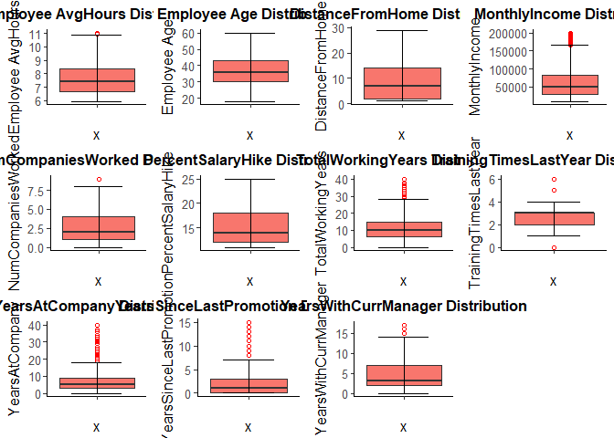

Handle Outliers in AvgHours, MonthlyIncome, NumCompaniesWorked, TotalWorkingYears TrainingTimesLastYear, YearsAtCompany, YearsSinceLastPromotion, YearsWithCurrManager

``` r
employee$AvgHours <- 
  treatoutlier(employee$AvgHours)
employee$MonthlyIncome <- 
  treatoutlier(employee$MonthlyIncome)
employee$NumCompaniesWorked <- 
  treatoutlier(employee$NumCompaniesWorked)
employee$TotalWorkingYears <- 
  treatoutlier(employee$TotalWorkingYears)
employee$TrainingTimesLastYear <- 
  treatoutlier(employee$TrainingTimesLastYear)
employee$YearsAtCompany <- 
  treatoutlier(employee$YearsAtCompany)
employee$YearsSinceLastPromotion <- 
  treatoutlier(employee$YearsSinceLastPromotion)
employee$YearsWithCurrManager <- 
  treatoutlier(employee$YearsWithCurrManager)
```

Recheck the variables using Univariate plots

``` r
plot_grid(ContUnivar(employee$AvgHours, "Employee AvgHours"),
          ContUnivar(employee$Age, "Employee Age"),
          ContUnivar(employee$DistanceFromHome, "DistanceFromHome"),
          ContUnivar(employee$MonthlyIncome, "MonthlyIncome"),
          ContUnivar(employee$NumCompaniesWorked, "NumCompaniesWorked"),
          ContUnivar(employee$PercentSalaryHike, "PercentSalaryHike"),
          ContUnivar(employee$TotalWorkingYears, "TotalWorkingYears"),
          ContUnivar(employee$TrainingTimesLastYear, "TrainingTimesLastYear"),
          ContUnivar(employee$YearsAtCompany, "YearsAtCompany"),
          ContUnivar(employee$YearsSinceLastPromotion, "YearsSinceLastPromotion"),
          ContUnivar(employee$YearsWithCurrManager, "YearsWithCurrManager"))
```

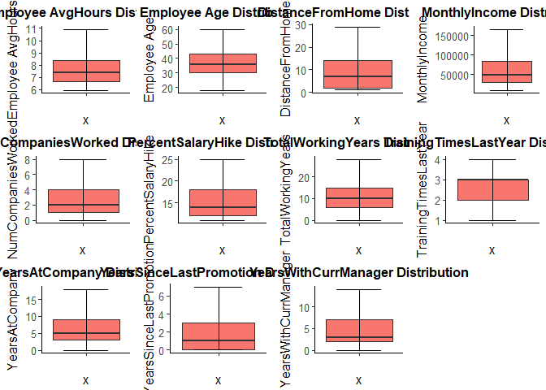

*All outliers are handled*

Multivariate Analysis (Categorical Variables)
---------------------------------------------

How does the categorical variables impact attrition?

``` r
plot_grid((CatBivar(employee$BusinessTravel, employee$Attrition, 
                   "BusinessTravel", "Attrition") + coord_flip()),
          (CatBivar(employee$Department, employee$Attrition,
                   "Department",  "Attrition") + coord_flip()),
           CatBivar(employee$Education, employee$Attrition,
                   "Education", "Attrition"),
          (CatBivar(employee$EducationField, employee$Attrition, 
                   "EducationField", "Attrition") + coord_flip()),
          (CatBivar(employee$JobRole, employee$Attrition, 
                   "JobRole", "Attrition") +  coord_flip()),
          CatBivar(employee$Gender, employee$Attrition,
                   "Gender", "Attrition") + theme(legend.position = 'right'))
```

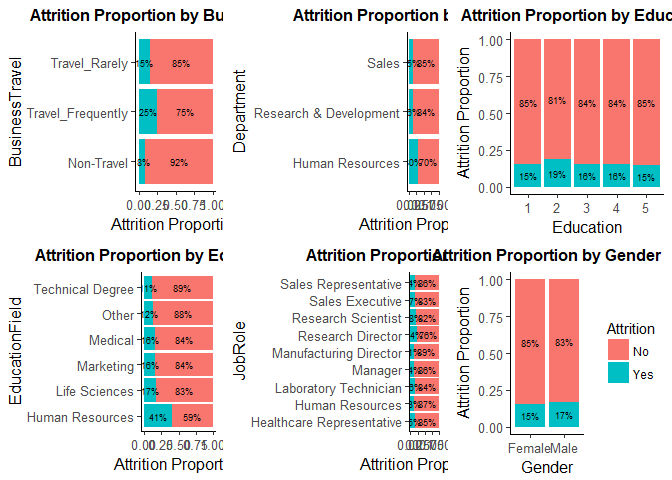

``` r
plot_grid(CatBivar(employee$JobLevel, employee$Attrition,
               "JobLevel", "Attrition"),
          CatBivar(employee$MaritalStatus, employee$Attrition,
               "MaritalStatus",  "Attrition"),
          CatBivar(employee$StockOptionLevel, employee$Attrition,
               "StockOptionLevel", "Attrition"),
          CatBivar(employee$EnvironmentSatisfaction, employee$Attrition, 
               "EnvironmentSatisfaction", "Attrition"),
          CatBivar(employee$JobSatisfaction, employee$Attrition,
               "JobSatisfaction", "Attrition"),
          CatBivar(employee$WorkLifeBalance, employee$Attrition,
               "WorkLifeBalance", "Attrition"),
          CatBivar(employee$JobInvolvement, employee$Attrition,
               "JobInvolvement", "Attrition"),
          CatBivar(employee$JobInvolvement, employee$Attrition,
                   "JobInvolvement", "Attrition"),
          CatBivar(employee$TimeInOffice, employee$Attrition,
                   "TimeInOffice", "Attrition") +
                theme(legend.position = 'right'))
```

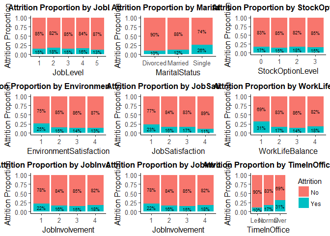

**Summary**

Attrition is higher for the following variables

    1. Frequent BusinessTravel  
    2. Single (Marital Status)
    3. Low Environment Satisfaction
    4. Low Job Satisfaction
    5. Low Work Life balance 
    6. Low Job Involvement
    7. Time in office : Over time
    8. Department :  Human Resources department
    9. Education field :  Human Resources
    10. JobRole : Research Director 

Multivariate Analysis (Continuous & Categorical:target Variable)
----------------------------------------------------------------

``` r
plot_grid(ContCatBivar(employee$Attrition, employee$AvgHours, 
                   "Attrition", "AvgHours"), 
          ContCatBivar(employee$Attrition, employee$Age, 
                       "Attrition", "Age"),
          ContCatBivar(employee$Attrition, employee$DistanceFromHome, 
                       "Attrition", "DistanceFromHome"),
          ContCatBivar(employee$Attrition, employee$MonthlyIncome, 
                       "Attrition", "MonthlyIncome"),
          ContCatBivar(employee$Attrition, employee$NumCompaniesWorked, 
                       "Attrition", "NumCompaniesWorked"),
          ContCatBivar(employee$Attrition, employee$PercentSalaryHike, 
                       "Attrition", "PercentSalaryHike"),
          ContCatBivar(employee$Attrition, employee$TotalWorkingYears, 
                       "Attrition", "TotalWorkingYears"),
          ContCatBivar(employee$Attrition, employee$TrainingTimesLastYear, 
                       "Attrition", "TrainingTimesLastYear"),
          ContCatBivar(employee$Attrition, employee$YearsAtCompany, 
                       "Attrition", "YearsAtCompany"),
          ContCatBivar(employee$Attrition, employee$YearsSinceLastPromotion, 
                       "Attrition", "YearsSinceLastPromotion"),
          ContCatBivar(employee$Attrition, employee$YearsWithCurrManager, 
                       "Attrition", "YearsWithCurrManager"))
```

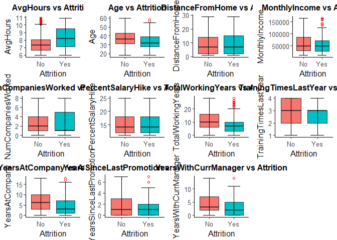

**Summary**

Attrition is higher for employees with

    1. More Average working hours  (over time)
    2. Lesser Age 
    3. Less number of total working years
    4. Less number of years at company
    5. less number of years with current manager
    6. Less number of companies worked

Multivariate Analysis (Continuous Variables)
--------------------------------------------

``` r
emp_model <-  employee

emp_model$Attrition <- as.numeric(ifelse(emp_model$Attrition == "Yes" , 1, 0))

corrplot.mixed(cor(cbind(emp_model[contvarnames], emp_model$Attrition)), 
               upper = "ellipse", tl.cex = 0.40, tl.pos = 'd')
```

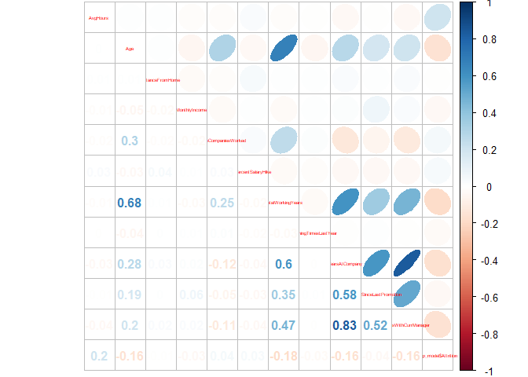

**Summary**

    * As expected Age & total working years are strongly correlated
    * Total working years shows strong correlation with YearsAtComapny

Attrition shows +ve correlation with

    * Average working hours

Attrition shows -ve correlation with

    1. Age 
    2. Total Working years
    3. Years at Company 
    4. Years with current Manager 
    5. Number of companies worked

The above confirms our Multivariate data analysis. The results are the same as those which were identified as the most significant variables in the previous section

Information value
-----------------

``` r
infoTables <- create_infotables(data = emp_model,
                                y = "Attrition",
                                bins = 10,
                                parallel = T)

plotFrame <- infoTables$Summary[order(-infoTables$Summary$IV), ]
plotFrame$Variable <- factor(plotFrame$Variable,
                             levels = plotFrame$Variable[order(-plotFrame$IV)])

ggplot(plotFrame, aes(x = Variable, y = IV)) +
  geom_bar(width = .35, stat = "identity", color = "darkblue", 
           fill = "lightblue") +
  geom_bar(data = filter(plotFrame, IV >= 0.08),
           width = .35, stat = "identity", color = "darkblue", 
           fill = "lightgreen") +
  ggtitle("Information Value") +
  theme_bw() +
  theme(plot.title = element_text(size = 10)) +
  theme(axis.text.x = element_text(angle = 90))
```

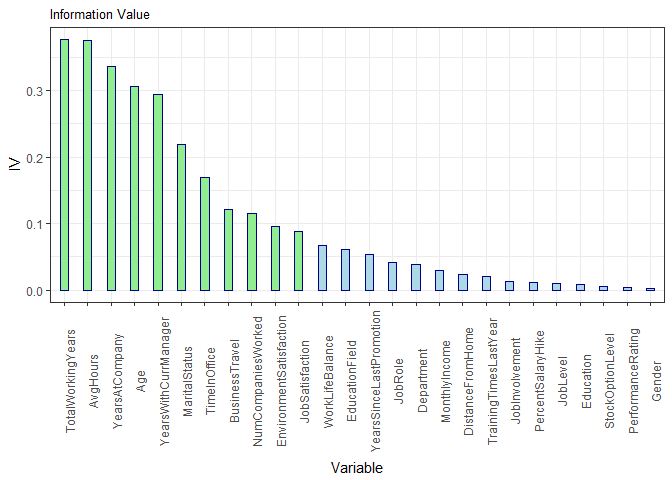

**Summary**

Significant variables with high IV:

S.No.| Variable | IV
--------------------

1 | TotalWorkingYears | 0.37644850 2 | AvgHours | 0.37540939 3 | YearsAtCompany | 0.33667579 4 | Age | 0.30576370 5 | YearsWithCurrManager | 0.29474725 6 | MaritalStatus | 0.21889761 7 | TimeInOffice | 0.16977557 8 | BusinessTravel | 0.12086794 9 | NumCompaniesWorked | 0.11468580 10 | EnvironmentSatisfaction | 0.09581939 11 | JobSatisfaction | 0.08874361

All these variables are the same as those which were identified as the most significant variables during our Exploratory data analysis.

Data Preparation for Model Buidling
-----------------------------------

**Scaling Continuous Variables**

``` r
emp_model[contvarnames] <-  sapply(emp_model[contvarnames], scale)
```

**Dummy Variables for Categorical variables**

``` r
emp_dummy <- dummyVars(" ~ .", data = emp_model, fullRank = T)
emp_model <- data.frame(predict(emp_dummy, newdata = emp_model))
```

*Employee dataset now has 58 variables*

Model Building
--------------

Splitting the data between train and test

``` r
set.seed(100)
indices = sample.split(emp_model$Attrition, SplitRatio = 0.7)
train = emp_model[indices,]
test = emp_model[!(indices),]
```

``` r
m1 = glm(Attrition ~., data = train, family = "binomial")
summary(m1) 
```

    ## 
    ## Call:
    ## glm(formula = Attrition ~ ., family = "binomial", data = train)
    ## 
    ## Deviance Residuals: 
    ##     Min       1Q   Median       3Q      Max  
    ## -1.7803  -0.5288  -0.3043  -0.1481   3.6999  
    ## 
    ## Coefficients:
    ##                                    Estimate Std. Error z value Pr(>|z|)
    ## (Intercept)                        0.935986   0.618968   1.512 0.130490
    ## AvgHours                           0.976496   0.121521   8.036 9.31e-16
    ## Age                               -0.351698   0.083725  -4.201 2.66e-05
    ## BusinessTravel.Travel_Frequently   1.811772   0.284945   6.358 2.04e-10
    ## BusinessTravel.Travel_Rarely       1.057665   0.267336   3.956 7.61e-05
    ## Department.Research...Development -0.949973   0.324351  -2.929 0.003402
    ## Department.Sales                  -0.899406   0.341111  -2.637 0.008372
    ## DistanceFromHome                  -0.099392   0.062757  -1.584 0.113248
    ## Education.2                       -0.030989   0.217091  -0.143 0.886491
    ## Education.3                       -0.224831   0.201571  -1.115 0.264680
    ## Education.4                       -0.281385   0.212374  -1.325 0.185188
    ## Education.5                       -0.590845   0.393391  -1.502 0.133115
    ## EducationField.Life.Sciences      -0.456312   0.453448  -1.006 0.314263
    ## EducationField.Marketing          -0.834767   0.501033  -1.666 0.095695
    ## EducationField.Medical            -0.520898   0.451908  -1.153 0.249049
    ## EducationField.Other              -0.991244   0.524408  -1.890 0.058729
    ## EducationField.Technical.Degree   -0.792608   0.491702  -1.612 0.106968
    ## Gender.Male                        0.166997   0.119925   1.393 0.163766
    ## JobLevel.2                         0.240199   0.137948   1.741 0.081645
    ## JobLevel.3                        -0.166011   0.182717  -0.909 0.363578
    ## JobLevel.4                         0.126942   0.238620   0.532 0.594737
    ## JobLevel.5                        -0.217066   0.303126  -0.716 0.473934
    ## JobRole.Human.Resources           -0.193690   0.393996  -0.492 0.622999
    ## JobRole.Laboratory.Technician      0.207570   0.239267   0.868 0.385656
    ## JobRole.Manager                   -0.126373   0.306155  -0.413 0.679771
    ## JobRole.Manufacturing.Director    -0.488768   0.291159  -1.679 0.093211
    ## JobRole.Research.Director          0.754655   0.286172   2.637 0.008363
    ## JobRole.Research.Scientist         0.334521   0.235513   1.420 0.155493
    ## JobRole.Sales.Executive            0.519410   0.232292   2.236 0.025351
    ## JobRole.Sales.Representative      -0.184236   0.324139  -0.568 0.569774
    ## MaritalStatus.Married              0.236081   0.173870   1.358 0.174526
    ## MaritalStatus.Single               1.180355   0.172106   6.858 6.97e-12
    ## MonthlyIncome                     -0.101559   0.061100  -1.662 0.096478
    ## NumCompaniesWorked                 0.465627   0.062840   7.410 1.27e-13
    ## PercentSalaryHike                  0.033250   0.091539   0.363 0.716433
    ## StockOptionLevel.1                -0.257945   0.128288  -2.011 0.044359
    ## StockOptionLevel.2                 0.040273   0.193660   0.208 0.835262
    ## StockOptionLevel.3                -0.263702   0.269659  -0.978 0.328118
    ## TotalWorkingYears                 -0.617865   0.120518  -5.127 2.95e-07
    ## TrainingTimesLastYear             -0.162747   0.058761  -2.770 0.005611
    ## YearsAtCompany                     0.131308   0.143834   0.913 0.361286
    ## YearsSinceLastPromotion            0.508979   0.080414   6.329 2.46e-10
    ## YearsWithCurrManager              -0.530346   0.123418  -4.297 1.73e-05
    ## EnvironmentSatisfaction.2         -0.971263   0.179441  -5.413 6.21e-08
    ## EnvironmentSatisfaction.3         -0.933047   0.157307  -5.931 3.00e-09
    ## EnvironmentSatisfaction.4         -1.294595   0.164046  -7.892 2.98e-15
    ## JobSatisfaction.2                 -0.709687   0.178098  -3.985 6.75e-05
    ## JobSatisfaction.3                 -0.514204   0.157894  -3.257 0.001127
    ## JobSatisfaction.4                 -1.267933   0.170308  -7.445 9.70e-14
    ## WorkLifeBalance.2                 -1.059674   0.234834  -4.512 6.41e-06
    ## WorkLifeBalance.3                 -1.227307   0.217701  -5.638 1.72e-08
    ## WorkLifeBalance.4                 -0.948690   0.265839  -3.569 0.000359
    ## JobInvolvement.2                  -0.264472   0.256304  -1.032 0.302134
    ## JobInvolvement.3                  -0.404988   0.240040  -1.687 0.091571
    ## JobInvolvement.4                  -0.162584   0.292481  -0.556 0.578294
    ## PerformanceRating.4               -0.005577   0.248928  -0.022 0.982125
    ## TimeInOffice.Normal               -0.588055   0.203909  -2.884 0.003928
    ## TimeInOffice.Over                 -1.630909   0.409965  -3.978 6.94e-05
    ##                                      
    ## (Intercept)                          
    ## AvgHours                          ***
    ## Age                               ***
    ## BusinessTravel.Travel_Frequently  ***
    ## BusinessTravel.Travel_Rarely      ***
    ## Department.Research...Development ** 
    ## Department.Sales                  ** 
    ## DistanceFromHome                     
    ## Education.2                          
    ## Education.3                          
    ## Education.4                          
    ## Education.5                          
    ## EducationField.Life.Sciences         
    ## EducationField.Marketing          .  
    ## EducationField.Medical               
    ## EducationField.Other              .  
    ## EducationField.Technical.Degree      
    ## Gender.Male                          
    ## JobLevel.2                        .  
    ## JobLevel.3                           
    ## JobLevel.4                           
    ## JobLevel.5                           
    ## JobRole.Human.Resources              
    ## JobRole.Laboratory.Technician        
    ## JobRole.Manager                      
    ## JobRole.Manufacturing.Director    .  
    ## JobRole.Research.Director         ** 
    ## JobRole.Research.Scientist           
    ## JobRole.Sales.Executive           *  
    ## JobRole.Sales.Representative         
    ## MaritalStatus.Married                
    ## MaritalStatus.Single              ***
    ## MonthlyIncome                     .  
    ## NumCompaniesWorked                ***
    ## PercentSalaryHike                    
    ## StockOptionLevel.1                *  
    ## StockOptionLevel.2                   
    ## StockOptionLevel.3                   
    ## TotalWorkingYears                 ***
    ## TrainingTimesLastYear             ** 
    ## YearsAtCompany                       
    ## YearsSinceLastPromotion           ***
    ## YearsWithCurrManager              ***
    ## EnvironmentSatisfaction.2         ***
    ## EnvironmentSatisfaction.3         ***
    ## EnvironmentSatisfaction.4         ***
    ## JobSatisfaction.2                 ***
    ## JobSatisfaction.3                 ** 
    ## JobSatisfaction.4                 ***
    ## WorkLifeBalance.2                 ***
    ## WorkLifeBalance.3                 ***
    ## WorkLifeBalance.4                 ***
    ## JobInvolvement.2                     
    ## JobInvolvement.3                  .  
    ## JobInvolvement.4                     
    ## PerformanceRating.4                  
    ## TimeInOffice.Normal               ** 
    ## TimeInOffice.Over                 ***
    ## ---
    ## Signif. codes:  0 '***' 0.001 '**' 0.01 '*' 0.05 '.' 0.1 ' ' 1
    ## 
    ## (Dispersion parameter for binomial family taken to be 1)
    ## 
    ##     Null deviance: 2728.0  on 3086  degrees of freedom
    ## Residual deviance: 2027.6  on 3029  degrees of freedom
    ## AIC: 2143.6
    ## 
    ## Number of Fisher Scoring iterations: 6

**Stepwise selection**

``` r
m2 <- stepAIC(m1, direction = "both")
```

    ## Start:  AIC=2143.62
    ## Attrition ~ AvgHours + Age + BusinessTravel.Travel_Frequently + 
    ##     BusinessTravel.Travel_Rarely + Department.Research...Development + 
    ##     Department.Sales + DistanceFromHome + Education.2 + Education.3 + 
    ##     Education.4 + Education.5 + EducationField.Life.Sciences + 
    ##     EducationField.Marketing + EducationField.Medical + EducationField.Other + 
    ##     EducationField.Technical.Degree + Gender.Male + JobLevel.2 + 
    ##     JobLevel.3 + JobLevel.4 + JobLevel.5 + JobRole.Human.Resources + 
    ##     JobRole.Laboratory.Technician + JobRole.Manager + JobRole.Manufacturing.Director + 
    ##     JobRole.Research.Director + JobRole.Research.Scientist + 
    ##     JobRole.Sales.Executive + JobRole.Sales.Representative + 
    ##     MaritalStatus.Married + MaritalStatus.Single + MonthlyIncome + 
    ##     NumCompaniesWorked + PercentSalaryHike + StockOptionLevel.1 + 
    ##     StockOptionLevel.2 + StockOptionLevel.3 + TotalWorkingYears + 
    ##     TrainingTimesLastYear + YearsAtCompany + YearsSinceLastPromotion + 
    ##     YearsWithCurrManager + EnvironmentSatisfaction.2 + EnvironmentSatisfaction.3 + 
    ##     EnvironmentSatisfaction.4 + JobSatisfaction.2 + JobSatisfaction.3 + 
    ##     JobSatisfaction.4 + WorkLifeBalance.2 + WorkLifeBalance.3 + 
    ##     WorkLifeBalance.4 + JobInvolvement.2 + JobInvolvement.3 + 
    ##     JobInvolvement.4 + PerformanceRating.4 + TimeInOffice.Normal + 
    ##     TimeInOffice.Over
    ## 
    ##                                     Df Deviance    AIC
    ## - PerformanceRating.4                1   2027.6 2141.6
    ## - Education.2                        1   2027.6 2141.6
    ## - StockOptionLevel.2                 1   2027.7 2141.7
    ## - PercentSalaryHike                  1   2027.8 2141.8
    ## - JobRole.Manager                    1   2027.8 2141.8
    ## - JobRole.Human.Resources            1   2027.9 2141.9
    ## - JobLevel.4                         1   2027.9 2141.9
    ## - JobInvolvement.4                   1   2027.9 2141.9
    ## - JobRole.Sales.Representative       1   2027.9 2141.9
    ## - JobLevel.5                         1   2028.1 2142.1
    ## - JobRole.Laboratory.Technician      1   2028.4 2142.4
    ## - YearsAtCompany                     1   2028.4 2142.4
    ## - JobLevel.3                         1   2028.5 2142.4
    ## - StockOptionLevel.3                 1   2028.6 2142.6
    ## - EducationField.Life.Sciences       1   2028.6 2142.6
    ## - JobInvolvement.2                   1   2028.7 2142.7
    ## - Education.3                        1   2028.8 2142.8
    ## - EducationField.Medical             1   2029.0 2143.0
    ## - Education.4                        1   2029.3 2143.3
    ## - MaritalStatus.Married              1   2029.5 2143.5
    ## - Gender.Male                        1   2029.6 2143.6
    ## <none>                                   2027.6 2143.6
    ## - JobRole.Research.Scientist         1   2029.7 2143.7
    ## - Education.5                        1   2030.0 2144.0
    ## - DistanceFromHome                   1   2030.2 2144.2
    ## - EducationField.Technical.Degree    1   2030.3 2144.3
    ## - JobInvolvement.3                   1   2030.4 2144.4
    ## - EducationField.Marketing           1   2030.4 2144.4
    ## - MonthlyIncome                      1   2030.4 2144.4
    ## - JobRole.Manufacturing.Director     1   2030.5 2144.5
    ## - JobLevel.2                         1   2030.7 2144.7
    ## - EducationField.Other               1   2031.3 2145.3
    ## - StockOptionLevel.1                 1   2031.7 2145.7
    ## - JobRole.Sales.Executive            1   2032.8 2146.8
    ## - Department.Sales                   1   2034.2 2148.2
    ## - JobRole.Research.Director          1   2034.6 2148.6
    ## - TrainingTimesLastYear              1   2035.3 2149.3
    ## - Department.Research...Development  1   2035.5 2149.5
    ## - TimeInOffice.Normal                1   2036.0 2150.0
    ## - JobSatisfaction.3                  1   2038.2 2152.2
    ## - WorkLifeBalance.4                  1   2040.3 2154.3
    ## - TimeInOffice.Over                  1   2043.5 2157.5
    ## - JobSatisfaction.2                  1   2043.8 2157.8
    ## - YearsWithCurrManager               1   2045.3 2159.3
    ## - Age                                1   2046.1 2160.1
    ## - BusinessTravel.Travel_Rarely       1   2046.6 2160.6
    ## - WorkLifeBalance.2                  1   2047.2 2161.2
    ## - TotalWorkingYears                  1   2056.4 2170.4
    ## - WorkLifeBalance.3                  1   2057.1 2171.1
    ## - EnvironmentSatisfaction.2          1   2058.0 2172.0
    ## - EnvironmentSatisfaction.3          1   2063.2 2177.2
    ## - YearsSinceLastPromotion            1   2067.6 2181.6
    ## - BusinessTravel.Travel_Frequently   1   2078.7 2192.7
    ## - MaritalStatus.Single               1   2079.5 2193.5
    ## - NumCompaniesWorked                 1   2081.9 2195.9
    ## - JobSatisfaction.4                  1   2084.6 2198.6
    ## - EnvironmentSatisfaction.4          1   2092.3 2206.3
    ## - AvgHours                           1   2092.8 2206.8
    ## 
    ## Step:  AIC=2141.62
    ## Attrition ~ AvgHours + Age + BusinessTravel.Travel_Frequently + 
    ##     BusinessTravel.Travel_Rarely + Department.Research...Development + 
    ##     Department.Sales + DistanceFromHome + Education.2 + Education.3 + 
    ##     Education.4 + Education.5 + EducationField.Life.Sciences + 
    ##     EducationField.Marketing + EducationField.Medical + EducationField.Other + 
    ##     EducationField.Technical.Degree + Gender.Male + JobLevel.2 + 
    ##     JobLevel.3 + JobLevel.4 + JobLevel.5 + JobRole.Human.Resources + 
    ##     JobRole.Laboratory.Technician + JobRole.Manager + JobRole.Manufacturing.Director + 
    ##     JobRole.Research.Director + JobRole.Research.Scientist + 
    ##     JobRole.Sales.Executive + JobRole.Sales.Representative + 
    ##     MaritalStatus.Married + MaritalStatus.Single + MonthlyIncome + 
    ##     NumCompaniesWorked + PercentSalaryHike + StockOptionLevel.1 + 
    ##     StockOptionLevel.2 + StockOptionLevel.3 + TotalWorkingYears + 
    ##     TrainingTimesLastYear + YearsAtCompany + YearsSinceLastPromotion + 
    ##     YearsWithCurrManager + EnvironmentSatisfaction.2 + EnvironmentSatisfaction.3 + 
    ##     EnvironmentSatisfaction.4 + JobSatisfaction.2 + JobSatisfaction.3 + 
    ##     JobSatisfaction.4 + WorkLifeBalance.2 + WorkLifeBalance.3 + 
    ##     WorkLifeBalance.4 + JobInvolvement.2 + JobInvolvement.3 + 
    ##     JobInvolvement.4 + TimeInOffice.Normal + TimeInOffice.Over
    ## 
    ##                                     Df Deviance    AIC
    ## - Education.2                        1   2027.6 2139.6
    ## - StockOptionLevel.2                 1   2027.7 2139.7
    ## - JobRole.Manager                    1   2027.8 2139.8
    ## - JobRole.Human.Resources            1   2027.9 2139.9
    ## - JobLevel.4                         1   2027.9 2139.9
    ## - PercentSalaryHike                  1   2027.9 2139.9
    ## - JobInvolvement.4                   1   2027.9 2139.9
    ## - JobRole.Sales.Representative       1   2027.9 2139.9
    ## - JobLevel.5                         1   2028.1 2140.1
    ## - JobRole.Laboratory.Technician      1   2028.4 2140.4
    ## - YearsAtCompany                     1   2028.5 2140.4
    ## - JobLevel.3                         1   2028.5 2140.4
    ## - StockOptionLevel.3                 1   2028.6 2140.6
    ## - EducationField.Life.Sciences       1   2028.6 2140.6
    ## - JobInvolvement.2                   1   2028.7 2140.7
    ## - Education.3                        1   2028.8 2140.8
    ## - EducationField.Medical             1   2029.0 2141.0
    ## - Education.4                        1   2029.3 2141.3
    ## - MaritalStatus.Married              1   2029.5 2141.5
    ## - Gender.Male                        1   2029.6 2141.6
    ## <none>                                   2027.6 2141.6
    ## - JobRole.Research.Scientist         1   2029.7 2141.7
    ## - Education.5                        1   2030.0 2142.0
    ## - DistanceFromHome                   1   2030.2 2142.2
    ## - EducationField.Technical.Degree    1   2030.3 2142.3
    ## - JobInvolvement.3                   1   2030.4 2142.4
    ## - EducationField.Marketing           1   2030.4 2142.4
    ## - MonthlyIncome                      1   2030.4 2142.4
    ## - JobRole.Manufacturing.Director     1   2030.5 2142.5
    ## - JobLevel.2                         1   2030.7 2142.7
    ## - EducationField.Other               1   2031.3 2143.3
    ## + PerformanceRating.4                1   2027.6 2143.6
    ## - StockOptionLevel.1                 1   2031.7 2143.7
    ## - JobRole.Sales.Executive            1   2032.8 2144.8
    ## - Department.Sales                   1   2034.2 2146.2
    ## - JobRole.Research.Director          1   2034.6 2146.6
    ## - TrainingTimesLastYear              1   2035.3 2147.3
    ## - Department.Research...Development  1   2035.5 2147.5
    ## - TimeInOffice.Normal                1   2036.0 2148.0
    ## - JobSatisfaction.3                  1   2038.2 2150.2
    ## - WorkLifeBalance.4                  1   2040.3 2152.3
    ## - TimeInOffice.Over                  1   2043.5 2155.5
    ## - JobSatisfaction.2                  1   2043.8 2155.8
    ## - YearsWithCurrManager               1   2045.3 2157.3
    ## - Age                                1   2046.1 2158.1
    ## - BusinessTravel.Travel_Rarely       1   2046.6 2158.6
    ## - WorkLifeBalance.2                  1   2047.2 2159.2
    ## - TotalWorkingYears                  1   2056.5 2168.5
    ## - WorkLifeBalance.3                  1   2057.1 2169.1
    ## - EnvironmentSatisfaction.2          1   2058.0 2170.0
    ## - EnvironmentSatisfaction.3          1   2063.2 2175.2
    ## - YearsSinceLastPromotion            1   2067.6 2179.6
    ## - BusinessTravel.Travel_Frequently   1   2078.8 2190.8
    ## - MaritalStatus.Single               1   2079.5 2191.5
    ## - NumCompaniesWorked                 1   2081.9 2193.9
    ## - JobSatisfaction.4                  1   2084.7 2196.7
    ## - EnvironmentSatisfaction.4          1   2092.4 2204.4
    ## - AvgHours                           1   2092.8 2204.8
    ## 
    ## Step:  AIC=2139.64
    ## Attrition ~ AvgHours + Age + BusinessTravel.Travel_Frequently + 
    ##     BusinessTravel.Travel_Rarely + Department.Research...Development + 
    ##     Department.Sales + DistanceFromHome + Education.3 + Education.4 + 
    ##     Education.5 + EducationField.Life.Sciences + EducationField.Marketing + 
    ##     EducationField.Medical + EducationField.Other + EducationField.Technical.Degree + 
    ##     Gender.Male + JobLevel.2 + JobLevel.3 + JobLevel.4 + JobLevel.5 + 
    ##     JobRole.Human.Resources + JobRole.Laboratory.Technician + 
    ##     JobRole.Manager + JobRole.Manufacturing.Director + JobRole.Research.Director + 
    ##     JobRole.Research.Scientist + JobRole.Sales.Executive + JobRole.Sales.Representative + 
    ##     MaritalStatus.Married + MaritalStatus.Single + MonthlyIncome + 
    ##     NumCompaniesWorked + PercentSalaryHike + StockOptionLevel.1 + 
    ##     StockOptionLevel.2 + StockOptionLevel.3 + TotalWorkingYears + 
    ##     TrainingTimesLastYear + YearsAtCompany + YearsSinceLastPromotion + 
    ##     YearsWithCurrManager + EnvironmentSatisfaction.2 + EnvironmentSatisfaction.3 + 
    ##     EnvironmentSatisfaction.4 + JobSatisfaction.2 + JobSatisfaction.3 + 
    ##     JobSatisfaction.4 + WorkLifeBalance.2 + WorkLifeBalance.3 + 
    ##     WorkLifeBalance.4 + JobInvolvement.2 + JobInvolvement.3 + 
    ##     JobInvolvement.4 + TimeInOffice.Normal + TimeInOffice.Over
    ## 
    ##                                     Df Deviance    AIC
    ## - StockOptionLevel.2                 1   2027.7 2137.7
    ## - JobRole.Manager                    1   2027.8 2137.8
    ## - JobRole.Human.Resources            1   2027.9 2137.9
    ## - JobLevel.4                         1   2027.9 2137.9
    ## - PercentSalaryHike                  1   2027.9 2137.9
    ## - JobInvolvement.4                   1   2027.9 2137.9
    ## - JobRole.Sales.Representative       1   2028.0 2138.0
    ## - JobLevel.5                         1   2028.2 2138.2
    ## - JobRole.Laboratory.Technician      1   2028.4 2138.4
    ## - YearsAtCompany                     1   2028.5 2138.5
    ## - JobLevel.3                         1   2028.5 2138.5
    ## - StockOptionLevel.3                 1   2028.6 2138.6
    ## - EducationField.Life.Sciences       1   2028.7 2138.7
    ## - JobInvolvement.2                   1   2028.7 2138.7
    ## - EducationField.Medical             1   2029.0 2139.0
    ## - MaritalStatus.Married              1   2029.5 2139.5
    ## - Gender.Male                        1   2029.6 2139.6
    ## <none>                                   2027.6 2139.6
    ## - Education.3                        1   2029.7 2139.7
    ## - JobRole.Research.Scientist         1   2029.7 2139.7
    ## - DistanceFromHome                   1   2030.2 2140.2
    ## - Education.5                        1   2030.2 2140.2
    ## - EducationField.Technical.Degree    1   2030.3 2140.3
    ## - JobInvolvement.3                   1   2030.4 2140.4
    ## - Education.4                        1   2030.4 2140.4
    ## - EducationField.Marketing           1   2030.4 2140.4
    ## - MonthlyIncome                      1   2030.5 2140.4
    ## - JobRole.Manufacturing.Director     1   2030.5 2140.5
    ## - JobLevel.2                         1   2030.7 2140.7
    ## - EducationField.Other               1   2031.3 2141.3
    ## + Education.2                        1   2027.6 2141.6
    ## + PerformanceRating.4                1   2027.6 2141.6
    ## - StockOptionLevel.1                 1   2031.7 2141.7
    ## - JobRole.Sales.Executive            1   2032.8 2142.8
    ## - Department.Sales                   1   2034.2 2144.2
    ## - JobRole.Research.Director          1   2034.6 2144.6
    ## - TrainingTimesLastYear              1   2035.3 2145.3
    ## - Department.Research...Development  1   2035.5 2145.6
    ## - TimeInOffice.Normal                1   2036.1 2146.1
    ## - JobSatisfaction.3                  1   2038.2 2148.2
    ## - WorkLifeBalance.4                  1   2040.3 2150.3
    ## - TimeInOffice.Over                  1   2043.6 2153.6
    ## - JobSatisfaction.2                  1   2043.8 2153.8
    ## - YearsWithCurrManager               1   2045.3 2155.3
    ## - Age                                1   2046.2 2156.2
    ## - BusinessTravel.Travel_Rarely       1   2046.6 2156.6
    ## - WorkLifeBalance.2                  1   2047.2 2157.2
    ## - TotalWorkingYears                  1   2056.5 2166.5
    ## - WorkLifeBalance.3                  1   2057.2 2167.2
    ## - EnvironmentSatisfaction.2          1   2058.0 2168.0
    ## - EnvironmentSatisfaction.3          1   2063.2 2173.2
    ## - YearsSinceLastPromotion            1   2067.6 2177.6
    ## - BusinessTravel.Travel_Frequently   1   2078.8 2188.8
    ## - MaritalStatus.Single               1   2079.5 2189.5
    ## - NumCompaniesWorked                 1   2081.9 2191.9
    ## - JobSatisfaction.4                  1   2084.7 2194.7
    ## - EnvironmentSatisfaction.4          1   2092.4 2202.4
    ## - AvgHours                           1   2092.9 2202.9
    ## 
    ## Step:  AIC=2137.68
    ## Attrition ~ AvgHours + Age + BusinessTravel.Travel_Frequently + 
    ##     BusinessTravel.Travel_Rarely + Department.Research...Development + 
    ##     Department.Sales + DistanceFromHome + Education.3 + Education.4 + 
    ##     Education.5 + EducationField.Life.Sciences + EducationField.Marketing + 
    ##     EducationField.Medical + EducationField.Other + EducationField.Technical.Degree + 
    ##     Gender.Male + JobLevel.2 + JobLevel.3 + JobLevel.4 + JobLevel.5 + 
    ##     JobRole.Human.Resources + JobRole.Laboratory.Technician + 
    ##     JobRole.Manager + JobRole.Manufacturing.Director + JobRole.Research.Director + 
    ##     JobRole.Research.Scientist + JobRole.Sales.Executive + JobRole.Sales.Representative + 
    ##     MaritalStatus.Married + MaritalStatus.Single + MonthlyIncome + 
    ##     NumCompaniesWorked + PercentSalaryHike + StockOptionLevel.1 + 
    ##     StockOptionLevel.3 + TotalWorkingYears + TrainingTimesLastYear + 
    ##     YearsAtCompany + YearsSinceLastPromotion + YearsWithCurrManager + 
    ##     EnvironmentSatisfaction.2 + EnvironmentSatisfaction.3 + EnvironmentSatisfaction.4 + 
    ##     JobSatisfaction.2 + JobSatisfaction.3 + JobSatisfaction.4 + 
    ##     WorkLifeBalance.2 + WorkLifeBalance.3 + WorkLifeBalance.4 + 
    ##     JobInvolvement.2 + JobInvolvement.3 + JobInvolvement.4 + 
    ##     TimeInOffice.Normal + TimeInOffice.Over
    ## 
    ##                                     Df Deviance    AIC
    ## - JobRole.Manager                    1   2027.9 2135.9
    ## - JobRole.Human.Resources            1   2027.9 2135.9
    ## - JobLevel.4                         1   2028.0 2135.9
    ## - JobInvolvement.4                   1   2028.0 2136.0
    ## - PercentSalaryHike                  1   2028.0 2136.0
    ## - JobRole.Sales.Representative       1   2028.0 2136.0
    ## - JobLevel.5                         1   2028.2 2136.2
    ## - JobRole.Laboratory.Technician      1   2028.5 2136.5
    ## - JobLevel.3                         1   2028.5 2136.5
    ## - YearsAtCompany                     1   2028.5 2136.5
    ## - EducationField.Life.Sciences       1   2028.7 2136.7
    ## - JobInvolvement.2                   1   2028.7 2136.7
    ## - StockOptionLevel.3                 1   2028.8 2136.8
    ## - EducationField.Medical             1   2029.0 2137.0
    ## - MaritalStatus.Married              1   2029.6 2137.6
    ## - Gender.Male                        1   2029.6 2137.6
    ## <none>                                   2027.7 2137.7
    ## - Education.3                        1   2029.8 2137.8
    ## - JobRole.Research.Scientist         1   2029.8 2137.8
    ## - DistanceFromHome                   1   2030.2 2138.2
    ## - Education.5                        1   2030.3 2138.3
    ## - EducationField.Technical.Degree    1   2030.3 2138.3
    ## - JobInvolvement.3                   1   2030.4 2138.4
    ## - Education.4                        1   2030.5 2138.4
    ## - EducationField.Marketing           1   2030.5 2138.5
    ## - MonthlyIncome                      1   2030.5 2138.5
    ## - JobRole.Manufacturing.Director     1   2030.5 2138.5
    ## - JobLevel.2                         1   2030.7 2138.7
    ## - EducationField.Other               1   2031.3 2139.3
    ## + StockOptionLevel.2                 1   2027.6 2139.6
    ## + Education.2                        1   2027.7 2139.7
    ## + PerformanceRating.4                1   2027.7 2139.7
    ## - StockOptionLevel.1                 1   2032.5 2140.4
    ## - JobRole.Sales.Executive            1   2032.9 2140.9
    ## - Department.Sales                   1   2034.3 2142.3
    ## - JobRole.Research.Director          1   2034.7 2142.7
    ## - TrainingTimesLastYear              1   2035.4 2143.4
    ## - Department.Research...Development  1   2035.6 2143.6
    ## - TimeInOffice.Normal                1   2036.1 2144.1
    ## - JobSatisfaction.3                  1   2038.2 2146.2
    ## - WorkLifeBalance.4                  1   2040.4 2148.4
    ## - TimeInOffice.Over                  1   2043.7 2151.7
    ## - JobSatisfaction.2                  1   2043.8 2151.8
    ## - YearsWithCurrManager               1   2045.5 2153.5
    ## - Age                                1   2046.4 2154.4
    ## - BusinessTravel.Travel_Rarely       1   2046.7 2154.7
    ## - WorkLifeBalance.2                  1   2047.4 2155.4
    ## - TotalWorkingYears                  1   2056.5 2164.5
    ## - WorkLifeBalance.3                  1   2057.5 2165.5
    ## - EnvironmentSatisfaction.2          1   2058.1 2166.1
    ## - EnvironmentSatisfaction.3          1   2063.4 2171.4
    ## - YearsSinceLastPromotion            1   2067.7 2175.7
    ## - BusinessTravel.Travel_Frequently   1   2078.8 2186.8
    ## - MaritalStatus.Single               1   2079.7 2187.7
    ## - NumCompaniesWorked                 1   2082.1 2190.1
    ## - JobSatisfaction.4                  1   2084.7 2192.7
    ## - EnvironmentSatisfaction.4          1   2092.7 2200.7
    ## - AvgHours                           1   2093.1 2201.1
    ## 
    ## Step:  AIC=2135.86
    ## Attrition ~ AvgHours + Age + BusinessTravel.Travel_Frequently + 
    ##     BusinessTravel.Travel_Rarely + Department.Research...Development + 
    ##     Department.Sales + DistanceFromHome + Education.3 + Education.4 + 
    ##     Education.5 + EducationField.Life.Sciences + EducationField.Marketing + 
    ##     EducationField.Medical + EducationField.Other + EducationField.Technical.Degree + 
    ##     Gender.Male + JobLevel.2 + JobLevel.3 + JobLevel.4 + JobLevel.5 + 
    ##     JobRole.Human.Resources + JobRole.Laboratory.Technician + 
    ##     JobRole.Manufacturing.Director + JobRole.Research.Director + 
    ##     JobRole.Research.Scientist + JobRole.Sales.Executive + JobRole.Sales.Representative + 
    ##     MaritalStatus.Married + MaritalStatus.Single + MonthlyIncome + 
    ##     NumCompaniesWorked + PercentSalaryHike + StockOptionLevel.1 + 
    ##     StockOptionLevel.3 + TotalWorkingYears + TrainingTimesLastYear + 
    ##     YearsAtCompany + YearsSinceLastPromotion + YearsWithCurrManager + 
    ##     EnvironmentSatisfaction.2 + EnvironmentSatisfaction.3 + EnvironmentSatisfaction.4 + 
    ##     JobSatisfaction.2 + JobSatisfaction.3 + JobSatisfaction.4 + 
    ##     WorkLifeBalance.2 + WorkLifeBalance.3 + WorkLifeBalance.4 + 
    ##     JobInvolvement.2 + JobInvolvement.3 + JobInvolvement.4 + 
    ##     TimeInOffice.Normal + TimeInOffice.Over
    ## 
    ##                                     Df Deviance    AIC
    ## - JobRole.Human.Resources            1   2028.0 2134.0
    ## - JobRole.Sales.Representative       1   2028.1 2134.1
    ## - JobInvolvement.4                   1   2028.1 2134.1
    ## - JobLevel.4                         1   2028.2 2134.2
    ## - PercentSalaryHike                  1   2028.2 2134.2
    ## - JobLevel.5                         1   2028.4 2134.4
    ## - JobLevel.3                         1   2028.7 2134.7
    ## - YearsAtCompany                     1   2028.7 2134.7
    ## - EducationField.Life.Sciences       1   2028.8 2134.8
    ## - JobInvolvement.2                   1   2028.9 2134.9
    ## - StockOptionLevel.3                 1   2028.9 2134.9
    ## - EducationField.Medical             1   2029.2 2135.2
    ## - JobRole.Laboratory.Technician      1   2029.5 2135.5
    ## - MaritalStatus.Married              1   2029.8 2135.8
    ## <none>                                   2027.9 2135.9
    ## - Gender.Male                        1   2029.9 2135.9
    ## - Education.3                        1   2030.0 2136.0
    ## - DistanceFromHome                   1   2030.4 2136.4
    ## - EducationField.Technical.Degree    1   2030.4 2136.4
    ## - Education.5                        1   2030.5 2136.5
    ## - JobInvolvement.3                   1   2030.5 2136.5
    ## - EducationField.Marketing           1   2030.6 2136.6
    ## - JobRole.Manufacturing.Director     1   2030.7 2136.7
    ## - Education.4                        1   2030.7 2136.7
    ## - MonthlyIncome                      1   2030.7 2136.7
    ## - JobLevel.2                         1   2030.9 2136.9
    ## - EducationField.Other               1   2031.5 2137.4
    ## + JobRole.Manager                    1   2027.7 2137.7
    ## - JobRole.Research.Scientist         1   2031.8 2137.8
    ## + StockOptionLevel.2                 1   2027.8 2137.8
    ## + Education.2                        1   2027.8 2137.8
    ## + PerformanceRating.4                1   2027.9 2137.9
    ## - StockOptionLevel.1                 1   2032.6 2138.6
    ## - Department.Sales                   1   2034.5 2140.5
    ## - TrainingTimesLastYear              1   2035.6 2141.6
    ## - Department.Research...Development  1   2035.8 2141.8
    ## - TimeInOffice.Normal                1   2036.3 2142.3
    ## - JobRole.Sales.Executive            1   2036.7 2142.7
    ## - JobRole.Research.Director          1   2037.6 2143.6
    ## - JobSatisfaction.3                  1   2038.5 2144.5
    ## - WorkLifeBalance.4                  1   2040.7 2146.7
    ## - TimeInOffice.Over                  1   2043.8 2149.8
    ## - JobSatisfaction.2                  1   2043.9 2149.9
    ## - YearsWithCurrManager               1   2045.6 2151.6
    ## - Age                                1   2046.7 2152.7
    ## - BusinessTravel.Travel_Rarely       1   2046.9 2152.9
    ## - WorkLifeBalance.2                  1   2048.0 2154.0
    ## - TotalWorkingYears                  1   2056.6 2162.6
    ## - EnvironmentSatisfaction.2          1   2058.1 2164.1
    ## - WorkLifeBalance.3                  1   2058.1 2164.1
    ## - EnvironmentSatisfaction.3          1   2063.5 2169.5
    ## - YearsSinceLastPromotion            1   2067.7 2173.7
    ## - BusinessTravel.Travel_Frequently   1   2079.0 2185.0
    ## - MaritalStatus.Single               1   2079.8 2185.8
    ## - NumCompaniesWorked                 1   2082.3 2188.3
    ## - JobSatisfaction.4                  1   2084.9 2190.9
    ## - EnvironmentSatisfaction.4          1   2092.7 2198.7
    ## - AvgHours                           1   2093.1 2199.1
    ## 
    ## Step:  AIC=2134
    ## Attrition ~ AvgHours + Age + BusinessTravel.Travel_Frequently + 
    ##     BusinessTravel.Travel_Rarely + Department.Research...Development + 
    ##     Department.Sales + DistanceFromHome + Education.3 + Education.4 + 
    ##     Education.5 + EducationField.Life.Sciences + EducationField.Marketing + 
    ##     EducationField.Medical + EducationField.Other + EducationField.Technical.Degree + 
    ##     Gender.Male + JobLevel.2 + JobLevel.3 + JobLevel.4 + JobLevel.5 + 
    ##     JobRole.Laboratory.Technician + JobRole.Manufacturing.Director + 
    ##     JobRole.Research.Director + JobRole.Research.Scientist + 
    ##     JobRole.Sales.Executive + JobRole.Sales.Representative + 
    ##     MaritalStatus.Married + MaritalStatus.Single + MonthlyIncome + 
    ##     NumCompaniesWorked + PercentSalaryHike + StockOptionLevel.1 + 
    ##     StockOptionLevel.3 + TotalWorkingYears + TrainingTimesLastYear + 
    ##     YearsAtCompany + YearsSinceLastPromotion + YearsWithCurrManager + 
    ##     EnvironmentSatisfaction.2 + EnvironmentSatisfaction.3 + EnvironmentSatisfaction.4 + 
    ##     JobSatisfaction.2 + JobSatisfaction.3 + JobSatisfaction.4 + 
    ##     WorkLifeBalance.2 + WorkLifeBalance.3 + WorkLifeBalance.4 + 
    ##     JobInvolvement.2 + JobInvolvement.3 + JobInvolvement.4 + 
    ##     TimeInOffice.Normal + TimeInOffice.Over
    ## 
    ##                                     Df Deviance    AIC
    ## - JobRole.Sales.Representative       1   2028.1 2132.1
    ## - JobInvolvement.4                   1   2028.2 2132.2
    ## - JobLevel.4                         1   2028.3 2132.3
    ## - PercentSalaryHike                  1   2028.3 2132.3
    ## - JobLevel.5                         1   2028.5 2132.5
    ## - JobLevel.3                         1   2028.8 2132.8
    ## - YearsAtCompany                     1   2028.8 2132.8
    ## - JobInvolvement.2                   1   2029.0 2133.0
    ## - EducationField.Life.Sciences       1   2029.0 2133.0
    ## - StockOptionLevel.3                 1   2029.0 2133.1
    ## - EducationField.Medical             1   2029.3 2133.3
    ## - MaritalStatus.Married              1   2029.9 2133.9
    ## - Gender.Male                        1   2030.0 2134.0
    ## <none>                                   2028.0 2134.0
    ## - Education.3                        1   2030.1 2134.1
    ## - JobRole.Laboratory.Technician      1   2030.2 2134.2
    ## - DistanceFromHome                   1   2030.6 2134.6
    ## - EducationField.Technical.Degree    1   2030.6 2134.6
    ## - JobInvolvement.3                   1   2030.6 2134.6
    ## - JobRole.Manufacturing.Director     1   2030.7 2134.7
    ## - Education.5                        1   2030.7 2134.7
    ## - MonthlyIncome                      1   2030.8 2134.8
    ## - EducationField.Marketing           1   2030.8 2134.8
    ## - Education.4                        1   2030.9 2134.9
    ## - JobLevel.2                         1   2031.1 2135.1
    ## - EducationField.Other               1   2031.6 2135.6
    ## + JobRole.Human.Resources            1   2027.9 2135.9
    ## + JobRole.Manager                    1   2027.9 2135.9
    ## + StockOptionLevel.2                 1   2028.0 2136.0
    ## + Education.2                        1   2028.0 2136.0
    ## + PerformanceRating.4                1   2028.0 2136.0
    ## - StockOptionLevel.1                 1   2032.8 2136.8
    ## - JobRole.Research.Scientist         1   2032.8 2136.8
    ## - Department.Sales                   1   2034.5 2138.5
    ## - TrainingTimesLastYear              1   2035.8 2139.8
    ## - Department.Research...Development  1   2035.9 2139.9
    ## - TimeInOffice.Normal                1   2036.3 2140.3
    ## - JobRole.Sales.Executive            1   2038.5 2142.5
    ## - JobSatisfaction.3                  1   2038.6 2142.6
    ## - JobRole.Research.Director          1   2039.0 2143.0
    ## - WorkLifeBalance.4                  1   2040.8 2144.8
    ## - TimeInOffice.Over                  1   2043.8 2147.8
    ## - JobSatisfaction.2                  1   2044.1 2148.1
    ## - YearsWithCurrManager               1   2045.7 2149.7
    ## - Age                                1   2047.0 2151.0
    ## - BusinessTravel.Travel_Rarely       1   2047.0 2151.0
    ## - WorkLifeBalance.2                  1   2048.2 2152.2
    ## - TotalWorkingYears                  1   2056.7 2160.7
    ## - EnvironmentSatisfaction.2          1   2058.2 2162.2
    ## - WorkLifeBalance.3                  1   2058.3 2162.3
    ## - EnvironmentSatisfaction.3          1   2063.6 2167.6
    ## - YearsSinceLastPromotion            1   2068.0 2172.0
    ## - BusinessTravel.Travel_Frequently   1   2079.1 2183.1
    ## - MaritalStatus.Single               1   2079.8 2183.8
    ## - NumCompaniesWorked                 1   2082.3 2186.3
    ## - JobSatisfaction.4                  1   2085.0 2189.0
    ## - EnvironmentSatisfaction.4          1   2092.9 2196.9
    ## - AvgHours                           1   2093.2 2197.2
    ## 
    ## Step:  AIC=2132.14
    ## Attrition ~ AvgHours + Age + BusinessTravel.Travel_Frequently + 
    ##     BusinessTravel.Travel_Rarely + Department.Research...Development + 
    ##     Department.Sales + DistanceFromHome + Education.3 + Education.4 + 
    ##     Education.5 + EducationField.Life.Sciences + EducationField.Marketing + 
    ##     EducationField.Medical + EducationField.Other + EducationField.Technical.Degree + 
    ##     Gender.Male + JobLevel.2 + JobLevel.3 + JobLevel.4 + JobLevel.5 + 
    ##     JobRole.Laboratory.Technician + JobRole.Manufacturing.Director + 
    ##     JobRole.Research.Director + JobRole.Research.Scientist + 
    ##     JobRole.Sales.Executive + MaritalStatus.Married + MaritalStatus.Single + 
    ##     MonthlyIncome + NumCompaniesWorked + PercentSalaryHike + 
    ##     StockOptionLevel.1 + StockOptionLevel.3 + TotalWorkingYears + 
    ##     TrainingTimesLastYear + YearsAtCompany + YearsSinceLastPromotion + 
    ##     YearsWithCurrManager + EnvironmentSatisfaction.2 + EnvironmentSatisfaction.3 + 
    ##     EnvironmentSatisfaction.4 + JobSatisfaction.2 + JobSatisfaction.3 + 
    ##     JobSatisfaction.4 + WorkLifeBalance.2 + WorkLifeBalance.3 + 
    ##     WorkLifeBalance.4 + JobInvolvement.2 + JobInvolvement.3 + 
    ##     JobInvolvement.4 + TimeInOffice.Normal + TimeInOffice.Over
    ## 
    ##                                     Df Deviance    AIC
    ## - JobInvolvement.4                   1   2028.4 2130.4
    ## - JobLevel.4                         1   2028.4 2130.4
    ## - PercentSalaryHike                  1   2028.4 2130.4
    ## - JobLevel.5                         1   2028.7 2130.7
    ## - JobLevel.3                         1   2028.9 2130.9
    ## - YearsAtCompany                     1   2029.0 2131.0
    ## - JobInvolvement.2                   1   2029.2 2131.2
    ## - EducationField.Life.Sciences       1   2029.2 2131.2
    ## - StockOptionLevel.3                 1   2029.2 2131.2
    ## - EducationField.Medical             1   2029.5 2131.5
    ## - MaritalStatus.Married              1   2030.0 2132.0
    ## - Gender.Male                        1   2030.1 2132.1
    ## <none>                                   2028.1 2132.1
    ## - Education.3                        1   2030.3 2132.3
    ## - JobRole.Manufacturing.Director     1   2030.7 2132.7
    ## - DistanceFromHome                   1   2030.7 2132.7
    ## - EducationField.Technical.Degree    1   2030.8 2132.8
    ## - Education.5                        1   2030.8 2132.8
    ## - JobInvolvement.3                   1   2030.8 2132.8
    ## - MonthlyIncome                      1   2031.0 2133.0
    ## - JobRole.Laboratory.Technician      1   2031.0 2133.0
    ## - EducationField.Marketing           1   2031.0 2133.0
    ## - Education.4                        1   2031.1 2133.1
    ## - JobLevel.2                         1   2031.2 2133.2
    ## - EducationField.Other               1   2031.8 2133.8
    ## + JobRole.Sales.Representative       1   2028.0 2134.0
    ## + JobRole.Human.Resources            1   2028.1 2134.1
    ## + StockOptionLevel.2                 1   2028.1 2134.1
    ## + Education.2                        1   2028.1 2134.1
    ## + JobRole.Manager                    1   2028.1 2134.1
    ## + PerformanceRating.4                1   2028.1 2134.1
    ## - StockOptionLevel.1                 1   2032.9 2134.9
    ## - JobRole.Research.Scientist         1   2034.2 2136.2
    ## - Department.Sales                   1   2034.6 2136.6
    ## - TrainingTimesLastYear              1   2035.9 2137.9
    ## - Department.Research...Development  1   2036.0 2138.0
    ## - TimeInOffice.Normal                1   2036.4 2138.4
    ## - JobSatisfaction.3                  1   2038.7 2140.7
    ## - JobRole.Research.Director          1   2040.4 2142.4
    ## - WorkLifeBalance.4                  1   2040.9 2142.9
    ## - JobRole.Sales.Executive            1   2041.0 2143.0
    ## - TimeInOffice.Over                  1   2043.9 2145.9
    ## - JobSatisfaction.2                  1   2044.2 2146.2
    ## - YearsWithCurrManager               1   2045.9 2147.9
    ## - BusinessTravel.Travel_Rarely       1   2047.2 2149.2
    ## - Age                                1   2047.3 2149.3
    ## - WorkLifeBalance.2                  1   2048.3 2150.3
    ## - TotalWorkingYears                  1   2056.7 2158.7
    ## - WorkLifeBalance.3                  1   2058.4 2160.4
    ## - EnvironmentSatisfaction.2          1   2058.8 2160.8
    ## - EnvironmentSatisfaction.3          1   2063.7 2165.7
    ## - YearsSinceLastPromotion            1   2068.4 2170.4
    ## - BusinessTravel.Travel_Frequently   1   2079.6 2181.6
    ## - MaritalStatus.Single               1   2080.0 2182.0
    ## - NumCompaniesWorked                 1   2082.4 2184.4
    ## - JobSatisfaction.4                  1   2085.1 2187.1
    ## - AvgHours                           1   2093.2 2195.2
    ## - EnvironmentSatisfaction.4          1   2093.4 2195.4
    ## 
    ## Step:  AIC=2130.39
    ## Attrition ~ AvgHours + Age + BusinessTravel.Travel_Frequently + 
    ##     BusinessTravel.Travel_Rarely + Department.Research...Development + 
    ##     Department.Sales + DistanceFromHome + Education.3 + Education.4 + 
    ##     Education.5 + EducationField.Life.Sciences + EducationField.Marketing + 
    ##     EducationField.Medical + EducationField.Other + EducationField.Technical.Degree + 
    ##     Gender.Male + JobLevel.2 + JobLevel.3 + JobLevel.4 + JobLevel.5 + 
    ##     JobRole.Laboratory.Technician + JobRole.Manufacturing.Director + 
    ##     JobRole.Research.Director + JobRole.Research.Scientist + 
    ##     JobRole.Sales.Executive + MaritalStatus.Married + MaritalStatus.Single + 
    ##     MonthlyIncome + NumCompaniesWorked + PercentSalaryHike + 
    ##     StockOptionLevel.1 + StockOptionLevel.3 + TotalWorkingYears + 
    ##     TrainingTimesLastYear + YearsAtCompany + YearsSinceLastPromotion + 
    ##     YearsWithCurrManager + EnvironmentSatisfaction.2 + EnvironmentSatisfaction.3 + 
    ##     EnvironmentSatisfaction.4 + JobSatisfaction.2 + JobSatisfaction.3 + 
    ##     JobSatisfaction.4 + WorkLifeBalance.2 + WorkLifeBalance.3 + 
    ##     WorkLifeBalance.4 + JobInvolvement.2 + JobInvolvement.3 + 
    ##     TimeInOffice.Normal + TimeInOffice.Over
    ## 
    ##                                     Df Deviance    AIC
    ## - JobLevel.4                         1   2028.7 2128.7
    ## - PercentSalaryHike                  1   2028.7 2128.7
    ## - JobLevel.5                         1   2028.9 2128.9
    ## - JobLevel.3                         1   2029.2 2129.2
    ## - YearsAtCompany                     1   2029.2 2129.2
    ## - JobInvolvement.2                   1   2029.3 2129.3
    ## - StockOptionLevel.3                 1   2029.5 2129.4
    ## - EducationField.Life.Sciences       1   2029.6 2129.6
    ## - EducationField.Medical             1   2029.9 2129.9
    ## - Gender.Male                        1   2030.3 2130.3
    ## - MaritalStatus.Married              1   2030.4 2130.4
    ## <none>                                   2028.4 2130.4
    ## - Education.3                        1   2030.4 2130.4
    ## - JobRole.Manufacturing.Director     1   2030.9 2130.9
    ## - DistanceFromHome                   1   2031.0 2131.0
    ## - Education.5                        1   2031.0 2131.0
    ## - JobRole.Laboratory.Technician      1   2031.2 2131.2
    ## - Education.4                        1   2031.2 2131.2
    ## - EducationField.Technical.Degree    1   2031.2 2131.2
    ## - MonthlyIncome                      1   2031.2 2131.2
    ## - EducationField.Marketing           1   2031.5 2131.5
    ## - JobLevel.2                         1   2031.5 2131.6
    ## - JobInvolvement.3                   1   2032.0 2132.0
    ## + JobInvolvement.4                   1   2028.1 2132.1
    ## + JobRole.Sales.Representative       1   2028.2 2132.2
    ## + JobRole.Human.Resources            1   2028.3 2132.3
    ## - EducationField.Other               1   2032.3 2132.3
    ## + StockOptionLevel.2                 1   2028.4 2132.4
    ## + Education.2                        1   2028.4 2132.4
    ## + JobRole.Manager                    1   2028.4 2132.4
    ## + PerformanceRating.4                1   2028.4 2132.4
    ## - StockOptionLevel.1                 1   2033.2 2133.2
    ## - JobRole.Research.Scientist         1   2034.6 2134.6
    ## - Department.Sales                   1   2034.7 2134.7
    ## - Department.Research...Development  1   2036.1 2136.1
    ## - TrainingTimesLastYear              1   2036.2 2136.2
    ## - TimeInOffice.Normal                1   2036.5 2136.5
    ## - JobSatisfaction.3                  1   2038.9 2138.9
    ## - JobRole.Research.Director          1   2040.5 2140.5
    ## - WorkLifeBalance.4                  1   2041.0 2141.0
    ## - JobRole.Sales.Executive            1   2041.5 2141.5
    ## - TimeInOffice.Over                  1   2044.1 2144.1
    ## - JobSatisfaction.2                  1   2044.5 2144.5
    ## - YearsWithCurrManager               1   2046.2 2146.2
    ## - BusinessTravel.Travel_Rarely       1   2047.5 2147.5
    ## - Age                                1   2047.6 2147.6
    ## - WorkLifeBalance.2                  1   2048.3 2148.3
    ## - TotalWorkingYears                  1   2057.0 2157.0
    ## - WorkLifeBalance.3                  1   2058.5 2158.5
    ## - EnvironmentSatisfaction.2          1   2059.3 2159.3
    ## - EnvironmentSatisfaction.3          1   2064.1 2164.1
    ## - YearsSinceLastPromotion            1   2068.5 2168.5
    ## - BusinessTravel.Travel_Frequently   1   2079.8 2179.8
    ## - MaritalStatus.Single               1   2081.0 2181.0
    ## - NumCompaniesWorked                 1   2082.5 2182.5
    ## - JobSatisfaction.4                  1   2085.2 2185.2
    ## - AvgHours                           1   2093.5 2193.5
    ## - EnvironmentSatisfaction.4          1   2093.8 2193.8
    ## 
    ## Step:  AIC=2128.66
    ## Attrition ~ AvgHours + Age + BusinessTravel.Travel_Frequently + 
    ##     BusinessTravel.Travel_Rarely + Department.Research...Development + 
    ##     Department.Sales + DistanceFromHome + Education.3 + Education.4 + 
    ##     Education.5 + EducationField.Life.Sciences + EducationField.Marketing + 
    ##     EducationField.Medical + EducationField.Other + EducationField.Technical.Degree + 
    ##     Gender.Male + JobLevel.2 + JobLevel.3 + JobLevel.5 + JobRole.Laboratory.Technician + 
    ##     JobRole.Manufacturing.Director + JobRole.Research.Director + 
    ##     JobRole.Research.Scientist + JobRole.Sales.Executive + MaritalStatus.Married + 
    ##     MaritalStatus.Single + MonthlyIncome + NumCompaniesWorked + 
    ##     PercentSalaryHike + StockOptionLevel.1 + StockOptionLevel.3 + 
    ##     TotalWorkingYears + TrainingTimesLastYear + YearsAtCompany + 
    ##     YearsSinceLastPromotion + YearsWithCurrManager + EnvironmentSatisfaction.2 + 
    ##     EnvironmentSatisfaction.3 + EnvironmentSatisfaction.4 + JobSatisfaction.2 + 
    ##     JobSatisfaction.3 + JobSatisfaction.4 + WorkLifeBalance.2 + 
    ##     WorkLifeBalance.3 + WorkLifeBalance.4 + JobInvolvement.2 + 
    ##     JobInvolvement.3 + TimeInOffice.Normal + TimeInOffice.Over
    ## 
    ##                                     Df Deviance    AIC
    ## - PercentSalaryHike                  1   2029.0 2127.0
    ## - JobLevel.5                         1   2029.3 2127.3
    ## - YearsAtCompany                     1   2029.5 2127.5
    ## - JobInvolvement.2                   1   2029.5 2127.5
    ## - JobLevel.3                         1   2029.7 2127.7
    ## - StockOptionLevel.3                 1   2029.7 2127.7
    ## - EducationField.Life.Sciences       1   2029.8 2127.8
    ## - EducationField.Medical             1   2030.1 2128.1
    ## - Gender.Male                        1   2030.5 2128.5
    ## <none>                                   2028.7 2128.7
    ## - Education.3                        1   2030.7 2128.7
    ## - MaritalStatus.Married              1   2030.7 2128.7
    ## - JobRole.Manufacturing.Director     1   2031.2 2129.2
    ## - DistanceFromHome                   1   2031.3 2129.3
    ## - Education.5                        1   2031.3 2129.3
    ## - MonthlyIncome                      1   2031.4 2129.4
    ## - JobRole.Laboratory.Technician      1   2031.4 2129.4
    ## - Education.4                        1   2031.5 2129.4
    ## - EducationField.Technical.Degree    1   2031.5 2129.5
    ## - JobLevel.2                         1   2031.5 2129.6
    ## - EducationField.Marketing           1   2031.7 2129.7
    ## - JobInvolvement.3                   1   2032.3 2130.3
    ## + JobLevel.4                         1   2028.4 2130.4
    ## + JobInvolvement.4                   1   2028.4 2130.4
    ## + JobRole.Sales.Representative       1   2028.5 2130.5
    ## - EducationField.Other               1   2032.5 2130.5
    ## + JobRole.Human.Resources            1   2028.6 2130.6
    ## + StockOptionLevel.2                 1   2028.6 2130.6
    ## + JobRole.Manager                    1   2028.7 2130.7
    ## + Education.2                        1   2028.7 2130.7
    ## + PerformanceRating.4                1   2028.7 2130.7
    ## - StockOptionLevel.1                 1   2033.6 2131.6
    ## - JobRole.Research.Scientist         1   2034.8 2132.8
    ## - Department.Sales                   1   2035.0 2133.0
    ## - TrainingTimesLastYear              1   2036.4 2134.4
    ## - Department.Research...Development  1   2036.4 2134.4
    ## - TimeInOffice.Normal                1   2036.7 2134.7
    ## - JobSatisfaction.3                  1   2039.3 2137.3
    ## - JobRole.Research.Director          1   2040.9 2138.9
    ## - WorkLifeBalance.4                  1   2041.4 2139.4
    ## - JobRole.Sales.Executive            1   2041.7 2139.7
    ## - TimeInOffice.Over                  1   2044.2 2142.2
    ## - JobSatisfaction.2                  1   2044.6 2142.6
    ## - YearsWithCurrManager               1   2046.3 2144.3
    ## - Age                                1   2047.9 2145.9
    ## - BusinessTravel.Travel_Rarely       1   2048.0 2146.0
    ## - WorkLifeBalance.2                  1   2048.9 2146.9
    ## - TotalWorkingYears                  1   2057.2 2155.2
    ## - WorkLifeBalance.3                  1   2059.0 2157.0
    ## - EnvironmentSatisfaction.2          1   2059.6 2157.6
    ## - EnvironmentSatisfaction.3          1   2064.3 2162.3
    ## - YearsSinceLastPromotion            1   2068.7 2166.7
    ## - BusinessTravel.Travel_Frequently   1   2080.4 2178.4
    ## - MaritalStatus.Single               1   2081.0 2179.0
    ## - NumCompaniesWorked                 1   2082.6 2180.6
    ## - JobSatisfaction.4                  1   2085.3 2183.3
    ## - AvgHours                           1   2093.6 2191.6
    ## - EnvironmentSatisfaction.4          1   2094.0 2192.0
    ## 
    ## Step:  AIC=2126.97
    ## Attrition ~ AvgHours + Age + BusinessTravel.Travel_Frequently + 
    ##     BusinessTravel.Travel_Rarely + Department.Research...Development + 
    ##     Department.Sales + DistanceFromHome + Education.3 + Education.4 + 
    ##     Education.5 + EducationField.Life.Sciences + EducationField.Marketing + 
    ##     EducationField.Medical + EducationField.Other + EducationField.Technical.Degree + 
    ##     Gender.Male + JobLevel.2 + JobLevel.3 + JobLevel.5 + JobRole.Laboratory.Technician + 
    ##     JobRole.Manufacturing.Director + JobRole.Research.Director + 
    ##     JobRole.Research.Scientist + JobRole.Sales.Executive + MaritalStatus.Married + 
    ##     MaritalStatus.Single + MonthlyIncome + NumCompaniesWorked + 
    ##     StockOptionLevel.1 + StockOptionLevel.3 + TotalWorkingYears + 
    ##     TrainingTimesLastYear + YearsAtCompany + YearsSinceLastPromotion + 
    ##     YearsWithCurrManager + EnvironmentSatisfaction.2 + EnvironmentSatisfaction.3 + 
    ##     EnvironmentSatisfaction.4 + JobSatisfaction.2 + JobSatisfaction.3 + 
    ##     JobSatisfaction.4 + WorkLifeBalance.2 + WorkLifeBalance.3 + 
    ##     WorkLifeBalance.4 + JobInvolvement.2 + JobInvolvement.3 + 
    ##     TimeInOffice.Normal + TimeInOffice.Over
    ## 
    ##                                     Df Deviance    AIC
    ## - JobLevel.5                         1   2029.6 2125.6
    ## - YearsAtCompany                     1   2029.8 2125.8
    ## - JobInvolvement.2                   1   2029.8 2125.8
    ## - JobLevel.3                         1   2029.9 2125.9
    ## - StockOptionLevel.3                 1   2030.0 2126.0
    ## - EducationField.Life.Sciences       1   2030.1 2126.1
    ## - EducationField.Medical             1   2030.4 2126.4
    ## - Gender.Male                        1   2030.8 2126.8
    ## <none>                                   2029.0 2127.0
    ## - MaritalStatus.Married              1   2031.0 2127.0
    ## - Education.3                        1   2031.1 2127.1
    ## - DistanceFromHome                   1   2031.5 2127.5
    ## - JobRole.Manufacturing.Director     1   2031.5 2127.5
    ## - JobRole.Laboratory.Technician      1   2031.7 2127.7
    ## - MonthlyIncome                      1   2031.7 2127.7
    ## - Education.5                        1   2031.8 2127.8
    ## - EducationField.Technical.Degree    1   2031.8 2127.8
    ## - Education.4                        1   2031.8 2127.8
    ## - JobLevel.2                         1   2032.0 2128.0
    ## - EducationField.Marketing           1   2032.0 2128.0
    ## - JobInvolvement.3                   1   2032.5 2128.5
    ## + PercentSalaryHike                  1   2028.7 2128.7
    ## + JobLevel.4                         1   2028.7 2128.7
    ## + JobInvolvement.4                   1   2028.7 2128.7
    ## - EducationField.Other               1   2032.8 2128.8
    ## + PerformanceRating.4                1   2028.8 2128.8
    ## + JobRole.Sales.Representative       1   2028.8 2128.8
    ## + JobRole.Human.Resources            1   2028.9 2128.9
    ## + StockOptionLevel.2                 1   2028.9 2128.9
    ## + JobRole.Manager                    1   2029.0 2128.9
    ## + Education.2                        1   2029.0 2129.0
    ## - StockOptionLevel.1                 1   2033.8 2129.8
    ## - JobRole.Research.Scientist         1   2035.1 2131.1
    ## - Department.Sales                   1   2035.3 2131.3
    ## - TrainingTimesLastYear              1   2036.7 2132.7
    ## - Department.Research...Development  1   2036.8 2132.8
    ## - TimeInOffice.Normal                1   2036.9 2132.9
    ## - JobSatisfaction.3                  1   2039.6 2135.6
    ## - JobRole.Research.Director          1   2041.1 2137.1
    ## - WorkLifeBalance.4                  1   2041.7 2137.7
    ## - JobRole.Sales.Executive            1   2041.8 2137.8
    ## - TimeInOffice.Over                  1   2044.3 2140.3
    ## - JobSatisfaction.2                  1   2044.9 2140.9
    ## - YearsWithCurrManager               1   2046.7 2142.7
    ## - BusinessTravel.Travel_Rarely       1   2048.1 2144.1
    ## - Age                                1   2048.7 2144.7
    ## - WorkLifeBalance.2                  1   2049.1 2145.1
    ## - TotalWorkingYears                  1   2057.4 2153.4
    ## - WorkLifeBalance.3                  1   2059.4 2155.4
    ## - EnvironmentSatisfaction.2          1   2060.2 2156.2
    ## - EnvironmentSatisfaction.3          1   2064.8 2160.8
    ## - YearsSinceLastPromotion            1   2069.6 2165.6
    ## - BusinessTravel.Travel_Frequently   1   2080.4 2176.4
    ## - MaritalStatus.Single               1   2081.5 2177.5
    ## - NumCompaniesWorked                 1   2083.6 2179.6
    ## - JobSatisfaction.4                  1   2085.4 2181.4
    ## - AvgHours                           1   2093.8 2189.8
    ## - EnvironmentSatisfaction.4          1   2094.8 2190.8
    ## 
    ## Step:  AIC=2125.6
    ## Attrition ~ AvgHours + Age + BusinessTravel.Travel_Frequently + 
    ##     BusinessTravel.Travel_Rarely + Department.Research...Development + 
    ##     Department.Sales + DistanceFromHome + Education.3 + Education.4 + 
    ##     Education.5 + EducationField.Life.Sciences + EducationField.Marketing + 
    ##     EducationField.Medical + EducationField.Other + EducationField.Technical.Degree + 
    ##     Gender.Male + JobLevel.2 + JobLevel.3 + JobRole.Laboratory.Technician + 
    ##     JobRole.Manufacturing.Director + JobRole.Research.Director + 
    ##     JobRole.Research.Scientist + JobRole.Sales.Executive + MaritalStatus.Married + 
    ##     MaritalStatus.Single + MonthlyIncome + NumCompaniesWorked + 
    ##     StockOptionLevel.1 + StockOptionLevel.3 + TotalWorkingYears + 
    ##     TrainingTimesLastYear + YearsAtCompany + YearsSinceLastPromotion + 
    ##     YearsWithCurrManager + EnvironmentSatisfaction.2 + EnvironmentSatisfaction.3 + 
    ##     EnvironmentSatisfaction.4 + JobSatisfaction.2 + JobSatisfaction.3 + 
    ##     JobSatisfaction.4 + WorkLifeBalance.2 + WorkLifeBalance.3 + 
    ##     WorkLifeBalance.4 + JobInvolvement.2 + JobInvolvement.3 + 
    ##     TimeInOffice.Normal + TimeInOffice.Over
    ## 
    ##                                     Df Deviance    AIC
    ## - JobLevel.3                         1   2030.3 2124.3
    ## - YearsAtCompany                     1   2030.3 2124.3
    ## - JobInvolvement.2                   1   2030.5 2124.5
    ## - StockOptionLevel.3                 1   2030.7 2124.7
    ## - EducationField.Life.Sciences       1   2030.9 2124.9
    ## - EducationField.Medical             1   2031.2 2125.2
    ## - Gender.Male                        1   2031.6 2125.6
    ## <none>                                   2029.6 2125.6
    ## - MaritalStatus.Married              1   2031.7 2125.7
    ## - Education.3                        1   2031.8 2125.8
    ## - DistanceFromHome                   1   2032.1 2126.1
    ## - JobRole.Manufacturing.Director     1   2032.1 2126.1
    ## - MonthlyIncome                      1   2032.3 2126.3
    ## - Education.5                        1   2032.3 2126.3
    ## - Education.4                        1   2032.4 2126.4
    ## - JobRole.Laboratory.Technician      1   2032.5 2126.5
    ## - EducationField.Technical.Degree    1   2032.6 2126.6
    ## - EducationField.Marketing           1   2032.9 2126.9
    ## + JobLevel.5                         1   2029.0 2127.0
    ## + JobLevel.4                         1   2029.2 2127.2
    ## - JobInvolvement.3                   1   2033.3 2127.3
    ## + PercentSalaryHike                  1   2029.3 2127.3
    ## + JobInvolvement.4                   1   2029.4 2127.4
    ## - JobLevel.2                         1   2033.4 2127.4
    ## + PerformanceRating.4                1   2029.4 2127.4
    ## + JobRole.Sales.Representative       1   2029.5 2127.5
    ## + JobRole.Human.Resources            1   2029.5 2127.6
    ## + StockOptionLevel.2                 1   2029.6 2127.6
    ## - EducationField.Other               1   2033.6 2127.6
    ## + JobRole.Manager                    1   2029.6 2127.6
    ## + Education.2                        1   2029.6 2127.6
    ## - StockOptionLevel.1                 1   2034.4 2128.4
    ## - Department.Sales                   1   2035.6 2129.6
    ## - JobRole.Research.Scientist         1   2035.9 2129.9
    ## - Department.Research...Development  1   2037.0 2130.9
    ## - TrainingTimesLastYear              1   2037.2 2131.2
    ## - TimeInOffice.Normal                1   2037.6 2131.6
    ## - JobSatisfaction.3                  1   2040.5 2134.6
    ## - JobRole.Research.Director          1   2041.6 2135.6
    ## - WorkLifeBalance.4                  1   2042.3 2136.3
    ## - JobRole.Sales.Executive            1   2042.6 2136.6
    ## - TimeInOffice.Over                  1   2045.7 2139.7
    ## - JobSatisfaction.2                  1   2045.8 2139.8
    ## - YearsWithCurrManager               1   2047.0 2141.0
    ## - BusinessTravel.Travel_Rarely       1   2048.7 2142.7
    ## - Age                                1   2049.8 2143.8
    ## - WorkLifeBalance.2                  1   2049.9 2143.9
    ## - TotalWorkingYears                  1   2057.8 2151.8
    ## - WorkLifeBalance.3                  1   2060.1 2154.1
    ## - EnvironmentSatisfaction.2          1   2060.9 2154.9
    ## - EnvironmentSatisfaction.3          1   2065.0 2159.0
    ## - YearsSinceLastPromotion            1   2070.5 2164.5
    ## - BusinessTravel.Travel_Frequently   1   2081.3 2175.3
    ## - MaritalStatus.Single               1   2081.9 2175.9
    ## - NumCompaniesWorked                 1   2084.8 2178.8
    ## - JobSatisfaction.4                  1   2086.4 2180.4
    ## - EnvironmentSatisfaction.4          1   2095.3 2189.3
    ## - AvgHours                           1   2095.5 2189.5
    ## 
    ## Step:  AIC=2124.35
    ## Attrition ~ AvgHours + Age + BusinessTravel.Travel_Frequently + 
    ##     BusinessTravel.Travel_Rarely + Department.Research...Development + 
    ##     Department.Sales + DistanceFromHome + Education.3 + Education.4 + 
    ##     Education.5 + EducationField.Life.Sciences + EducationField.Marketing + 
    ##     EducationField.Medical + EducationField.Other + EducationField.Technical.Degree + 
    ##     Gender.Male + JobLevel.2 + JobRole.Laboratory.Technician + 
    ##     JobRole.Manufacturing.Director + JobRole.Research.Director + 
    ##     JobRole.Research.Scientist + JobRole.Sales.Executive + MaritalStatus.Married + 
    ##     MaritalStatus.Single + MonthlyIncome + NumCompaniesWorked + 
    ##     StockOptionLevel.1 + StockOptionLevel.3 + TotalWorkingYears + 
    ##     TrainingTimesLastYear + YearsAtCompany + YearsSinceLastPromotion + 
    ##     YearsWithCurrManager + EnvironmentSatisfaction.2 + EnvironmentSatisfaction.3 + 
    ##     EnvironmentSatisfaction.4 + JobSatisfaction.2 + JobSatisfaction.3 + 
    ##     JobSatisfaction.4 + WorkLifeBalance.2 + WorkLifeBalance.3 + 
    ##     WorkLifeBalance.4 + JobInvolvement.2 + JobInvolvement.3 + 
    ##     TimeInOffice.Normal + TimeInOffice.Over
    ## 
    ##                                     Df Deviance    AIC
    ## - YearsAtCompany                     1   2031.1 2123.1
    ## - JobInvolvement.2                   1   2031.4 2123.4
    ## - StockOptionLevel.3                 1   2031.4 2123.4
    ## - EducationField.Life.Sciences       1   2031.6 2123.6
    ## - EducationField.Medical             1   2031.9 2123.9
    ## - Gender.Male                        1   2032.3 2124.3
    ## <none>                                   2030.3 2124.3
    ## - MaritalStatus.Married              1   2032.4 2124.4
    ## - Education.3                        1   2032.8 2124.8
    ## - JobRole.Manufacturing.Director     1   2032.9 2124.9
    ## - DistanceFromHome                   1   2032.9 2124.9
    ## - MonthlyIncome                      1   2032.9 2124.9
    ## - JobRole.Laboratory.Technician      1   2033.2 2125.2
    ## - Education.5                        1   2033.3 2125.3
    ## - EducationField.Technical.Degree    1   2033.4 2125.4
    ## - Education.4                        1   2033.5 2125.5
    ## + JobLevel.3                         1   2029.6 2125.6
    ## - EducationField.Marketing           1   2033.7 2125.7
    ## + JobLevel.4                         1   2029.7 2125.7
    ## + JobLevel.5                         1   2029.9 2125.9
    ## + PercentSalaryHike                  1   2030.1 2126.1
    ## + JobInvolvement.4                   1   2030.2 2126.2
    ## + PerformanceRating.4                1   2030.2 2126.2
    ## + JobRole.Sales.Representative       1   2030.2 2126.2
    ## - JobInvolvement.3                   1   2034.3 2126.3
    ## + JobRole.Human.Resources            1   2030.3 2126.3
    ## + StockOptionLevel.2                 1   2030.3 2126.3
    ## + JobRole.Manager                    1   2030.3 2126.3
    ## + Education.2                        1   2030.3 2126.3
    ## - EducationField.Other               1   2034.4 2126.4
    ## - StockOptionLevel.1                 1   2035.0 2127.0
    ## - JobLevel.2                         1   2036.1 2128.1
    ## - Department.Sales                   1   2036.3 2128.3
    ## - JobRole.Research.Scientist         1   2036.5 2128.5
    ## - TrainingTimesLastYear              1   2037.6 2129.6
    ## - Department.Research...Development  1   2037.8 2129.8
    ## - TimeInOffice.Normal                1   2038.4 2130.4
    ## - JobSatisfaction.3                  1   2041.5 2133.5
    ## - JobRole.Research.Director          1   2042.7 2134.7
    ## - JobRole.Sales.Executive            1   2043.0 2135.0
    ## - WorkLifeBalance.4                  1   2043.0 2135.0
    ## - TimeInOffice.Over                  1   2046.3 2138.3
    ## - JobSatisfaction.2                  1   2046.8 2138.8
    ## - YearsWithCurrManager               1   2047.7 2139.7
    ## - BusinessTravel.Travel_Rarely       1   2049.6 2141.6
    ## - Age                                1   2050.3 2142.3
    ## - WorkLifeBalance.2                  1   2050.9 2142.9
    ## - TotalWorkingYears                  1   2058.4 2150.4
    ## - WorkLifeBalance.3                  1   2061.1 2153.1
    ## - EnvironmentSatisfaction.2          1   2061.6 2153.6
    ## - EnvironmentSatisfaction.3          1   2066.1 2158.1
    ## - YearsSinceLastPromotion            1   2071.2 2163.2
    ## - BusinessTravel.Travel_Frequently   1   2082.7 2174.7
    ## - MaritalStatus.Single               1   2082.9 2174.9
    ## - NumCompaniesWorked                 1   2085.0 2177.0
    ## - JobSatisfaction.4                  1   2087.2 2179.2
    ## - EnvironmentSatisfaction.4          1   2095.6 2187.6
    ## - AvgHours                           1   2096.2 2188.2
    ## 
    ## Step:  AIC=2123.1
    ## Attrition ~ AvgHours + Age + BusinessTravel.Travel_Frequently + 
    ##     BusinessTravel.Travel_Rarely + Department.Research...Development + 
    ##     Department.Sales + DistanceFromHome + Education.3 + Education.4 + 
    ##     Education.5 + EducationField.Life.Sciences + EducationField.Marketing + 
    ##     EducationField.Medical + EducationField.Other + EducationField.Technical.Degree + 
    ##     Gender.Male + JobLevel.2 + JobRole.Laboratory.Technician + 
    ##     JobRole.Manufacturing.Director + JobRole.Research.Director + 
    ##     JobRole.Research.Scientist + JobRole.Sales.Executive + MaritalStatus.Married + 
    ##     MaritalStatus.Single + MonthlyIncome + NumCompaniesWorked + 
    ##     StockOptionLevel.1 + StockOptionLevel.3 + TotalWorkingYears + 
    ##     TrainingTimesLastYear + YearsSinceLastPromotion + YearsWithCurrManager + 
    ##     EnvironmentSatisfaction.2 + EnvironmentSatisfaction.3 + EnvironmentSatisfaction.4 + 
    ##     JobSatisfaction.2 + JobSatisfaction.3 + JobSatisfaction.4 + 
    ##     WorkLifeBalance.2 + WorkLifeBalance.3 + WorkLifeBalance.4 + 
    ##     JobInvolvement.2 + JobInvolvement.3 + TimeInOffice.Normal + 
    ##     TimeInOffice.Over
    ## 
    ##                                     Df Deviance    AIC
    ## - StockOptionLevel.3                 1   2032.1 2122.1
    ## - JobInvolvement.2                   1   2032.1 2122.1
    ## - EducationField.Life.Sciences       1   2032.3 2122.3
    ## - EducationField.Medical             1   2032.6 2122.6
    ## - Gender.Male                        1   2033.1 2123.1
    ## <none>                                   2031.1 2123.1
    ## - MaritalStatus.Married              1   2033.1 2123.1
    ## - Education.3                        1   2033.6 2123.6
    ## - JobRole.Manufacturing.Director     1   2033.6 2123.6
    ## - MonthlyIncome                      1   2033.7 2123.7
    ## - DistanceFromHome                   1   2033.7 2123.7
    ## - JobRole.Laboratory.Technician      1   2033.9 2123.9
    ## - Education.5                        1   2034.1 2124.1
    ## - EducationField.Technical.Degree    1   2034.2 2124.2
    ## + YearsAtCompany                     1   2030.3 2124.3
    ## + JobLevel.3                         1   2030.3 2124.3
    ## - Education.4                        1   2034.4 2124.4
    ## - EducationField.Marketing           1   2034.4 2124.4
    ## + JobLevel.4                         1   2030.5 2124.5
    ## + JobLevel.5                         1   2030.7 2124.7
    ## + PercentSalaryHike                  1   2030.9 2124.9
    ## + JobInvolvement.4                   1   2030.9 2124.9
    ## - JobInvolvement.3                   1   2034.9 2124.9
    ## + JobRole.Sales.Representative       1   2031.0 2125.0
    ## + PerformanceRating.4                1   2031.0 2125.0
    ## + StockOptionLevel.2                 1   2031.0 2125.0
    ## - EducationField.Other               1   2035.0 2125.1
    ## + JobRole.Human.Resources            1   2031.1 2125.1
    ## + JobRole.Manager                    1   2031.1 2125.1
    ## + Education.2                        1   2031.1 2125.1
    ## - StockOptionLevel.1                 1   2035.9 2125.9
    ## - JobLevel.2                         1   2037.0 2126.9
    ## - JobRole.Research.Scientist         1   2037.1 2127.1
    ## - Department.Sales                   1   2037.1 2127.1
    ## - TrainingTimesLastYear              1   2038.3 2128.3
    ## - Department.Research...Development  1   2038.5 2128.5
    ## - TimeInOffice.Normal                1   2039.3 2129.3
    ## - JobSatisfaction.3                  1   2042.0 2132.0
    ## - JobRole.Research.Director          1   2043.3 2133.3
    ## - JobRole.Sales.Executive            1   2043.3 2133.3
    ## - WorkLifeBalance.4                  1   2043.6 2133.6
    ## - JobSatisfaction.2                  1   2047.2 2137.2
    ## - TimeInOffice.Over                  1   2047.5 2137.5
    ## - BusinessTravel.Travel_Rarely       1   2050.3 2140.3
    ## - Age                                1   2051.6 2141.6
    ## - WorkLifeBalance.2                  1   2051.7 2141.7
    ## - YearsWithCurrManager               1   2055.7 2145.7
    ## - TotalWorkingYears                  1   2060.2 2150.2
    ## - WorkLifeBalance.3                  1   2061.8 2151.8
    ## - EnvironmentSatisfaction.2          1   2062.1 2152.1
    ## - EnvironmentSatisfaction.3          1   2066.4 2156.4
    ## - YearsSinceLastPromotion            1   2076.8 2166.8
    ## - MaritalStatus.Single               1   2083.2 2173.2
    ## - BusinessTravel.Travel_Frequently   1   2083.3 2173.3
    ## - NumCompaniesWorked                 1   2085.7 2175.7
    ## - JobSatisfaction.4                  1   2087.3 2177.3
    ## - EnvironmentSatisfaction.4          1   2096.1 2186.1
    ## - AvgHours                           1   2097.4 2187.4
    ## 
    ## Step:  AIC=2122.11
    ## Attrition ~ AvgHours + Age + BusinessTravel.Travel_Frequently + 
    ##     BusinessTravel.Travel_Rarely + Department.Research...Development + 
    ##     Department.Sales + DistanceFromHome + Education.3 + Education.4 + 
    ##     Education.5 + EducationField.Life.Sciences + EducationField.Marketing + 
    ##     EducationField.Medical + EducationField.Other + EducationField.Technical.Degree + 
    ##     Gender.Male + JobLevel.2 + JobRole.Laboratory.Technician + 
    ##     JobRole.Manufacturing.Director + JobRole.Research.Director + 
    ##     JobRole.Research.Scientist + JobRole.Sales.Executive + MaritalStatus.Married + 
    ##     MaritalStatus.Single + MonthlyIncome + NumCompaniesWorked + 
    ##     StockOptionLevel.1 + TotalWorkingYears + TrainingTimesLastYear + 
    ##     YearsSinceLastPromotion + YearsWithCurrManager + EnvironmentSatisfaction.2 + 
    ##     EnvironmentSatisfaction.3 + EnvironmentSatisfaction.4 + JobSatisfaction.2 + 
    ##     JobSatisfaction.3 + JobSatisfaction.4 + WorkLifeBalance.2 + 
    ##     WorkLifeBalance.3 + WorkLifeBalance.4 + JobInvolvement.2 + 
    ##     JobInvolvement.3 + TimeInOffice.Normal + TimeInOffice.Over
    ## 
    ##                                     Df Deviance    AIC
    ## - JobInvolvement.2                   1   2033.2 2121.2
    ## - EducationField.Life.Sciences       1   2033.3 2121.3
    ## - EducationField.Medical             1   2033.6 2121.6
    ## - Gender.Male                        1   2034.0 2122.0
    ## <none>                                   2032.1 2122.1
    ## - MaritalStatus.Married              1   2034.2 2122.2
    ## - JobRole.Manufacturing.Director     1   2034.6 2122.6
    ## - MonthlyIncome                      1   2034.7 2122.7
    ## - Education.3                        1   2034.7 2122.7
    ## - JobRole.Laboratory.Technician      1   2034.8 2122.8
    ## - DistanceFromHome                   1   2034.8 2122.8
    ## - EducationField.Technical.Degree    1   2035.0 2123.1
    ## + StockOptionLevel.3                 1   2031.1 2123.1
    ## - Education.5                        1   2035.2 2123.2
    ## - EducationField.Marketing           1   2035.3 2123.3
    ## + YearsAtCompany                     1   2031.4 2123.4
    ## + JobLevel.3                         1   2031.5 2123.5
    ## + JobLevel.4                         1   2031.5 2123.5
    ## - Education.4                        1   2035.5 2123.5
    ## + JobLevel.5                         1   2031.6 2123.6
    ## + JobInvolvement.4                   1   2031.9 2123.9
    ## - JobInvolvement.3                   1   2035.9 2123.9
    ## + StockOptionLevel.2                 1   2031.9 2123.9
    ## + PercentSalaryHike                  1   2031.9 2123.9
    ## + JobRole.Sales.Representative       1   2032.0 2124.0
    ## + PerformanceRating.4                1   2032.0 2124.0
    ## + JobRole.Human.Resources            1   2032.1 2124.1
    ## + JobRole.Manager                    1   2032.1 2124.1
    ## + Education.2                        1   2032.1 2124.1
    ## - EducationField.Other               1   2036.1 2124.1
    ## - StockOptionLevel.1                 1   2036.2 2124.2
    ## - JobRole.Research.Scientist         1   2037.8 2125.8
    ## - JobLevel.2                         1   2038.3 2126.3
    ## - Department.Sales                   1   2038.3 2126.3
    ## - TrainingTimesLastYear              1   2039.2 2127.2
    ## - Department.Research...Development  1   2039.7 2127.7
    ## - TimeInOffice.Normal                1   2040.1 2128.1
    ## - JobSatisfaction.3                  1   2043.2 2131.2
    ## - JobRole.Sales.Executive            1   2043.9 2131.9
    ## - WorkLifeBalance.4                  1   2044.2 2132.2
    ## - JobRole.Research.Director          1   2044.5 2132.5
    ## - TimeInOffice.Over                  1   2048.0 2136.0
    ## - JobSatisfaction.2                  1   2048.7 2136.7
    ## - BusinessTravel.Travel_Rarely       1   2051.0 2139.0
    ## - WorkLifeBalance.2                  1   2052.3 2140.3
    ## - Age                                1   2052.3 2140.3
    ## - YearsWithCurrManager               1   2056.7 2144.7
    ## - TotalWorkingYears                  1   2061.6 2149.6
    ## - WorkLifeBalance.3                  1   2062.5 2150.5
    ## - EnvironmentSatisfaction.2          1   2062.9 2150.9
    ## - EnvironmentSatisfaction.3          1   2067.9 2155.9
    ## - YearsSinceLastPromotion            1   2078.3 2166.3
    ## - MaritalStatus.Single               1   2083.8 2171.8
    ## - BusinessTravel.Travel_Frequently   1   2083.8 2171.8
    ## - NumCompaniesWorked                 1   2086.4 2174.4
    ## - JobSatisfaction.4                  1   2088.1 2176.1
    ## - EnvironmentSatisfaction.4          1   2097.4 2185.4
    ## - AvgHours                           1   2097.8 2185.8
    ## 
    ## Step:  AIC=2121.18
    ## Attrition ~ AvgHours + Age + BusinessTravel.Travel_Frequently + 
    ##     BusinessTravel.Travel_Rarely + Department.Research...Development + 
    ##     Department.Sales + DistanceFromHome + Education.3 + Education.4 + 
    ##     Education.5 + EducationField.Life.Sciences + EducationField.Marketing + 
    ##     EducationField.Medical + EducationField.Other + EducationField.Technical.Degree + 
    ##     Gender.Male + JobLevel.2 + JobRole.Laboratory.Technician + 
    ##     JobRole.Manufacturing.Director + JobRole.Research.Director + 
    ##     JobRole.Research.Scientist + JobRole.Sales.Executive + MaritalStatus.Married + 
    ##     MaritalStatus.Single + MonthlyIncome + NumCompaniesWorked + 
    ##     StockOptionLevel.1 + TotalWorkingYears + TrainingTimesLastYear + 
    ##     YearsSinceLastPromotion + YearsWithCurrManager + EnvironmentSatisfaction.2 + 
    ##     EnvironmentSatisfaction.3 + EnvironmentSatisfaction.4 + JobSatisfaction.2 + 
    ##     JobSatisfaction.3 + JobSatisfaction.4 + WorkLifeBalance.2 + 
    ##     WorkLifeBalance.3 + WorkLifeBalance.4 + JobInvolvement.3 + 
    ##     TimeInOffice.Normal + TimeInOffice.Over
    ## 
    ##                                     Df Deviance    AIC
    ## - EducationField.Life.Sciences       1   2034.5 2120.5
    ## - EducationField.Medical             1   2034.8 2120.8
    ## - Gender.Male                        1   2035.0 2121.1
    ## - MaritalStatus.Married              1   2035.1 2121.1
    ## <none>                                   2033.2 2121.2
    ## - JobRole.Manufacturing.Director     1   2035.6 2121.6
    ## - MonthlyIncome                      1   2035.7 2121.7
    ## - Education.3                        1   2035.7 2121.7
    ## - DistanceFromHome                   1   2035.9 2121.9
    ## - JobRole.Laboratory.Technician      1   2036.0 2121.9
    ## - JobInvolvement.3                   1   2036.1 2122.1
    ## + JobInvolvement.2                   1   2032.1 2122.1
    ## + StockOptionLevel.3                 1   2032.1 2122.1
    ## - EducationField.Technical.Degree    1   2036.3 2122.3
    ## - Education.5                        1   2036.4 2122.4
    ## + JobLevel.3                         1   2032.4 2122.4
    ## + YearsAtCompany                     1   2032.4 2122.4
    ## + JobLevel.4                         1   2032.5 2122.5
    ## - EducationField.Marketing           1   2036.6 2122.6
    ## - Education.4                        1   2036.7 2122.7
    ## + JobLevel.5                         1   2032.7 2122.7
    ## + StockOptionLevel.2                 1   2033.0 2123.0
    ## + JobRole.Sales.Representative       1   2033.0 2123.0
    ## + JobInvolvement.4                   1   2033.0 2123.0
    ## + PercentSalaryHike                  1   2033.0 2123.0
    ## + PerformanceRating.4                1   2033.1 2123.1
    ## + JobRole.Human.Resources            1   2033.1 2123.1
    ## + JobRole.Manager                    1   2033.2 2123.2
    ## + Education.2                        1   2033.2 2123.2
    ## - EducationField.Other               1   2037.3 2123.3
    ## - StockOptionLevel.1                 1   2037.3 2123.3
    ## - JobRole.Research.Scientist         1   2039.0 2125.0
    ## - Department.Sales                   1   2039.3 2125.3
    ## - JobLevel.2                         1   2039.6 2125.6
    ## - TrainingTimesLastYear              1   2040.4 2126.4
    ## - Department.Research...Development  1   2040.7 2126.7
    ## - TimeInOffice.Normal                1   2040.9 2126.9
    ## - JobSatisfaction.3                  1   2044.5 2130.4
    ## - JobRole.Sales.Executive            1   2045.3 2131.3
    ## - WorkLifeBalance.4                  1   2045.4 2131.4
    ## - JobRole.Research.Director          1   2046.0 2132.0
    ## - TimeInOffice.Over                  1   2048.7 2134.7
    ## - JobSatisfaction.2                  1   2050.0 2136.0
    ## - BusinessTravel.Travel_Rarely       1   2052.1 2138.1
    ## - Age                                1   2052.8 2138.8
    ## - WorkLifeBalance.2                  1   2053.0 2139.0
    ## - YearsWithCurrManager               1   2057.9 2143.9
    ## - TotalWorkingYears                  1   2063.3 2149.3
    ## - WorkLifeBalance.3                  1   2063.4 2149.4
    ## - EnvironmentSatisfaction.2          1   2063.9 2149.9
    ## - EnvironmentSatisfaction.3          1   2069.1 2155.1
    ## - YearsSinceLastPromotion            1   2079.5 2165.5
    ## - BusinessTravel.Travel_Frequently   1   2084.7 2170.7
    ## - MaritalStatus.Single               1   2085.0 2171.0
    ## - NumCompaniesWorked                 1   2088.1 2174.1
    ## - JobSatisfaction.4                  1   2089.3 2175.3
    ## - AvgHours                           1   2098.1 2184.1
    ## - EnvironmentSatisfaction.4          1   2098.7 2184.7
    ## 
    ## Step:  AIC=2120.49
    ## Attrition ~ AvgHours + Age + BusinessTravel.Travel_Frequently + 
    ##     BusinessTravel.Travel_Rarely + Department.Research...Development + 
    ##     Department.Sales + DistanceFromHome + Education.3 + Education.4 + 
    ##     Education.5 + EducationField.Marketing + EducationField.Medical + 
    ##     EducationField.Other + EducationField.Technical.Degree + 
    ##     Gender.Male + JobLevel.2 + JobRole.Laboratory.Technician + 
    ##     JobRole.Manufacturing.Director + JobRole.Research.Director + 
    ##     JobRole.Research.Scientist + JobRole.Sales.Executive + MaritalStatus.Married + 
    ##     MaritalStatus.Single + MonthlyIncome + NumCompaniesWorked + 
    ##     StockOptionLevel.1 + TotalWorkingYears + TrainingTimesLastYear + 
    ##     YearsSinceLastPromotion + YearsWithCurrManager + EnvironmentSatisfaction.2 + 
    ##     EnvironmentSatisfaction.3 + EnvironmentSatisfaction.4 + JobSatisfaction.2 + 
    ##     JobSatisfaction.3 + JobSatisfaction.4 + WorkLifeBalance.2 + 
    ##     WorkLifeBalance.3 + WorkLifeBalance.4 + JobInvolvement.3 + 
    ##     TimeInOffice.Normal + TimeInOffice.Over
    ## 
    ##                                     Df Deviance    AIC
    ## - EducationField.Medical             1   2034.9 2118.9
    ## - MaritalStatus.Married              1   2036.1 2120.1
    ## <none>                                   2034.5 2120.5
    ## - Gender.Male                        1   2036.5 2120.5
    ## - DistanceFromHome                   1   2036.9 2120.9
    ## - JobRole.Manufacturing.Director     1   2036.9 2120.9
    ## - MonthlyIncome                      1   2037.0 2121.0
    ## - EducationField.Technical.Degree    1   2037.1 2121.1
    ## - Education.3                        1   2037.2 2121.2
    ## + EducationField.Life.Sciences       1   2033.2 2121.2
    ## - JobRole.Laboratory.Technician      1   2037.2 2121.2
    ## + JobInvolvement.2                   1   2033.3 2121.3
    ## + StockOptionLevel.3                 1   2033.5 2121.5
    ## - JobInvolvement.3                   1   2037.6 2121.6
    ## - Education.5                        1   2037.7 2121.7
    ## - EducationField.Marketing           1   2037.7 2121.7
    ## + YearsAtCompany                     1   2033.7 2121.7
    ## + JobLevel.3                         1   2033.7 2121.7
    ## + JobLevel.4                         1   2033.9 2121.9
    ## + JobLevel.5                         1   2033.9 2121.9
    ## - Education.4                        1   2038.3 2122.3
    ## + JobRole.Sales.Representative       1   2034.3 2122.3
    ## + StockOptionLevel.2                 1   2034.3 2122.3
    ## + PercentSalaryHike                  1   2034.4 2122.4
    ## + JobInvolvement.4                   1   2034.4 2122.4
    ## + PerformanceRating.4                1   2034.4 2122.4
    ## - StockOptionLevel.1                 1   2038.4 2122.4
    ## + JobRole.Human.Resources            1   2034.4 2122.4
    ## - EducationField.Other               1   2038.4 2122.4
    ## + JobRole.Manager                    1   2034.5 2122.5
    ## + Education.2                        1   2034.5 2122.5
    ## - JobRole.Research.Scientist         1   2040.2 2124.2
    ## - JobLevel.2                         1   2041.3 2125.3
    ## - TrainingTimesLastYear              1   2041.8 2125.8
    ## - TimeInOffice.Normal                1   2042.3 2126.3
    ## - JobSatisfaction.3                  1   2045.5 2129.5
    ## - JobRole.Sales.Executive            1   2046.3 2130.3
    ## - WorkLifeBalance.4                  1   2046.5 2130.5
    ## - JobRole.Research.Director          1   2047.4 2131.4
    ## - TimeInOffice.Over                  1   2049.8 2133.8
    ## - JobSatisfaction.2                  1   2050.8 2134.8
    ## - Department.Sales                   1   2053.0 2137.0
    ## - BusinessTravel.Travel_Rarely       1   2053.6 2137.6
    ## - WorkLifeBalance.2                  1   2054.4 2138.4
    ## - Age                                1   2055.0 2139.0
    ## - Department.Research...Development  1   2058.2 2142.2
    ## - YearsWithCurrManager               1   2059.5 2143.5
    ## - TotalWorkingYears                  1   2063.9 2147.9
    ## - WorkLifeBalance.3                  1   2064.7 2148.7
    ## - EnvironmentSatisfaction.2          1   2065.1 2149.1
    ## - EnvironmentSatisfaction.3          1   2070.6 2154.6
    ## - YearsSinceLastPromotion            1   2080.5 2164.5
    ## - MaritalStatus.Single               1   2085.5 2169.5
    ## - BusinessTravel.Travel_Frequently   1   2085.7 2169.7
    ## - NumCompaniesWorked                 1   2089.4 2173.4
    ## - JobSatisfaction.4                  1   2090.7 2174.7
    ## - EnvironmentSatisfaction.4          1   2099.6 2183.6
    ## - AvgHours                           1   2099.8 2183.8
    ## 
    ## Step:  AIC=2118.9
    ## Attrition ~ AvgHours + Age + BusinessTravel.Travel_Frequently + 
    ##     BusinessTravel.Travel_Rarely + Department.Research...Development + 
    ##     Department.Sales + DistanceFromHome + Education.3 + Education.4 + 
    ##     Education.5 + EducationField.Marketing + EducationField.Other + 
    ##     EducationField.Technical.Degree + Gender.Male + JobLevel.2 + 
    ##     JobRole.Laboratory.Technician + JobRole.Manufacturing.Director + 
    ##     JobRole.Research.Director + JobRole.Research.Scientist + 
    ##     JobRole.Sales.Executive + MaritalStatus.Married + MaritalStatus.Single + 
    ##     MonthlyIncome + NumCompaniesWorked + StockOptionLevel.1 + 
    ##     TotalWorkingYears + TrainingTimesLastYear + YearsSinceLastPromotion + 
    ##     YearsWithCurrManager + EnvironmentSatisfaction.2 + EnvironmentSatisfaction.3 + 
    ##     EnvironmentSatisfaction.4 + JobSatisfaction.2 + JobSatisfaction.3 + 
    ##     JobSatisfaction.4 + WorkLifeBalance.2 + WorkLifeBalance.3 + 
    ##     WorkLifeBalance.4 + JobInvolvement.3 + TimeInOffice.Normal + 
    ##     TimeInOffice.Over
    ## 
    ##                                     Df Deviance    AIC
    ## - MaritalStatus.Married              1   2036.7 2118.7
    ## <none>                                   2034.9 2118.9
    ## - Gender.Male                        1   2037.0 2119.0
    ## - EducationField.Technical.Degree    1   2037.2 2119.2
    ## - DistanceFromHome                   1   2037.2 2119.2
    ## - JobRole.Manufacturing.Director     1   2037.4 2119.4
    ## - MonthlyIncome                      1   2037.4 2119.4
    ## - JobRole.Laboratory.Technician      1   2037.5 2119.6
    ## - Education.3                        1   2037.6 2119.6
    ## + JobInvolvement.2                   1   2033.7 2119.7
    ## - EducationField.Marketing           1   2037.8 2119.8
    ## + StockOptionLevel.3                 1   2033.9 2119.9
    ## - JobInvolvement.3                   1   2037.9 2119.9
    ## + YearsAtCompany                     1   2034.1 2120.1
    ## + JobLevel.3                         1   2034.1 2120.1
    ## - Education.5                        1   2038.2 2120.2
    ## + JobLevel.4                         1   2034.3 2120.3
    ## + JobLevel.5                         1   2034.3 2120.3
    ## + EducationField.Medical             1   2034.5 2120.5
    ## - EducationField.Other               1   2038.5 2120.5
    ## - Education.4                        1   2038.7 2120.7
    ## + JobRole.Sales.Representative       1   2034.7 2120.7
    ## + JobInvolvement.4                   1   2034.8 2120.8
    ## + StockOptionLevel.2                 1   2034.8 2120.8
    ## + PercentSalaryHike                  1   2034.8 2120.8
    ## + PerformanceRating.4                1   2034.8 2120.8
    ## + EducationField.Life.Sciences       1   2034.8 2120.8
    ## + JobRole.Human.Resources            1   2034.8 2120.8
    ## + JobRole.Manager                    1   2034.9 2120.9
    ## + Education.2                        1   2034.9 2120.9
    ## - StockOptionLevel.1                 1   2039.0 2121.0
    ## - JobRole.Research.Scientist         1   2040.6 2122.6
    ## - JobLevel.2                         1   2041.6 2123.6
    ## - TrainingTimesLastYear              1   2042.3 2124.3
    ## - TimeInOffice.Normal                1   2042.7 2124.7
    ## - JobSatisfaction.3                  1   2045.9 2127.9
    ## - JobRole.Sales.Executive            1   2046.5 2128.5
    ## - WorkLifeBalance.4                  1   2047.0 2129.0
    ## - JobRole.Research.Director          1   2047.8 2129.8
    ## - TimeInOffice.Over                  1   2050.2 2132.2
    ## - JobSatisfaction.2                  1   2051.3 2133.3
    ## - Department.Sales                   1   2053.8 2135.8
    ## - BusinessTravel.Travel_Rarely       1   2054.1 2136.1
    ## - WorkLifeBalance.2                  1   2054.8 2136.8
    ## - Age                                1   2055.8 2137.8
    ## - Department.Research...Development  1   2059.5 2141.5
    ## - YearsWithCurrManager               1   2059.7 2141.7
    ## - TotalWorkingYears                  1   2064.3 2146.3
    ## - WorkLifeBalance.3                  1   2065.1 2147.1
    ## - EnvironmentSatisfaction.2          1   2065.2 2147.2
    ## - EnvironmentSatisfaction.3          1   2070.9 2152.9
    ## - YearsSinceLastPromotion            1   2080.6 2162.6
    ## - BusinessTravel.Travel_Frequently   1   2086.1 2168.1
    ## - MaritalStatus.Single               1   2086.8 2168.8
    ## - NumCompaniesWorked                 1   2090.7 2172.7
    ## - JobSatisfaction.4                  1   2091.0 2173.0
    ## - EnvironmentSatisfaction.4          1   2099.8 2181.8
    ## - AvgHours                           1   2100.3 2182.3
    ## 
    ## Step:  AIC=2118.65
    ## Attrition ~ AvgHours + Age + BusinessTravel.Travel_Frequently + 
    ##     BusinessTravel.Travel_Rarely + Department.Research...Development + 
    ##     Department.Sales + DistanceFromHome + Education.3 + Education.4 + 
    ##     Education.5 + EducationField.Marketing + EducationField.Other + 
    ##     EducationField.Technical.Degree + Gender.Male + JobLevel.2 + 
    ##     JobRole.Laboratory.Technician + JobRole.Manufacturing.Director + 
    ##     JobRole.Research.Director + JobRole.Research.Scientist + 
    ##     JobRole.Sales.Executive + MaritalStatus.Single + MonthlyIncome + 
    ##     NumCompaniesWorked + StockOptionLevel.1 + TotalWorkingYears + 
    ##     TrainingTimesLastYear + YearsSinceLastPromotion + YearsWithCurrManager + 
    ##     EnvironmentSatisfaction.2 + EnvironmentSatisfaction.3 + EnvironmentSatisfaction.4 + 
    ##     JobSatisfaction.2 + JobSatisfaction.3 + JobSatisfaction.4 + 
    ##     WorkLifeBalance.2 + WorkLifeBalance.3 + WorkLifeBalance.4 + 
    ##     JobInvolvement.3 + TimeInOffice.Normal + TimeInOffice.Over
    ## 
    ##                                     Df Deviance    AIC
    ## - Gender.Male                        1   2038.6 2118.6
    ## <none>                                   2036.7 2118.7
    ## - EducationField.Technical.Degree    1   2038.8 2118.8
    ## - DistanceFromHome                   1   2038.8 2118.8
    ## + MaritalStatus.Married              1   2034.9 2118.9
    ## - JobRole.Manufacturing.Director     1   2039.1 2119.1
    ## - MonthlyIncome                      1   2039.2 2119.2
    ## - JobRole.Laboratory.Technician      1   2039.3 2119.3
    ## - Education.3                        1   2039.3 2119.3
    ## + StockOptionLevel.3                 1   2035.6 2119.6
    ## + JobInvolvement.2                   1   2035.6 2119.6
    ## - EducationField.Marketing           1   2039.6 2119.6
    ## - JobInvolvement.3                   1   2039.6 2119.6
    ## - EducationField.Other               1   2039.9 2119.9
    ## + JobLevel.3                         1   2035.9 2119.9
    ## + YearsAtCompany                     1   2035.9 2119.9
    ## - Education.5                        1   2040.0 2119.9
    ## + JobLevel.4                         1   2036.0 2119.9
    ## + JobLevel.5                         1   2036.0 2120.0
    ## + EducationField.Medical             1   2036.1 2120.1
    ## - Education.4                        1   2040.3 2120.3
    ## + JobRole.Sales.Representative       1   2036.5 2120.4
    ## + EducationField.Life.Sciences       1   2036.5 2120.5
    ## + StockOptionLevel.2                 1   2036.5 2120.5
    ## + PercentSalaryHike                  1   2036.5 2120.5
    ## + PerformanceRating.4                1   2036.5 2120.6
    ## + JobInvolvement.4                   1   2036.6 2120.6
    ## + JobRole.Human.Resources            1   2036.6 2120.6
    ## + JobRole.Manager                    1   2036.6 2120.6
    ## + Education.2                        1   2036.7 2120.7
    ## - StockOptionLevel.1                 1   2040.8 2120.8
    ## - JobRole.Research.Scientist         1   2042.3 2122.3
    ## - JobLevel.2                         1   2043.2 2123.2
    ## - TimeInOffice.Normal                1   2044.1 2124.1
    ## - TrainingTimesLastYear              1   2044.1 2124.1
    ## - JobSatisfaction.3                  1   2047.6 2127.6
    ## - JobRole.Sales.Executive            1   2048.6 2128.6
    ## - WorkLifeBalance.4                  1   2049.0 2129.0
    ## - JobRole.Research.Director          1   2049.8 2129.8
    ## - TimeInOffice.Over                  1   2051.5 2131.5
    ## - JobSatisfaction.2                  1   2053.2 2133.2
    ## - Department.Sales                   1   2055.9 2135.9
    ## - BusinessTravel.Travel_Rarely       1   2056.9 2136.9
    ## - WorkLifeBalance.2                  1   2057.4 2137.4
    ## - Age                                1   2057.6 2137.6
    ## - Department.Research...Development  1   2061.5 2141.5
    ## - YearsWithCurrManager               1   2062.1 2142.1
    ## - TotalWorkingYears                  1   2065.8 2145.8
    ## - EnvironmentSatisfaction.2          1   2066.7 2146.7
    ## - WorkLifeBalance.3                  1   2067.5 2147.5
    ## - EnvironmentSatisfaction.3          1   2072.7 2152.7
    ## - YearsSinceLastPromotion            1   2083.3 2163.3
    ## - BusinessTravel.Travel_Frequently   1   2089.1 2169.1
    ## - NumCompaniesWorked                 1   2091.7 2171.7
    ## - JobSatisfaction.4                  1   2092.2 2172.2
    ## - AvgHours                           1   2101.2 2181.2
    ## - EnvironmentSatisfaction.4          1   2101.7 2181.7
    ## - MaritalStatus.Single               1   2109.5 2189.5
    ## 
    ## Step:  AIC=2118.63
    ## Attrition ~ AvgHours + Age + BusinessTravel.Travel_Frequently + 
    ##     BusinessTravel.Travel_Rarely + Department.Research...Development + 
    ##     Department.Sales + DistanceFromHome + Education.3 + Education.4 + 
    ##     Education.5 + EducationField.Marketing + EducationField.Other + 
    ##     EducationField.Technical.Degree + JobLevel.2 + JobRole.Laboratory.Technician + 
    ##     JobRole.Manufacturing.Director + JobRole.Research.Director + 
    ##     JobRole.Research.Scientist + JobRole.Sales.Executive + MaritalStatus.Single + 
    ##     MonthlyIncome + NumCompaniesWorked + StockOptionLevel.1 + 
    ##     TotalWorkingYears + TrainingTimesLastYear + YearsSinceLastPromotion + 
    ##     YearsWithCurrManager + EnvironmentSatisfaction.2 + EnvironmentSatisfaction.3 + 
    ##     EnvironmentSatisfaction.4 + JobSatisfaction.2 + JobSatisfaction.3 + 
    ##     JobSatisfaction.4 + WorkLifeBalance.2 + WorkLifeBalance.3 + 
    ##     WorkLifeBalance.4 + JobInvolvement.3 + TimeInOffice.Normal + 
    ##     TimeInOffice.Over
    ## 
    ##                                     Df Deviance    AIC
    ## <none>                                   2038.6 2118.6
    ## + Gender.Male                        1   2036.7 2118.7
    ## - EducationField.Technical.Degree    1   2040.7 2118.7
    ## + MaritalStatus.Married              1   2037.0 2119.0
    ## - JobRole.Manufacturing.Director     1   2041.1 2119.1
    ## - DistanceFromHome                   1   2041.1 2119.1
    ## - MonthlyIncome                      1   2041.1 2119.1
    ## - JobRole.Laboratory.Technician      1   2041.3 2119.3
    ## - Education.3                        1   2041.3 2119.3
    ## - JobInvolvement.3                   1   2041.4 2119.4
    ## - EducationField.Marketing           1   2041.5 2119.5
    ## + JobInvolvement.2                   1   2037.6 2119.6
    ## + StockOptionLevel.3                 1   2037.6 2119.6
    ## - EducationField.Other               1   2041.7 2119.7
    ## + JobLevel.3                         1   2037.9 2119.9
    ## + YearsAtCompany                     1   2037.9 2119.9
    ## + JobLevel.5                         1   2037.9 2119.9
    ## - Education.5                        1   2042.0 2120.0
    ## + JobLevel.4                         1   2038.0 2120.0
    ## + EducationField.Medical             1   2038.1 2120.1
    ## - Education.4                        1   2042.3 2120.3
    ## + JobRole.Sales.Representative       1   2038.4 2120.4
    ## + PercentSalaryHike                  1   2038.5 2120.5
    ## + PerformanceRating.4                1   2038.5 2120.5
    ## + EducationField.Life.Sciences       1   2038.5 2120.5
    ## + JobInvolvement.4                   1   2038.5 2120.5
    ## + StockOptionLevel.2                 1   2038.5 2120.5
    ## - StockOptionLevel.1                 1   2042.6 2120.6
    ## + JobRole.Manager                    1   2038.6 2120.6
    ## + JobRole.Human.Resources            1   2038.6 2120.6
    ## + Education.2                        1   2038.6 2120.6
    ## - JobRole.Research.Scientist         1   2044.5 2122.5
    ## - JobLevel.2                         1   2045.1 2123.1
    ## - TimeInOffice.Normal                1   2046.1 2124.1
    ## - TrainingTimesLastYear              1   2046.4 2124.4
    ## - JobSatisfaction.3                  1   2049.7 2127.7
    ## - JobRole.Sales.Executive            1   2050.8 2128.8
    ## - WorkLifeBalance.4                  1   2051.1 2129.1
    ## - JobRole.Research.Director          1   2052.3 2130.3
    ## - TimeInOffice.Over                  1   2053.4 2131.4
    ## - JobSatisfaction.2                  1   2054.9 2132.9
    ## - Department.Sales                   1   2057.6 2135.6
    ## - BusinessTravel.Travel_Rarely       1   2058.4 2136.4
    ## - WorkLifeBalance.2                  1   2059.3 2137.3
    ## - Age                                1   2060.2 2138.2
    ## - Department.Research...Development  1   2063.4 2141.4
    ## - YearsWithCurrManager               1   2064.2 2142.2
    ## - TotalWorkingYears                  1   2067.5 2145.5
    ## - WorkLifeBalance.3                  1   2069.5 2147.5
    ## - EnvironmentSatisfaction.2          1   2069.7 2147.7
    ## - EnvironmentSatisfaction.3          1   2074.9 2152.9
    ## - YearsSinceLastPromotion            1   2084.7 2162.7
    ## - BusinessTravel.Travel_Frequently   1   2090.2 2168.2
    ## - NumCompaniesWorked                 1   2092.5 2170.5
    ## - JobSatisfaction.4                  1   2093.9 2171.9
    ## - AvgHours                           1   2102.8 2180.8
    ## - EnvironmentSatisfaction.4          1   2104.7 2182.7
    ## - MaritalStatus.Single               1   2111.1 2189.1

``` r
summary(m2)
```

    ## 
    ## Call:
    ## glm(formula = Attrition ~ AvgHours + Age + BusinessTravel.Travel_Frequently + 
    ##     BusinessTravel.Travel_Rarely + Department.Research...Development + 
    ##     Department.Sales + DistanceFromHome + Education.3 + Education.4 + 
    ##     Education.5 + EducationField.Marketing + EducationField.Other + 
    ##     EducationField.Technical.Degree + JobLevel.2 + JobRole.Laboratory.Technician + 
    ##     JobRole.Manufacturing.Director + JobRole.Research.Director + 
    ##     JobRole.Research.Scientist + JobRole.Sales.Executive + MaritalStatus.Single + 
    ##     MonthlyIncome + NumCompaniesWorked + StockOptionLevel.1 + 
    ##     TotalWorkingYears + TrainingTimesLastYear + YearsSinceLastPromotion + 
    ##     YearsWithCurrManager + EnvironmentSatisfaction.2 + EnvironmentSatisfaction.3 + 
    ##     EnvironmentSatisfaction.4 + JobSatisfaction.2 + JobSatisfaction.3 + 
    ##     JobSatisfaction.4 + WorkLifeBalance.2 + WorkLifeBalance.3 + 
    ##     WorkLifeBalance.4 + JobInvolvement.3 + TimeInOffice.Normal + 
    ##     TimeInOffice.Over, family = "binomial", data = train)
    ## 
    ## Deviance Residuals: 
    ##     Min       1Q   Median       3Q      Max  
    ## -1.8668  -0.5314  -0.3128  -0.1491   3.7770  
    ## 
    ## Coefficients:
    ##                                   Estimate Std. Error z value Pr(>|z|)    
    ## (Intercept)                        0.56101    0.46116   1.217 0.223783    
    ## AvgHours                           0.95436    0.11935   7.996 1.29e-15 ***
    ## Age                               -0.37081    0.08193  -4.526 6.01e-06 ***
    ## BusinessTravel.Travel_Frequently   1.80368    0.28295   6.374 1.84e-10 ***
    ## BusinessTravel.Travel_Rarely       1.06724    0.26562   4.018 5.87e-05 ***
    ## Department.Research...Development -1.18335    0.23038  -5.136 2.80e-07 ***
    ## Department.Sales                  -1.12135    0.25342  -4.425 9.65e-06 ***
    ## DistanceFromHome                  -0.09570    0.06134  -1.560 0.118705    
    ## Education.3                       -0.22991    0.13990  -1.643 0.100291    
    ## Education.4                       -0.29586    0.15482  -1.911 0.056001 .  
    ## Education.5                       -0.63672    0.35927  -1.772 0.076355 .  
    ## EducationField.Marketing          -0.37628    0.22199  -1.695 0.090071 .  
    ## EducationField.Other              -0.47218    0.27937  -1.690 0.091001 .  
    ## EducationField.Technical.Degree   -0.31610    0.22527  -1.403 0.160564    
    ## JobLevel.2                         0.30268    0.11855   2.553 0.010675 *  
    ## JobRole.Laboratory.Technician      0.29720    0.18197   1.633 0.102427    
    ## JobRole.Manufacturing.Director    -0.37812    0.24492  -1.544 0.122627    
    ## JobRole.Research.Director          0.90030    0.23838   3.777 0.000159 ***
    ## JobRole.Research.Scientist         0.42619    0.17643   2.416 0.015706 *  
    ## JobRole.Sales.Executive            0.59182    0.17036   3.474 0.000513 ***
    ## MaritalStatus.Single               1.00259    0.11816   8.485  < 2e-16 ***
    ## MonthlyIncome                     -0.09401    0.06027  -1.560 0.118824    
    ## NumCompaniesWorked                 0.44697    0.06053   7.384 1.53e-13 ***
    ## StockOptionLevel.1                -0.23426    0.11853  -1.976 0.048109 *  
    ## TotalWorkingYears                 -0.55742    0.10705  -5.207 1.92e-07 ***
    ## TrainingTimesLastYear             -0.16197    0.05841  -2.773 0.005553 ** 
    ## YearsSinceLastPromotion            0.52792    0.07736   6.824 8.86e-12 ***
    ## YearsWithCurrManager              -0.45843    0.09223  -4.971 6.67e-07 ***
    ## EnvironmentSatisfaction.2         -0.96723    0.17653  -5.479 4.28e-08 ***
    ## EnvironmentSatisfaction.3         -0.93304    0.15561  -5.996 2.02e-09 ***
    ## EnvironmentSatisfaction.4         -1.29478    0.16231  -7.977 1.50e-15 ***
    ## JobSatisfaction.2                 -0.70184    0.17577  -3.993 6.52e-05 ***
    ## JobSatisfaction.3                 -0.51919    0.15595  -3.329 0.000871 ***
    ## JobSatisfaction.4                 -1.23549    0.16834  -7.339 2.15e-13 ***
    ## WorkLifeBalance.2                 -1.07782    0.23191  -4.648 3.36e-06 ***
    ## WorkLifeBalance.3                 -1.24827    0.21552  -5.792 6.96e-09 ***
    ## WorkLifeBalance.4                 -0.93307    0.26329  -3.544 0.000394 ***
    ## JobInvolvement.3                  -0.19916    0.11851  -1.681 0.092844 .  
    ## TimeInOffice.Normal               -0.54570    0.20106  -2.714 0.006646 ** 
    ## TimeInOffice.Over                 -1.53487    0.40054  -3.832 0.000127 ***
    ## ---
    ## Signif. codes:  0 '***' 0.001 '**' 0.01 '*' 0.05 '.' 0.1 ' ' 1
    ## 
    ## (Dispersion parameter for binomial family taken to be 1)
    ## 
    ##     Null deviance: 2728.0  on 3086  degrees of freedom
    ## Residual deviance: 2038.6  on 3047  degrees of freedom
    ## AIC: 2118.6
    ## 
    ## Number of Fisher Scoring iterations: 6

Removing multicollinearity through VIF check

``` r
vif(m2)
```

    ##                          AvgHours                               Age 
    ##                          5.015288                          1.849538 
    ##  BusinessTravel.Travel_Frequently      BusinessTravel.Travel_Rarely 
    ##                          4.666405                          4.621791 
    ## Department.Research...Development                  Department.Sales 
    ##                          3.899501                          4.250277 
    ##                  DistanceFromHome                       Education.3 
    ##                          1.029397                          1.466936 
    ##                       Education.4                       Education.5 
    ##                          1.435259                          1.107263 
    ##          EducationField.Marketing              EducationField.Other 
    ##                          1.509440                          1.057373 
    ##   EducationField.Technical.Degree                        JobLevel.2 
    ##                          1.068855                          1.055445 
    ##     JobRole.Laboratory.Technician    JobRole.Manufacturing.Director 
    ##                          1.532880                          1.267107 
    ##         JobRole.Research.Director        JobRole.Research.Scientist 
    ##                          1.295116                          1.573951 
    ##           JobRole.Sales.Executive              MaritalStatus.Single 
    ##                          1.647923                          1.082297 
    ##                     MonthlyIncome                NumCompaniesWorked 
    ##                          1.068785                          1.303773 
    ##                StockOptionLevel.1                 TotalWorkingYears 
    ##                          1.047927                          2.395901 
    ##             TrainingTimesLastYear           YearsSinceLastPromotion 
    ##                          1.056652                          1.761365 
    ##              YearsWithCurrManager         EnvironmentSatisfaction.2 
    ##                          1.904461                          1.477975 
    ##         EnvironmentSatisfaction.3         EnvironmentSatisfaction.4 
    ##                          1.569345                          1.597299 
    ##                 JobSatisfaction.2                 JobSatisfaction.3 
    ##                          1.526856                          1.674560 
    ##                 JobSatisfaction.4                 WorkLifeBalance.2 
    ##                          1.612834                          3.123923 
    ##                 WorkLifeBalance.3                 WorkLifeBalance.4 
    ##                          3.599055                          2.199886 
    ##                  JobInvolvement.3               TimeInOffice.Normal 
    ##                          1.068937                          3.100511 
    ##                 TimeInOffice.Over 
    ##                          6.298785

*TimeInOffice.Over has higher VIF around 6 but the p value is significant.* *Hence removing EducationField.Technical.Degree with lower P value 0.160564*

``` r
m3 <- glm(formula = Attrition ~ AvgHours + Age + 
            BusinessTravel.Travel_Frequently + 
            BusinessTravel.Travel_Rarely + Department.Research...Development + 
            Department.Sales + DistanceFromHome + Education.3 + Education.4 + 
            Education.5 + EducationField.Marketing + EducationField.Other + 
            JobLevel.2 + JobRole.Laboratory.Technician + 
            JobRole.Manufacturing.Director + JobRole.Research.Director + 
            JobRole.Research.Scientist + JobRole.Sales.Executive + 
            MaritalStatus.Single + MonthlyIncome + NumCompaniesWorked + 
            StockOptionLevel.1 + TotalWorkingYears + TrainingTimesLastYear + 
            YearsSinceLastPromotion + YearsWithCurrManager + 
            EnvironmentSatisfaction.2 + EnvironmentSatisfaction.3 + 
            EnvironmentSatisfaction.4 + JobSatisfaction.2 + JobSatisfaction.3 + 
            JobSatisfaction.4 + WorkLifeBalance.2 + WorkLifeBalance.3 + 
            WorkLifeBalance.4 + JobInvolvement.3 + TimeInOffice.Normal + 
            TimeInOffice.Over, family = "binomial", data = train)

summary(m3)
```

    ## 
    ## Call:
    ## glm(formula = Attrition ~ AvgHours + Age + BusinessTravel.Travel_Frequently + 
    ##     BusinessTravel.Travel_Rarely + Department.Research...Development + 
    ##     Department.Sales + DistanceFromHome + Education.3 + Education.4 + 
    ##     Education.5 + EducationField.Marketing + EducationField.Other + 
    ##     JobLevel.2 + JobRole.Laboratory.Technician + JobRole.Manufacturing.Director + 
    ##     JobRole.Research.Director + JobRole.Research.Scientist + 
    ##     JobRole.Sales.Executive + MaritalStatus.Single + MonthlyIncome + 
    ##     NumCompaniesWorked + StockOptionLevel.1 + TotalWorkingYears + 
    ##     TrainingTimesLastYear + YearsSinceLastPromotion + YearsWithCurrManager + 
    ##     EnvironmentSatisfaction.2 + EnvironmentSatisfaction.3 + EnvironmentSatisfaction.4 + 
    ##     JobSatisfaction.2 + JobSatisfaction.3 + JobSatisfaction.4 + 
    ##     WorkLifeBalance.2 + WorkLifeBalance.3 + WorkLifeBalance.4 + 
    ##     JobInvolvement.3 + TimeInOffice.Normal + TimeInOffice.Over, 
    ##     family = "binomial", data = train)
    ## 
    ## Deviance Residuals: 
    ##     Min       1Q   Median       3Q      Max  
    ## -1.8576  -0.5331  -0.3159  -0.1467   3.7922  
    ## 
    ## Coefficients:
    ##                                   Estimate Std. Error z value Pr(>|z|)    
    ## (Intercept)                        0.54195    0.46058   1.177 0.239329    
    ## AvgHours                           0.94555    0.11913   7.937 2.07e-15 ***
    ## Age                               -0.37568    0.08182  -4.592 4.40e-06 ***
    ## BusinessTravel.Travel_Frequently   1.80982    0.28238   6.409 1.46e-10 ***
    ## BusinessTravel.Travel_Rarely       1.06210    0.26504   4.007 6.14e-05 ***
    ## Department.Research...Development -1.18801    0.22972  -5.171 2.32e-07 ***
    ## Department.Sales                  -1.14285    0.25256  -4.525 6.04e-06 ***
    ## DistanceFromHome                  -0.09500    0.06128  -1.550 0.121065    
    ## Education.3                       -0.23054    0.13987  -1.648 0.099311 .  
    ## Education.4                       -0.29061    0.15472  -1.878 0.060335 .  
    ## Education.5                       -0.64393    0.35729  -1.802 0.071504 .  
    ## EducationField.Marketing          -0.33274    0.22007  -1.512 0.130543    
    ## EducationField.Other              -0.44366    0.27881  -1.591 0.111548    
    ## JobLevel.2                         0.30159    0.11846   2.546 0.010898 *  
    ## JobRole.Laboratory.Technician      0.29928    0.18174   1.647 0.099612 .  
    ## JobRole.Manufacturing.Director    -0.37664    0.24450  -1.540 0.123454    
    ## JobRole.Research.Director          0.90174    0.23844   3.782 0.000156 ***
    ## JobRole.Research.Scientist         0.43811    0.17609   2.488 0.012848 *  
    ## JobRole.Sales.Executive            0.58963    0.17042   3.460 0.000540 ***
    ## MaritalStatus.Single               0.99655    0.11785   8.456  < 2e-16 ***
    ## MonthlyIncome                     -0.09382    0.06019  -1.559 0.119072    
    ## NumCompaniesWorked                 0.44561    0.06050   7.366 1.76e-13 ***
    ## StockOptionLevel.1                -0.22884    0.11832  -1.934 0.053109 .  
    ## TotalWorkingYears                 -0.56213    0.10703  -5.252 1.50e-07 ***
    ## TrainingTimesLastYear             -0.16099    0.05840  -2.757 0.005837 ** 
    ## YearsSinceLastPromotion            0.52686    0.07742   6.805 1.01e-11 ***
    ## YearsWithCurrManager              -0.46170    0.09238  -4.998 5.80e-07 ***
    ## EnvironmentSatisfaction.2         -0.97318    0.17640  -5.517 3.45e-08 ***
    ## EnvironmentSatisfaction.3         -0.93428    0.15541  -6.012 1.84e-09 ***
    ## EnvironmentSatisfaction.4         -1.29115    0.16213  -7.964 1.67e-15 ***
    ## JobSatisfaction.2                 -0.71718    0.17547  -4.087 4.36e-05 ***
    ## JobSatisfaction.3                 -0.53093    0.15552  -3.414 0.000641 ***
    ## JobSatisfaction.4                 -1.24886    0.16797  -7.435 1.05e-13 ***
    ## WorkLifeBalance.2                 -1.09283    0.23132  -4.724 2.31e-06 ***
    ## WorkLifeBalance.3                 -1.24951    0.21514  -5.808 6.32e-09 ***
    ## WorkLifeBalance.4                 -0.92688    0.26284  -3.526 0.000421 ***
    ## JobInvolvement.3                  -0.19587    0.11844  -1.654 0.098193 .  
    ## TimeInOffice.Normal               -0.54124    0.20078  -2.696 0.007025 ** 
    ## TimeInOffice.Over                 -1.49463    0.39926  -3.743 0.000181 ***
    ## ---
    ## Signif. codes:  0 '***' 0.001 '**' 0.01 '*' 0.05 '.' 0.1 ' ' 1
    ## 
    ## (Dispersion parameter for binomial family taken to be 1)
    ## 
    ##     Null deviance: 2728.0  on 3086  degrees of freedom
    ## Residual deviance: 2040.7  on 3048  degrees of freedom
    ## AIC: 2118.7
    ## 
    ## Number of Fisher Scoring iterations: 6

``` r
vif(m3)
```

    ##                          AvgHours                               Age 
    ##                          4.997998                          1.843492 
    ##  BusinessTravel.Travel_Frequently      BusinessTravel.Travel_Rarely 
    ##                          4.643751                          4.601400 
    ## Department.Research...Development                  Department.Sales 
    ##                          3.878102                          4.216768 
    ##                  DistanceFromHome                       Education.3 
    ##                          1.028535                          1.467531 
    ##                       Education.4                       Education.5 
    ##                          1.435191                          1.106794 
    ##          EducationField.Marketing              EducationField.Other 
    ##                          1.482410                          1.053009 
    ##                        JobLevel.2     JobRole.Laboratory.Technician 
    ##                          1.055086                          1.533925 
    ##    JobRole.Manufacturing.Director         JobRole.Research.Director 
    ##                          1.267403                          1.293529 
    ##        JobRole.Research.Scientist           JobRole.Sales.Executive 
    ##                          1.569747                          1.650162 
    ##              MaritalStatus.Single                     MonthlyIncome 
    ##                          1.077665                          1.068294 
    ##                NumCompaniesWorked                StockOptionLevel.1 
    ##                          1.302464                          1.045107 
    ##                 TotalWorkingYears             TrainingTimesLastYear 
    ##                          2.390655                          1.056521 
    ##           YearsSinceLastPromotion              YearsWithCurrManager 
    ##                          1.761263                          1.903661 
    ##         EnvironmentSatisfaction.2         EnvironmentSatisfaction.3 
    ##                          1.475156                          1.566426 
    ##         EnvironmentSatisfaction.4                 JobSatisfaction.2 
    ##                          1.594448                          1.518637 
    ##                 JobSatisfaction.3                 JobSatisfaction.4 
    ##                          1.667276                          1.607634 
    ##                 WorkLifeBalance.2                 WorkLifeBalance.3 
    ##                          3.111120                          3.590368 
    ##                 WorkLifeBalance.4                  JobInvolvement.3 
    ##                          2.195076                          1.068446 
    ##               TimeInOffice.Normal                 TimeInOffice.Over 
    ##                          3.095290                          6.264709

*Remove EducationField.Marketing P value : 0.130543*

``` r
m4 <- glm(formula = Attrition ~ AvgHours + Age + 
            BusinessTravel.Travel_Frequently + 
            BusinessTravel.Travel_Rarely + Department.Research...Development + 
            Department.Sales + DistanceFromHome + Education.3 + Education.4 + 
            Education.5 + EducationField.Other + JobLevel.2 + 
            JobRole.Laboratory.Technician + 
            JobRole.Manufacturing.Director + JobRole.Research.Director + 
            JobRole.Research.Scientist + JobRole.Sales.Executive + 
            MaritalStatus.Single + MonthlyIncome + 
            NumCompaniesWorked + StockOptionLevel.1 + 
            TotalWorkingYears + TrainingTimesLastYear + 
            YearsSinceLastPromotion + YearsWithCurrManager + 
            EnvironmentSatisfaction.2 + EnvironmentSatisfaction.3 + 
            EnvironmentSatisfaction.4 + JobSatisfaction.2 + JobSatisfaction.3 + 
            JobSatisfaction.4 + WorkLifeBalance.2 + WorkLifeBalance.3 + 
            WorkLifeBalance.4 + JobInvolvement.3 + TimeInOffice.Normal + 
            TimeInOffice.Over, family = "binomial", data = train)
summary(m4)
```

    ## 
    ## Call:
    ## glm(formula = Attrition ~ AvgHours + Age + BusinessTravel.Travel_Frequently + 
    ##     BusinessTravel.Travel_Rarely + Department.Research...Development + 
    ##     Department.Sales + DistanceFromHome + Education.3 + Education.4 + 
    ##     Education.5 + EducationField.Other + JobLevel.2 + JobRole.Laboratory.Technician + 
    ##     JobRole.Manufacturing.Director + JobRole.Research.Director + 
    ##     JobRole.Research.Scientist + JobRole.Sales.Executive + MaritalStatus.Single + 
    ##     MonthlyIncome + NumCompaniesWorked + StockOptionLevel.1 + 
    ##     TotalWorkingYears + TrainingTimesLastYear + YearsSinceLastPromotion + 
    ##     YearsWithCurrManager + EnvironmentSatisfaction.2 + EnvironmentSatisfaction.3 + 
    ##     EnvironmentSatisfaction.4 + JobSatisfaction.2 + JobSatisfaction.3 + 
    ##     JobSatisfaction.4 + WorkLifeBalance.2 + WorkLifeBalance.3 + 
    ##     WorkLifeBalance.4 + JobInvolvement.3 + TimeInOffice.Normal + 
    ##     TimeInOffice.Over, family = "binomial", data = train)
    ## 
    ## Deviance Residuals: 
    ##     Min       1Q   Median       3Q      Max  
    ## -1.8460  -0.5361  -0.3200  -0.1479   3.7892  
    ## 
    ## Coefficients:
    ##                                   Estimate Std. Error z value Pr(>|z|)    
    ## (Intercept)                        0.52409    0.46008   1.139 0.254650    
    ## AvgHours                           0.93442    0.11854   7.883 3.20e-15 ***
    ## Age                               -0.36632    0.08138  -4.501 6.75e-06 ***
    ## BusinessTravel.Travel_Frequently   1.78982    0.28187   6.350 2.16e-10 ***
    ## BusinessTravel.Travel_Rarely       1.04684    0.26460   3.956 7.61e-05 ***
    ## Department.Research...Development -1.18200    0.22948  -5.151 2.59e-07 ***
    ## Department.Sales                  -1.26463    0.24067  -5.255 1.48e-07 ***
    ## DistanceFromHome                  -0.09395    0.06128  -1.533 0.125249    
    ## Education.3                       -0.23916    0.13963  -1.713 0.086743 .  
    ## Education.4                       -0.28249    0.15459  -1.827 0.067655 .  
    ## Education.5                       -0.61583    0.35673  -1.726 0.084292 .  
    ## EducationField.Other              -0.41518    0.27782  -1.494 0.135062    
    ## JobLevel.2                         0.30353    0.11838   2.564 0.010344 *  
    ## JobRole.Laboratory.Technician      0.28977    0.18164   1.595 0.110635    
    ## JobRole.Manufacturing.Director    -0.36169    0.24420  -1.481 0.138580    
    ## JobRole.Research.Director          0.87444    0.23804   3.674 0.000239 ***
    ## JobRole.Research.Scientist         0.42718    0.17568   2.432 0.015033 *  
    ## JobRole.Sales.Executive            0.58207    0.17011   3.422 0.000622 ***
    ## MaritalStatus.Single               1.00329    0.11779   8.518  < 2e-16 ***
    ## MonthlyIncome                     -0.09355    0.06018  -1.554 0.120066    
    ## NumCompaniesWorked                 0.43960    0.06036   7.283 3.27e-13 ***
    ## StockOptionLevel.1                -0.21890    0.11809  -1.854 0.063780 .  
    ## TotalWorkingYears                 -0.56574    0.10692  -5.291 1.22e-07 ***
    ## TrainingTimesLastYear             -0.16076    0.05841  -2.752 0.005921 ** 
    ## YearsSinceLastPromotion            0.52846    0.07735   6.832 8.35e-12 ***
    ## YearsWithCurrManager              -0.45906    0.09242  -4.967 6.79e-07 ***
    ## EnvironmentSatisfaction.2         -0.95716    0.17594  -5.440 5.32e-08 ***
    ## EnvironmentSatisfaction.3         -0.92410    0.15506  -5.960 2.52e-09 ***
    ## EnvironmentSatisfaction.4         -1.26809    0.16099  -7.877 3.36e-15 ***
    ## JobSatisfaction.2                 -0.72169    0.17520  -4.119 3.80e-05 ***
    ## JobSatisfaction.3                 -0.53508    0.15536  -3.444 0.000573 ***
    ## JobSatisfaction.4                 -1.25714    0.16794  -7.486 7.11e-14 ***
    ## WorkLifeBalance.2                 -1.08953    0.23123  -4.712 2.46e-06 ***
    ## WorkLifeBalance.3                 -1.23763    0.21476  -5.763 8.27e-09 ***
    ## WorkLifeBalance.4                 -0.90678    0.26219  -3.458 0.000543 ***
    ## JobInvolvement.3                  -0.19310    0.11836  -1.632 0.102771    
    ## TimeInOffice.Normal               -0.52669    0.20020  -2.631 0.008519 ** 
    ## TimeInOffice.Over                 -1.45849    0.39761  -3.668 0.000244 ***
    ## ---
    ## Signif. codes:  0 '***' 0.001 '**' 0.01 '*' 0.05 '.' 0.1 ' ' 1
    ## 
    ## (Dispersion parameter for binomial family taken to be 1)
    ## 
    ##     Null deviance: 2728  on 3086  degrees of freedom
    ## Residual deviance: 2043  on 3049  degrees of freedom
    ## AIC: 2119
    ## 
    ## Number of Fisher Scoring iterations: 6

``` r
vif(m4)
```

    ##                          AvgHours                               Age 
    ##                          4.955063                          1.827241 
    ##  BusinessTravel.Travel_Frequently      BusinessTravel.Travel_Rarely 
    ##                          4.628321                          4.588883 
    ## Department.Research...Development                  Department.Sales 
    ##                          3.868612                          3.824160 
    ##                  DistanceFromHome                       Education.3 
    ##                          1.028934                          1.464072 
    ##                       Education.4                       Education.5 
    ##                          1.435234                          1.103743 
    ##              EducationField.Other                        JobLevel.2 
    ##                          1.049028                          1.054838 
    ##     JobRole.Laboratory.Technician    JobRole.Manufacturing.Director 
    ##                          1.529123                          1.264058 
    ##         JobRole.Research.Director        JobRole.Research.Scientist 
    ##                          1.283263                          1.566931 
    ##           JobRole.Sales.Executive              MaritalStatus.Single 
    ##                          1.647688                          1.077734 
    ##                     MonthlyIncome                NumCompaniesWorked 
    ##                          1.068092                          1.296248 
    ##                StockOptionLevel.1                 TotalWorkingYears 
    ##                          1.041307                          2.390899 
    ##             TrainingTimesLastYear           YearsSinceLastPromotion 
    ##                          1.056539                          1.762282 
    ##              YearsWithCurrManager         EnvironmentSatisfaction.2 
    ##                          1.904618                          1.466645 
    ##         EnvironmentSatisfaction.3         EnvironmentSatisfaction.4 
    ##                          1.558930                          1.574022 
    ##                 JobSatisfaction.2                 JobSatisfaction.3 
    ##                          1.518619                          1.665106 
    ##                 JobSatisfaction.4                 WorkLifeBalance.2 
    ##                          1.606496                          3.107321 
    ##                 WorkLifeBalance.3                 WorkLifeBalance.4 
    ##                          3.581090                          2.190252 
    ##                  JobInvolvement.3               TimeInOffice.Normal 
    ##                          1.067906                          3.080460 
    ##                 TimeInOffice.Over 
    ##                          6.218527

*Remove JobRole.Manufacturing.Director P value : 0.138580*

``` r
m5 <- glm(formula = Attrition ~ AvgHours + Age + 
            BusinessTravel.Travel_Frequently + 
            BusinessTravel.Travel_Rarely + Department.Research...Development + 
            Department.Sales + DistanceFromHome + Education.3 + Education.4 + 
            Education.5 + EducationField.Other + JobLevel.2 + 
            JobRole.Laboratory.Technician + JobRole.Research.Director + 
            JobRole.Research.Scientist + JobRole.Sales.Executive + 
            MaritalStatus.Single + MonthlyIncome + NumCompaniesWorked + 
            StockOptionLevel.1 + TotalWorkingYears + 
            TrainingTimesLastYear + YearsSinceLastPromotion + 
            YearsWithCurrManager + EnvironmentSatisfaction.2 + 
            EnvironmentSatisfaction.3 + EnvironmentSatisfaction.4 + 
            JobSatisfaction.2 + JobSatisfaction.3 + 
            JobSatisfaction.4 + WorkLifeBalance.2 + WorkLifeBalance.3 + 
            WorkLifeBalance.4 + JobInvolvement.3 + TimeInOffice.Normal + 
            TimeInOffice.Over, family = "binomial", data = train)
summary(m5)
```

    ## 
    ## Call:
    ## glm(formula = Attrition ~ AvgHours + Age + BusinessTravel.Travel_Frequently + 
    ##     BusinessTravel.Travel_Rarely + Department.Research...Development + 
    ##     Department.Sales + DistanceFromHome + Education.3 + Education.4 + 
    ##     Education.5 + EducationField.Other + JobLevel.2 + JobRole.Laboratory.Technician + 
    ##     JobRole.Research.Director + JobRole.Research.Scientist + 
    ##     JobRole.Sales.Executive + MaritalStatus.Single + MonthlyIncome + 
    ##     NumCompaniesWorked + StockOptionLevel.1 + TotalWorkingYears + 
    ##     TrainingTimesLastYear + YearsSinceLastPromotion + YearsWithCurrManager + 
    ##     EnvironmentSatisfaction.2 + EnvironmentSatisfaction.3 + EnvironmentSatisfaction.4 + 
    ##     JobSatisfaction.2 + JobSatisfaction.3 + JobSatisfaction.4 + 
    ##     WorkLifeBalance.2 + WorkLifeBalance.3 + WorkLifeBalance.4 + 
    ##     JobInvolvement.3 + TimeInOffice.Normal + TimeInOffice.Over, 
    ##     family = "binomial", data = train)
    ## 
    ## Deviance Residuals: 
    ##     Min       1Q   Median       3Q      Max  
    ## -1.8190  -0.5415  -0.3198  -0.1501   3.8083  
    ## 
    ## Coefficients:
    ##                                   Estimate Std. Error z value Pr(>|z|)    
    ## (Intercept)                        0.42251    0.45424   0.930 0.352297    
    ## AvgHours                           0.92550    0.11822   7.828 4.94e-15 ***
    ## Age                               -0.36654    0.08132  -4.508 6.56e-06 ***
    ## BusinessTravel.Travel_Frequently   1.78304    0.28177   6.328 2.48e-10 ***
    ## BusinessTravel.Travel_Rarely       1.05058    0.26450   3.972 7.13e-05 ***
    ## Department.Research...Development -1.17258    0.22892  -5.122 3.02e-07 ***
    ## Department.Sales                  -1.25762    0.24008  -5.238 1.62e-07 ***
    ## DistanceFromHome                  -0.09672    0.06118  -1.581 0.113902    
    ## Education.3                       -0.23419    0.13949  -1.679 0.093178 .  
    ## Education.4                       -0.27816    0.15451  -1.800 0.071826 .  
    ## Education.5                       -0.58753    0.35600  -1.650 0.098873 .  
    ## EducationField.Other              -0.41316    0.27742  -1.489 0.136407    
    ## JobLevel.2                         0.31219    0.11815   2.642 0.008235 ** 
    ## JobRole.Laboratory.Technician      0.38490    0.17132   2.247 0.024665 *  
    ## JobRole.Research.Director          0.96793    0.23075   4.195 2.73e-05 ***
    ## JobRole.Research.Scientist         0.52074    0.16543   3.148 0.001645 ** 
    ## JobRole.Sales.Executive            0.67720    0.15915   4.255 2.09e-05 ***
    ## MaritalStatus.Single               1.00676    0.11776   8.549  < 2e-16 ***
    ## MonthlyIncome                     -0.09984    0.06007  -1.662 0.096508 .  
    ## NumCompaniesWorked                 0.43849    0.06027   7.275 3.46e-13 ***
    ## StockOptionLevel.1                -0.22325    0.11799  -1.892 0.058477 .  
    ## TotalWorkingYears                 -0.56691    0.10689  -5.304 1.13e-07 ***
    ## TrainingTimesLastYear             -0.15673    0.05826  -2.690 0.007141 ** 
    ## YearsSinceLastPromotion            0.52153    0.07713   6.762 1.36e-11 ***
    ## YearsWithCurrManager              -0.45341    0.09233  -4.911 9.07e-07 ***
    ## EnvironmentSatisfaction.2         -0.95636    0.17591  -5.437 5.43e-08 ***
    ## EnvironmentSatisfaction.3         -0.91695    0.15481  -5.923 3.16e-09 ***
    ## EnvironmentSatisfaction.4         -1.25460    0.16055  -7.815 5.52e-15 ***
    ## JobSatisfaction.2                 -0.73103    0.17510  -4.175 2.98e-05 ***
    ## JobSatisfaction.3                 -0.53800    0.15519  -3.467 0.000527 ***
    ## JobSatisfaction.4                 -1.26104    0.16788  -7.512 5.84e-14 ***
    ## WorkLifeBalance.2                 -1.09912    0.23078  -4.763 1.91e-06 ***
    ## WorkLifeBalance.3                 -1.24882    0.21429  -5.828 5.62e-09 ***
    ## WorkLifeBalance.4                 -0.91392    0.26194  -3.489 0.000485 ***
    ## JobInvolvement.3                  -0.19821    0.11824  -1.676 0.093675 .  
    ## TimeInOffice.Normal               -0.52490    0.20001  -2.624 0.008683 ** 
    ## TimeInOffice.Over                 -1.43412    0.39703  -3.612 0.000304 ***
    ## ---
    ## Signif. codes:  0 '***' 0.001 '**' 0.01 '*' 0.05 '.' 0.1 ' ' 1
    ## 
    ## (Dispersion parameter for binomial family taken to be 1)
    ## 
    ##     Null deviance: 2728.0  on 3086  degrees of freedom
    ## Residual deviance: 2045.3  on 3050  degrees of freedom
    ## AIC: 2119.3
    ## 
    ## Number of Fisher Scoring iterations: 6

``` r
vif(m5)
```

    ##                          AvgHours                               Age 
    ##                          4.939029                          1.828180 
    ##  BusinessTravel.Travel_Frequently      BusinessTravel.Travel_Rarely 
    ##                          4.626101                          4.586880 
    ## Department.Research...Development                  Department.Sales 
    ##                          3.855630                          3.811106 
    ##                  DistanceFromHome                       Education.3 
    ##                          1.028286                          1.462381 
    ##                       Education.4                       Education.5 
    ##                          1.434702                          1.099948 
    ##              EducationField.Other                        JobLevel.2 
    ##                          1.049136                          1.051703 
    ##     JobRole.Laboratory.Technician         JobRole.Research.Director 
    ##                          1.361229                          1.205009 
    ##        JobRole.Research.Scientist           JobRole.Sales.Executive 
    ##                          1.390705                          1.442972 
    ##              MaritalStatus.Single                     MonthlyIncome 
    ##                          1.077921                          1.060922 
    ##                NumCompaniesWorked                StockOptionLevel.1 
    ##                          1.293820                          1.040664 
    ##                 TotalWorkingYears             TrainingTimesLastYear 
    ##                          2.390736                          1.053788 
    ##           YearsSinceLastPromotion              YearsWithCurrManager 
    ##                          1.746632                          1.896953 
    ##         EnvironmentSatisfaction.2         EnvironmentSatisfaction.3 
    ##                          1.464837                          1.556052 
    ##         EnvironmentSatisfaction.4                 JobSatisfaction.2 
    ##                          1.568113                          1.516548 
    ##                 JobSatisfaction.3                 JobSatisfaction.4 
    ##                          1.665106                          1.604940 
    ##                 WorkLifeBalance.2                 WorkLifeBalance.3 
    ##                          3.097435                          3.568627 
    ##                 WorkLifeBalance.4                  JobInvolvement.3 
    ##                          2.186089                          1.067025 
    ##               TimeInOffice.Normal                 TimeInOffice.Over 
    ##                          3.077139                          6.209685

*Remove EducationField.Other P value : 0.136407*

``` r
m6 <- glm(formula = Attrition ~ AvgHours + Age + 
            BusinessTravel.Travel_Frequently + 
            BusinessTravel.Travel_Rarely + Department.Research...Development + 
            Department.Sales + DistanceFromHome + Education.3 + Education.4 + 
            Education.5 + JobLevel.2 + 
            JobRole.Laboratory.Technician + JobRole.Research.Director + 
            JobRole.Research.Scientist + JobRole.Sales.Executive + 
            MaritalStatus.Single + MonthlyIncome + NumCompaniesWorked + 
            StockOptionLevel.1 + TotalWorkingYears + TrainingTimesLastYear + 
            YearsSinceLastPromotion + YearsWithCurrManager + 
            EnvironmentSatisfaction.2 + EnvironmentSatisfaction.3 + 
            EnvironmentSatisfaction.4 + JobSatisfaction.2 + JobSatisfaction.3 + 
            JobSatisfaction.4 + WorkLifeBalance.2 + WorkLifeBalance.3 + 
            WorkLifeBalance.4 + JobInvolvement.3 + TimeInOffice.Normal + 
            TimeInOffice.Over, family = "binomial", data = train)
summary(m6)
```

    ## 
    ## Call:
    ## glm(formula = Attrition ~ AvgHours + Age + BusinessTravel.Travel_Frequently + 
    ##     BusinessTravel.Travel_Rarely + Department.Research...Development + 
    ##     Department.Sales + DistanceFromHome + Education.3 + Education.4 + 
    ##     Education.5 + JobLevel.2 + JobRole.Laboratory.Technician + 
    ##     JobRole.Research.Director + JobRole.Research.Scientist + 
    ##     JobRole.Sales.Executive + MaritalStatus.Single + MonthlyIncome + 
    ##     NumCompaniesWorked + StockOptionLevel.1 + TotalWorkingYears + 
    ##     TrainingTimesLastYear + YearsSinceLastPromotion + YearsWithCurrManager + 
    ##     EnvironmentSatisfaction.2 + EnvironmentSatisfaction.3 + EnvironmentSatisfaction.4 + 
    ##     JobSatisfaction.2 + JobSatisfaction.3 + JobSatisfaction.4 + 
    ##     WorkLifeBalance.2 + WorkLifeBalance.3 + WorkLifeBalance.4 + 
    ##     JobInvolvement.3 + TimeInOffice.Normal + TimeInOffice.Over, 
    ##     family = "binomial", data = train)
    ## 
    ## Deviance Residuals: 
    ##     Min       1Q   Median       3Q      Max  
    ## -1.8125  -0.5410  -0.3183  -0.1495   3.8168  
    ## 
    ## Coefficients:
    ##                                   Estimate Std. Error z value Pr(>|z|)    
    ## (Intercept)                        0.38287    0.45404   0.843 0.399096    
    ## AvgHours                           0.92538    0.11807   7.838 4.59e-15 ***
    ## Age                               -0.37091    0.08111  -4.573 4.81e-06 ***
    ## BusinessTravel.Travel_Frequently   1.79838    0.28215   6.374 1.84e-10 ***
    ## BusinessTravel.Travel_Rarely       1.07796    0.26465   4.073 4.64e-05 ***
    ## Department.Research...Development -1.18253    0.22851  -5.175 2.28e-07 ***
    ## Department.Sales                  -1.25580    0.23976  -5.238 1.63e-07 ***
    ## DistanceFromHome                  -0.09472    0.06108  -1.551 0.120976    
    ## Education.3                       -0.24180    0.13936  -1.735 0.082728 .  
    ## Education.4                       -0.30154    0.15379  -1.961 0.049910 *  
    ## Education.5                       -0.57939    0.35614  -1.627 0.103767    
    ## JobLevel.2                         0.30840    0.11796   2.614 0.008937 ** 
    ## JobRole.Laboratory.Technician      0.38229    0.17117   2.233 0.025523 *  
    ## JobRole.Research.Director          0.97362    0.23073   4.220 2.45e-05 ***
    ## JobRole.Research.Scientist         0.52952    0.16512   3.207 0.001342 ** 
    ## JobRole.Sales.Executive            0.68774    0.15885   4.329 1.49e-05 ***
    ## MaritalStatus.Single               1.01618    0.11753   8.646  < 2e-16 ***
    ## MonthlyIncome                     -0.09892    0.05998  -1.649 0.099118 .  
    ## NumCompaniesWorked                 0.43865    0.06014   7.294 3.01e-13 ***
    ## StockOptionLevel.1                -0.21552    0.11780  -1.829 0.067325 .  
    ## TotalWorkingYears                 -0.55872    0.10643  -5.250 1.52e-07 ***
    ## TrainingTimesLastYear             -0.14893    0.05804  -2.566 0.010285 *  
    ## YearsSinceLastPromotion            0.52327    0.07711   6.786 1.15e-11 ***
    ## YearsWithCurrManager              -0.45736    0.09208  -4.967 6.79e-07 ***
    ## EnvironmentSatisfaction.2         -0.96905    0.17552  -5.521 3.37e-08 ***
    ## EnvironmentSatisfaction.3         -0.91516    0.15456  -5.921 3.20e-09 ***
    ## EnvironmentSatisfaction.4         -1.25712    0.16036  -7.839 4.53e-15 ***
    ## JobSatisfaction.2                 -0.73825    0.17504  -4.218 2.47e-05 ***
    ## JobSatisfaction.3                 -0.53064    0.15482  -3.428 0.000609 ***
    ## JobSatisfaction.4                 -1.25037    0.16741  -7.469 8.07e-14 ***
    ## WorkLifeBalance.2                 -1.09943    0.23036  -4.773 1.82e-06 ***
    ## WorkLifeBalance.3                 -1.25385    0.21384  -5.864 4.53e-09 ***
    ## WorkLifeBalance.4                 -0.91546    0.26142  -3.502 0.000462 ***
    ## JobInvolvement.3                  -0.20407    0.11810  -1.728 0.084006 .  
    ## TimeInOffice.Normal               -0.51819    0.19965  -2.595 0.009446 ** 
    ## TimeInOffice.Over                 -1.41528    0.39618  -3.572 0.000354 ***
    ## ---
    ## Signif. codes:  0 '***' 0.001 '**' 0.01 '*' 0.05 '.' 0.1 ' ' 1
    ## 
    ## (Dispersion parameter for binomial family taken to be 1)
    ## 
    ##     Null deviance: 2728.0  on 3086  degrees of freedom
    ## Residual deviance: 2047.7  on 3051  degrees of freedom
    ## AIC: 2119.7
    ## 
    ## Number of Fisher Scoring iterations: 6

``` r
vif(m6)
```

    ##                          AvgHours                               Age 
    ##                          4.933663                          1.829396 
    ##  BusinessTravel.Travel_Frequently      BusinessTravel.Travel_Rarely 
    ##                          4.646895                          4.596319 
    ## Department.Research...Development                  Department.Sales 
    ##                          3.845882                          3.803773 
    ##                  DistanceFromHome                       Education.3 
    ##                          1.028080                          1.462293 
    ##                       Education.4                       Education.5 
    ##                          1.424228                          1.099064 
    ##                        JobLevel.2     JobRole.Laboratory.Technician 
    ##                          1.050301                          1.360957 
    ##         JobRole.Research.Director        JobRole.Research.Scientist 
    ##                          1.204527                          1.388650 
    ##           JobRole.Sales.Executive              MaritalStatus.Single 
    ##                          1.440163                          1.075497 
    ##                     MonthlyIncome                NumCompaniesWorked 
    ##                          1.060567                          1.292713 
    ##                StockOptionLevel.1                 TotalWorkingYears 
    ##                          1.039168                          2.379694 
    ##             TrainingTimesLastYear           YearsSinceLastPromotion 
    ##                          1.045961                          1.752514 
    ##              YearsWithCurrManager         EnvironmentSatisfaction.2 
    ##                          1.902492                          1.459902 
    ##         EnvironmentSatisfaction.3         EnvironmentSatisfaction.4 
    ##                          1.552716                          1.566856 
    ##                 JobSatisfaction.2                 JobSatisfaction.3 
    ##                          1.513526                          1.660214 
    ##                 JobSatisfaction.4                 WorkLifeBalance.2 
    ##                          1.598970                          3.091040 
    ##                 WorkLifeBalance.3                 WorkLifeBalance.4 
    ##                          3.559960                          2.181339 
    ##                  JobInvolvement.3               TimeInOffice.Normal 
    ##                          1.065966                          3.070310 
    ##                 TimeInOffice.Over 
    ##                          6.200017

*Remove DistanceFromHome P value : 0.120976*

``` r
m7 <- glm(formula = Attrition ~ AvgHours + Age + BusinessTravel.Travel_Frequently + 
            BusinessTravel.Travel_Rarely + Department.Research...Development + 
            Department.Sales + Education.3 + Education.4 + 
            Education.5 + JobLevel.2 + 
            JobRole.Laboratory.Technician + JobRole.Research.Director + 
            JobRole.Research.Scientist + JobRole.Sales.Executive + MaritalStatus.Single + 
            MonthlyIncome + NumCompaniesWorked + StockOptionLevel.1 + 
            TotalWorkingYears + TrainingTimesLastYear + YearsSinceLastPromotion + 
            YearsWithCurrManager + EnvironmentSatisfaction.2 + EnvironmentSatisfaction.3 + 
            EnvironmentSatisfaction.4 + JobSatisfaction.2 + JobSatisfaction.3 + 
            JobSatisfaction.4 + WorkLifeBalance.2 + WorkLifeBalance.3 + 
            WorkLifeBalance.4 + JobInvolvement.3 + TimeInOffice.Normal + 
            TimeInOffice.Over, family = "binomial", data = train)
summary(m7)
```

    ## 
    ## Call:
    ## glm(formula = Attrition ~ AvgHours + Age + BusinessTravel.Travel_Frequently + 
    ##     BusinessTravel.Travel_Rarely + Department.Research...Development + 
    ##     Department.Sales + Education.3 + Education.4 + Education.5 + 
    ##     JobLevel.2 + JobRole.Laboratory.Technician + JobRole.Research.Director + 
    ##     JobRole.Research.Scientist + JobRole.Sales.Executive + MaritalStatus.Single + 
    ##     MonthlyIncome + NumCompaniesWorked + StockOptionLevel.1 + 
    ##     TotalWorkingYears + TrainingTimesLastYear + YearsSinceLastPromotion + 
    ##     YearsWithCurrManager + EnvironmentSatisfaction.2 + EnvironmentSatisfaction.3 + 
    ##     EnvironmentSatisfaction.4 + JobSatisfaction.2 + JobSatisfaction.3 + 
    ##     JobSatisfaction.4 + WorkLifeBalance.2 + WorkLifeBalance.3 + 
    ##     WorkLifeBalance.4 + JobInvolvement.3 + TimeInOffice.Normal + 
    ##     TimeInOffice.Over, family = "binomial", data = train)
    ## 
    ## Deviance Residuals: 
    ##     Min       1Q   Median       3Q      Max  
    ## -1.8157  -0.5445  -0.3183  -0.1499   3.7815  
    ## 
    ## Coefficients:
    ##                                   Estimate Std. Error z value Pr(>|z|)    
    ## (Intercept)                        0.37744    0.45348   0.832 0.405229    
    ## AvgHours                           0.93186    0.11790   7.904 2.71e-15 ***
    ## Age                               -0.37695    0.08100  -4.654 3.26e-06 ***
    ## BusinessTravel.Travel_Frequently   1.79949    0.28207   6.380 1.78e-10 ***
    ## BusinessTravel.Travel_Rarely       1.07391    0.26459   4.059 4.93e-05 ***
    ## Department.Research...Development -1.18003    0.22832  -5.168 2.36e-07 ***
    ## Department.Sales                  -1.25254    0.23960  -5.228 1.72e-07 ***
    ## Education.3                       -0.23371    0.13922  -1.679 0.093207 .  
    ## Education.4                       -0.29625    0.15356  -1.929 0.053707 .  
    ## Education.5                       -0.57994    0.35470  -1.635 0.102050    
    ## JobLevel.2                         0.29846    0.11766   2.537 0.011194 *  
    ## JobRole.Laboratory.Technician      0.37937    0.17093   2.219 0.026455 *  
    ## JobRole.Research.Director          0.96060    0.23087   4.161 3.17e-05 ***
    ## JobRole.Research.Scientist         0.52316    0.16500   3.171 0.001520 ** 
    ## JobRole.Sales.Executive            0.68675    0.15867   4.328 1.50e-05 ***
    ## MaritalStatus.Single               1.02128    0.11752   8.690  < 2e-16 ***
    ## MonthlyIncome                     -0.10077    0.06009  -1.677 0.093536 .  
    ## NumCompaniesWorked                 0.43820    0.06004   7.298 2.92e-13 ***
    ## StockOptionLevel.1                -0.20896    0.11761  -1.777 0.075617 .  
    ## TotalWorkingYears                 -0.55287    0.10620  -5.206 1.93e-07 ***
    ## TrainingTimesLastYear             -0.15166    0.05794  -2.618 0.008852 ** 
    ## YearsSinceLastPromotion            0.51986    0.07708   6.744 1.54e-11 ***
    ## YearsWithCurrManager              -0.45817    0.09196  -4.982 6.29e-07 ***
    ## EnvironmentSatisfaction.2         -0.95784    0.17530  -5.464 4.65e-08 ***
    ## EnvironmentSatisfaction.3         -0.91613    0.15446  -5.931 3.01e-09 ***
    ## EnvironmentSatisfaction.4         -1.26186    0.16047  -7.864 3.73e-15 ***
    ## JobSatisfaction.2                 -0.73457    0.17496  -4.198 2.69e-05 ***
    ## JobSatisfaction.3                 -0.52570    0.15462  -3.400 0.000674 ***
    ## JobSatisfaction.4                 -1.23952    0.16688  -7.427 1.11e-13 ***
    ## WorkLifeBalance.2                 -1.08205    0.23034  -4.698 2.63e-06 ***
    ## WorkLifeBalance.3                 -1.24643    0.21402  -5.824 5.75e-09 ***
    ## WorkLifeBalance.4                 -0.90960    0.26168  -3.476 0.000509 ***
    ## JobInvolvement.3                  -0.19481    0.11787  -1.653 0.098382 .  
    ## TimeInOffice.Normal               -0.53469    0.19930  -2.683 0.007299 ** 
    ## TimeInOffice.Over                 -1.44722    0.39551  -3.659 0.000253 ***
    ## ---
    ## Signif. codes:  0 '***' 0.001 '**' 0.01 '*' 0.05 '.' 0.1 ' ' 1
    ## 
    ## (Dispersion parameter for binomial family taken to be 1)
    ## 
    ##     Null deviance: 2728.0  on 3086  degrees of freedom
    ## Residual deviance: 2050.1  on 3052  degrees of freedom
    ## AIC: 2120.1
    ## 
    ## Number of Fisher Scoring iterations: 6

``` r
# AIC: 2120.1
vif(m7)
```

    ##                          AvgHours                               Age 
    ##                          4.917265                          1.822009 
    ##  BusinessTravel.Travel_Frequently      BusinessTravel.Travel_Rarely 
    ##                          4.654829                          4.602784 
    ## Department.Research...Development                  Department.Sales 
    ##                          3.843900                          3.802926 
    ##                       Education.3                       Education.4 
    ##                          1.460148                          1.424991 
    ##                       Education.5                        JobLevel.2 
    ##                          1.098160                          1.046001 
    ##     JobRole.Laboratory.Technician         JobRole.Research.Director 
    ##                          1.362502                          1.201347 
    ##        JobRole.Research.Scientist           JobRole.Sales.Executive 
    ##                          1.387684                          1.440516 
    ##              MaritalStatus.Single                     MonthlyIncome 
    ##                          1.076518                          1.061276 
    ##                NumCompaniesWorked                StockOptionLevel.1 
    ##                          1.291810                          1.037237 
    ##                 TotalWorkingYears             TrainingTimesLastYear 
    ##                          2.364906                          1.044817 
    ##           YearsSinceLastPromotion              YearsWithCurrManager 
    ##                          1.749984                          1.898473 
    ##         EnvironmentSatisfaction.2         EnvironmentSatisfaction.3 
    ##                          1.459344                          1.555685 
    ##         EnvironmentSatisfaction.4                 JobSatisfaction.2 
    ##                          1.568308                          1.509685 
    ##                 JobSatisfaction.3                 JobSatisfaction.4 
    ##                          1.657691                          1.593534 
    ##                 WorkLifeBalance.2                 WorkLifeBalance.3 
    ##                          3.092386                          3.568927 
    ##                 WorkLifeBalance.4                  JobInvolvement.3 
    ##                          2.187728                          1.062783 
    ##               TimeInOffice.Normal                 TimeInOffice.Over 
    ##                          3.061136                          6.177438

*Remove Education.5 P value : 0.102050*

``` r
m8 <- glm(formula = Attrition ~ AvgHours + Age + BusinessTravel.Travel_Frequently + 
            BusinessTravel.Travel_Rarely + Department.Research...Development + 
            Department.Sales + Education.3 + Education.4 + JobLevel.2 + 
            JobRole.Laboratory.Technician + JobRole.Research.Director + 
            JobRole.Research.Scientist + JobRole.Sales.Executive + MaritalStatus.Single + 
            MonthlyIncome + NumCompaniesWorked + StockOptionLevel.1 + 
            TotalWorkingYears + TrainingTimesLastYear + YearsSinceLastPromotion + 
            YearsWithCurrManager + EnvironmentSatisfaction.2 + EnvironmentSatisfaction.3 + 
            EnvironmentSatisfaction.4 + JobSatisfaction.2 + JobSatisfaction.3 + 
            JobSatisfaction.4 + WorkLifeBalance.2 + WorkLifeBalance.3 + 
            WorkLifeBalance.4 + JobInvolvement.3 + TimeInOffice.Normal + 
            TimeInOffice.Over, family = "binomial", data = train)
summary(m8)
```

    ## 
    ## Call:
    ## glm(formula = Attrition ~ AvgHours + Age + BusinessTravel.Travel_Frequently + 
    ##     BusinessTravel.Travel_Rarely + Department.Research...Development + 
    ##     Department.Sales + Education.3 + Education.4 + JobLevel.2 + 
    ##     JobRole.Laboratory.Technician + JobRole.Research.Director + 
    ##     JobRole.Research.Scientist + JobRole.Sales.Executive + MaritalStatus.Single + 
    ##     MonthlyIncome + NumCompaniesWorked + StockOptionLevel.1 + 
    ##     TotalWorkingYears + TrainingTimesLastYear + YearsSinceLastPromotion + 
    ##     YearsWithCurrManager + EnvironmentSatisfaction.2 + EnvironmentSatisfaction.3 + 
    ##     EnvironmentSatisfaction.4 + JobSatisfaction.2 + JobSatisfaction.3 + 
    ##     JobSatisfaction.4 + WorkLifeBalance.2 + WorkLifeBalance.3 + 
    ##     WorkLifeBalance.4 + JobInvolvement.3 + TimeInOffice.Normal + 
    ##     TimeInOffice.Over, family = "binomial", data = train)
    ## 
    ## Deviance Residuals: 
    ##     Min       1Q   Median       3Q      Max  
    ## -1.7826  -0.5481  -0.3170  -0.1503   3.7772  
    ## 
    ## Coefficients:
    ##                                   Estimate Std. Error z value Pr(>|z|)    
    ## (Intercept)                        0.27249    0.45017   0.605 0.544986    
    ## AvgHours                           0.93581    0.11798   7.932 2.16e-15 ***
    ## Age                               -0.36831    0.08078  -4.559 5.13e-06 ***
    ## BusinessTravel.Travel_Frequently   1.83495    0.28274   6.490 8.60e-11 ***
    ## BusinessTravel.Travel_Rarely       1.10660    0.26546   4.169 3.07e-05 ***
    ## Department.Research...Development -1.16172    0.22876  -5.078 3.81e-07 ***
    ## Department.Sales                  -1.23313    0.23995  -5.139 2.76e-07 ***
    ## Education.3                       -0.17808    0.13559  -1.313 0.189069    
    ## Education.4                       -0.24247    0.15055  -1.611 0.107281    
    ## JobLevel.2                         0.29511    0.11746   2.512 0.011991 *  
    ## JobRole.Laboratory.Technician      0.39827    0.17035   2.338 0.019387 *  
    ## JobRole.Research.Director          0.96040    0.23134   4.151 3.30e-05 ***
    ## JobRole.Research.Scientist         0.52121    0.16473   3.164 0.001556 ** 
    ## JobRole.Sales.Executive            0.68935    0.15870   4.344 1.40e-05 ***
    ## MaritalStatus.Single               1.00988    0.11716   8.619  < 2e-16 ***
    ## MonthlyIncome                     -0.10127    0.06011  -1.685 0.092046 .  
    ## NumCompaniesWorked                 0.43476    0.05993   7.255 4.02e-13 ***
    ## StockOptionLevel.1                -0.20189    0.11750  -1.718 0.085756 .  
    ## TotalWorkingYears                 -0.55734    0.10613  -5.251 1.51e-07 ***
    ## TrainingTimesLastYear             -0.15064    0.05792  -2.601 0.009305 ** 
    ## YearsSinceLastPromotion            0.50992    0.07681   6.639 3.16e-11 ***
    ## YearsWithCurrManager              -0.45374    0.09207  -4.928 8.29e-07 ***
    ## EnvironmentSatisfaction.2         -0.95248    0.17530  -5.433 5.53e-08 ***
    ## EnvironmentSatisfaction.3         -0.90597    0.15407  -5.880 4.09e-09 ***
    ## EnvironmentSatisfaction.4         -1.25059    0.16007  -7.813 5.59e-15 ***
    ## JobSatisfaction.2                 -0.71947    0.17435  -4.127 3.68e-05 ***
    ## JobSatisfaction.3                 -0.50750    0.15409  -3.294 0.000989 ***
    ## JobSatisfaction.4                 -1.23250    0.16693  -7.383 1.54e-13 ***
    ## WorkLifeBalance.2                 -1.09362    0.22997  -4.755 1.98e-06 ***
    ## WorkLifeBalance.3                 -1.25807    0.21369  -5.887 3.92e-09 ***
    ## WorkLifeBalance.4                 -0.91163    0.26149  -3.486 0.000490 ***
    ## JobInvolvement.3                  -0.19697    0.11775  -1.673 0.094367 .  
    ## TimeInOffice.Normal               -0.53961    0.19899  -2.712 0.006693 ** 
    ## TimeInOffice.Over                 -1.45432    0.39546  -3.678 0.000235 ***
    ## ---
    ## Signif. codes:  0 '***' 0.001 '**' 0.01 '*' 0.05 '.' 0.1 ' ' 1
    ## 
    ## (Dispersion parameter for binomial family taken to be 1)
    ## 
    ##     Null deviance: 2728  on 3086  degrees of freedom
    ## Residual deviance: 2053  on 3053  degrees of freedom
    ## AIC: 2121
    ## 
    ## Number of Fisher Scoring iterations: 6

``` r
vif(m8)
```

    ##                          AvgHours                               Age 
    ##                          4.933682                          1.813483 
    ##  BusinessTravel.Travel_Frequently      BusinessTravel.Travel_Rarely 
    ##                          4.693766                          4.641413 
    ## Department.Research...Development                  Department.Sales 
    ##                          3.863092                          3.822651 
    ##                       Education.3                       Education.4 
    ##                          1.387352                          1.371563 
    ##                        JobLevel.2     JobRole.Laboratory.Technician 
    ##                          1.045582                          1.357233 
    ##         JobRole.Research.Director        JobRole.Research.Scientist 
    ##                          1.200909                          1.387362 
    ##           JobRole.Sales.Executive              MaritalStatus.Single 
    ##                          1.441010                          1.071884 
    ##                     MonthlyIncome                NumCompaniesWorked 
    ##                          1.061930                          1.288002 
    ##                StockOptionLevel.1                 TotalWorkingYears 
    ##                          1.036391                          2.359473 
    ##             TrainingTimesLastYear           YearsSinceLastPromotion 
    ##                          1.045826                          1.738843 
    ##              YearsWithCurrManager         EnvironmentSatisfaction.2 
    ##                          1.895827                          1.455104 
    ##         EnvironmentSatisfaction.3         EnvironmentSatisfaction.4 
    ##                          1.551516                          1.563083 
    ##                 JobSatisfaction.2                 JobSatisfaction.3 
    ##                          1.507406                          1.650247 
    ##                 JobSatisfaction.4                 WorkLifeBalance.2 
    ##                          1.590517                          3.085738 
    ##                 WorkLifeBalance.3                 WorkLifeBalance.4 
    ##                          3.563202                          2.184034 
    ##                  JobInvolvement.3               TimeInOffice.Normal 
    ##                          1.061661                          3.058845 
    ##                 TimeInOffice.Over 
    ##                          6.196199

*Remove Education.3 P value : 0.189069*

``` r
m9 <- glm(formula = Attrition ~ AvgHours + Age + BusinessTravel.Travel_Frequently + 
            BusinessTravel.Travel_Rarely + Department.Research...Development + 
            Department.Sales + Education.4 + JobLevel.2 + 
            JobRole.Laboratory.Technician + JobRole.Research.Director + 
            JobRole.Research.Scientist + JobRole.Sales.Executive + MaritalStatus.Single + 
            MonthlyIncome + NumCompaniesWorked + StockOptionLevel.1 + 
            TotalWorkingYears + TrainingTimesLastYear + YearsSinceLastPromotion + 
            YearsWithCurrManager + EnvironmentSatisfaction.2 + EnvironmentSatisfaction.3 + 
            EnvironmentSatisfaction.4 + JobSatisfaction.2 + JobSatisfaction.3 + 
            JobSatisfaction.4 + WorkLifeBalance.2 + WorkLifeBalance.3 + 
            WorkLifeBalance.4 + JobInvolvement.3 + TimeInOffice.Normal + 
            TimeInOffice.Over, family = "binomial", data = train)
summary(m9)
```

    ## 
    ## Call:
    ## glm(formula = Attrition ~ AvgHours + Age + BusinessTravel.Travel_Frequently + 
    ##     BusinessTravel.Travel_Rarely + Department.Research...Development + 
    ##     Department.Sales + Education.4 + JobLevel.2 + JobRole.Laboratory.Technician + 
    ##     JobRole.Research.Director + JobRole.Research.Scientist + 
    ##     JobRole.Sales.Executive + MaritalStatus.Single + MonthlyIncome + 
    ##     NumCompaniesWorked + StockOptionLevel.1 + TotalWorkingYears + 
    ##     TrainingTimesLastYear + YearsSinceLastPromotion + YearsWithCurrManager + 
    ##     EnvironmentSatisfaction.2 + EnvironmentSatisfaction.3 + EnvironmentSatisfaction.4 + 
    ##     JobSatisfaction.2 + JobSatisfaction.3 + JobSatisfaction.4 + 
    ##     WorkLifeBalance.2 + WorkLifeBalance.3 + WorkLifeBalance.4 + 
    ##     JobInvolvement.3 + TimeInOffice.Normal + TimeInOffice.Over, 
    ##     family = "binomial", data = train)
    ## 
    ## Deviance Residuals: 
    ##     Min       1Q   Median       3Q      Max  
    ## -1.7477  -0.5466  -0.3191  -0.1501   3.7661  
    ## 
    ## Coefficients:
    ##                                   Estimate Std. Error z value Pr(>|z|)    
    ## (Intercept)                        0.18203    0.44415   0.410 0.681921    
    ## AvgHours                           0.94325    0.11777   8.010 1.15e-15 ***
    ## Age                               -0.36978    0.08074  -4.580 4.65e-06 ***
    ## BusinessTravel.Travel_Frequently   1.82122    0.28207   6.457 1.07e-10 ***
    ## BusinessTravel.Travel_Rarely       1.09525    0.26476   4.137 3.52e-05 ***
    ## Department.Research...Development -1.15865    0.22782  -5.086 3.66e-07 ***
    ## Department.Sales                  -1.23144    0.23904  -5.152 2.58e-07 ***
    ## Education.4                       -0.14366    0.13102  -1.096 0.272868    
    ## JobLevel.2                         0.28597    0.11718   2.440 0.014671 *  
    ## JobRole.Laboratory.Technician      0.41607    0.16967   2.452 0.014195 *  
    ## JobRole.Research.Director          0.94389    0.23114   4.084 4.43e-05 ***
    ## JobRole.Research.Scientist         0.53125    0.16454   3.229 0.001244 ** 
    ## JobRole.Sales.Executive            0.69761    0.15833   4.406 1.05e-05 ***
    ## MaritalStatus.Single               1.00690    0.11703   8.604  < 2e-16 ***
    ## MonthlyIncome                     -0.10647    0.06001  -1.774 0.076011 .  
    ## NumCompaniesWorked                 0.43201    0.05985   7.218 5.29e-13 ***
    ## StockOptionLevel.1                -0.19014    0.11695  -1.626 0.103990    
    ## TotalWorkingYears                 -0.55938    0.10625  -5.265 1.41e-07 ***
    ## TrainingTimesLastYear             -0.15811    0.05755  -2.747 0.006009 ** 
    ## YearsSinceLastPromotion            0.51647    0.07659   6.743 1.55e-11 ***
    ## YearsWithCurrManager              -0.46563    0.09165  -5.081 3.76e-07 ***
    ## EnvironmentSatisfaction.2         -0.95236    0.17520  -5.436 5.46e-08 ***
    ## EnvironmentSatisfaction.3         -0.90930    0.15400  -5.905 3.53e-09 ***
    ## EnvironmentSatisfaction.4         -1.25064    0.16008  -7.812 5.61e-15 ***
    ## JobSatisfaction.2                 -0.71808    0.17434  -4.119 3.81e-05 ***
    ## JobSatisfaction.3                 -0.49642    0.15369  -3.230 0.001238 ** 
    ## JobSatisfaction.4                 -1.22939    0.16686  -7.368 1.73e-13 ***
    ## WorkLifeBalance.2                 -1.08769    0.23004  -4.728 2.26e-06 ***
    ## WorkLifeBalance.3                 -1.25309    0.21375  -5.863 4.56e-09 ***
    ## WorkLifeBalance.4                 -0.91768    0.26147  -3.510 0.000449 ***
    ## JobInvolvement.3                  -0.21099    0.11713  -1.801 0.071649 .  
    ## TimeInOffice.Normal               -0.54943    0.19882  -2.763 0.005719 ** 
    ## TimeInOffice.Over                 -1.47288    0.39474  -3.731 0.000191 ***
    ## ---
    ## Signif. codes:  0 '***' 0.001 '**' 0.01 '*' 0.05 '.' 0.1 ' ' 1
    ## 
    ## (Dispersion parameter for binomial family taken to be 1)
    ## 
    ##     Null deviance: 2728.0  on 3086  degrees of freedom
    ## Residual deviance: 2054.7  on 3054  degrees of freedom
    ## AIC: 2120.7
    ## 
    ## Number of Fisher Scoring iterations: 6

``` r
vif(m9)
```

    ##                          AvgHours                               Age 
    ##                          4.927962                          1.814076 
    ##  BusinessTravel.Travel_Frequently      BusinessTravel.Travel_Rarely 
    ##                          4.671680                          4.620255 
    ## Department.Research...Development                  Department.Sales 
    ##                          3.839328                          3.799548 
    ##                       Education.4                        JobLevel.2 
    ##                          1.039435                          1.041767 
    ##     JobRole.Laboratory.Technician         JobRole.Research.Director 
    ##                          1.347970                          1.196233 
    ##        JobRole.Research.Scientist           JobRole.Sales.Executive 
    ##                          1.384711                          1.437393 
    ##              MaritalStatus.Single                     MonthlyIncome 
    ##                          1.071148                          1.057233 
    ##                NumCompaniesWorked                StockOptionLevel.1 
    ##                          1.284046                          1.029440 
    ##                 TotalWorkingYears             TrainingTimesLastYear 
    ##                          2.362147                          1.036378 
    ##           YearsSinceLastPromotion              YearsWithCurrManager 
    ##                          1.731553                          1.876285 
    ##         EnvironmentSatisfaction.2         EnvironmentSatisfaction.3 
    ##                          1.457337                          1.553821 
    ##         EnvironmentSatisfaction.4                 JobSatisfaction.2 
    ##                          1.565580                          1.507082 
    ##                 JobSatisfaction.3                 JobSatisfaction.4 
    ##                          1.645757                          1.591703 
    ##                 WorkLifeBalance.2                 WorkLifeBalance.3 
    ##                          3.090156                          3.569712 
    ##                 WorkLifeBalance.4                  JobInvolvement.3 
    ##                          2.188147                          1.052869 
    ##               TimeInOffice.Normal                 TimeInOffice.Over 
    ##                          3.057843                          6.202453

*Remove Education.4 P value : 0.272868*

``` r
m10 <- glm(formula = Attrition ~ AvgHours + Age + BusinessTravel.Travel_Frequently + 
             BusinessTravel.Travel_Rarely + Department.Research...Development + 
             Department.Sales + JobLevel.2 + 
             JobRole.Laboratory.Technician + JobRole.Research.Director + 
             JobRole.Research.Scientist + JobRole.Sales.Executive + MaritalStatus.Single + 
             MonthlyIncome + NumCompaniesWorked + StockOptionLevel.1 + 
             TotalWorkingYears + TrainingTimesLastYear + YearsSinceLastPromotion + 
             YearsWithCurrManager + EnvironmentSatisfaction.2 + EnvironmentSatisfaction.3 + 
             EnvironmentSatisfaction.4 + JobSatisfaction.2 + JobSatisfaction.3 + 
             JobSatisfaction.4 + WorkLifeBalance.2 + WorkLifeBalance.3 + 
             WorkLifeBalance.4 + JobInvolvement.3 + TimeInOffice.Normal + 
             TimeInOffice.Over, family = "binomial", data = train)
summary(m10)
```

    ## 
    ## Call:
    ## glm(formula = Attrition ~ AvgHours + Age + BusinessTravel.Travel_Frequently + 
    ##     BusinessTravel.Travel_Rarely + Department.Research...Development + 
    ##     Department.Sales + JobLevel.2 + JobRole.Laboratory.Technician + 
    ##     JobRole.Research.Director + JobRole.Research.Scientist + 
    ##     JobRole.Sales.Executive + MaritalStatus.Single + MonthlyIncome + 
    ##     NumCompaniesWorked + StockOptionLevel.1 + TotalWorkingYears + 
    ##     TrainingTimesLastYear + YearsSinceLastPromotion + YearsWithCurrManager + 
    ##     EnvironmentSatisfaction.2 + EnvironmentSatisfaction.3 + EnvironmentSatisfaction.4 + 
    ##     JobSatisfaction.2 + JobSatisfaction.3 + JobSatisfaction.4 + 
    ##     WorkLifeBalance.2 + WorkLifeBalance.3 + WorkLifeBalance.4 + 
    ##     JobInvolvement.3 + TimeInOffice.Normal + TimeInOffice.Over, 
    ##     family = "binomial", data = train)
    ## 
    ## Deviance Residuals: 
    ##     Min       1Q   Median       3Q      Max  
    ## -1.7382  -0.5453  -0.3195  -0.1488   3.7769  
    ## 
    ## Coefficients:
    ##                                   Estimate Std. Error z value Pr(>|z|)    
    ## (Intercept)                        0.14619    0.44290   0.330 0.741337    
    ## AvgHours                           0.94436    0.11775   8.020 1.05e-15 ***
    ## Age                               -0.36968    0.08056  -4.589 4.46e-06 ***
    ## BusinessTravel.Travel_Frequently   1.81609    0.28186   6.443 1.17e-10 ***
    ## BusinessTravel.Travel_Rarely       1.09116    0.26465   4.123 3.74e-05 ***
    ## Department.Research...Development -1.16102    0.22747  -5.104 3.33e-07 ***
    ## Department.Sales                  -1.24038    0.23867  -5.197 2.03e-07 ***
    ## JobLevel.2                         0.28557    0.11714   2.438 0.014772 *  
    ## JobRole.Laboratory.Technician      0.41945    0.16952   2.474 0.013347 *  
    ## JobRole.Research.Director          0.92602    0.23029   4.021 5.79e-05 ***
    ## JobRole.Research.Scientist         0.52307    0.16424   3.185 0.001448 ** 
    ## JobRole.Sales.Executive            0.68857    0.15805   4.357 1.32e-05 ***
    ## MaritalStatus.Single               1.01413    0.11685   8.679  < 2e-16 ***
    ## MonthlyIncome                     -0.10691    0.05999  -1.782 0.074738 .  
    ## NumCompaniesWorked                 0.43112    0.05975   7.215 5.38e-13 ***
    ## StockOptionLevel.1                -0.18438    0.11676  -1.579 0.114306    
    ## TotalWorkingYears                 -0.55847    0.10620  -5.259 1.45e-07 ***
    ## TrainingTimesLastYear             -0.16155    0.05745  -2.812 0.004927 ** 
    ## YearsSinceLastPromotion            0.51543    0.07656   6.733 1.67e-11 ***
    ## YearsWithCurrManager              -0.46514    0.09149  -5.084 3.69e-07 ***
    ## EnvironmentSatisfaction.2         -0.95180    0.17503  -5.438 5.39e-08 ***
    ## EnvironmentSatisfaction.3         -0.91475    0.15385  -5.946 2.75e-09 ***
    ## EnvironmentSatisfaction.4         -1.24789    0.16001  -7.799 6.26e-15 ***
    ## JobSatisfaction.2                 -0.71302    0.17412  -4.095 4.22e-05 ***
    ## JobSatisfaction.3                 -0.50100    0.15347  -3.265 0.001096 ** 
    ## JobSatisfaction.4                 -1.23858    0.16674  -7.428 1.10e-13 ***
    ## WorkLifeBalance.2                 -1.07843    0.22952  -4.699 2.62e-06 ***
    ## WorkLifeBalance.3                 -1.24247    0.21319  -5.828 5.61e-09 ***
    ## WorkLifeBalance.4                 -0.91328    0.26138  -3.494 0.000476 ***
    ## JobInvolvement.3                  -0.21187    0.11703  -1.810 0.070230 .  
    ## TimeInOffice.Normal               -0.54536    0.19868  -2.745 0.006053 ** 
    ## TimeInOffice.Over                 -1.48340    0.39448  -3.760 0.000170 ***
    ## ---
    ## Signif. codes:  0 '***' 0.001 '**' 0.01 '*' 0.05 '.' 0.1 ' ' 1
    ## 
    ## (Dispersion parameter for binomial family taken to be 1)
    ## 
    ##     Null deviance: 2728.0  on 3086  degrees of freedom
    ## Residual deviance: 2055.9  on 3055  degrees of freedom
    ## AIC: 2119.9
    ## 
    ## Number of Fisher Scoring iterations: 6

``` r
vif(m10)
```

    ##                          AvgHours                               Age 
    ##                          4.920055                          1.810603 
    ##  BusinessTravel.Travel_Frequently      BusinessTravel.Travel_Rarely 
    ##                          4.672826                          4.622934 
    ## Department.Research...Development                  Department.Sales 
    ##                          3.831439                          3.790443 
    ##                        JobLevel.2     JobRole.Laboratory.Technician 
    ##                          1.042260                          1.347306 
    ##         JobRole.Research.Director        JobRole.Research.Scientist 
    ##                          1.190346                          1.380225 
    ##           JobRole.Sales.Executive              MaritalStatus.Single 
    ##                          1.432916                          1.069261 
    ##                     MonthlyIncome                NumCompaniesWorked 
    ##                          1.057160                          1.282085 
    ##                StockOptionLevel.1                 TotalWorkingYears 
    ##                          1.027548                          2.359992 
    ##             TrainingTimesLastYear           YearsSinceLastPromotion 
    ##                          1.033832                          1.729424 
    ##              YearsWithCurrManager         EnvironmentSatisfaction.2 
    ##                          1.874575                          1.457574 
    ##         EnvironmentSatisfaction.3         EnvironmentSatisfaction.4 
    ##                          1.552378                          1.564089 
    ##                 JobSatisfaction.2                 JobSatisfaction.3 
    ##                          1.505031                          1.643417 
    ##                 JobSatisfaction.4                 WorkLifeBalance.2 
    ##                          1.589129                          3.084009 
    ##                 WorkLifeBalance.3                 WorkLifeBalance.4 
    ##                          3.554834                          2.179371 
    ##                  JobInvolvement.3               TimeInOffice.Normal 
    ##                          1.052233                          3.055487 
    ##                 TimeInOffice.Over 
    ##                          6.182395

*Remove StockOptionLevel.1 P value : 0.114306*

``` r
m11 <- glm(formula = Attrition ~ AvgHours + Age + BusinessTravel.Travel_Frequently + 
             BusinessTravel.Travel_Rarely + Department.Research...Development + 
             Department.Sales + JobLevel.2 + 
             JobRole.Laboratory.Technician + JobRole.Research.Director + 
             JobRole.Research.Scientist + JobRole.Sales.Executive + MaritalStatus.Single + 
             MonthlyIncome + NumCompaniesWorked +  
             TotalWorkingYears + TrainingTimesLastYear + YearsSinceLastPromotion + 
             YearsWithCurrManager + EnvironmentSatisfaction.2 + EnvironmentSatisfaction.3 + 
             EnvironmentSatisfaction.4 + JobSatisfaction.2 + JobSatisfaction.3 + 
             JobSatisfaction.4 + WorkLifeBalance.2 + WorkLifeBalance.3 + 
             WorkLifeBalance.4 + JobInvolvement.3 + TimeInOffice.Normal + 
             TimeInOffice.Over, family = "binomial", data = train)
summary(m11)
```

    ## 
    ## Call:
    ## glm(formula = Attrition ~ AvgHours + Age + BusinessTravel.Travel_Frequently + 
    ##     BusinessTravel.Travel_Rarely + Department.Research...Development + 
    ##     Department.Sales + JobLevel.2 + JobRole.Laboratory.Technician + 
    ##     JobRole.Research.Director + JobRole.Research.Scientist + 
    ##     JobRole.Sales.Executive + MaritalStatus.Single + MonthlyIncome + 
    ##     NumCompaniesWorked + TotalWorkingYears + TrainingTimesLastYear + 
    ##     YearsSinceLastPromotion + YearsWithCurrManager + EnvironmentSatisfaction.2 + 
    ##     EnvironmentSatisfaction.3 + EnvironmentSatisfaction.4 + JobSatisfaction.2 + 
    ##     JobSatisfaction.3 + JobSatisfaction.4 + WorkLifeBalance.2 + 
    ##     WorkLifeBalance.3 + WorkLifeBalance.4 + JobInvolvement.3 + 
    ##     TimeInOffice.Normal + TimeInOffice.Over, family = "binomial", 
    ##     data = train)
    ## 
    ## Deviance Residuals: 
    ##     Min       1Q   Median       3Q      Max  
    ## -1.7949  -0.5460  -0.3231  -0.1494   3.7911  
    ## 
    ## Coefficients:
    ##                                   Estimate Std. Error z value Pr(>|z|)    
    ## (Intercept)                        0.07773    0.44013   0.177 0.859814    
    ## AvgHours                           0.94509    0.11769   8.030 9.74e-16 ***
    ## Age                               -0.37891    0.08047  -4.709 2.49e-06 ***
    ## BusinessTravel.Travel_Frequently   1.81596    0.28133   6.455 1.08e-10 ***
    ## BusinessTravel.Travel_Rarely       1.09662    0.26407   4.153 3.29e-05 ***
    ## Department.Research...Development -1.16140    0.22821  -5.089 3.60e-07 ***
    ## Department.Sales                  -1.24391    0.23924  -5.199 2.00e-07 ***
    ## JobLevel.2                         0.28660    0.11702   2.449 0.014324 *  
    ## JobRole.Laboratory.Technician      0.40364    0.16893   2.389 0.016878 *  
    ## JobRole.Research.Director          0.91889    0.22998   3.995 6.46e-05 ***
    ## JobRole.Research.Scientist         0.51525    0.16412   3.139 0.001693 ** 
    ## JobRole.Sales.Executive            0.68500    0.15782   4.340 1.42e-05 ***
    ## MaritalStatus.Single               1.00674    0.11670   8.627  < 2e-16 ***
    ## MonthlyIncome                     -0.10677    0.05996  -1.781 0.074977 .  
    ## NumCompaniesWorked                 0.42854    0.05962   7.188 6.58e-13 ***
    ## TotalWorkingYears                 -0.55034    0.10608  -5.188 2.13e-07 ***
    ## TrainingTimesLastYear             -0.16238    0.05742  -2.828 0.004688 ** 
    ## YearsSinceLastPromotion            0.51064    0.07638   6.686 2.30e-11 ***
    ## YearsWithCurrManager              -0.46142    0.09136  -5.051 4.40e-07 ***
    ## EnvironmentSatisfaction.2         -0.94756    0.17494  -5.416 6.08e-08 ***
    ## EnvironmentSatisfaction.3         -0.92348    0.15359  -6.013 1.83e-09 ***
    ## EnvironmentSatisfaction.4         -1.25428    0.15974  -7.852 4.09e-15 ***
    ## JobSatisfaction.2                 -0.70347    0.17376  -4.049 5.15e-05 ***
    ## JobSatisfaction.3                 -0.49703    0.15327  -3.243 0.001184 ** 
    ## JobSatisfaction.4                 -1.23201    0.16659  -7.396 1.41e-13 ***
    ## WorkLifeBalance.2                 -1.08118    0.22939  -4.713 2.44e-06 ***
    ## WorkLifeBalance.3                 -1.24651    0.21300  -5.852 4.85e-09 ***
    ## WorkLifeBalance.4                 -0.93524    0.26121  -3.580 0.000343 ***
    ## JobInvolvement.3                  -0.20974    0.11703  -1.792 0.073106 .  
    ## TimeInOffice.Normal               -0.53559    0.19840  -2.700 0.006942 ** 
    ## TimeInOffice.Over                 -1.48830    0.39434  -3.774 0.000161 ***
    ## ---
    ## Signif. codes:  0 '***' 0.001 '**' 0.01 '*' 0.05 '.' 0.1 ' ' 1
    ## 
    ## (Dispersion parameter for binomial family taken to be 1)
    ## 
    ##     Null deviance: 2728.0  on 3086  degrees of freedom
    ## Residual deviance: 2058.4  on 3056  degrees of freedom
    ## AIC: 2120.4
    ## 
    ## Number of Fisher Scoring iterations: 6

``` r
# AIC: 2120.4
vif(m11)
```

    ##                          AvgHours                               Age 
    ##                          4.916908                          1.806226 
    ##  BusinessTravel.Travel_Frequently      BusinessTravel.Travel_Rarely 
    ##                          4.657170                          4.606885 
    ## Department.Research...Development                  Department.Sales 
    ##                          3.861636                          3.819930 
    ##                        JobLevel.2     JobRole.Laboratory.Technician 
    ##                          1.041673                          1.340687 
    ##         JobRole.Research.Director        JobRole.Research.Scientist 
    ##                          1.189973                          1.375605 
    ##           JobRole.Sales.Executive              MaritalStatus.Single 
    ##                          1.430322                          1.067474 
    ##                     MonthlyIncome                NumCompaniesWorked 
    ##                          1.055449                          1.279725 
    ##                 TotalWorkingYears             TrainingTimesLastYear 
    ##                          2.353115                          1.033733 
    ##           YearsSinceLastPromotion              YearsWithCurrManager 
    ##                          1.724399                          1.871904 
    ##         EnvironmentSatisfaction.2         EnvironmentSatisfaction.3 
    ##                          1.453175                          1.548885 
    ##         EnvironmentSatisfaction.4                 JobSatisfaction.2 
    ##                          1.559947                          1.502531 
    ##                 JobSatisfaction.3                 JobSatisfaction.4 
    ##                          1.640346                          1.585660 
    ##                 WorkLifeBalance.2                 WorkLifeBalance.3 
    ##                          3.078147                          3.550741 
    ##                 WorkLifeBalance.4                  JobInvolvement.3 
    ##                          2.172256                          1.052555 
    ##               TimeInOffice.Normal                 TimeInOffice.Over 
    ##                          3.049508                          6.166619

*Remove MonthlyIncome P value : 0.074977*

``` r
m12 <- glm(formula = Attrition ~ AvgHours + Age + BusinessTravel.Travel_Frequently + 
             BusinessTravel.Travel_Rarely + Department.Research...Development + 
             Department.Sales + JobLevel.2 + 
             JobRole.Laboratory.Technician + JobRole.Research.Director + 
             JobRole.Research.Scientist + JobRole.Sales.Executive + 
             MaritalStatus.Single + NumCompaniesWorked + TotalWorkingYears +
             TrainingTimesLastYear + YearsSinceLastPromotion + 
             YearsWithCurrManager + EnvironmentSatisfaction.2 + 
             EnvironmentSatisfaction.3 + EnvironmentSatisfaction.4 + 
             JobSatisfaction.2 + JobSatisfaction.3 + 
             JobSatisfaction.4 + WorkLifeBalance.2 + WorkLifeBalance.3 + 
             WorkLifeBalance.4 + JobInvolvement.3 + TimeInOffice.Normal + 
             TimeInOffice.Over, family = "binomial", data = train)
summary(m12)
```

    ## 
    ## Call:
    ## glm(formula = Attrition ~ AvgHours + Age + BusinessTravel.Travel_Frequently + 
    ##     BusinessTravel.Travel_Rarely + Department.Research...Development + 
    ##     Department.Sales + JobLevel.2 + JobRole.Laboratory.Technician + 
    ##     JobRole.Research.Director + JobRole.Research.Scientist + 
    ##     JobRole.Sales.Executive + MaritalStatus.Single + NumCompaniesWorked + 
    ##     TotalWorkingYears + TrainingTimesLastYear + YearsSinceLastPromotion + 
    ##     YearsWithCurrManager + EnvironmentSatisfaction.2 + EnvironmentSatisfaction.3 + 
    ##     EnvironmentSatisfaction.4 + JobSatisfaction.2 + JobSatisfaction.3 + 
    ##     JobSatisfaction.4 + WorkLifeBalance.2 + WorkLifeBalance.3 + 
    ##     WorkLifeBalance.4 + JobInvolvement.3 + TimeInOffice.Normal + 
    ##     TimeInOffice.Over, family = "binomial", data = train)
    ## 
    ## Deviance Residuals: 
    ##     Min       1Q   Median       3Q      Max  
    ## -1.8498  -0.5504  -0.3194  -0.1542   3.8140  
    ## 
    ## Coefficients:
    ##                                   Estimate Std. Error z value Pr(>|z|)    
    ## (Intercept)                        0.05211    0.43973   0.119 0.905661    
    ## AvgHours                           0.94573    0.11754   8.046 8.55e-16 ***
    ## Age                               -0.36812    0.08011  -4.595 4.32e-06 ***
    ## BusinessTravel.Travel_Frequently   1.84746    0.28096   6.575 4.85e-11 ***
    ## BusinessTravel.Travel_Rarely       1.12589    0.26365   4.270 1.95e-05 ***
    ## Department.Research...Development -1.18564    0.22746  -5.212 1.86e-07 ***
    ## Department.Sales                  -1.25309    0.23884  -5.246 1.55e-07 ***
    ## JobLevel.2                         0.27618    0.11689   2.363 0.018138 *  
    ## JobRole.Laboratory.Technician      0.39658    0.16900   2.347 0.018945 *  
    ## JobRole.Research.Director          0.90627    0.22939   3.951 7.79e-05 ***
    ## JobRole.Research.Scientist         0.51288    0.16422   3.123 0.001789 ** 
    ## JobRole.Sales.Executive            0.67902    0.15748   4.312 1.62e-05 ***
    ## MaritalStatus.Single               1.02059    0.11639   8.769  < 2e-16 ***
    ## NumCompaniesWorked                 0.43335    0.05946   7.288 3.15e-13 ***
    ## TotalWorkingYears                 -0.55852    0.10620  -5.259 1.45e-07 ***
    ## TrainingTimesLastYear             -0.16012    0.05729  -2.795 0.005192 ** 
    ## YearsSinceLastPromotion            0.49929    0.07592   6.576 4.83e-11 ***
    ## YearsWithCurrManager              -0.45402    0.09113  -4.982 6.29e-07 ***
    ## EnvironmentSatisfaction.2         -0.95662    0.17489  -5.470 4.51e-08 ***
    ## EnvironmentSatisfaction.3         -0.92014    0.15352  -5.994 2.05e-09 ***
    ## EnvironmentSatisfaction.4         -1.25354    0.15966  -7.851 4.12e-15 ***
    ## JobSatisfaction.2                 -0.69738    0.17364  -4.016 5.91e-05 ***
    ## JobSatisfaction.3                 -0.50742    0.15322  -3.312 0.000927 ***
    ## JobSatisfaction.4                 -1.22445    0.16638  -7.359 1.85e-13 ***
    ## WorkLifeBalance.2                 -1.04498    0.22785  -4.586 4.51e-06 ***
    ## WorkLifeBalance.3                 -1.21779    0.21180  -5.750 8.94e-09 ***
    ## WorkLifeBalance.4                 -0.91161    0.26014  -3.504 0.000458 ***
    ## JobInvolvement.3                  -0.21853    0.11687  -1.870 0.061495 .  
    ## TimeInOffice.Normal               -0.53038    0.19793  -2.680 0.007371 ** 
    ## TimeInOffice.Over                 -1.49858    0.39392  -3.804 0.000142 ***
    ## ---
    ## Signif. codes:  0 '***' 0.001 '**' 0.01 '*' 0.05 '.' 0.1 ' ' 1
    ## 
    ## (Dispersion parameter for binomial family taken to be 1)
    ## 
    ##     Null deviance: 2728.0  on 3086  degrees of freedom
    ## Residual deviance: 2061.6  on 3057  degrees of freedom
    ## AIC: 2121.6
    ## 
    ## Number of Fisher Scoring iterations: 6

``` r
# AIC: 2121.6
vif(m12)
```

    ##                          AvgHours                               Age 
    ##                          4.901782                          1.796018 
    ##  BusinessTravel.Travel_Frequently      BusinessTravel.Travel_Rarely 
    ##                          4.645446                          4.593641 
    ## Department.Research...Development                  Department.Sales 
    ##                          3.842902                          3.813390 
    ##                        JobLevel.2     JobRole.Laboratory.Technician 
    ##                          1.039663                          1.340206 
    ##         JobRole.Research.Director        JobRole.Research.Scientist 
    ##                          1.188701                          1.375273 
    ##           JobRole.Sales.Executive              MaritalStatus.Single 
    ##                          1.431825                          1.062973 
    ##                NumCompaniesWorked                 TotalWorkingYears 
    ##                          1.278044                          2.362344 
    ##             TrainingTimesLastYear           YearsSinceLastPromotion 
    ##                          1.032978                          1.709329 
    ##              YearsWithCurrManager         EnvironmentSatisfaction.2 
    ##                          1.869016                          1.453057 
    ##         EnvironmentSatisfaction.3         EnvironmentSatisfaction.4 
    ##                          1.551442                          1.561369 
    ##                 JobSatisfaction.2                 JobSatisfaction.3 
    ##                          1.503571                          1.639922 
    ##                 JobSatisfaction.4                 WorkLifeBalance.2 
    ##                          1.586637                          3.042971 
    ##                 WorkLifeBalance.3                 WorkLifeBalance.4 
    ##                          3.516304                          2.162039 
    ##                  JobInvolvement.3               TimeInOffice.Normal 
    ##                          1.050396                          3.037711 
    ##                 TimeInOffice.Over 
    ##                          6.143064

*Remove JobInvolvement.3 P value : 0.061495*

``` r
m13 <- glm(formula = Attrition ~ AvgHours + Age + BusinessTravel.Travel_Frequently + 
             BusinessTravel.Travel_Rarely + Department.Research...Development + 
             Department.Sales + JobLevel.2 + 
             JobRole.Laboratory.Technician + JobRole.Research.Director + 
             JobRole.Research.Scientist + JobRole.Sales.Executive + 
             MaritalStatus.Single + NumCompaniesWorked + TotalWorkingYears +
             TrainingTimesLastYear + YearsSinceLastPromotion + 
             YearsWithCurrManager + EnvironmentSatisfaction.2 + 
             EnvironmentSatisfaction.3 + EnvironmentSatisfaction.4 + 
             JobSatisfaction.2 + JobSatisfaction.3 + 
             JobSatisfaction.4 + WorkLifeBalance.2 + WorkLifeBalance.3 + 
             WorkLifeBalance.4 + TimeInOffice.Normal + 
             TimeInOffice.Over, family = "binomial", data = train)
summary(m13)
```

    ## 
    ## Call:
    ## glm(formula = Attrition ~ AvgHours + Age + BusinessTravel.Travel_Frequently + 
    ##     BusinessTravel.Travel_Rarely + Department.Research...Development + 
    ##     Department.Sales + JobLevel.2 + JobRole.Laboratory.Technician + 
    ##     JobRole.Research.Director + JobRole.Research.Scientist + 
    ##     JobRole.Sales.Executive + MaritalStatus.Single + NumCompaniesWorked + 
    ##     TotalWorkingYears + TrainingTimesLastYear + YearsSinceLastPromotion + 
    ##     YearsWithCurrManager + EnvironmentSatisfaction.2 + EnvironmentSatisfaction.3 + 
    ##     EnvironmentSatisfaction.4 + JobSatisfaction.2 + JobSatisfaction.3 + 
    ##     JobSatisfaction.4 + WorkLifeBalance.2 + WorkLifeBalance.3 + 
    ##     WorkLifeBalance.4 + TimeInOffice.Normal + TimeInOffice.Over, 
    ##     family = "binomial", data = train)
    ## 
    ## Deviance Residuals: 
    ##     Min       1Q   Median       3Q      Max  
    ## -1.8855  -0.5418  -0.3233  -0.1537   3.7872  
    ## 
    ## Coefficients:
    ##                                   Estimate Std. Error z value Pr(>|z|)    
    ## (Intercept)                       -0.05279    0.43669  -0.121 0.903784    
    ## AvgHours                           0.94940    0.11736   8.090 5.98e-16 ***
    ## Age                               -0.36913    0.08006  -4.611 4.01e-06 ***
    ## BusinessTravel.Travel_Frequently   1.80600    0.27997   6.451 1.11e-10 ***
    ## BusinessTravel.Travel_Rarely       1.10733    0.26341   4.204 2.62e-05 ***
    ## Department.Research...Development -1.18923    0.22723  -5.234 1.66e-07 ***
    ## Department.Sales                  -1.23700    0.23829  -5.191 2.09e-07 ***
    ## JobLevel.2                         0.26797    0.11672   2.296 0.021681 *  
    ## JobRole.Laboratory.Technician      0.37623    0.16864   2.231 0.025679 *  
    ## JobRole.Research.Director          0.89432    0.22874   3.910 9.24e-05 ***
    ## JobRole.Research.Scientist         0.50714    0.16389   3.094 0.001972 ** 
    ## JobRole.Sales.Executive            0.66452    0.15710   4.230 2.34e-05 ***
    ## MaritalStatus.Single               1.01750    0.11632   8.747  < 2e-16 ***
    ## NumCompaniesWorked                 0.43185    0.05934   7.278 3.40e-13 ***
    ## TotalWorkingYears                 -0.54985    0.10602  -5.186 2.15e-07 ***
    ## TrainingTimesLastYear             -0.15906    0.05720  -2.781 0.005425 ** 
    ## YearsSinceLastPromotion            0.49221    0.07577   6.496 8.24e-11 ***
    ## YearsWithCurrManager              -0.45727    0.09127  -5.010 5.44e-07 ***
    ## EnvironmentSatisfaction.2         -0.92774    0.17376  -5.339 9.33e-08 ***
    ## EnvironmentSatisfaction.3         -0.91094    0.15330  -5.942 2.81e-09 ***
    ## EnvironmentSatisfaction.4         -1.25129    0.15950  -7.845 4.32e-15 ***
    ## JobSatisfaction.2                 -0.68912    0.17330  -3.976 7.00e-05 ***
    ## JobSatisfaction.3                 -0.49270    0.15281  -3.224 0.001263 ** 
    ## JobSatisfaction.4                 -1.22671    0.16612  -7.384 1.53e-13 ***
    ## WorkLifeBalance.2                 -1.05936    0.22809  -4.645 3.41e-06 ***
    ## WorkLifeBalance.3                 -1.21983    0.21214  -5.750 8.92e-09 ***
    ## WorkLifeBalance.4                 -0.91463    0.26007  -3.517 0.000437 ***
    ## TimeInOffice.Normal               -0.52718    0.19752  -2.669 0.007608 ** 
    ## TimeInOffice.Over                 -1.51728    0.39312  -3.860 0.000114 ***
    ## ---
    ## Signif. codes:  0 '***' 0.001 '**' 0.01 '*' 0.05 '.' 0.1 ' ' 1
    ## 
    ## (Dispersion parameter for binomial family taken to be 1)
    ## 
    ##     Null deviance: 2728.0  on 3086  degrees of freedom
    ## Residual deviance: 2065.1  on 3058  degrees of freedom
    ## AIC: 2123.1
    ## 
    ## Number of Fisher Scoring iterations: 6

``` r
# AIC: 2123.1
vif(m13)
```

    ##                          AvgHours                               Age 
    ##                          4.888033                          1.796854 
    ##  BusinessTravel.Travel_Frequently      BusinessTravel.Travel_Rarely 
    ##                          4.608601                          4.583525 
    ## Department.Research...Development                  Department.Sales 
    ##                          3.844947                          3.807290 
    ##                        JobLevel.2     JobRole.Laboratory.Technician 
    ##                          1.037815                          1.333478 
    ##         JobRole.Research.Director        JobRole.Research.Scientist 
    ##                          1.188113                          1.372800 
    ##           JobRole.Sales.Executive              MaritalStatus.Single 
    ##                          1.428345                          1.063836 
    ##                NumCompaniesWorked                 TotalWorkingYears 
    ##                          1.277150                          2.363931 
    ##             TrainingTimesLastYear           YearsSinceLastPromotion 
    ##                          1.032348                          1.705483 
    ##              YearsWithCurrManager         EnvironmentSatisfaction.2 
    ##                          1.871797                          1.440570 
    ##         EnvironmentSatisfaction.3         EnvironmentSatisfaction.4 
    ##                          1.547821                          1.561426 
    ##                 JobSatisfaction.2                 JobSatisfaction.3 
    ##                          1.499140                          1.631932 
    ##                 JobSatisfaction.4                 WorkLifeBalance.2 
    ##                          1.587333                          3.055128 
    ##                 WorkLifeBalance.3                 WorkLifeBalance.4 
    ##                          3.534254                          2.174616 
    ##               TimeInOffice.Normal                 TimeInOffice.Over 
    ##                          3.029748                          6.116397

*Remove JobRole.Laboratory.Technician P value : 0.025679*

``` r
m14 <- glm(formula = Attrition ~ AvgHours + Age + BusinessTravel.Travel_Frequently + 
             BusinessTravel.Travel_Rarely + Department.Research...Development + 
             Department.Sales + JobLevel.2 + JobRole.Research.Director + 
             JobRole.Research.Scientist + JobRole.Sales.Executive + 
             MaritalStatus.Single + NumCompaniesWorked + TotalWorkingYears +
             TrainingTimesLastYear + YearsSinceLastPromotion + 
             YearsWithCurrManager + EnvironmentSatisfaction.2 + 
             EnvironmentSatisfaction.3 + EnvironmentSatisfaction.4 + 
             JobSatisfaction.2 + JobSatisfaction.3 + 
             JobSatisfaction.4 + WorkLifeBalance.2 + WorkLifeBalance.3 + 
             WorkLifeBalance.4 + TimeInOffice.Normal + 
             TimeInOffice.Over, family = "binomial", data = train)
summary(m14)
```

    ## 
    ## Call:
    ## glm(formula = Attrition ~ AvgHours + Age + BusinessTravel.Travel_Frequently + 
    ##     BusinessTravel.Travel_Rarely + Department.Research...Development + 
    ##     Department.Sales + JobLevel.2 + JobRole.Research.Director + 
    ##     JobRole.Research.Scientist + JobRole.Sales.Executive + MaritalStatus.Single + 
    ##     NumCompaniesWorked + TotalWorkingYears + TrainingTimesLastYear + 
    ##     YearsSinceLastPromotion + YearsWithCurrManager + EnvironmentSatisfaction.2 + 
    ##     EnvironmentSatisfaction.3 + EnvironmentSatisfaction.4 + JobSatisfaction.2 + 
    ##     JobSatisfaction.3 + JobSatisfaction.4 + WorkLifeBalance.2 + 
    ##     WorkLifeBalance.3 + WorkLifeBalance.4 + TimeInOffice.Normal + 
    ##     TimeInOffice.Over, family = "binomial", data = train)
    ## 
    ## Deviance Residuals: 
    ##     Min       1Q   Median       3Q      Max  
    ## -1.8968  -0.5390  -0.3261  -0.1528   3.7479  
    ## 
    ## Coefficients:
    ##                                   Estimate Std. Error z value Pr(>|z|)    
    ## (Intercept)                        0.08545    0.43167   0.198 0.843082    
    ## AvgHours                           0.95276    0.11732   8.121 4.63e-16 ***
    ## Age                               -0.37237    0.07998  -4.656 3.23e-06 ***
    ## BusinessTravel.Travel_Frequently   1.83415    0.28075   6.533 6.44e-11 ***
    ## BusinessTravel.Travel_Rarely       1.14032    0.26411   4.318 1.58e-05 ***
    ## Department.Research...Development -1.20480    0.22700  -5.307 1.11e-07 ***
    ## Department.Sales                  -1.24420    0.23812  -5.225 1.74e-07 ***
    ## JobLevel.2                         0.26370    0.11659   2.262 0.023712 *  
    ## JobRole.Research.Director          0.76256    0.22000   3.466 0.000528 ***
    ## JobRole.Research.Scientist         0.37327    0.15102   2.472 0.013447 *  
    ## JobRole.Sales.Executive            0.53065    0.14351   3.698 0.000218 ***
    ## MaritalStatus.Single               1.01683    0.11605   8.762  < 2e-16 ***
    ## NumCompaniesWorked                 0.43436    0.05917   7.341 2.13e-13 ***
    ## TotalWorkingYears                 -0.54023    0.10581  -5.106 3.29e-07 ***
    ## TrainingTimesLastYear             -0.15769    0.05708  -2.763 0.005731 ** 
    ## YearsSinceLastPromotion            0.48249    0.07536   6.402 1.53e-10 ***
    ## YearsWithCurrManager              -0.45201    0.09076  -4.980 6.36e-07 ***
    ## EnvironmentSatisfaction.2         -0.92849    0.17372  -5.345 9.05e-08 ***
    ## EnvironmentSatisfaction.3         -0.91660    0.15312  -5.986 2.15e-09 ***
    ## EnvironmentSatisfaction.4         -1.24780    0.15935  -7.830 4.86e-15 ***
    ## JobSatisfaction.2                 -0.67074    0.17260  -3.886 0.000102 ***
    ## JobSatisfaction.3                 -0.49262    0.15277  -3.225 0.001262 ** 
    ## JobSatisfaction.4                 -1.22870    0.16591  -7.406 1.30e-13 ***
    ## WorkLifeBalance.2                 -1.07424    0.22699  -4.733 2.22e-06 ***
    ## WorkLifeBalance.3                 -1.23635    0.21122  -5.854 4.81e-09 ***
    ## WorkLifeBalance.4                 -0.94498    0.25918  -3.646 0.000266 ***
    ## TimeInOffice.Normal               -0.53129    0.19720  -2.694 0.007058 ** 
    ## TimeInOffice.Over                 -1.53824    0.39269  -3.917 8.96e-05 ***
    ## ---
    ## Signif. codes:  0 '***' 0.001 '**' 0.01 '*' 0.05 '.' 0.1 ' ' 1
    ## 
    ## (Dispersion parameter for binomial family taken to be 1)
    ## 
    ##     Null deviance: 2728  on 3086  degrees of freedom
    ## Residual deviance: 2070  on 3059  degrees of freedom
    ## AIC: 2126
    ## 
    ## Number of Fisher Scoring iterations: 6

``` r
# AIC: 2126
vif(m14)
```

    ##                          AvgHours                               Age 
    ##                          4.904072                          1.799147 
    ##  BusinessTravel.Travel_Frequently      BusinessTravel.Travel_Rarely 
    ##                          4.650578                          4.618136 
    ## Department.Research...Development                  Department.Sales 
    ##                          3.846403                          3.810951 
    ##                        JobLevel.2         JobRole.Research.Director 
    ##                          1.038456                          1.098486 
    ##        JobRole.Research.Scientist           JobRole.Sales.Executive 
    ##                          1.166231                          1.192906 
    ##              MaritalStatus.Single                NumCompaniesWorked 
    ##                          1.061934                          1.274955 
    ##                 TotalWorkingYears             TrainingTimesLastYear 
    ##                          2.361299                          1.033551 
    ##           YearsSinceLastPromotion              YearsWithCurrManager 
    ##                          1.685476                          1.852233 
    ##         EnvironmentSatisfaction.2         EnvironmentSatisfaction.3 
    ##                          1.444835                          1.551229 
    ##         EnvironmentSatisfaction.4                 JobSatisfaction.2 
    ##                          1.561760                          1.497051 
    ##                 JobSatisfaction.3                 JobSatisfaction.4 
    ##                          1.633809                          1.587601 
    ##                 WorkLifeBalance.2                 WorkLifeBalance.3 
    ##                          3.043102                          3.514466 
    ##                 WorkLifeBalance.4               TimeInOffice.Normal 
    ##                          2.154747                          3.029576 
    ##                 TimeInOffice.Over 
    ##                          6.126043

*Remove JobLevel.2 P value : 0.023712*

``` r
m15 <- glm(formula = Attrition ~ AvgHours + Age + BusinessTravel.Travel_Frequently + 
             BusinessTravel.Travel_Rarely + Department.Research...Development + 
             Department.Sales + JobRole.Research.Director + 
             JobRole.Research.Scientist + JobRole.Sales.Executive + 
             MaritalStatus.Single + NumCompaniesWorked + TotalWorkingYears +
             TrainingTimesLastYear + YearsSinceLastPromotion + 
             YearsWithCurrManager + EnvironmentSatisfaction.2 + 
             EnvironmentSatisfaction.3 + EnvironmentSatisfaction.4 + 
             JobSatisfaction.2 + JobSatisfaction.3 + 
             JobSatisfaction.4 + WorkLifeBalance.2 + WorkLifeBalance.3 + 
             WorkLifeBalance.4 + TimeInOffice.Normal + 
             TimeInOffice.Over, family = "binomial", data = train)
summary(m15)
```

    ## 
    ## Call:
    ## glm(formula = Attrition ~ AvgHours + Age + BusinessTravel.Travel_Frequently + 
    ##     BusinessTravel.Travel_Rarely + Department.Research...Development + 
    ##     Department.Sales + JobRole.Research.Director + JobRole.Research.Scientist + 
    ##     JobRole.Sales.Executive + MaritalStatus.Single + NumCompaniesWorked + 
    ##     TotalWorkingYears + TrainingTimesLastYear + YearsSinceLastPromotion + 
    ##     YearsWithCurrManager + EnvironmentSatisfaction.2 + EnvironmentSatisfaction.3 + 
    ##     EnvironmentSatisfaction.4 + JobSatisfaction.2 + JobSatisfaction.3 + 
    ##     JobSatisfaction.4 + WorkLifeBalance.2 + WorkLifeBalance.3 + 
    ##     WorkLifeBalance.4 + TimeInOffice.Normal + TimeInOffice.Over, 
    ##     family = "binomial", data = train)
    ## 
    ## Deviance Residuals: 
    ##     Min       1Q   Median       3Q      Max  
    ## -1.9436  -0.5518  -0.3235  -0.1487   3.7825  
    ## 
    ## Coefficients:
    ##                                   Estimate Std. Error z value Pr(>|z|)    
    ## (Intercept)                        0.18111    0.42987   0.421 0.673531    
    ## AvgHours                           0.93062    0.11650   7.988 1.37e-15 ***
    ## Age                               -0.37673    0.08005  -4.706 2.52e-06 ***
    ## BusinessTravel.Travel_Frequently   1.85212    0.28102   6.591 4.38e-11 ***
    ## BusinessTravel.Travel_Rarely       1.14170    0.26459   4.315 1.60e-05 ***
    ## Department.Research...Development -1.20363    0.22698  -5.303 1.14e-07 ***
    ## Department.Sales                  -1.24225    0.23809  -5.218 1.81e-07 ***
    ## JobRole.Research.Director          0.74898    0.21916   3.418 0.000632 ***
    ## JobRole.Research.Scientist         0.37337    0.15070   2.478 0.013230 *  
    ## JobRole.Sales.Executive            0.50124    0.14281   3.510 0.000449 ***
    ## MaritalStatus.Single               1.01727    0.11584   8.782  < 2e-16 ***
    ## NumCompaniesWorked                 0.43447    0.05918   7.341 2.12e-13 ***
    ## TotalWorkingYears                 -0.53047    0.10565  -5.021 5.14e-07 ***
    ## TrainingTimesLastYear             -0.16207    0.05696  -2.845 0.004440 ** 
    ## YearsSinceLastPromotion            0.47799    0.07510   6.365 1.96e-10 ***
    ## YearsWithCurrManager              -0.45603    0.09032  -5.049 4.43e-07 ***
    ## EnvironmentSatisfaction.2         -0.95905    0.17312  -5.540 3.03e-08 ***
    ## EnvironmentSatisfaction.3         -0.92613    0.15290  -6.057 1.39e-09 ***
    ## EnvironmentSatisfaction.4         -1.26058    0.15911  -7.923 2.33e-15 ***
    ## JobSatisfaction.2                 -0.67656    0.17257  -3.921 8.84e-05 ***
    ## JobSatisfaction.3                 -0.49144    0.15244  -3.224 0.001264 ** 
    ## JobSatisfaction.4                 -1.22257    0.16551  -7.387 1.50e-13 ***
    ## WorkLifeBalance.2                 -1.06315    0.22670  -4.690 2.74e-06 ***
    ## WorkLifeBalance.3                 -1.23272    0.21115  -5.838 5.28e-09 ***
    ## WorkLifeBalance.4                 -0.95624    0.25900  -3.692 0.000223 ***
    ## TimeInOffice.Normal               -0.50938    0.19631  -2.595 0.009467 ** 
    ## TimeInOffice.Over                 -1.48400    0.39075  -3.798 0.000146 ***
    ## ---
    ## Signif. codes:  0 '***' 0.001 '**' 0.01 '*' 0.05 '.' 0.1 ' ' 1
    ## 
    ## (Dispersion parameter for binomial family taken to be 1)
    ## 
    ##     Null deviance: 2728.0  on 3086  degrees of freedom
    ## Residual deviance: 2075.1  on 3060  degrees of freedom
    ## AIC: 2129.1
    ## 
    ## Number of Fisher Scoring iterations: 6

``` r
# AIC: 2129.1
vif(m15)
```

    ##                          AvgHours                               Age 
    ##                          4.851628                          1.804529 
    ##  BusinessTravel.Travel_Frequently      BusinessTravel.Travel_Rarely 
    ##                          4.688153                          4.655879 
    ## Department.Research...Development                  Department.Sales 
    ##                          3.854626                          3.819600 
    ##         JobRole.Research.Director        JobRole.Research.Scientist 
    ##                          1.096909                          1.168081 
    ##           JobRole.Sales.Executive              MaritalStatus.Single 
    ##                          1.181872                          1.060431 
    ##                NumCompaniesWorked                 TotalWorkingYears 
    ##                          1.276814                          2.364775 
    ##             TrainingTimesLastYear           YearsSinceLastPromotion 
    ##                          1.032638                          1.681731 
    ##              YearsWithCurrManager         EnvironmentSatisfaction.2 
    ##                          1.845128                          1.436980 
    ##         EnvironmentSatisfaction.3         EnvironmentSatisfaction.4 
    ##                          1.552245                          1.560861 
    ##                 JobSatisfaction.2                 JobSatisfaction.3 
    ##                          1.494622                          1.631642 
    ##                 JobSatisfaction.4                 WorkLifeBalance.2 
    ##                          1.583361                          3.049586 
    ##                 WorkLifeBalance.3                 WorkLifeBalance.4 
    ##                          3.522017                          2.159594 
    ##               TimeInOffice.Normal                 TimeInOffice.Over 
    ##                          3.011617                          6.075431

*Remove JobRole.Research.Scientist P value : 0.013230*

``` r
m16 <- glm(formula = Attrition ~ AvgHours + Age + BusinessTravel.Travel_Frequently + 
             BusinessTravel.Travel_Rarely + Department.Research...Development + 
             Department.Sales + JobRole.Research.Director + 
             JobRole.Sales.Executive + MaritalStatus.Single + 
             NumCompaniesWorked + TotalWorkingYears +
             TrainingTimesLastYear + YearsSinceLastPromotion + 
             YearsWithCurrManager + EnvironmentSatisfaction.2 + 
             EnvironmentSatisfaction.3 + EnvironmentSatisfaction.4 + 
             JobSatisfaction.2 + JobSatisfaction.3 + 
             JobSatisfaction.4 + WorkLifeBalance.2 + WorkLifeBalance.3 + 
             WorkLifeBalance.4 + TimeInOffice.Normal + 
             TimeInOffice.Over, family = "binomial", data = train)
summary(m16)
```

    ## 
    ## Call:
    ## glm(formula = Attrition ~ AvgHours + Age + BusinessTravel.Travel_Frequently + 
    ##     BusinessTravel.Travel_Rarely + Department.Research...Development + 
    ##     Department.Sales + JobRole.Research.Director + JobRole.Sales.Executive + 
    ##     MaritalStatus.Single + NumCompaniesWorked + TotalWorkingYears + 
    ##     TrainingTimesLastYear + YearsSinceLastPromotion + YearsWithCurrManager + 
    ##     EnvironmentSatisfaction.2 + EnvironmentSatisfaction.3 + EnvironmentSatisfaction.4 + 
    ##     JobSatisfaction.2 + JobSatisfaction.3 + JobSatisfaction.4 + 
    ##     WorkLifeBalance.2 + WorkLifeBalance.3 + WorkLifeBalance.4 + 
    ##     TimeInOffice.Normal + TimeInOffice.Over, family = "binomial", 
    ##     data = train)
    ## 
    ## Deviance Residuals: 
    ##     Min       1Q   Median       3Q      Max  
    ## -1.9291  -0.5468  -0.3232  -0.1517   3.7533  
    ## 
    ## Coefficients:
    ##                                   Estimate Std. Error z value Pr(>|z|)    
    ## (Intercept)                        0.21780    0.42907   0.508 0.611734    
    ## AvgHours                           0.92547    0.11592   7.984 1.42e-15 ***
    ## Age                               -0.36829    0.07978  -4.616 3.91e-06 ***
    ## BusinessTravel.Travel_Frequently   1.87137    0.28193   6.638 3.18e-11 ***
    ## BusinessTravel.Travel_Rarely       1.15166    0.26557   4.337 1.45e-05 ***
    ## Department.Research...Development -1.19109    0.22690  -5.249 1.53e-07 ***
    ## Department.Sales                  -1.22198    0.23795  -5.135 2.82e-07 ***
    ## JobRole.Research.Director          0.64217    0.21437   2.996 0.002739 ** 
    ## JobRole.Sales.Executive            0.39413    0.13508   2.918 0.003526 ** 
    ## MaritalStatus.Single               1.02415    0.11561   8.859  < 2e-16 ***
    ## NumCompaniesWorked                 0.43036    0.05898   7.297 2.95e-13 ***
    ## TotalWorkingYears                 -0.53618    0.10529  -5.092 3.54e-07 ***
    ## TrainingTimesLastYear             -0.15984    0.05689  -2.810 0.004957 ** 
    ## YearsSinceLastPromotion            0.46497    0.07464   6.230 4.67e-10 ***
    ## YearsWithCurrManager              -0.43887    0.08944  -4.907 9.25e-07 ***
    ## EnvironmentSatisfaction.2         -0.95658    0.17271  -5.539 3.05e-08 ***
    ## EnvironmentSatisfaction.3         -0.93748    0.15252  -6.146 7.92e-10 ***
    ## EnvironmentSatisfaction.4         -1.25520    0.15874  -7.907 2.63e-15 ***
    ## JobSatisfaction.2                 -0.64897    0.17177  -3.778 0.000158 ***
    ## JobSatisfaction.3                 -0.49111    0.15220  -3.227 0.001252 ** 
    ## JobSatisfaction.4                 -1.21669    0.16511  -7.369 1.72e-13 ***
    ## WorkLifeBalance.2                 -1.03376    0.22564  -4.582 4.62e-06 ***
    ## WorkLifeBalance.3                 -1.21389    0.21024  -5.774 7.75e-09 ***
    ## WorkLifeBalance.4                 -0.91123    0.25740  -3.540 0.000400 ***
    ## TimeInOffice.Normal               -0.48613    0.19556  -2.486 0.012925 *  
    ## TimeInOffice.Over                 -1.45443    0.38896  -3.739 0.000185 ***
    ## ---
    ## Signif. codes:  0 '***' 0.001 '**' 0.01 '*' 0.05 '.' 0.1 ' ' 1
    ## 
    ## (Dispersion parameter for binomial family taken to be 1)
    ## 
    ##     Null deviance: 2728.0  on 3086  degrees of freedom
    ## Residual deviance: 2081.1  on 3061  degrees of freedom
    ## AIC: 2133.1
    ## 
    ## Number of Fisher Scoring iterations: 6

``` r
# AIC: 2133.1
vif(m16)
```

    ##                          AvgHours                               Age 
    ##                          4.830273                          1.806077 
    ##  BusinessTravel.Travel_Frequently      BusinessTravel.Travel_Rarely 
    ##                          4.731257                          4.698746 
    ## Department.Research...Development                  Department.Sales 
    ##                          3.864270                          3.830351 
    ##         JobRole.Research.Director           JobRole.Sales.Executive 
    ##                          1.048948                          1.059443 
    ##              MaritalStatus.Single                NumCompaniesWorked 
    ##                          1.059709                          1.274167 
    ##                 TotalWorkingYears             TrainingTimesLastYear 
    ##                          2.372375                          1.032060 
    ##           YearsSinceLastPromotion              YearsWithCurrManager 
    ##                          1.663345                          1.825383 
    ##         EnvironmentSatisfaction.2         EnvironmentSatisfaction.3 
    ##                          1.433541                          1.547209 
    ##         EnvironmentSatisfaction.4                 JobSatisfaction.2 
    ##                          1.557270                          1.487557 
    ##                 JobSatisfaction.3                 JobSatisfaction.4 
    ##                          1.630292                          1.580772 
    ##                 WorkLifeBalance.2                 WorkLifeBalance.3 
    ##                          3.029184                          3.502823 
    ##                 WorkLifeBalance.4               TimeInOffice.Normal 
    ##                          2.139409                          2.996716 
    ##                 TimeInOffice.Over 
    ##                          6.056496

*Remove TimeInOffice.Normal P value : 0.012925 VIF : 2.996716*

``` r
m17 <- glm(formula = Attrition ~ AvgHours + Age + BusinessTravel.Travel_Frequently + 
             BusinessTravel.Travel_Rarely + Department.Research...Development + 
             Department.Sales + JobRole.Research.Director + 
             JobRole.Sales.Executive + MaritalStatus.Single + 
             NumCompaniesWorked + TotalWorkingYears +
             TrainingTimesLastYear + YearsSinceLastPromotion + 
             YearsWithCurrManager + EnvironmentSatisfaction.2 + 
             EnvironmentSatisfaction.3 + EnvironmentSatisfaction.4 + 
             JobSatisfaction.2 + JobSatisfaction.3 + 
             JobSatisfaction.4 + WorkLifeBalance.2 + WorkLifeBalance.3 + 
             WorkLifeBalance.4 + TimeInOffice.Over, 
             family = "binomial", data = train)
summary(m17)
```

    ## 
    ## Call:
    ## glm(formula = Attrition ~ AvgHours + Age + BusinessTravel.Travel_Frequently + 
    ##     BusinessTravel.Travel_Rarely + Department.Research...Development + 
    ##     Department.Sales + JobRole.Research.Director + JobRole.Sales.Executive + 
    ##     MaritalStatus.Single + NumCompaniesWorked + TotalWorkingYears + 
    ##     TrainingTimesLastYear + YearsSinceLastPromotion + YearsWithCurrManager + 
    ##     EnvironmentSatisfaction.2 + EnvironmentSatisfaction.3 + EnvironmentSatisfaction.4 + 
    ##     JobSatisfaction.2 + JobSatisfaction.3 + JobSatisfaction.4 + 
    ##     WorkLifeBalance.2 + WorkLifeBalance.3 + WorkLifeBalance.4 + 
    ##     TimeInOffice.Over, family = "binomial", data = train)
    ## 
    ## Deviance Residuals: 
    ##     Min       1Q   Median       3Q      Max  
    ## -1.8639  -0.5457  -0.3271  -0.1544   3.7826  
    ## 
    ## Coefficients:
    ##                                   Estimate Std. Error z value Pr(>|z|)    
    ## (Intercept)                       -0.10459    0.40837  -0.256 0.797863    
    ## AvgHours                           0.71584    0.07977   8.974  < 2e-16 ***
    ## Age                               -0.35577    0.07944  -4.478 7.52e-06 ***
    ## BusinessTravel.Travel_Frequently   1.86975    0.28258   6.617 3.67e-11 ***
    ## BusinessTravel.Travel_Rarely       1.16909    0.26621   4.392 1.13e-05 ***
    ## Department.Research...Development -1.22350    0.22652  -5.401 6.62e-08 ***
    ## Department.Sales                  -1.25030    0.23775  -5.259 1.45e-07 ***
    ## JobRole.Research.Director          0.64184    0.21465   2.990 0.002789 ** 
    ## JobRole.Sales.Executive            0.37277    0.13437   2.774 0.005535 ** 
    ## MaritalStatus.Single               1.01541    0.11531   8.806  < 2e-16 ***
    ## NumCompaniesWorked                 0.42085    0.05869   7.170 7.49e-13 ***
    ## TotalWorkingYears                 -0.53360    0.10524  -5.070 3.97e-07 ***
    ## TrainingTimesLastYear             -0.15737    0.05672  -2.774 0.005529 ** 
    ## YearsSinceLastPromotion            0.47084    0.07443   6.326 2.52e-10 ***
    ## YearsWithCurrManager              -0.44500    0.08938  -4.979 6.41e-07 ***
    ## EnvironmentSatisfaction.2         -0.95769    0.17215  -5.563 2.65e-08 ***
    ## EnvironmentSatisfaction.3         -0.92282    0.15213  -6.066 1.31e-09 ***
    ## EnvironmentSatisfaction.4         -1.24124    0.15833  -7.839 4.52e-15 ***
    ## JobSatisfaction.2                 -0.63184    0.17129  -3.689 0.000225 ***
    ## JobSatisfaction.3                 -0.46384    0.15143  -3.063 0.002191 ** 
    ## JobSatisfaction.4                 -1.20457    0.16459  -7.319 2.50e-13 ***
    ## WorkLifeBalance.2                 -1.03392    0.22547  -4.586 4.53e-06 ***
    ## WorkLifeBalance.3                 -1.22887    0.21007  -5.850 4.92e-09 ***
    ## WorkLifeBalance.4                 -0.93384    0.25711  -3.632 0.000281 ***
    ## TimeInOffice.Over                 -0.67902    0.23375  -2.905 0.003673 ** 
    ## ---
    ## Signif. codes:  0 '***' 0.001 '**' 0.01 '*' 0.05 '.' 0.1 ' ' 1
    ## 
    ## (Dispersion parameter for binomial family taken to be 1)
    ## 
    ##     Null deviance: 2728.0  on 3086  degrees of freedom
    ## Residual deviance: 2087.4  on 3062  degrees of freedom
    ## AIC: 2137.4
    ## 
    ## Number of Fisher Scoring iterations: 6

``` r
# AIC: 2137.4
vif(m17)
```

    ##                          AvgHours                               Age 
    ##                          2.232116                          1.795026 
    ##  BusinessTravel.Travel_Frequently      BusinessTravel.Travel_Rarely 
    ##                          4.775748                          4.737984 
    ## Department.Research...Development                  Department.Sales 
    ##                          3.861307                          3.832140 
    ##         JobRole.Research.Director           JobRole.Sales.Executive 
    ##                          1.048758                          1.054211 
    ##              MaritalStatus.Single                NumCompaniesWorked 
    ##                          1.057689                          1.269368 
    ##                 TotalWorkingYears             TrainingTimesLastYear 
    ##                          2.368317                          1.032642 
    ##           YearsSinceLastPromotion              YearsWithCurrManager 
    ##                          1.664495                          1.825183 
    ##         EnvironmentSatisfaction.2         EnvironmentSatisfaction.3 
    ##                          1.434892                          1.544184 
    ##         EnvironmentSatisfaction.4                 JobSatisfaction.2 
    ##                          1.552676                          1.482554 
    ##                 JobSatisfaction.3                 JobSatisfaction.4 
    ##                          1.619643                          1.575844 
    ##                 WorkLifeBalance.2                 WorkLifeBalance.3 
    ##                          3.034621                          3.508966 
    ##                 WorkLifeBalance.4                 TimeInOffice.Over 
    ##                          2.140441                          2.195435

*Remove JobRole.Sales.Executive P value : 0.005535*

``` r
m18 <- glm(formula = Attrition ~ AvgHours + Age + BusinessTravel.Travel_Frequently + 
             BusinessTravel.Travel_Rarely + Department.Research...Development + 
             Department.Sales + JobRole.Research.Director + 
             MaritalStatus.Single + NumCompaniesWorked + TotalWorkingYears +
             TrainingTimesLastYear + YearsSinceLastPromotion + 
             YearsWithCurrManager + EnvironmentSatisfaction.2 + 
             EnvironmentSatisfaction.3 + EnvironmentSatisfaction.4 + 
             JobSatisfaction.2 + JobSatisfaction.3 + 
             JobSatisfaction.4 + WorkLifeBalance.2 + WorkLifeBalance.3 + 
             WorkLifeBalance.4 + TimeInOffice.Over, 
           family = "binomial", data = train)
summary(m18)
```

    ## 
    ## Call:
    ## glm(formula = Attrition ~ AvgHours + Age + BusinessTravel.Travel_Frequently + 
    ##     BusinessTravel.Travel_Rarely + Department.Research...Development + 
    ##     Department.Sales + JobRole.Research.Director + MaritalStatus.Single + 
    ##     NumCompaniesWorked + TotalWorkingYears + TrainingTimesLastYear + 
    ##     YearsSinceLastPromotion + YearsWithCurrManager + EnvironmentSatisfaction.2 + 
    ##     EnvironmentSatisfaction.3 + EnvironmentSatisfaction.4 + JobSatisfaction.2 + 
    ##     JobSatisfaction.3 + JobSatisfaction.4 + WorkLifeBalance.2 + 
    ##     WorkLifeBalance.3 + WorkLifeBalance.4 + TimeInOffice.Over, 
    ##     family = "binomial", data = train)
    ## 
    ## Deviance Residuals: 
    ##     Min       1Q   Median       3Q      Max  
    ## -1.7538  -0.5564  -0.3275  -0.1555   3.7440  
    ## 
    ## Coefficients:
    ##                                   Estimate Std. Error z value Pr(>|z|)    
    ## (Intercept)                       -0.01782    0.40627  -0.044 0.965008    
    ## AvgHours                           0.72031    0.07927   9.087  < 2e-16 ***
    ## Age                               -0.35631    0.07943  -4.486 7.27e-06 ***
    ## BusinessTravel.Travel_Frequently   1.86656    0.28268   6.603 4.03e-11 ***
    ## BusinessTravel.Travel_Rarely       1.16811    0.26643   4.384 1.16e-05 ***
    ## Department.Research...Development -1.25668    0.22415  -5.606 2.07e-08 ***
    ## Department.Sales                  -1.28696    0.23550  -5.465 4.63e-08 ***
    ## JobRole.Research.Director          0.55294    0.21166   2.612 0.008989 ** 
    ## MaritalStatus.Single               1.00919    0.11505   8.772  < 2e-16 ***
    ## NumCompaniesWorked                 0.41843    0.05855   7.146 8.93e-13 ***
    ## TotalWorkingYears                 -0.52133    0.10457  -4.985 6.19e-07 ***
    ## TrainingTimesLastYear             -0.15498    0.05660  -2.738 0.006175 ** 
    ## YearsSinceLastPromotion            0.45996    0.07411   6.207 5.41e-10 ***
    ## YearsWithCurrManager              -0.44134    0.08854  -4.984 6.21e-07 ***
    ## EnvironmentSatisfaction.2         -0.95333    0.17195  -5.544 2.95e-08 ***
    ## EnvironmentSatisfaction.3         -0.91182    0.15176  -6.008 1.88e-09 ***
    ## EnvironmentSatisfaction.4         -1.23298    0.15804  -7.802 6.11e-15 ***
    ## JobSatisfaction.2                 -0.61467    0.17128  -3.589 0.000332 ***
    ## JobSatisfaction.3                 -0.44225    0.15088  -2.931 0.003377 ** 
    ## JobSatisfaction.4                 -1.17803    0.16385  -7.190 6.50e-13 ***
    ## WorkLifeBalance.2                 -1.00344    0.22472  -4.465 7.99e-06 ***
    ## WorkLifeBalance.3                 -1.20681    0.20949  -5.761 8.38e-09 ***
    ## WorkLifeBalance.4                 -0.88065    0.25570  -3.444 0.000573 ***
    ## TimeInOffice.Over                 -0.71837    0.23280  -3.086 0.002030 ** 
    ## ---
    ## Signif. codes:  0 '***' 0.001 '**' 0.01 '*' 0.05 '.' 0.1 ' ' 1
    ## 
    ## (Dispersion parameter for binomial family taken to be 1)
    ## 
    ##     Null deviance: 2728.0  on 3086  degrees of freedom
    ## Residual deviance: 2094.9  on 3063  degrees of freedom
    ## AIC: 2142.9
    ## 
    ## Number of Fisher Scoring iterations: 6

``` r
# AIC: 2142.9
vif(m18)
```

    ##                          AvgHours                               Age 
    ##                          2.213424                          1.800401 
    ##  BusinessTravel.Travel_Frequently      BusinessTravel.Travel_Rarely 
    ##                          4.797888                          4.761109 
    ## Department.Research...Development                  Department.Sales 
    ##                          3.790961                          3.760314 
    ##         JobRole.Research.Director              MaritalStatus.Single 
    ##                          1.021924                          1.057027 
    ##                NumCompaniesWorked                 TotalWorkingYears 
    ##                          1.268786                          2.355014 
    ##             TrainingTimesLastYear           YearsSinceLastPromotion 
    ##                          1.032131                          1.641136 
    ##              YearsWithCurrManager         EnvironmentSatisfaction.2 
    ##                          1.793430                          1.435769 
    ##         EnvironmentSatisfaction.3         EnvironmentSatisfaction.4 
    ##                          1.541795                          1.550881 
    ##                 JobSatisfaction.2                 JobSatisfaction.3 
    ##                          1.480561                          1.617243 
    ##                 JobSatisfaction.4                 WorkLifeBalance.2 
    ##                          1.570740                          3.023873 
    ##                 WorkLifeBalance.3                 WorkLifeBalance.4 
    ##                          3.501359                          2.127322 
    ##                 TimeInOffice.Over 
    ##                          2.173221

*Remove JobRole.Research.Director P value : 0.008989*

``` r
m19 <- glm(formula = Attrition ~ AvgHours + Age + BusinessTravel.Travel_Frequently + 
             BusinessTravel.Travel_Rarely + Department.Research...Development + 
             Department.Sales + MaritalStatus.Single + NumCompaniesWorked + TotalWorkingYears +
             TrainingTimesLastYear + YearsSinceLastPromotion + 
             YearsWithCurrManager + EnvironmentSatisfaction.2 + 
             EnvironmentSatisfaction.3 + EnvironmentSatisfaction.4 + 
             JobSatisfaction.2 + JobSatisfaction.3 + 
             JobSatisfaction.4 + WorkLifeBalance.2 + WorkLifeBalance.3 + 
             WorkLifeBalance.4 + TimeInOffice.Over, 
           family = "binomial", data = train)
summary(m19)
```

    ## 
    ## Call:
    ## glm(formula = Attrition ~ AvgHours + Age + BusinessTravel.Travel_Frequently + 
    ##     BusinessTravel.Travel_Rarely + Department.Research...Development + 
    ##     Department.Sales + MaritalStatus.Single + NumCompaniesWorked + 
    ##     TotalWorkingYears + TrainingTimesLastYear + YearsSinceLastPromotion + 
    ##     YearsWithCurrManager + EnvironmentSatisfaction.2 + EnvironmentSatisfaction.3 + 
    ##     EnvironmentSatisfaction.4 + JobSatisfaction.2 + JobSatisfaction.3 + 
    ##     JobSatisfaction.4 + WorkLifeBalance.2 + WorkLifeBalance.3 + 
    ##     WorkLifeBalance.4 + TimeInOffice.Over, family = "binomial", 
    ##     data = train)
    ## 
    ## Deviance Residuals: 
    ##     Min       1Q   Median       3Q      Max  
    ## -1.7715  -0.5572  -0.3313  -0.1588   3.7312  
    ## 
    ## Coefficients:
    ##                                   Estimate Std. Error z value Pr(>|z|)    
    ## (Intercept)                       -0.04787    0.40538  -0.118 0.906005    
    ## AvgHours                           0.71199    0.07905   9.007  < 2e-16 ***
    ## Age                               -0.35329    0.07937  -4.451 8.54e-06 ***
    ## BusinessTravel.Travel_Frequently   1.88768    0.28297   6.671 2.54e-11 ***
    ## BusinessTravel.Travel_Rarely       1.17880    0.26675   4.419 9.91e-06 ***
    ## Department.Research...Development -1.22845    0.22322  -5.503 3.73e-08 ***
    ## Department.Sales                  -1.27404    0.23488  -5.424 5.82e-08 ***
    ## MaritalStatus.Single               1.02600    0.11466   8.949  < 2e-16 ***
    ## NumCompaniesWorked                 0.41967    0.05851   7.173 7.35e-13 ***
    ## TotalWorkingYears                 -0.51587    0.10444  -4.939 7.84e-07 ***
    ## TrainingTimesLastYear             -0.14897    0.05641  -2.641 0.008268 ** 
    ## YearsSinceLastPromotion            0.46301    0.07394   6.262 3.79e-10 ***
    ## YearsWithCurrManager              -0.44679    0.08800  -5.077 3.83e-07 ***
    ## EnvironmentSatisfaction.2         -0.94510    0.17147  -5.512 3.55e-08 ***
    ## EnvironmentSatisfaction.3         -0.91232    0.15183  -6.009 1.87e-09 ***
    ## EnvironmentSatisfaction.4         -1.22766    0.15773  -7.783 7.07e-15 ***
    ## JobSatisfaction.2                 -0.60388    0.17092  -3.533 0.000411 ***
    ## JobSatisfaction.3                 -0.43465    0.15060  -2.886 0.003901 ** 
    ## JobSatisfaction.4                 -1.16566    0.16344  -7.132 9.87e-13 ***
    ## WorkLifeBalance.2                 -0.99270    0.22421  -4.428 9.53e-06 ***
    ## WorkLifeBalance.3                 -1.19000    0.20889  -5.697 1.22e-08 ***
    ## WorkLifeBalance.4                 -0.85863    0.25487  -3.369 0.000755 ***
    ## TimeInOffice.Over                 -0.67811    0.23199  -2.923 0.003467 ** 
    ## ---
    ## Signif. codes:  0 '***' 0.001 '**' 0.01 '*' 0.05 '.' 0.1 ' ' 1
    ## 
    ## (Dispersion parameter for binomial family taken to be 1)
    ## 
    ##     Null deviance: 2728.0  on 3086  degrees of freedom
    ## Residual deviance: 2101.4  on 3064  degrees of freedom
    ## AIC: 2147.4
    ## 
    ## Number of Fisher Scoring iterations: 6

``` r
# AIC: 2147.4
vif(m19)
```

    ##                          AvgHours                               Age 
    ##                          2.207780                          1.816270 
    ##  BusinessTravel.Travel_Frequently      BusinessTravel.Travel_Rarely 
    ##                          4.820851                          4.783688 
    ## Department.Research...Development                  Department.Sales 
    ##                          3.769917                          3.748985 
    ##              MaritalStatus.Single                NumCompaniesWorked 
    ##                          1.053102                          1.270740 
    ##                 TotalWorkingYears             TrainingTimesLastYear 
    ##                          2.368088                          1.029467 
    ##           YearsSinceLastPromotion              YearsWithCurrManager 
    ##                          1.637042                          1.784552 
    ##         EnvironmentSatisfaction.2         EnvironmentSatisfaction.3 
    ##                          1.439036                          1.544042 
    ##         EnvironmentSatisfaction.4                 JobSatisfaction.2 
    ##                          1.550173                          1.479046 
    ##                 JobSatisfaction.3                 JobSatisfaction.4 
    ##                          1.615063                          1.567528 
    ##                 WorkLifeBalance.2                 WorkLifeBalance.3 
    ##                          3.021867                          3.493311 
    ##                 WorkLifeBalance.4                 TimeInOffice.Over 
    ##                          2.127460                          2.165093

*Remove TrainingTimesLastYear P value : 0.008268*

``` r
m20 <- glm(formula = Attrition ~ AvgHours + Age + BusinessTravel.Travel_Frequently + 
             BusinessTravel.Travel_Rarely + Department.Research...Development + 
             Department.Sales + MaritalStatus.Single + NumCompaniesWorked + TotalWorkingYears +
             YearsSinceLastPromotion + YearsWithCurrManager + EnvironmentSatisfaction.2 + 
             EnvironmentSatisfaction.3 + EnvironmentSatisfaction.4 + 
             JobSatisfaction.2 + JobSatisfaction.3 + 
             JobSatisfaction.4 + WorkLifeBalance.2 + WorkLifeBalance.3 + 
             WorkLifeBalance.4 + TimeInOffice.Over, 
           family = "binomial", data = train)
summary(m20)
```

    ## 
    ## Call:
    ## glm(formula = Attrition ~ AvgHours + Age + BusinessTravel.Travel_Frequently + 
    ##     BusinessTravel.Travel_Rarely + Department.Research...Development + 
    ##     Department.Sales + MaritalStatus.Single + NumCompaniesWorked + 
    ##     TotalWorkingYears + YearsSinceLastPromotion + YearsWithCurrManager + 
    ##     EnvironmentSatisfaction.2 + EnvironmentSatisfaction.3 + EnvironmentSatisfaction.4 + 
    ##     JobSatisfaction.2 + JobSatisfaction.3 + JobSatisfaction.4 + 
    ##     WorkLifeBalance.2 + WorkLifeBalance.3 + WorkLifeBalance.4 + 
    ##     TimeInOffice.Over, family = "binomial", data = train)
    ## 
    ## Deviance Residuals: 
    ##     Min       1Q   Median       3Q      Max  
    ## -1.7768  -0.5548  -0.3363  -0.1636   3.7494  
    ## 
    ## Coefficients:
    ##                                   Estimate Std. Error z value Pr(>|z|)    
    ## (Intercept)                       -0.02962    0.40385  -0.073 0.941533    
    ## AvgHours                           0.70924    0.07876   9.005  < 2e-16 ***
    ## Age                               -0.34679    0.07909  -4.385 1.16e-05 ***
    ## BusinessTravel.Travel_Frequently   1.91305    0.28202   6.783 1.17e-11 ***
    ## BusinessTravel.Travel_Rarely       1.18375    0.26588   4.452 8.50e-06 ***
    ## Department.Research...Development -1.24443    0.22270  -5.588 2.30e-08 ***
    ## Department.Sales                  -1.29237    0.23444  -5.513 3.53e-08 ***
    ## MaritalStatus.Single               1.01784    0.11430   8.905  < 2e-16 ***
    ## NumCompaniesWorked                 0.41009    0.05831   7.032 2.03e-12 ***
    ## TotalWorkingYears                 -0.50701    0.10400  -4.875 1.09e-06 ***
    ## YearsSinceLastPromotion            0.45536    0.07367   6.181 6.37e-10 ***
    ## YearsWithCurrManager              -0.44296    0.08766  -5.053 4.35e-07 ***
    ## EnvironmentSatisfaction.2         -0.94104    0.17113  -5.499 3.82e-08 ***
    ## EnvironmentSatisfaction.3         -0.91201    0.15168  -6.013 1.82e-09 ***
    ## EnvironmentSatisfaction.4         -1.23136    0.15770  -7.808 5.79e-15 ***
    ## JobSatisfaction.2                 -0.58318    0.17059  -3.419 0.000629 ***
    ## JobSatisfaction.3                 -0.40288    0.14997  -2.686 0.007221 ** 
    ## JobSatisfaction.4                 -1.14761    0.16324  -7.030 2.06e-12 ***
    ## WorkLifeBalance.2                 -1.01362    0.22339  -4.537 5.69e-06 ***
    ## WorkLifeBalance.3                 -1.20410    0.20816  -5.784 7.27e-09 ***
    ## WorkLifeBalance.4                 -0.86786    0.25405  -3.416 0.000635 ***
    ## TimeInOffice.Over                 -0.69807    0.23118  -3.020 0.002531 ** 
    ## ---
    ## Signif. codes:  0 '***' 0.001 '**' 0.01 '*' 0.05 '.' 0.1 ' ' 1
    ## 
    ## (Dispersion parameter for binomial family taken to be 1)
    ## 
    ##     Null deviance: 2728.0  on 3086  degrees of freedom
    ## Residual deviance: 2108.4  on 3065  degrees of freedom
    ## AIC: 2152.4
    ## 
    ## Number of Fisher Scoring iterations: 6

``` r
# AIC: 2152.4
vif(m20)
```

    ##                          AvgHours                               Age 
    ##                          2.199158                          1.809569 
    ##  BusinessTravel.Travel_Frequently      BusinessTravel.Travel_Rarely 
    ##                          4.800129                          4.766329 
    ## Department.Research...Development                  Department.Sales 
    ##                          3.761781                          3.742471 
    ##              MaritalStatus.Single                NumCompaniesWorked 
    ##                          1.049660                          1.262110 
    ##                 TotalWorkingYears           YearsSinceLastPromotion 
    ##                          2.358497                          1.627289 
    ##              YearsWithCurrManager         EnvironmentSatisfaction.2 
    ##                          1.779385                          1.441929 
    ##         EnvironmentSatisfaction.3         EnvironmentSatisfaction.4 
    ##                          1.546207                          1.551995 
    ##                 JobSatisfaction.2                 JobSatisfaction.3 
    ##                          1.478901                          1.609234 
    ##                 JobSatisfaction.4                 WorkLifeBalance.2 
    ##                          1.567179                          3.013894 
    ##                 WorkLifeBalance.3                 WorkLifeBalance.4 
    ##                          3.480325                          2.121606 
    ##                 TimeInOffice.Over 
    ##                          2.154332

*Remove JobSatisfaction.3 P value : 0.007221*

``` r
m21 <- glm(formula = Attrition ~ AvgHours + Age + BusinessTravel.Travel_Frequently + 
             BusinessTravel.Travel_Rarely + Department.Research...Development + 
             Department.Sales + MaritalStatus.Single + NumCompaniesWorked + TotalWorkingYears +
             YearsSinceLastPromotion + YearsWithCurrManager + EnvironmentSatisfaction.2 + 
             EnvironmentSatisfaction.3 + EnvironmentSatisfaction.4 + 
             JobSatisfaction.2 + JobSatisfaction.4 + WorkLifeBalance.2 + WorkLifeBalance.3 + 
             WorkLifeBalance.4 + TimeInOffice.Over, 
           family = "binomial", data = train)
summary(m21)
```

    ## 
    ## Call:
    ## glm(formula = Attrition ~ AvgHours + Age + BusinessTravel.Travel_Frequently + 
    ##     BusinessTravel.Travel_Rarely + Department.Research...Development + 
    ##     Department.Sales + MaritalStatus.Single + NumCompaniesWorked + 
    ##     TotalWorkingYears + YearsSinceLastPromotion + YearsWithCurrManager + 
    ##     EnvironmentSatisfaction.2 + EnvironmentSatisfaction.3 + EnvironmentSatisfaction.4 + 
    ##     JobSatisfaction.2 + JobSatisfaction.4 + WorkLifeBalance.2 + 
    ##     WorkLifeBalance.3 + WorkLifeBalance.4 + TimeInOffice.Over, 
    ##     family = "binomial", data = train)
    ## 
    ## Deviance Residuals: 
    ##     Min       1Q   Median       3Q      Max  
    ## -1.6702  -0.5567  -0.3375  -0.1666   3.7425  
    ## 
    ## Coefficients:
    ##                                   Estimate Std. Error z value Pr(>|z|)    
    ## (Intercept)                       -0.27512    0.39327  -0.700 0.484194    
    ## AvgHours                           0.71111    0.07854   9.054  < 2e-16 ***
    ## Age                               -0.35202    0.07891  -4.461 8.16e-06 ***
    ## BusinessTravel.Travel_Frequently   1.92748    0.28160   6.845 7.66e-12 ***
    ## BusinessTravel.Travel_Rarely       1.21316    0.26544   4.570 4.87e-06 ***
    ## Department.Research...Development -1.26985    0.22255  -5.706 1.16e-08 ***
    ## Department.Sales                  -1.31183    0.23436  -5.597 2.17e-08 ***
    ## MaritalStatus.Single               1.01306    0.11401   8.885  < 2e-16 ***
    ## NumCompaniesWorked                 0.41410    0.05809   7.129 1.01e-12 ***
    ## TotalWorkingYears                 -0.50106    0.10354  -4.839 1.30e-06 ***
    ## YearsSinceLastPromotion            0.45540    0.07343   6.202 5.58e-10 ***
    ## YearsWithCurrManager              -0.43726    0.08727  -5.010 5.44e-07 ***
    ## EnvironmentSatisfaction.2         -0.94111    0.17081  -5.510 3.59e-08 ***
    ## EnvironmentSatisfaction.3         -0.89496    0.15097  -5.928 3.07e-09 ***
    ## EnvironmentSatisfaction.4         -1.22786    0.15737  -7.802 6.08e-15 ***
    ## JobSatisfaction.2                 -0.34462    0.14705  -2.344 0.019098 *  
    ## JobSatisfaction.4                 -0.90701    0.13772  -6.586 4.52e-11 ***
    ## WorkLifeBalance.2                 -1.01330    0.22281  -4.548 5.42e-06 ***
    ## WorkLifeBalance.3                 -1.20109    0.20755  -5.787 7.16e-09 ***
    ## WorkLifeBalance.4                 -0.84962    0.25312  -3.357 0.000789 ***
    ## TimeInOffice.Over                 -0.71869    0.23056  -3.117 0.001826 ** 
    ## ---
    ## Signif. codes:  0 '***' 0.001 '**' 0.01 '*' 0.05 '.' 0.1 ' ' 1
    ## 
    ## (Dispersion parameter for binomial family taken to be 1)
    ## 
    ##     Null deviance: 2728.0  on 3086  degrees of freedom
    ## Residual deviance: 2115.6  on 3066  degrees of freedom
    ## AIC: 2157.6
    ## 
    ## Number of Fisher Scoring iterations: 6

``` r
# AIC: 2157.6
vif(m21)
```

    ##                          AvgHours                               Age 
    ##                          2.197702                          1.802019 
    ##  BusinessTravel.Travel_Frequently      BusinessTravel.Travel_Rarely 
    ##                          4.816117                          4.776704 
    ## Department.Research...Development                  Department.Sales 
    ##                          3.770109                          3.754811 
    ##              MaritalStatus.Single                NumCompaniesWorked 
    ##                          1.048421                          1.257853 
    ##                 TotalWorkingYears           YearsSinceLastPromotion 
    ##                          2.349120                          1.626641 
    ##              YearsWithCurrManager         EnvironmentSatisfaction.2 
    ##                          1.777120                          1.441515 
    ##         EnvironmentSatisfaction.3         EnvironmentSatisfaction.4 
    ##                          1.538000                          1.546123 
    ##                 JobSatisfaction.2                 JobSatisfaction.4 
    ##                          1.100709                          1.117782 
    ##                 WorkLifeBalance.2                 WorkLifeBalance.3 
    ##                          3.004604                          3.473065 
    ##                 WorkLifeBalance.4                 TimeInOffice.Over 
    ##                          2.118411                          2.152253

*Remove JobSatisfaction.2 P value : 0.019098*

``` r
m22 <- glm(formula = Attrition ~ AvgHours + Age + BusinessTravel.Travel_Frequently + 
             BusinessTravel.Travel_Rarely + Department.Research...Development + 
             Department.Sales + MaritalStatus.Single + NumCompaniesWorked + TotalWorkingYears +
             YearsSinceLastPromotion + YearsWithCurrManager + EnvironmentSatisfaction.2 + 
             EnvironmentSatisfaction.3 + EnvironmentSatisfaction.4 + 
             JobSatisfaction.4 + WorkLifeBalance.2 + WorkLifeBalance.3 + 
             WorkLifeBalance.4 + TimeInOffice.Over, 
           family = "binomial", data = train)
summary(m22)
```

    ## 
    ## Call:
    ## glm(formula = Attrition ~ AvgHours + Age + BusinessTravel.Travel_Frequently + 
    ##     BusinessTravel.Travel_Rarely + Department.Research...Development + 
    ##     Department.Sales + MaritalStatus.Single + NumCompaniesWorked + 
    ##     TotalWorkingYears + YearsSinceLastPromotion + YearsWithCurrManager + 
    ##     EnvironmentSatisfaction.2 + EnvironmentSatisfaction.3 + EnvironmentSatisfaction.4 + 
    ##     JobSatisfaction.4 + WorkLifeBalance.2 + WorkLifeBalance.3 + 
    ##     WorkLifeBalance.4 + TimeInOffice.Over, family = "binomial", 
    ##     data = train)
    ## 
    ## Deviance Residuals: 
    ##     Min       1Q   Median       3Q      Max  
    ## -1.6283  -0.5543  -0.3400  -0.1662   3.7308  
    ## 
    ## Coefficients:
    ##                                   Estimate Std. Error z value Pr(>|z|)    
    ## (Intercept)                       -0.35327    0.39034  -0.905 0.365449    
    ## AvgHours                           0.71051    0.07838   9.065  < 2e-16 ***
    ## Age                               -0.34722    0.07893  -4.399 1.09e-05 ***
    ## BusinessTravel.Travel_Frequently   1.91869    0.28114   6.825 8.81e-12 ***
    ## BusinessTravel.Travel_Rarely       1.19122    0.26493   4.496 6.91e-06 ***
    ## Department.Research...Development -1.25772    0.22116  -5.687 1.29e-08 ***
    ## Department.Sales                  -1.30880    0.23322  -5.612 2.00e-08 ***
    ## MaritalStatus.Single               1.00790    0.11374   8.862  < 2e-16 ***
    ## NumCompaniesWorked                 0.41418    0.05795   7.147 8.87e-13 ***
    ## TotalWorkingYears                 -0.49465    0.10307  -4.799 1.59e-06 ***
    ## YearsSinceLastPromotion            0.44799    0.07336   6.107 1.02e-09 ***
    ## YearsWithCurrManager              -0.43005    0.08719  -4.933 8.12e-07 ***
    ## EnvironmentSatisfaction.2         -0.96345    0.17043  -5.653 1.58e-08 ***
    ## EnvironmentSatisfaction.3         -0.90525    0.15073  -6.006 1.91e-09 ***
    ## EnvironmentSatisfaction.4         -1.23939    0.15705  -7.892 2.98e-15 ***
    ## JobSatisfaction.4                 -0.81259    0.13205  -6.154 7.58e-10 ***
    ## WorkLifeBalance.2                 -0.99264    0.22180  -4.475 7.63e-06 ***
    ## WorkLifeBalance.3                 -1.19011    0.20669  -5.758 8.51e-09 ***
    ## WorkLifeBalance.4                 -0.84713    0.25277  -3.351 0.000804 ***
    ## TimeInOffice.Over                 -0.71461    0.23034  -3.102 0.001920 ** 
    ## ---
    ## Signif. codes:  0 '***' 0.001 '**' 0.01 '*' 0.05 '.' 0.1 ' ' 1
    ## 
    ## (Dispersion parameter for binomial family taken to be 1)
    ## 
    ##     Null deviance: 2728.0  on 3086  degrees of freedom
    ## Residual deviance: 2121.2  on 3067  degrees of freedom
    ## AIC: 2161.2
    ## 
    ## Number of Fisher Scoring iterations: 6

``` r
# AIC: 2161.2
vif(m22)
```

    ##                          AvgHours                               Age 
    ##                          2.193678                          1.803590 
    ##  BusinessTravel.Travel_Frequently      BusinessTravel.Travel_Rarely 
    ##                          4.827186                          4.781078 
    ## Department.Research...Development                  Department.Sales 
    ##                          3.733796                          3.724472 
    ##              MaritalStatus.Single                NumCompaniesWorked 
    ##                          1.045832                          1.257187 
    ##                 TotalWorkingYears           YearsSinceLastPromotion 
    ##                          2.352128                          1.623295 
    ##              YearsWithCurrManager         EnvironmentSatisfaction.2 
    ##                          1.777493                          1.437789 
    ##         EnvironmentSatisfaction.3         EnvironmentSatisfaction.4 
    ##                          1.536650                          1.544529 
    ##                 JobSatisfaction.4                 WorkLifeBalance.2 
    ##                          1.029746                          2.987973 
    ##                 WorkLifeBalance.3                 WorkLifeBalance.4 
    ##                          3.453444                          2.103880 
    ##                 TimeInOffice.Over 
    ##                          2.148034

*Remove TimeInOffice.Over P value : 0.001920*

``` r
m23 <- glm(formula = Attrition ~ AvgHours + Age + BusinessTravel.Travel_Frequently + 
             BusinessTravel.Travel_Rarely + Department.Research...Development + 
             Department.Sales + MaritalStatus.Single + NumCompaniesWorked + TotalWorkingYears +
             YearsSinceLastPromotion + YearsWithCurrManager + EnvironmentSatisfaction.2 + 
             EnvironmentSatisfaction.3 + EnvironmentSatisfaction.4 + 
             JobSatisfaction.4 + WorkLifeBalance.2 + WorkLifeBalance.3 + 
             WorkLifeBalance.4, 
           family = "binomial", data = train)
summary(m23)
```

    ## 
    ## Call:
    ## glm(formula = Attrition ~ AvgHours + Age + BusinessTravel.Travel_Frequently + 
    ##     BusinessTravel.Travel_Rarely + Department.Research...Development + 
    ##     Department.Sales + MaritalStatus.Single + NumCompaniesWorked + 
    ##     TotalWorkingYears + YearsSinceLastPromotion + YearsWithCurrManager + 
    ##     EnvironmentSatisfaction.2 + EnvironmentSatisfaction.3 + EnvironmentSatisfaction.4 + 
    ##     JobSatisfaction.4 + WorkLifeBalance.2 + WorkLifeBalance.3 + 
    ##     WorkLifeBalance.4, family = "binomial", data = train)
    ## 
    ## Deviance Residuals: 
    ##     Min       1Q   Median       3Q      Max  
    ## -1.7282  -0.5608  -0.3477  -0.1728   3.6856  
    ## 
    ## Coefficients:
    ##                                   Estimate Std. Error z value Pr(>|z|)    
    ## (Intercept)                       -0.45778    0.38854  -1.178  0.23871    
    ## AvgHours                           0.53271    0.05322  10.010  < 2e-16 ***
    ## Age                               -0.34744    0.07884  -4.407 1.05e-05 ***
    ## BusinessTravel.Travel_Frequently   1.88321    0.27917   6.746 1.52e-11 ***
    ## BusinessTravel.Travel_Rarely       1.14653    0.26287   4.362 1.29e-05 ***
    ## Department.Research...Development -1.22915    0.22116  -5.558 2.73e-08 ***
    ## Department.Sales                  -1.28198    0.23316  -5.498 3.83e-08 ***
    ## MaritalStatus.Single               1.00849    0.11364   8.874  < 2e-16 ***
    ## NumCompaniesWorked                 0.39606    0.05742   6.898 5.28e-12 ***
    ## TotalWorkingYears                 -0.46623    0.10199  -4.571 4.85e-06 ***
    ## YearsSinceLastPromotion            0.44868    0.07321   6.129 8.87e-10 ***
    ## YearsWithCurrManager              -0.44647    0.08665  -5.153 2.57e-07 ***
    ## EnvironmentSatisfaction.2         -0.95857    0.17000  -5.639 1.71e-08 ***
    ## EnvironmentSatisfaction.3         -0.91626    0.15062  -6.083 1.18e-09 ***
    ## EnvironmentSatisfaction.4         -1.22878    0.15680  -7.837 4.63e-15 ***
    ## JobSatisfaction.4                 -0.80799    0.13192  -6.125 9.07e-10 ***
    ## WorkLifeBalance.2                 -0.92685    0.22094  -4.195 2.73e-05 ***
    ## WorkLifeBalance.3                 -1.11876    0.20554  -5.443 5.24e-08 ***
    ## WorkLifeBalance.4                 -0.77050    0.25123  -3.067  0.00216 ** 
    ## ---
    ## Signif. codes:  0 '***' 0.001 '**' 0.01 '*' 0.05 '.' 0.1 ' ' 1
    ## 
    ## (Dispersion parameter for binomial family taken to be 1)
    ## 
    ##     Null deviance: 2728.0  on 3086  degrees of freedom
    ## Residual deviance: 2130.9  on 3068  degrees of freedom
    ## AIC: 2168.9
    ## 
    ## Number of Fisher Scoring iterations: 6

``` r
# AIC: 2168.9
vif(m23)
```

    ##                          AvgHours                               Age 
    ##                          1.053215                          1.805384 
    ##  BusinessTravel.Travel_Frequently      BusinessTravel.Travel_Rarely 
    ##                          4.778022                          4.727658 
    ## Department.Research...Development                  Department.Sales 
    ##                          3.743443                          3.735053 
    ##              MaritalStatus.Single                NumCompaniesWorked 
    ##                          1.046744                          1.238807 
    ##                 TotalWorkingYears           YearsSinceLastPromotion 
    ##                          2.325678                          1.623954 
    ##              YearsWithCurrManager         EnvironmentSatisfaction.2 
    ##                          1.764908                          1.437654 
    ##         EnvironmentSatisfaction.3         EnvironmentSatisfaction.4 
    ##                          1.536698                          1.542078 
    ##                 JobSatisfaction.4                 WorkLifeBalance.2 
    ##                          1.029819                          2.965401 
    ##                 WorkLifeBalance.3                 WorkLifeBalance.4 
    ##                          3.422986                          2.095723

*Remove WorkLifeBalance.4 P value : 0.00216*

``` r
m24 <- glm(formula = Attrition ~ AvgHours + Age + BusinessTravel.Travel_Frequently + 
             BusinessTravel.Travel_Rarely + Department.Research...Development + 
             Department.Sales + MaritalStatus.Single + NumCompaniesWorked + TotalWorkingYears +
             YearsSinceLastPromotion + YearsWithCurrManager + EnvironmentSatisfaction.2 + 
             EnvironmentSatisfaction.3 + EnvironmentSatisfaction.4 + 
             JobSatisfaction.4 + WorkLifeBalance.2 + WorkLifeBalance.3 ,
           family = "binomial", data = train)
summary(m24)
```

    ## 
    ## Call:
    ## glm(formula = Attrition ~ AvgHours + Age + BusinessTravel.Travel_Frequently + 
    ##     BusinessTravel.Travel_Rarely + Department.Research...Development + 
    ##     Department.Sales + MaritalStatus.Single + NumCompaniesWorked + 
    ##     TotalWorkingYears + YearsSinceLastPromotion + YearsWithCurrManager + 
    ##     EnvironmentSatisfaction.2 + EnvironmentSatisfaction.3 + EnvironmentSatisfaction.4 + 
    ##     JobSatisfaction.4 + WorkLifeBalance.2 + WorkLifeBalance.3, 
    ##     family = "binomial", data = train)
    ## 
    ## Deviance Residuals: 
    ##     Min       1Q   Median       3Q      Max  
    ## -1.7209  -0.5626  -0.3528  -0.1754   3.6736  
    ## 
    ## Coefficients:
    ##                                   Estimate Std. Error z value Pr(>|z|)    
    ## (Intercept)                       -0.93610    0.35968  -2.603  0.00925 ** 
    ## AvgHours                           0.53278    0.05317  10.020  < 2e-16 ***
    ## Age                               -0.33254    0.07843  -4.240 2.24e-05 ***
    ## BusinessTravel.Travel_Frequently   1.86899    0.27921   6.694 2.17e-11 ***
    ## BusinessTravel.Travel_Rarely       1.14273    0.26313   4.343 1.41e-05 ***
    ## Department.Research...Development -1.20050    0.22059  -5.442 5.26e-08 ***
    ## Department.Sales                  -1.25244    0.23263  -5.384 7.29e-08 ***
    ## MaritalStatus.Single               1.00681    0.11338   8.880  < 2e-16 ***
    ## NumCompaniesWorked                 0.39374    0.05744   6.855 7.13e-12 ***
    ## TotalWorkingYears                 -0.47017    0.10169  -4.624 3.77e-06 ***
    ## YearsSinceLastPromotion            0.43601    0.07274   5.994 2.05e-09 ***
    ## YearsWithCurrManager              -0.43795    0.08606  -5.089 3.61e-07 ***
    ## EnvironmentSatisfaction.2         -0.96611    0.16921  -5.710 1.13e-08 ***
    ## EnvironmentSatisfaction.3         -0.92871    0.15013  -6.186 6.17e-10 ***
    ## EnvironmentSatisfaction.4         -1.23304    0.15648  -7.880 3.28e-15 ***
    ## JobSatisfaction.4                 -0.80255    0.13156  -6.100 1.06e-09 ***
    ## WorkLifeBalance.2                 -0.45896    0.16652  -2.756  0.00585 ** 
    ## WorkLifeBalance.3                 -0.65000    0.14507  -4.480 7.45e-06 ***
    ## ---
    ## Signif. codes:  0 '***' 0.001 '**' 0.01 '*' 0.05 '.' 0.1 ' ' 1
    ## 
    ## (Dispersion parameter for binomial family taken to be 1)
    ## 
    ##     Null deviance: 2728.0  on 3086  degrees of freedom
    ## Residual deviance: 2140.2  on 3069  degrees of freedom
    ## AIC: 2176.2
    ## 
    ## Number of Fisher Scoring iterations: 6

``` r
# AIC: 2176.2
vif(m24)
```

    ##                          AvgHours                               Age 
    ##                          1.051921                          1.787085 
    ##  BusinessTravel.Travel_Frequently      BusinessTravel.Travel_Rarely 
    ##                          4.792010                          4.748019 
    ## Department.Research...Development                  Department.Sales 
    ##                          3.739923                          3.735343 
    ##              MaritalStatus.Single                NumCompaniesWorked 
    ##                          1.045953                          1.236250 
    ##                 TotalWorkingYears           YearsSinceLastPromotion 
    ##                          2.318919                          1.603329 
    ##              YearsWithCurrManager         EnvironmentSatisfaction.2 
    ##                          1.751575                          1.433811 
    ##         EnvironmentSatisfaction.3         EnvironmentSatisfaction.4 
    ##                          1.530986                          1.537813 
    ##                 JobSatisfaction.4                 WorkLifeBalance.2 
    ##                          1.028385                          1.689334 
    ##                 WorkLifeBalance.3 
    ##                          1.712876

*Remove WorkLifeBalance.2 P value : 0.00585*

``` r
m25 <-  glm(formula = Attrition ~ AvgHours + Age + BusinessTravel.Travel_Frequently + 
             BusinessTravel.Travel_Rarely + Department.Research...Development + 
             Department.Sales + MaritalStatus.Single + NumCompaniesWorked + TotalWorkingYears +
             YearsSinceLastPromotion + YearsWithCurrManager + EnvironmentSatisfaction.2 + 
             EnvironmentSatisfaction.3 + EnvironmentSatisfaction.4 + 
             JobSatisfaction.4 + WorkLifeBalance.3 ,
           family = "binomial", data = train)
summary(m25)
```

    ## 
    ## Call:
    ## glm(formula = Attrition ~ AvgHours + Age + BusinessTravel.Travel_Frequently + 
    ##     BusinessTravel.Travel_Rarely + Department.Research...Development + 
    ##     Department.Sales + MaritalStatus.Single + NumCompaniesWorked + 
    ##     TotalWorkingYears + YearsSinceLastPromotion + YearsWithCurrManager + 
    ##     EnvironmentSatisfaction.2 + EnvironmentSatisfaction.3 + EnvironmentSatisfaction.4 + 
    ##     JobSatisfaction.4 + WorkLifeBalance.3, family = "binomial", 
    ##     data = train)
    ## 
    ## Deviance Residuals: 
    ##     Min       1Q   Median       3Q      Max  
    ## -1.7165  -0.5599  -0.3535  -0.1785   3.6687  
    ## 
    ## Coefficients:
    ##                                   Estimate Std. Error z value Pr(>|z|)    
    ## (Intercept)                       -1.19658    0.34784  -3.440 0.000582 ***
    ## AvgHours                           0.52630    0.05297   9.936  < 2e-16 ***
    ## Age                               -0.33421    0.07828  -4.270 1.96e-05 ***
    ## BusinessTravel.Travel_Frequently   1.85511    0.27807   6.671 2.53e-11 ***
    ## BusinessTravel.Travel_Rarely       1.13268    0.26227   4.319 1.57e-05 ***
    ## Department.Research...Development -1.18377    0.22087  -5.360 8.34e-08 ***
    ## Department.Sales                  -1.24167    0.23283  -5.333 9.66e-08 ***
    ## MaritalStatus.Single               1.00648    0.11314   8.896  < 2e-16 ***
    ## NumCompaniesWorked                 0.39288    0.05728   6.859 6.94e-12 ***
    ## TotalWorkingYears                 -0.47401    0.10150  -4.670 3.01e-06 ***
    ## YearsSinceLastPromotion            0.43034    0.07269   5.920 3.22e-09 ***
    ## YearsWithCurrManager              -0.42707    0.08577  -4.979 6.39e-07 ***
    ## EnvironmentSatisfaction.2         -0.97739    0.16875  -5.792 6.96e-09 ***
    ## EnvironmentSatisfaction.3         -0.93481    0.15008  -6.229 4.71e-10 ***
    ## EnvironmentSatisfaction.4         -1.23151    0.15587  -7.901 2.77e-15 ***
    ## JobSatisfaction.4                 -0.80096    0.13105  -6.112 9.84e-10 ***
    ## WorkLifeBalance.3                 -0.38621    0.11194  -3.450 0.000560 ***
    ## ---
    ## Signif. codes:  0 '***' 0.001 '**' 0.01 '*' 0.05 '.' 0.1 ' ' 1
    ## 
    ## (Dispersion parameter for binomial family taken to be 1)
    ## 
    ##     Null deviance: 2728.0  on 3086  degrees of freedom
    ## Residual deviance: 2147.8  on 3070  degrees of freedom
    ## AIC: 2181.8
    ## 
    ## Number of Fisher Scoring iterations: 6

``` r
# AIC: 2181.8
vif(m25)
```

    ##                          AvgHours                               Age 
    ##                          1.047427                          1.787560 
    ##  BusinessTravel.Travel_Frequently      BusinessTravel.Travel_Rarely 
    ##                          4.786927                          4.747484 
    ## Department.Research...Development                  Department.Sales 
    ##                          3.756636                          3.748536 
    ##              MaritalStatus.Single                NumCompaniesWorked 
    ##                          1.046149                          1.235871 
    ##                 TotalWorkingYears           YearsSinceLastPromotion 
    ##                          2.327551                          1.603790 
    ##              YearsWithCurrManager         EnvironmentSatisfaction.2 
    ##                          1.757586                          1.431941 
    ##         EnvironmentSatisfaction.3         EnvironmentSatisfaction.4 
    ##                          1.529352                          1.537722 
    ##                 JobSatisfaction.4                 WorkLifeBalance.3 
    ##                          1.029086                          1.024090

We can stop at model m25 since all the variables are significant.But there are variables (like department & Business travel) that are affected by multicollinearity. Lets try to remove them and build a few more models. We will later choose the best model out of these.

*Remove Department.Research...Development P value : 8.34e-08 VIF : 3.756636*

``` r
m26 <- glm(formula = Attrition ~ AvgHours + Age + BusinessTravel.Travel_Frequently + 
             BusinessTravel.Travel_Rarely + Department.Sales + MaritalStatus.Single + 
             NumCompaniesWorked + TotalWorkingYears +
             YearsSinceLastPromotion + YearsWithCurrManager + EnvironmentSatisfaction.2 + 
             EnvironmentSatisfaction.3 + EnvironmentSatisfaction.4 + 
             JobSatisfaction.4 + WorkLifeBalance.3 ,
           family = "binomial", data = train)
summary(m26)
```

    ## 
    ## Call:
    ## glm(formula = Attrition ~ AvgHours + Age + BusinessTravel.Travel_Frequently + 
    ##     BusinessTravel.Travel_Rarely + Department.Sales + MaritalStatus.Single + 
    ##     NumCompaniesWorked + TotalWorkingYears + YearsSinceLastPromotion + 
    ##     YearsWithCurrManager + EnvironmentSatisfaction.2 + EnvironmentSatisfaction.3 + 
    ##     EnvironmentSatisfaction.4 + JobSatisfaction.4 + WorkLifeBalance.3, 
    ##     family = "binomial", data = train)
    ## 
    ## Deviance Residuals: 
    ##     Min       1Q   Median       3Q      Max  
    ## -1.7475  -0.5725  -0.3643  -0.1871   3.6181  
    ## 
    ## Coefficients:
    ##                                  Estimate Std. Error z value Pr(>|z|)    
    ## (Intercept)                      -2.32114    0.27708  -8.377  < 2e-16 ***
    ## AvgHours                          0.52520    0.05267   9.971  < 2e-16 ***
    ## Age                              -0.31494    0.07759  -4.059 4.93e-05 ***
    ## BusinessTravel.Travel_Frequently  1.84012    0.27556   6.678 2.43e-11 ***
    ## BusinessTravel.Travel_Rarely      1.16557    0.25964   4.489 7.15e-06 ***
    ## Department.Sales                 -0.16014    0.12097  -1.324  0.18559    
    ## MaritalStatus.Single              1.01145    0.11253   8.989  < 2e-16 ***
    ## NumCompaniesWorked                0.36045    0.05649   6.381 1.76e-10 ***
    ## TotalWorkingYears                -0.47178    0.10077  -4.682 2.84e-06 ***
    ## YearsSinceLastPromotion           0.41844    0.07244   5.776 7.64e-09 ***
    ## YearsWithCurrManager             -0.44465    0.08513  -5.223 1.76e-07 ***
    ## EnvironmentSatisfaction.2        -0.96074    0.16778  -5.726 1.03e-08 ***
    ## EnvironmentSatisfaction.3        -0.93181    0.14910  -6.249 4.12e-10 ***
    ## EnvironmentSatisfaction.4        -1.21504    0.15504  -7.837 4.62e-15 ***
    ## JobSatisfaction.4                -0.79715    0.13042  -6.112 9.82e-10 ***
    ## WorkLifeBalance.3                -0.35615    0.11112  -3.205  0.00135 ** 
    ## ---
    ## Signif. codes:  0 '***' 0.001 '**' 0.01 '*' 0.05 '.' 0.1 ' ' 1
    ## 
    ## (Dispersion parameter for binomial family taken to be 1)
    ## 
    ##     Null deviance: 2728.0  on 3086  degrees of freedom
    ## Residual deviance: 2174.5  on 3071  degrees of freedom
    ## AIC: 2206.5
    ## 
    ## Number of Fisher Scoring iterations: 6

``` r
# AIC: 2206.5
vif(m26)
```

    ##                         AvgHours                              Age 
    ##                         1.048842                         1.773737 
    ## BusinessTravel.Travel_Frequently     BusinessTravel.Travel_Rarely 
    ##                         4.744588                         4.703396 
    ##                 Department.Sales             MaritalStatus.Single 
    ##                         1.021000                         1.048242 
    ##               NumCompaniesWorked                TotalWorkingYears 
    ##                         1.214786                         2.320071 
    ##          YearsSinceLastPromotion             YearsWithCurrManager 
    ##                         1.603470                         1.746794 
    ##        EnvironmentSatisfaction.2        EnvironmentSatisfaction.3 
    ##                         1.434145                         1.530204 
    ##        EnvironmentSatisfaction.4                JobSatisfaction.4 
    ##                         1.544797                         1.029742 
    ##                WorkLifeBalance.3 
    ##                         1.020629

*Remove Department.Sales P value : 0.18559*

``` r
m27 <- glm(formula = Attrition ~ AvgHours + Age + BusinessTravel.Travel_Frequently + 
             BusinessTravel.Travel_Rarely + MaritalStatus.Single + 
             NumCompaniesWorked + TotalWorkingYears +
             YearsSinceLastPromotion + YearsWithCurrManager + EnvironmentSatisfaction.2 + 
             EnvironmentSatisfaction.3 + EnvironmentSatisfaction.4 + 
             JobSatisfaction.4 + WorkLifeBalance.3 ,
           family = "binomial", data = train)
summary(m27)
```

    ## 
    ## Call:
    ## glm(formula = Attrition ~ AvgHours + Age + BusinessTravel.Travel_Frequently + 
    ##     BusinessTravel.Travel_Rarely + MaritalStatus.Single + NumCompaniesWorked + 
    ##     TotalWorkingYears + YearsSinceLastPromotion + YearsWithCurrManager + 
    ##     EnvironmentSatisfaction.2 + EnvironmentSatisfaction.3 + EnvironmentSatisfaction.4 + 
    ##     JobSatisfaction.4 + WorkLifeBalance.3, family = "binomial", 
    ##     data = train)
    ## 
    ## Deviance Residuals: 
    ##     Min       1Q   Median       3Q      Max  
    ## -1.7237  -0.5743  -0.3638  -0.1875   3.6317  
    ## 
    ## Coefficients:
    ##                                  Estimate Std. Error z value Pr(>|z|)    
    ## (Intercept)                      -2.35512    0.27611  -8.530  < 2e-16 ***
    ## AvgHours                          0.52929    0.05254  10.073  < 2e-16 ***
    ## Age                              -0.31827    0.07751  -4.106 4.02e-05 ***
    ## BusinessTravel.Travel_Frequently  1.82362    0.27551   6.619 3.62e-11 ***
    ## BusinessTravel.Travel_Rarely      1.16404    0.25991   4.479 7.51e-06 ***
    ## MaritalStatus.Single              1.01042    0.11242   8.988  < 2e-16 ***
    ## NumCompaniesWorked                0.36017    0.05652   6.372 1.86e-10 ***
    ## TotalWorkingYears                -0.46728    0.10056  -4.647 3.37e-06 ***
    ## YearsSinceLastPromotion           0.41625    0.07239   5.750 8.91e-09 ***
    ## YearsWithCurrManager             -0.44338    0.08513  -5.208 1.91e-07 ***
    ## EnvironmentSatisfaction.2        -0.96491    0.16779  -5.751 8.90e-09 ***
    ## EnvironmentSatisfaction.3        -0.93610    0.14904  -6.281 3.36e-10 ***
    ## EnvironmentSatisfaction.4        -1.21753    0.15503  -7.853 4.05e-15 ***
    ## JobSatisfaction.4                -0.79898    0.13029  -6.132 8.66e-10 ***
    ## WorkLifeBalance.3                -0.36752    0.11077  -3.318 0.000907 ***
    ## ---
    ## Signif. codes:  0 '***' 0.001 '**' 0.01 '*' 0.05 '.' 0.1 ' ' 1
    ## 
    ## (Dispersion parameter for binomial family taken to be 1)
    ## 
    ##     Null deviance: 2728.0  on 3086  degrees of freedom
    ## Residual deviance: 2176.2  on 3072  degrees of freedom
    ## AIC: 2206.2
    ## 
    ## Number of Fisher Scoring iterations: 6

``` r
# AIC: 2206.2
vif(m27)
```

    ##                         AvgHours                              Age 
    ##                         1.046654                         1.769542 
    ## BusinessTravel.Travel_Frequently     BusinessTravel.Travel_Rarely 
    ##                         4.744390                         4.714057 
    ##             MaritalStatus.Single               NumCompaniesWorked 
    ##                         1.047467                         1.215452 
    ##                TotalWorkingYears          YearsSinceLastPromotion 
    ##                         2.311670                         1.601766 
    ##             YearsWithCurrManager        EnvironmentSatisfaction.2 
    ##                         1.745981                         1.435188 
    ##        EnvironmentSatisfaction.3        EnvironmentSatisfaction.4 
    ##                         1.531079                         1.546169 
    ##                JobSatisfaction.4                WorkLifeBalance.3 
    ##                         1.029258                         1.015268

Again all the variables are significant. But BusinessTravel is affected with multicollinearity. Lets remove it and check for one more model

*Remove BusinessTravel.Travel\_Rarely P value : 7.51e-06*

``` r
m28 <- glm(formula = Attrition ~ AvgHours + Age + BusinessTravel.Travel_Frequently + 
             MaritalStatus.Single + NumCompaniesWorked + TotalWorkingYears +
             YearsSinceLastPromotion + YearsWithCurrManager + 
             EnvironmentSatisfaction.2 +
             EnvironmentSatisfaction.3 + EnvironmentSatisfaction.4 + 
             JobSatisfaction.4 + WorkLifeBalance.3 ,
             family = "binomial", data = train)
summary(m28)
```

    ## 
    ## Call:
    ## glm(formula = Attrition ~ AvgHours + Age + BusinessTravel.Travel_Frequently + 
    ##     MaritalStatus.Single + NumCompaniesWorked + TotalWorkingYears + 
    ##     YearsSinceLastPromotion + YearsWithCurrManager + EnvironmentSatisfaction.2 + 
    ##     EnvironmentSatisfaction.3 + EnvironmentSatisfaction.4 + JobSatisfaction.4 + 
    ##     WorkLifeBalance.3, family = "binomial", data = train)
    ## 
    ## Deviance Residuals: 
    ##     Min       1Q   Median       3Q      Max  
    ## -1.7186  -0.5815  -0.3708  -0.1981   3.6389  
    ## 
    ## Coefficients:
    ##                                  Estimate Std. Error z value Pr(>|z|)    
    ## (Intercept)                      -1.31280    0.13547  -9.691  < 2e-16 ***
    ## AvgHours                          0.53372    0.05220  10.225  < 2e-16 ***
    ## Age                              -0.31297    0.07753  -4.037 5.42e-05 ***
    ## BusinessTravel.Travel_Frequently  0.76235    0.12709   5.998 1.99e-09 ***
    ## MaritalStatus.Single              1.00638    0.11164   9.014  < 2e-16 ***
    ## NumCompaniesWorked                0.34927    0.05581   6.258 3.89e-10 ***
    ## TotalWorkingYears                -0.44163    0.09951  -4.438 9.08e-06 ***
    ## YearsSinceLastPromotion           0.40524    0.07190   5.636 1.74e-08 ***
    ## YearsWithCurrManager             -0.45927    0.08437  -5.443 5.23e-08 ***
    ## EnvironmentSatisfaction.2        -0.94594    0.16711  -5.661 1.51e-08 ***
    ## EnvironmentSatisfaction.3        -0.92592    0.14779  -6.265 3.73e-10 ***
    ## EnvironmentSatisfaction.4        -1.20101    0.15403  -7.797 6.32e-15 ***
    ## JobSatisfaction.4                -0.79017    0.12983  -6.086 1.16e-09 ***
    ## WorkLifeBalance.3                -0.35003    0.11010  -3.179  0.00148 ** 
    ## ---
    ## Signif. codes:  0 '***' 0.001 '**' 0.01 '*' 0.05 '.' 0.1 ' ' 1
    ## 
    ## (Dispersion parameter for binomial family taken to be 1)
    ## 
    ##     Null deviance: 2728.0  on 3086  degrees of freedom
    ## Residual deviance: 2201.6  on 3073  degrees of freedom
    ## AIC: 2229.6
    ## 
    ## Number of Fisher Scoring iterations: 5

``` r
# AIC: 2229.6
vif(m28)
```

    ##                         AvgHours                              Age 
    ##                         1.043792                         1.790429 
    ## BusinessTravel.Travel_Frequently             MaritalStatus.Single 
    ##                         1.014575                         1.043972 
    ##               NumCompaniesWorked                TotalWorkingYears 
    ##                         1.205445                         2.316443 
    ##          YearsSinceLastPromotion             YearsWithCurrManager 
    ##                         1.593103                         1.723529 
    ##        EnvironmentSatisfaction.2        EnvironmentSatisfaction.3 
    ##                         1.427341                         1.524404 
    ##        EnvironmentSatisfaction.4                JobSatisfaction.4 
    ##                         1.540511                         1.027468 
    ##                WorkLifeBalance.3 
    ##                         1.012872

*Remove WorkLifeBalance.3 P value : 0.00148*

``` r
m29 <- glm(formula = Attrition ~ AvgHours + Age + BusinessTravel.Travel_Frequently + 
             MaritalStatus.Single + NumCompaniesWorked + TotalWorkingYears +
             YearsSinceLastPromotion + YearsWithCurrManager + 
             EnvironmentSatisfaction.2 +
             EnvironmentSatisfaction.3 + EnvironmentSatisfaction.4 + 
             JobSatisfaction.4, family = "binomial", data = train)
summary(m29)
```

    ## 
    ## Call:
    ## glm(formula = Attrition ~ AvgHours + Age + BusinessTravel.Travel_Frequently + 
    ##     MaritalStatus.Single + NumCompaniesWorked + TotalWorkingYears + 
    ##     YearsSinceLastPromotion + YearsWithCurrManager + EnvironmentSatisfaction.2 + 
    ##     EnvironmentSatisfaction.3 + EnvironmentSatisfaction.4 + JobSatisfaction.4, 
    ##     family = "binomial", data = train)
    ## 
    ## Deviance Residuals: 
    ##     Min       1Q   Median       3Q      Max  
    ## -1.7875  -0.5787  -0.3819  -0.2037   3.5950  
    ## 
    ## Coefficients:
    ##                                  Estimate Std. Error z value Pr(>|z|)    
    ## (Intercept)                      -1.49899    0.12325 -12.162  < 2e-16 ***
    ## AvgHours                          0.53708    0.05218  10.294  < 2e-16 ***
    ## Age                              -0.31570    0.07751  -4.073 4.64e-05 ***
    ## BusinessTravel.Travel_Frequently  0.74619    0.12680   5.885 3.99e-09 ***
    ## MaritalStatus.Single              0.98842    0.11103   8.902  < 2e-16 ***
    ## NumCompaniesWorked                0.35466    0.05567   6.371 1.88e-10 ***
    ## TotalWorkingYears                -0.43583    0.09922  -4.393 1.12e-05 ***
    ## YearsSinceLastPromotion           0.40887    0.07166   5.705 1.16e-08 ***
    ## YearsWithCurrManager             -0.46500    0.08418  -5.524 3.32e-08 ***
    ## EnvironmentSatisfaction.2        -0.96198    0.16693  -5.763 8.28e-09 ***
    ## EnvironmentSatisfaction.3        -0.94231    0.14746  -6.390 1.66e-10 ***
    ## EnvironmentSatisfaction.4        -1.21263    0.15347  -7.902 2.75e-15 ***
    ## JobSatisfaction.4                -0.76907    0.12899  -5.962 2.49e-09 ***
    ## ---
    ## Signif. codes:  0 '***' 0.001 '**' 0.01 '*' 0.05 '.' 0.1 ' ' 1
    ## 
    ## (Dispersion parameter for binomial family taken to be 1)
    ## 
    ##     Null deviance: 2728.0  on 3086  degrees of freedom
    ## Residual deviance: 2211.7  on 3074  degrees of freedom
    ## AIC: 2237.7
    ## 
    ## Number of Fisher Scoring iterations: 5

``` r
# AIC: 2237.7
vif(m29)
```

    ##                         AvgHours                              Age 
    ##                         1.044117                         1.785478 
    ## BusinessTravel.Travel_Frequently             MaritalStatus.Single 
    ##                         1.011845                         1.037959 
    ##               NumCompaniesWorked                TotalWorkingYears 
    ##                         1.204885                         2.307185 
    ##          YearsSinceLastPromotion             YearsWithCurrManager 
    ##                         1.589433                         1.724626 
    ##        EnvironmentSatisfaction.2        EnvironmentSatisfaction.3 
    ##                         1.425722                         1.523171 
    ##        EnvironmentSatisfaction.4                JobSatisfaction.4 
    ##                         1.541566                         1.022570

After evaluating basic tests on models m26, m27, m28 & m29, m28 seems to have better metrics.

``` r
final_model <- m28
```

Model Evaluation
----------------

    * Accuracy 
    * Sensitivity of a model is the proportion of yeses (or positives) correctly predicted by the model as yeses (or positives). 
    * Specificity is equal to the proportion of nos (or negatives) correctly predicted by the model as nos (or negatives)

Predicted probabilities of Attrition = 1 for test data

``` r
test$prob = predict(final_model, type = "response", 
                    newdata =  dplyr::select(test, -c(Attrition)))
 
summary(test$prob)
```

    ##     Min.  1st Qu.   Median     Mean  3rd Qu.     Max. 
    ## 0.001332 0.047353 0.106328 0.156374 0.218969 0.834182

Let's use the probability cutoff of 50%

``` r
test_pred <- factor(ifelse(test$prob >= 0.50, "Yes", "No"))
test_actual <- factor(ifelse(test$Attrition == 1,"Yes","No"))
table(test_pred,test_actual)
```

    ##          test_actual
    ## test_pred   No  Yes
    ##       No  1089  165
    ##       Yes   21   48

``` r
test_conf <- confusionMatrix(test_pred, test_actual, positive = "Yes")
(acc <- test_conf$overall[1])
```

    ##  Accuracy 
    ## 0.8594104

``` r
(sens <- test_conf$byClass[1])
```

    ## Sensitivity 
    ##   0.2253521

``` r
(spec <- test_conf$byClass[2])
```

    ## Specificity 
    ##   0.9810811

Let's use the probability cutoff of 40%

``` r
test_pred <- factor(ifelse(test$prob >= 0.40, "Yes", "No"))
test_actual <- factor(ifelse(test$Attrition == 1,"Yes","No"))
table(test_pred,test_actual)
```

    ##          test_actual
    ## test_pred   No  Yes
    ##       No  1072  141
    ##       Yes   38   72

``` r
test_conf <- confusionMatrix(test_pred, test_actual, positive = "Yes")
(acc <- test_conf$overall[1])
```

    ##  Accuracy 
    ## 0.8647014

``` r
(sens <- test_conf$byClass[1])
```

    ## Sensitivity 
    ##   0.3380282

``` r
(spec <- test_conf$byClass[2])
```

    ## Specificity 
    ##   0.9657658

Lets create the metrics for various cutoff values from 0.01 to 0.80 and then plot them.

``` r
perform_fn <- function(cutoff) 
{
  predicted_attr <- factor(ifelse(test$prob >= cutoff, "Yes", "No"))
  conf <- confusionMatrix(predicted_attr, test_actual, positive = "Yes")
  acc <- conf$overall[1]
  sens <- conf$byClass[1]
  spec <- conf$byClass[2]
  out <- t(as.matrix(c(sens, spec, acc))) 
  colnames(out) <- c("sensitivity", "specificity", "accuracy")
  return(out)
}
```

Initiallizing a matrix of 100 X 3 for storing the metrcis for various cutoffs

``` r
s = seq(.01,.80,length = 100)
OUT = matrix(0,100,3)
for (i in 1:100)
{
  OUT[i,] = perform_fn(s[i])
} 
```

Plot the values obtained

``` r
plot(s, OUT[,1],xlab = "Cutoff",ylab = "Value",cex.lab = 1.5,cex.axis = 1.5,
     ylim = c(0,1),type = "l",lwd = 2,axes = FALSE,col = 2)
axis(1,seq(0,1,length = 5),seq(0,1,length = 5),cex.lab = 1.5)
axis(2,seq(0,1,length = 5),seq(0,1,length = 5),cex.lab = 1.5)
lines(s,OUT[,2],col = "darkgreen",lwd = 2)
lines(s,OUT[,3],col = 4,lwd = 2)
box()
legend(0.10,.25,col = c(2,"darkgreen",4,"darkred"),lwd = c(2,2,2,2),
       c("Sensitivity","Specificity","Accuracy"))
```

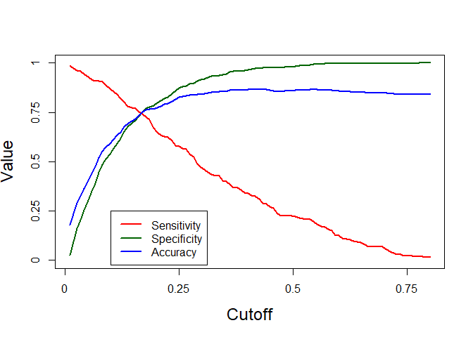

Identify the cutoff value where all 3 (Sensitivity, Specificity, Accuracy) merge at one point

``` r
(cutoff <- s[which(abs(OUT[,1] - OUT[,2]) < 0.02)])
```

    ## [1] 0.169596

Let's use the above cutoff probabality.

``` r
test_pred <- factor(ifelse(test$prob >= cutoff, "Yes", "No"))
test_actual <- factor(ifelse(test$Attrition == 1,"Yes","No"))
table(test_pred,test_actual)
```

    ##          test_actual
    ## test_pred  No Yes
    ##       No  837  55
    ##       Yes 273 158

``` r
test_conf <- confusionMatrix(test_pred, test_actual, positive = "Yes")
(acc <- test_conf$overall[1])
```

    ##  Accuracy 
    ## 0.7520786

``` r
(sens <- test_conf$byClass[1])
```

    ## Sensitivity 
    ##    0.741784

``` r
(spec <- test_conf$byClass[2])
```

    ## Specificity 
    ##   0.7540541

**Summary**

    * Accuracy    : 75%   
    * Sensitivity : 74%         
    * Specificity : 75%   

KS -statistic - Test Data
-------------------------

KS statistic is an indicator of how well the model discriminates between the two classes. It is equal to 0% for the random model, and 100% for the perfect model

``` r
test_pred_attrition <- ifelse(test_pred == "Yes",1,0)
test_actual_attrition <- ifelse(test_actual == "Yes",1,0)
pred_object_test <- prediction(test_pred_attrition, test_actual_attrition)
performance_measures_test <- performance(pred_object_test, "tpr", "fpr")
```

Lets plot the Area under curve

``` r
auc <- performance(pred_object_test,"auc")
unlist(auc@y.values)
```

    ## [1] 0.747919

``` r
plot(performance_measures_test,col = "red")
abline(0,1, lty = 8, col = "grey")
```

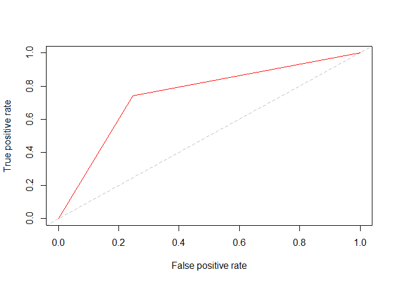

``` r
ks_table_test <- attr(performance_measures_test, "y.values")[[1]] - 
  (attr(performance_measures_test, "x.values")[[1]])

(max(ks_table_test))
```

    ## [1] 0.4958381

**Summary** KS Static - 50% (KS Static &gt; 40 % indicates a good model)

Lift & Gain Chart
-----------------

Gain chart is a popular method to visually inspect model performance in binary prediction. It presents the percentage of captured positive responses as a function of selected percentage of a sample.

Lift basically just tells you the factor by which your model is outperforming a random model, i.e. a model-less situation

``` r
lift <- function(labels , predicted_prob,groups=10) {
  if (is.factor(labels)) labels  <- as.integer(as.character(labels ))
  if (is.factor(predicted_prob)) predicted_prob <- 
      as.integer(as.character(predicted_prob))
  helper = data.frame(cbind(labels , predicted_prob))
  helper[,"bucket"] = ntile(-helper[,"predicted_prob"], groups)
  gaintable = helper %>% group_by(bucket)  %>%
    summarise_at(vars(labels ), funs(total = n(),
                                     totalresp = sum(., na.rm = TRUE))) %>%
    mutate(Cumresp = cumsum(totalresp),
           Gain = Cumresp/sum(totalresp)*100,
           Cumlift = Gain/(bucket*(100/groups))) 
  return(gaintable)
}

Attr_decile = lift(test_actual_attrition, test_pred_attrition, groups = 10)

ggplot(Attr_decile,aes(x = bucket, y = Gain)) + 
  geom_line() + 
  geom_point(col = 'red2', size = 5) +
  geom_text(aes(label = round(Gain,2)),  
            nudge_x = -0.40, nudge_y = -0.40)
```

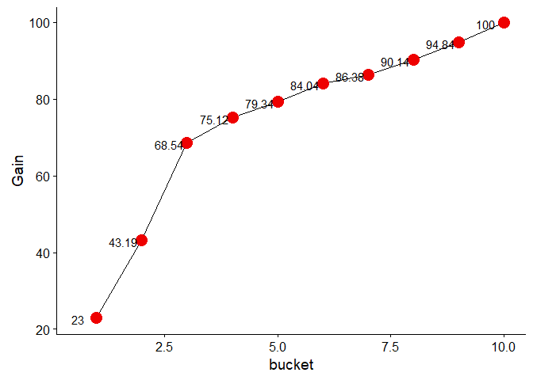

``` r
ggplot(Attr_decile,aes(x = bucket, y = Cumlift)) + 
  geom_line() + 
  geom_point(col = 'red2', size = 5) +
  geom_text(aes(label = round(Cumlift,2)), 
            nudge_x = 0.10, nudge_y = 0.10)
```

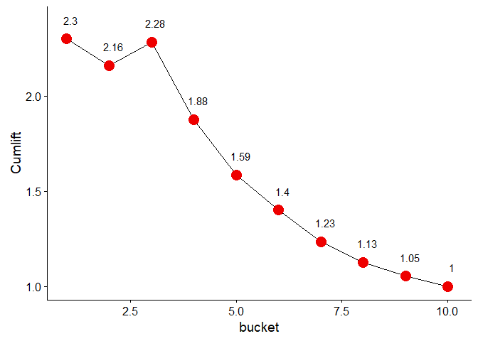

\*\* Summary\*\* Gain Given model is 75% by the 4th decile. Basically this means that if we sort all employess according to probability, then among the top 40% customers of this sorted list, we would find 75% of all employess that were likely to leave the company

Lift Lift is equal to 2.28 by the 3rd decile. This means that the model's gain by the end of the 3rd decile is 2.28 times that of a random model's gain at the end of 3 deciles. In other words, the model catches 2.28 times more attrition than a random model would have caught.

Final Summary
-------------

No. of model iterations = 29. The final model selected is m28

**Final Coefficients:**

``` r
summary(m28)
```

    ## 
    ## Call:
    ## glm(formula = Attrition ~ AvgHours + Age + BusinessTravel.Travel_Frequently + 
    ##     MaritalStatus.Single + NumCompaniesWorked + TotalWorkingYears + 
    ##     YearsSinceLastPromotion + YearsWithCurrManager + EnvironmentSatisfaction.2 + 
    ##     EnvironmentSatisfaction.3 + EnvironmentSatisfaction.4 + JobSatisfaction.4 + 
    ##     WorkLifeBalance.3, family = "binomial", data = train)
    ## 
    ## Deviance Residuals: 
    ##     Min       1Q   Median       3Q      Max  
    ## -1.7186  -0.5815  -0.3708  -0.1981   3.6389  
    ## 
    ## Coefficients:
    ##                                  Estimate Std. Error z value Pr(>|z|)    
    ## (Intercept)                      -1.31280    0.13547  -9.691  < 2e-16 ***
    ## AvgHours                          0.53372    0.05220  10.225  < 2e-16 ***
    ## Age                              -0.31297    0.07753  -4.037 5.42e-05 ***
    ## BusinessTravel.Travel_Frequently  0.76235    0.12709   5.998 1.99e-09 ***
    ## MaritalStatus.Single              1.00638    0.11164   9.014  < 2e-16 ***
    ## NumCompaniesWorked                0.34927    0.05581   6.258 3.89e-10 ***
    ## TotalWorkingYears                -0.44163    0.09951  -4.438 9.08e-06 ***
    ## YearsSinceLastPromotion           0.40524    0.07190   5.636 1.74e-08 ***
    ## YearsWithCurrManager             -0.45927    0.08437  -5.443 5.23e-08 ***
    ## EnvironmentSatisfaction.2        -0.94594    0.16711  -5.661 1.51e-08 ***
    ## EnvironmentSatisfaction.3        -0.92592    0.14779  -6.265 3.73e-10 ***
    ## EnvironmentSatisfaction.4        -1.20101    0.15403  -7.797 6.32e-15 ***
    ## JobSatisfaction.4                -0.79017    0.12983  -6.086 1.16e-09 ***
    ## WorkLifeBalance.3                -0.35003    0.11010  -3.179  0.00148 ** 
    ## ---
    ## Signif. codes:  0 '***' 0.001 '**' 0.01 '*' 0.05 '.' 0.1 ' ' 1
    ## 
    ## (Dispersion parameter for binomial family taken to be 1)
    ## 
    ##     Null deviance: 2728.0  on 3086  degrees of freedom
    ## Residual deviance: 2201.6  on 3073  degrees of freedom
    ## AIC: 2229.6
    ## 
    ## Number of Fisher Scoring iterations: 5

All the final variables selected for the model are Significant i.e P value almost = 0 and negligible and have VIF &lt; 3 indicating no major multicollinearity

Cutoff chosen = 0.1616162

      + Accuracy    : 75%   
      + Sensitivity : 74%         
      + Specificity : 75%   

AUC 0.75

KS Static - 50% (KS Static &gt; 40% indicates a good model)

Gain Given model is 75% by the 4th decile. Basically this means that if we sort all employess according to probability, then among the top 40% customers of this sorted list, we would find 75% of all employess that were likely to leave the company

Lift Lift is equal to 2.28 by the 3rd decile. This means that the model's gain by the end of the 3rd decile is 2.28 times that of a random model's gain at the end of 3 deciles. In other words, the model catches 2.28 times more attrition than a random model would have caught.

Conclusion: The company should focus on addressing the following factors to curb attrition

     1. Frequent BusinessTravel  
     2. Single (Marital Status)
     3. Low Environment Satisfaction
     4. Low Job Satisfaction
     5. Low Work Life balance 
     6. Higher average working hours
     7. Lesser Age 
     8. Less Total Working years
     9. Higher Years since last Promotion 
    10. Less Years with current Manager 
    11. Less Number of companies worked
