Support Vector Machines - MNIST Digit Recognition
=================================================

------------------------------------------------------------------------

Business understanding
----------------------

A classic problem in the field of pattern recognition is that of handwritten digit recognition. The goal here is to develop a model that can correctly identify the digit (between 0-9) written in an image which is submitted by a user via a scanner, a tablet, or other digital devices.

**Objective: ** To develop a model using Support Vector Machines which should correctly classify the handwritten digits based on the pixel values given as features.

**Installing & Loading required packages**

Check and Import required libraries

``` r
libs = c("tidyverse", "formattable", "caret", "kernlab",
         "gridExtra", "splitstackshape", "cowplot","e1071")
install.lib <- libs[!libs %in% installed.packages()]
for (pkg in install.lib)
  install.packages(pkg, dependencies = T)
loadlib     <- lapply(libs, library, character.only = T) # load them
remove(list = ls())
```

**Import Datasets**

*Loading files and adding column names*

``` r
train <- read_csv("mnist_train.csv", 
                  col_names = c("label", paste0("pix", 1:784)))
test  <- read_csv("mnist_test.csv", 
                  col_names = c("label", paste0("pix", 1:784)))
```

Data Understanding
------------------

``` r
dim(train) 
```

    ## [1] 60000   785

``` r
dim(test)
```

    ## [1] 10000   785

60,000 observations with 785 columns in train dataset. 10,000 observations with 785 columns.

\`label column is the target variable to be predicted

``` r
head(train[ ,1:10])
```

    ## # A tibble: 6 x 10
    ##   label  pix1  pix2  pix3  pix4  pix5  pix6  pix7  pix8  pix9
    ##   <int> <int> <int> <int> <int> <int> <int> <int> <int> <int>
    ## 1     5     0     0     0     0     0     0     0     0     0
    ## 2     0     0     0     0     0     0     0     0     0     0
    ## 3     4     0     0     0     0     0     0     0     0     0
    ## 4     1     0     0     0     0     0     0     0     0     0
    ## 5     9     0     0     0     0     0     0     0     0     0
    ## 6     2     0     0     0     0     0     0     0     0     0

``` r
head(test[ ,1:10])
```

    ## # A tibble: 6 x 10
    ##   label  pix1  pix2  pix3  pix4  pix5  pix6  pix7  pix8  pix9
    ##   <int> <int> <int> <int> <int> <int> <int> <int> <int> <int>
    ## 1     7     0     0     0     0     0     0     0     0     0
    ## 2     2     0     0     0     0     0     0     0     0     0
    ## 3     1     0     0     0     0     0     0     0     0     0
    ## 4     0     0     0     0     0     0     0     0     0     0
    ## 5     4     0     0     0     0     0     0     0     0     0
    ## 6     1     0     0     0     0     0     0     0     0     0

``` r
tail(train[,1:10])
```

    ## # A tibble: 6 x 10
    ##   label  pix1  pix2  pix3  pix4  pix5  pix6  pix7  pix8  pix9
    ##   <int> <int> <int> <int> <int> <int> <int> <int> <int> <int>
    ## 1     1     0     0     0     0     0     0     0     0     0
    ## 2     8     0     0     0     0     0     0     0     0     0
    ## 3     3     0     0     0     0     0     0     0     0     0
    ## 4     5     0     0     0     0     0     0     0     0     0
    ## 5     6     0     0     0     0     0     0     0     0     0
    ## 6     8     0     0     0     0     0     0     0     0     0

``` r
tail(test[,1:10])
```

    ## # A tibble: 6 x 10
    ##   label  pix1  pix2  pix3  pix4  pix5  pix6  pix7  pix8  pix9
    ##   <int> <int> <int> <int> <int> <int> <int> <int> <int> <int>
    ## 1     1     0     0     0     0     0     0     0     0     0
    ## 2     2     0     0     0     0     0     0     0     0     0
    ## 3     3     0     0     0     0     0     0     0     0     0
    ## 4     4     0     0     0     0     0     0     0     0     0
    ## 5     5     0     0     0     0     0     0     0     0     0
    ## 6     6     0     0     0     0     0     0     0     0     0

Checking for NA values

``` r
anyNA(train)
```

    ## [1] FALSE

``` r
anyNA(test)
```

    ## [1] FALSE

Checking for Duplicate values

``` r
sum(duplicated(rbind(train, test)))
```

    ## [1] 0

0 - Implies no duplicates

Lets visualize each digits taking some random sample observations

``` r
for (i in seq(0, 9)) {
  sample <- train[train$label == i, ]
  # Omit label column 
  sample <-  sample[ ,-1]
  # Resetting the margins
  par(mar = c(1,1,1,1))  
  # Build 10 rows by 5 column Plot matrix  for each digit 
  par(mfrow = c(5,10)) 
  # 50 samples between 10 & 5000 
  for (j in seq(10, 5000, by = 100)) {
    # Build a 28 X 28 matrix of pixel values in each row
    digit <- t(matrix(as.numeric(sample[j, ]), nrow = 28)) 
    # Inverse the pixel matrix to get the image of the number right
    image(t(apply(digit, 2, rev)), col = grey.colors(255))
  }
}
```

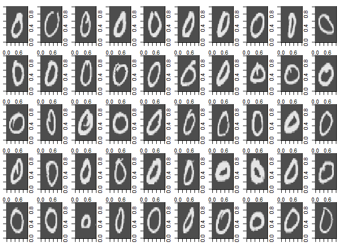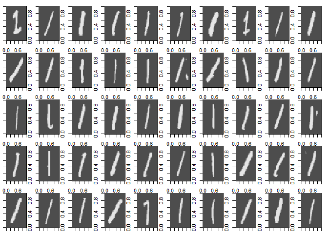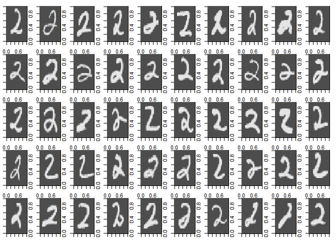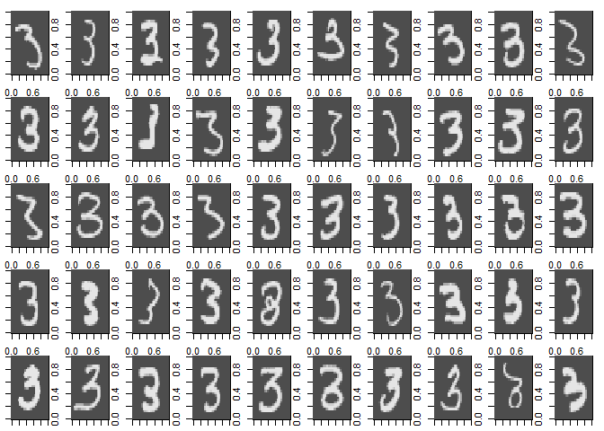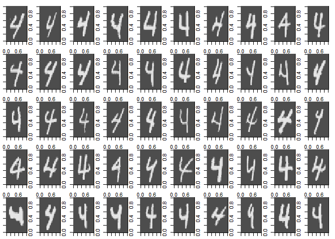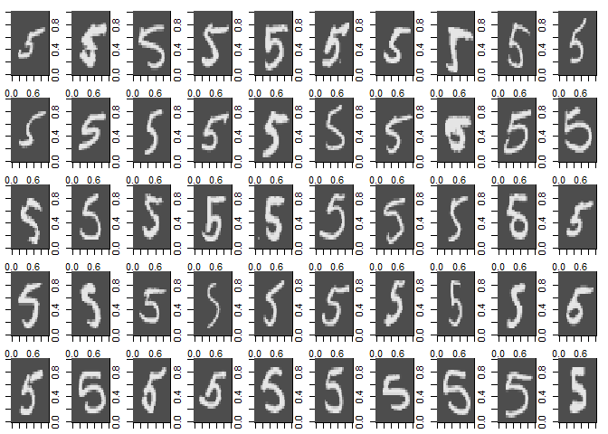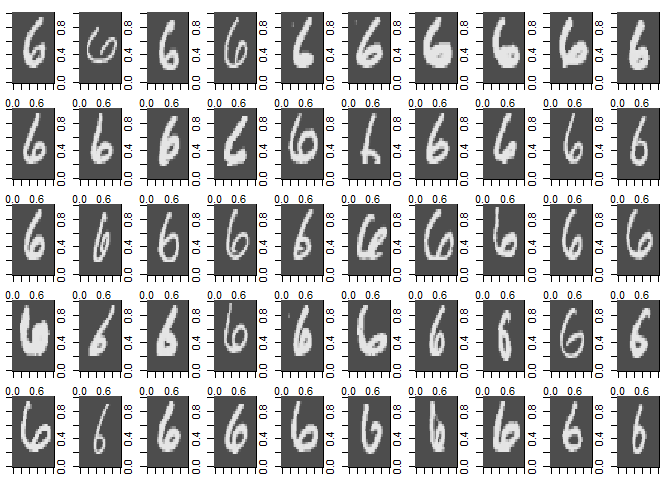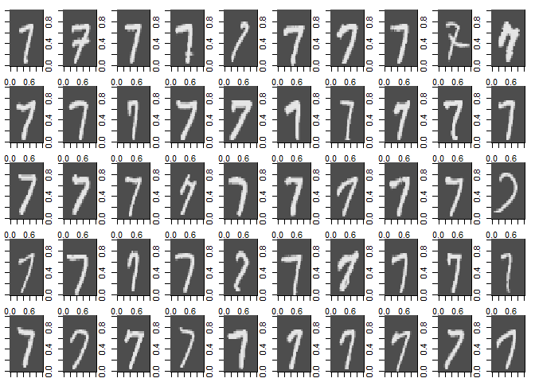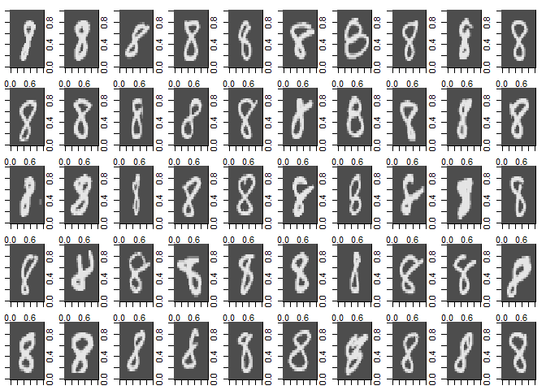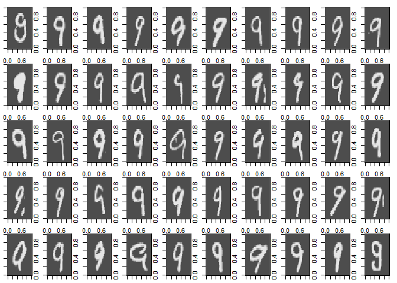

``` r
# Deleting temporary varaibles 'digit', sample' , i , j 
remove(digit, sample, i ,j)
```

Derive New variables
--------------------

Lets derive the average intensity of each number

``` r
train$AvgIntensity <-  rowMeans(train[,-1])
test$AvgIntensity <-  rowMeans(test[,-1])
```

Convert the target variables to factors

``` r
train$label <- factor(train$label)
test$label <- factor(test$label)
```

EDA
---

Setting theme for plots

``` r
theme_set(theme_classic() + 
          theme(plot.title = element_text(hjust = 0.5, size = 10,face = 'bold'),
                axis.title.x = element_text(size = 8),
                axis.title.y = element_text(size = 8),
                axis.text.x  = element_text(size = 6),
                axis.text.y  = element_text(size = 6),
                legend.position = 'none'))
plot_grid(
  train %>% 
    group_by(label) %>% 
    summarize(AvgInt = mean(AvgIntensity)) %>% 
    ggplot(aes(x = factor(label), y = AvgInt, fill = factor(label))) + 
    geom_col() + 
    labs(x = "Numbers", title = "Number vs Avg. Intensity in Train Dataset"), 
  test %>% 
    group_by(label) %>% 
    summarize(AvgInt = mean(AvgIntensity)) %>% 
    ggplot(aes(x = factor(label), y = AvgInt, fill = factor(label))) + 
    geom_col() + 
    labs(x = "Numbers", title = "Number vs Avg. Intensity in Test Dataset"), 
    nrow = 2)
```

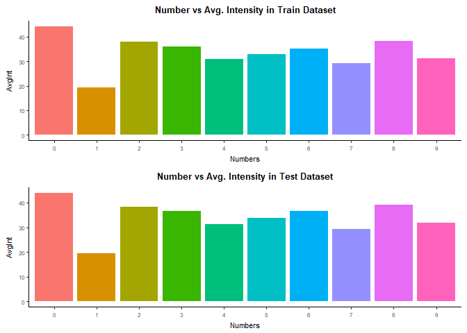

As we can see there are some differences in intensity. The digit 1 is the less intense while the digit 0 is the most intense. The AvgIntensity can be used as one of the predictor variable. Also both test and train datasets are stratified samples from the orginal population.

``` r
plot_grid(
  train %>% 
    ggplot(aes(x = factor(label), y = AvgIntensity, fill = factor(label))) + 
    geom_violin() + 
    labs(x = "Numbers", title = "Avg. Intensity Distribution in Train Dataset"), 
  test %>% 
    ggplot(aes(x = factor(label), y = AvgIntensity, fill = factor(label))) + 
    geom_violin() + 
    labs(x = "Numbers", title = "Avg. Intensity Distribution in Test Dataset"), 
    nrow = 2)
```

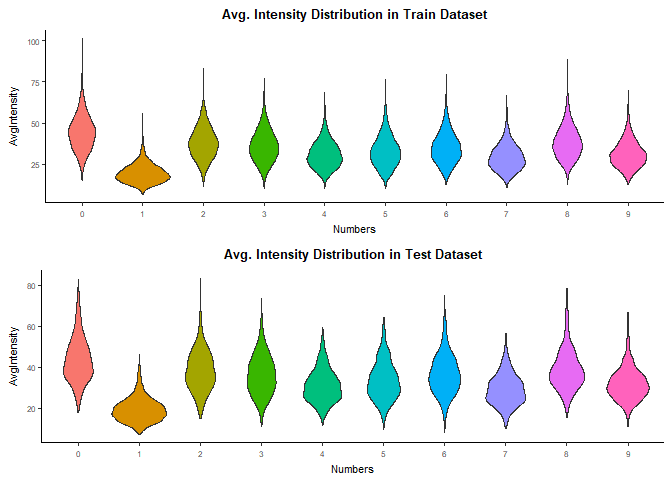

Most intensity distributions seem roughly normally distributed but some have higher variance than others. The digit 1 seems to be the one people write most consistently followed by 9, 7 & 4. Also both test and train datasets maintain the same distributions

Data Preparation
----------------

Prepare Datasets for Model building

Since the dataset is huge lets do a stratified sampling that can be used for our modeling.

Lets check the proportion of the target variables in the dataset

``` r
percent(prop.table(table(train$label)))
```

    ## 
    ##     0     1     2     3     4     5     6     7     8     9 
    ##  9.9% 11.2%  9.9% 10.2%  9.7%  9.0%  9.9% 10.4%  9.8%  9.9%

``` r
percent(prop.table(table(test$label)))
```

    ## 
    ##     0     1     2     3     4     5     6     7     8     9 
    ##  9.8% 11.3% 10.3% 10.1%  9.8%  8.9%  9.6% 10.3%  9.7% 10.1%

The proportion comes on an average of 10 % Lets do Statified Sampling such that this proportion is maintained in the sampled dataset

``` r
set.seed(100)
sample_train <-  stratified(train, "label", size = 500)
```

Lets again check the proportion of the target variables in the Datasets

``` r
percent(prop.table(table(sample_train$label)))
```

    ## 
    ##   0   1   2   3   4   5   6   7   8   9 
    ## 10% 10% 10% 10% 10% 10% 10% 10% 10% 10%

The proportion comes to 10 % across all the labels in train dataset matching closely with the proportion of the original dataset.

Convert Sample\_train to tibble just like other datasets.

``` r
sample_train <- as.tibble(sample_train)
```

All the below models were run with and without AvgIntensity column and there is no difference in the metrics or final predicted Accuracy. Hence removing AvgIntensity column from the datasets

``` r
sample_train <- sample_train %>% select(-c(AvgIntensity))
train <-  train %>% select(-c(AvgIntensity))
test  <-  test %>% select(-c(AvgIntensity))
```

Model Building
--------------

For all model trainings we will use sample\_train dataset.
For all predictions and evaluations we will use complete train & test datasets

**Linear Kernel**

``` r
(linear_model <- ksvm(label~., data = sample_train, 
                      scaled = F, kernel = "vanilladot"))
```

    ##  Setting default kernel parameters

    ## Support Vector Machine object of class "ksvm" 
    ## 
    ## SV type: C-svc  (classification) 
    ##  parameter : cost C = 1 
    ## 
    ## Linear (vanilla) kernel function. 
    ## 
    ## Number of Support Vectors : 1682 
    ## 
    ## Objective Function Value : 0 0 0 0 0 0 0 0 0 0 0 0 0 0 0 -1e-04 0 -1e-04 -1e-04 -1e-04 0 -1e-04 -1e-04 0 0 -2e-04 0 0 -2e-04 -1e-04 -1e-04 0 0 0 -2e-04 -1e-04 0 -2e-04 -1e-04 0 0 0 0 -3e-04 -1e-04 
    ## Training error : 0

*Linear Model Metrics*

parameter : cost C = 1

**RBF Kernel**

``` r
(RBF_model <- ksvm(label~ ., data = sample_train, 
                  scaled = F, kernel = "rbfdot"))
```

    ## Support Vector Machine object of class "ksvm" 
    ## 
    ## SV type: C-svc  (classification) 
    ##  parameter : cost C = 1 
    ## 
    ## Gaussian Radial Basis kernel function. 
    ##  Hyperparameter : sigma =  1.61909310004045e-07 
    ## 
    ## Number of Support Vectors : 2408 
    ## 
    ## Objective Function Value : -16.0859 -59.5926 -49.6805 -38.5122 -72.5935 -59.6187 -38.5946 -47.6575 -44.7161 -51.2121 -45.6889 -35.782 -45.3108 -30.832 -43.399 -64.0262 -39.5172 -104.1176 -78.8352 -79.6513 -75.375 -76.9294 -96.8941 -68.1644 -58.2571 -146.6779 -53.1069 -67.9858 -127.7671 -94.094 -78.3798 -65.5368 -78.9623 -62.452 -158.1738 -87.7061 -65.2583 -131.927 -93.3711 -30.9624 -55.9243 -36.6006 -56.8807 -148.9286 -92.1269 
    ## Training error : 0.02

*RBF Model Metrics*

parameter : cost C = 1
Hyperparameter : sigma = 1.62e-07

Model Evaluation
----------------

**Linear Model Evaluation**

Evaluation on complete train dataset

``` r
linear_eval_train  <- predict(linear_model, train)
```

Confusion matrix for Linear Kernel on original complete train dataset

``` r
confusionMatrix(linear_eval_train, train$label)
```

    ## Confusion Matrix and Statistics
    ## 
    ##           Reference
    ## Prediction    0    1    2    3    4    5    6    7    8    9
    ##          0 5774    2   63   26   17   70   56    8   72   49
    ##          1    0 6598   82   51   18   37    9   43  117   15
    ##          2   17   35 5442  143   29   49   93   86   85   37
    ##          3   14   13   92 5533    9  274    4   36  291   90
    ##          4   11   10   69    9 5490   60   76   81   54  331
    ##          5   44   21   29  163   11 4743  134   24  225   31
    ##          6   42    6   65   17   25   67 5532    3   60    0
    ##          7    5   13   46   51   17    5    2 5759   24  218
    ##          8   15   37   60  105   10   85   12   15 4843   21
    ##          9    1    7   10   33  216   31    0  210   80 5157
    ## 
    ## Overall Statistics
    ##                                           
    ##                Accuracy : 0.9145          
    ##                  95% CI : (0.9123, 0.9167)
    ##     No Information Rate : 0.1124          
    ##     P-Value [Acc > NIR] : < 2.2e-16       
    ##                                           
    ##                   Kappa : 0.905           
    ##  Mcnemar's Test P-Value : NA              
    ## 
    ## Statistics by Class:
    ## 
    ##                      Class: 0 Class: 1 Class: 2 Class: 3 Class: 4 Class: 5
    ## Sensitivity           0.97484   0.9786   0.9134  0.90246  0.93975  0.87493
    ## Specificity           0.99329   0.9930   0.9894  0.98472  0.98706  0.98750
    ## Pos Pred Value        0.94085   0.9466   0.9046  0.87052  0.88677  0.87429
    ## Neg Pred Value        0.99723   0.9973   0.9904  0.98885  0.99346  0.98758
    ## Prevalence            0.09872   0.1124   0.0993  0.10218  0.09737  0.09035
    ## Detection Rate        0.09623   0.1100   0.0907  0.09222  0.09150  0.07905
    ## Detection Prevalence  0.10228   0.1162   0.1003  0.10593  0.10318  0.09042
    ## Balanced Accuracy     0.98407   0.9858   0.9514  0.94359  0.96340  0.93122
    ##                      Class: 6 Class: 7 Class: 8 Class: 9
    ## Sensitivity           0.93478  0.91923  0.82772  0.86687
    ## Specificity           0.99473  0.99291  0.99335  0.98912
    ## Pos Pred Value        0.95101  0.93795  0.93081  0.89765
    ## Neg Pred Value        0.99288  0.99061  0.98160  0.98540
    ## Prevalence            0.09863  0.10442  0.09752  0.09915
    ## Detection Rate        0.09220  0.09598  0.08072  0.08595
    ## Detection Prevalence  0.09695  0.10233  0.08672  0.09575
    ## Balanced Accuracy     0.96475  0.95607  0.91054  0.92799

*Accuracy : 0.91*

Evaluation on complete test dataset

``` r
linear_eval_test  <- predict(linear_model, test)
```

Confusion matrix for Linear Kernel on complete test dataset

``` r
confusionMatrix(linear_eval_test, test$label)
```

    ## Confusion Matrix and Statistics
    ## 
    ##           Reference
    ## Prediction    0    1    2    3    4    5    6    7    8    9
    ##          0  960    0   15    5    1   10   13    0   13    9
    ##          1    0 1111   12    4    2    4    2   16    7    8
    ##          2    2    3  939   23    6   10   12   23   15    4
    ##          3    1    0   11  922    4   50    2   11   59   12
    ##          4    0    1    9    1  922   11   12   11   13   59
    ##          5    4    2    5   19    3  775   20    2   32    5
    ##          6   11    5   14    2    6    9  893    0   10    0
    ##          7    1    0   11   10    4    2    2  930   11   28
    ##          8    1   13   16   23    0   17    2    4  804    5
    ##          9    0    0    0    1   34    4    0   31   10  879
    ## 
    ## Overall Statistics
    ##                                           
    ##                Accuracy : 0.9135          
    ##                  95% CI : (0.9078, 0.9189)
    ##     No Information Rate : 0.1135          
    ##     P-Value [Acc > NIR] : < 2.2e-16       
    ##                                           
    ##                   Kappa : 0.9038          
    ##  Mcnemar's Test P-Value : NA              
    ## 
    ## Statistics by Class:
    ## 
    ##                      Class: 0 Class: 1 Class: 2 Class: 3 Class: 4 Class: 5
    ## Sensitivity            0.9796   0.9789   0.9099   0.9129   0.9389   0.8688
    ## Specificity            0.9927   0.9938   0.9891   0.9833   0.9870   0.9899
    ## Pos Pred Value         0.9357   0.9528   0.9055   0.8601   0.8874   0.8939
    ## Neg Pred Value         0.9978   0.9973   0.9896   0.9901   0.9933   0.9872
    ## Prevalence             0.0980   0.1135   0.1032   0.1010   0.0982   0.0892
    ## Detection Rate         0.0960   0.1111   0.0939   0.0922   0.0922   0.0775
    ## Detection Prevalence   0.1026   0.1166   0.1037   0.1072   0.1039   0.0867
    ## Balanced Accuracy      0.9861   0.9863   0.9495   0.9481   0.9630   0.9294
    ##                      Class: 6 Class: 7 Class: 8 Class: 9
    ## Sensitivity            0.9322   0.9047   0.8255   0.8712
    ## Specificity            0.9937   0.9923   0.9910   0.9911
    ## Pos Pred Value         0.9400   0.9309   0.9085   0.9166
    ## Neg Pred Value         0.9928   0.9891   0.9813   0.9856
    ## Prevalence             0.0958   0.1028   0.0974   0.1009
    ## Detection Rate         0.0893   0.0930   0.0804   0.0879
    ## Detection Prevalence   0.0950   0.0999   0.0885   0.0959
    ## Balanced Accuracy      0.9629   0.9485   0.9082   0.9311

*Accuracy : 0.90*

The Accuracy is consistent between the whole train and test datasets

**RBF Model Evaluation**

Evaluation on complete train dataset

``` r
RBF_eval_train <- predict(RBF_model, train)
```

Confusion matrix for RBF Kernel on original complete train dataset

``` r
confusionMatrix(RBF_eval_train, train$label)
```

    ## Confusion Matrix and Statistics
    ## 
    ##           Reference
    ## Prediction    0    1    2    3    4    5    6    7    8    9
    ##          0 5813    1   36   14    5   23   25   11   26   37
    ##          1    0 6617   43   23   15   14   21   41   58   13
    ##          2   10   32 5600  103   18   16   33   51   53   17
    ##          3    4   18   31 5690    0   85    2   13   86   78
    ##          4    8   11   51    4 5627   24   35   78   37  164
    ##          5   27   18   25  126    3 5150   84    9  130   27
    ##          6   27    4   42   17   21   77 5704    1   42    1
    ##          7    3    7   52   46    5    2    0 5906   14  111
    ##          8   27   24   70   77    7   20   14   14 5349   33
    ##          9    4   10    8   31  141   10    0  141   56 5468
    ## 
    ## Overall Statistics
    ##                                           
    ##                Accuracy : 0.9487          
    ##                  95% CI : (0.9469, 0.9505)
    ##     No Information Rate : 0.1124          
    ##     P-Value [Acc > NIR] : < 2.2e-16       
    ##                                           
    ##                   Kappa : 0.943           
    ##  Mcnemar's Test P-Value : < 2.2e-16       
    ## 
    ## Statistics by Class:
    ## 
    ##                      Class: 0 Class: 1 Class: 2 Class: 3 Class: 4 Class: 5
    ## Sensitivity           0.98143   0.9815  0.93991  0.92807  0.96320  0.95001
    ## Specificity           0.99671   0.9957  0.99384  0.99412  0.99239  0.99177
    ## Pos Pred Value        0.97029   0.9667  0.94387  0.94723  0.93178  0.91981
    ## Neg Pred Value        0.99796   0.9976  0.99338  0.99183  0.99602  0.99502
    ## Prevalence            0.09872   0.1124  0.09930  0.10218  0.09737  0.09035
    ## Detection Rate        0.09688   0.1103  0.09333  0.09483  0.09378  0.08583
    ## Detection Prevalence  0.09985   0.1141  0.09888  0.10012  0.10065  0.09332
    ## Balanced Accuracy     0.98907   0.9886  0.96688  0.96109  0.97780  0.97089
    ##                      Class: 6 Class: 7 Class: 8 Class: 9
    ## Sensitivity           0.96384  0.94270  0.91420  0.91915
    ## Specificity           0.99571  0.99553  0.99472  0.99258
    ## Pos Pred Value        0.96092  0.96095  0.94925  0.93167
    ## Neg Pred Value        0.99604  0.99333  0.99077  0.99111
    ## Prevalence            0.09863  0.10442  0.09752  0.09915
    ## Detection Rate        0.09507  0.09843  0.08915  0.09113
    ## Detection Prevalence  0.09893  0.10243  0.09392  0.09782
    ## Balanced Accuracy     0.97977  0.96912  0.95446  0.95586

*Accuracy : 0.9487*

Evaluation on complete train dataset

``` r
RBF_eval_test <- predict(RBF_model, test)
```

Confusion matrix for RBF Kernel on complete test dataset

``` r
confusionMatrix(RBF_eval_test , test$label)
```

    ## Confusion Matrix and Statistics
    ## 
    ##           Reference
    ## Prediction    0    1    2    3    4    5    6    7    8    9
    ##          0  966    0   11    1    1    6    8    0    5    7
    ##          1    0 1120    1    0    3    1    3   17    2    6
    ##          2    1    2  972   16    4    1    2   22    8    2
    ##          3    0    3    6  957    0   18    0    3   14   11
    ##          4    0    1    9    0  944    2   12    8    8   32
    ##          5    4    1    0   11    0  842   11    1   22    5
    ##          6    7    4   10    0    7   14  920    0   10    1
    ##          7    1    1    9    7    2    2    0  948    4   10
    ##          8    1    3   14   15    2    4    2    3  892    7
    ##          9    0    0    0    3   19    2    0   26    9  928
    ## 
    ## Overall Statistics
    ##                                           
    ##                Accuracy : 0.9489          
    ##                  95% CI : (0.9444, 0.9531)
    ##     No Information Rate : 0.1135          
    ##     P-Value [Acc > NIR] : < 2.2e-16       
    ##                                           
    ##                   Kappa : 0.9432          
    ##  Mcnemar's Test P-Value : NA              
    ## 
    ## Statistics by Class:
    ## 
    ##                      Class: 0 Class: 1 Class: 2 Class: 3 Class: 4 Class: 5
    ## Sensitivity            0.9857   0.9868   0.9419   0.9475   0.9613   0.9439
    ## Specificity            0.9957   0.9963   0.9935   0.9939   0.9920   0.9940
    ## Pos Pred Value         0.9612   0.9714   0.9437   0.9457   0.9291   0.9387
    ## Neg Pred Value         0.9984   0.9983   0.9933   0.9941   0.9958   0.9945
    ## Prevalence             0.0980   0.1135   0.1032   0.1010   0.0982   0.0892
    ## Detection Rate         0.0966   0.1120   0.0972   0.0957   0.0944   0.0842
    ## Detection Prevalence   0.1005   0.1153   0.1030   0.1012   0.1016   0.0897
    ## Balanced Accuracy      0.9907   0.9915   0.9677   0.9707   0.9767   0.9690
    ##                      Class: 6 Class: 7 Class: 8 Class: 9
    ## Sensitivity            0.9603   0.9222   0.9158   0.9197
    ## Specificity            0.9941   0.9960   0.9943   0.9934
    ## Pos Pred Value         0.9455   0.9634   0.9459   0.9402
    ## Neg Pred Value         0.9958   0.9911   0.9909   0.9910
    ## Prevalence             0.0958   0.1028   0.0974   0.1009
    ## Detection Rate         0.0920   0.0948   0.0892   0.0928
    ## Detection Prevalence   0.0973   0.0984   0.0943   0.0987
    ## Balanced Accuracy      0.9772   0.9591   0.9551   0.9566

*Accuracy : 0.94*

The Accuracy is consistent between the whole train and test datasets

Hyperparameter tuning and Cross Validation
------------------------------------------

The train function from caret package enables us to perform Cross Validation.

traincontrol function controls the computational nuances of the train function. + method = CV implies Cross Validation. + Number = 5 implies Number of folds in Cross Validation.

``` r
trainControl <- trainControl(method = "cv", number = 5)
```

Metric &lt;- "Accuracy" implies our Evaluation metric is Accuracy.

``` r
metric <- "Accuracy"

set.seed(20)
```

From the previous RBF Kernel model : We know that C was selected as 1 . Lets increase C value and give in the range of 1 to 4 And we know that sigma was selected as 1.62e-7. Lets give the sigma values as 0.62e-7, 1.62e-7., 2.62e-7 (i.e -1+sigma, sigma and 1+sigma)

``` r
grid <- expand.grid(.sigma = c(0.62e-7, 1.62e-7, 2.62e-7, 3.62e-7),
                    .C = c(1, 2, 3))
```

Lets run train function with Method as "svmRadial" (RBF model), Metric as Accuracy, tuneGrid with the Grid of Parameters already set and trcontrol as traincontrol method.

There are warnings regarding Scaling of Data. These are due to columns where we have no variance for the entire column which cannot be scaled. Hence we can ignore these. Lets suppress these warnings

``` r
options(warn = -1)
(svm_cv <- train(label~., data = sample_train, 
                 method = "svmRadial", metric = metric, 
                 tuneGrid = grid, trControl = trainControl))
```

    ## Support Vector Machines with Radial Basis Function Kernel 
    ## 
    ## 5000 samples
    ##  784 predictor
    ##   10 classes: '0', '1', '2', '3', '4', '5', '6', '7', '8', '9' 
    ## 
    ## No pre-processing
    ## Resampling: Cross-Validated (5 fold) 
    ## Summary of sample sizes: 4000, 4000, 4000, 4000, 4000 
    ## Resampling results across tuning parameters:
    ## 
    ##   sigma     C  Accuracy  Kappa    
    ##   6.20e-08  1  0.9258    0.9175556
    ##   6.20e-08  2  0.9338    0.9264444
    ##   6.20e-08  3  0.9370    0.9300000
    ##   1.62e-07  1  0.9444    0.9382222
    ##   1.62e-07  2  0.9524    0.9471111
    ##   1.62e-07  3  0.9528    0.9475556
    ##   2.62e-07  1  0.9538    0.9486667
    ##   2.62e-07  2  0.9584    0.9537778
    ##   2.62e-07  3  0.9590    0.9544444
    ##   3.62e-07  1  0.9582    0.9535556
    ##   3.62e-07  2  0.9614    0.9571111
    ##   3.62e-07  3  0.9616    0.9573333
    ## 
    ## Accuracy was used to select the optimal model using the largest value.
    ## The final values used for the model were sigma = 3.62e-07 and C = 3.

``` r
options(warn = 0)
plot(svm_cv)
```

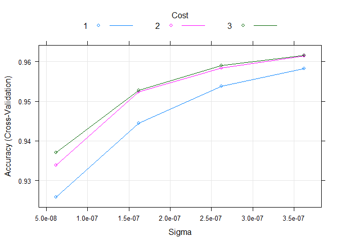

Final model building
--------------------

Lets build our final model with C = 3 and sigma = 3.62e-7

``` r
RBF_final_model  <- ksvm(label~ ., data = sample_train, 
                         scaled = F, C = 3, kpar = list(sigma = 3.62e-7),
                         kernel = "rbfdot")
```

Final model evaluation
----------------------

Evaluate the complete train set

``` r
RBF_final_eval_train   <- predict(RBF_final_model, train)
(conf_train <- confusionMatrix(RBF_final_eval_train, train$label))
```

    ## Confusion Matrix and Statistics
    ## 
    ##           Reference
    ## Prediction    0    1    2    3    4    5    6    7    8    9
    ##          0 5843    1   23    9    4   18   14    9   17   29
    ##          1    0 6632   31   13   10    4    9   33   34    9
    ##          2   10   27 5729   82   12   13   27   50   45   17
    ##          3    3   18   27 5821    0   80    1    8   79   46
    ##          4    5   13   29    6 5694   14   31   51   33  120
    ##          5   14   14    7   74    3 5228   82    8   84   20
    ##          6   23    6   24    3   17   45 5746    0   32    1
    ##          7    1    5   43   37    8    1    0 6001   12   78
    ##          8   20   14   38   63    5    8    8   10 5464   19
    ##          9    4   12    7   23   89   10    0   95   51 5610
    ## 
    ## Overall Statistics
    ##                                           
    ##                Accuracy : 0.9628          
    ##                  95% CI : (0.9613, 0.9643)
    ##     No Information Rate : 0.1124          
    ##     P-Value [Acc > NIR] : < 2.2e-16       
    ##                                           
    ##                   Kappa : 0.9587          
    ##  Mcnemar's Test P-Value : NA              
    ## 
    ## Statistics by Class:
    ## 
    ##                      Class: 0 Class: 1 Class: 2 Class: 3 Class: 4 Class: 5
    ## Sensitivity           0.98649   0.9837  0.96156  0.94944  0.97467  0.96440
    ## Specificity           0.99771   0.9973  0.99476  0.99514  0.99442  0.99439
    ## Pos Pred Value        0.97922   0.9789  0.95293  0.95693  0.94963  0.94471
    ## Neg Pred Value        0.99852   0.9979  0.99576  0.99425  0.99726  0.99646
    ## Prevalence            0.09872   0.1124  0.09930  0.10218  0.09737  0.09035
    ## Detection Rate        0.09738   0.1105  0.09548  0.09702  0.09490  0.08713
    ## Detection Prevalence  0.09945   0.1129  0.10020  0.10138  0.09993  0.09223
    ## Balanced Accuracy     0.99210   0.9905  0.97816  0.97229  0.98454  0.97940
    ##                      Class: 6 Class: 7 Class: 8 Class: 9
    ## Sensitivity           0.97094   0.9579  0.93386  0.94302
    ## Specificity           0.99721   0.9966  0.99658  0.99462
    ## Pos Pred Value        0.97439   0.9701  0.96725  0.95069
    ## Neg Pred Value        0.99682   0.9951  0.99288  0.99373
    ## Prevalence            0.09863   0.1044  0.09752  0.09915
    ## Detection Rate        0.09577   0.1000  0.09107  0.09350
    ## Detection Prevalence  0.09828   0.1031  0.09415  0.09835
    ## Balanced Accuracy     0.98407   0.9772  0.96522  0.96882

Accuracy : 0.96

As we saw in EDA, Number label '1' is the most easily distinguishable class because the average intensity is the least compared to other classes. Number label '0' is also easily distinguishable class since the average intensity is very high compared to other classes. Hence both these classes have higher balanced accuracy, sensitivity, specificity, Pos pred Value and Neg Pred Value compared to all other classes.

Lets look at the misclassifications: Most misclassifications in descending order below:

      + 9 misclassified as 4
      + 7 misclassified as 9 
      + 4 misclassified as 9 

Lets look at other metrics :

``` r
colMeans(conf_train$byClass)
```

    ##          Sensitivity          Specificity       Pos Pred Value 
    ##            0.9625914            0.9958704            0.9624732 
    ##       Neg Pred Value            Precision               Recall 
    ##            0.9958706            0.9624732            0.9625914 
    ##                   F1           Prevalence       Detection Rate 
    ##            0.9624654            0.1000000            0.0962800 
    ## Detection Prevalence    Balanced Accuracy 
    ##            0.1000000            0.9792309

Evaluate the complete test set

``` r
RBF_final_eval_test   <- predict(RBF_final_model, test)
(conf_test <-  confusionMatrix(RBF_final_eval_test, test$label))
```

    ## Confusion Matrix and Statistics
    ## 
    ##           Reference
    ## Prediction    0    1    2    3    4    5    6    7    8    9
    ##          0  967    0    8    1    1    3    7    0    4    8
    ##          1    0 1120    1    0    1    0    2   11    0    6
    ##          2    1    3  989    7    3    0    1   17    8    2
    ##          3    1    3    5  974    0   19    0    4   14   10
    ##          4    0    0    5    0  953    1    8    4   10   23
    ##          5    5    1    0    8    0  854   10    0    9    3
    ##          6    4    5    4    0    5    8  927    0    6    0
    ##          7    1    1   10    6    1    1    0  972    4    7
    ##          8    1    2   10   11    1    5    3    4  915    5
    ##          9    0    0    0    3   17    1    0   16    4  945
    ## 
    ## Overall Statistics
    ##                                           
    ##                Accuracy : 0.9616          
    ##                  95% CI : (0.9576, 0.9653)
    ##     No Information Rate : 0.1135          
    ##     P-Value [Acc > NIR] : < 2.2e-16       
    ##                                           
    ##                   Kappa : 0.9573          
    ##  Mcnemar's Test P-Value : NA              
    ## 
    ## Statistics by Class:
    ## 
    ##                      Class: 0 Class: 1 Class: 2 Class: 3 Class: 4 Class: 5
    ## Sensitivity            0.9867   0.9868   0.9583   0.9644   0.9705   0.9574
    ## Specificity            0.9965   0.9976   0.9953   0.9938   0.9943   0.9960
    ## Pos Pred Value         0.9680   0.9816   0.9593   0.9456   0.9492   0.9596
    ## Neg Pred Value         0.9986   0.9983   0.9952   0.9960   0.9968   0.9958
    ## Prevalence             0.0980   0.1135   0.1032   0.1010   0.0982   0.0892
    ## Detection Rate         0.0967   0.1120   0.0989   0.0974   0.0953   0.0854
    ## Detection Prevalence   0.0999   0.1141   0.1031   0.1030   0.1004   0.0890
    ## Balanced Accuracy      0.9916   0.9922   0.9768   0.9791   0.9824   0.9767
    ##                      Class: 6 Class: 7 Class: 8 Class: 9
    ## Sensitivity            0.9676   0.9455   0.9394   0.9366
    ## Specificity            0.9965   0.9965   0.9953   0.9954
    ## Pos Pred Value         0.9666   0.9691   0.9561   0.9584
    ## Neg Pred Value         0.9966   0.9938   0.9935   0.9929
    ## Prevalence             0.0958   0.1028   0.0974   0.1009
    ## Detection Rate         0.0927   0.0972   0.0915   0.0945
    ## Detection Prevalence   0.0959   0.1003   0.0957   0.0986
    ## Balanced Accuracy      0.9821   0.9710   0.9674   0.9660

Accuracy : 0.96

Most misclassifications in descending order below:

      + 9 misclassified as 4 
      + 5 misclassified as 3
      + 4 misclassified as 9 , 7 misclassified as 2 
      + 7 misclassified as 9

``` r
colMeans(conf_test$byClass)
```

    ##          Sensitivity          Specificity       Pos Pred Value 
    ##            0.9613238            0.9957356            0.9613466 
    ##       Neg Pred Value            Precision               Recall 
    ##            0.9957382            0.9613466            0.9613238 
    ##                   F1           Prevalence       Detection Rate 
    ##            0.9612700            0.1000000            0.0961600 
    ## Detection Prevalence    Balanced Accuracy 
    ##            0.1000000            0.9785297

Final Summary
-------------

Final model is a Non linear model : **RBF model (RBF\_final\_model)** after performing Cross validation

**Finalized Hyperparameters :**

    + C     = 3
    + Sigma = 3.62e-07 

**Evaluation metrics on complete Train dataset with 60000 observations**

Overall Accuracy : 96%

Average values across all classes

    + Sensitivity          Specificity             
    + 0.96                 0.99 
    + Neg Pred Value       Pos Pred Value     
    + 0.99                 0.96 
    + Recall               F1                Precision  
    + 0.96                 0.96              0.96 

**Evaluation metrics on Test dataset with 10000 observations**

Overall Accuracy : 96%

Average values across all classes

    + Sensitivity          Specificity       
    + 0.96                 0.99 
    + Neg Pred Value       Pos Pred Value       
    + 0.99                 0.96 
    + Recall               F1                  Precision         
    + 0.96                 0.96                0.96

The test accuracy is the same as that of the train accuracy indicating no overfitting or underfitting
