A Case Study on Uber's Supply Demand gap
========================================

------------------------------------------------------------------------

Business Problem
----------------

High cancellation by drivers or non availability of cars for Uber customers travelling to and from the airport.

**Objective**

To identify the root cause of the Uber's supply-demand problem (i.e. cancellation and non-availability of cars) and recommend ways to improve the situation.

*Impacts*

-   If driver cancels the request of customers or if cars are unavailable, Uber loses out on its revenue.
-   Customer dissatisfaction
-   Brand name losing value

*Check and Import required libraries*

``` r
libs = c("dplyr", "ggplot2", "lubridate","formattable")
install.lib <- libs[!libs %in% installed.packages()]
for (pkg in install.lib) 
 install.packages(pkg, dependencies = TRUE)
loadlib     <- lapply(libs, library, character.only = TRUE) # load them
remove(list = ls())
```

*Import input file*

``` r
uber_requests <- read.csv("Uber Request Data.csv", 
                           stringsAsFactors = F )
```

*Looking at the data*

``` r
dim(uber_requests)
```

    ## [1] 6745    6

``` r
glimpse(uber_requests)
```

    ## Observations: 6,745
    ## Variables: 6
    ## $ Request.id        <int> 619, 867, 1807, 2532, 3112, 3879, 4270, 5510...
    ## $ Pickup.point      <chr> "Airport", "Airport", "City", "Airport", "Ci...
    ## $ Driver.id         <int> 1, 1, 1, 1, 1, 1, 1, 1, 1, 2, 2, 2, 2, 2, 2,...
    ## $ Status            <chr> "Trip Completed", "Trip Completed", "Trip Co...
    ## $ Request.timestamp <chr> "11/7/2016 11:51", "11/7/2016 17:57", "12/7/...
    ## $ Drop.timestamp    <chr> "11/7/2016 13:00", "11/7/2016 18:47", "12/7/...

``` r
summary(uber_requests)
```

    ##    Request.id   Pickup.point         Driver.id        Status         
    ##  Min.   :   1   Length:6745        Min.   :  1.0   Length:6745       
    ##  1st Qu.:1691   Class :character   1st Qu.: 75.0   Class :character  
    ##  Median :3387   Mode  :character   Median :149.0   Mode  :character  
    ##  Mean   :3385                      Mean   :149.5                     
    ##  3rd Qu.:5080                      3rd Qu.:224.0                     
    ##  Max.   :6766                      Max.   :300.0                     
    ##                                    NA's   :2650                      
    ##  Request.timestamp  Drop.timestamp    
    ##  Length:6745        Length:6745       
    ##  Class :character   Class :character  
    ##  Mode  :character   Mode  :character  
    ##                                       
    ##                                       
    ##                                       
    ## 

Converting columns(Pickup.point & Status) to factors since these are categorical

``` r
uber_requests$Pickup.point  <-  factor(uber_requests$Pickup.point )
uber_requests$Status        <-  factor(uber_requests$Status)
uber_requests$Driver.id     <-  factor(uber_requests$Driver.id)
```

Checking for duplicates

``` r
length(unique(uber_requests$Request.id)) != dim(uber_requests)[1]
```

    ## [1] FALSE

*6745 IDs matches with 6745 total observations. So no duplicates*

Checking for NA Values

``` r
any(is.na(uber_requests))                        
```

    ## [1] TRUE

``` r
sum(is.na(uber_requests))                        
```

    ## [1] 6564

``` r
# 6564 NAs
sum(complete.cases(uber_requests))               
```

    ## [1] 2831

``` r
# Only 2831 complete cases
summary(uber_requests)        
```

    ##    Request.id    Pickup.point    Driver.id                  Status    
    ##  Min.   :   1   Airport:3238   27     :  22   Cancelled        :1264  
    ##  1st Qu.:1691   City   :3507   22     :  21   No Cars Available:2650  
    ##  Median :3387                  70     :  21   Trip Completed   :2831  
    ##  Mean   :3385                  84     :  21                           
    ##  3rd Qu.:5080                  176    :  21                           
    ##  Max.   :6766                  (Other):3989                           
    ##                                NA's   :2650                           
    ##  Request.timestamp  Drop.timestamp    
    ##  Length:6745        Length:6745       
    ##  Class :character   Class :character  
    ##  Mode  :character   Mode  :character  
    ##                                       
    ##                                       
    ##                                       
    ## 

*2650 NAs in Driver.Id column*

*There seems to be some NAs in other columns as well since total NAs is 6564 and NAs in driver column is only 2650*

*Lets examine all columns for NA values*

``` r
colSums(is.na(uber_requests))
```

    ##        Request.id      Pickup.point         Driver.id            Status 
    ##                 0                 0              2650                 0 
    ## Request.timestamp    Drop.timestamp 
    ##                 0              3914

*Request.id, Pickup.point , Status, Request.timestamp all return 0 indicating no NA values in those columns* *Driver.id & Drop.timestamp columns have NAs.*

Lets look at the complete row information where Driver.id is NA

``` r
ind <- which(is.na(uber_requests$Driver.id)) 
head(uber_requests[ind, ])
```

    ##      Request.id Pickup.point Driver.id            Status Request.timestamp
    ## 4096       1362         City      <NA> No Cars Available    11/7/2016 0:02
    ## 4097       1364         City      <NA> No Cars Available    11/7/2016 0:06
    ## 4098       1366         City      <NA> No Cars Available    11/7/2016 0:09
    ## 4099          2      Airport      <NA> No Cars Available    11/7/2016 0:23
    ## 4100          7      Airport      <NA> No Cars Available    11/7/2016 0:30
    ## 4101          6         City      <NA> No Cars Available    11/7/2016 0:36
    ##      Drop.timestamp
    ## 4096           <NA>
    ## 4097           <NA>
    ## 4098           <NA>
    ## 4099           <NA>
    ## 4100           <NA>
    ## 4101           <NA>

``` r
tail(uber_requests[ind, ])
```

    ##      Request.id Pickup.point Driver.id            Status
    ## 6740       6739         City      <NA> No Cars Available
    ## 6741       6745         City      <NA> No Cars Available
    ## 6742       6752      Airport      <NA> No Cars Available
    ## 6743       6751         City      <NA> No Cars Available
    ## 6744       6754         City      <NA> No Cars Available
    ## 6745       6753      Airport      <NA> No Cars Available
    ##        Request.timestamp Drop.timestamp
    ## 6740 15-07-2016 23:46:20           <NA>
    ## 6741 15-07-2016 23:49:03           <NA>
    ## 6742 15-07-2016 23:50:05           <NA>
    ## 6743 15-07-2016 23:52:06           <NA>
    ## 6744 15-07-2016 23:54:39           <NA>
    ## 6745 15-07-2016 23:55:03           <NA>

*When Driver.id is NA, the Status looks to be mostly 'No Cars Available'*

Lets check the count on the Status

``` r
table(uber_requests[ind, ]$Status)
```

    ## 
    ##         Cancelled No Cars Available    Trip Completed 
    ##                 0              2650                 0

*Number of 'No cars Available' matches with 2650 NAs in the Driver.id column which makes sense that for statuses with 'no cars available' Driver.id is NA*

Lets look at the complete row information where Drop.timestamp is NA

``` r
ind <- which(is.na(uber_requests$Drop.timestamp))
head(uber_requests[ind, ])
```

    ##      Request.id Pickup.point Driver.id    Status   Request.timestamp
    ## 2832       2905         City         1 Cancelled 13-07-2016 06:08:41
    ## 2833       4805         City         1 Cancelled 14-07-2016 17:07:58
    ## 2834       5202      Airport         1 Cancelled 14-07-2016 20:51:37
    ## 2835       5927         City         1 Cancelled 15-07-2016 10:12:40
    ## 2836       2347      Airport         2 Cancelled     12/7/2016 19:14
    ## 2837       3806      Airport         2 Cancelled 13-07-2016 20:57:49
    ##      Drop.timestamp
    ## 2832           <NA>
    ## 2833           <NA>
    ## 2834           <NA>
    ## 2835           <NA>
    ## 2836           <NA>
    ## 2837           <NA>

``` r
tail(uber_requests[ind, ])
```

    ##      Request.id Pickup.point Driver.id            Status
    ## 6740       6739         City      <NA> No Cars Available
    ## 6741       6745         City      <NA> No Cars Available
    ## 6742       6752      Airport      <NA> No Cars Available
    ## 6743       6751         City      <NA> No Cars Available
    ## 6744       6754         City      <NA> No Cars Available
    ## 6745       6753      Airport      <NA> No Cars Available
    ##        Request.timestamp Drop.timestamp
    ## 6740 15-07-2016 23:46:20           <NA>
    ## 6741 15-07-2016 23:49:03           <NA>
    ## 6742 15-07-2016 23:50:05           <NA>
    ## 6743 15-07-2016 23:52:06           <NA>
    ## 6744 15-07-2016 23:54:39           <NA>
    ## 6745 15-07-2016 23:55:03           <NA>

*When Drop.timestamp is NA, the Status looks to be mostly 'No Cars Available'or 'Cancelled'*

Lets check the count on the Status

``` r
table(uber_requests[ind, ]$Status)
```

    ## 
    ##         Cancelled No Cars Available    Trip Completed 
    ##              1264              2650                 0

``` r
remove(ind)  #Cleanup temporary variable
```

*1264 (Cancelled) + 2650 (No Cars Available) = 3914. This atches with 3914 NAs in the Drop.timestamp column which makes sense when there are no cars available or when the trip is cancelled, Drop.timestamp is NA*

Data Cleaning
-------------

Coerce date time character columns into standard Date time objects

``` r
uber_requests$Request.timestamp <- 
 parse_date_time(uber_requests$Request.timestamp, 
                  orders = c('dmy_HMS', "dmy_HM"))

uber_requests$Drop.timestamp    <- 
 parse_date_time(uber_requests$Drop.timestamp, 
                  orders = c('dmy_HMS', "dmy_HM"))
```

Now that we have standardised date timstamps lets check if we have any discrepencies between request timestamp and drop timestamp. Check if there are any requests that had the drop timestamp before the request timestamp

``` r
sum(uber_requests$Request.timestamp > uber_requests$Drop.timestamp , na.rm = T)
```

    ## [1] 0

*Returns 0. So drop date timestamp looks good*

Lets look at the data again

``` r
glimpse(uber_requests)  
```

    ## Observations: 6,745
    ## Variables: 6
    ## $ Request.id        <int> 619, 867, 1807, 2532, 3112, 3879, 4270, 5510...
    ## $ Pickup.point      <fct> Airport, Airport, City, Airport, City, Airpo...
    ## $ Driver.id         <fct> 1, 1, 1, 1, 1, 1, 1, 1, 1, 2, 2, 2, 2, 2, 2,...
    ## $ Status            <fct> Trip Completed, Trip Completed, Trip Complet...
    ## $ Request.timestamp <dttm> 2016-07-11 11:51:00, 2016-07-11 17:57:00, 2...
    ## $ Drop.timestamp    <dttm> 2016-07-11 13:00:00, 2016-07-11 18:47:00, 2...

``` r
tail(uber_requests)                              
```

    ##      Request.id Pickup.point Driver.id            Status
    ## 6740       6739         City      <NA> No Cars Available
    ## 6741       6745         City      <NA> No Cars Available
    ## 6742       6752      Airport      <NA> No Cars Available
    ## 6743       6751         City      <NA> No Cars Available
    ## 6744       6754         City      <NA> No Cars Available
    ## 6745       6753      Airport      <NA> No Cars Available
    ##        Request.timestamp Drop.timestamp
    ## 6740 2016-07-15 23:46:20           <NA>
    ## 6741 2016-07-15 23:49:03           <NA>
    ## 6742 2016-07-15 23:50:05           <NA>
    ## 6743 2016-07-15 23:52:06           <NA>
    ## 6744 2016-07-15 23:54:39           <NA>
    ## 6745 2016-07-15 23:55:03           <NA>

*All date formats have been converted to standard formats*

Checking for NA Values again

``` r
colSums(is.na(uber_requests))
```

    ##        Request.id      Pickup.point         Driver.id            Status 
    ##                 0                 0              2650                 0 
    ## Request.timestamp    Drop.timestamp 
    ##                 0              3914

*The NA values are the same and no new NA values added*

Checking how many days of data we have

``` r
unique(date(uber_requests$Request.timestamp))
```

    ## [1] "2016-07-11" "2016-07-12" "2016-07-13" "2016-07-14" "2016-07-15"

*The data provided is only for 5 days 11,12,13,14 & 15 in the month of June for the year 2016*

Understanding the data - Metadata description Description - Masked data set containing Uber cab request details Format - .csv (comma seperated values) Number of rows - 6745 Number of cols - 6 Each row has - Uber cab request detail Sampling method - Data is for 5 days (Days 11 through 15 in the month of June for the year 2016)

Column Details Request.id - Type: Number | A unique identifier of the request | Missing : 0 | Uniques : 6745 Request.timestamp- Date timestamp | The date and time at which the customer made the trip request | Missing : 0 | Uniques : 5618 Drop.timestamp - Date timestamp | The drop-off date and time,in case the trip was completed | Missing : 3914 | Uniques : 2599 (2598 excluding NA) Pickup.point - Character | The point from which the request was made | Missing : 0 | Uniques : 2 Driver.id - Number | The unique identifier of the driver | Missing : 2650 | Uniques : 301 ( 300 excluding NA) Status - Character | The final status of the trip, that can be either completed, cancelled by the driver or no cars available | Missing : 0 | Uniques : 3

Derive New variables
--------------------

Derive day of the week from the request time stamp

``` r
uber_requests$Request.wday <- 
 wday(uber_requests$Request.timestamp, label = T)
```

Derive Hour of the day from the request time stamp

``` r
uber_requests$Request.hour <- 
 format(strptime(hour(uber_requests$Request.timestamp), "%H"), 
                       format = "%l %p")
```

We could leave the hour as continuos variable and use it in plots or we could convert hours into 12 hour fromat as factors with levels and use it in plots. I prefer the latter. For continuous variables we usually use Histogram plots with bins to analyse the frequency. In the below, bar plots have been used with categorical variables in X axis and Frequency in Y axis.

Convert the hours as Factors with levels (12 AM &lt; 1 AM...&lt;10 PM &lt;11 PM)

``` r
uber_requests$Request.hour <-  
 factor(uber_requests$Request.hour, 
 levels = c("12 AM", " 1 AM", " 2 AM", " 3 AM", " 4 AM", 
            " 5 AM", " 6 AM", " 7 AM", " 8 AM", " 9 AM", 
            "10 AM", "11 AM", "12 PM", " 1 PM", " 2 PM",
            " 3 PM", " 4 PM", " 5 PM", " 6 PM", " 7 PM",
            " 8 PM", " 9 PM", "10 PM", "11 PM"))
```

Derive duration of the trips from Request and Drop Timestamps

``` r
uber_requests$Trip.duration <- 
 as.numeric(round(difftime(uber_requests$Drop.timestamp,
                 uber_requests$Request.timestamp,units = "mins"),0))
```

Univariate Analysis
-------------------

**Question 1: What is the proportion of demand between airport to city and city to airport?**

``` r
table(uber_requests$Pickup.point)
```

    ## 
    ## Airport    City 
    ##    3238    3507

``` r
percent(prop.table(table(uber_requests$Pickup.point)))
```

    ## 
    ## Airport    City 
    ##     48%     52%

**Question 2: What is the total \# of drivers available?**

``` r
drivers_count <-  length(unique(na.omit(uber_requests$Driver.id))) 
```

**Question 3: What is the hourly demand?**

``` r
table(uber_requests$Request.hour)
```

    ## 
    ## 12 AM  1 AM  2 AM  3 AM  4 AM  5 AM  6 AM  7 AM  8 AM  9 AM 10 AM 11 AM 
    ##    99    85    99    92   203   445   398   406   423   431   243   171 
    ## 12 PM  1 PM  2 PM  3 PM  4 PM  5 PM  6 PM  7 PM  8 PM  9 PM 10 PM 11 PM 
    ##   184   160   136   171   159   418   510   473   492   449   304   194

\*\*Question 4 : During which hours the demand crosses more than 300\*

``` r
as.data.frame(table(uber_requests$Request.hour)) %>% filter(Freq > 300)
```

    ##     Var1 Freq
    ## 1   5 AM  445
    ## 2   6 AM  398
    ## 3   7 AM  406
    ## 4   8 AM  423
    ## 5   9 AM  431
    ## 6   5 PM  418
    ## 7   6 PM  510
    ## 8   7 PM  473
    ## 9   8 PM  492
    ## 10  9 PM  449
    ## 11 10 PM  304

*With the available 300 drivers it wouldn't be possible to meet the peak demand. We would need additional drivers to meet the peak demand.*

\*Question 5: With the available 300 drivers, what is the expected average number of trips a driver should complete per week inorder to meet the demand we have.

``` r
round(table(uber_requests$Pickup.point)/drivers_count,0)
```

    ## 
    ## Airport    City 
    ##      11      12

**Question 6: What is the current average \# of trips a driver takes**

``` r
round((table(uber_requests$Pickup.point, 
             uber_requests$Status == "Trip Completed")/drivers_count),0)[,2]
```

    ## Airport    City 
    ##       4       5

*To meet the available demand a driver should complete atleast 23 trips in a week(Mon - Fri) between airport and city whereas the current average is only 9 trips.*

Let see why we have a huge gap in supply vs demand

**Question 7: Which day of the week is expected to have more demand?**

``` r
uber_requests %>% group_by(Request.wday) %>% summarise(count = n()) %>%
ggplot(aes(x = Request.wday, y = count, fill = Request.wday))        +
 geom_bar(stat = "identity", show.legend = F) + 
 labs(x = "Weekday", y = "Demand", title = "Demand by Weekday") + 
 theme_bw() + 
 theme(plot.title = element_text(hjust = 0.5))
```

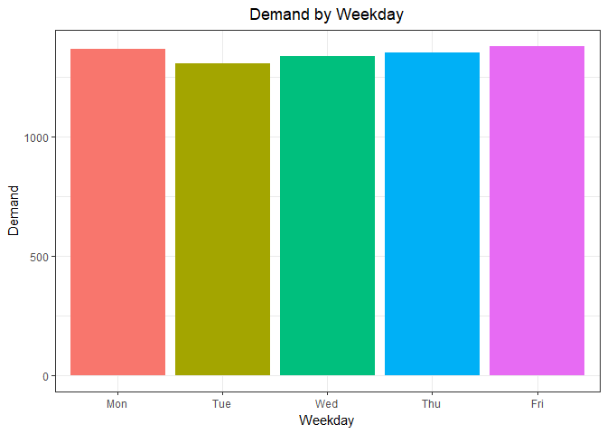

``` r
percent(prop.table(table(uber_requests$Request.wday)))[2:6]
```

    ## 
    ## Mon Tue Wed Thu Fri 
    ## 20% 19% 20% 20% 20%

*Looks like there are no major fluctations in demand between various weekdays*

**Question 8: What is the minimum, max and average duration of the trips**

``` r
summary(uber_requests$Trip.duration)
```

    ##    Min. 1st Qu.  Median    Mean 3rd Qu.    Max.    NA's 
    ##   21.00   41.00   52.00   52.41   64.00   83.00    3914

Setting the Theme for plots

``` r
plot_theme <- theme_classic() + 
  theme(plot.title = element_text(hjust = 0.5, size = 10,face = 'bold'),
        axis.title.x = element_text(size = 8),
        axis.title.y = element_text(size = 8),
        axis.text.x  = element_text(size = 6),
        axis.text.y  = element_text(size = 6))

ggplot(uber_requests %>% filter(!is.na(Trip.duration))) + 
  geom_boxplot(aes(x = Pickup.point, y = Trip.duration, fill = Pickup.point),
               show.legend = F) +
  labs(y = "Trip duration", title = "Trip duration vs Pickup Point") +
   plot_theme
```

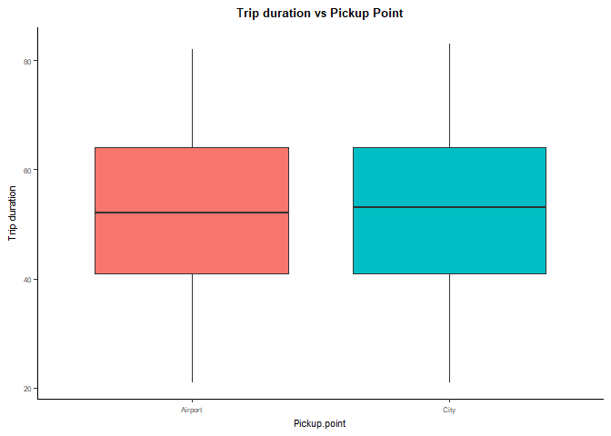

*The average trip duration is about 52 mins and there is no major variations between Airport and City*

**Question 9: What is the proportion of various Statuses?**

``` r
plot1 <- ggplot(uber_requests) +  theme_classic() + 
          plot_theme
plot1 +  geom_bar(aes(x = Status), fill = c("#F8766D","#619CFF", "#00BA38")) + 
          labs(y = "Frequency", title = "Status Vs Frequency")
```

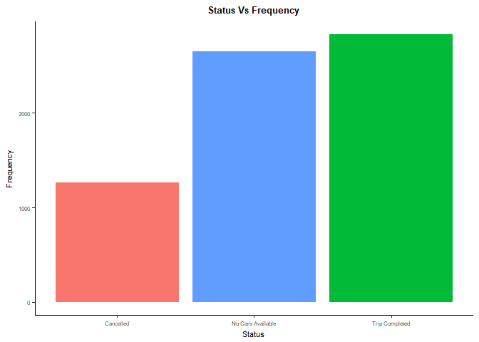

``` r
percent(prop.table(table(uber_requests$Status)),0)
```

    ## 
    ##         Cancelled No Cars Available    Trip Completed 
    ##               19%               39%               42%

**Question 10: How does the demand look like for each hour?**

``` r
plot1 +  geom_bar(aes(x = Request.hour, fill = "red"), show.legend = F) +
  labs(x = "Hour of the day", y = "Demand", title = "Hourly demand") 
```

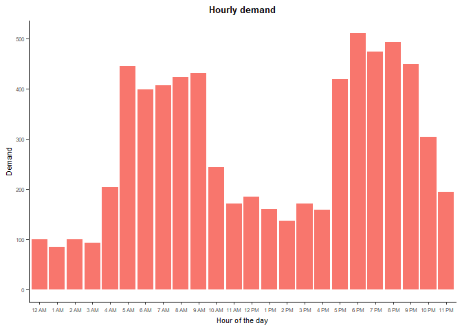

**Question 11: What are the peak hours of the requests?**

``` r
Hourly_Request_freq <-  as.data.frame(table(uber_requests$Request.hour))
ggplot(Hourly_Request_freq, aes(x = Var1, y = Freq, group = 1)) +
 geom_line(size = 1.3) +
  geom_point(size = 3) + 
  geom_point(data = filter(Hourly_Request_freq, Freq > 200), 
             col = 'red2', size = 5) +
   labs(x = "Request Hour", y = "Frequency of Requests", 
        title = "Hourly Frequency of Requests") +
    plot_theme
```

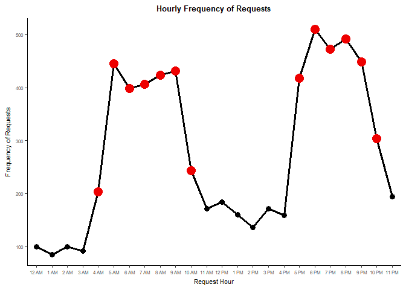

*Peak times 4 AM to 10 AM & 5 PM to 10 PM*

Lets look at the same using a Heatmap with day of the week added (day of Week v.s Hour of day)

``` r
ggplot(as.data.frame(table(uber_requests$Request.wday,
                     uber_requests$Request.hour)[2:6,]), 
       aes(x = Var2, y = Var1)) + 
 geom_tile(aes(fill = (Freq/24)),show.legend = F) + 
  scale_fill_gradient(name = 'Requests/hour', 
                      low = 'white', high = 'red2') +
   labs(y  = "Frequency of Requests",  x = "Request Hour", 
      title = "Hourly Frequency of Requests by Weekday") + 
    plot_theme
```

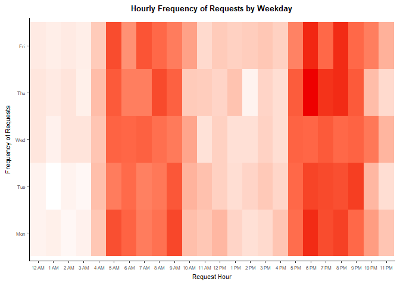

*Peak times 4 AM to 10 AM & 5 PM to 10 PM across all days*

**Question 12 : How does the peak hours look based on the pickup points?** **Question 13 : How does the status vary during the peak hours?**

``` r
plot1 + 
 geom_bar(aes(x = Request.hour, fill = Status)) + 
  labs(x = "Request time", y = "Frequency of Requests", 
      title = "Hourly Frequency of Requests by Status") +
   scale_fill_manual(values = c("#F8766D","#619CFF", "#00BA38")) +
    facet_grid(factor(uber_requests$Pickup.point, 
                      levels = c("City", "Airport"))~.) 
```

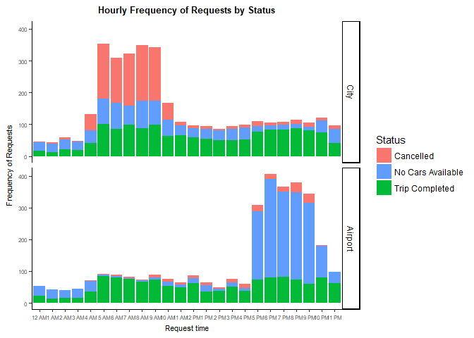

Lets quantify by looking at the same using a table in terms of proportion of status on a hourly basis using conditional formatting

``` r
uber_requests %>% group_by(Request.hour) %>% 
  summarise("Cancelled" = percent(sum(Status == "Cancelled" ) / 
                                    (count = n()),0),
            "No Cars Available" = percent(sum(Status == "No Cars Available" ) / 
                                            (count = n()), 0),
            "Trip Completed" = percent(sum(Status == "Trip Completed" ) / 
                                         (count = n()), 0),
            "Total Demand" = n()) %>%
  formattable(list(
    "Trip Completed" = color_tile("transparent", "green"),
    "Cancelled" = color_tile("transparent", "red"),
    "No Cars Available" = color_tile("transparent", "red"),
    "Total Demand" = color_tile("transparent", "red")
  ))
```

<table class="table table-condensed">
<thead>
<tr>
<th style="text-align:right;">
Request.hour
</th>
<th style="text-align:right;">
Cancelled
</th>
<th style="text-align:right;">
No Cars Available
</th>
<th style="text-align:right;">
Trip Completed
</th>
<th style="text-align:right;">
Total Demand
</th>
</tr>
</thead>
<tbody>
<tr>
<td style="text-align:right;">
12 AM
</td>
<td style="text-align:right;">
<span style="display: block; padding: 0 4px; border-radius: 4px; background-color: #fff9f9">3%</span>
</td>
<td style="text-align:right;">
<span style="display: block; padding: 0 4px; border-radius: 4px; background-color: #ff2f2f">57%</span>
</td>
<td style="text-align:right;">
<span style="display: block; padding: 0 4px; border-radius: 4px; background-color: #b4ffb4">40%</span>
</td>
<td style="text-align:right;">
<span style="display: block; padding: 0 4px; border-radius: 4px; background-color: #fff6f6">99</span>
</td>
</tr>
<tr>
<td style="text-align:right;">
1 AM
</td>
<td style="text-align:right;">
<span style="display: block; padding: 0 4px; border-radius: 4px; background-color: #ffeeee">5%</span>
</td>
<td style="text-align:right;">
<span style="display: block; padding: 0 4px; border-radius: 4px; background-color: #ff0000">66%</span>
</td>
<td style="text-align:right;">
<span style="display: block; padding: 0 4px; border-radius: 4px; background-color: #ffffff">29%</span>
</td>
<td style="text-align:right;">
<span style="display: block; padding: 0 4px; border-radius: 4px; background-color: #ffffff">85</span>
</td>
</tr>
<tr>
<td style="text-align:right;">
2 AM
</td>
<td style="text-align:right;">
<span style="display: block; padding: 0 4px; border-radius: 4px; background-color: #ffecec">5%</span>
</td>
<td style="text-align:right;">
<span style="display: block; padding: 0 4px; border-radius: 4px; background-color: #ff2a2a">58%</span>
</td>
<td style="text-align:right;">
<span style="display: block; padding: 0 4px; border-radius: 4px; background-color: #c9ffc9">37%</span>
</td>
<td style="text-align:right;">
<span style="display: block; padding: 0 4px; border-radius: 4px; background-color: #fff6f6">99</span>
</td>
</tr>
<tr>
<td style="text-align:right;">
3 AM
</td>
<td style="text-align:right;">
<span style="display: block; padding: 0 4px; border-radius: 4px; background-color: #ffffff">2%</span>
</td>
<td style="text-align:right;">
<span style="display: block; padding: 0 4px; border-radius: 4px; background-color: #ff1919">61%</span>
</td>
<td style="text-align:right;">
<span style="display: block; padding: 0 4px; border-radius: 4px; background-color: #ccffcc">37%</span>
</td>
<td style="text-align:right;">
<span style="display: block; padding: 0 4px; border-radius: 4px; background-color: #fffafa">92</span>
</td>
</tr>
<tr>
<td style="text-align:right;">
4 AM
</td>
<td style="text-align:right;">
<span style="display: block; padding: 0 4px; border-radius: 4px; background-color: #ff6c6c">25%</span>
</td>
<td style="text-align:right;">
<span style="display: block; padding: 0 4px; border-radius: 4px; background-color: #ff9595">36%</span>
</td>
<td style="text-align:right;">
<span style="display: block; padding: 0 4px; border-radius: 4px; background-color: #c2ffc2">38%</span>
</td>
<td style="text-align:right;">
<span style="display: block; padding: 0 4px; border-radius: 4px; background-color: #ffb8b8">203</span>
</td>
</tr>
<tr>
<td style="text-align:right;">
5 AM
</td>
<td style="text-align:right;">
<span style="display: block; padding: 0 4px; border-radius: 4px; background-color: #ff1010">40%</span>
</td>
<td style="text-align:right;">
<span style="display: block; padding: 0 4px; border-radius: 4px; background-color: #ffeded">19%</span>
</td>
<td style="text-align:right;">
<span style="display: block; padding: 0 4px; border-radius: 4px; background-color: #adffad">42%</span>
</td>
<td style="text-align:right;">
<span style="display: block; padding: 0 4px; border-radius: 4px; background-color: #ff2727">445</span>
</td>
</tr>
<tr>
<td style="text-align:right;">
6 AM
</td>
<td style="text-align:right;">
<span style="display: block; padding: 0 4px; border-radius: 4px; background-color: #ff2424">36%</span>
</td>
<td style="text-align:right;">
<span style="display: block; padding: 0 4px; border-radius: 4px; background-color: #ffe0e0">22%</span>
</td>
<td style="text-align:right;">
<span style="display: block; padding: 0 4px; border-radius: 4px; background-color: #aaffaa">42%</span>
</td>
<td style="text-align:right;">
<span style="display: block; padding: 0 4px; border-radius: 4px; background-color: #ff4343">398</span>
</td>
</tr>
<tr>
<td style="text-align:right;">
7 AM
</td>
<td style="text-align:right;">
<span style="display: block; padding: 0 4px; border-radius: 4px; background-color: #ff0202">42%</span>
</td>
<td style="text-align:right;">
<span style="display: block; padding: 0 4px; border-radius: 4px; background-color: #ffffff">16%</span>
</td>
<td style="text-align:right;">
<span style="display: block; padding: 0 4px; border-radius: 4px; background-color: #a4ffa4">43%</span>
</td>
<td style="text-align:right;">
<span style="display: block; padding: 0 4px; border-radius: 4px; background-color: #ff3e3e">406</span>
</td>
</tr>
<tr>
<td style="text-align:right;">
8 AM
</td>
<td style="text-align:right;">
<span style="display: block; padding: 0 4px; border-radius: 4px; background-color: #ff0000">42%</span>
</td>
<td style="text-align:right;">
<span style="display: block; padding: 0 4px; border-radius: 4px; background-color: #ffe1e1">21%</span>
</td>
<td style="text-align:right;">
<span style="display: block; padding: 0 4px; border-radius: 4px; background-color: #ceffce">37%</span>
</td>
<td style="text-align:right;">
<span style="display: block; padding: 0 4px; border-radius: 4px; background-color: #ff3434">423</span>
</td>
</tr>
<tr>
<td style="text-align:right;">
9 AM
</td>
<td style="text-align:right;">
<span style="display: block; padding: 0 4px; border-radius: 4px; background-color: #ff0909">41%</span>
</td>
<td style="text-align:right;">
<span style="display: block; padding: 0 4px; border-radius: 4px; background-color: #ffecec">19%</span>
</td>
<td style="text-align:right;">
<span style="display: block; padding: 0 4px; border-radius: 4px; background-color: #b6ffb6">40%</span>
</td>
<td style="text-align:right;">
<span style="display: block; padding: 0 4px; border-radius: 4px; background-color: #ff2f2f">431</span>
</td>
</tr>
<tr>
<td style="text-align:right;">
10 AM
</td>
<td style="text-align:right;">
<span style="display: block; padding: 0 4px; border-radius: 4px; background-color: #ff6969">26%</span>
</td>
<td style="text-align:right;">
<span style="display: block; padding: 0 4px; border-radius: 4px; background-color: #ffc6c6">27%</span>
</td>
<td style="text-align:right;">
<span style="display: block; padding: 0 4px; border-radius: 4px; background-color: #83ff83">48%</span>
</td>
<td style="text-align:right;">
<span style="display: block; padding: 0 4px; border-radius: 4px; background-color: #ffa0a0">243</span>
</td>
</tr>
<tr>
<td style="text-align:right;">
11 AM
</td>
<td style="text-align:right;">
<span style="display: block; padding: 0 4px; border-radius: 4px; background-color: #ffd4d4">9%</span>
</td>
<td style="text-align:right;">
<span style="display: block; padding: 0 4px; border-radius: 4px; background-color: #ffd4d4">24%</span>
</td>
<td style="text-align:right;">
<span style="display: block; padding: 0 4px; border-radius: 4px; background-color: #00ff00">67%</span>
</td>
<td style="text-align:right;">
<span style="display: block; padding: 0 4px; border-radius: 4px; background-color: #ffcbcb">171</span>
</td>
</tr>
<tr>
<td style="text-align:right;">
12 PM
</td>
<td style="text-align:right;">
<span style="display: block; padding: 0 4px; border-radius: 4px; background-color: #ffcaca">10%</span>
</td>
<td style="text-align:right;">
<span style="display: block; padding: 0 4px; border-radius: 4px; background-color: #ffd4d4">24%</span>
</td>
<td style="text-align:right;">
<span style="display: block; padding: 0 4px; border-radius: 4px; background-color: #0aff0a">66%</span>
</td>
<td style="text-align:right;">
<span style="display: block; padding: 0 4px; border-radius: 4px; background-color: #ffc3c3">184</span>
</td>
</tr>
<tr>
<td style="text-align:right;">
1 PM
</td>
<td style="text-align:right;">
<span style="display: block; padding: 0 4px; border-radius: 4px; background-color: #ffc5c5">11%</span>
</td>
<td style="text-align:right;">
<span style="display: block; padding: 0 4px; border-radius: 4px; background-color: #ffa5a5">33%</span>
</td>
<td style="text-align:right;">
<span style="display: block; padding: 0 4px; border-radius: 4px; background-color: #4eff4e">56%</span>
</td>
<td style="text-align:right;">
<span style="display: block; padding: 0 4px; border-radius: 4px; background-color: #ffd2d2">160</span>
</td>
</tr>
<tr>
<td style="text-align:right;">
2 PM
</td>
<td style="text-align:right;">
<span style="display: block; padding: 0 4px; border-radius: 4px; background-color: #ffd9d9">8%</span>
</td>
<td style="text-align:right;">
<span style="display: block; padding: 0 4px; border-radius: 4px; background-color: #ffc3c3">27%</span>
</td>
<td style="text-align:right;">
<span style="display: block; padding: 0 4px; border-radius: 4px; background-color: #11ff11">65%</span>
</td>
<td style="text-align:right;">
<span style="display: block; padding: 0 4px; border-radius: 4px; background-color: #ffe0e0">136</span>
</td>
</tr>
<tr>
<td style="text-align:right;">
3 PM
</td>
<td style="text-align:right;">
<span style="display: block; padding: 0 4px; border-radius: 4px; background-color: #ffbebe">12%</span>
</td>
<td style="text-align:right;">
<span style="display: block; padding: 0 4px; border-radius: 4px; background-color: #ffbfbf">28%</span>
</td>
<td style="text-align:right;">
<span style="display: block; padding: 0 4px; border-radius: 4px; background-color: #33ff33">60%</span>
</td>
<td style="text-align:right;">
<span style="display: block; padding: 0 4px; border-radius: 4px; background-color: #ffcbcb">171</span>
</td>
</tr>
<tr>
<td style="text-align:right;">
4 PM
</td>
<td style="text-align:right;">
<span style="display: block; padding: 0 4px; border-radius: 4px; background-color: #ffb4b4">14%</span>
</td>
<td style="text-align:right;">
<span style="display: block; padding: 0 4px; border-radius: 4px; background-color: #ffbbbb">29%</span>
</td>
<td style="text-align:right;">
<span style="display: block; padding: 0 4px; border-radius: 4px; background-color: #43ff43">57%</span>
</td>
<td style="text-align:right;">
<span style="display: block; padding: 0 4px; border-radius: 4px; background-color: #ffd2d2">159</span>
</td>
</tr>
<tr>
<td style="text-align:right;">
5 PM
</td>
<td style="text-align:right;">
<span style="display: block; padding: 0 4px; border-radius: 4px; background-color: #ffd7d7">8%</span>
</td>
<td style="text-align:right;">
<span style="display: block; padding: 0 4px; border-radius: 4px; background-color: #ff3434">56%</span>
</td>
<td style="text-align:right;">
<span style="display: block; padding: 0 4px; border-radius: 4px; background-color: #d1ffd1">36%</span>
</td>
<td style="text-align:right;">
<span style="display: block; padding: 0 4px; border-radius: 4px; background-color: #ff3737">418</span>
</td>
</tr>
<tr>
<td style="text-align:right;">
6 PM
</td>
<td style="text-align:right;">
<span style="display: block; padding: 0 4px; border-radius: 4px; background-color: #ffeeee">5%</span>
</td>
<td style="text-align:right;">
<span style="display: block; padding: 0 4px; border-radius: 4px; background-color: #ff0d0d">63%</span>
</td>
<td style="text-align:right;">
<span style="display: block; padding: 0 4px; border-radius: 4px; background-color: #ecffec">32%</span>
</td>
<td style="text-align:right;">
<span style="display: block; padding: 0 4px; border-radius: 4px; background-color: #ff0000">510</span>
</td>
</tr>
<tr>
<td style="text-align:right;">
7 PM
</td>
<td style="text-align:right;">
<span style="display: block; padding: 0 4px; border-radius: 4px; background-color: #ffecec">5%</span>
</td>
<td style="text-align:right;">
<span style="display: block; padding: 0 4px; border-radius: 4px; background-color: #ff1e1e">60%</span>
</td>
<td style="text-align:right;">
<span style="display: block; padding: 0 4px; border-radius: 4px; background-color: #d8ffd8">35%</span>
</td>
<td style="text-align:right;">
<span style="display: block; padding: 0 4px; border-radius: 4px; background-color: #ff1616">473</span>
</td>
</tr>
<tr>
<td style="text-align:right;">
8 PM
</td>
<td style="text-align:right;">
<span style="display: block; padding: 0 4px; border-radius: 4px; background-color: #ffd7d7">8%</span>
</td>
<td style="text-align:right;">
<span style="display: block; padding: 0 4px; border-radius: 4px; background-color: #ff2323">59%</span>
</td>
<td style="text-align:right;">
<span style="display: block; padding: 0 4px; border-radius: 4px; background-color: #e8ffe8">33%</span>
</td>
<td style="text-align:right;">
<span style="display: block; padding: 0 4px; border-radius: 4px; background-color: #ff0a0a">492</span>
</td>
</tr>
<tr>
<td style="text-align:right;">
9 PM
</td>
<td style="text-align:right;">
<span style="display: block; padding: 0 4px; border-radius: 4px; background-color: #ffd1d1">9%</span>
</td>
<td style="text-align:right;">
<span style="display: block; padding: 0 4px; border-radius: 4px; background-color: #ff2222">59%</span>
</td>
<td style="text-align:right;">
<span style="display: block; padding: 0 4px; border-radius: 4px; background-color: #f0fff0">32%</span>
</td>
<td style="text-align:right;">
<span style="display: block; padding: 0 4px; border-radius: 4px; background-color: #ff2424">449</span>
</td>
</tr>
<tr>
<td style="text-align:right;">
10 PM
</td>
<td style="text-align:right;">
<span style="display: block; padding: 0 4px; border-radius: 4px; background-color: #fff3f3">4%</span>
</td>
<td style="text-align:right;">
<span style="display: block; padding: 0 4px; border-radius: 4px; background-color: #ff6767">45%</span>
</td>
<td style="text-align:right;">
<span style="display: block; padding: 0 4px; border-radius: 4px; background-color: #6fff6f">51%</span>
</td>
<td style="text-align:right;">
<span style="display: block; padding: 0 4px; border-radius: 4px; background-color: #ff7b7b">304</span>
</td>
</tr>
<tr>
<td style="text-align:right;">
11 PM
</td>
<td style="text-align:right;">
<span style="display: block; padding: 0 4px; border-radius: 4px; background-color: #ffebeb">5%</span>
</td>
<td style="text-align:right;">
<span style="display: block; padding: 0 4px; border-radius: 4px; background-color: #ff7a7a">42%</span>
</td>
<td style="text-align:right;">
<span style="display: block; padding: 0 4px; border-radius: 4px; background-color: #5fff5f">53%</span>
</td>
<td style="text-align:right;">
<span style="display: block; padding: 0 4px; border-radius: 4px; background-color: #ffbdbd">194</span>
</td>
</tr>
</tbody>
</table>
**Summary:** Peak times &gt; 200 Requests

-   25% Cancellations @ 4 AM to 10 AM (Morning peak time)

-   45% unavailability of cars @ & 5 PM to 10 PM (Evening peak time)

*Fact to note. When we look within the demand for each hour of the day 'No cars available' seems more when compared to other status during the non peak hours (12 AM to 4 AM )too indicating that more cars are becoming unavailable after 5 PM till 4 AM. Drivers logoff for the day after say after midnight and so less cabs are available. But since the total demand duing this timeslot is less we will focus our analysis on peak hours.*

Lets segment further by creating a new variable Time.segment based on the peak hours and time slots: \* Early Morning : 12:00 AM - 3:59 AM \* Morning peak : 4:00 AM - 10:59 AM \* Late Morning : 11:00 AM - 12:00 PM \* Afternoon : 12:00 PM - 4:59 PM \* Evening peak : 5:00 PM - 9:59 PM \* Late Night : 10:00 PM - 11:59 PM

``` r
TimeSegment <-  function(x){
 if (x < 4) 
  return("Early Morning")
 else if (x >= 4 & x < 11)
  return("Morning peak")
 else if (x >= 11 & x < 12)
  return("Late Morning")
 else if (x >= 12 & x < 17)
  return("Afternoon")
 else if (x >= 17 & x < 23)
  return("Evening peak")
 else
  return("Late Night")
}

uber_requests$Time.segment <- 
  sapply(as.numeric(uber_requests$Request.hour) - 1, 
                                      TimeSegment)
```

*Factors start at level 1. The above -1 is to account for 0 (12 AM).*

Convert the new columns as factors with levels (Early Morning &lt; Morning peak ...&lt; Late Night)

``` r
uber_requests$Time.segment <-  
 factor(uber_requests$Time.segment, 
         levels = c("Early Morning", "Morning peak", "Late Morning",
                        "Afternoon", "Evening peak", "Late Night"))
```

*Question 14 : How does status look for different time segments especially during peak hours?* *Question 15 : How does the demand look like based on pickup point?*

``` r
plot2 <- ggplot(uber_requests, aes(x = Time.segment)) + plot_theme
  

plot2 +
 geom_bar(aes(fill = Status), position = "dodge") + 
  labs(x = "Time Segment", y = "Frequency of Status", 
       title = "Time Segment vs Frequency by Status") +
   scale_fill_manual(values = c("#F8766D","#619CFF", "#00BA38")) +
    facet_grid(factor(uber_requests$Pickup.point, 
                      levels = c("City", "Airport"))~.) 
```

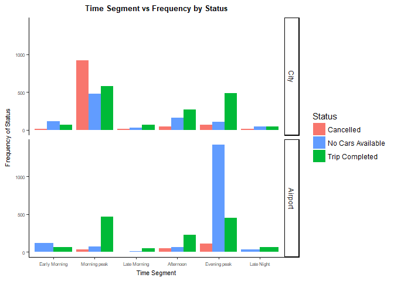

-   Challenge 1 : Morning peak hour window(4 AM to 10 AM) - Demand is higher in City. Cab Cancellations are higher.
-   Challenge 2 : Evening peak hour window(5 PM to 10 PM) - Demand is higher in Airport. Cabs unavailability is higher.

Looking at all in one. \*\*Question 16: What is the frequency of Requests based on Status for different time segments and pickup points\*

``` r
plot2 + 
 geom_bar(aes(fill = Status), position = "dodge") + 
  labs(y = "Frequency of Status", 
      title = "Time Segment vs Status Frequency by Pickup point") +
   scale_fill_manual(values = c("#F8766D","#619CFF", "#00BA38")) +
    facet_grid(Request.wday~Pickup.point) +
     plot_theme +
     theme(axis.text.x  = element_text(size = 8))
```

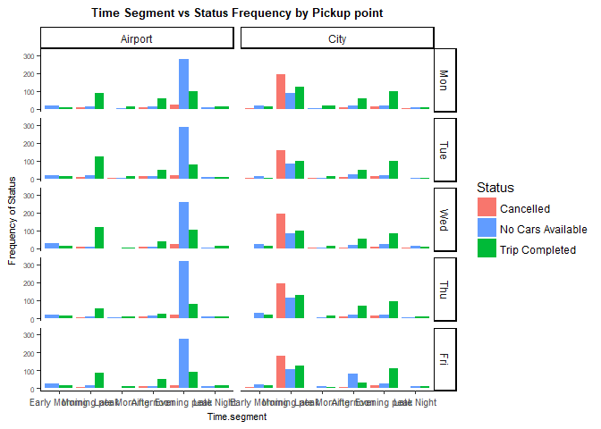

*For the given data across all days :* \* Morning peak hour window - demand is more in City with high cancellations \* Evening peak hour window - demand is more in Airport with high unavailability of cars

Segmented Analysis
------------------

Lets focus our analysis on the 2 peak hours time segment

``` r
Morning_peak_problem_set <- 
 uber_requests %>% 
  filter(Time.segment == "Morning peak")

Evening_peak_problem_set <- 
 uber_requests %>% 
  filter(Time.segment == "Evening peak")

plot3 <- ggplot() + plot_theme

plot3 + 
 geom_bar(data = Morning_peak_problem_set,
          aes(x = Status, fill = Pickup.point), 
          position = "dodge") + 
  labs(x = "Request Status", y = "Count", title = "Morning Challenge in City")
```

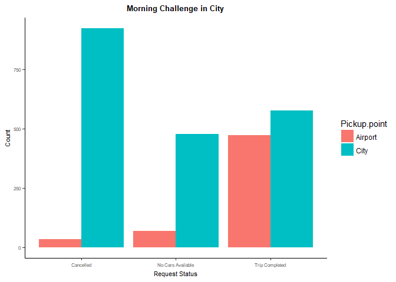

``` r
City_problem_set <-  Morning_peak_problem_set %>%
 filter(Pickup.point == "City")

plot3 + 
 geom_bar(data = Evening_peak_problem_set, 
          aes(x = Status, fill = Pickup.point),
          position = "dodge") + 
  labs(x = "Request Status", y = "Count", title = "Evening Challenge @ Airport")
```

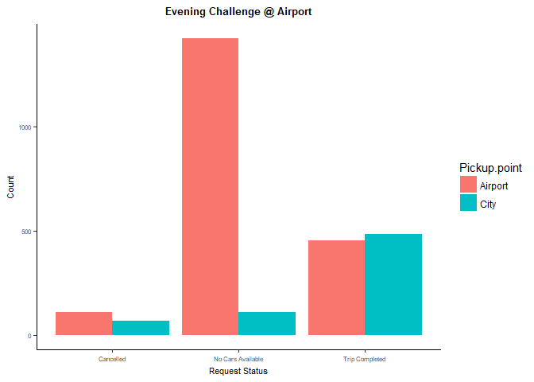

``` r
Airport_problem_set <-  Evening_peak_problem_set %>%
 filter(Pickup.point == "Airport")
```

Lets quantify the problems we have:

**Question 17: What does more (cancellations/unavailability of cars) mean? Can we quantify? How much are the numbers? i.e What is the proportion of Status during the 2 times slots?**

``` r
percent(prop.table(table(City_problem_set$Status)),0)
```

    ## 
    ##         Cancelled No Cars Available    Trip Completed 
    ##               47%               24%               29%

``` r
percent(prop.table(table(Airport_problem_set$Status)),0)
```

    ## 
    ##         Cancelled No Cars Available    Trip Completed 
    ##                5%               72%               23%

**Question 18: What is the expected average & actual average \# of trips per week(5 days) a driver takes in a week during the Morning/Evening peak hours?**

**With the available 300 drivers what is the expected average \# of trips a driver should take for the city\_problem\_set?**

``` r
round(nrow(City_problem_set)/300)
```

    ## [1] 7

**What is the current average?**

``` r
round(sum(City_problem_set$Status == "Trip Completed")/300)
```

    ## [1] 2

**With the available 300 drivers what is the expected average \# of trips a driver should take for the Airport\_problem\_set?**

``` r
round(nrow(Airport_problem_set)/300)
```

    ## [1] 7

**What is the current average?**

``` r
round(sum(Airport_problem_set$Status == "Trip Completed")/300)
```

    ## [1] 2

*As pointed out earlier we would need additional cabs/drivers to take care of the peak demand. Also If we add say 100 additional cabs/drivers the expected average trips/week would come down from 7 to 5*

``` r
round(nrow(Airport_problem_set)/(300 + 100))  # 5
```

    ## [1] 5

``` r
round(nrow(City_problem_set)/(300 + 100))     # 5
```

    ## [1] 5

**Issue 1:** No. of trips completed is only 28% and the cancellation is around 46%. Expected average trips during morning peak hours is 7 (or less if we add additional cabs/drivers) whereas average trips is only 2.

**Issue 2 :** No. of trips completed is only 22% and the cab unavailability is around 72%. Expected average trips during morning peak hours is 7 (or less if we add additional cabs/drivers) whereas average trips is only 2.

Final Summary:
--------------

**Problem 1:**

During Morning peak hour timeslot in the city:

-   Average trips completed is only 2 per week whereas expected is around 7 per week
-   Demand more than the available Cabs/Drivers.
-   47% cancellations by the drivers.

**Root cause :**

-   More outbound flights from the airport during Morning peak hours
-   Demand to reach airport from the city is more.
-   Very little inbound flights at the airport.
    -   A driver who is taking a pickup to the airport at this time may not have a customer to pickup from the airport back to the city or may have to wait a considerable amount of time to get a return pickup.
    -   During this idle time he might make money by doing other trips in the city. Hence the driver prefers not to go to the airport and cancels the trips

**Recommendations:**

-   Peak hour charges (1.25x, 1.5x, 1.75x or 2x times the base price based on the hour demand) for the customers.
-   Use the additional income from the peak hour charges

    -   To provide Weekly Incentives for drivers who take trips from city to airport during the morning peak hours.
    -   To compensate for the idle time at the airport.

-   Levy cancellation charges to drivers if they cancel more than 2 times in a week during the peak time slots.
-   Add additional Cabs/Drivers to meet the peak hour demand.
-   No. of trips based incentives if the driver completes more than the expected average \# of 7 trips per week (5 trips if additional cabs added) from city to Airport during the peak hours

**Problem 2:**

During Evening peak hour timeslot @ the Airport:

-   Average trips completed is only 2 per week whereas expected is around 7 per week.
-   Demand more than the available Cabs/Drivers.
-   72% unavailability of cabs.

**Root Cause:**

-   More incoming flights at the airport during Evening peak hours.
-   Demand @ the airport is higher.
-   Very little outbound flights from the airport.

-   The number of cabs reaching the airport during this timeslot is very less resulting in the shortage of the cabs at the Airport.
-   The drivers prefer not to go to the airport empty (without any passengers)

**Recommendations:**

-   Starting 4 PM every day, identify cabs that are in and around a set (say 5 KM) radius from airport. Flash a message on the Mobile App, indicating that they are eligible for a weekly incentive if they reach Airport and take the pickup during the peak hours at the Airport.
-   Add additional Cabs/Drivers to meet the peak hour demand.
-   No. of trips based incentives if the driver completes more than the expected average \# of 7 trips per week (5 trips if additional cabs added) from city to Airport during the peak hours.
